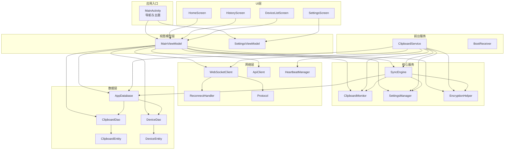
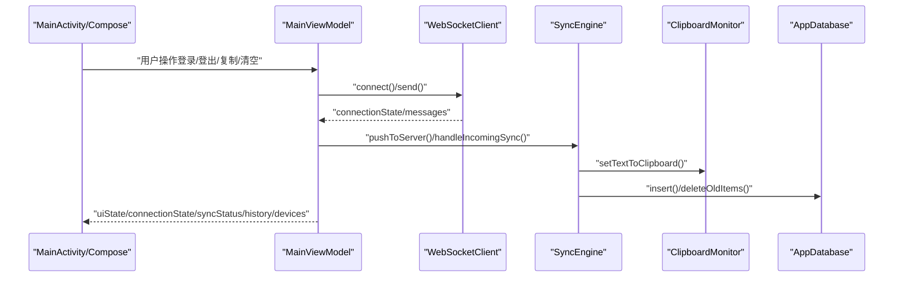
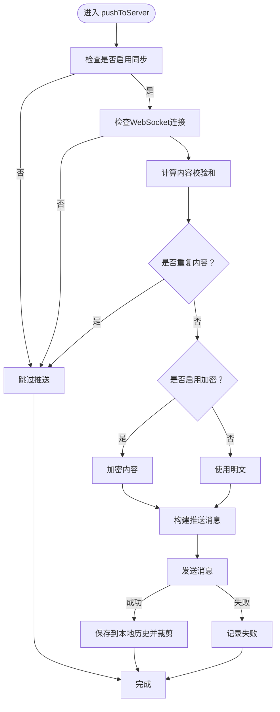
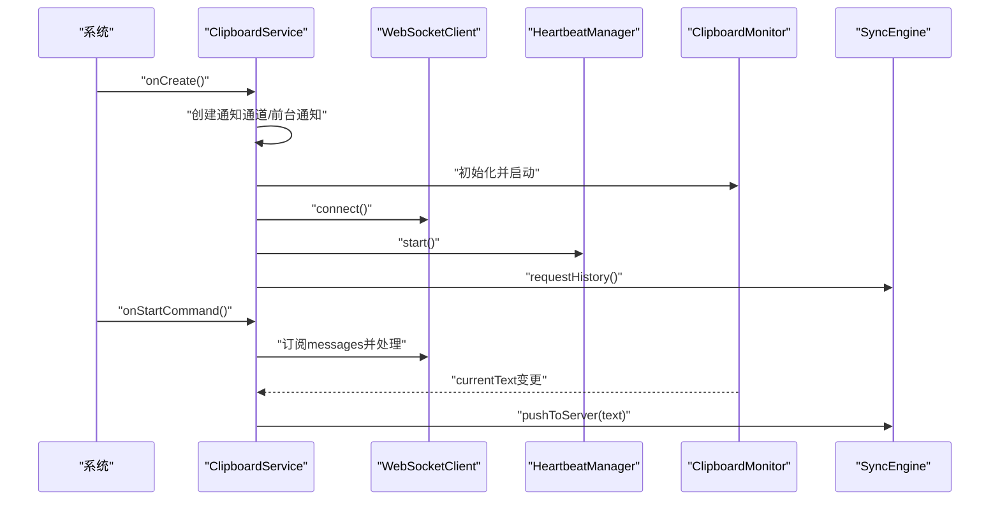
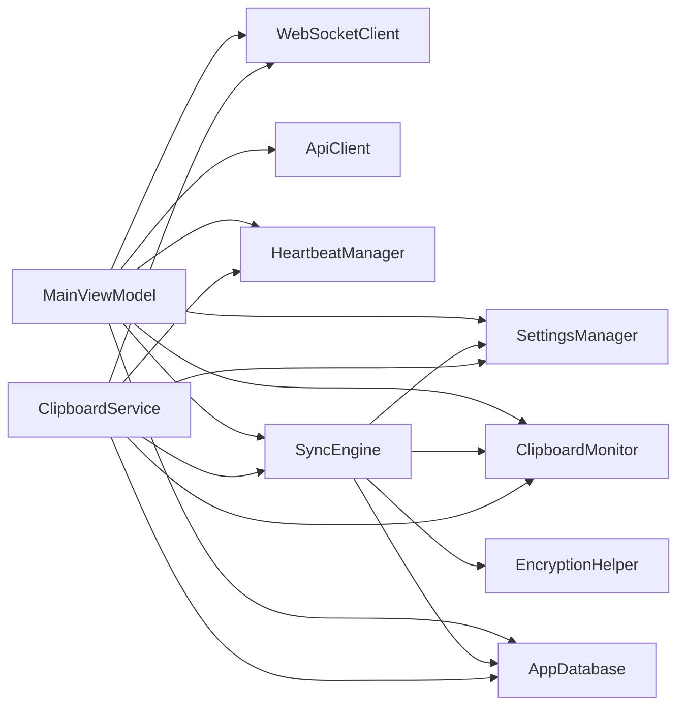

# Android客户端开发

<cite>
**本文引用的文件**
- [ClipSyncApplication.kt](file://clipSync-android/app/src/main/java/com/clipsync/app/ClipSyncApplication.kt)
- [MainActivity.kt](file://clipSync-android/app/src/main/java/com/clipsync/app/MainActivity.kt)
- [MainViewModel.kt](file://clipSync-android/app/src/main/java/com/clipsync/app/viewmodel/MainViewModel.kt)
- [SettingsViewModel.kt](file://clipSync-android/app/src/main/java/com/clipsync/app/viewmodel/SettingsViewModel.kt)
- [SyncEngine.kt](file://clipSync-android/app/src/main/java/com/clipsync/app/core/SyncEngine.kt)
- [SettingsManager.kt](file://clipSync-android/app/src/main/java/com/clipsync/app/core/SettingsManager.kt)
- [EncryptionHelper.kt](file://clipSync-android/app/src/main/java/com/clipsync/app/core/EncryptionHelper.kt)
- [ClipboardMonitor.kt](file://clipSync-android/app/src/main/java/com/clipsync/app/core/ClipboardMonitor.kt)
- [AppDatabase.kt](file://clipSync-android/app/src/main/java/com/clipsync/app/data/AppDatabase.kt)
- [ClipboardEntity.kt](file://clipSync-android/app/src/main/java/com/clipsync/app/data/entities/ClipboardEntity.kt)
- [DeviceEntity.kt](file://clipSync-android/app/src/main/java/com/clipsync/app/data/entities/DeviceEntity.kt)
- [ClipboardDao.kt](file://clipSync-android/app/src/main/java/com/clipsync/app/data/ClipboardDao.kt)
- [DeviceDao.kt](file://clipSync-android/app/src/main/java/com/clipsync/app/data/DeviceDao.kt)
- [WebSocketClient.kt](file://clipSync-android/app/src/main/java/com/clipsync/app/network/WebSocketClient.kt)
- [ApiClient.kt](file://clipSync-android/app/src/main/java/com/clipsync/app/network/ApiClient.kt)
- [Protocol.kt](file://clipSync-android/app/src/main/java/com/clipsync/app/network/Protocol.kt)
- [HeartbeatManager.kt](file://clipSync-android/app/src/main/java/com/clipsync/app/network/HeartbeatManager.kt)
- [ReconnectHandler.kt](file://clipSync-android/app/src/main/java/com/clipsync/app/network/ReconnectHandler.kt)
- [ClipboardService.kt](file://clipSync-android/app/src/main/java/com/clipsync/app/service/ClipboardService.kt)
- [BootReceiver.kt](file://clipSync-android/app/src/main/java/com/clipsync/app/service/BootReceiver.kt)
- [HomeScreen.kt](file://clipSync-android/app/src/main/java/com/clipsync/app/ui/screens/HomeScreen.kt)
- [HistoryScreen.kt](file://clipSync-android/app/src/main/java/com/clipsync/app/ui/screens/HistoryScreen.kt)
- [DeviceListScreen.kt](file://clipSync-android/app/src/main/java/com/clipsync/app/ui/screens/DeviceListScreen.kt)
- [SettingsScreen.kt](file://clipSync-android/app/src/main/java/com/clipsync/app/ui/screens/SettingsScreen.kt)
- [Theme.kt](file://clipSync-android/app/src/main/java/com/clipsync/app/ui/theme/Theme.kt)
- [AndroidManifest.xml](file://clipSync-android/app/src/main/AndroidManifest.xml)
</cite>

## 目录
1. [简介](#简介)
2. [项目结构](#项目结构)
3. [核心组件](#核心组件)
4. [架构总览](#架构总览)
5. [详细组件分析](#详细组件分析)
6. [依赖分析](#依赖分析)
7. [性能考虑](#性能考虑)
8. [故障排除指南](#故障排除指南)
9. [结论](#结论)
10. [附录](#附录)

## 简介
本项目是一个跨平台剪贴板同步客户端（Android），基于 Jetpack Compose 构建 UI，采用 MVVM 架构，结合 Kotlin 协程进行异步处理，使用 Room 数据库持久化本地历史与设备信息，并通过 WebSocket 实时通信与服务器交互。系统支持前台服务常驻运行、开机自启动、通知管理、设备列表、设置与历史记录等核心功能。

## 项目结构
Android 客户端位于 clipSync-android/app，采用按功能域分层的组织方式：
- core：核心业务逻辑（剪贴板监控、加密、设置管理、同步引擎）
- data：Room 数据库与实体、DAO
- network：WebSocket 客户端、HTTP API 客户端、协议定义、心跳与重连
- service：前台服务、开机广播接收器
- ui/screens：Jetpack Compose 屏幕组件
- viewmodel：MVVM 的 ViewModel
- ui/theme：主题与样式
- res/xml：备份与数据提取规则
- AndroidManifest.xml：权限与组件声明

图表来源
- [MainActivity.kt:1-139](file://clipSync-android/app/src/main/java/com/clipsync/app/MainActivity.kt#L1-L139)
- [MainViewModel.kt:1-359](file://clipSync-android/app/src/main/java/com/clipsync/app/viewmodel/MainViewModel.kt#L1-L359)
- [SettingsViewModel.kt:1-96](file://clipSync-android/app/src/main/java/com/clipsync/app/viewmodel/SettingsViewModel.kt#L1-L96)
- [SyncEngine.kt:1-250](file://clipSync-android/app/src/main/java/com/clipsync/app/core/SyncEngine.kt#L1-L250)
- [ClipboardMonitor.kt:1-106](file://clipSync-android/app/src/main/java/com/clipsync/app/core/ClipboardMonitor.kt#L1-L106)
- [SettingsManager.kt:1-170](file://clipSync-android/app/src/main/java/com/clipsync/app/core/SettingsManager.kt#L1-L170)
- [EncryptionHelper.kt:1-157](file://clipSync-android/app/src/main/java/com/clipsync/app/core/EncryptionHelper.kt#L1-L157)
- [AppDatabase.kt:1-41](file://clipSync-android/app/src/main/java/com/clipsync/app/data/AppDatabase.kt#L1-L41)
- [ClipboardDao.kt](file://clipSync-android/app/src/main/java/com/clipsync/app/data/ClipboardDao.kt)
- [DeviceDao.kt](file://clipSync-android/app/src/main/java/com/clipsync/app/data/DeviceDao.kt)
- [ClipboardEntity.kt:1-20](file://clipSync-android/app/src/main/java/com/clipsync/app/data/entities/ClipboardEntity.kt#L1-L20)
- [DeviceEntity.kt:1-18](file://clipSync-android/app/src/main/java/com/clipsync/app/data/entities/DeviceEntity.kt#L1-L18)
- [WebSocketClient.kt:1-156](file://clipSync-android/app/src/main/java/com/clipsync/app/network/WebSocketClient.kt#L1-L156)
- [ApiClient.kt:1-142](file://clipSync-android/app/src/main/java/com/clipsync/app/network/ApiClient.kt#L1-L142)
- [Protocol.kt](file://clipSync-android/app/src/main/java/com/clipsync/app/network/Protocol.kt)
- [HeartbeatManager.kt](file://clipSync-android/app/src/main/java/com/clipsync/app/network/HeartbeatManager.kt)
- [ReconnectHandler.kt](file://clipSync-android/app/src/main/java/com/clipsync/app/network/ReconnectHandler.kt)
- [ClipboardService.kt:1-249](file://clipSync-android/app/src/main/java/com/clipsync/app/service/ClipboardService.kt#L1-L249)
- [BootReceiver.kt](file://clipSync-android/app/src/main/java/com/clipsync/app/service/BootReceiver.kt)

章节来源
- [MainActivity.kt:1-139](file://clipSync-android/app/src/main/java/com/clipsync/app/MainActivity.kt#L1-L139)
- [ClipSyncApplication.kt:1-26](file://clipSync-android/app/src/main/java/com/clipsync/app/ClipSyncApplication.kt#L1-L26)

## 核心组件
- 应用入口与导航
  - MainActivity：负责 Compose 导航图与主题渲染，注入 MainViewModel 与 SettingsViewModel，根据登录状态决定起始页面。
  - ClipSyncApplication：全局数据库实例初始化与单例持有。
- 视图模型（MVVM）
  - MainViewModel：统一管理认证、WebSocket 连接、剪贴板推送/拉取、历史与设备列表、错误处理。
  - SettingsViewModel：封装设置项的状态流，双向绑定到 SettingsManager。
- 核心服务
  - ClipboardMonitor：系统剪贴板监听与读写，避免回环。
  - SettingsManager：基于 DataStore 的偏好存储，提供默认值与类型安全访问。
  - EncryptionHelper：AES-256-CBC 加密/解密与校验和计算。
  - SyncEngine：协调本地与远端的剪贴板同步、历史入库、去重与回显防护。
- 网络层
  - WebSocketClient：OkHttp 封装，连接生命周期、消息流、重连与心跳状态。
  - ApiClient：HTTP 客户端，登录/注册/设备管理/健康检查。
  - Protocol：消息类型与构建器（在源码中存在但未展示具体实现）。
  - HeartbeatManager/ReconnectHandler：心跳与自动重连策略。
- 数据层
  - AppDatabase：Room 数据库，提供 ClipboardDao 与 DeviceDao。
  - ClipboardEntity/DeviceEntity：本地历史与设备表实体。
- 前台服务与开机自启
  - ClipboardService：前台服务，持续监控剪贴板并同步；管理通知、心跳、消息处理。
  - BootReceiver：开机广播接收器，启动前台服务。

章节来源
- [MainActivity.kt:26-42](file://clipSync-android/app/src/main/java/com/clipsync/app/MainActivity.kt#L26-L42)
- [ClipSyncApplication.kt:10-24](file://clipSync-android/app/src/main/java/com/clipsync/app/ClipSyncApplication.kt#L10-L24)
- [MainViewModel.kt:39-81](file://clipSync-android/app/src/main/java/com/clipsync/app/viewmodel/MainViewModel.kt#L39-L81)
- [SettingsViewModel.kt:17-64](file://clipSync-android/app/src/main/java/com/clipsync/app/viewmodel/SettingsViewModel.kt#L17-L64)
- [SyncEngine.kt:27-50](file://clipSync-android/app/src/main/java/com/clipsync/app/core/SyncEngine.kt#L27-L50)
- [ClipboardMonitor.kt:15-44](file://clipSync-android/app/src/main/java/com/clipsync/app/core/ClipboardMonitor.kt#L15-L44)
- [SettingsManager.kt:21-170](file://clipSync-android/app/src/main/java/com/clipsync/app/core/SettingsManager.kt#L21-L170)
- [EncryptionHelper.kt:22-157](file://clipSync-android/app/src/main/java/com/clipsync/app/core/EncryptionHelper.kt#L22-L157)
- [AppDatabase.kt:14-40](file://clipSync-android/app/src/main/java/com/clipsync/app/data/AppDatabase.kt#L14-L40)
- [ClipboardEntity.kt:9-20](file://clipSync-android/app/src/main/java/com/clipsync/app/data/entities/ClipboardEntity.kt#L9-L20)
- [DeviceEntity.kt:9-18](file://clipSync-android/app/src/main/java/com/clipsync/app/data/entities/DeviceEntity.kt#L9-L18)
- [WebSocketClient.kt:26-145](file://clipSync-android/app/src/main/java/com/clipsync/app/network/WebSocketClient.kt#L26-L145)
- [ApiClient.kt:14-142](file://clipSync-android/app/src/main/java/com/clipsync/app/network/ApiClient.kt#L14-L142)
- [ClipboardService.kt:39-99](file://clipSync-android/app/src/main/java/com/clipsync/app/service/ClipboardService.kt#L39-L99)

## 架构总览
系统采用 MVVM + 协程 + Room + WebSocket 的组合架构：
- UI 层：Jetpack Compose 屏幕组件，通过 ViewModel 的 StateFlow 订阅状态。
- ViewModel 层：集中处理业务流程，使用协程进行异步操作，维护 UI 状态与错误信息。
- 核心服务层：剪贴板监控、设置管理、加密、同步引擎。
- 网络层：WebSocket 实时通信与 HTTP API 认证/设备管理。
- 数据层：Room 持久化本地历史与设备列表。

图表来源
- [MainActivity.kt:44-138](file://clipSync-android/app/src/main/java/com/clipsync/app/MainActivity.kt#L44-L138)
- [MainViewModel.kt:95-157](file://clipSync-android/app/src/main/java/com/clipsync/app/viewmodel/MainViewModel.kt#L95-L157)
- [WebSocketClient.kt:36-144](file://clipSync-android/app/src/main/java/com/clipsync/app/network/WebSocketClient.kt#L36-L144)
- [SyncEngine.kt:72-160](file://clipSync-android/app/src/main/java/com/clipsync/app/core/SyncEngine.kt#L72-L160)
- [ClipboardMonitor.kt:67-77](file://clipSync-android/app/src/main/java/com/clipsync/app/core/ClipboardMonitor.kt#L67-L77)
- [AppDatabase.kt:21-39](file://clipSync-android/app/src/main/java/com/clipsync/app/data/AppDatabase.kt#L21-L39)

## 详细组件分析

### 组件A：同步引擎（SyncEngine）
职责与流程
- 初始化：根据设置启用/禁用监控。
- 推送：去重校验、可选加密、拼装消息、发送至服务器并保存本地历史。
- 拉取：处理远端推送、解密、设置剪贴板、保存历史。
- 历史：请求历史、解析响应、批量入库。
- 重置：断线重连后清除去重缓存。

图表来源
- [SyncEngine.kt:72-123](file://clipSync-android/app/src/main/java/com/clipsync/app/core/SyncEngine.kt#L72-L123)
- [SyncEngine.kt:128-160](file://clipSync-android/app/src/main/java/com/clipsync/app/core/SyncEngine.kt#L128-L160)
- [SyncEngine.kt:199-203](file://clipSync-android/app/src/main/java/com/clipsync/app/core/SyncEngine.kt#L199-L203)
- [SyncEngine.kt:208-227](file://clipSync-android/app/src/main/java/com/clipsync/app/core/SyncEngine.kt#L208-L227)

章节来源
- [SyncEngine.kt:27-250](file://clipSync-android/app/src/main/java/com/clipsync/app/core/SyncEngine.kt#L27-L250)

### 组件B：前台服务（ClipboardService）
职责与流程
- 初始化：创建通知通道、启动前台通知、初始化组件（剪贴板、设置、WebSocket、心跳、数据库、同步引擎）。
- 连接与消息处理：连接服务器、订阅消息流、分发到对应处理器。
- 剪贴板监控：在允许时收集文本变化并推送。
- 生命周期：onStartCommand 返回粘性启动，onDestroy 清理资源。

图表来源
- [ClipboardService.kt:52-82](file://clipSync-android/app/src/main/java/com/clipsync/app/service/ClipboardService.kt#L52-L82)
- [ClipboardService.kt:131-144](file://clipSync-android/app/src/main/java/com/clipsync/app/service/ClipboardService.kt#L131-L144)
- [ClipboardService.kt:146-167](file://clipSync-android/app/src/main/java/com/clipsync/app/service/ClipboardService.kt#L146-L167)
- [ClipboardService.kt:211-227](file://clipSync-android/app/src/main/java/com/clipsync/app/service/ClipboardService.kt#L211-L227)

章节来源
- [ClipboardService.kt:39-249](file://clipSync-android/app/src/main/java/com/clipsync/app/service/ClipboardService.kt#L39-L249)

### 组件C：设置管理（SettingsManager）
职责与特性
- 使用 DataStore Preferences 存储键值对，提供 Flow 形态的实时状态。
- 默认值：WebSocket 与 HTTP 地址。
- 设备标识：首次使用生成 UUID 并持久化。
- 类型安全：字符串/布尔值键名封装，提供 get/set 方法。

章节来源
- [SettingsManager.kt:21-170](file://clipSync-android/app/src/main/java/com/clipsync/app/core/SettingsManager.kt#L21-L170)

### 组件D：剪贴板监控（ClipboardMonitor）
职责与特性
- 监听系统剪贴板变化，过滤空内容与重复内容，避免回环。
- 提供当前文本读取与设置方法，设置时更新内部 lastContent 防止回环。

章节来源
- [ClipboardMonitor.kt:15-106](file://clipSync-android/app/src/main/java/com/clipsync/app/core/ClipboardMonitor.kt#L15-L106)

### 组件E：数据库与实体（AppDatabase、ClipboardEntity、DeviceEntity）
职责与特性
- AppDatabase：Room 数据库，暴露 ClipboardDao 与 DeviceDao。
- ClipboardEntity：本地历史表，包含内容、类型、来源设备、时间戳等。
- DeviceEntity：已知设备表，包含设备 ID、名称、平台、在线状态与最后在线时间。

章节来源
- [AppDatabase.kt:14-40](file://clipSync-android/app/src/main/java/com/clipsync/app/data/AppDatabase.kt#L14-L40)
- [ClipboardEntity.kt:9-20](file://clipSync-android/app/src/main/java/com/clipsync/app/data/entities/ClipboardEntity.kt#L9-L20)
- [DeviceEntity.kt:9-18](file://clipSync-android/app/src/main/java/com/clipsync/app/data/entities/DeviceEntity.kt#L9-L18)

### 组件F：网络层（WebSocketClient、ApiClient、Protocol、HeartbeatManager、ReconnectHandler）
职责与特性
- WebSocketClient：连接状态管理、消息流、发送、断开、心跳状态。
- ApiClient：登录/注册/刷新令牌/设备列表/注销/健康检查，统一 JSON 编解码与错误处理。
- Protocol：消息类型与构建器（在源码中存在但未展示具体实现）。
- HeartbeatManager/ReconnectHandler：心跳与自动重连策略。

章节来源
- [WebSocketClient.kt:26-145](file://clipSync-android/app/src/main/java/com/clipsync/app/network/WebSocketClient.kt#L26-L145)
- [ApiClient.kt:14-142](file://clipSync-android/app/src/main/java/com/clipsync/app/network/ApiClient.kt#L14-L142)
- [HeartbeatManager.kt](file://clipSync-android/app/src/main/java/com/clipsync/app/network/HeartbeatManager.kt)
- [ReconnectHandler.kt](file://clipSync-android/app/src/main/java/com/clipsync/app/network/ReconnectHandler.kt)

### 组件G：UI 屏幕（HomeScreen、HistoryScreen、DeviceListScreen、SettingsScreen）
职责与特性
- HomeScreen：显示连接状态、同步状态、用户信息，底部导航跳转到其他页面。
- HistoryScreen：展示本地历史，支持复制与清空。
- DeviceListScreen：展示设备列表，支持刷新与注销。
- SettingsScreen：编辑服务器地址、HTTP 地址、同步开关、加密开关、设备名称，支持清空历史与登出。

章节来源
- [HomeScreen.kt:62-270](file://clipSync-android/app/src/main/java/com/clipsync/app/ui/screens/HomeScreen.kt#L62-L270)
- [HistoryScreen.kt:35-149](file://clipSync-android/app/src/main/java/com/clipsync/app/ui/screens/HistoryScreen.kt#L35-L149)
- [DeviceListScreen.kt:43-182](file://clipSync-android/app/src/main/java/com/clipsync/app/ui/screens/DeviceListScreen.kt#L43-L182)
- [SettingsScreen.kt:30-229](file://clipSync-android/app/src/main/java/com/clipsync/app/ui/screens/SettingsScreen.kt#L30-L229)

## 依赖分析
- 组件耦合
  - MainViewModel 依赖 SettingsManager、WebSocketClient、ClipboardMonitor、ApiClient、HeartbeatManager、SyncEngine、AppDatabase。
  - SyncEngine 依赖 ClipboardMonitor、SettingsManager、WebSocketClient、AppDatabase、EncryptionHelper。
  - ClipboardService 依赖 ClipboardMonitor、SettingsManager、WebSocketClient、HeartbeatManager、SyncEngine、AppDatabase。
- 外部依赖
  - OkHttp（WebSocket）、Room（数据库）、Kotlinx Serialization（JSON）、DataStore（偏好）、Jetpack Compose（UI）。
- 潜在循环依赖
  - 通过参数注入避免直接互相引用，保持清晰的单向依赖。

图表来源
- [MainViewModel.kt:41-53](file://clipSync-android/app/src/main/java/com/clipsync/app/viewmodel/MainViewModel.kt#L41-L53)
- [SyncEngine.kt:27-32](file://clipSync-android/app/src/main/java/com/clipsync/app/core/SyncEngine.kt#L27-L32)
- [ClipboardService.kt:63-68](file://clipSync-android/app/src/main/java/com/clipsync/app/service/ClipboardService.kt#L63-L68)

章节来源
- [MainViewModel.kt:41-53](file://clipSync-android/app/src/main/java/com/clipsync/app/viewmodel/MainViewModel.kt#L41-L53)
- [SyncEngine.kt:27-32](file://clipSync-android/app/src/main/java/com/clipsync/app/core/SyncEngine.kt#L27-L32)
- [ClipboardService.kt:63-68](file://clipSync-android/app/src/main/java/com/clipsync/app/service/ClipboardService.kt#L63-L68)

## 性能考虑
- 协程与作用域
  - 使用 SupervisorJob + Dispatchers.IO 隔离异常，避免任务级联崩溃。
  - ViewModel 与 Service 分别持有独立作用域，确保生命周期可控。
- 去重与限流
  - SyncEngine 对推送内容进行校验和去重，减少无效传输。
  - 历史入库后限制保留数量，避免无限增长。
- 网络优化
  - WebSocket ping 间隔与连接超时合理配置，配合 ReconnectHandler 自动恢复。
  - ApiClient 使用连接复用与错误流读取，避免阻塞主线程。
- UI 流畅性
  - Compose 使用 collectAsStateWithLifecycle 与 rememberNavController，避免重组抖动。
  - 列表使用 LazyColumn，仅渲染可见项。

## 故障排除指南
- 无法连接服务器
  - 检查 SettingsManager 中的服务器地址与 HTTP 地址是否正确。
  - 查看 WebSocketClient 的连接状态与日志输出。
  - 确认 ApiClient 的 baseUrl 已更新。
- 登录失败
  - 检查 ApiClient 返回的错误信息，确认用户名/密码/设备名是否正确。
  - 确认 SettingsManager 是否成功写入 token 与 device_id。
- 剪贴板不同步
  - 确认 SyncEngine 的同步开关与连接状态。
  - 检查 ClipboardMonitor 是否正常监听，避免回环导致的事件丢失。
- 历史为空
  - 确认已请求历史并收到 ClipboardHistory 消息。
  - 检查 AppDatabase 的 ClipboardDao 是否成功插入数据。
- 前台服务未启动或被杀死
  - 检查 ClipboardService 的 onStartCommand 返回值与通知通道创建。
  - 确认 AndroidManifest 权限与前台服务声明。
  - 开机自启动需检查 BootReceiver 是否注册并正确启动服务。

章节来源
- [MainViewModel.kt:159-177](file://clipSync-android/app/src/main/java/com/clipsync/app/viewmodel/MainViewModel.kt#L159-L177)
- [SyncEngine.kt:208-227](file://clipSync-android/app/src/main/java/com/clipsync/app/core/SyncEngine.kt#L208-L227)
- [ClipboardService.kt:131-144](file://clipSync-android/app/src/main/java/com/clipsync/app/service/ClipboardService.kt#L131-L144)

## 结论
该 Android 客户端以 MVVM 为核心，结合协程与 Jetpack Compose，实现了稳定高效的剪贴板同步体验。通过前台服务与通知保障后台运行，配合 Room 与 DataStore 实现本地持久化，整体架构清晰、扩展性强，适合进一步完善安全策略（如用户可配置加密口令）与多端一致性。

## 附录

### 配置选项与参数说明
- 设置项（SettingsManager）
  - 服务器 WebSocket 地址：字符串，默认开发地址。
  - HTTP 地址：字符串，默认开发地址。
  - 用户名：字符串。
  - Token：字符串。
  - 设备 ID：字符串（首次自动生成）。
  - 设备名称：字符串（默认设备型号）。
  - 同步开关：布尔值，默认开启。
  - 加密开关：布尔值，默认关闭。
- 视图模型输入
  - MainViewModel.login/register：服务器地址、HTTP 地址、用户名、密码、设备名。
  - SettingsViewModel：setServerUrl/setHttpUrl/setSyncEnabled/setEncryptionEnabled/setDeviceName。
- 同步引擎参数
  - pushToServer：内容字符串。
  - handleIncomingSync：payload（包含内容、来源设备、是否加密、校验和）。
  - requestHistory：limit（默认 20）。
- 数据库实体
  - ClipboardEntity：内容、类型、校验和、来源设备、来源设备名、创建时间。
  - DeviceEntity：设备 ID、设备名、平台、最后在线时间、在线状态。

章节来源
- [SettingsManager.kt:39-154](file://clipSync-android/app/src/main/java/com/clipsync/app/core/SettingsManager.kt#L39-L154)
- [MainViewModel.kt:205-271](file://clipSync-android/app/src/main/java/com/clipsync/app/viewmodel/MainViewModel.kt#L205-L271)
- [SyncEngine.kt:72-160](file://clipSync-android/app/src/main/java/com/clipsync/app/core/SyncEngine.kt#L72-L160)
- [ClipboardEntity.kt:10-19](file://clipSync-android/app/src/main/java/com/clipsync/app/data/entities/ClipboardEntity.kt#L10-L19)
- [DeviceEntity.kt:10-17](file://clipSync-android/app/src/main/java/com/clipsync/app/data/entities/DeviceEntity.kt#L10-L17)