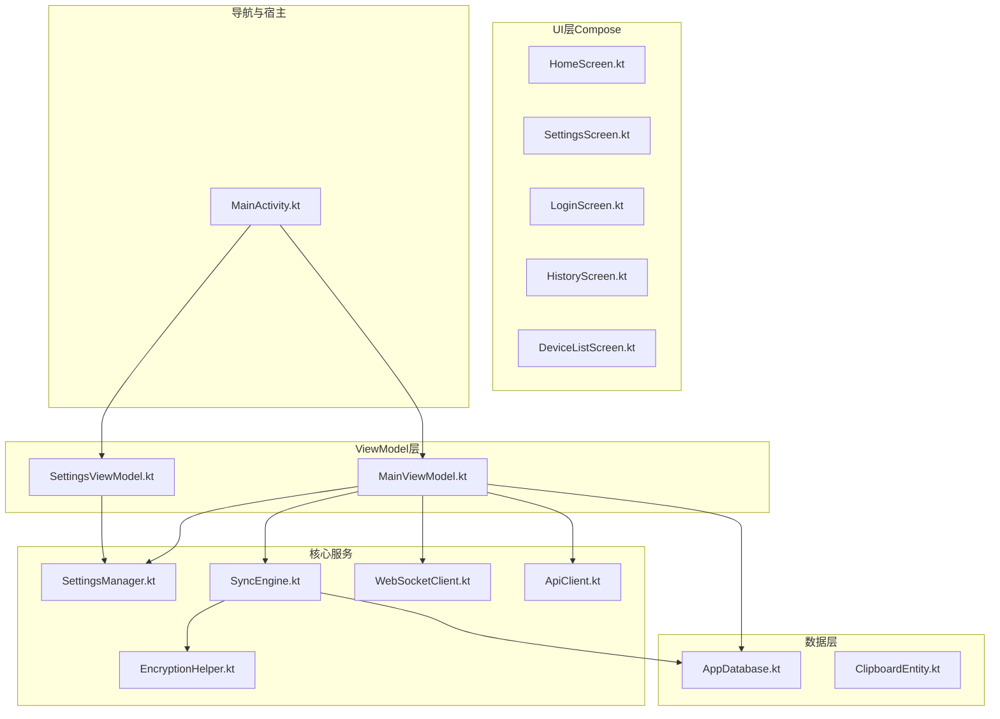
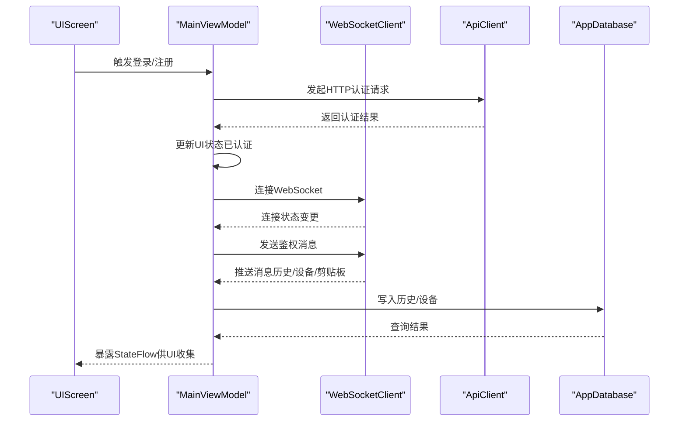
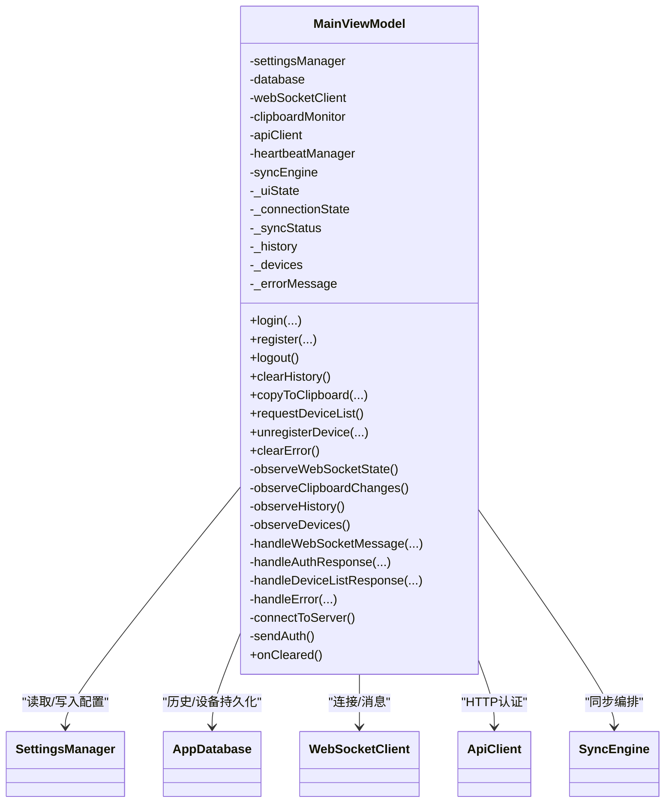
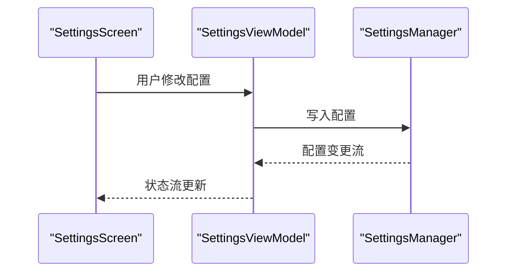
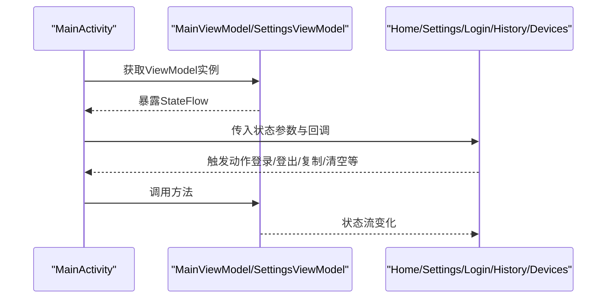
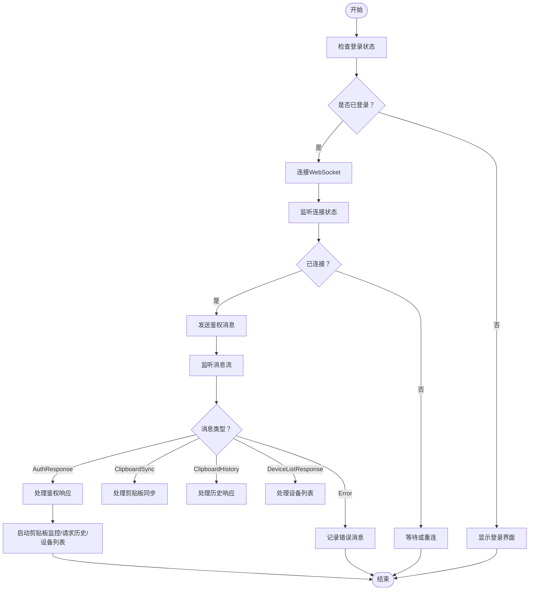
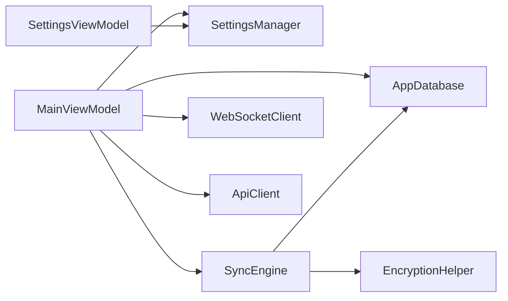

# MVVM模式实现

<cite>
**本文引用的文件**
- [MainViewModel.kt](file://clipSync-android/app/src/main/java/com/clipsync/app/viewmodel/MainViewModel.kt)
- [SettingsViewModel.kt](file://clipSync-android/app/src/main/java/com/clipsync/app/viewmodel/SettingsViewModel.kt)
- [MainActivity.kt](file://clipSync-android/app/src/main/java/com/clipsync/app/MainActivity.kt)
- [HomeScreen.kt](file://clipSync-android/app/src/main/java/com/clipsync/app/ui/screens/HomeScreen.kt)
- [SettingsScreen.kt](file://clipSync-android/app/src/main/java/com/clipsync/app/ui/screens/SettingsScreen.kt)
- [LoginScreen.kt](file://clipSync-android/app/src/main/java/com/clipsync/app/ui/screens/LoginScreen.kt)
- [HistoryScreen.kt](file://clipSync-android/app/src/main/java/com/clipsync/app/ui/screens/HistoryScreen.kt)
- [DeviceListScreen.kt](file://clipSync-android/app/src/main/java/com/clipsync/app/ui/screens/DeviceListScreen.kt)
- [AppDatabase.kt](file://clipSync-android/app/src/main/java/com/clipsync/app/data/AppDatabase.kt)
- [ClipboardEntity.kt](file://clipSync-android/app/src/main/java/com/clipsync/app/data/entities/ClipboardEntity.kt)
- [SettingsManager.kt](file://clipSync-android/app/src/main/java/com/clipsync/app/core/SettingsManager.kt)
- [WebSocketClient.kt](file://clipSync-android/app/src/main/java/com/clipsync/app/network/WebSocketClient.kt)
- [ApiClient.kt](file://clipSync-android/app/src/main/java/com/clipsync/app/network/ApiClient.kt)
- [SyncEngine.kt](file://clipSync-android/app/src/main/java/com/clipsync/app/core/SyncEngine.kt)
- [EncryptionHelper.kt](file://clipSync-android/app/src/main/java/com/clipsync/app/core/EncryptionHelper.kt)
</cite>

## 目录
1. [引言](#引言)
2. [项目结构](#项目结构)
3. [核心组件](#核心组件)
4. [架构总览](#架构总览)
5. [详细组件分析](#详细组件分析)
6. [依赖关系分析](#依赖关系分析)
7. [性能考量](#性能考量)
8. [故障排查指南](#故障排查指南)
9. [结论](#结论)
10. [附录](#附录)

## 引言
本文件围绕Android平台的MVVM架构实现，系统性阐述MainViewModel与SettingsViewModel的设计原理、状态管理机制、数据绑定模式与生命周期管理。文档重点覆盖以下方面：
- ViewModel职责划分：认证登录、WebSocket连接与消息处理、剪贴板同步、历史记录与设备管理；设置项的读取与写入。
- 状态封装与生命周期：使用StateFlow/SharedFlow进行状态暴露，结合viewModelScope与collectAsStateWithLifecycle实现UI与生命周期感知的数据流。
- 数据流向与组件解耦：通过SettingsManager、AppDatabase、WebSocketClient、SyncEngine等模块化组件，实现清晰的职责边界与低耦合。
- 实战示例与最佳实践：包括状态转换逻辑、错误处理机制、状态持久化、内存优化与测试友好设计。
- 常见问题与调试技巧：连接状态、消息去重、加密传输、历史记录截断等。

## 项目结构
Android端采用Compose + MVVM架构，ViewModel位于viewmodel包，UI层位于ui/screens，核心业务逻辑位于core与network包，数据存储位于data包。

图表来源
- [MainActivity.kt:26-42](file://clipSync-android/app/src/main/java/com/clipsync/app/MainActivity.kt#L26-L42)
- [MainViewModel.kt:39-53](file://clipSync-android/app/src/main/java/com/clipsync/app/viewmodel/MainViewModel.kt#L39-L53)
- [SettingsViewModel.kt:17-19](file://clipSync-android/app/src/main/java/com/clipsync/app/viewmodel/SettingsViewModel.kt#L17-L19)
- [SettingsManager.kt:21-169](file://clipSync-android/app/src/main/java/com/clipsync/app/core/SettingsManager.kt#L21-L169)
- [SyncEngine.kt:27-32](file://clipSync-android/app/src/main/java/com/clipsync/app/core/SyncEngine.kt#L27-L32)
- [WebSocketClient.kt:26-44](file://clipSync-android/app/src/main/java/com/clipsync/app/network/WebSocketClient.kt#L26-L44)
- [ApiClient.kt:14-142](file://clipSync-android/app/src/main/java/com/clipsync/app/network/ApiClient.kt#L14-L142)
- [AppDatabase.kt:14-39](file://clipSync-android/app/src/main/java/com/clipsync/app/data/AppDatabase.kt#L14-L39)
- [ClipboardEntity.kt:9-19](file://clipSync-android/app/src/main/java/com/clipsync/app/data/entities/ClipboardEntity.kt#L9-L19)

章节来源
- [MainActivity.kt:26-42](file://clipSync-android/app/src/main/java/com/clipsync/app/MainActivity.kt#L26-L42)
- [MainViewModel.kt:39-81](file://clipSync-android/app/src/main/java/com/clipsync/app/viewmodel/MainViewModel.kt#L39-L81)
- [SettingsViewModel.kt:17-41](file://clipSync-android/app/src/main/java/com/clipsync/app/viewmodel/SettingsViewModel.kt#L17-L41)

## 核心组件
- MainViewModel：负责认证流程、WebSocket连接与消息分发、剪贴板监控与同步、历史记录与设备列表管理、错误状态暴露与清理资源。
- SettingsViewModel：负责从SettingsManager读取与写入服务器URL、HTTP URL、同步开关、加密开关、设备名称与用户名等配置项。
- SettingsManager：基于DataStore Preferences提供键值型配置的异步流式读写，支持默认值与设备ID生成。
- SyncEngine：协调本地剪贴板变化与远端同步，处理推送/拉取、去重、加解密、历史入库与截断。
- WebSocketClient：OkHttp封装的WebSocket客户端，提供连接状态与消息流，内置重连与心跳适配。
- ApiClient：基于HttpURLConnection的轻量HTTP客户端，提供认证、设备列表与注销等接口调用。
- AppDatabase与ClipboardEntity：Room数据库与实体，用于本地历史记录持久化。

章节来源
- [MainViewModel.kt:39-348](file://clipSync-android/app/src/main/java/com/clipsync/app/viewmodel/MainViewModel.kt#L39-L348)
- [SettingsViewModel.kt:17-95](file://clipSync-android/app/src/main/java/com/clipsync/app/viewmodel/SettingsViewModel.kt#L17-L95)
- [SettingsManager.kt:21-169](file://clipSync-android/app/src/main/java/com/clipsync/app/core/SettingsManager.kt#L21-L169)
- [SyncEngine.kt:27-239](file://clipSync-android/app/src/main/java/com/clipsync/app/core/SyncEngine.kt#L27-L239)
- [WebSocketClient.kt:26-145](file://clipSync-android/app/src/main/java/com/clipsync/app/network/WebSocketClient.kt#L26-L145)
- [ApiClient.kt:14-142](file://clipSync-android/app/src/main/java/com/clipsync/app/network/ApiClient.kt#L14-L142)
- [AppDatabase.kt:14-39](file://clipSync-android/app/src/main/java/com/clipsync/app/data/AppDatabase.kt#L14-L39)
- [ClipboardEntity.kt:9-19](file://clipSync-android/app/src/main/java/com/clipsync/app/data/entities/ClipboardEntity.kt#L9-L19)

## 架构总览
MVVM在本项目中的落地要点：
- Model层：SettingsManager、AppDatabase、SyncEngine、WebSocketClient、ApiClient、EncryptionHelper。
- View层：各Screen以Compose函数形式呈现，通过collectAsStateWithLifecycle订阅ViewModel状态。
- ViewModel层：MainViewModel与SettingsViewModel作为状态中心，统一调度Model层并暴露给View层。

图表来源
- [MainActivity.kt:44-138](file://clipSync-android/app/src/main/java/com/clipsync/app/MainActivity.kt#L44-L138)
- [MainViewModel.kt:205-271](file://clipSync-android/app/src/main/java/com/clipsync/app/viewmodel/MainViewModel.kt#L205-L271)
- [WebSocketClient.kt:83-103](file://clipSync-android/app/src/main/java/com/clipsync/app/network/WebSocketClient.kt#L83-L103)
- [ApiClient.kt:23-46](file://clipSync-android/app/src/main/java/com/clipsync/app/network/ApiClient.kt#L23-L46)
- [AppDatabase.kt:30-38](file://clipSync-android/app/src/main/java/com/clipsync/app/data/AppDatabase.kt#L30-L38)

## 详细组件分析

### MainViewModel 设计与状态管理
- 职责划分
  - 认证与会话：登录/注册/登出，维护令牌与设备ID，切换UI状态。
  - 连接与消息：监听WebSocket连接状态与消息流，处理鉴权、心跳、剪贴板同步、历史拉取、设备列表。
  - 同步引擎：触发推送、处理远端同步、历史入库与截断。
  - 历史与设备：查询本地历史与设备列表，提供清空历史、复制到剪贴板、注销设备等操作。
  - 生命周期：onCleared中停止监控、停止心跳、断开WebSocket，避免资源泄漏。
- 状态封装
  - 使用MutableStateFlow封装MainUiState（Loading/Unauthenticated/LoggingIn/Authenticated）、ConnectionState（Connected/Connecting/Disconnected/Error）、SyncStatus（Idle/Active/Paused/Error）、历史列表、设备列表与错误消息。
  - 通过asStateFlow对外暴露只读状态流，确保UI侧只能观察状态变化。
- 生命周期管理
  - 所有协程任务均在viewModelScope中执行，随ViewModel销毁自动取消，避免内存泄漏。
  - 初始化时启动观察：WebSocket状态、剪贴板变化、历史与设备列表。
- 状态转换逻辑
  - 登录成功后进入已认证状态，建立WebSocket连接并发送鉴权消息；失败则显示错误并保持未认证状态。
  - 连接断开时停止心跳与监控，避免无效操作。
  - 收到鉴权成功后启动剪贴板监控、请求历史与设备列表。
- 错误处理机制
  - HTTP错误与WebSocket错误分别设置errorMessage，UI可展示并支持清除。
  - 对于解密失败、消息格式异常等情况，记录日志并跳过处理，避免崩溃。
- 数据流向与解耦
  - 通过SettingsManager读取/写入配置，通过AppDatabase进行本地持久化，通过SyncEngine协调同步，通过WebSocketClient与ApiClient进行网络交互，职责清晰、耦合度低。

图表来源
- [MainViewModel.kt:39-348](file://clipSync-android/app/src/main/java/com/clipsync/app/viewmodel/MainViewModel.kt#L39-L348)
- [SettingsManager.kt:21-169](file://clipSync-android/app/src/main/java/com/clipsync/app/core/SettingsManager.kt#L21-L169)
- [AppDatabase.kt:14-39](file://clipSync-android/app/src/main/java/com/clipsync/app/data/AppDatabase.kt#L14-L39)
- [WebSocketClient.kt:26-145](file://clipSync-android/app/src/main/java/com/clipsync/app/network/WebSocketClient.kt#L26-L145)
- [ApiClient.kt:14-142](file://clipSync-android/app/src/main/java/com/clipsync/app/network/ApiClient.kt#L14-L142)
- [SyncEngine.kt:27-239](file://clipSync-android/app/src/main/java/com/clipsync/app/core/SyncEngine.kt#L27-L239)

章节来源
- [MainViewModel.kt:39-348](file://clipSync-android/app/src/main/java/com/clipsync/app/viewmodel/MainViewModel.kt#L39-L348)

### SettingsViewModel 设计与状态管理
- 职责划分
  - 从SettingsManager读取服务器URL、HTTP URL、同步开关、加密开关、设备名称与用户名等配置项。
  - 将用户输入写回SettingsManager，实现配置的双向绑定。
- 状态封装
  - 使用多个MutableStateFlow封装字符串与布尔值，通过asStateFlow对外暴露。
- 生命周期管理
  - 初始化时启动多个协程并发收集SettingsManager的Flow并更新本地状态。
- 数据流向与解耦
  - 通过SettingsManager集中管理配置，ViewModel仅承担状态桥接职责，降低UI与存储之间的耦合。

图表来源
- [SettingsViewModel.kt:17-95](file://clipSync-android/app/src/main/java/com/clipsync/app/viewmodel/SettingsViewModel.kt#L17-L95)
- [SettingsManager.kt:39-126](file://clipSync-android/app/src/main/java/com/clipsync/app/core/SettingsManager.kt#L39-L126)

章节来源
- [SettingsViewModel.kt:17-95](file://clipSync-android/app/src/main/java/com/clipsync/app/viewmodel/SettingsViewModel.kt#L17-L95)

### 数据绑定与UI集成
- MainActivity通过viewModels()创建MainViewModel与SettingsViewModel实例，并在ClipSyncApp中使用collectAsStateWithLifecycle收集状态，实现UI与生命周期感知的数据绑定。
- 各Screen接收来自ViewModel的状态参数，如连接状态、同步状态、历史列表、设备列表、错误消息与配置项，并通过回调触发ViewModel动作。

图表来源
- [MainActivity.kt:28-41](file://clipSync-android/app/src/main/java/com/clipsync/app/MainActivity.kt#L28-L41)
- [MainActivity.kt:44-138](file://clipSync-android/app/src/main/java/com/clipsync/app/MainActivity.kt#L44-L138)
- [HomeScreen.kt:62-270](file://clipSync-android/app/src/main/java/com/clipsync/app/ui/screens/HomeScreen.kt#L62-L270)
- [SettingsScreen.kt:29-175](file://clipSync-android/app/src/main/java/com/clipsync/app/ui/screens/SettingsScreen.kt#L29-L175)
- [LoginScreen.kt:50-291](file://clipSync-android/app/src/main/java/com/clipsync/app/ui/screens/LoginScreen.kt#L50-L291)
- [HistoryScreen.kt:34-149](file://clipSync-android/app/src/main/java/com/clipsync/app/ui/screens/HistoryScreen.kt#L34-L149)
- [DeviceListScreen.kt:42-182](file://clipSync-android/app/src/main/java/com/clipsync/app/ui/screens/DeviceListScreen.kt#L42-L182)

章节来源
- [MainActivity.kt:44-138](file://clipSync-android/app/src/main/java/com/clipsync/app/MainActivity.kt#L44-L138)

### 状态转换与错误处理流程
- 登录/注册流程
  - 设置服务器URL与HTTP URL，发起认证请求，根据结果更新UI状态与错误消息，随后连接WebSocket并发送鉴权消息。
- WebSocket消息处理
  - 根据消息类型分派至鉴权响应、心跳确认、剪贴板同步、历史响应、设备列表与错误处理。
- 错误处理
  - HTTP错误与WebSocket错误分别设置errorMessage，支持UI清除。
  - 解密失败或消息格式异常时记录日志并跳过处理。

图表来源
- [MainViewModel.kt:83-93](file://clipSync-android/app/src/main/java/com/clipsync/app/viewmodel/MainViewModel.kt#L83-L93)
- [MainViewModel.kt:95-116](file://clipSync-android/app/src/main/java/com/clipsync/app/viewmodel/MainViewModel.kt#L95-L116)
- [MainViewModel.kt:144-157](file://clipSync-android/app/src/main/java/com/clipsync/app/viewmodel/MainViewModel.kt#L144-L157)
- [MainViewModel.kt:159-177](file://clipSync-android/app/src/main/java/com/clipsync/app/viewmodel/MainViewModel.kt#L159-L177)
- [MainViewModel.kt:196-201](file://clipSync-android/app/src/main/java/com/clipsync/app/viewmodel/MainViewModel.kt#L196-L201)

章节来源
- [MainViewModel.kt:83-201](file://clipSync-android/app/src/main/java/com/clipsync/app/viewmodel/MainViewModel.kt#L83-L201)

### 数据持久化与内存优化
- 状态持久化
  - SettingsManager使用DataStore Preferences持久化配置，支持默认值与设备ID自动生成，保证重启后状态一致。
  - AppDatabase使用Room持久化剪贴板历史，限制历史数量并按时间截断，避免无限增长。
- 内存优化
  - 所有协程在viewModelScope中运行，随ViewModel销毁自动取消，避免泄漏。
  - WebSocketClient使用SupervisorJob隔离子任务，连接失败不影响整体状态流。
  - SyncEngine对重复内容进行校验与去重，减少网络与IO压力。

章节来源
- [SettingsManager.kt:39-126](file://clipSync-android/app/src/main/java/com/clipsync/app/core/SettingsManager.kt#L39-L126)
- [AppDatabase.kt:14-39](file://clipSync-android/app/src/main/java/com/clipsync/app/data/AppDatabase.kt#L14-L39)
- [SyncEngine.kt:72-123](file://clipSync-android/app/src/main/java/com/clipsync/app/core/SyncEngine.kt#L72-L123)
- [WebSocketClient.kt:28-44](file://clipSync-android/app/src/main/java/com/clipsync/app/network/WebSocketClient.kt#L28-L44)

### 测试友好设计
- 状态暴露：通过StateFlow/SharedFlow对外暴露，便于在测试中收集与断言。
- 依赖注入：ViewModel构造函数注入依赖，便于替换为Mock对象进行单元测试。
- 网络与存储：ApiClient与AppDatabase可被替换为测试桩，隔离外部依赖。
- 协程作用域：viewModelScope统一管理协程生命周期，简化测试中的取消与等待。

章节来源
- [MainViewModel.kt:39-53](file://clipSync-android/app/src/main/java/com/clipsync/app/viewmodel/MainViewModel.kt#L39-L53)
- [SettingsViewModel.kt:17-19](file://clipSync-android/app/src/main/java/com/clipsync/app/viewmodel/SettingsViewModel.kt#L17-L19)
- [ApiClient.kt:14-142](file://clipSync-android/app/src/main/java/com/clipsync/app/network/ApiClient.kt#L14-L142)
- [AppDatabase.kt:14-39](file://clipSync-android/app/src/main/java/com/clipsync/app/data/AppDatabase.kt#L14-L39)

## 依赖关系分析
- 组件耦合与内聚
  - MainViewModel高内聚地整合了认证、连接、同步、历史与设备管理，但通过依赖注入与接口化降低对具体实现的耦合。
  - SettingsViewModel与MainViewModel分别面向不同领域，职责清晰，耦合度低。
- 外部依赖与集成点
  - OkHttp用于WebSocket通信，Room用于本地数据库，DataStore用于配置持久化，Kotlinx Serialization用于消息编解码。
- 循环依赖
  - 未发现循环依赖，模块间通过接口与状态流单向传递。

图表来源
- [MainViewModel.kt:39-53](file://clipSync-android/app/src/main/java/com/clipsync/app/viewmodel/MainViewModel.kt#L39-L53)
- [SettingsViewModel.kt:17-19](file://clipSync-android/app/src/main/java/com/clipsync/app/viewmodel/SettingsViewModel.kt#L17-L19)
- [SyncEngine.kt:27-32](file://clipSync-android/app/src/main/java/com/clipsync/app/core/SyncEngine.kt#L27-L32)
- [EncryptionHelper.kt:22-157](file://clipSync-android/app/src/main/java/com/clipsync/app/core/EncryptionHelper.kt#L22-L157)

章节来源
- [MainViewModel.kt:39-53](file://clipSync-android/app/src/main/java/com/clipsync/app/viewmodel/MainViewModel.kt#L39-L53)
- [SettingsViewModel.kt:17-19](file://clipSync-android/app/src/main/java/com/clipsync/app/viewmodel/SettingsViewModel.kt#L17-L19)
- [SyncEngine.kt:27-32](file://clipSync-android/app/src/main/java/com/clipsync/app/core/SyncEngine.kt#L27-L32)

## 性能考量
- 状态流与收集
  - 使用collectAsStateWithLifecycle避免在不可见状态下收集，减少不必要的UI重建。
  - 将多个collectLatest合并为独立协程，避免阻塞主线程。
- 网络与IO
  - WebSocket使用SharedFlow缓冲消息，避免丢失；HTTP请求使用OkHttp连接池复用，降低延迟。
  - 同步前进行内容去重与校验，减少重复网络传输。
- 存储与内存
  - Room数据库限制历史条目数量并定期截断，避免内存膨胀。
  - DataStore异步读写，避免阻塞主线程。

## 故障排查指南
- 连接失败
  - 检查SettingsManager中的服务器URL与HTTP URL是否正确，确认WebSocketClient连接状态流。
  - 查看WebSocketClient日志与错误状态，必要时调整超时与重连策略。
- 认证失败
  - 检查ApiClient返回的错误信息，确认用户名、密码与设备名称是否符合要求。
  - 确认SettingsManager中令牌与设备ID是否正确写入。
- 同步异常
  - 检查SyncEngine的加密开关与加解密流程，确认EncryptionHelper输出格式。
  - 关注去重逻辑与echo防止，避免自身消息循环。
- 历史为空
  - 确认请求历史的WebSocket消息是否到达，检查AppDatabase插入与截断逻辑。
- 登出后残留
  - 确认MainViewModel.onCleared是否被调用，检查ClipboardMonitor、HeartbeatManager与WebSocketClient是否正确释放。

章节来源
- [WebSocketClient.kt:46-78](file://clipSync-android/app/src/main/java/com/clipsync/app/network/WebSocketClient.kt#L46-L78)
- [ApiClient.kt:124-136](file://clipSync-android/app/src/main/java/com/clipsync/app/network/ApiClient.kt#L124-L136)
- [SyncEngine.kt:128-160](file://clipSync-android/app/src/main/java/com/clipsync/app/core/SyncEngine.kt#L128-L160)
- [EncryptionHelper.kt:72-102](file://clipSync-android/app/src/main/java/com/clipsync/app/core/EncryptionHelper.kt#L72-L102)
- [AppDatabase.kt:30-38](file://clipSync-android/app/src/main/java/com/clipsync/app/data/AppDatabase.kt#L30-L38)
- [MainViewModel.kt:338-343](file://clipSync-android/app/src/main/java/com/clipsync/app/viewmodel/MainViewModel.kt#L338-L343)

## 结论
本实现以MVVM为核心，通过ViewModel统一编排业务逻辑，利用StateFlow/SharedFlow实现UI与业务层的解耦与生命周期感知，结合DataStore、Room、OkHttp与Kotlinx Serialization构建了稳定、可扩展且易于测试的Android应用架构。MainViewModel与SettingsViewModel职责明确、状态封装清晰、错误处理完备，适合在生产环境中持续演进与维护。

## 附录
- 最佳实践清单
  - 使用viewModelScope管理协程生命周期，避免泄漏。
  - 将UI状态与业务状态分离，通过StateFlow暴露只读状态。
  - 对外提供统一的动作入口（如login/register/logout/clearHistory），内部完成状态转换与副作用。
  - 对网络与IO进行必要的去重、校验与异常捕获，保证稳定性。
  - 使用collectAsStateWithLifecycle避免无意义的UI重建。
  - 将配置与持久化抽象为独立模块（SettingsManager、AppDatabase），便于替换与测试。