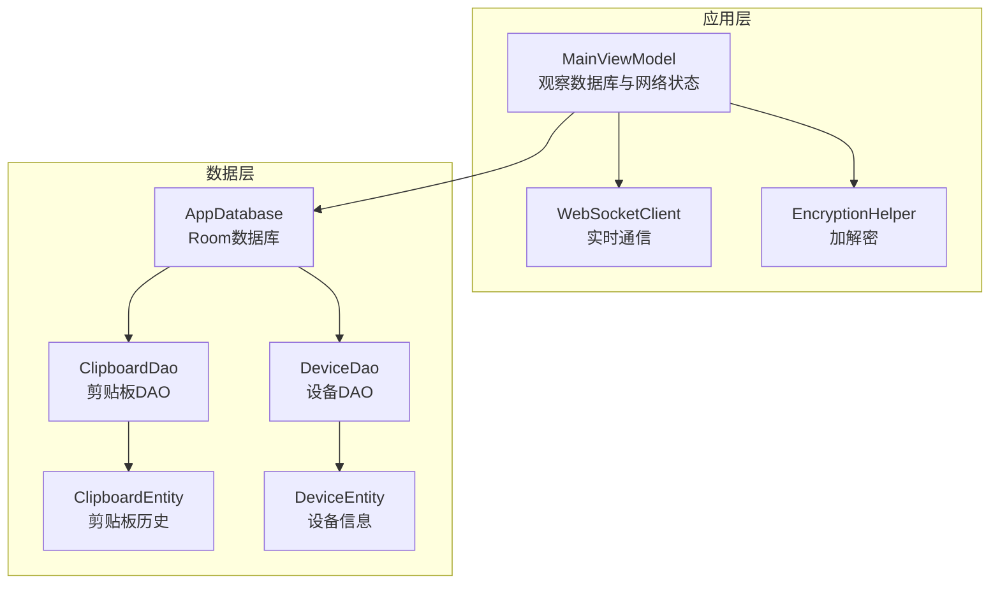
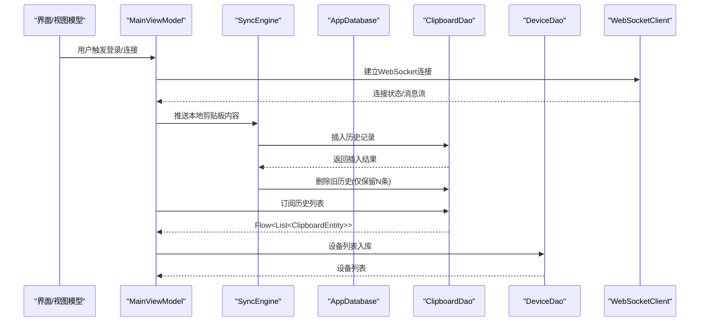
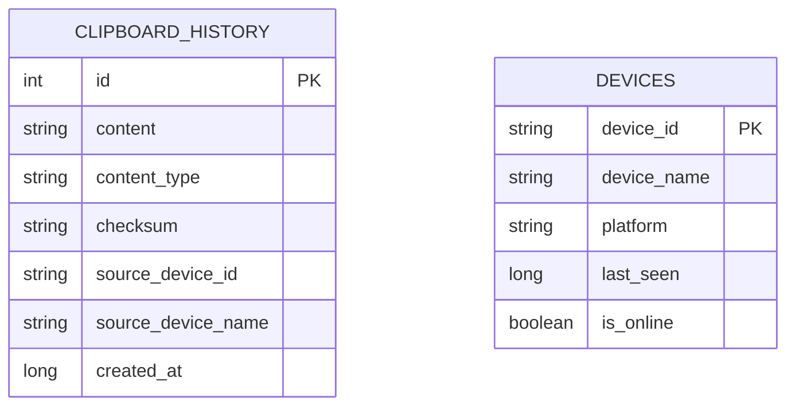
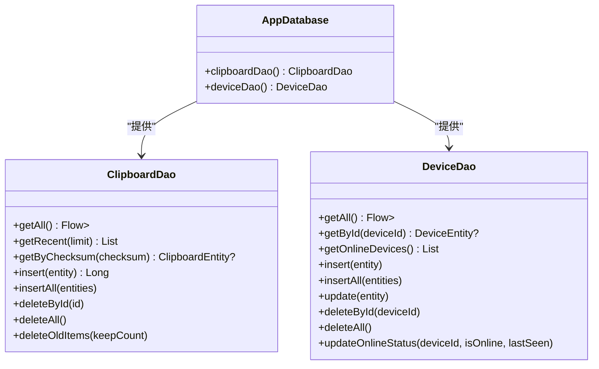
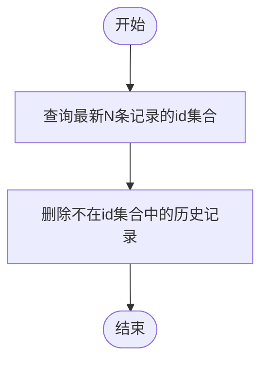
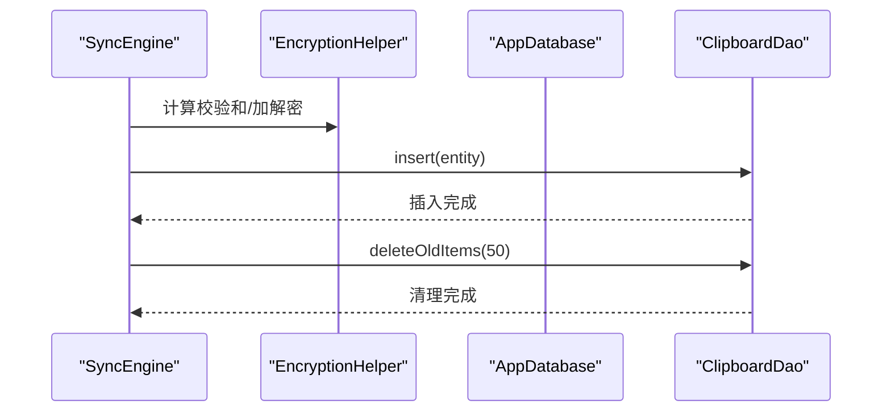
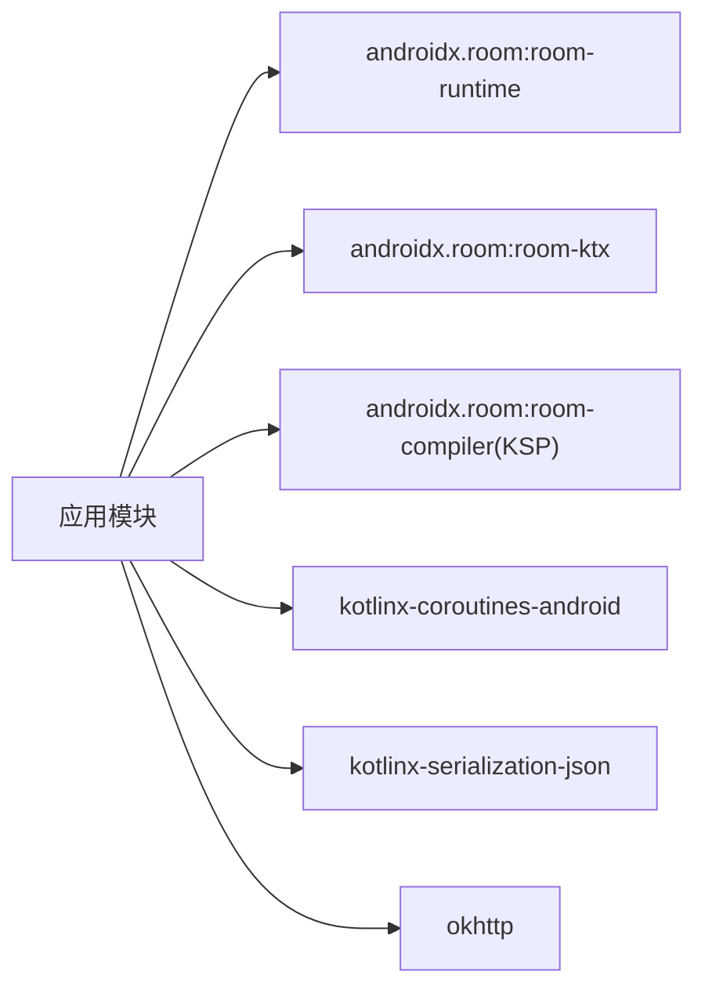

# Room数据库

<cite>
**本文引用的文件**
- [AppDatabase.kt](file://clipSync-android/app/src/main/java/com/clipsync/app/data/AppDatabase.kt)
- [ClipboardEntity.kt](file://clipSync-android/app/src/main/java/com/clipsync/app/data/entities/ClipboardEntity.kt)
- [DeviceEntity.kt](file://clipSync-android/app/src/main/java/com/clipsync/app/data/entities/DeviceEntity.kt)
- [ClipboardDao.kt](file://clipSync-android/app/src/main/java/com/clipsync/app/data/ClipboardDao.kt)
- [DeviceDao.kt](file://clipSync-android/app/src/main/java/com/clipsync/app/data/DeviceDao.kt)
- [SyncEngine.kt](file://clipSync-android/app/src/main/java/com/clipsync/app/core/SyncEngine.kt)
- [MainViewModel.kt](file://clipSync-android/app/src/main/java/com/clipsync/app/viewmodel/MainViewModel.kt)
- [ClipSyncApplication.kt](file://clipSync-android/app/src/main/java/com/clipsync/app/ClipSyncApplication.kt)
- [WebSocketClient.kt](file://clipSync-android/app/src/main/java/com/clipsync/app/network/WebSocketClient.kt)
- [EncryptionHelper.kt](file://clipSync-android/app/src/main/java/com/clipsync/app/core/EncryptionHelper.kt)
- [build.gradle.kts](file://clipSync-android/app/build.gradle.kts)
</cite>

## 目录
1. [简介](#简介)
2. [项目结构](#项目结构)
3. [核心组件](#核心组件)
4. [架构总览](#架构总览)
5. [详细组件分析](#详细组件分析)
6. [依赖分析](#依赖分析)
7. [性能考虑](#性能考虑)
8. [故障排查指南](#故障排查指南)
9. [结论](#结论)
10. [附录](#附录)

## 简介
本文件系统性梳理Android端Room数据库在ClipSync项目中的应用，重点覆盖：
- 数据库架构与版本管理
- 实体模型（ClipboardEntity、DeviceEntity）的设计与表结构
- DAO接口的CRUD、复杂查询与批量操作
- 查询优化、事务处理与数据一致性
- 迁移策略与备份恢复建议
- 并发访问控制与常见问题排查

## 项目结构
Room数据库位于Android应用模块中，采用按职责分层组织：
- 数据层：AppDatabase、实体类、DAO接口
- 核心业务：SyncEngine协调本地剪贴板变化与服务器同步，并维护本地历史
- 视图模型：MainViewModel通过Flow观察数据库变化并驱动UI
- 应用入口：ClipSyncApplication提供全局数据库实例

图表来源
- [AppDatabase.kt:14-22](file://clipSync-android/app/src/main/java/com/clipsync/app/data/AppDatabase.kt#L14-L22)
- [ClipboardDao.kt:13-29](file://clipSync-android/app/src/main/java/com/clipsync/app/data/ClipboardDao.kt#L13-L29)
- [DeviceDao.kt:14-33](file://clipSync-android/app/src/main/java/com/clipsync/app/data/DeviceDao.kt#L14-L33)
- [ClipboardEntity.kt:9-19](file://clipSync-android/app/src/main/java/com/clipsync/app/data/entities/ClipboardEntity.kt#L9-L19)
- [DeviceEntity.kt:9-17](file://clipSync-android/app/src/main/java/com/clipsync/app/data/entities/DeviceEntity.kt#L9-L17)

章节来源
- [build.gradle.kts:80-84](file://clipSync-android/app/build.gradle.kts#L80-L84)
- [AppDatabase.kt:14-22](file://clipSync-android/app/src/main/java/com/clipsync/app/data/AppDatabase.kt#L14-L22)

## 核心组件
- AppDatabase：Room数据库入口，声明实体与DAO，提供单例构建器
- ClipboardEntity/DeviceEntity：剪贴板历史与设备信息的持久化模型
- ClipboardDao/DeviceDao：提供查询、插入、更新、删除等操作
- SyncEngine：协调本地剪贴板监控、去重、历史入库与历史拉取
- MainViewModel：通过Flow订阅数据库变化，驱动UI展示
- ClipSyncApplication：全局数据库实例持有者

章节来源
- [AppDatabase.kt:14-39](file://clipSync-android/app/src/main/java/com/clipsync/app/data/AppDatabase.kt#L14-L39)
- [ClipboardEntity.kt:9-19](file://clipSync-android/app/src/main/java/com/clipsync/app/data/entities/ClipboardEntity.kt#L9-L19)
- [DeviceEntity.kt:9-17](file://clipSync-android/app/src/main/java/com/clipsync/app/data/entities/DeviceEntity.kt#L9-L17)
- [ClipboardDao.kt:13-48](file://clipSync-android/app/src/main/java/com/clipsync/app/data/ClipboardDao.kt#L13-L48)
- [DeviceDao.kt:14-42](file://clipSync-android/app/src/main/java/com/clipsync/app/data/DeviceDao.kt#L14-L42)
- [SyncEngine.kt:27-32](file://clipSync-android/app/src/main/java/com/clipsync/app/core/SyncEngine.kt#L27-L32)
- [MainViewModel.kt:39-71](file://clipSync-android/app/src/main/java/com/clipsync/app/viewmodel/MainViewModel.kt#L39-L71)
- [ClipSyncApplication.kt:10-14](file://clipSync-android/app/src/main/java/com/clipsync/app/ClipSyncApplication.kt#L10-L14)

## 架构总览
Room数据库在应用中的位置与交互如下：

图表来源
- [MainViewModel.kt:118-142](file://clipSync-android/app/src/main/java/com/clipsync/app/viewmodel/MainViewModel.kt#L118-L142)
- [SyncEngine.kt:72-123](file://clipSync-android/app/src/main/java/com/clipsync/app/core/SyncEngine.kt#L72-L123)
- [SyncEngine.kt:165-194](file://clipSync-android/app/src/main/java/com/clipsync/app/core/SyncEngine.kt#L165-L194)
- [ClipboardDao.kt:16-48](file://clipSync-android/app/src/main/java/com/clipsync/app/data/ClipboardDao.kt#L16-L48)
- [DeviceDao.kt:17-42](file://clipSync-android/app/src/main/java/com/clipsync/app/data/DeviceDao.kt#L17-L42)

## 详细组件分析

### 数据库与实体模型
- AppDatabase
  - 声明实体集合与版本号，提供DAO访问入口
  - 使用单例构建器，线程安全初始化
- ClipboardEntity
  - 表名：clipboard_history
  - 主键：自增id
  - 字段：content、contentType、checksum、sourceDeviceId、sourceDeviceName、createdAt
- DeviceEntity
  - 表名：devices
  - 主键：deviceId
  - 字段：deviceName、platform、lastSeen、isOnline

图表来源
- [ClipboardEntity.kt:9-19](file://clipSync-android/app/src/main/java/com/clipsync/app/data/entities/ClipboardEntity.kt#L9-L19)
- [DeviceEntity.kt:9-17](file://clipSync-android/app/src/main/java/com/clipsync/app/data/entities/DeviceEntity.kt#L9-L17)

章节来源
- [AppDatabase.kt:14-22](file://clipSync-android/app/src/main/java/com/clipsync/app/data/AppDatabase.kt#L14-L22)
- [ClipboardEntity.kt:9-19](file://clipSync-android/app/src/main/java/com/clipsync/app/data/entities/ClipboardEntity.kt#L9-L19)
- [DeviceEntity.kt:9-17](file://clipSync-android/app/src/main/java/com/clipsync/app/data/entities/DeviceEntity.kt#L9-L17)

### DAO接口与CRUD
- ClipboardDao
  - 查询：全部历史（Flow）、最近N条、按校验和查询
  - 插入：单条、批量
  - 删除：按id、清空、按保留数量删除旧项
  - 复杂查询：基于时间倒序保留最新N条的删除语句
- DeviceDao
  - 查询：全部（在线优先排序）、按id、在线设备
  - 插入：单条、批量
  - 更新：整行更新、在线状态与最后在线时间
  - 删除：按id、清空

图表来源
- [ClipboardDao.kt:13-48](file://clipSync-android/app/src/main/java/com/clipsync/app/data/ClipboardDao.kt#L13-L48)
- [DeviceDao.kt:14-42](file://clipSync-android/app/src/main/java/com/clipsync/app/data/DeviceDao.kt#L14-L42)
- [AppDatabase.kt:21-22](file://clipSync-android/app/src/main/java/com/clipsync/app/data/AppDatabase.kt#L21-L22)

章节来源
- [ClipboardDao.kt:13-48](file://clipSync-android/app/src/main/java/com/clipsync/app/data/ClipboardDao.kt#L13-L48)
- [DeviceDao.kt:14-42](file://clipSync-android/app/src/main/java/com/clipsync/app/data/DeviceDao.kt#L14-L42)

### 复杂查询与批量操作
- 历史清理（仅保留最近N条）
  - 使用子查询选出最新的N条id，删除不在该集合中的旧记录
  - 避免全表扫描，提升性能
- 批量插入
  - ClipboardDao.insertAll、DeviceDao.insertAll用于批量写入
- Flow观察
  - ViewModel通过Flow订阅数据库变化，自动刷新UI

图表来源
- [ClipboardDao.kt:40-47](file://clipSync-android/app/src/main/java/com/clipsync/app/data/ClipboardDao.kt#L40-L47)

章节来源
- [ClipboardDao.kt:40-48](file://clipSync-android/app/src/main/java/com/clipsync/app/data/ClipboardDao.kt#L40-L48)
- [MainViewModel.kt:128-142](file://clipSync-android/app/src/main/java/com/clipsync/app/viewmodel/MainViewModel.kt#L128-L142)

### 同步引擎与数据库使用
- 去重机制
  - 使用SHA-256计算内容校验和，避免重复推送
- 历史入库
  - 本地推送或远端同步后，均会构造ClipboardEntity并插入数据库
  - 插入后立即执行“仅保留最近50条”的清理逻辑
- 历史拉取
  - 请求远端历史后，解析为ClipboardEntity列表并批量插入

图表来源
- [SyncEngine.kt:86-91](file://clipSync-android/app/src/main/java/com/clipsync/app/core/SyncEngine.kt#L86-L91)
- [SyncEngine.kt:214-226](file://clipSync-android/app/src/main/java/com/clipsync/app/core/SyncEngine.kt#L214-L226)
- [EncryptionHelper.kt:107-111](file://clipSync-android/app/src/main/java/com/clipsync/app/core/EncryptionHelper.kt#L107-L111)

章节来源
- [SyncEngine.kt:72-123](file://clipSync-android/app/src/main/java/com/clipsync/app/core/SyncEngine.kt#L72-L123)
- [SyncEngine.kt:165-194](file://clipSync-android/app/src/main/java/com/clipsync/app/core/SyncEngine.kt#L165-L194)
- [SyncEngine.kt:214-226](file://clipSync-android/app/src/main/java/com/clipsync/app/core/SyncEngine.kt#L214-L226)
- [EncryptionHelper.kt:107-111](file://clipSync-android/app/src/main/java/com/clipsync/app/core/EncryptionHelper.kt#L107-L111)

## 依赖分析
- Room依赖
  - 版本：2.6.1
  - 组件：runtime、ktx、编译器（KSP）
- 协程与序列化
  - 协程用于异步IO与Flow
  - kotlinx.serialization用于WebSocket消息解析
- OkHttp
  - WebSocket客户端依赖OkHttp

图表来源
- [build.gradle.kts:80-84](file://clipSync-android/app/build.gradle.kts#L80-L84)
- [build.gradle.kts:89-93](file://clipSync-android/app/build.gradle.kts#L89-L93)
- [build.gradle.kts:87](file://clipSync-android/app/build.gradle.kts#L87)

章节来源
- [build.gradle.kts:80-84](file://clipSync-android/app/build.gradle.kts#L80-L84)
- [build.gradle.kts:89-93](file://clipSync-android/app/build.gradle.kts#L89-L93)
- [build.gradle.kts:87](file://clipSync-android/app/build.gradle.kts#L87)

## 性能考虑
- 查询优化
  - 使用Flow订阅数据库变化，避免轮询
  - 对历史表按时间倒序查询，配合LIMIT限制返回数量
  - 使用校验和字段进行去重与快速查找
- 写入优化
  - 批量插入减少事务开销
  - 插入后立即清理旧数据，控制表规模
- 索引建议
  - 在高频查询字段上建立索引（如checksum、createdAt、deviceId）
  - 可通过Room迁移脚本添加索引
- 线程与协程
  - 所有数据库操作运行在IO调度器，避免阻塞主线程
- 缓存与内存
  - ViewModel层对历史与设备列表做轻量缓存（take/collectLatest）

章节来源
- [MainViewModel.kt:128-142](file://clipSync-android/app/src/main/java/com/clipsync/app/viewmodel/MainViewModel.kt#L128-L142)
- [ClipboardDao.kt:16-20](file://clipSync-android/app/src/main/java/com/clipsync/app/data/ClipboardDao.kt#L16-L20)
- [ClipboardDao.kt:22-23](file://clipSync-android/app/src/main/java/com/clipsync/app/data/ClipboardDao.kt#L22-L23)
- [SyncEngine.kt:224-225](file://clipSync-android/app/src/main/java/com/clipsync/app/core/SyncEngine.kt#L224-L225)

## 故障排查指南
- 数据库未初始化
  - 确认通过AppDatabase.getInstance获取实例
  - 检查应用上下文是否正确传递
- 连接状态异常
  - WebSocketClient提供连接状态Flow，检查连接流程与重连策略
- 加解密失败
  - 检查加密格式与盐值/IV长度
  - 校验和不一致会导致重复推送被跳过
- 数据不同步
  - 确认设备ID与平台字段正确设置
  - 检查历史拉取与批量插入流程
- 日志定位
  - 关注SyncEngine与WebSocketClient的日志输出

章节来源
- [ClipSyncApplication.kt:12-14](file://clipSync-android/app/src/main/java/com/clipsync/app/ClipSyncApplication.kt#L12-L14)
- [WebSocketClient.kt:46-78](file://clipSync-android/app/src/main/java/com/clipsync/app/network/WebSocketClient.kt#L46-L78)
- [EncryptionHelper.kt:72-102](file://clipSync-android/app/src/main/java/com/clipsync/app/core/EncryptionHelper.kt#L72-L102)
- [SyncEngine.kt:136-141](file://clipSync-android/app/src/main/java/com/clipsync/app/core/SyncEngine.kt#L136-L141)

## 结论
本项目采用Room作为本地持久化方案，结合Flow实现响应式UI，通过SyncEngine实现本地与远端的双向同步。实体模型简洁明确，DAO接口覆盖常用CRUD与批量操作，配合去重与历史清理策略，满足剪贴板同步场景的性能与一致性需求。建议后续引入索引与迁移脚本以进一步优化查询与版本演进能力。

## 附录
- 数据库版本
  - 当前版本：1
  - 建议在升级时增加版本号并编写迁移脚本
- 迁移策略
  - 新增列：使用ALTER TABLE
  - 新建表：创建新表后迁移数据，再删除旧表
  - 索引：在迁移脚本中添加CREATE INDEX
- 备份与恢复
  - 利用Android系统备份规则与数据提取规则
  - 建议提供导出历史与设备列表的功能（可选）

章节来源
- [AppDatabase.kt:16](file://clipSync-android/app/src/main/java/com/clipsync/app/data/AppDatabase.kt#L16)