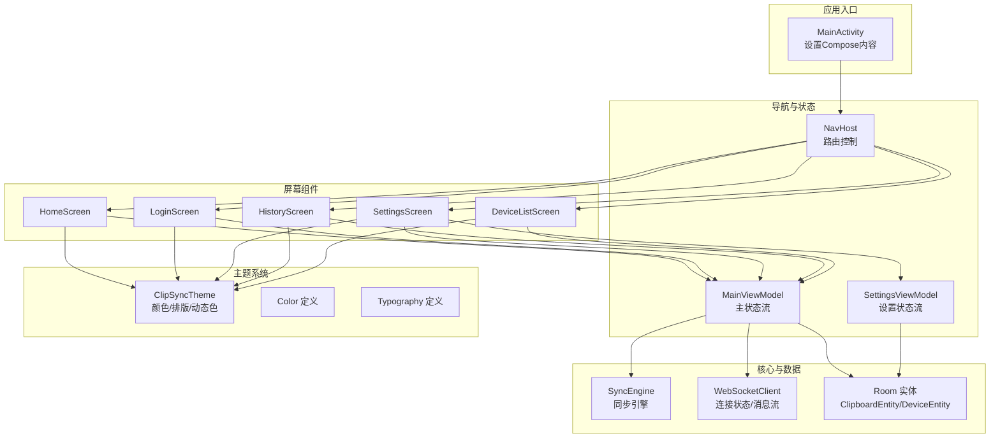
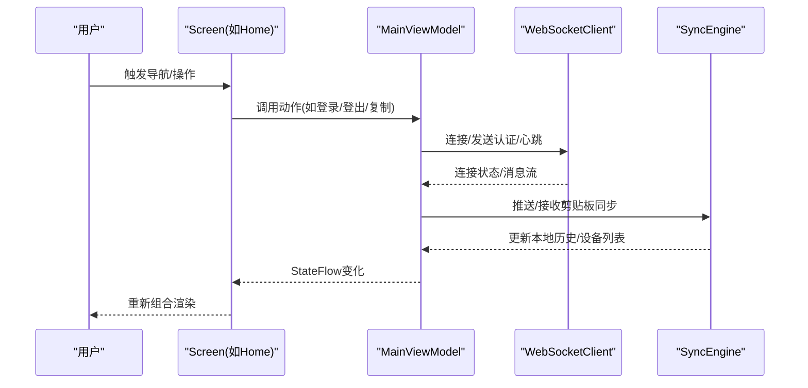
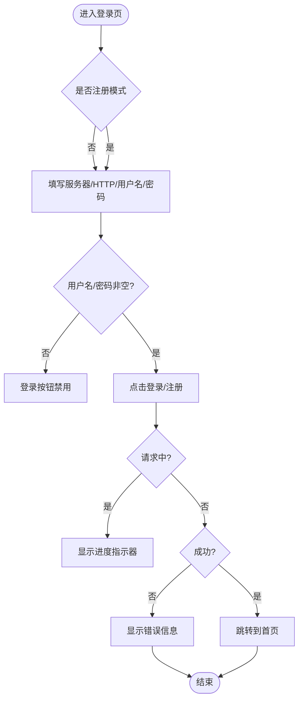
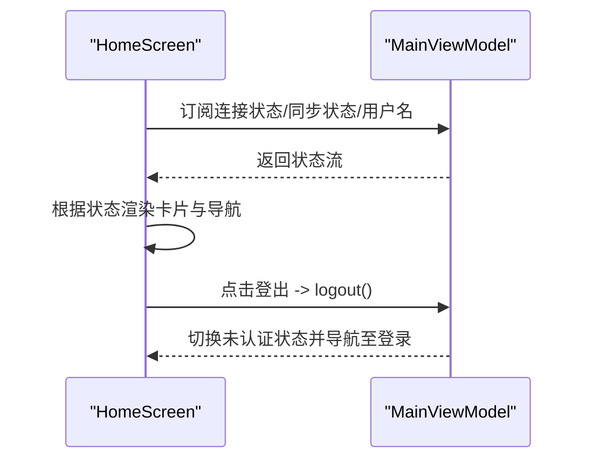
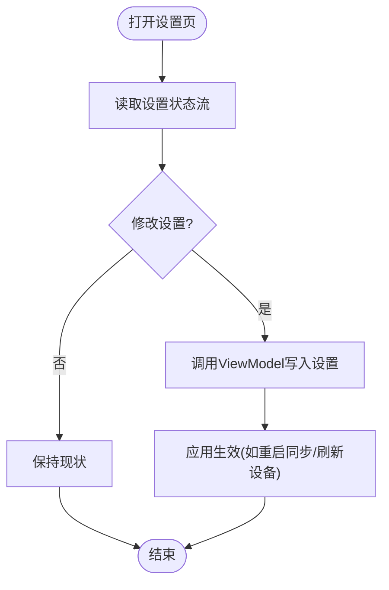
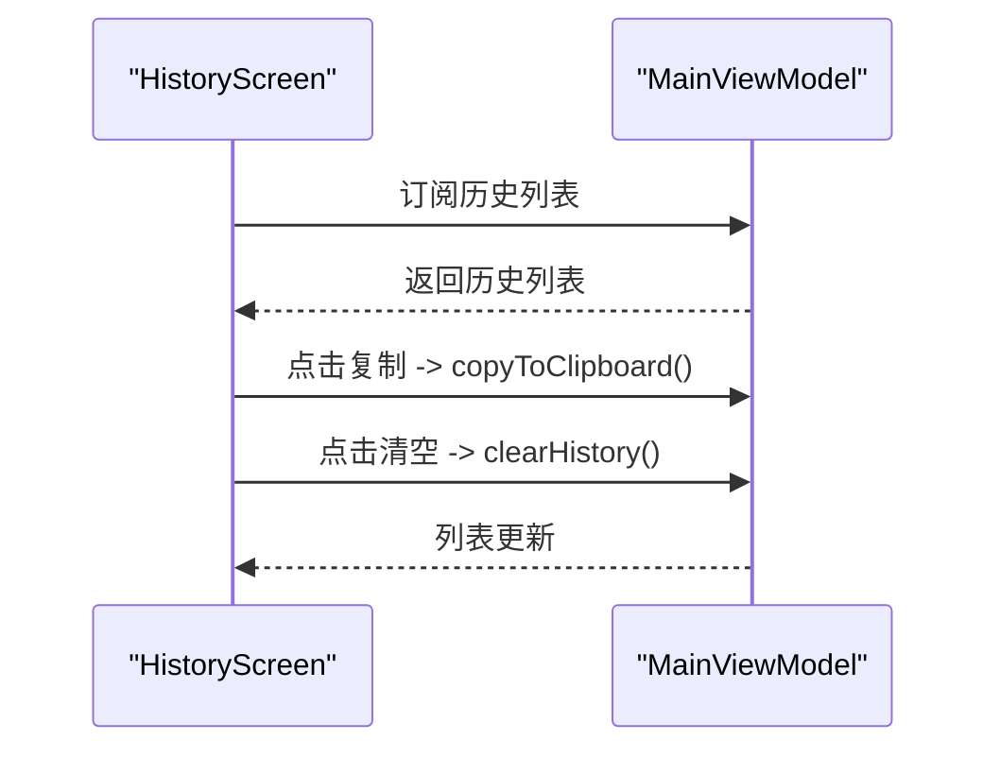
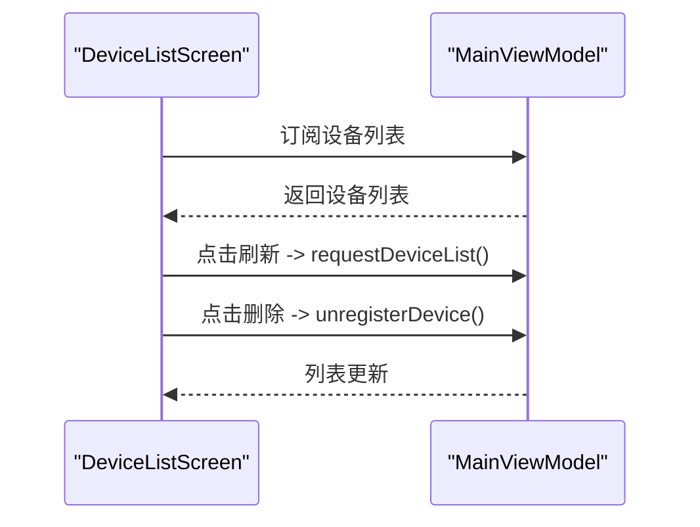
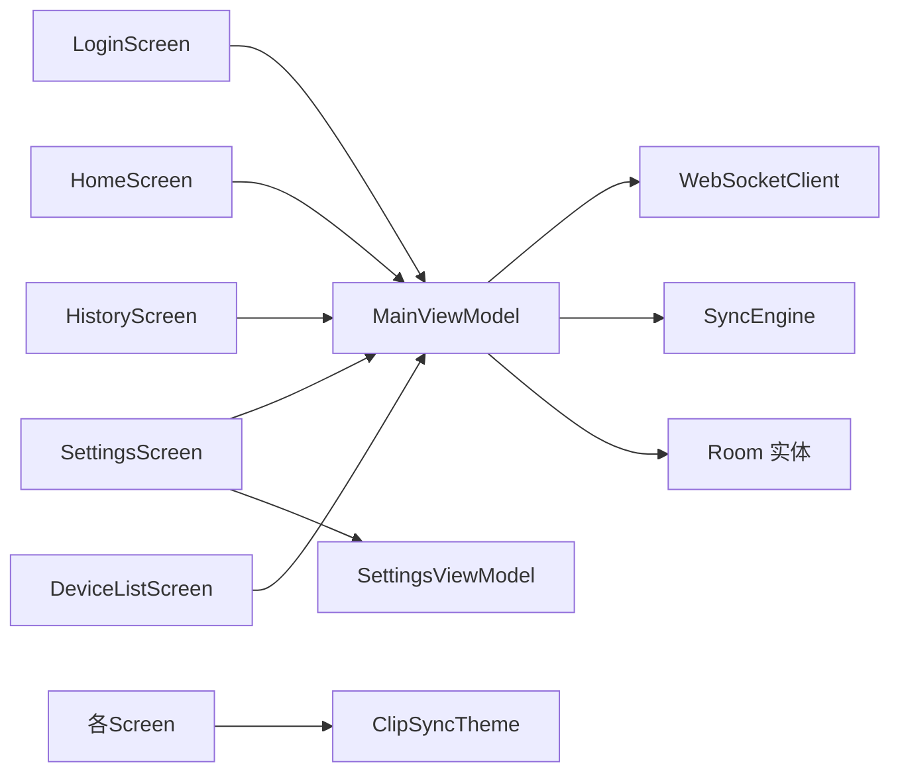

# UI界面设计

<cite>
**本文引用的文件**
- [Theme.kt](file://clipSync-android/app/src/main/java/com/clipsync/app/ui/theme/Theme.kt)
- [Color.kt](file://clipSync-android/app/src/main/java/com/clipsync/app/ui/theme/Color.kt)
- [Type.kt](file://clipSync-android/app/src/main/java/com/clipsync/app/ui/theme/Type.kt)
- [HomeScreen.kt](file://clipSync-android/app/src/main/java/com/clipsync/app/ui/screens/HomeScreen.kt)
- [LoginScreen.kt](file://clipSync-android/app/src/main/java/com/clipsync/app/ui/screens/LoginScreen.kt)
- [SettingsScreen.kt](file://clipSync-android/app/src/main/java/com/clipsync/app/ui/screens/SettingsScreen.kt)
- [HistoryScreen.kt](file://clipSync-android/app/src/main/java/com/clipsync/app/ui/screens/HistoryScreen.kt)
- [DeviceListScreen.kt](file://clipSync-android/app/src/main/java/com/clipsync/app/ui/screens/DeviceListScreen.kt)
- [MainActivity.kt](file://clipSync-android/app/src/main/java/com/clipsync/app/MainActivity.kt)
- [MainViewModel.kt](file://clipSync-android/app/src/main/java/com/clipsync/app/viewmodel/MainViewModel.kt)
- [SettingsViewModel.kt](file://clipSync-android/app/src/main/java/com/clipsync/app/viewmodel/SettingsViewModel.kt)
- [SyncEngine.kt](file://clipSync-android/app/src/main/java/com/clipsync/app/core/SyncEngine.kt)
- [ClipboardEntity.kt](file://clipSync-android/app/src/main/java/com/clipsync/app/data/entities/ClipboardEntity.kt)
- [DeviceEntity.kt](file://clipSync-android/app/src/main/java/com/clipsync/app/data/entities/DeviceEntity.kt)
- [WebSocketClient.kt](file://clipSync-android/app/src/main/java/com/clipsync/app/network/WebSocketClient.kt)
- [themes.xml](file://clipSync-android/app/src/main/res/values/themes.xml)
</cite>

## 目录
1. [简介](#简介)
2. [项目结构](#项目结构)
3. [核心组件](#核心组件)
4. [架构总览](#架构总览)
5. [详细组件分析](#详细组件分析)
6. [依赖关系分析](#依赖关系分析)
7. [性能考虑](#性能考虑)
8. [故障排查指南](#故障排查指南)
9. [结论](#结论)
10. [附录](#附录)

## 简介
本文件面向Android UI界面设计，围绕Jetpack Compose在本项目中的使用、屏幕组件设计模式、主题系统与可复用组件进行系统化说明。文档覆盖首页、登录页、设置页、历史记录页、设备列表页五大屏幕的功能实现与交互逻辑，并解释颜色系统、字体系统、间距系统配置，以及状态管理、响应式设计与性能优化策略。

## 项目结构
应用采用以功能域划分的模块组织方式，UI层位于ui目录下，按屏幕拆分；主题系统独立于屏幕；业务状态通过ViewModel暴露给UI；网络与数据库通过核心模块提供服务。

图表来源
- [MainActivity.kt:33-41](file://clipSync-android/app/src/main/java/com/clipsync/app/MainActivity.kt#L33-L41)
- [MainActivity.kt:64-137](file://clipSync-android/app/src/main/java/com/clipsync/app/MainActivity.kt#L64-L137)
- [Theme.kt:87-116](file://clipSync-android/app/src/main/java/com/clipsync/app/ui/theme/Theme.kt#L87-L116)
- [HomeScreen.kt:60-270](file://clipSync-android/app/src/main/java/com/clipsync/app/ui/screens/HomeScreen.kt#L60-L270)
- [LoginScreen.kt:50-291](file://clipSync-android/app/src/main/java/com/clipsync/app/ui/screens/LoginScreen.kt#L50-L291)
- [SettingsScreen.kt:29-175](file://clipSync-android/app/src/main/java/com/clipsync/app/ui/screens/SettingsScreen.kt#L29-L175)
- [HistoryScreen.kt:33-84](file://clipSync-android/app/src/main/java/com/clipsync/app/ui/screens/HistoryScreen.kt#L33-L84)
- [DeviceListScreen.kt:41-115](file://clipSync-android/app/src/main/java/com/clipsync/app/ui/screens/DeviceListScreen.kt#L41-L115)
- [MainViewModel.kt:39-348](file://clipSync-android/app/src/main/java/com/clipsync/app/viewmodel/MainViewModel.kt#L39-L348)
- [SettingsViewModel.kt:17-95](file://clipSync-android/app/src/main/java/com/clipsync/app/viewmodel/SettingsViewModel.kt#L17-L95)
- [SyncEngine.kt:27-239](file://clipSync-android/app/src/main/java/com/clipsync/app/core/SyncEngine.kt#L27-L239)
- [WebSocketClient.kt:26-144](file://clipSync-android/app/src/main/java/com/clipsync/app/network/WebSocketClient.kt#L26-L144)
- [ClipboardEntity.kt:9-19](file://clipSync-android/app/src/main/java/com/clipsync/app/data/entities/ClipboardEntity.kt#L9-L19)
- [DeviceEntity.kt:9-17](file://clipSync-android/app/src/main/java/com/clipsync/app/data/entities/DeviceEntity.kt#L9-L17)

章节来源
- [MainActivity.kt:26-42](file://clipSync-android/app/src/main/java/com/clipsync/app/MainActivity.kt#L26-L42)
- [MainActivity.kt:44-138](file://clipSync-android/app/src/main/java/com/clipsync/app/MainActivity.kt#L44-L138)

## 核心组件
- 主题系统：统一的颜色方案、动态色支持、状态栏适配、Typography排版体系。
- 屏幕组件：登录、首页、设置、历史、设备列表，均通过参数注入状态与回调，保持无副作用渲染。
- 状态管理：ViewModel通过StateFlow暴露不可变状态，UI通过collectAsStateWithLifecycle收集。
- 数据与网络：WebSocketClient提供连接状态与消息流；SyncEngine协调本地剪贴板与服务器同步；Room实体承载本地历史与设备数据。

章节来源
- [Theme.kt:87-116](file://clipSync-android/app/src/main/java/com/clipsync/app/ui/theme/Theme.kt#L87-L116)
- [Color.kt:5-46](file://clipSync-android/app/src/main/java/com/clipsync/app/ui/theme/Color.kt#L5-L46)
- [Type.kt:12-127](file://clipSync-android/app/src/main/java/com/clipsync/app/ui/theme/Type.kt#L12-L127)
- [MainViewModel.kt:55-73](file://clipSync-android/app/src/main/java/com/clipsync/app/viewmodel/MainViewModel.kt#L55-L73)
- [SettingsViewModel.kt:21-37](file://clipSync-android/app/src/main/java/com/clipsync/app/viewmodel/SettingsViewModel.kt#L21-L37)

## 架构总览
Compose UI通过NavHost在不同目的地之间切换，每个目的地由对应Screen负责渲染。Screen从ViewModel读取状态并通过回调触发动作，网络与数据库通过核心模块提供能力。

图表来源
- [MainActivity.kt:64-137](file://clipSync-android/app/src/main/java/com/clipsync/app/MainActivity.kt#L64-L137)
- [HomeScreen.kt:60-270](file://clipSync-android/app/src/main/java/com/clipsync/app/ui/screens/HomeScreen.kt#L60-L270)
- [MainViewModel.kt:205-282](file://clipSync-android/app/src/main/java/com/clipsync/app/viewmodel/MainViewModel.kt#L205-L282)
- [WebSocketClient.kt:83-139](file://clipSync-android/app/src/main/java/com/clipsync/app/network/WebSocketClient.kt#L83-L139)
- [SyncEngine.kt:72-160](file://clipSync-android/app/src/main/java/com/clipsync/app/core/SyncEngine.kt#L72-L160)

## 详细组件分析

### 主题系统与设计语言
- 颜色系统：定义主色、辅色、背景、表面、文字、状态色与边框，深浅两套色板，支持动态色（Android S+）。
- 排版系统：基于Material3 Typography，提供标题、正文、标签等多级样式，统一字号、行高、字重与字距。
- 动态色与状态栏：根据深浅主题自动调整状态栏明暗，确保可读性与一致性。
- 应用入口：在Activity中包裹ClipSyncTheme，保证全局一致的主题渲染。

章节来源
- [Theme.kt:19-85](file://clipSync-android/app/src/main/java/com/clipsync/app/ui/theme/Theme.kt#L19-L85)
- [Theme.kt:87-116](file://clipSync-android/app/src/main/java/com/clipsync/app/ui/theme/Theme.kt#L87-L116)
- [Color.kt:5-46](file://clipSync-android/app/src/main/java/com/clipsync/app/ui/theme/Color.kt#L5-L46)
- [Type.kt:12-127](file://clipSync-android/app/src/main/java/com/clipsync/app/ui/theme/Type.kt#L12-L127)
- [MainActivity.kt:33-41](file://clipSync-android/app/src/main/java/com/clipsync/app/MainActivity.kt#L33-L41)

### 登录页(LoginScreen)
- 状态与交互：使用可保存状态存储服务器URL、用户名、密码与注册模式；根据输入启用/禁用登录按钮；支持加载态与错误提示。
- 视觉设计：玻璃态卡片、径向/线性渐变装饰、呼吸动画背景；输入框聚焦态强调主色边框；错误信息以强调色显示。
- 用户流程：支持登录与注册两种模式切换；登录成功后进入首页。

图表来源
- [LoginScreen.kt:50-291](file://clipSync-android/app/src/main/java/com/clipsync/app/ui/screens/LoginScreen.kt#L50-L291)
- [MainActivity.kt:68-80](file://clipSync-android/app/src/main/java/com/clipsync/app/MainActivity.kt#L68-L80)

章节来源
- [LoginScreen.kt:50-291](file://clipSync-android/app/src/main/java/com/clipsync/app/ui/screens/LoginScreen.kt#L50-L291)
- [MainActivity.kt:68-80](file://clipSync-android/app/src/main/java/com/clipsync/app/MainActivity.kt#L68-L80)

### 首页(HomeScreen)
- 导航与布局：TopAppBar显示在线状态与当前用户；底部NavigationBar提供四个目标页导航；Scaffold容器色与背景色统一。
- 状态卡片：连接状态与同步状态卡片，根据状态显示图标、颜色与脉冲指示；支持呼吸动画增强视觉反馈。
- 提示卡片：引导用户复制内容以触发同步。
- 登出按钮：使用强调色容器，文本为错误色，明确危险操作。

图表来源
- [HomeScreen.kt:60-270](file://clipSync-android/app/src/main/java/com/clipsync/app/ui/screens/HomeScreen.kt#L60-L270)
- [MainActivity.kt:82-96](file://clipSync-android/app/src/main/java/com/clipsync/app/MainActivity.kt#L82-L96)
- [MainViewModel.kt:273-282](file://clipSync-android/app/src/main/java/com/clipsync/app/viewmodel/MainViewModel.kt#L273-L282)

章节来源
- [HomeScreen.kt:60-270](file://clipSync-android/app/src/main/java/com/clipsync/app/ui/screens/HomeScreen.kt#L60-L270)
- [MainActivity.kt:82-96](file://clipSync-android/app/src/main/java/com/clipsync/app/MainActivity.kt#L82-L96)

### 设置页(SettingsScreen)
- 分区设计：账户、服务器、同步、安全、设备五个分区，使用卡片与行项布局。
- 可编辑项：服务器URL、HTTP URL、设备名称；开关项：启用同步、启用加密。
- 行项组件：SettingRow封装标题、描述与操作控件，便于复用。
- 行为：清空历史弹窗确认；登出时清理状态并返回登录页。

图表来源
- [SettingsScreen.kt:29-175](file://clipSync-android/app/src/main/java/com/clipsync/app/ui/screens/SettingsScreen.kt#L29-L175)
- [SettingsViewModel.kt:66-94](file://clipSync-android/app/src/main/java/com/clipsync/app/viewmodel/SettingsViewModel.kt#L66-L94)

章节来源
- [SettingsScreen.kt:29-175](file://clipSync-android/app/src/main/java/com/clipsync/app/ui/screens/SettingsScreen.kt#L29-L175)
- [SettingsViewModel.kt:17-95](file://clipSync-android/app/src/main/java/com/clipsync/app/viewmodel/SettingsViewModel.kt#L17-L95)

### 历史记录页(HistoryScreen)
- 列表渲染：LazyColumn按时间倒序展示剪贴板历史；每项包含内容、来源设备与时间戳。
- 交互行为：复制到剪贴板；清空历史（仅当列表非空时显示操作按钮）。
- 时间格式化：根据时间差显示“刚刚/分钟前/小时前/天前”。

图表来源
- [HistoryScreen.kt:33-84](file://clipSync-android/app/src/main/java/com/clipsync/app/ui/screens/HistoryScreen.kt#L33-L84)
- [MainViewModel.kt:284-292](file://clipSync-android/app/src/main/java/com/clipsync/app/viewmodel/MainViewModel.kt#L284-L292)

章节来源
- [HistoryScreen.kt:33-84](file://clipSync-android/app/src/main/java/com/clipsync/app/ui/screens/HistoryScreen.kt#L33-L84)
- [ClipboardEntity.kt:9-19](file://clipSync-android/app/src/main/java/com/clipsync/app/data/entities/ClipboardEntity.kt#L9-L19)

### 设备列表页(DeviceListScreen)
- 列表渲染：LazyColumn展示已注册设备；每项包含平台图标、设备名、平台与在线状态。
- 交互行为：刷新设备列表；删除设备（弹窗确认）。
- 平台图标映射：根据平台字符串选择图标（Windows/MacOS/Android/iOS）。

图表来源
- [DeviceListScreen.kt:41-115](file://clipSync-android/app/src/main/java/com/clipsync/app/ui/screens/DeviceListScreen.kt#L41-L115)
- [MainViewModel.kt:294-313](file://clipSync-android/app/src/main/java/com/clipsync/app/viewmodel/MainViewModel.kt#L294-L313)
- [DeviceEntity.kt:9-17](file://clipSync-android/app/src/main/java/com/clipsync/app/data/entities/DeviceEntity.kt#L9-L17)

章节来源
- [DeviceListScreen.kt:41-115](file://clipSync-android/app/src/main/java/com/clipsync/app/ui/screens/DeviceListScreen.kt#L41-L115)
- [DeviceEntity.kt:9-17](file://clipSync-android/app/src/main/java/com/clipsync/app/data/entities/DeviceEntity.kt#L9-L17)

### 状态管理与响应式设计
- 不可变状态：ViewModel使用StateFlow暴露只读状态，避免UI直接持有可变状态。
- 生命周期感知：UI通过collectAsStateWithLifecycle收集状态，确保在生命周期安全范围内消费。
- 参数驱动：Screen通过函数参数接收状态与回调，遵循“输入即状态”的Compose原则，便于测试与复用。
- 组合与复用：通过私有子组件（如StatusCard、SettingsSection、SettingRow、HistoryItem、DeviceItem）实现职责分离与复用。

章节来源
- [MainViewModel.kt:55-73](file://clipSync-android/app/src/main/java/com/clipsync/app/viewmodel/MainViewModel.kt#L55-L73)
- [SettingsViewModel.kt:21-37](file://clipSync-android/app/src/main/java/com/clipsync/app/viewmodel/SettingsViewModel.kt#L21-L37)
- [HomeScreen.kt:272-366](file://clipSync-android/app/src/main/java/com/clipsync/app/ui/screens/HomeScreen.kt#L272-L366)
- [SettingsScreen.kt:177-229](file://clipSync-android/app/src/main/java/com/clipsync/app/ui/screens/SettingsScreen.kt#L177-L229)
- [HistoryScreen.kt:86-138](file://clipSync-android/app/src/main/java/com/clipsync/app/ui/screens/HistoryScreen.kt#L86-L138)
- [DeviceListScreen.kt:117-171](file://clipSync-android/app/src/main/java/com/clipsync/app/ui/screens/DeviceListScreen.kt#L117-L171)

### 用户交互处理与最佳实践
- 表单联动：登录页中WebSocket URL变更时同步推导HTTP URL，减少用户重复输入。
- 加载与错误：登录/注册期间显示进度指示器；错误信息通过状态流传递并在UI中显式展示。
- 弹窗确认：设置页清空历史与设备页删除设备均使用对话框确认，避免误操作。
- 无障碍与可读性：使用Material3提供的颜色对比度与Typography层级，确保在深浅主题下均清晰可读。

章节来源
- [LoginScreen.kt:165-194](file://clipSync-android/app/src/main/java/com/clipsync/app/ui/screens/LoginScreen.kt#L165-L194)
- [SettingsScreen.kt:155-174](file://clipSync-android/app/src/main/java/com/clipsync/app/ui/screens/SettingsScreen.kt#L155-L174)
- [DeviceListScreen.kt:95-114](file://clipSync-android/app/src/main/java/com/clipsync/app/ui/screens/DeviceListScreen.kt#L95-L114)

## 依赖关系分析
- UI依赖ViewModel：Screen不直接访问网络或数据库，而是通过ViewModel提供的状态与动作接口。
- ViewModel依赖核心模块：MainViewModel聚合SyncEngine、WebSocketClient、数据库与设置管理器。
- 主题依赖：所有Screen共享ClipSyncTheme，确保颜色与排版一致。
- 资源与系统：themes.xml提供基础主题风格，配合Compose主题系统生效。

图表来源
- [MainActivity.kt:64-137](file://clipSync-android/app/src/main/java/com/clipsync/app/MainActivity.kt#L64-L137)
- [MainViewModel.kt:39-53](file://clipSync-android/app/src/main/java/com/clipsync/app/viewmodel/MainViewModel.kt#L39-L53)
- [SettingsViewModel.kt:17-20](file://clipSync-android/app/src/main/java/com/clipsync/app/viewmodel/SettingsViewModel.kt#L17-L20)
- [Theme.kt:87-116](file://clipSync-android/app/src/main/java/com/clipsync/app/ui/theme/Theme.kt#L87-L116)

章节来源
- [MainActivity.kt:64-137](file://clipSync-android/app/src/main/java/com/clipsync/app/MainActivity.kt#L64-L137)
- [MainViewModel.kt:39-53](file://clipSync-android/app/src/main/java/com/clipsync/app/viewmodel/MainViewModel.kt#L39-L53)
- [SettingsViewModel.kt:17-20](file://clipSync-android/app/src/main/java/com/clipsync/app/viewmodel/SettingsViewModel.kt#L17-L20)

## 性能考虑
- 列表优化：历史与设备列表使用LazyColumn，按需渲染，避免一次性构建大量节点。
- 状态收敛：ViewModel集中管理状态与副作用，UI仅负责渲染，降低重组成本。
- 动画节流：登录页渐变动画使用有限时长的无限过渡，避免过度消耗CPU/GPU。
- 数据库限制：历史列表仅保留最近N条，防止无限增长导致查询与内存压力。
- 网络与心跳：WebSocketClient内置重连与心跳管理，减少频繁重建连接带来的开销。

章节来源
- [HistoryScreen.kt:69-81](file://clipSync-android/app/src/main/java/com/clipsync/app/ui/screens/HistoryScreen.kt#L69-L81)
- [MainViewModel.kt:128-133](file://clipSync-android/app/src/main/java/com/clipsync/app/viewmodel/MainViewModel.kt#L128-L133)
- [LoginScreen.kt:64-74](file://clipSync-android/app/src/main/java/com/clipsync/app/ui/screens/LoginScreen.kt#L64-L74)
- [SyncEngine.kt:208-227](file://clipSync-android/app/src/main/java/com/clipsync/app/core/SyncEngine.kt#L208-L227)
- [WebSocketClient.kt:39-44](file://clipSync-android/app/src/main/java/com/clipsync/app/network/WebSocketClient.kt#L39-L44)

## 故障排查指南
- 登录失败：检查网络连通性与服务器URL；查看错误状态流并在UI中展示；确认设备名与凭据正确。
- 无法连接服务器：关注连接状态流，确认WebSocketClient处于Connected；检查心跳管理是否启动。
- 同步异常：检查同步开关与加密开关；确认去重校验与回环防护逻辑；查看历史保存与拉取流程。
- 设备列表为空：确认已发送设备列表请求且服务器返回有效数据；检查数据库插入与UI订阅。
- 主题异常：确认Activity中包裹ClipSyncTheme；检查动态色支持与系统版本兼容性。

章节来源
- [MainViewModel.kt:196-201](file://clipSync-android/app/src/main/java/com/clipsync/app/viewmodel/MainViewModel.kt#L196-L201)
- [WebSocketClient.kt:46-78](file://clipSync-android/app/src/main/java/com/clipsync/app/network/WebSocketClient.kt#L46-L78)
- [SyncEngine.kt:72-123](file://clipSync-android/app/src/main/java/com/clipsync/app/core/SyncEngine.kt#L72-L123)
- [DeviceListScreen.kt:63-76](file://clipSync-android/app/src/main/java/com/clipsync/app/ui/screens/DeviceListScreen.kt#L63-L76)
- [Theme.kt:87-116](file://clipSync-android/app/src/main/java/com/clipsync/app/ui/theme/Theme.kt#L87-L116)

## 结论
本项目以Jetpack Compose为核心，结合Material3主题系统与ViewModel状态管理，实现了清晰的屏幕组件设计与良好的可维护性。通过参数化Screen、私有复用组件与状态流驱动的响应式渲染，UI具备高内聚低耦合的特性。建议在后续迭代中持续完善动画与过渡的性能基线，扩展更多屏幕的无障碍支持，并对关键路径增加更细粒度的日志与监控指标。

## 附录
- 颜色系统与排版体系：参考主题文件与颜色/类型定义，确保新增UI遵循统一规范。
- 资源与系统主题：themes.xml提供基础主题风格，Compose主题在Activity中统一应用。
- 最佳实践清单
  - 使用rememberSaveable持久化关键UI状态
  - 将副作用集中在ViewModel或自定义LaunchedEffect中
  - 对列表使用key与LazyColumn，避免全量重组
  - 使用OutlinedTextField等Material3组件提升一致性
  - 为重要交互添加过渡动画与视觉反馈

章节来源
- [themes.xml:1-5](file://clipSync-android/app/src/main/res/values/themes.xml#L1-L5)
- [Theme.kt:87-116](file://clipSync-android/app/src/main/java/com/clipsync/app/ui/theme/Theme.kt#L87-L116)
- [Type.kt:12-127](file://clipSync-android/app/src/main/java/com/clipsync/app/ui/theme/Type.kt#L12-L127)