# 协程异步处理

<cite>
**本文档引用的文件**
- [SyncEngine.kt](file://clipSync-android/app/src/main/java/com/clipsync/app/core/SyncEngine.kt)
- [ClipboardMonitor.kt](file://clipSync-android/app/src/main/java/com/clipsync/app/core/ClipboardMonitor.kt)
- [WebSocketClient.kt](file://clipSync-android/app/src/main/java/com/clipsync/app/network/WebSocketClient.kt)
- [ClipboardService.kt](file://clipSync-android/app/src/main/java/com/clipsync/app/service/ClipboardService.kt)
- [MainViewModel.kt](file://clipSync-android/app/src/main/java/com/clipsync/app/viewmodel/MainViewModel.kt)
- [ApiClient.kt](file://clipSync-android/app/src/main/java/com/clipsync/app/network/ApiClient.kt)
- [SettingsManager.kt](file://clipSync-android/app/src/main/java/com/clipsync/app/core/SettingsManager.kt)
- [AppDatabase.kt](file://clipSync-android/app/src/main/java/com/clipsync/app/data/AppDatabase.kt)
- [Protocol.kt](file://clipSync-android/app/src/main/java/com/clipsync/app/network/Protocol.kt)
- [HeartbeatManager.kt](file://clipSync-android/app/src/main/java/com/clipsync/app/network/HeartbeatManager.kt)
- [EncryptionHelper.kt](file://clipSync-android/app/src/main/java/com/clipsync/app/core/EncryptionHelper.kt)
- [ClipboardEntity.kt](file://clipSync-android/app/src/main/java/com/clipsync/app/data/entities/ClipboardEntity.kt)
- [ClipboardDao.kt](file://clipSync-android/app/src/main/java/com/clipsync/app/data/ClipboardDao.kt)
- [MainActivity.kt](file://clipSync-android/app/src/main/java/com/clipsync/app/MainActivity.kt)
</cite>

## 目录
1. [简介](#简介)
2. [项目结构](#项目结构)
3. [核心组件](#核心组件)
4. [架构概览](#架构概览)
5. [详细组件分析](#详细组件分析)
6. [依赖关系分析](#依赖关系分析)
7. [性能考虑](#性能考虑)
8. [故障排除指南](#故障排除指南)
9. [结论](#结论)

## 简介

本项目是一个基于Kotlin协程的Android剪贴板同步应用，实现了完整的异步处理机制。系统通过协程实现了剪贴板监控、WebSocket通信、数据库操作和UI状态管理的异步化，提供了高效的后台服务和实时的跨设备剪贴板同步功能。

该应用的核心特点是：
- 使用Kotlin协程进行异步编程
- 实现了完整的剪贴板监控和同步机制
- 提供了加密传输和去重机制
- 支持前台服务持久运行
- 实现了心跳保活和自动重连

## 项目结构

项目采用模块化的Android架构设计，主要分为以下几个层次：

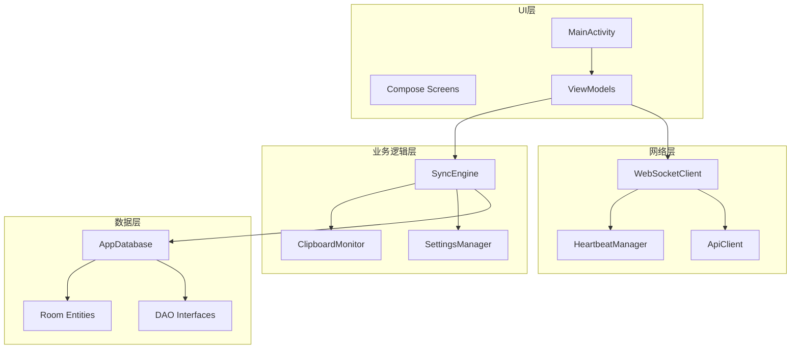

**图表来源**
- [MainActivity.kt:1-139](file://clipSync-android/app/src/main/java/com/clipsync/app/MainActivity.kt#L1-L139)
- [MainViewModel.kt:1-359](file://clipSync-android/app/src/main/java/com/clipsync/app/viewmodel/MainViewModel.kt#L1-L359)
- [SyncEngine.kt:1-250](file://clipSync-android/app/src/main/java/com/clipsync/app/core/SyncEngine.kt#L1-L250)

**章节来源**
- [MainActivity.kt:1-139](file://clipSync-android/app/src/main/java/com/clipsync/app/MainActivity.kt#L1-L139)
- [MainViewModel.kt:1-359](file://clipSync-android/app/src/main/java/com/clipsync/app/viewmodel/MainViewModel.kt#L1-L359)

## 核心组件

### 协程作用域管理

项目中使用了多种协程作用域来管理不同场景下的异步操作：

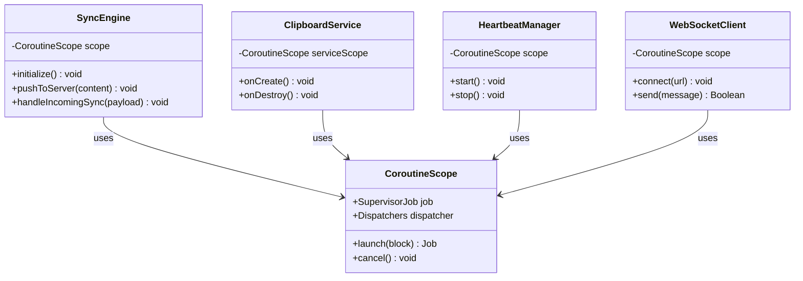

**图表来源**
- [SyncEngine.kt:33](file://clipSync-android/app/src/main/java/com/clipsync/app/core/SyncEngine.kt#L33)
- [ClipboardService.kt:41](file://clipSync-android/app/src/main/java/com/clipsync/app/service/ClipboardService.kt#L41)
- [HeartbeatManager.kt:20](file://clipSync-android/app/src/main/java/com/clipsync/app/network/HeartbeatManager.kt#L20)
- [WebSocketClient.kt:28](file://clipSync-android/app/src/main/java/com/clipsync/app/network/WebSocketClient.kt#L28)

### 异步任务管理

项目实现了多层次的异步任务管理机制：

1. **剪贴板监控异步处理**：使用Flow监听剪贴板变化
2. **WebSocket消息异步处理**：使用SharedFlow处理实时消息
3. **数据库操作异步处理**：使用Room的Flow接口
4. **网络请求异步处理**：使用suspend函数封装HTTP请求

**章节来源**
- [ClipboardMonitor.kt:15-106](file://clipSync-android/app/src/main/java/com/clipsync/app/core/ClipboardMonitor.kt#L15-L106)
- [WebSocketClient.kt:26-156](file://clipSync-android/app/src/main/java/com/clipsync/app/network/WebSocketClient.kt#L26-L156)
- [ApiClient.kt:14-142](file://clipSync-android/app/src/main/java/com/clipsync/app/network/ApiClient.kt#L14-L142)

## 架构概览

系统采用MVVM架构配合协程实现，形成了完整的异步处理链路：

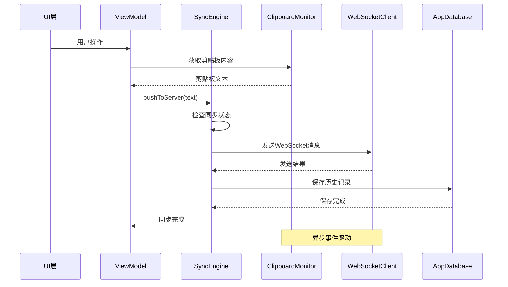

**图表来源**
- [MainViewModel.kt:118-126](file://clipSync-android/app/src/main/java/com/clipsync/app/viewmodel/MainViewModel.kt#L118-L126)
- [SyncEngine.kt:72-123](file://clipSync-android/app/src/main/java/com/clipsync/app/core/SyncEngine.kt#L72-L123)
- [ClipboardMonitor.kt:79-93](file://clipSync-android/app/src/main/java/com/clipsync/app/core/ClipboardMonitor.kt#L79-L93)

## 详细组件分析

### SyncEngine协程实现

SyncEngine是整个应用的核心协调器，负责管理剪贴板同步的所有异步操作：

#### 协程作用域设计

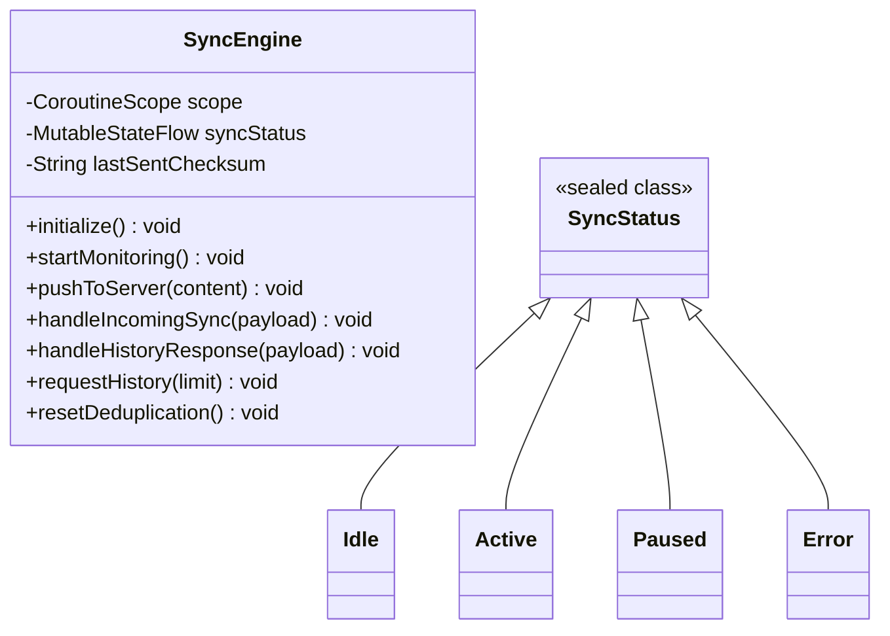

**图表来源**
- [SyncEngine.kt:27-250](file://clipSync-android/app/src/main/java/com/clipsync/app/core/SyncEngine.kt#L27-L250)

#### 异步推送流程

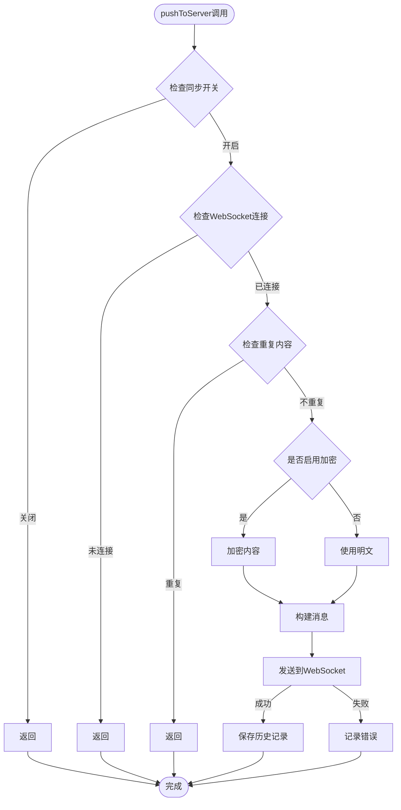

**图表来源**
- [SyncEngine.kt:72-123](file://clipSync-android/app/src/main/java/com/clipsync/app/core/SyncEngine.kt#L72-L123)

#### 去重机制实现

SyncEngine实现了智能的去重机制，防止重复内容在网络中传播：

- **校验和计算**：使用SHA-256算法计算内容哈希
- **状态跟踪**：维护lastSentChecksum变量
- **回环检测**：避免接收自己发送的内容

**章节来源**
- [SyncEngine.kt:38](file://clipSync-android/app/src/main/java/com/clipsync/app/core/SyncEngine.kt#L38)
- [SyncEngine.kt:85-91](file://clipSync-android/app/src/main/java/com/clipsync/app/core/SyncEngine.kt#L85-L91)
- [EncryptionHelper.kt:107-111](file://clipSync-android/app/src/main/java/com/clipsync/app/core/EncryptionHelper.kt#L107-L111)

### 剪贴板监控异步处理

ClipboardMonitor实现了对系统剪贴板的实时监控，使用Flow模式提供异步通知：

#### 监控机制设计

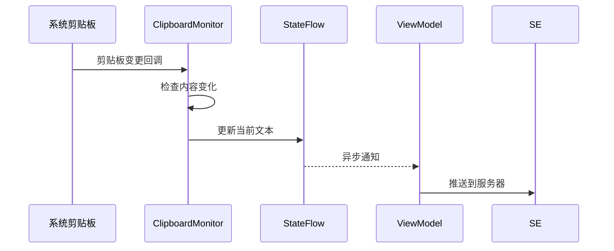

**图表来源**
- [ClipboardMonitor.kt:24-93](file://clipSync-android/app/src/main/java/com/clipsync/app/core/ClipboardMonitor.kt#L24-L93)

#### 防回环机制

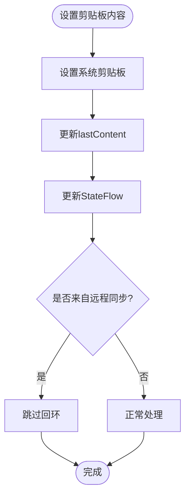

**图表来源**
- [ClipboardMonitor.kt:67-77](file://clipSync-android/app/src/main/java/com/clipsync/app/core/ClipboardMonitor.kt#L67-L77)
- [SyncEngine.kt:136-141](file://clipSync-android/app/src/main/java/com/clipsync/app/core/SyncEngine.kt#L136-L141)

**章节来源**
- [ClipboardMonitor.kt:15-106](file://clipSync-android/app/src/main/java/com/clipsync/app/core/ClipboardMonitor.kt#L15-L106)

### 网络请求协程封装

WebSocketClient实现了完整的WebSocket通信协议，使用协程管理连接生命周期：

#### 连接状态管理

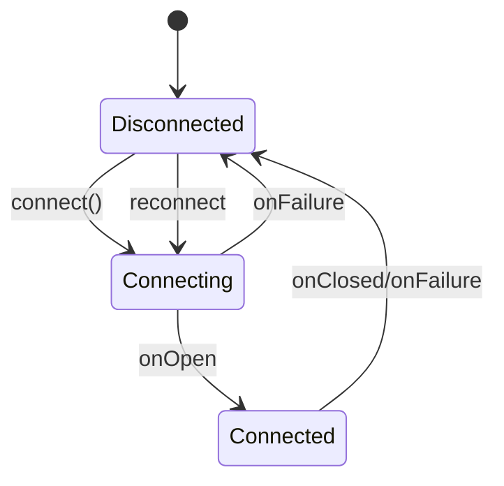

**图表来源**
- [WebSocketClient.kt:150-156](file://clipSync-android/app/src/main/java/com/clipsync/app/network/WebSocketClient.kt#L150-L156)

#### 消息处理流程

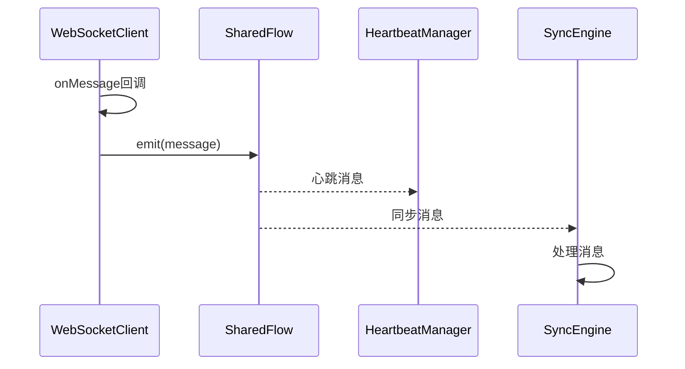

**图表来源**
- [WebSocketClient.kt:53-65](file://clipSync-android/app/src/main/java/com/clipsync/app/network/WebSocketClient.kt#L53-L65)

**章节来源**
- [WebSocketClient.kt:26-156](file://clipSync-android/app/src/main/java/com/clipsync/app/network/WebSocketClient.kt#L26-L156)

### ViewModel协程管理

MainViewModel展示了如何在Android ViewModel中正确使用协程：

#### 生命周期感知的协程

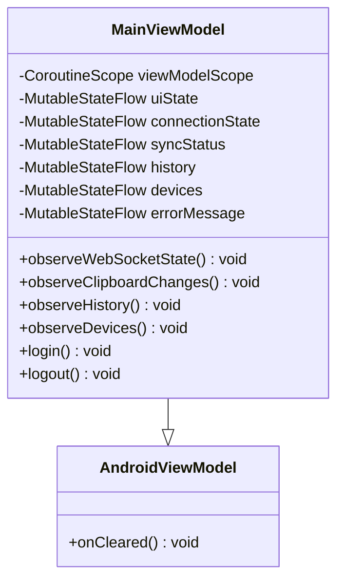

**图表来源**
- [MainViewModel.kt:39-359](file://clipSync-android/app/src/main/java/com/clipsync/app/viewmodel/MainViewModel.kt#L39-L359)

#### 异步操作模式

MainViewModel使用了多种协程模式：
- **collectLatest**：用于监听Flow状态变化
- **fold**：用于处理Result类型的结果
- **first**：用于获取Flow的单个值

**章节来源**
- [MainViewModel.kt:95-116](file://clipSync-android/app/src/main/java/com/clipsync/app/viewmodel/MainViewModel.kt#L95-L116)
- [MainViewModel.kt:205-237](file://clipSync-android/app/src/main/java/com/clipsync/app/viewmodel/MainViewModel.kt#L205-L237)

### 数据库异步操作

AppDatabase结合Room实现了完整的异步数据持久化：

#### 数据实体设计

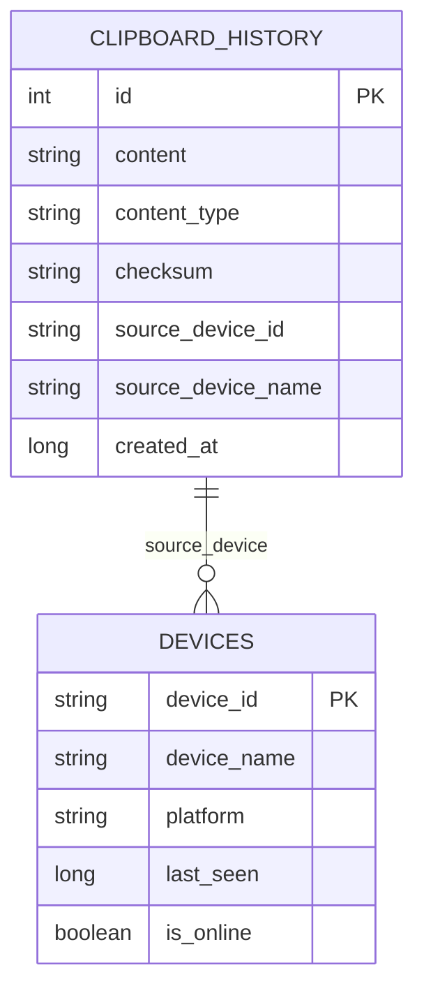

**图表来源**
- [ClipboardEntity.kt:9-20](file://clipSync-android/app/src/main/java/com/clipsync/app/data/entities/ClipboardEntity.kt#L9-L20)
- [AppDatabase.kt:14-41](file://clipSync-android/app/src/main/java/com/clipsync/app/data/AppDatabase.kt#L14-L41)

**章节来源**
- [AppDatabase.kt:14-41](file://clipSync-android/app/src/main/java/com/clipsync/app/data/AppDatabase.kt#L14-L41)
- [ClipboardDao.kt:13-50](file://clipSync-android/app/src/main/java/com/clipsync/app/data/ClipboardDao.kt#L13-L50)

## 依赖关系分析

项目中的协程依赖关系体现了清晰的分层架构：

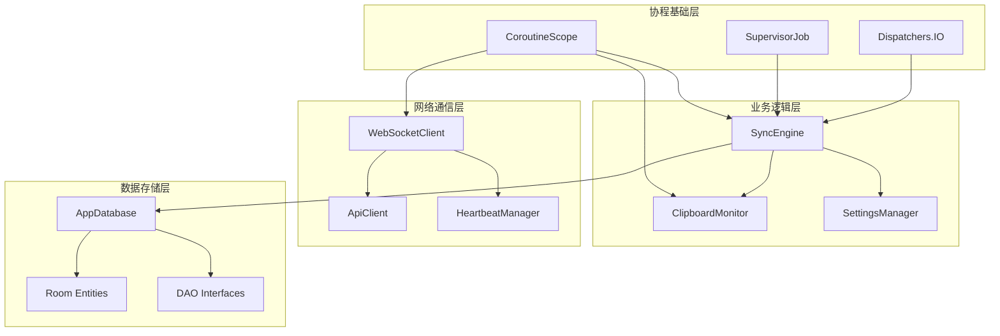

**图表来源**
- [SyncEngine.kt:33](file://clipSync-android/app/src/main/java/com/clipsync/app/core/SyncEngine.kt#L33)
- [WebSocketClient.kt:28](file://clipSync-android/app/src/main/java/com/clipsync/app/network/WebSocketClient.kt#L28)
- [HeartbeatManager.kt:20](file://clipSync-android/app/src/main/java/com/clipsync/app/network/HeartbeatManager.kt#L20)

**章节来源**
- [SyncEngine.kt:27-32](file://clipSync-android/app/src/main/java/com/clipsync/app/core/SyncEngine.kt#L27-L32)
- [WebSocketClient.kt:26-44](file://clipSync-android/app/src/main/java/com/clipsync/app/network/WebSocketClient.kt#L26-L44)

## 性能考虑

### 协程调度优化

项目采用了合理的协程调度策略：

1. **IO密集型操作**：所有网络和数据库操作都在Dispatchers.IO执行
2. **主线程保护**：UI相关的Flow收集在主线程执行
3. **作用域隔离**：每个组件都有独立的协程作用域

### 内存管理策略

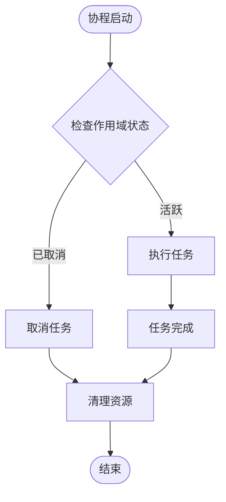

**图表来源**
- [ClipboardService.kt:91-99](file://clipSync-android/app/src/main/java/com/clipsync/app/service/ClipboardService.kt#L91-L99)

### 并发控制机制

项目实现了多层并发控制：

1. **Flow收集控制**：使用collectLatest确保只保留最新订阅
2. **WebSocket连接控制**：通过状态机管理连接生命周期
3. **数据库事务控制**：使用Room的原子性操作

**章节来源**
- [MainViewModel.kt:118-126](file://clipSync-android/app/src/main/java/com/clipsync/app/viewmodel/MainViewModel.kt#L118-L126)
- [WebSocketClient.kt:136-140](file://clipSync-android/app/src/main/java/com/clipsync/app/network/WebSocketClient.kt#L136-L140)

## 故障排除指南

### 常见协程问题及解决方案

#### 内存泄漏问题

**问题描述**：协程持有Activity或Fragment引用导致内存泄漏

**解决方案**：
1. 使用viewModelScope或lifecycleScope替代全局协程作用域
2. 在onCleared()中正确取消协程
3. 使用弱引用或及时释放引用

#### 资源竞争问题

**问题描述**：多个协程同时访问共享资源导致竞态条件

**解决方案**：
1. 使用Mutex或Semaphore进行资源锁定
2. 将共享状态封装在单一协程中
3. 使用Flow的背压机制

#### 取消机制问题

**问题描述**：协程无法正确响应取消信号

**解决方案**：
1. 在协程中定期检查isActive状态
2. 使用withContext切换到可取消的上下文
3. 正确处理CancellationException

### 调试技巧

#### 日志追踪

项目中广泛使用了日志记录来追踪协程执行：

```kotlin
// 协程启动日志
Log.d(TAG, "Coroutine started")

// 状态变化日志  
Log.d(TAG, "State changed to: $state")

// 错误日志
Log.e(TAG, "Coroutine failed", exception)
```

#### 性能监控

建议添加协程执行时间监控：

```kotlin
val startTime = System.currentTimeMillis()
try {
    // 协程执行代码
} finally {
    val duration = System.currentTimeMillis() - startTime
    Log.d(TAG, "Coroutine took ${duration}ms")
}
```

**章节来源**
- [SyncEngine.kt:44](file://clipSync-android/app/src/main/java/com/clipsync/app/core/SyncEngine.kt#L44)
- [ClipboardService.kt:91-99](file://clipSync-android/app/src/main/java/com/clipsync/app/service/ClipboardService.kt#L91-L99)

## 结论

本项目展示了Android协程在实际应用中的最佳实践，通过合理的协程作用域设计、异步任务管理和并发控制机制，实现了高效稳定的剪贴板同步功能。

### 主要优势

1. **架构清晰**：MVVM + 协程的组合提供了清晰的职责分离
2. **性能优秀**：合理的协程调度和资源管理确保了良好的性能表现
3. **可靠性高**：完善的错误处理和取消机制保证了系统的稳定性
4. **扩展性强**：模块化的架构便于功能扩展和维护

### 技术亮点

- **Flow模式**：使用Flow替代传统的回调模式，提供了更好的异步编程体验
- **状态管理**：通过StateFlow和SharedFlow实现了响应式的状态管理
- **生命周期感知**：正确处理了Android生命周期对协程的影响
- **加密安全**：实现了端到端的加密传输机制

该项目为Android协程异步处理提供了优秀的参考实现，展示了如何在生产环境中正确使用Kotlin协程来构建高性能的应用程序。