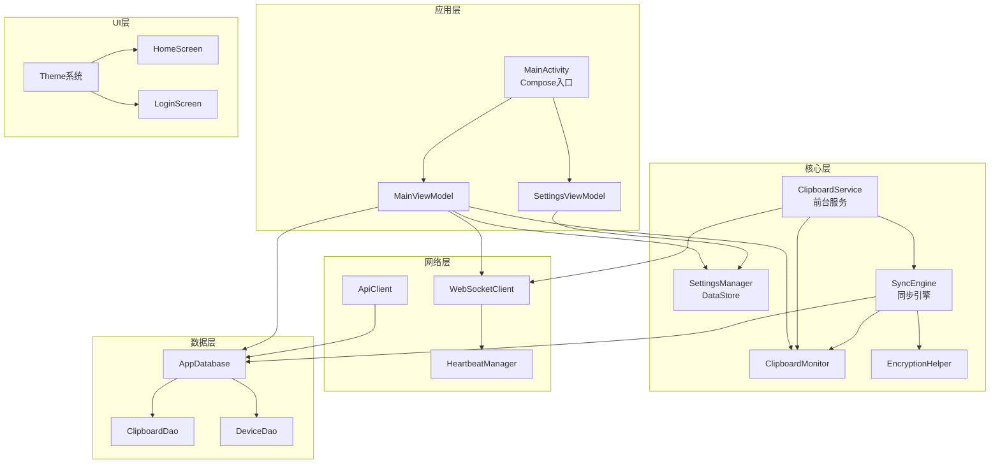
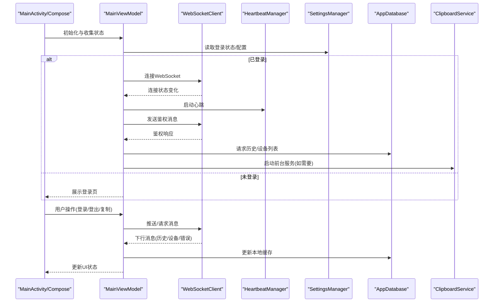
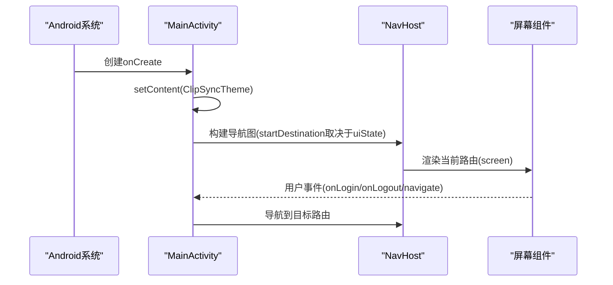
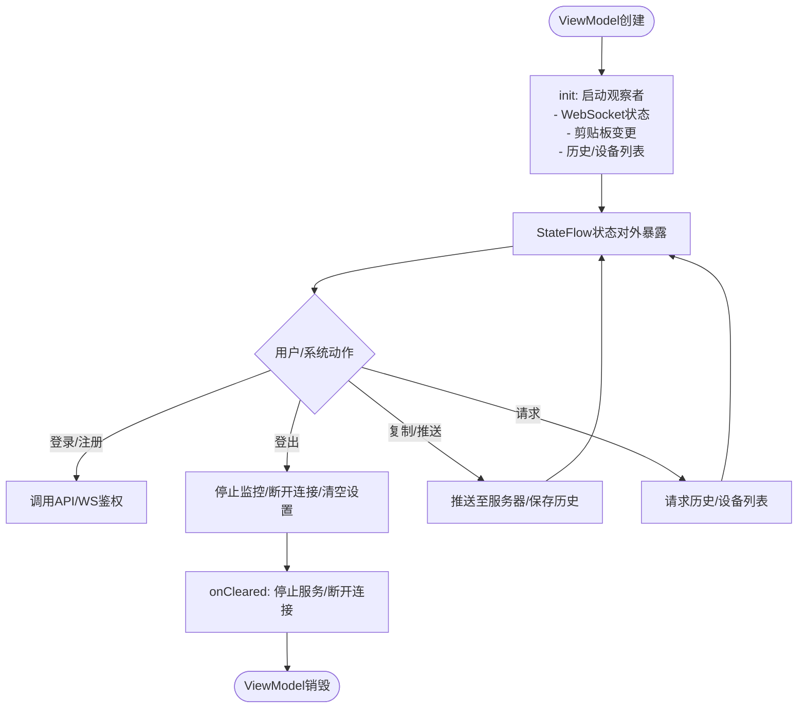
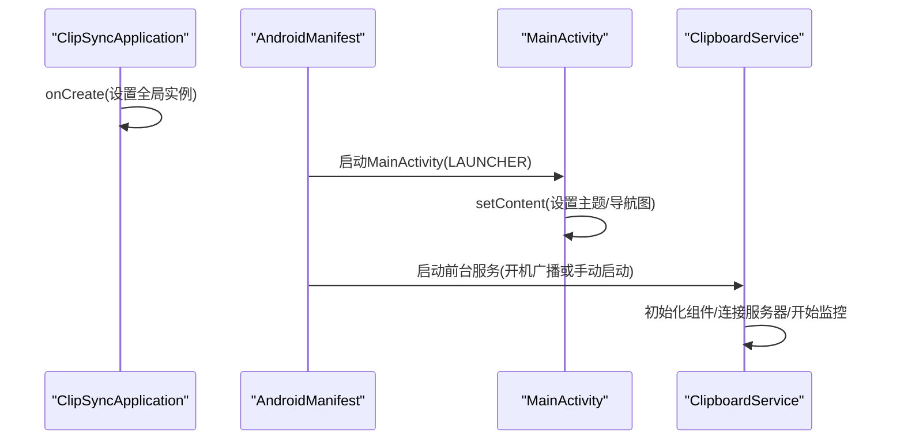
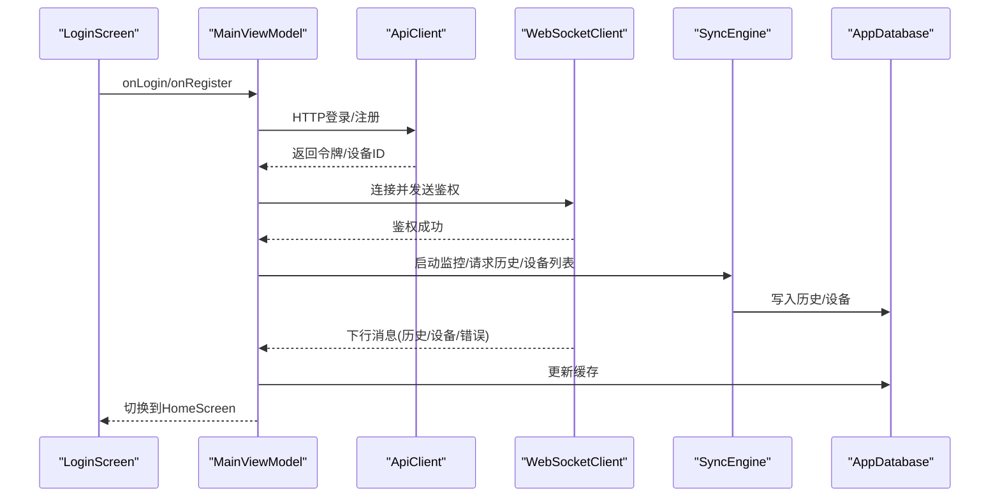
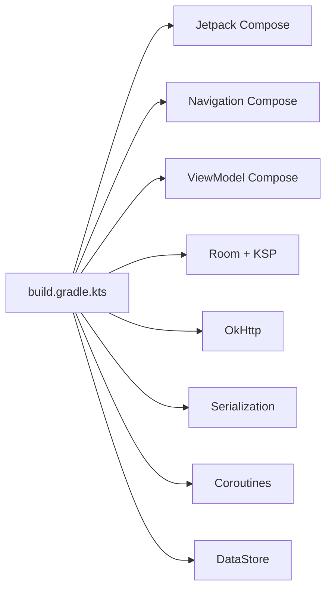

# 应用架构设计

<cite>
**本文档引用的文件**
- [MainActivity.kt](file://clipSync-android/app/src/main/java/com/clipsync/app/MainActivity.kt)
- [ClipSyncApplication.kt](file://clipSync-android/app/src/main/java/com/clipsync/app/ClipSyncApplication.kt)
- [MainViewModel.kt](file://clipSync-android/app/src/main/java/com/clipsync/app/viewmodel/MainViewModel.kt)
- [SettingsViewModel.kt](file://clipSync-android/app/src/main/java/com/clipsync/app/viewmodel/SettingsViewModel.kt)
- [SettingsManager.kt](file://clipSync-android/app/src/main/java/com/clipsync/app/core/SettingsManager.kt)
- [Theme.kt](file://clipSync-android/app/src/main/java/com/clipsync/app/ui/theme/Theme.kt)
- [ApiClient.kt](file://clipSync-android/app/src/main/java/com/clipsync/app/network/ApiClient.kt)
- [AppDatabase.kt](file://clipSync-android/app/src/main/java/com/clipsync/app/data/AppDatabase.kt)
- [ClipboardService.kt](file://clipSync-android/app/src/main/java/com/clipsync/app/service/ClipboardService.kt)
- [SyncEngine.kt](file://clipSync-android/app/src/main/java/com/clipsync/app/core/SyncEngine.kt)
- [HomeScreen.kt](file://clipSync-android/app/src/main/java/com/clipsync/app/ui/screens/HomeScreen.kt)
- [LoginScreen.kt](file://clipSync-android/app/src/main/java/com/clipsync/app/ui/screens/LoginScreen.kt)
- [AndroidManifest.xml](file://clipSync-android/app/src/main/AndroidManifest.xml)
- [build.gradle.kts](file://clipSync-android/app/build.gradle.kts)
</cite>

## 目录
1. [简介](#简介)
2. [项目结构](#项目结构)
3. [核心组件](#核心组件)
4. [架构总览](#架构总览)
5. [详细组件分析](#详细组件分析)
6. [依赖分析](#依赖分析)
7. [性能考虑](#性能考虑)
8. [故障排除指南](#故障排除指南)
9. [结论](#结论)

## 简介
本项目是一个跨设备剪贴板同步应用，采用现代Android架构（Jetpack Compose + MVVM + Kotlin协程），通过WebSocket实现实时同步，并结合Room数据库与DataStore持久化存储。应用入口为MainActivity，使用Compose导航图承载多屏界面；ViewModel负责业务逻辑与状态管理；Service在前台运行以保证后台剪贴板监控与同步能力；网络层基于OkHttp与自定义协议；主题系统支持深浅色与动态色彩。

## 项目结构
应用采用按功能域分层的目录组织方式：
- core：核心业务组件（剪贴板监控、加密、设置管理、同步引擎）
- data：数据访问层（Room数据库、DAO接口）
- network：网络通信（WebSocket客户端、HTTP API客户端、心跳管理）
- service：前台服务（剪贴板监控与同步）
- ui：UI层（屏幕、主题、字体等）
- viewmodel：状态与业务逻辑（MainViewModel、SettingsViewModel）

图表来源
- [MainActivity.kt:1-139](file://clipSync-android/app/src/main/java/com/clipsync/app/MainActivity.kt#L1-L139)
- [MainViewModel.kt:1-359](file://clipSync-android/app/src/main/java/com/clipsync/app/viewmodel/MainViewModel.kt#L1-L359)
- [SettingsViewModel.kt:1-96](file://clipSync-android/app/src/main/java/com/clipsync/app/viewmodel/SettingsViewModel.kt#L1-L96)
- [SettingsManager.kt:1-170](file://clipSync-android/app/src/main/java/com/clipsync/app/core/SettingsManager.kt#L1-L170)
- [ClipboardService.kt:1-249](file://clipSync-android/app/src/main/java/com/clipsync/app/service/ClipboardService.kt#L1-L249)
- [SyncEngine.kt:1-250](file://clipSync-android/app/src/main/java/com/clipsync/app/core/SyncEngine.kt#L1-L250)
- [AppDatabase.kt:1-41](file://clipSync-android/app/src/main/java/com/clipsync/app/data/AppDatabase.kt#L1-L41)
- [ApiClient.kt:1-142](file://clipSync-android/app/src/main/java/com/clipsync/app/network/ApiClient.kt#L1-L142)

章节来源
- [MainActivity.kt:1-139](file://clipSync-android/app/src/main/java/com/clipsync/app/MainActivity.kt#L1-L139)
- [build.gradle.kts:1-102](file://clipSync-android/app/build.gradle.kts#L1-L102)

## 核心组件
- MainActivity：应用入口，负责设置Compose主题与导航图，协调MainViewModel与SettingsViewModel的状态流。
- MainViewModel：应用主状态管理器，处理认证、WebSocket连接、剪贴板同步、历史与设备列表管理。
- SettingsViewModel：设置页面状态管理，桥接SettingsManager与UI。
- SettingsManager：基于DataStore的设置持久化，提供URL、用户名、令牌、设备ID、开关等读写流。
- ClipboardService：前台服务，持续监控剪贴板并进行同步，确保后台可用性。
- SyncEngine：同步编排器，负责去重、加解密、推送/拉取、历史入库与回放。
- AppDatabase：Room数据库，管理剪贴板历史与设备信息。
- Theme系统：Material3主题，支持深浅色与动态色彩，自动适配系统主题。
- 网络层：WebSocketClient + HeartbeatManager + ApiClient，统一消息协议与HTTP API。

章节来源
- [MainActivity.kt:26-42](file://clipSync-android/app/src/main/java/com/clipsync/app/MainActivity.kt#L26-L42)
- [MainViewModel.kt:39-81](file://clipSync-android/app/src/main/java/com/clipsync/app/viewmodel/MainViewModel.kt#L39-L81)
- [SettingsViewModel.kt:17-41](file://clipSync-android/app/src/main/java/com/clipsync/app/viewmodel/SettingsViewModel.kt#L17-L41)
- [SettingsManager.kt:21-168](file://clipSync-android/app/src/main/java/com/clipsync/app/core/SettingsManager.kt#L21-L168)
- [ClipboardService.kt:39-82](file://clipSync-android/app/src/main/java/com/clipsync/app/service/ClipboardService.kt#L39-L82)
- [SyncEngine.kt:27-50](file://clipSync-android/app/src/main/java/com/clipsync/app/core/SyncEngine.kt#L27-L50)
- [AppDatabase.kt:14-40](file://clipSync-android/app/src/main/java/com/clipsync/app/data/AppDatabase.kt#L14-L40)
- [Theme.kt:87-116](file://clipSync-android/app/src/main/java/com/clipsync/app/ui/theme/Theme.kt#L87-L116)
- [ApiClient.kt:14-78](file://clipSync-android/app/src/main/java/com/clipsync/app/network/ApiClient.kt#L14-L78)

## 架构总览
应用采用MVVM + 协程 + Flow 的响应式架构：
- UI层：Jetpack Compose，通过rememberNavController构建导航图，屏幕组件仅关注渲染与事件回调。
- ViewModel层：MainViewModel与SettingsViewModel分别管理主流程与设置状态，使用StateFlow对外暴露不可变状态。
- 核心层：SettingsManager、SyncEngine、ClipboardService封装业务细节，避免UI直接耦合。
- 数据与网络：Room + DataStore持久化，WebSocket + HTTP API通信，心跳保活。

图表来源
- [MainActivity.kt:44-138](file://clipSync-android/app/src/main/java/com/clipsync/app/MainActivity.kt#L44-L138)
- [MainViewModel.kt:75-116](file://clipSync-android/app/src/main/java/com/clipsync/app/viewmodel/MainViewModel.kt#L75-L116)
- [ClipboardService.kt:131-144](file://clipSync-android/app/src/main/java/com/clipsync/app/service/ClipboardService.kt#L131-L144)

## 详细组件分析

### MainActivity与Compose导航图
- 作用：作为应用入口，设置Compose主题，构建NavHost，根据登录状态决定起始路由。
- 导航图：login/home/history/devices/settings五个路由，Home作为已登录用户的默认首页。
- 状态绑定：通过collectAsStateWithLifecycle订阅MainViewModel与SettingsViewModel的状态流，驱动UI更新。

图表来源
- [MainActivity.kt:31-41](file://clipSync-android/app/src/main/java/com/clipsync/app/MainActivity.kt#L31-L41)
- [MainActivity.kt:64-137](file://clipSync-android/app/src/main/java/com/clipsync/app/MainActivity.kt#L64-L137)

章节来源
- [MainActivity.kt:26-42](file://clipSync-android/app/src/main/java/com/clipsync/app/MainActivity.kt#L26-L42)
- [MainActivity.kt:44-138](file://clipSync-android/app/src/main/java/com/clipsync/app/MainActivity.kt#L44-L138)

### 视图模型生命周期管理
- MainViewModel：在init中启动观察者，监听WebSocket状态、剪贴板变更、历史与设备列表；在onCleared中清理资源（停止监控、断开连接、销毁心跳）。
- SettingsViewModel：在init中订阅SettingsManager的多个Flow，保持UI与设置的双向同步。
- 生命周期感知：使用viewModelScope确保协程随ViewModel生命周期结束而取消，避免内存泄漏。

图表来源
- [MainViewModel.kt:75-81](file://clipSync-android/app/src/main/java/com/clipsync/app/viewmodel/MainViewModel.kt#L75-L81)
- [MainViewModel.kt:338-343](file://clipSync-android/app/src/main/java/com/clipsync/app/viewmodel/MainViewModel.kt#L338-L343)
- [SettingsViewModel.kt:39-64](file://clipSync-android/app/src/main/java/com/clipsync/app/viewmodel/SettingsViewModel.kt#L39-L64)

章节来源
- [MainViewModel.kt:39-81](file://clipSync-android/app/src/main/java/com/clipsync/app/viewmodel/MainViewModel.kt#L39-L81)
- [MainViewModel.kt:338-343](file://clipSync-android/app/src/main/java/com/clipsync/app/viewmodel/MainViewModel.kt#L338-L343)
- [SettingsViewModel.kt:17-41](file://clipSync-android/app/src/main/java/com/clipsync/app/viewmodel/SettingsViewModel.kt#L17-L41)

### 应用初始化流程
- Application：ClipSyncApplication在onCreate中设置全局实例，暴露AppDatabase供全局使用。
- Manifest：声明MainActivity为Launcher，声明前台服务与开机广播接收器。
- MainActivity：设置Compose主题，构建导航图，注入ViewModel。
- Service：ClipboardService在onCreate中初始化组件、建立通知通道、连接服务器、启动监控。

图表来源
- [ClipSyncApplication.kt:16-24](file://clipSync-android/app/src/main/java/com/clipsync/app/ClipSyncApplication.kt#L16-L24)
- [AndroidManifest.xml:19-61](file://clipSync-android/app/src/main/AndroidManifest.xml#L19-L61)
- [MainActivity.kt:31-41](file://clipSync-android/app/src/main/java/com/clipsync/app/MainActivity.kt#L31-L41)
- [ClipboardService.kt:52-82](file://clipSync-android/app/src/main/java/com/clipsync/app/service/ClipboardService.kt#L52-L82)

章节来源
- [ClipSyncApplication.kt:10-24](file://clipSync-android/app/src/main/java/com/clipsync/app/ClipSyncApplication.kt#L10-L24)
- [AndroidManifest.xml:19-61](file://clipSync-android/app/src/main/AndroidManifest.xml#L19-L61)
- [MainActivity.kt:31-41](file://clipSync-android/app/src/main/java/com/clipsync/app/MainActivity.kt#L31-L41)
- [ClipboardService.kt:52-82](file://clipSync-android/app/src/main/java/com/clipsync/app/service/ClipboardService.kt#L52-L82)

### 依赖注入配置
- 当前实现：通过构造函数直接注入依赖（SettingsManager、AppDatabase、WebSocketClient、ClipboardMonitor等），在ViewModel与Service中直接new。
- 可选方案：引入Hilt或Koin进行集中式依赖注入，提升可测试性与模块解耦度。

章节来源
- [MainViewModel.kt:41-53](file://clipSync-android/app/src/main/java/com/clipsync/app/viewmodel/MainViewModel.kt#L41-L53)
- [ClipboardService.kt:56-68](file://clipSync-android/app/src/main/java/com/clipsync/app/service/ClipboardService.kt#L56-L68)

### 主题系统设计
- 使用Material3主题，支持深浅色与动态色彩（Android S+）。
- 自动适配系统状态栏颜色与图标明暗。
- 通过ClipSyncTheme包裹整个应用UI，确保一致性。

章节来源
- [Theme.kt:87-116](file://clipSync-android/app/src/main/java/com/clipsync/app/ui/theme/Theme.kt#L87-L116)

### 组件间交互与数据流
- 认证与连接：LoginScreen触发MainViewModel.login/register，设置令牌后连接WebSocket，发送鉴权消息。
- 同步流程：剪贴板变化由ClipboardMonitor捕获，SyncEngine去重与加解密后推送到服务器，收到下行消息后回放到剪贴板并保存历史。
- 设备与历史：通过WebSocket请求设备列表与历史，更新本地数据库并反馈给UI。

图表来源
- [LoginScreen.kt:51-291](file://clipSync-android/app/src/main/java/com/clipsync/app/ui/screens/LoginScreen.kt#L51-L291)
- [MainViewModel.kt:205-271](file://clipSync-android/app/src/main/java/com/clipsync/app/viewmodel/MainViewModel.kt#L205-L271)
- [ApiClient.kt:23-46](file://clipSync-android/app/src/main/java/com/clipsync/app/network/ApiClient.kt#L23-L46)
- [SyncEngine.kt:72-123](file://clipSync-android/app/src/main/java/com/clipsync/app/core/SyncEngine.kt#L72-L123)

章节来源
- [LoginScreen.kt:51-291](file://clipSync-android/app/src/main/java/com/clipsync/app/ui/screens/LoginScreen.kt#L51-L291)
- [MainViewModel.kt:205-271](file://clipSync-android/app/src/main/java/com/clipsync/app/viewmodel/MainViewModel.kt#L205-L271)
- [ApiClient.kt:23-46](file://clipSync-android/app/src/main/java/com/clipsync/app/network/ApiClient.kt#L23-L46)
- [SyncEngine.kt:72-123](file://clipSync-android/app/src/main/java/com/clipsync/app/core/SyncEngine.kt#L72-L123)

### 实际代码示例路径
- MainActivity导航图与状态绑定：[MainActivity.kt:44-138](file://clipSync-android/app/src/main/java/com/clipsync/app/MainActivity.kt#L44-L138)
- MainViewModel初始化与观察者：[MainViewModel.kt:75-116](file://clipSync-android/app/src/main/java/com/clipsync/app/viewmodel/MainViewModel.kt#L75-L116)
- SettingsViewModel设置项读写：[SettingsViewModel.kt:66-94](file://clipSync-android/app/src/main/java/com/clipsync/app/viewmodel/SettingsViewModel.kt#L66-L94)
- SettingsManager DataStore读写：[SettingsManager.kt:39-112](file://clipSync-android/app/src/main/java/com/clipsync/app/core/SettingsManager.kt#L39-L112)
- SyncEngine推送/回放逻辑：[SyncEngine.kt:72-160](file://clipSync-android/app/src/main/java/com/clipsync/app/core/SyncEngine.kt#L72-L160)
- ClipboardService前台服务：[ClipboardService.kt:52-82](file://clipSync-android/app/src/main/java/com/clipsync/app/service/ClipboardService.kt#L52-L82)

## 依赖分析
- 编译与运行时依赖：Compose、Navigation、ViewModel、Room、OkHttp、Serialization、Coroutines、DataStore。
- 版本与兼容性：compileSdk/targetSdk 34，Java 17，Compose BOM统一版本，Navigation Compose 2.7.6。
- 权限与服务：INTERNET、ACCESS_NETWORK_STATE、FOREGROUND_SERVICE、BOOT_COMPLETED、POST_NOTIFICATIONS等。

图表来源
- [build.gradle.kts:57-101](file://clipSync-android/app/build.gradle.kts#L57-L101)

章节来源
- [build.gradle.kts:1-102](file://clipSync-android/app/build.gradle.kts#L1-L102)

## 性能考虑
- 协程与作用域：使用viewModelScope与IO调度器，避免主线程阻塞；SupervisorJob确保子任务失败不影响其他任务。
- 去重策略：基于内容校验和的推送去重，减少重复消息与数据库压力。
- 数据库优化：历史记录限制数量（保留最近50条），定期清理旧数据。
- 网络优化：心跳保活，鉴权后才启动监控，避免无效连接。
- UI响应：使用collectAsStateWithLifecycle，确保生命周期安全的UI订阅。

## 故障排除指南
- 登录失败：检查HTTP URL与用户名密码，查看MainViewModel的错误状态流；确认DataStore中的令牌是否正确写入。
- WebSocket无法连接：检查WebSocket URL与网络权限，确认HeartbeatManager是否启动；查看连接状态流。
- 剪贴板不同步：确认Sync开关与加密开关设置；检查去重校验和；验证前台服务是否正常运行。
- 历史为空：确认鉴权成功后是否请求了历史；检查数据库写入与查询逻辑。
- 前台服务异常：检查通知渠道创建与START_STICKY返回值；确认onDestroy中资源释放。

章节来源
- [MainViewModel.kt:196-201](file://clipSync-android/app/src/main/java/com/clipsync/app/viewmodel/MainViewModel.kt#L196-L201)
- [ClipboardService.kt:131-144](file://clipSync-android/app/src/main/java/com/clipsync/app/service/ClipboardService.kt#L131-L144)
- [SyncEngine.kt:85-91](file://clipSync-android/app/src/main/java/com/clipsync/app/core/SyncEngine.kt#L85-L91)

## 结论
该应用采用清晰的MVVM与响应式架构，结合Compose导航与Material3主题，实现了稳定可靠的跨设备剪贴板同步。通过前台服务保障后台能力，通过DataStore与Room实现持久化，通过去重与心跳机制提升性能与可靠性。建议后续引入依赖注入框架以增强可测试性与模块解耦，并进一步完善错误处理与日志体系。