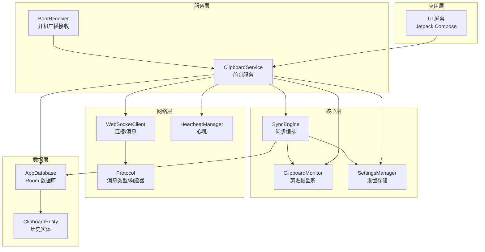
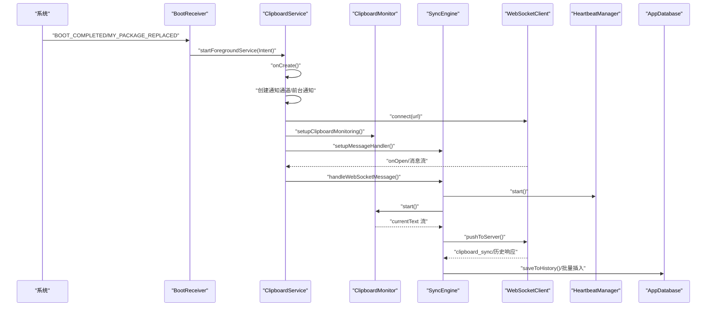
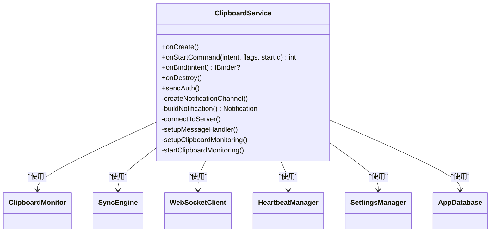
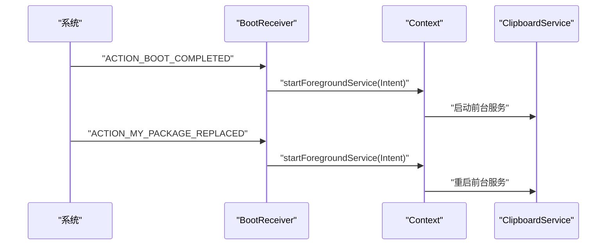
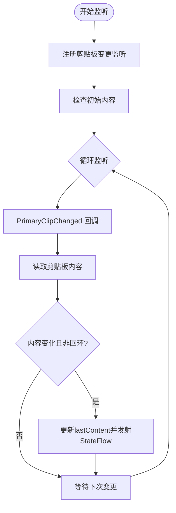
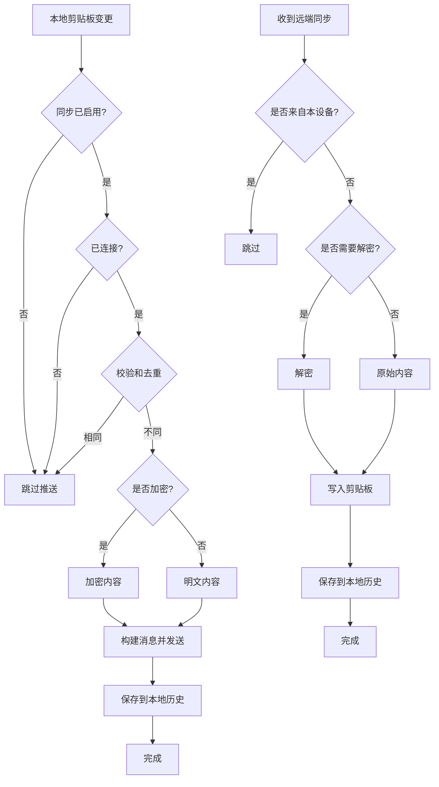
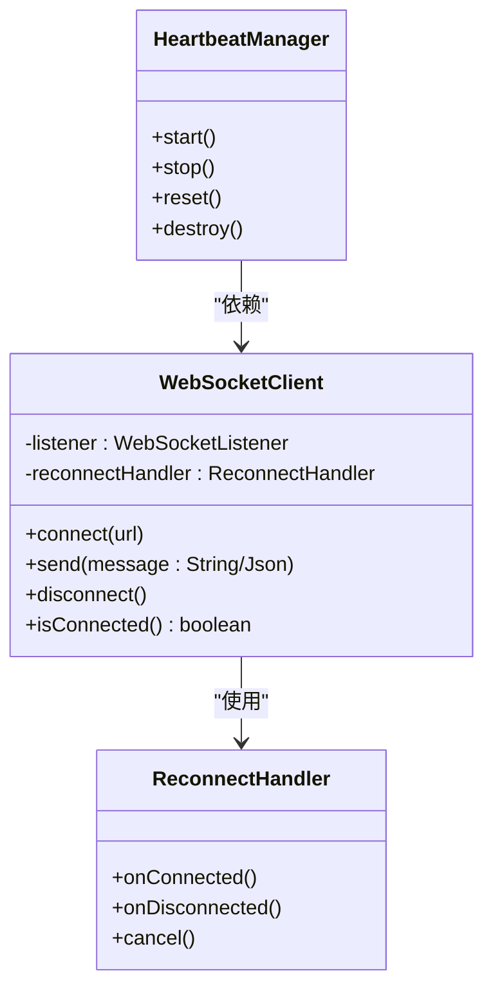
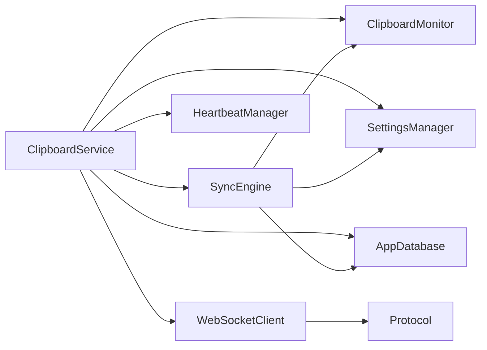

# 服务管理

<cite>
**本文引用的文件**
- [ClipboardService.kt](file://clipSync-android/app/src/main/java/com/clipsync/app/service/ClipboardService.kt)
- [BootReceiver.kt](file://clipSync-android/app/src/main/java/com/clipsync/app/service/BootReceiver.kt)
- [ClipboardMonitor.kt](file://clipSync-android/app/src/main/java/com/clipsync/app/core/ClipboardMonitor.kt)
- [SyncEngine.kt](file://clipSync-android/app/src/main/java/com/clipsync/app/core/SyncEngine.kt)
- [WebSocketClient.kt](file://clipSync-android/app/src/main/java/com/clipsync/app/network/WebSocketClient.kt)
- [HeartbeatManager.kt](file://clipSync-android/app/src/main/java/com/clipsync/app/network/HeartbeatManager.kt)
- [SettingsManager.kt](file://clipSync-android/app/src/main/java/com/clipsync/app/core/SettingsManager.kt)
- [Protocol.kt](file://clipSync-android/app/src/main/java/com/clipsync/app/network/Protocol.kt)
- [AppDatabase.kt](file://clipSync-android/app/src/main/java/com/clipsync/app/data/AppDatabase.kt)
- [ClipboardEntity.kt](file://clipSync-android/app/src/main/java/com/clipsync/app/data/entities/ClipboardEntity.kt)
- [ClipSyncApplication.kt](file://clipSync-android/app/src/main/java/com/clipsync/app/ClipSyncApplication.kt)
- [AndroidManifest.xml](file://clipSync-android/app/src/main/AndroidManifest.xml)
</cite>

## 目录
1. [简介](#简介)
2. [项目结构](#项目结构)
3. [核心组件](#核心组件)
4. [架构总览](#架构总览)
5. [详细组件分析](#详细组件分析)
6. [依赖关系分析](#依赖关系分析)
7. [性能与稳定性](#性能与稳定性)
8. [故障排查指南](#故障排查指南)
9. [结论](#结论)
10. [附录：权限与配置清单](#附录权限与配置清单)

## 简介
本文件面向Android平台的“剪贴板同步”应用，系统性阐述服务管理的设计与实现，重点覆盖：
- 前台服务的实现与生命周期管理
- 开机自启动机制与广播接收
- 剪贴板监听服务的设计与去重策略
- ClipboardService的启动模式、绑定机制与系统权限
- 资源管理、错误处理与性能优化
- 稳定性保障、电池优化适配与用户体验优化
- 常见问题与系统兼容性建议

## 项目结构
Android端采用按职责分层的组织方式：
- service 层：前台服务与开机广播接收器
- core 层：剪贴板监控、加密工具、设置管理、同步引擎
- network 层：WebSocket客户端、心跳管理、消息协议
- data 层：Room数据库、实体与DAO
- ui 层：Jetpack Compose界面（本文件不展开UI细节）
- 应用入口：Application类初始化全局数据库实例



图表来源
- [ClipboardService.kt:1-249](file://clipSync-android/app/src/main/java/com/clipsync/app/service/ClipboardService.kt#L1-L249)
- [BootReceiver.kt:1-38](file://clipSync-android/app/src/main/java/com/clipsync/app/service/BootReceiver.kt#L1-L38)
- [ClipboardMonitor.kt:1-106](file://clipSync-android/app/src/main/java/com/clipsync/app/core/ClipboardMonitor.kt#L1-L106)
- [SyncEngine.kt:1-250](file://clipSync-android/app/src/main/java/com/clipsync/app/core/SyncEngine.kt#L1-L250)
- [WebSocketClient.kt:1-156](file://clipSync-android/app/src/main/java/com/clipsync/app/network/WebSocketClient.kt#L1-L156)
- [HeartbeatManager.kt:1-76](file://clipSync-android/app/src/main/java/com/clipsync/app/network/HeartbeatManager.kt#L1-L76)
- [Protocol.kt:1-263](file://clipSync-android/app/src/main/java/com/clipsync/app/network/Protocol.kt#L1-L263)
- [AppDatabase.kt:1-41](file://clipSync-android/app/src/main/java/com/clipsync/app/data/AppDatabase.kt#L1-L41)
- [ClipboardEntity.kt:1-20](file://clipSync-android/app/src/main/java/com/clipsync/app/data/entities/ClipboardEntity.kt#L1-L20)
- [ClipSyncApplication.kt:1-26](file://clipSync-android/app/src/main/java/com/clipsync/app/ClipSyncApplication.kt#L1-L26)

章节来源
- [AndroidManifest.xml:1-64](file://clipSync-android/app/src/main/AndroidManifest.xml#L1-L64)

## 核心组件
- ClipboardService：前台服务，负责通知栏常驻、剪贴板监听、WebSocket通信与心跳、数据库持久化等。
- BootReceiver：接收系统开机完成与包替换广播，启动前台服务。
- ClipboardMonitor：基于系统剪贴板监听变化，使用StateFlow对外发布内容变更。
- SyncEngine：协调本地/远端同步、去重、加解密、历史入库与拉取。
- WebSocketClient：OkHttp封装的WebSocket客户端，提供连接状态、消息流与重连策略。
- HeartbeatManager：周期性发送心跳，维持长连接活跃。
- SettingsManager：基于DataStore的偏好存储，提供服务器地址、设备信息、开关项等。
- AppDatabase/ClipboardEntity：Room数据库与历史实体，用于本地历史记录与去重阈值控制。

章节来源
- [ClipboardService.kt:39-249](file://clipSync-android/app/src/main/java/com/clipsync/app/service/ClipboardService.kt#L39-L249)
- [BootReceiver.kt:13-38](file://clipSync-android/app/src/main/java/com/clipsync/app/service/BootReceiver.kt#L13-L38)
- [ClipboardMonitor.kt:15-106](file://clipSync-android/app/src/main/java/com/clipsync/app/core/ClipboardMonitor.kt#L15-L106)
- [SyncEngine.kt:27-250](file://clipSync-android/app/src/main/java/com/clipsync/app/core/SyncEngine.kt#L27-L250)
- [WebSocketClient.kt:26-156](file://clipSync-android/app/src/main/java/com/clipsync/app/network/WebSocketClient.kt#L26-L156)
- [HeartbeatManager.kt:16-76](file://clipSync-android/app/src/main/java/com/clipsync/app/network/HeartbeatManager.kt#L16-L76)
- [SettingsManager.kt:21-170](file://clipSync-android/app/src/main/java/com/clipsync/app/core/SettingsManager.kt#L21-L170)
- [AppDatabase.kt:14-41](file://clipSync-android/app/src/main/java/com/clipsync/app/data/AppDatabase.kt#L14-L41)
- [ClipboardEntity.kt:9-20](file://clipSync-android/app/src/main/java/com/clipsync/app/data/entities/ClipboardEntity.kt#L9-L20)

## 架构总览
ClipboardService作为系统级前台服务，贯穿“剪贴板监听—消息编排—网络传输—历史持久化”的完整链路，并在认证成功后开启心跳与本地监听。



图表来源
- [BootReceiver.kt:15-32](file://clipSync-android/app/src/main/java/com/clipsync/app/service/BootReceiver.kt#L15-L32)
- [ClipboardService.kt:52-82](file://clipSync-android/app/src/main/java/com/clipsync/app/service/ClipboardService.kt#L52-L82)
- [SyncEngine.kt:72-123](file://clipSync-android/app/src/main/java/com/clipsync/app/core/SyncEngine.kt#L72-L123)
- [WebSocketClient.kt:46-78](file://clipSync-android/app/src/main/java/com/clipsync/app/network/WebSocketClient.kt#L46-L78)
- [HeartbeatManager.kt:27-44](file://clipSync-android/app/src/main/java/com/clipsync/app/network/HeartbeatManager.kt#L27-L44)
- [AppDatabase.kt:21-38](file://clipSync-android/app/src/main/java/com/clipsync/app/data/AppDatabase.kt#L21-L38)

## 详细组件分析

### 前台服务：ClipboardService
- 启动模式与生命周期
  - onStartCommand返回START_STICKY，确保被系统杀死后重启。
  - onCreate中初始化组件、创建通知通道并以前台模式运行。
  - onDestroy中停止监听、断开WebSocket、取消协程作用域，避免资源泄漏。
- 绑定机制
  - onBind返回空，表示该服务不支持绑定（仅通过startForegroundService启动）。
- 通知与权限
  - 使用FOREGROUND_SERVICE与FOREGROUND_SERVICE_CLIPBOARD权限声明前台服务类型。
  - 构建低重要性的通知通道，设置静音与持续显示。
- 关键流程
  - 连接服务器、注册消息处理器、启动剪贴板监听、认证成功后启动心跳与请求历史。
  - 提供sendAuth方法用于显式发送认证消息。



图表来源
- [ClipboardService.kt:39-249](file://clipSync-android/app/src/main/java/com/clipsync/app/service/ClipboardService.kt#L39-L249)
- [ClipboardMonitor.kt:15-106](file://clipSync-android/app/src/main/java/com/clipsync/app/core/ClipboardMonitor.kt#L15-L106)
- [SyncEngine.kt:27-32](file://clipSync-android/app/src/main/java/com/clipsync/app/core/SyncEngine.kt#L27-L32)
- [WebSocketClient.kt:26-44](file://clipSync-android/app/src/main/java/com/clipsync/app/network/WebSocketClient.kt#L26-L44)
- [HeartbeatManager.kt:16-22](file://clipSync-android/app/src/main/java/com/clipsync/app/network/HeartbeatManager.kt#L16-L22)
- [SettingsManager.kt:21-32](file://clipSync-android/app/src/main/java/com/clipsync/app/core/SettingsManager.kt#L21-L32)
- [AppDatabase.kt:19-23](file://clipSync-android/app/src/main/java/com/clipsync/app/data/AppDatabase.kt#L19-L23)

章节来源
- [ClipboardService.kt:52-99](file://clipSync-android/app/src/main/java/com/clipsync/app/service/ClipboardService.kt#L52-L99)
- [AndroidManifest.xml:43-48](file://clipSync-android/app/src/main/AndroidManifest.xml#L43-L48)

### 开机自启动：BootReceiver
- 广播接收
  - 处理BOOT_COMPLETED与MY_PACKAGE_REPLACED事件，确保用户更换或重装应用后仍能自动启动。
- 启动逻辑
  - 根据系统版本选择startForegroundService或startService，保证前台服务可用。
- 权限要求
  - manifest中声明RECEIVE_BOOT_COMPLETED权限。



图表来源
- [BootReceiver.kt:15-32](file://clipSync-android/app/src/main/java/com/clipsync/app/service/BootReceiver.kt#L15-L32)
- [AndroidManifest.xml:51-59](file://clipSync-android/app/src/main/AndroidManifest.xml#L51-L59)

章节来源
- [BootReceiver.kt:15-32](file://clipSync-android/app/src/main/java/com/clipsync/app/service/BootReceiver.kt#L15-L32)

### 剪贴板监听：ClipboardMonitor
- 监听机制
  - 注册OnPrimaryClipChangedListener，首次启动时主动检查一次当前剪贴板内容。
- 内容获取与设置
  - getCurrentText用于读取当前文本但不触发变更；setTextToClipboard设置文本并避免回环（通过lastContent跟踪）。
- 安全与异常
  - 捕获SecurityException，防止无权限导致崩溃。
- 状态流
  - 使用MutableStateFlow对外暴露currentText，供上层订阅。



图表来源
- [ClipboardMonitor.kt:24-93](file://clipSync-android/app/src/main/java/com/clipsync/app/core/ClipboardMonitor.kt#L24-L93)

章节来源
- [ClipboardMonitor.kt:15-106](file://clipSync-android/app/src/main/java/com/clipsync/app/core/ClipboardMonitor.kt#L15-L106)

### 同步编排：SyncEngine
- 推送策略
  - 基于SettingsManager的开关与连接状态判断是否推送；使用校验和去重，避免重复发送。
  - 可选加密：根据设置决定是否加密内容后再发送。
- 接收与回写
  - 处理来自远端的同步消息，跳过本设备发出的内容；解密后写入剪贴板，避免回环。
- 历史管理
  - 支持请求远端历史并批量写入本地数据库；保存时限制历史条目数量，保持轻量。
- 状态与重连
  - 通过CoroutineScope管理任务；在重连后可重置去重状态。



图表来源
- [SyncEngine.kt:72-123](file://clipSync-android/app/src/main/java/com/clipsync/app/core/SyncEngine.kt#L72-L123)
- [SyncEngine.kt:128-160](file://clipSync-android/app/src/main/java/com/clipsync/app/core/SyncEngine.kt#L128-L160)
- [SyncEngine.kt:165-194](file://clipSync-android/app/src/main/java/com/clipsync/app/core/SyncEngine.kt#L165-L194)

章节来源
- [SyncEngine.kt:27-250](file://clipSync-android/app/src/main/java/com/clipsync/app/core/SyncEngine.kt#L27-L250)

### 网络层：WebSocketClient 与 HeartbeatManager
- 连接与状态
  - 使用OkHttp创建WebSocket，维护连接状态枚举；消息通过SharedFlow异步分发。
  - 提供连接超时、读超时与心跳间隔配置。
- 心跳
  - HeartbeatManager周期性发送心跳，序列号自增；在连接建立后启动，在销毁时清理。
- 重连
  - 通过ReconnectHandler在断开时自动重连，同时更新连接状态。



图表来源
- [WebSocketClient.kt:26-156](file://clipSync-android/app/src/main/java/com/clipsync/app/network/WebSocketClient.kt#L26-L156)
- [HeartbeatManager.kt:16-76](file://clipSync-android/app/src/main/java/com/clipsync/app/network/HeartbeatManager.kt#L16-L76)

章节来源
- [WebSocketClient.kt:26-156](file://clipSync-android/app/src/main/java/com/clipsync/app/network/WebSocketClient.kt#L26-L156)
- [HeartbeatManager.kt:16-76](file://clipSync-android/app/src/main/java/com/clipsync/app/network/HeartbeatManager.kt#L16-L76)

### 设置与持久化：SettingsManager 与 AppDatabase
- SettingsManager
  - 基于DataStore Preferences存储服务器URL、用户名、令牌、设备ID/名称、同步与加密开关等。
  - 提供Flow读取与suspend写入，便于UI与服务层实时感知配置变化。
- AppDatabase
  - Room数据库，包含剪贴板历史与设备表；提供DAO访问接口；单例初始化。

```mermaid
erDiagram
CLIPBOARD_ENTITY {
int id PK
string content
string contentType
string checksum
string sourceDeviceId
string sourceDeviceName
long createdAt
}
DEVICE_ENTITY {
string id PK
string name
string platform
long lastSeen
boolean isOnline
}
APP_DATABASE {
"Room 数据库"
}
APP_DATABASE ||--o{ CLIPBOARD_ENTITY : "clipboardDao()"
APP_DATABASE ||--o{ DEVICE_ENTITY : "deviceDao()"
```

图表来源
- [AppDatabase.kt:14-41](file://clipSync-android/app/src/main/java/com/clipsync/app/data/AppDatabase.kt#L14-L41)
- [ClipboardEntity.kt:9-20](file://clipSync-android/app/src/main/java/com/clipsync/app/data/entities/ClipboardEntity.kt#L9-L20)

章节来源
- [SettingsManager.kt:21-170](file://clipSync-android/app/src/main/java/com/clipsync/app/core/SettingsManager.kt#L21-L170)
- [AppDatabase.kt:14-41](file://clipSync-android/app/src/main/java/com/clipsync/app/data/AppDatabase.kt#L14-L41)

### 协议与消息：Protocol
- 消息类型与载荷
  - 定义了认证、心跳、剪贴板推送/同步、历史、设备列表、错误等消息类型与对应载荷。
- 构建器
  - WsMessageBuilder提供统一的消息构造方法，便于在服务与引擎中复用。

章节来源
- [Protocol.kt:20-263](file://clipSync-android/app/src/main/java/com/clipsync/app/network/Protocol.kt#L20-L263)

## 依赖关系分析
- 服务耦合度
  - ClipboardService聚合多个子系统：剪贴板监听、同步引擎、WebSocket、心跳、设置与数据库。
  - 通过协程作用域隔离生命周期，避免跨组件共享过多状态。
- 外部依赖
  - OkHttp用于WebSocket；Kotlinx Serialization用于消息编解码；Room用于本地持久化；DataStore用于设置存储。
- 潜在风险
  - 若SettingsManager未初始化或未获取到令牌，服务将无法连接；需在onCreate中正确初始化。
  - 心跳与消息流均在协程中运行，需确保作用域在onDestroy中正确取消。



图表来源
- [ClipboardService.kt:41-68](file://clipSync-android/app/src/main/java/com/clipsync/app/service/ClipboardService.kt#L41-L68)
- [SyncEngine.kt:27-32](file://clipSync-android/app/src/main/java/com/clipsync/app/core/SyncEngine.kt#L27-L32)
- [WebSocketClient.kt:26-44](file://clipSync-android/app/src/main/java/com/clipsync/app/network/WebSocketClient.kt#L26-L44)
- [Protocol.kt:20-52](file://clipSync-android/app/src/main/java/com/clipsync/app/network/Protocol.kt#L20-L52)

章节来源
- [ClipboardService.kt:41-68](file://clipSync-android/app/src/main/java/com/clipsync/app/service/ClipboardService.kt#L41-L68)
- [SyncEngine.kt:27-32](file://clipSync-android/app/src/main/java/com/clipsync/app/core/SyncEngine.kt#L27-L32)

## 性能与稳定性
- 协程与作用域
  - 使用SupervisorJob隔离子任务，避免一个任务失败影响整体；在onDestroy中统一取消作用域，防止泄漏。
- 去重与节流
  - 基于校验和的去重策略减少重复推送；剪贴板监听通过lastContent避免回环。
- 连接与心跳
  - 心跳间隔30秒，结合重连策略提升连接稳定性；连接状态通过StateFlow对外暴露，便于UI与逻辑层感知。
- 数据库写入
  - 批量插入历史并限制条目数量，避免历史无限增长。
- 通知与前台服务
  - 使用低重要性通知通道，避免打扰用户；前台服务类型明确为剪贴板用途，符合权限要求。

章节来源
- [ClipboardService.kt:41-42](file://clipSync-android/app/src/main/java/com/clipsync/app/service/ClipboardService.kt#L41-L42)
- [SyncEngine.kt:85-91](file://clipSync-android/app/src/main/java/com/clipsync/app/core/SyncEngine.kt#L85-L91)
- [ClipboardMonitor.kt:67-77](file://clipSync-android/app/src/main/java/com/clipsync/app/core/ClipboardMonitor.kt#L67-L77)
- [HeartbeatManager.kt:27-44](file://clipSync-android/app/src/main/java/com/clipsync/app/network/HeartbeatManager.kt#L27-L44)
- [AppDatabase.kt:21-38](file://clipSync-android/app/src/main/java/com/clipsync/app/data/AppDatabase.kt#L21-L38)

## 故障排查指南
- 无法连接服务器
  - 检查SettingsManager中的令牌与服务器URL是否有效；确认WebSocketClient连接状态。
  - 章节来源
    - [ClipboardService.kt:131-144](file://clipSync-android/app/src/main/java/com/clipsync/app/service/ClipboardService.kt#L131-L144)
    - [WebSocketClient.kt:83-103](file://clipSync-android/app/src/main/java/com/clipsync/app/network/WebSocketClient.kt#L83-L103)
- 剪贴板监听无效
  - 确认ClipboardMonitor已start且未被stop；检查SecurityException日志。
  - 章节来源
    - [ClipboardMonitor.kt:31-44](file://clipSync-android/app/src/main/java/com/clipsync/app/core/ClipboardMonitor.kt#L31-L44)
    - [ClipboardMonitor.kt:79-93](file://clipSync-android/app/src/main/java/com/clipsync/app/core/ClipboardMonitor.kt#L79-L93)
- 服务被系统杀死
  - 确保onStartCommand返回START_STICKY；在onDestroy中正确释放资源。
  - 章节来源
    - [ClipboardService.kt:84-99](file://clipSync-android/app/src/main/java/com/clipsync/app/service/ClipboardService.kt#L84-L99)
- 开机自启动失败
  - 检查RECEIVE_BOOT_COMPLETED权限与广播接收器注册；确认startForegroundService调用路径。
  - 章节来源
    - [BootReceiver.kt:25-32](file://clipSync-android/app/src/main/java/com/clipsync/app/service/BootReceiver.kt#L25-L32)
    - [AndroidManifest.xml:51-59](file://clipSync-android/app/src/main/AndroidManifest.xml#L51-L59)

## 结论
本服务管理方案以前台服务为核心，结合剪贴板监听、WebSocket通信与本地持久化，实现了稳定可靠的跨设备剪贴板同步能力。通过去重、心跳、重连与协程作用域管理，系统在复杂网络环境下仍能保持高可用与低功耗。建议在生产环境中进一步完善：
- 用户引导与权限提示（如通知与后台运行权限）
- 电池优化白名单申请与忽略电池优化
- 更细粒度的日志与指标上报
- UI层对连接状态与同步状态的可视化反馈

## 附录：权限与配置清单
- Manifest权限
  - INTERNET、ACCESS_NETWORK_STATE：网络访问
  - FOREGROUND_SERVICE、FOREGROUND_SERVICE_CLIPBOARD：前台服务与剪贴板类型
  - RECEIVE_BOOT_COMPLETED：开机自启动
  - POST_NOTIFICATIONS：通知权限（Android 13+）
- 服务与接收器注册
  - ClipboardService：前台服务，类型为clipboard
  - BootReceiver：广播接收器，过滤BOOT_COMPLETED与MY_PACKAGE_REPLACED

章节来源
- [AndroidManifest.xml:5-17](file://clipSync-android/app/src/main/AndroidManifest.xml#L5-L17)
- [AndroidManifest.xml:43-59](file://clipSync-android/app/src/main/AndroidManifest.xml#L43-L59)