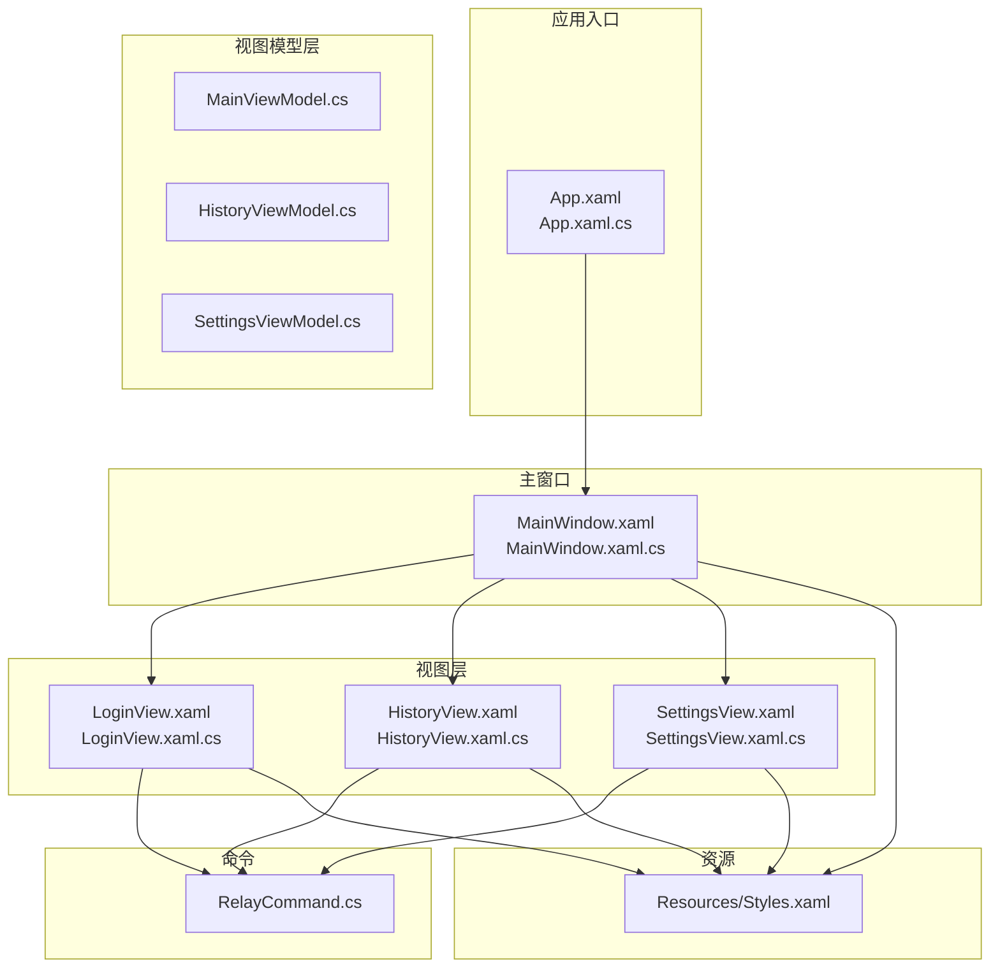
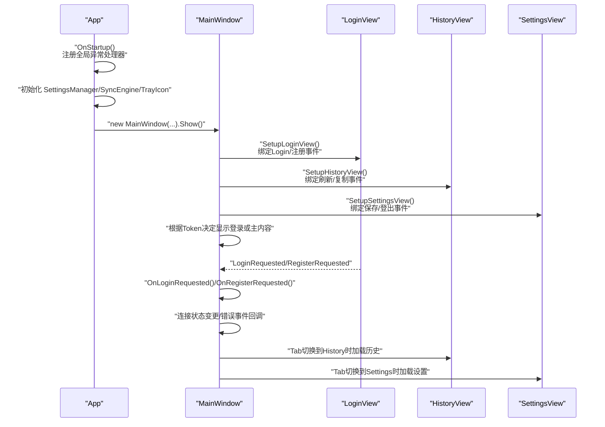
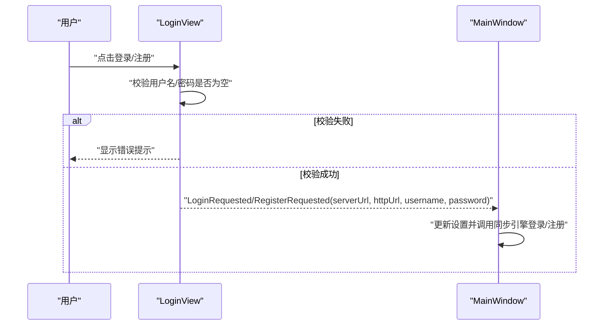
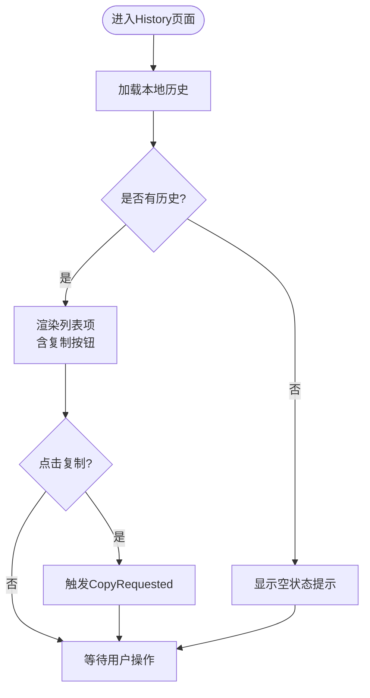
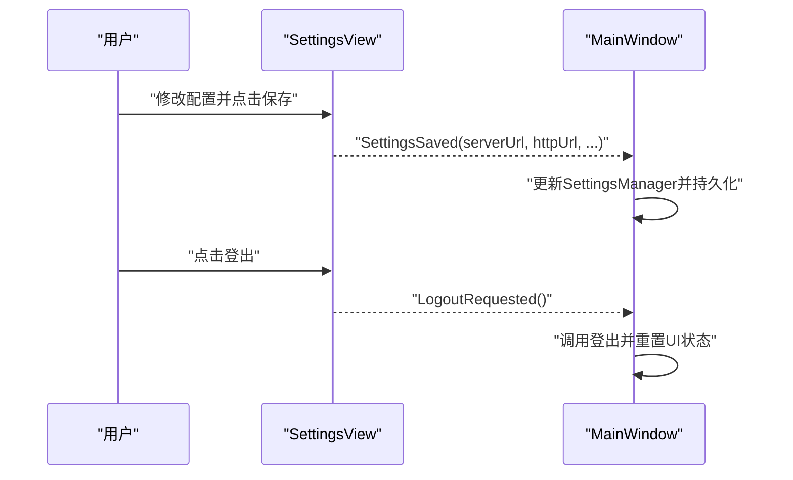
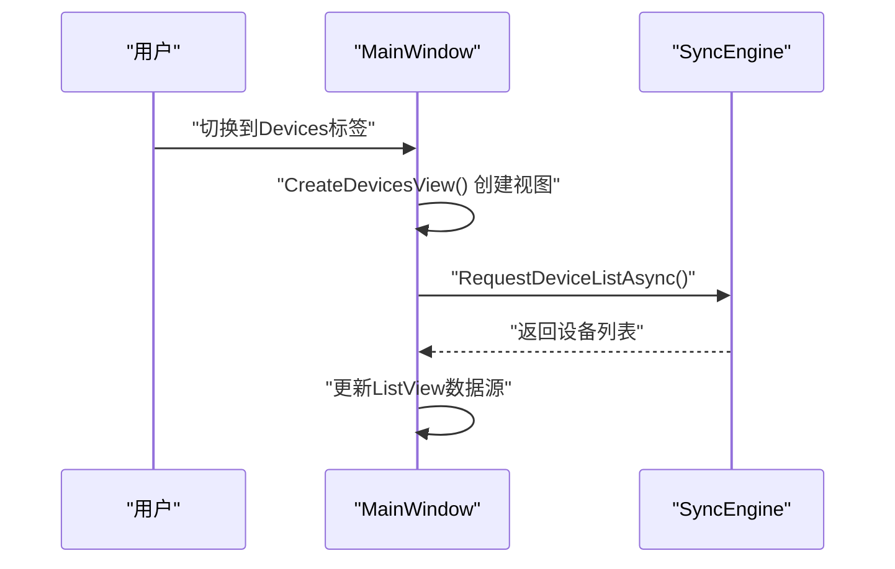
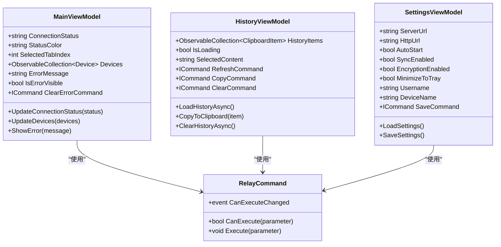
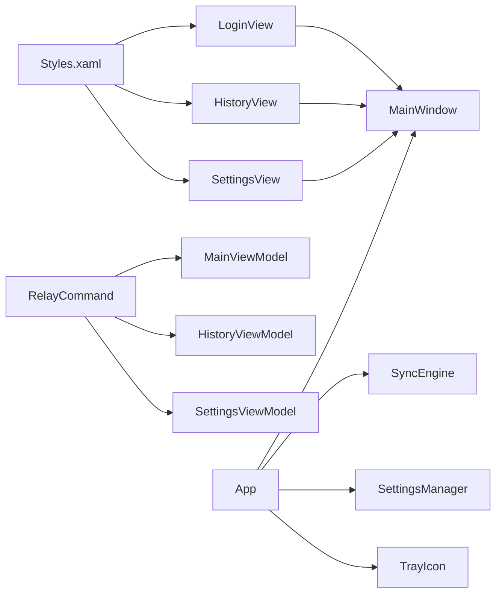

# UI界面开发

<cite>
**本文引用的文件**
- [App.xaml](file://clipSync-windows/ClipSync.WPF/App.xaml)
- [App.xaml.cs](file://clipSync-windows/ClipSync.WPF/App.xaml.cs)
- [MainWindow.xaml](file://clipSync-windows/ClipSync.WPF/MainWindow.xaml)
- [MainWindow.xaml.cs](file://clipSync-windows/ClipSync.WPF/MainWindow.xaml.cs)
- [Styles.xaml](file://clipSync-windows/ClipSync.WPF/Resources/Styles.xaml)
- [LoginView.xaml](file://clipSync-windows/ClipSync.WPF/UI/Views/LoginView.xaml)
- [LoginView.xaml.cs](file://clipSync-windows/ClipSync.WPF/UI/Views/LoginView.xaml.cs)
- [HistoryView.xaml](file://clipSync-windows/ClipSync.WPF/UI/Views/HistoryView.xaml)
- [HistoryView.xaml.cs](file://clipSync-windows/ClipSync.WPF/UI/Views/HistoryView.xaml.cs)
- [SettingsView.xaml](file://clipSync-windows/ClipSync.WPF/UI/Views/SettingsView.xaml)
- [SettingsView.xaml.cs](file://clipSync-windows/ClipSync.WPF/UI/Views/SettingsView.xaml.cs)
- [MainViewModel.cs](file://clipSync-windows/ClipSync.WPF/UI/ViewModels/MainViewModel.cs)
- [HistoryViewModel.cs](file://clipSync-windows/ClipSync.WPF/UI/ViewModels/HistoryViewModel.cs)
- [SettingsViewModel.cs](file://clipSync-windows/ClipSync.WPF/UI/ViewModels/SettingsViewModel.cs)
- [RelayCommand.cs](file://clipSync-windows/ClipSync.WPF/RelayCommand.cs)
</cite>

## 目录
1. [简介](#简介)
2. [项目结构](#项目结构)
3. [核心组件](#核心组件)
4. [架构总览](#架构总览)
5. [详细组件分析](#详细组件分析)
6. [依赖关系分析](#依赖关系分析)
7. [性能考虑](#性能考虑)
8. [故障排查指南](#故障排查指南)
9. [结论](#结论)
10. [附录](#附录)

## 简介
本文件面向Windows客户端WPF界面开发，系统化阐述XAML布局、样式资源管理与响应式设计原则，并结合实际代码库，逐项解析登录界面、历史记录界面、设置界面与设备管理界面的实现细节。内容覆盖视图模型绑定、数据验证、用户交互处理、视觉反馈机制、主题切换与颜色方案、字体排版、无障碍与国际化建议，以及界面性能优化策略。文档既适合初学者循序渐进理解，也为有经验的开发者提供足够的技术深度。

## 项目结构
WPF工程采用“视图(Views)+视图模型(ViewModels)+资源(Styles)”分层组织，配合应用启动流程与托盘集成，形成清晰的MVVM架构与可维护的UI资源体系。

图表来源
- [App.xaml:1-13](file://clipSync-windows/ClipSync.WPF/App.xaml#L1-L13)
- [App.xaml.cs:1-66](file://clipSync-windows/ClipSync.WPF/App.xaml.cs#L1-L66)
- [MainWindow.xaml:1-119](file://clipSync-windows/ClipSync.WPF/MainWindow.xaml#L1-L119)
- [MainWindow.xaml.cs:1-291](file://clipSync-windows/ClipSync.WPF/MainWindow.xaml.cs#L1-L291)
- [Styles.xaml:1-252](file://clipSync-windows/ClipSync.WPF/Resources/Styles.xaml#L1-L252)
- [LoginView.xaml:1-89](file://clipSync-windows/ClipSync.WPF/UI/Views/LoginView.xaml#L1-L89)
- [LoginView.xaml.cs:1-71](file://clipSync-windows/ClipSync.WPF/UI/Views/LoginView.xaml.cs#L1-L71)
- [HistoryView.xaml:1-177](file://clipSync-windows/ClipSync.WPF/UI/Views/HistoryView.xaml#L1-L177)
- [HistoryView.xaml.cs:1-36](file://clipSync-windows/ClipSync.WPF/UI/Views/HistoryView.xaml.cs#L1-L36)
- [SettingsView.xaml:1-40](file://clipSync-windows/ClipSync.WPF/UI/Views/SettingsView.xaml#L1-L40)
- [SettingsView.xaml.cs:1-45](file://clipSync-windows/ClipSync.WPF/UI/Views/SettingsView.xaml.cs#L1-L45)
- [RelayCommand.cs:1-56](file://clipSync-windows/ClipSync.WPF/RelayCommand.cs#L1-L56)

章节来源
- [App.xaml:1-13](file://clipSync-windows/ClipSync.WPF/App.xaml#L1-L13)
- [App.xaml.cs:12-52](file://clipSync-windows/ClipSync.WPF/App.xaml.cs#L12-L52)
- [MainWindow.xaml:1-119](file://clipSync-windows/ClipSync.WPF/MainWindow.xaml#L1-L119)
- [MainWindow.xaml.cs:21-48](file://clipSync-windows/ClipSync.WPF/MainWindow.xaml.cs#L21-L48)
- [Styles.xaml:1-252](file://clipSync-windows/ClipSync.WPF/Resources/Styles.xaml#L1-L252)

## 核心组件
- 应用启动与全局异常处理：在应用启动时初始化设置管理器、同步引擎与托盘图标；注册未处理异常处理器以避免崩溃。
- 主窗口与导航：通过选项卡控件实现Home/History/Devices/Settings导航；使用ContentControl承载不同视图；状态指示灯与连接状态文本实时更新。
- 视图与事件：登录视图负责输入校验与登录/注册事件；历史视图负责加载与复制；设置视图负责读取与保存配置。
- 视图模型与命令：使用RelayCommand封装命令，实现刷新、复制、清空、保存等操作；通过INotifyPropertyChanged驱动UI更新。
- 样式与主题：集中定义颜色、圆角、阴影、字体与控件风格，统一界面视觉语言。

章节来源
- [App.xaml.cs:12-52](file://clipSync-windows/ClipSync.WPF/App.xaml.cs#L12-L52)
- [MainWindow.xaml.cs:31-48](file://clipSync-windows/ClipSync.WPF/MainWindow.xaml.cs#L31-L48)
- [LoginView.xaml.cs:36-51](file://clipSync-windows/ClipSync.WPF/UI/Views/LoginView.xaml.cs#L36-L51)
- [HistoryView.xaml.cs:16-18](file://clipSync-windows/ClipSync.WPF/UI/Views/HistoryView.xaml.cs#L16-L18)
- [SettingsView.xaml.cs:15-16](file://clipSync-windows/ClipSync.WPF/UI/Views/SettingsView.xaml.cs#L15-L16)
- [MainViewModel.cs:53-58](file://clipSync-windows/ClipSync.WPF/UI/ViewModels/MainViewModel.cs#L53-L58)
- [RelayCommand.cs:6-32](file://clipSync-windows/ClipSync.WPF/RelayCommand.cs#L6-L32)

## 架构总览
下图展示了从应用启动到主窗口显示、再到各视图加载与事件交互的端到端流程。

图表来源
- [App.xaml.cs:12-52](file://clipSync-windows/ClipSync.WPF/App.xaml.cs#L12-L52)
- [MainWindow.xaml.cs:31-48](file://clipSync-windows/ClipSync.WPF/MainWindow.xaml.cs#L31-L48)
- [LoginView.xaml.cs:9-17](file://clipSync-windows/ClipSync.WPF/UI/Views/LoginView.xaml.cs#L9-L17)
- [HistoryView.xaml.cs:9-19](file://clipSync-windows/ClipSync.WPF/UI/Views/HistoryView.xaml.cs#L9-L19)
- [SettingsView.xaml.cs:9-17](file://clipSync-windows/ClipSync.WPF/UI/Views/SettingsView.xaml.cs#L9-L17)

## 详细组件分析

### 登录界面（LoginView）
- 布局与样式：采用卡片式容器居中展示，使用统一的卡片样式与标签样式；渐变背景增强视觉层次。
- 输入与验证：用户名与密码为空时显示错误提示；点击登录/注册触发事件，携带服务器URL与凭据。
- 事件与交互：暴露LoginRequested/RegisterRequested事件供宿主窗口处理；提供ShowError/ClearError用于即时反馈。

图表来源
- [LoginView.xaml:1-89](file://clipSync-windows/ClipSync.WPF/UI/Views/LoginView.xaml#L1-L89)
- [LoginView.xaml.cs:36-68](file://clipSync-windows/ClipSync.WPF/UI/Views/LoginView.xaml.cs#L36-L68)
- [MainWindow.xaml.cs:88-110](file://clipSync-windows/ClipSync.WPF/MainWindow.xaml.cs#L88-L110)

章节来源
- [LoginView.xaml:15-86](file://clipSync-windows/ClipSync.WPF/UI/Views/LoginView.xaml#L15-L86)
- [LoginView.xaml.cs:19-34](file://clipSync-windows/ClipSync.WPF/UI/Views/LoginView.xaml.cs#L19-L34)
- [LoginView.xaml.cs:36-68](file://clipSync-windows/ClipSync.WPF/UI/Views/LoginView.xaml.cs#L36-L68)

### 历史记录界面（HistoryView）
- 列表渲染：使用ListView与DataTemplate自定义每项卡片，包含内容预览、来源设备、格式与时间戳；悬停高亮边框。
- 用户交互：复制按钮通过Tag绑定项数据，路由事件捕获后触发CopyRequested；提供刷新与清空按钮事件。
- 空状态：当历史为空时显示“无历史”提示。

图表来源
- [HistoryView.xaml:46-150](file://clipSync-windows/ClipSync.WPF/UI/Views/HistoryView.xaml#L46-L150)
- [HistoryView.xaml.cs:21-33](file://clipSync-windows/ClipSync.WPF/UI/Views/HistoryView.xaml.cs#L21-L33)
- [MainWindow.xaml.cs:181-185](file://clipSync-windows/ClipSync.WPF/MainWindow.xaml.cs#L181-L185)

章节来源
- [HistoryView.xaml:10-150](file://clipSync-windows/ClipSync.WPF/UI/Views/HistoryView.xaml#L10-L150)
- [HistoryView.xaml.cs:21-33](file://clipSync-windows/ClipSync.WPF/UI/Views/HistoryView.xaml.cs#L21-L33)
- [MainWindow.xaml.cs:181-185](file://clipSync-windows/ClipSync.WPF/MainWindow.xaml.cs#L181-L185)

### 设置界面（SettingsView）
- 配置项：服务器URL、自动启动、同步开关、加密开关、最小化到托盘、设备名称与当前登录用户。
- 数据绑定：LoadSettings用于初始化UI；Save触发SettingsSaved事件，携带所有配置项。
- 登出：Logout触发LogoutRequested事件，由宿主窗口处理登出逻辑并重置状态。

图表来源
- [SettingsView.xaml:4-38](file://clipSync-windows/ClipSync.WPF/UI/Views/SettingsView.xaml#L4-L38)
- [SettingsView.xaml.cs:19-42](file://clipSync-windows/ClipSync.WPF/UI/Views/SettingsView.xaml.cs#L19-L42)
- [MainWindow.xaml.cs:246-278](file://clipSync-windows/ClipSync.WPF/MainWindow.xaml.cs#L246-L278)

章节来源
- [SettingsView.xaml:4-38](file://clipSync-windows/ClipSync.WPF/UI/Views/SettingsView.xaml#L4-L38)
- [SettingsView.xaml.cs:19-42](file://clipSync-windows/ClipSync.WPF/UI/Views/SettingsView.xaml.cs#L19-L42)
- [MainWindow.xaml.cs:246-278](file://clipSync-windows/ClipSync.WPF/MainWindow.xaml.cs#L246-L278)

### 设备管理界面（动态生成）
- 动态构建：在切换到Devices标签时，动态创建包含标题与ListView的UserControl，使用GridView展示设备名称、平台与状态。
- 数据绑定：ListView绑定设备集合，列绑定到设备对象属性。
- 交互：提供刷新按钮事件，向同步引擎请求设备列表。

图表来源
- [MainWindow.xaml.cs:216-244](file://clipSync-windows/ClipSync.WPF/MainWindow.xaml.cs#L216-L244)
- [MainWindow.xaml.cs:32-32](file://clipSync-windows/ClipSync.WPF/MainWindow.xaml.cs#L32-L32)

章节来源
- [MainWindow.xaml.cs:216-244](file://clipSync-windows/ClipSync.WPF/MainWindow.xaml.cs#L216-L244)

### 视图模型与命令（MVVM）
- MainViewModel：负责连接状态、设备列表与错误提示的属性通知；提供清理错误命令。
- HistoryViewModel：封装历史加载、复制与清空命令；异步加载本地历史并更新集合。
- SettingsViewModel：封装设置读取与保存命令；根据自动启动勾选启用/禁用开机自启。
- RelayCommand：通用命令封装，支持泛型参数与可执行条件。

图表来源
- [MainViewModel.cs:8-109](file://clipSync-windows/ClipSync.WPF/UI/ViewModels/MainViewModel.cs#L8-L109)
- [HistoryViewModel.cs:9-89](file://clipSync-windows/ClipSync.WPF/UI/ViewModels/HistoryViewModel.cs#L9-L89)
- [SettingsViewModel.cs:8-122](file://clipSync-windows/ClipSync.WPF/UI/ViewModels/SettingsViewModel.cs#L8-L122)
- [RelayCommand.cs:6-54](file://clipSync-windows/ClipSync.WPF/RelayCommand.cs#L6-L54)

章节来源
- [MainViewModel.cs:53-100](file://clipSync-windows/ClipSync.WPF/UI/ViewModels/MainViewModel.cs#L53-L100)
- [HistoryViewModel.cs:34-80](file://clipSync-windows/ClipSync.WPF/UI/ViewModels/HistoryViewModel.cs#L34-L80)
- [SettingsViewModel.cs:68-113](file://clipSync-windows/ClipSync.WPF/UI/ViewModels/SettingsViewModel.cs#L68-L113)
- [RelayCommand.cs:6-54](file://clipSync-windows/ClipSync.WPF/RelayCommand.cs#L6-L54)

## 依赖关系分析
- 资源依赖：所有视图均通过静态资源引用Styles.xaml中的颜色、圆角、阴影与控件样式，确保视觉一致性。
- 事件链路：LoginView/HistoryView/SettingsView通过事件向上冒泡至MainWindow，由MainWindow协调业务逻辑与状态更新。
- 命令依赖：各视图模型通过RelayCommand封装命令，减少代码重复并提升可测试性。
- 运行时依赖：App启动时注入SettingsManager、SyncEngine与TrayIcon，MainWindow持有其引用并进行生命周期管理。

图表来源
- [Styles.xaml:1-252](file://clipSync-windows/ClipSync.WPF/Resources/Styles.xaml#L1-L252)
- [LoginView.xaml:1-89](file://clipSync-windows/ClipSync.WPF/UI/Views/LoginView.xaml#L1-L89)
- [HistoryView.xaml:1-177](file://clipSync-windows/ClipSync.WPF/UI/Views/HistoryView.xaml#L1-L177)
- [SettingsView.xaml:1-40](file://clipSync-windows/ClipSync.WPF/UI/Views/SettingsView.xaml#L1-L40)
- [MainWindow.xaml.cs:13-29](file://clipSync-windows/ClipSync.WPF/MainWindow.xaml.cs#L13-L29)
- [App.xaml.cs:35-41](file://clipSync-windows/ClipSync.WPF/App.xaml.cs#L35-L41)
- [RelayCommand.cs:6-54](file://clipSync-windows/ClipSync.WPF/RelayCommand.cs#L6-L54)

章节来源
- [Styles.xaml:1-252](file://clipSync-windows/ClipSync.WPF/Resources/Styles.xaml#L1-L252)
- [MainWindow.xaml.cs:13-29](file://clipSync-windows/ClipSync.WPF/MainWindow.xaml.cs#L13-L29)
- [App.xaml.cs:35-41](file://clipSync-windows/ClipSync.WPF/App.xaml.cs#L35-L41)

## 性能考虑
- 异步加载与UI线程：历史加载与网络操作均在后台任务中执行，仅在完成时通过Dispatcher.Invoke更新UI，避免阻塞主线程。
- 资源复用：统一的颜色、圆角与阴影资源减少重复定义，提高编译与运行时效率。
- 控件优化：ListView项模板简化容器，移除不必要的边距与填充，降低绘制开销。
- 事件处理：使用AddHandler订阅路由事件，避免多次实例化委托带来的内存压力。
- 启动流程：应用启动时仅初始化必要组件，延迟显示主窗口并在需要时隐藏，减少初始占用。

章节来源
- [MainWindow.xaml.cs:112-140](file://clipSync-windows/ClipSync.WPF/MainWindow.xaml.cs#L112-L140)
- [MainWindow.xaml.cs:181-185](file://clipSync-windows/ClipSync.WPF/MainWindow.xaml.cs#L181-L185)
- [HistoryView.xaml.cs:18-18](file://clipSync-windows/ClipSync.WPF/UI/Views/HistoryView.xaml.cs#L18-L18)

## 故障排查指南
- 全局异常处理：应用注册了DispatcherUnhandledException、AppDomain.UnhandledException与TaskScheduler.UnobservedTaskException，便于定位未处理异常。
- 连接状态与错误提示：MainWindow根据连接状态更新状态点与文本；错误发生时弹出横幅提示并联动登录视图显示错误。
- 登录失败与网络问题：检查服务器URL与凭据；查看状态文本与错误横幅；确认同步引擎已启动。
- 设置保存与开机自启：确认设置保存事件被触发；若自动启动未生效，检查系统启动项与权限。

章节来源
- [App.xaml.cs:16-33](file://clipSync-windows/ClipSync.WPF/App.xaml.cs#L16-L33)
- [MainWindow.xaml.cs:112-154](file://clipSync-windows/ClipSync.WPF/MainWindow.xaml.cs#L112-L154)
- [MainWindow.xaml.cs:246-270](file://clipSync-windows/ClipSync.WPF/MainWindow.xaml.cs#L246-L270)

## 结论
该WPF界面遵循MVVM与资源集中管理的设计原则，通过统一的样式资源与清晰的事件/命令链路，实现了登录、历史、设置与设备管理等核心功能。界面具备良好的可扩展性与可维护性，同时在性能与稳定性方面提供了基础保障。后续可在无障碍与国际化方面进一步完善，以满足更广泛的用户需求。

## 附录
- 主题与颜色方案：通过Styles.xaml集中定义主色、辅色、背景、文字、边框与状态色，配合圆角与阴影效果，形成统一的视觉语言。
- 字体排版：默认使用Segoe UI与Microsoft YaHei UI，确保多语言与清晰度；标题与标签分别采用不同的字号与字重。
- 响应式设计：窗口支持最小尺寸与可调整大小；内容区域使用网格与自适应列，保证在不同分辨率下的可用性。

章节来源
- [Styles.xaml:4-48](file://clipSync-windows/ClipSync.WPF/Resources/Styles.xaml#L4-L48)
- [Styles.xaml:50-250](file://clipSync-windows/ClipSync.WPF/Resources/Styles.xaml#L50-L250)
- [MainWindow.xaml:4-10](file://clipSync-windows/ClipSync.WPF/MainWindow.xaml#L4-L10)