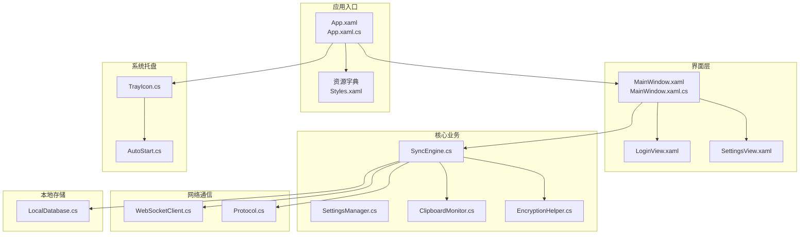
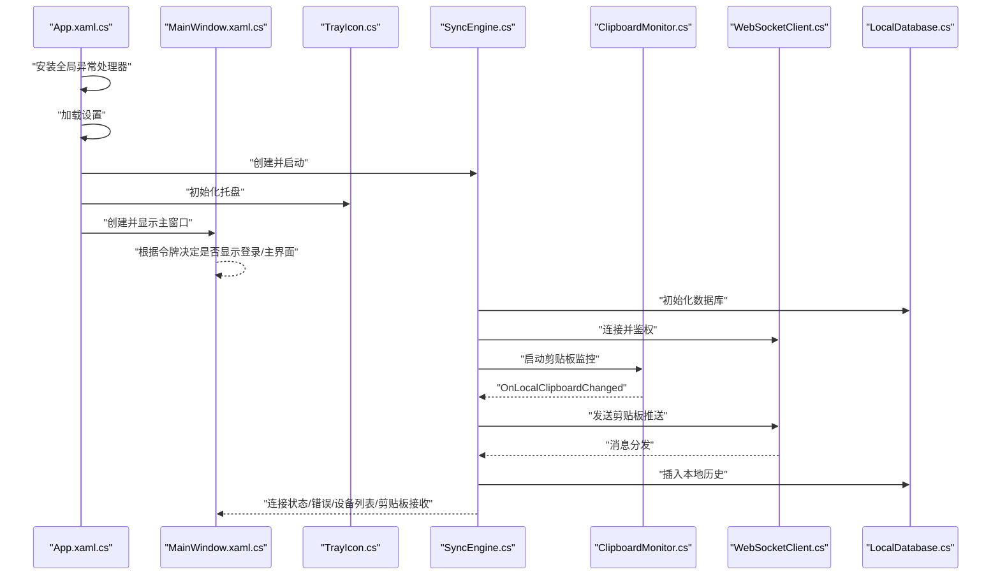
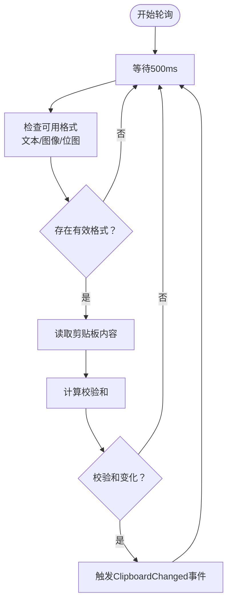
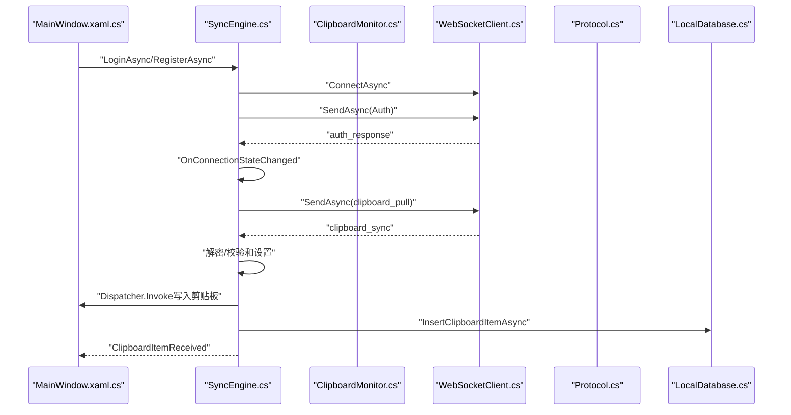
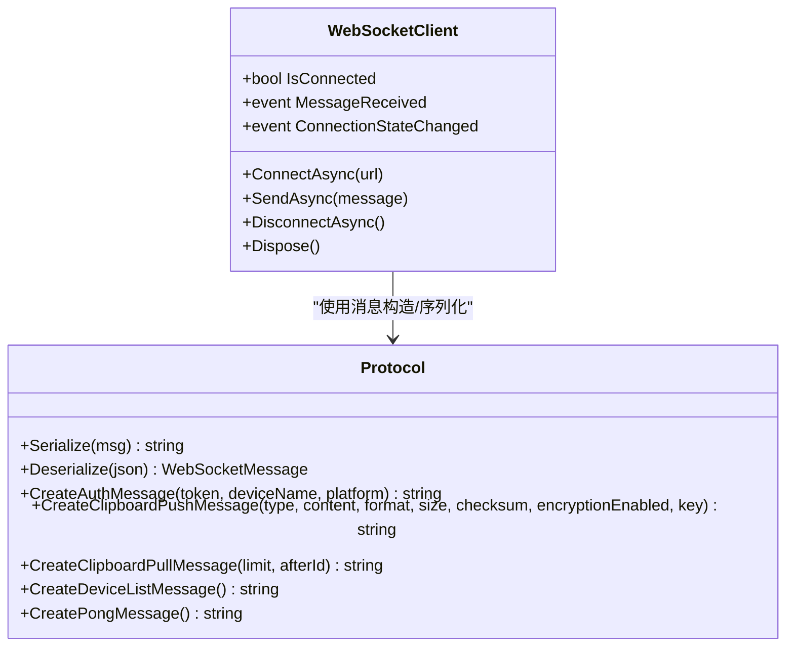
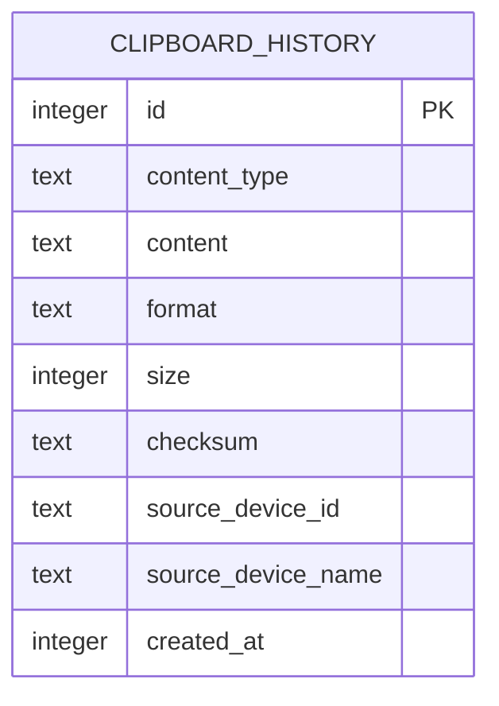
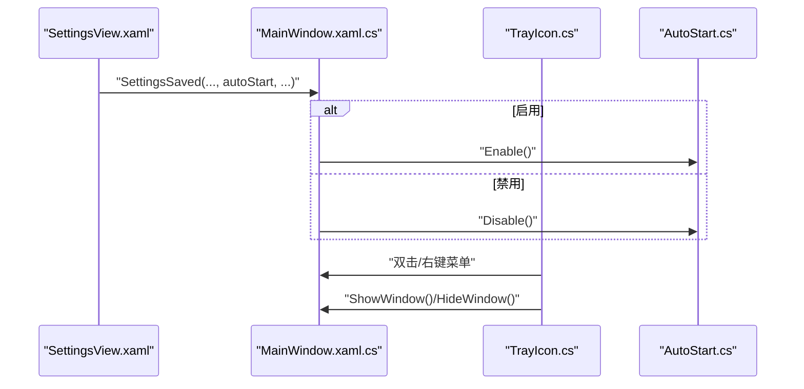
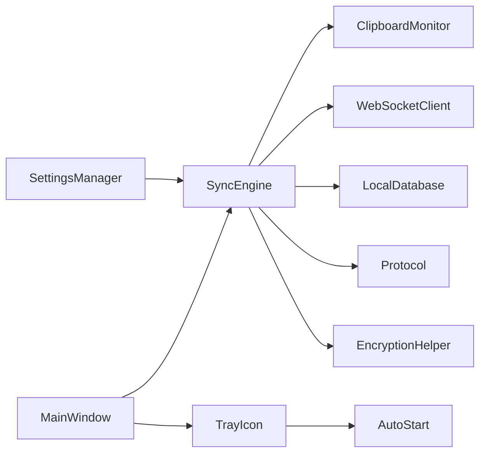

# Windows客户端开发

<cite>
**本文引用的文件**
- [App.xaml](file://clipSync-windows/ClipSync.WPF/App.xaml)
- [App.xaml.cs](file://clipSync-windows/ClipSync.WPF/App.xaml.cs)
- [MainWindow.xaml](file://clipSync-windows/ClipSync.WPF/MainWindow.xaml)
- [MainWindow.xaml.cs](file://clipSync-windows/ClipSync.WPF/MainWindow.xaml.cs)
- [ClipboardMonitor.cs](file://clipSync-windows/ClipSync.WPF/Core/ClipboardMonitor.cs)
- [SyncEngine.cs](file://clipSync-windows/ClipSync.WPF/Core/SyncEngine.cs)
- [SettingsManager.cs](file://clipSync-windows/ClipSync.WPF/Core/SettingsManager.cs)
- [EncryptionHelper.cs](file://clipSync-windows/ClipSync.WPF/Core/EncryptionHelper.cs)
- [TrayIcon.cs](file://clipSync-windows/ClipSync.WPF/SystemTray/TrayIcon.cs)
- [AutoStart.cs](file://clipSync-windows/ClipSync.WPF/SystemTray/AutoStart.cs)
- [Protocol.cs](file://clipSync-windows/ClipSync.WPF/Network/Protocol.cs)
- [WebSocketClient.cs](file://clipSync-windows/ClipSync.WPF/Network/WebSocketClient.cs)
- [LocalDatabase.cs](file://clipSync-windows/ClipSync.WPF/Storage/LocalDatabase.cs)
- [LoginView.xaml](file://clipSync-windows/ClipSync.WPF/UI/Views/LoginView.xaml)
- [SettingsView.xaml](file://clipSync-windows/ClipSync.WPF/UI/Views/SettingsView.xaml)
</cite>

## 目录
1. [简介](#简介)
2. [项目结构](#项目结构)
3. [核心组件](#核心组件)
4. [架构总览](#架构总览)
5. [详细组件分析](#详细组件分析)
6. [依赖关系分析](#依赖关系分析)
7. [性能考虑](#性能考虑)
8. [故障排查指南](#故障排查指南)
9. [结论](#结论)
10. [附录](#附录)

## 简介
本文件面向Windows WPF客户端开发，系统化阐述应用架构、WPF界面开发、剪贴板监控、网络通信与本地存储管理等模块的设计与实现。文档以“从入门到进阶”的方式组织内容：先给出高层架构与模块职责，再深入到具体类与方法的实现细节、调用关系、接口与参数、返回值与错误处理，并结合实际代码路径进行溯源标注，帮助初学者快速上手，同时为有经验的开发者提供足够的技术深度。

## 项目结构
WPF客户端采用分层与功能域划分相结合的组织方式：
- 应用入口与资源：App.xaml、App.xaml.cs负责全局初始化、异常处理、托盘图标与主窗口生命周期管理；样式资源通过资源字典集中管理。
- 视图与视图模型：MainWindow承载主界面布局与导航；LoginView、SettingsView等作为可复用用户控件，配合视图模型完成数据绑定与交互。
- 核心业务：Core目录下包含剪贴板监控、同步引擎、设置管理、加密工具等。
- 网络通信：Network目录封装协议、WebSocket客户端、心跳与重连机制。
- 系统托盘：SystemTray目录提供托盘图标、右键菜单与开机自启动注册。
- 本地存储：Storage目录基于SQLite实现剪贴板历史的本地持久化。

图表来源
- [App.xaml.cs:12-52](file://clipSync-windows/ClipSync.WPF/App.xaml.cs#L12-L52)
- [MainWindow.xaml.cs:21-48](file://clipSync-windows/ClipSync.WPF/MainWindow.xaml.cs#L21-L48)
- [SyncEngine.cs:32-57](file://clipSync-windows/ClipSync.WPF/Core/SyncEngine.cs#L32-L57)

章节来源
- [App.xaml:1-13](file://clipSync-windows/ClipSync.WPF/App.xaml#L1-L13)
- [App.xaml.cs:12-63](file://clipSync-windows/ClipSync.WPF/App.xaml.cs#L12-L63)
- [MainWindow.xaml:1-119](file://clipSync-windows/ClipSync.WPF/MainWindow.xaml#L1-L119)
- [MainWindow.xaml.cs:21-48](file://clipSync-windows/ClipSync.WPF/MainWindow.xaml.cs#L21-L48)

## 核心组件
本节聚焦四大核心模块：设置管理、剪贴板监控、同步引擎、网络通信与本地存储。

- 设置管理（SettingsManager）
  - 职责：加载/保存应用配置（服务器地址、用户名、令牌、设备信息、同步开关、加密开关、最小化到托盘等），线程安全更新。
  - 关键点：配置文件位于用户应用数据目录下的ClipSync/settings.json；提供Update委托式更新，避免竞态。
  - 配置项与默认值：参见AppSettings字段定义与默认值。
  
  章节来源
  - [SettingsManager.cs:41-99](file://clipSync-windows/ClipSync.WPF/Core/SettingsManager.cs#L41-L99)

- 剪贴板监控（ClipboardMonitor）
  - 职责：轮询系统剪贴板，识别文本与图像变化，计算校验和，去重并触发变更事件。
  - 关键点：STA线程运行，避免与UI线程冲突；对剪贴板访问失败进行重试；区分文本与图像格式；支持设置最后校验和以避免回环。
  
  章节来源
  - [ClipboardMonitor.cs:26-174](file://clipSync-windows/ClipSync.WPF/Core/ClipboardMonitor.cs#L26-L174)

- 同步引擎（SyncEngine）
  - 职责：协调剪贴板监控、WebSocket连接、心跳与重连、HTTP认证、本地数据库持久化、消息分发与错误上报。
  - 关键点：事件驱动（连接状态、错误、设备列表、剪贴板接收）；在UI线程中写入剪贴板；支持拉取历史与请求设备列表；登录/注册成功后自动鉴权与心跳。
  
  章节来源
  - [SyncEngine.cs:8-422](file://clipSync-windows/ClipSync.WPF/Core/SyncEngine.cs#L8-L422)

- 网络通信（WebSocketClient + Protocol）
  - 职责：WebSocket连接、收发消息、心跳与重连；消息序列化/反序列化与协议构造。
  - 关键点：连接状态事件；消息类型分发；心跳应答；协议消息包括鉴权、剪贴板推送/拉取、设备列表、ping/pong等。
  
  章节来源
  - [WebSocketClient.cs:9-126](file://clipSync-windows/ClipSync.WPF/Network/WebSocketClient.cs#L9-L126)
  - [Protocol.cs:60-165](file://clipSync-windows/ClipSync.WPF/Network/Protocol.cs#L60-L165)

- 本地存储（LocalDatabase）
  - 职责：SQLite本地数据库初始化、剪贴板历史插入与查询、限制保留数量。
  - 关键点：表结构含索引；插入时自动清理超出上限的历史记录；提供清空历史能力。
  
  章节来源
  - [LocalDatabase.cs:9-169](file://clipSync-windows/ClipSync.WPF/Storage/LocalDatabase.cs#L9-L169)

## 架构总览
下图展示应用启动到运行的关键流程与模块交互：

图表来源
- [App.xaml.cs:35-51](file://clipSync-windows/ClipSync.WPF/App.xaml.cs#L35-L51)
- [MainWindow.xaml.cs:44-47](file://clipSync-windows/ClipSync.WPF/MainWindow.xaml.cs#L44-L47)
- [SyncEngine.cs:32-57](file://clipSync-windows/ClipSync.WPF/Core/SyncEngine.cs#L32-L57)
- [ClipboardMonitor.cs:39-56](file://clipSync-windows/ClipSync.WPF/Core/ClipboardMonitor.cs#L39-L56)
- [WebSocketClient.cs:20-37](file://clipSync-windows/ClipSync.WPF/Network/WebSocketClient.cs#L20-L37)
- [LocalDatabase.cs:26-58](file://clipSync-windows/ClipSync.WPF/Storage/LocalDatabase.cs#L26-L58)

## 详细组件分析

### 剪贴板监控实现（ClipboardMonitor）
- 设计要点
  - 使用独立STA线程轮询剪贴板，避免阻塞UI线程。
  - 支持文本与图像两种内容类型，分别编码为UTF-8文本或PNG二进制。
  - 通过SHA-256校验和与上次校验和比较实现去重。
  - 对COM异常进行重试，提升鲁棒性。
- 接口与事件
  - Start/Stop：启动/停止监控循环。
  - SetLastChecksum：设置上次校验和，防止回环。
  - 事件：ClipboardChanged（携带内容类型、文本/图像、格式、大小、校验和）。
- 性能与复杂度
  - 轮询周期固定，CPU占用低；图像转码为PNG可能带来内存峰值，但仅在变更时发生。
- 典型调用链
  - SyncEngine.OnLocalClipboardChanged -> WebSocketClient.SendAsync -> 服务器广播 -> 其他设备剪贴板更新。

图表来源
- [ClipboardMonitor.cs:58-87](file://clipSync-windows/ClipSync.WPF/Core/ClipboardMonitor.cs#L58-L87)
- [ClipboardMonitor.cs:89-153](file://clipSync-windows/ClipSync.WPF/Core/ClipboardMonitor.cs#L89-L153)

章节来源
- [ClipboardMonitor.cs:26-174](file://clipSync-windows/ClipSync.WPF/Core/ClipboardMonitor.cs#L26-L174)

### 同步引擎（SyncEngine）
- 职责与流程
  - 初始化数据库、WebSocket、HTTP客户端、心跳与重连、剪贴板监控。
  - 登录/注册成功后鉴权并启动心跳，随后请求历史并进入正常同步。
  - 处理WebSocket消息：鉴权响应、剪贴板同步、心跳确认、设备列表、错误与ping/pong。
  - 在UI线程中写入剪贴板，确保STA要求。
- 关键事件
  - ConnectionStateChanged、ErrorOccurred、DeviceListUpdated、ClipboardItemReceived。
- 方法与参数
  - StartAsync/StopAsync：启动/停止引擎。
  - LoginAsync/RegisterAsync/LogoutAsync：认证与登出。
  - RequestClipboardPullAsync/RequestDeviceListAsync：请求历史与设备列表。
  - GetLocalHistoryAsync：查询本地历史。
- 返回值与副作用
  - 登录/注册返回结果对象（成功标志、令牌、设备ID、错误信息）。
  - 写入剪贴板可能抛出异常，统一通过ErrorOccurred上报。

图表来源
- [SyncEngine.cs:32-57](file://clipSync-windows/ClipSync.WPF/Core/SyncEngine.cs#L32-L57)
- [SyncEngine.cs:95-125](file://clipSync-windows/ClipSync.WPF/Core/SyncEngine.cs#L95-L125)
- [SyncEngine.cs:127-163](file://clipSync-windows/ClipSync.WPF/Core/SyncEngine.cs#L127-L163)
- [SyncEngine.cs:188-267](file://clipSync-windows/ClipSync.WPF/Core/SyncEngine.cs#L188-L267)
- [Protocol.cs:79-139](file://clipSync-windows/ClipSync.WPF/Network/Protocol.cs#L79-L139)
- [LocalDatabase.cs:60-96](file://clipSync-windows/ClipSync.WPF/Storage/LocalDatabase.cs#L60-L96)

章节来源
- [SyncEngine.cs:8-422](file://clipSync-windows/ClipSync.WPF/Core/SyncEngine.cs#L8-L422)

### 网络通信模块（WebSocketClient + Protocol）
- WebSocketClient
  - 提供ConnectAsync/DisconnectAsync/SendAsync/ReceiveLoop。
  - 通过事件暴露连接状态与消息到达。
- Protocol
  - 定义WebSocketMessage结构体与常用消息构造器：鉴权、心跳、剪贴板推送/拉取、设备列表、ping/pong。
  - 支持按需加密内容（当启用加密且密钥有效时）。
- 错误处理
  - 连接失败、发送失败、接收异常均被吞并并触发连接状态变更，避免崩溃。

图表来源
- [WebSocketClient.cs:9-126](file://clipSync-windows/ClipSync.WPF/Network/WebSocketClient.cs#L9-L126)
- [Protocol.cs:60-165](file://clipSync-windows/ClipSync.WPF/Network/Protocol.cs#L60-L165)

章节来源
- [WebSocketClient.cs:9-126](file://clipSync-windows/ClipSync.WPF/Network/WebSocketClient.cs#L9-L126)
- [Protocol.cs:60-165](file://clipSync-windows/ClipSync.WPF/Network/Protocol.cs#L60-L165)

### 本地存储管理（LocalDatabase）
- 数据模型
  - 表clipboard_history：包含内容类型、内容（文本或Base64图像）、格式、大小、校验和、来源设备、时间戳。
- 功能
  - InitializeAsync：创建表与索引。
  - InsertClipboardItemAsync：插入并限制保留最近50条。
  - GetClipboardHistoryAsync：按时间倒序查询。
  - ClearHistoryAsync：清空历史。
- 性能
  - 单表+倒序索引，查询与插入均为O(1)写入，定期清理保证容量可控。

图表来源
- [LocalDatabase.cs:36-57](file://clipSync-windows/ClipSync.WPF/Storage/LocalDatabase.cs#L36-L57)
- [LocalDatabase.cs:98-137](file://clipSync-windows/ClipSync.WPF/Storage/LocalDatabase.cs#L98-L137)

章节来源
- [LocalDatabase.cs:9-169](file://clipSync-windows/ClipSync.WPF/Storage/LocalDatabase.cs#L9-L169)

### 系统托盘与开机自启动
- 托盘图标（TrayIcon）
  - 右键菜单：显示/隐藏窗口、退出。
  - 双击显示主窗口。
  - 与主窗口关联，确保托盘操作影响UI状态。
- 开机自启动（AutoStart）
  - 注册表项：当前用户\软件\Microsoft\Windows\CurrentVersion\Run。
  - 提供Enable/Disable/IsEnabled。
- 与设置联动
  - 设置保存时根据“自动启动”勾选调用Enable/Disable。

图表来源
- [MainWindow.xaml.cs:246-270](file://clipSync-windows/ClipSync.WPF/MainWindow.xaml.cs#L246-L270)
- [TrayIcon.cs:28-57](file://clipSync-windows/ClipSync.WPF/SystemTray/TrayIcon.cs#L28-L57)
- [AutoStart.cs:10-30](file://clipSync-windows/ClipSync.WPF/SystemTray/AutoStart.cs#L10-L30)

章节来源
- [TrayIcon.cs:9-109](file://clipSync-windows/ClipSync.WPF/SystemTray/TrayIcon.cs#L9-L109)
- [AutoStart.cs:5-33](file://clipSync-windows/ClipSync.WPF/SystemTray/AutoStart.cs#L5-L33)

### WPF界面开发与交互
- 主窗口（MainWindow）
  - 标题栏、导航标签、状态指示、内容区、错误横幅。
  - 登录视图与主内容区切换；历史/设备/设置标签页动态加载。
  - 与SyncEngine事件绑定，实时更新连接状态与错误提示。
- 登录视图（LoginView）
  - 输入服务器URL、用户名、密码，触发登录或注册。
- 设置视图（SettingsView）
  - 配置服务器URL、自动启动、同步开关、加密开关、最小化到托盘、设备名与登出。
- 与核心模块的耦合
  - MainWindow持有SettingsManager、SyncEngine、TrayIcon实例，负责事件订阅与UI更新。

章节来源
- [MainWindow.xaml:1-119](file://clipSync-windows/ClipSync.WPF/MainWindow.xaml#L1-L119)
- [MainWindow.xaml.cs:21-291](file://clipSync-windows/ClipSync.WPF/MainWindow.xaml.cs#L21-L291)
- [LoginView.xaml:1-89](file://clipSync-windows/ClipSync.WPF/UI/Views/LoginView.xaml#L1-L89)
- [SettingsView.xaml:1-40](file://clipSync-windows/ClipSync.WPF/UI/Views/SettingsView.xaml#L1-L40)

## 依赖关系分析
- 组件内聚与耦合
  - SyncEngine聚合多个子系统（监控、网络、存储、协议、加密），是核心协调者。
  - ClipboardMonitor与UI线程交互通过事件回调，避免直接耦合。
  - SettingsManager提供单一可信配置源，其他模块只读或通过Update委托修改。
- 外部依赖
  - WPF UI框架、Windows剪贴板API、SQLite、Newtonsoft.Json、硬编码托盘通知库。
- 循环依赖
  - 未发现直接循环；事件回调形成单向依赖链路。

图表来源
- [SyncEngine.cs:27-30](file://clipSync-windows/ClipSync.WPF/Core/SyncEngine.cs#L27-L30)
- [MainWindow.xaml.cs:13-25](file://clipSync-windows/ClipSync.WPF/MainWindow.xaml.cs#L13-L25)
- [TrayIcon.cs:17-21](file://clipSync-windows/ClipSync.WPF/SystemTray/TrayIcon.cs#L17-L21)

章节来源
- [SyncEngine.cs:8-422](file://clipSync-windows/ClipSync.WPF/Core/SyncEngine.cs#L8-L422)
- [MainWindow.xaml.cs:13-291](file://clipSync-windows/ClipSync.WPF/MainWindow.xaml.cs#L13-L291)

## 性能考虑
- 剪贴板轮询
  - 固定休眠间隔与格式检测，CPU开销极低；图像转码可能产生临时内存峰值，建议在大图场景谨慎开启同步。
- 网络与序列化
  - JSON序列化/反序列化轻量；WebSocket长连接减少握手开销；心跳与重连策略降低断线恢复时间。
- 本地存储
  - SQLite写入批量执行，LIMIT约束保证历史规模；索引按时间倒序查询高效。
- UI线程
  - 所有剪贴板写入通过Dispatcher.Invoke在UI线程执行，避免跨线程异常。

## 故障排查指南
- 无法连接服务器
  - 检查服务器URL格式（ws/wss）与可达性；查看连接状态事件与错误事件。
  - 章节来源
    - [SyncEngine.cs:303-310](file://clipSync-windows/ClipSync.WPF/Core/SyncEngine.cs#L303-L310)
    - [WebSocketClient.cs:20-37](file://clipSync-windows/ClipSync.WPF/Network/WebSocketClient.cs#L20-L37)
- 登录/注册失败
  - 查看错误事件消息；确认用户名、密码与设备名；检查HTTP服务可用性。
  - 章节来源
    - [SyncEngine.cs:312-335](file://clipSync-windows/ClipSync.WPF/Core/SyncEngine.cs#L312-L335)
    - [SyncEngine.cs:337-360](file://clipSync-windows/ClipSync.WPF/Core/SyncEngine.cs#L337-L360)
- 剪贴板不同步
  - 确认“启用剪贴板同步”已开启；检查校验和去重逻辑；查看剪贴板监控事件是否触发。
  - 章节来源
    - [SyncEngine.cs:99-125](file://clipSync-windows/ClipSync.WPF/Core/SyncEngine.cs#L99-L125)
    - [ClipboardMonitor.cs:76-80](file://clipSync-windows/ClipSync.WPF/Core/ClipboardMonitor.cs#L76-L80)
- 图像剪贴板异常
  - PNG编码/解码失败时会回退并上报错误；检查图像格式与大小。
  - 章节来源
    - [ClipboardMonitor.cs:113-134](file://clipSync-windows/ClipSync.WPF/Core/ClipboardMonitor.cs#L113-L134)
    - [SyncEngine.cs:223-248](file://clipSync-windows/ClipSync.WPF/Core/SyncEngine.cs#L223-L248)
- 托盘图标不显示或无法退出
  - 检查托盘初始化与右键菜单；退出时确保停止同步引擎并释放资源。
  - 章节来源
    - [TrayIcon.cs:28-57](file://clipSync-windows/ClipSync.WPF/SystemTray/TrayIcon.cs#L28-L57)
    - [App.xaml.cs:54-63](file://clipSync-windows/ClipSync.WPF/App.xaml.cs#L54-L63)

## 结论
该WPF客户端以清晰的分层架构实现了剪贴板跨设备同步：设置管理提供稳定配置源，剪贴板监控与同步引擎协调网络与存储，系统托盘与开机自启动增强用户体验。通过事件驱动与UI线程隔离，系统在易用性与稳定性之间取得良好平衡。建议后续扩展包括：设备管理界面（当前主窗口预留设备标签页）、更多剪贴板格式支持、离线队列与增量同步策略。

## 附录
- 配置选项清单（来自SettingsManager）
  - server_url：WebSocket服务器URL，默认ws://localhost:8080。
  - http_url：HTTP服务器URL，默认http://localhost:8081。
  - username：当前用户名。
  - token/device_id：认证令牌与设备ID。
  - device_name：设备名称，默认取机器名。
  - auto_start：开机自启动。
  - sync_enabled：启用剪贴板同步。
  - encryption_enabled：启用AES-256加密。
  - minimize_to_tray：关闭时最小化到托盘。
- 关键接口与返回值摘要
  - SettingsManager.LoadAsync/SaveAsync：异步读写配置。
  - SyncEngine.LoginAsync/RegisterAsync：返回成功标志、令牌、设备ID与错误信息。
  - SyncEngine.GetLocalHistoryAsync：返回最近历史列表。
  - WebSocketClient.SendAsync/ReceiveLoop：消息发送与接收。
  - LocalDatabase.GetClipboardHistoryAsync：查询历史。
- 常见问题速查
  - 服务器不可达：检查URL与防火墙；查看连接状态事件。
  - 登录失败：核对凭据与设备名；关注错误事件消息。
  - 图像同步失败：确认图像格式与大小；查看错误事件。
  - 托盘退出异常：确保调用StopAsync并释放资源。