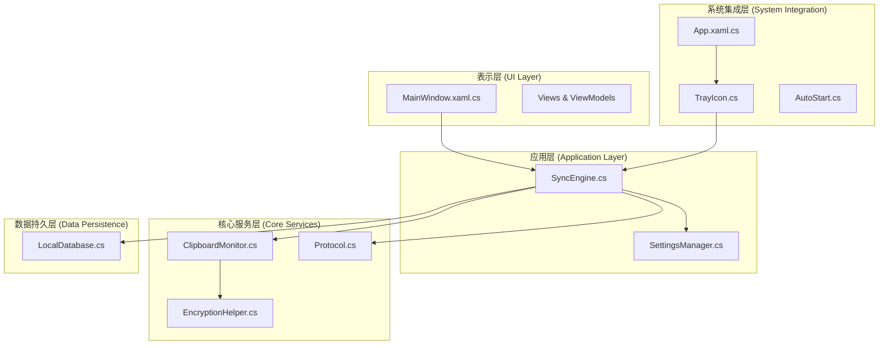
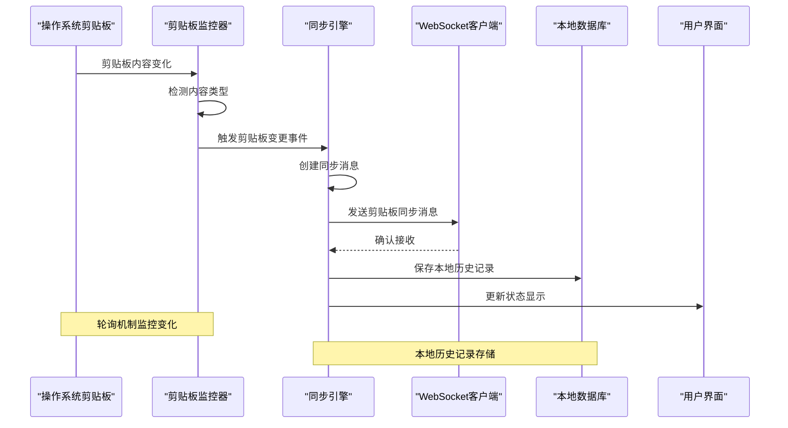
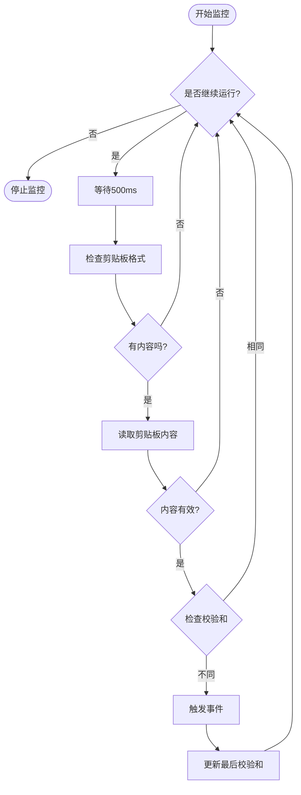
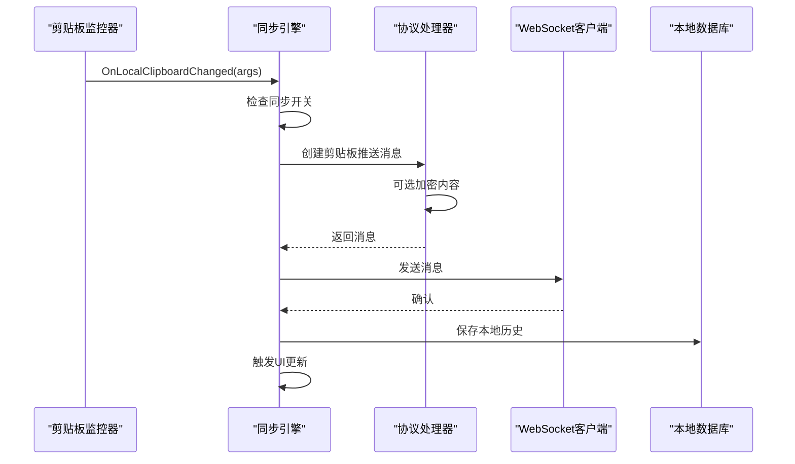
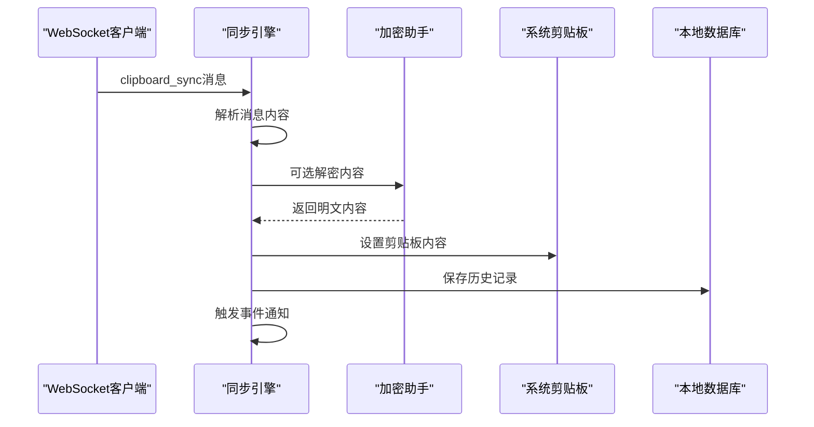
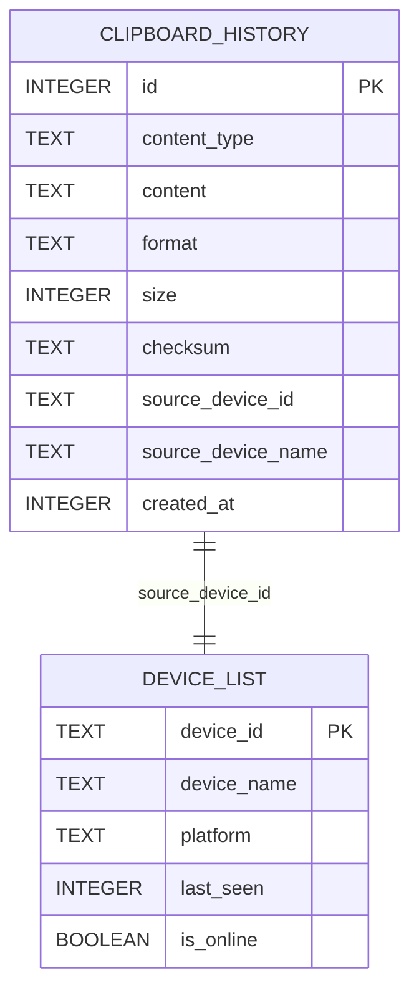
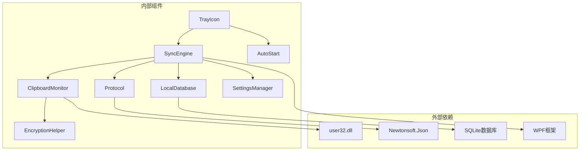

# 剪贴板监控实现

<cite>
**本文档引用的文件**
- [ClipboardMonitor.cs](file://clipSync-windows/ClipSync.WPF/Core/ClipboardMonitor.cs)
- [SyncEngine.cs](file://clipSync-windows/ClipSync.WPF/Core/SyncEngine.cs)
- [EncryptionHelper.cs](file://clipSync-windows/ClipSync.WPF/Core/EncryptionHelper.cs)
- [SettingsManager.cs](file://clipSync-windows/ClipSync.WPF/Core/SettingsManager.cs)
- [Protocol.cs](file://clipSync-windows/ClipSync.WPF/Network/Protocol.cs)
- [LocalDatabase.cs](file://clipSync-windows/ClipSync.WPF/Storage/LocalDatabase.cs)
- [App.xaml.cs](file://clipSync-windows/ClipSync.WPF/App.xaml.cs)
- [MainWindow.xaml.cs](file://clipSync-windows/ClipSync.WPF/MainWindow.xaml.cs)
- [TrayIcon.cs](file://clipSync-windows/ClipSync.WPF/SystemTray/TrayIcon.cs)
- [AutoStart.cs](file://clipSync-windows/ClipSync.WPF/SystemTray/AutoStart.cs)
</cite>

## 目录
1. [简介](#简介)
2. [项目结构](#项目结构)
3. [核心组件](#核心组件)
4. [架构概览](#架构概览)
5. [详细组件分析](#详细组件分析)
6. [依赖关系分析](#依赖关系分析)
7. [性能考虑](#性能考虑)
8. [故障排除指南](#故障排除指南)
9. [结论](#结论)

## 简介

ClipSync Windows 客户端实现了跨设备的剪贴板同步功能。本文档深入解析了剪贴板监控实现的技术细节，包括剪贴板监听机制、内容格式检测、图像和文本处理以及系统集成。重点分析了 ClipboardMonitor 类的实现原理、事件触发机制和内容转换逻辑，并提供了具体的代码示例来展示如何处理不同类型的剪贴板内容。

该实现采用轮询机制监控剪贴板变化，支持文本和图像内容的检测与同步，通过加密算法确保数据安全传输，并通过本地数据库存储历史记录。系统集成了系统托盘功能，提供最小化到托盘的用户体验。

## 项目结构

ClipSync Windows 客户端采用分层架构设计，主要分为以下层次：

**图表来源**
- [App.xaml.cs:12-52](file://clipSync-windows/ClipSync.WPF/App.xaml.cs#L12-L52)
- [SyncEngine.cs:27-57](file://clipSync-windows/ClipSync.WPF/Core/SyncEngine.cs#L27-L57)
- [ClipboardMonitor.cs:26-51](file://clipSync-windows/ClipSync.WPF/Core/ClipboardMonitor.cs#L26-L51)

**章节来源**
- [App.xaml.cs:12-52](file://clipSync-windows/ClipSync.WPF/App.xaml.cs#L12-L52)
- [MainWindow.xaml.cs:21-48](file://clipSync-windows/ClipSync.WPF/MainWindow.xaml.cs#L21-L48)

## 核心组件

### 剪贴板监控器 (ClipboardMonitor)

ClipboardMonitor 是整个系统的核心组件，负责监控系统剪贴板的变化并触发相应的事件。

**主要特性：**
- 基于轮询的监控机制
- 支持文本和图像内容检测
- 防止循环触发的校验机制
- 异常处理和重试机制

**关键实现要点：**
- 使用独立的STA线程进行剪贴板操作
- 通过检查剪贴板格式可用性来判断是否有内容
- 实现了三次重试机制处理其他应用程序锁定剪贴板的情况

**章节来源**
- [ClipboardMonitor.cs:26-87](file://clipSync-windows/ClipSync.WPF/Core/ClipboardMonitor.cs#L26-L87)
- [ClipboardMonitor.cs:89-153](file://clipSync-windows/ClipSync.WPF/Core/ClipboardMonitor.cs#L89-L153)

### 同步引擎 (SyncEngine)

SyncEngine 作为协调者，管理整个同步流程，包括剪贴板监控、网络通信和数据持久化。

**核心职责：**
- 初始化和管理各个组件
- 处理剪贴板变化事件
- 与服务器建立WebSocket连接
- 管理本地数据库存储
- 处理认证和心跳机制

**章节来源**
- [SyncEngine.cs:8-57](file://clipSync-windows/ClipSync.WPF/Core/SyncEngine.cs#L8-L57)
- [SyncEngine.cs:95-125](file://clipSync-windows/ClipSync.WPF/Core/SyncEngine.cs#L95-L125)

### 加密助手 (EncryptionHelper)

提供AES-256-CBC加密功能，确保剪贴板内容在传输过程中的安全性。

**加密特性：**
- PBKDF2-SHA256密钥派生
- 10000次迭代确保安全性
- PKCS7填充模式
- 统一的加密格式

**章节来源**
- [EncryptionHelper.cs:18-103](file://clipSync-windows/ClipSync.WPF/Core/EncryptionHelper.cs#L18-L103)

## 架构概览

系统采用事件驱动架构，通过观察者模式实现组件间的松耦合通信：

**图表来源**
- [ClipboardMonitor.cs:58-87](file://clipSync-windows/ClipSync.WPF/Core/ClipboardMonitor.cs#L58-L87)
- [SyncEngine.cs:95-125](file://clipSync-windows/ClipSync.WPF/Core/SyncEngine.cs#L95-L125)
- [SyncEngine.cs:394-411](file://clipSync-windows/ClipSync.WPF/Core/SyncEngine.cs#L394-L411)

## 详细组件分析

### 剪贴板监控器实现详解

#### 监控循环机制

**图表来源**
- [ClipboardMonitor.cs:58-87](file://clipSync-windows/ClipSync.WPF/Core/ClipboardMonitor.cs#L58-L87)
- [ClipboardMonitor.cs:75-80](file://clipSync-windows/ClipSync.WPF/Core/ClipboardMonitor.cs#L75-L80)

#### 内容读取和格式检测

剪贴板监控器实现了智能的内容检测机制：

**文本内容检测：**
- 使用 `Clipboard.ContainsText()` 检测文本格式
- 获取UTF-8编码的文本内容
- 计算SHA-256校验和
- 设置格式为 `text/plain`

**图像内容检测：**
- 使用 `Clipboard.ContainsImage()` 检测图像格式
- 转换为PNG格式以确保兼容性
- 计算二进制数据的SHA-256校验和
- 设置格式为 `image/png`

**章节来源**
- [ClipboardMonitor.cs:89-153](file://clipSync-windows/ClipSync.WPF/Core/ClipboardMonitor.cs#L89-L153)

### 同步引擎工作流程

#### 本地剪贴板同步流程

**图表来源**
- [SyncEngine.cs:95-125](file://clipSync-windows/ClipSync.WPF/Core/SyncEngine.cs#L95-L125)
- [Protocol.cs:99-141](file://clipSync-windows/ClipSync.WPF/Network/Protocol.cs#L99-L141)

#### 远程剪贴板同步流程

**图表来源**
- [SyncEngine.cs:188-267](file://clipSync-windows/ClipSync.WPF/Core/SyncEngine.cs#L188-L267)
- [EncryptionHelper.cs:62-103](file://clipSync-windows/ClipSync.WPF/Core/EncryptionHelper.cs#L62-L103)

### 数据模型和存储

#### 本地数据库设计

**图表来源**
- [LocalDatabase.cs:36-57](file://clipSync-windows/ClipSync.WPF/Storage/LocalDatabase.cs#L36-L57)

**章节来源**
- [LocalDatabase.cs:9-58](file://clipSync-windows/ClipSync.WPF/Storage/LocalDatabase.cs#L9-L58)
- [LocalDatabase.cs:98-137](file://clipSync-windows/ClipSync.WPF/Storage/LocalDatabase.cs#L98-L137)

### 系统集成组件

#### 系统托盘集成

系统托盘组件提供了完整的系统集成功能：

**托盘图标功能：**
- 右键菜单：显示/隐藏窗口、退出应用
- 双击操作：显示主窗口
- 图标状态：根据连接状态改变颜色

**自动启动功能：**
- 注册表项管理
- 用户权限检查
- 启动参数设置

**章节来源**
- [TrayIcon.cs:28-57](file://clipSync-windows/ClipSync.WPF/SystemTray/TrayIcon.cs#L28-L57)
- [AutoStart.cs:10-30](file://clipSync-windows/ClipSync.WPF/SystemTray/AutoStart.cs#L10-L30)

## 依赖关系分析

系统采用清晰的依赖层次结构，各组件间通过接口和事件进行通信：

**图表来源**
- [ClipboardMonitor.cs:170-172](file://clipSync-windows/ClipSync.WPF/Core/ClipboardMonitor.cs#L170-L172)
- [SyncEngine.cs:10-18](file://clipSync-windows/ClipSync.WPF/Core/SyncEngine.cs#L10-L18)

**章节来源**
- [SettingsManager.cs:44-100](file://clipSync-windows/ClipSync.WPF/Core/SettingsManager.cs#L44-L100)
- [Protocol.cs:60-167](file://clipSync-windows/ClipSync.WPF/Network/Protocol.cs#L60-L167)

## 性能考虑

### 剪贴板监控性能优化

**轮询间隔优化：**
- 当前使用500ms轮询间隔，在性能和响应速度间取得平衡
- 对于频繁剪贴板操作的场景，可考虑调整轮询频率

**内存管理：**
- 图像内容转换为PNG格式时使用MemoryStream进行临时存储
- 及时释放Bitmap对象资源，避免内存泄漏

**异常处理：**
- 实现三次重试机制处理剪贴板被其他进程锁定的情况
- 捕获COMException异常，避免应用程序崩溃

### 网络通信优化

**WebSocket连接管理：**
- 心跳机制确保连接稳定性
- 断线重连处理器自动恢复连接

**数据传输优化：**
- 图像内容使用Base64编码传输
- 文本内容直接传输，减少编码开销

**章节来源**
- [ClipboardMonitor.cs:66-85](file://clipSync-windows/ClipSync.WPF/Core/ClipboardMonitor.cs#L66-L85)
- [SyncEngine.cs:46-47](file://clipSync-windows/ClipSync.WPF/Core/SyncEngine.cs#L46-L47)

## 故障排除指南

### 常见问题及解决方案

**剪贴板监控无响应：**
1. 检查应用程序是否在STA线程中运行
2. 验证剪贴板监控线程是否正常启动
3. 查看日志输出确认监控循环是否执行

**内容同步失败：**
1. 检查网络连接状态
2. 验证服务器地址配置正确性
3. 确认认证令牌有效性

**图像内容显示异常：**
1. 检查图像格式转换是否成功
2. 验证PNG编码质量
3. 确认图像大小限制

**加密功能异常：**
1. 验证密码输入正确性
2. 检查PBKDF2密钥派生过程
3. 确认AES加密参数设置

### 调试技巧

**启用详细日志：**
- 在App.xaml.cs中查看全局异常处理
- 使用Debug.WriteLine输出关键信息
- 监控剪贴板监控器的执行状态

**性能监控：**
- 监控剪贴板读取频率
- 跟踪内存使用情况
- 分析网络延迟和吞吐量

**章节来源**
- [App.xaml.cs:16-33](file://clipSync-windows/ClipSync.WPF/App.xaml.cs#L16-L33)
- [ClipboardMonitor.cs:150-152](file://clipSync-windows/ClipSync.WPF/Core/ClipboardMonitor.cs#L150-L152)

## 结论

ClipSync Windows 客户端的剪贴板监控实现展现了良好的架构设计和工程实践。通过轮询机制实现剪贴板监控，结合事件驱动的设计模式，实现了稳定可靠的跨设备剪贴板同步功能。

**主要优势：**
- 清晰的分层架构便于维护和扩展
- 完善的异常处理机制确保系统稳定性
- 加密功能保障数据传输安全
- 系统集成功度高，用户体验良好

**技术亮点：**
- 基于WPF框架的现代化UI设计
- SQLite本地存储确保离线可用性
- 系统托盘集成提供便捷的系统级访问
- 完整的错误处理和调试支持

该实现为Windows平台的剪贴板同步提供了可靠的技术方案，既满足了初学者的学习需求，也为经验丰富的开发者提供了充足的技术深度。