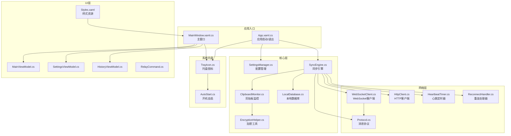
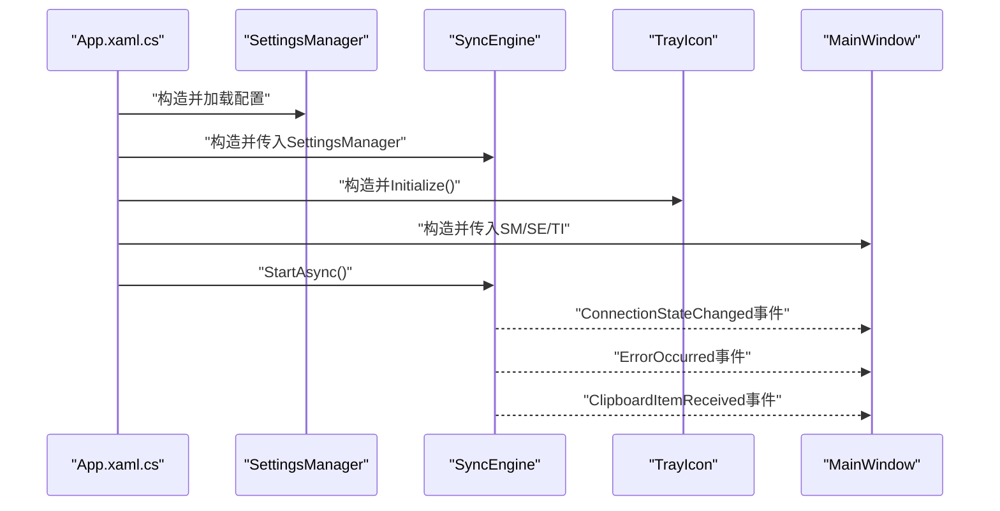
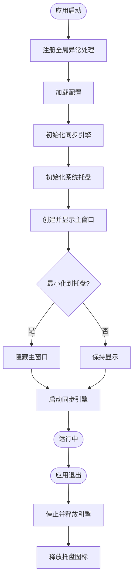
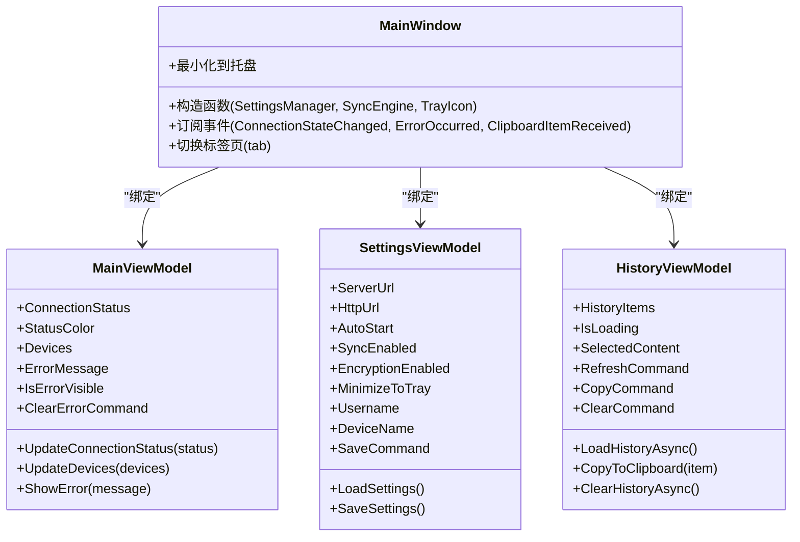
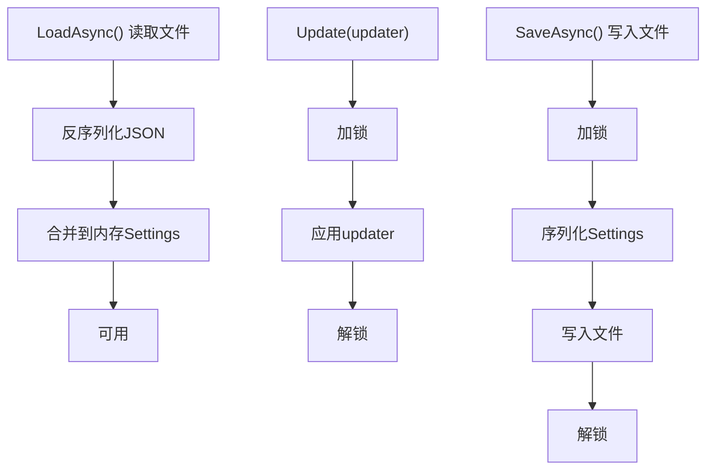
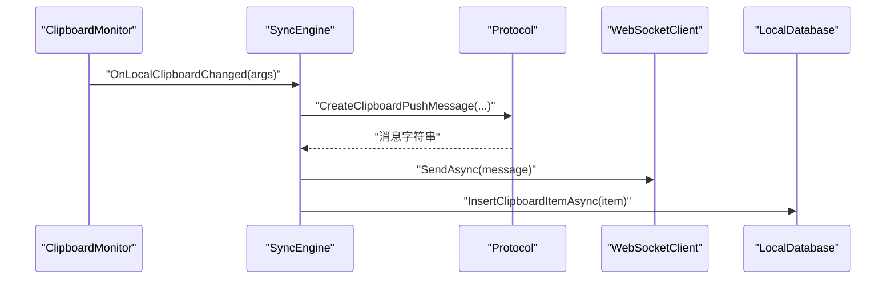
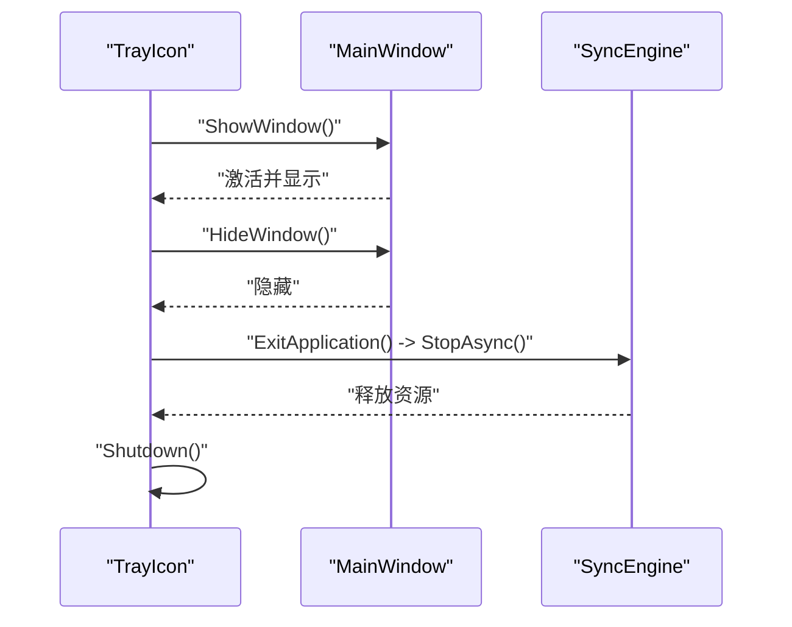
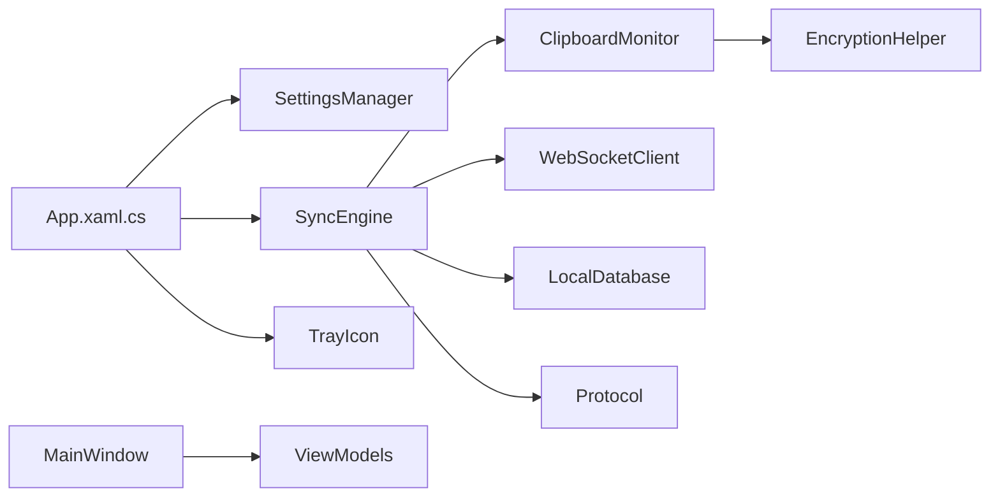

# 应用架构设计

<cite>
**本文引用的文件**
- [App.xaml](file://clipSync-windows/ClipSync.WPF/App.xaml)
- [App.xaml.cs](file://clipSync-windows/ClipSync.WPF/App.xaml.cs)
- [MainWindow.xaml](file://clipSync-windows/ClipSync.WPF/MainWindow.xaml)
- [MainWindow.xaml.cs](file://clipSync-windows/ClipSync.WPF/MainWindow.xaml.cs)
- [SettingsManager.cs](file://clipSync-windows/ClipSync.WPF/Core/SettingsManager.cs)
- [SyncEngine.cs](file://clipSync-windows/ClipSync.WPF/Core/SyncEngine.cs)
- [TrayIcon.cs](file://clipSync-windows/ClipSync.WPF/SystemTray/TrayIcon.cs)
- [MainViewModel.cs](file://clipSync-windows/ClipSync.WPF/UI/ViewModels/MainViewModel.cs)
- [SettingsViewModel.cs](file://clipSync-windows/ClipSync.WPF/UI/ViewModels/SettingsViewModel.cs)
- [HistoryViewModel.cs](file://clipSync-windows/ClipSync.WPF/UI/ViewModels/HistoryViewModel.cs)
- [RelayCommand.cs](file://clipSync-windows/ClipSync.WPF/RelayCommand.cs)
- [Styles.xaml](file://clipSync-windows/ClipSync.WPF/Resources/Styles.xaml)
- [Protocol.cs](file://clipSync-windows/ClipSync.WPF/Network/Protocol.cs)
- [LocalDatabase.cs](file://clipSync-windows/ClipSync.WPF/Storage/LocalDatabase.cs)
- [ClipboardMonitor.cs](file://clipSync-windows/ClipSync.WPF/Core/ClipboardMonitor.cs)
- [EncryptionHelper.cs](file://clipSync-windows/ClipSync.WPF/Core/EncryptionHelper.cs)
</cite>

## 目录
1. [引言](#引言)
2. [项目结构](#项目结构)
3. [核心组件](#核心组件)
4. [架构总览](#架构总览)
5. [详细组件分析](#详细组件分析)
6. [依赖分析](#依赖分析)
7. [性能考虑](#性能考虑)
8. [故障排查指南](#故障排查指南)
9. [结论](#结论)
10. [附录](#附录)

## 引言
本文件面向Windows客户端应用ClipSync.WPF，系统性阐述其整体架构与实现要点，重点覆盖以下方面：
- WPF应用的整体架构模式与模块化组织
- MVVM设计模式在视图、视图模型与命令中的落地
- 依赖注入机制（手工构造与事件解耦）
- 启动流程、主窗口管理、视图模型绑定与状态管理
- 具体代码示例：SettingsManager的配置管理、SyncEngine的业务逻辑协调、系统托盘集成
- 架构决策的技术考量、组件交互关系与扩展性设计
- 可测试性与可维护性的实践建议

## 项目结构
ClipSync.WPF采用按职责分层与功能域划分相结合的组织方式：
- Core：核心业务与基础设施（设置管理、剪贴板监控、加密、同步引擎）
- Network：网络协议与通信（WebSocket、HTTP、心跳、重连、协议编解码）
- Storage：本地存储（SQLite封装）
- SystemTray：系统托盘集成（图标、菜单、最小化行为）
- UI：视图与视图模型（MVVM）
- Resources：样式资源（主题色板、控件样式）

图表来源
- [App.xaml.cs:12-52](file://clipSync-windows/ClipSync.WPF/App.xaml.cs#L12-L52)
- [MainWindow.xaml.cs:21-48](file://clipSync-windows/ClipSync.WPF/MainWindow.xaml.cs#L21-L48)
- [SettingsManager.cs:44-100](file://clipSync-windows/ClipSync.WPF/Core/SettingsManager.cs#L44-L100)
- [SyncEngine.cs:8-31](file://clipSync-windows/ClipSync.WPF/Core/SyncEngine.cs#L8-L31)
- [ClipboardMonitor.cs:26-57](file://clipSync-windows/ClipSync.WPF/Core/ClipboardMonitor.cs#L26-L57)
- [EncryptionHelper.cs:18-134](file://clipSync-windows/ClipSync.WPF/Core/EncryptionHelper.cs#L18-L134)
- [LocalDatabase.cs:9-24](file://clipSync-windows/ClipSync.WPF/Storage/LocalDatabase.cs#L9-L24)
- [TrayIcon.cs:9-27](file://clipSync-windows/ClipSync.WPF/SystemTray/TrayIcon.cs#L9-L27)
- [Protocol.cs:60-165](file://clipSync-windows/ClipSync.WPF/Network/Protocol.cs#L60-L165)
- [MainViewModel.cs:8-58](file://clipSync-windows/ClipSync.WPF/UI/ViewModels/MainViewModel.cs#L8-L58)
- [SettingsViewModel.cs:8-75](file://clipSync-windows/ClipSync.WPF/UI/ViewModels/SettingsViewModel.cs#L8-L75)
- [HistoryViewModel.cs:9-44](file://clipSync-windows/ClipSync.WPF/UI/ViewModels/HistoryViewModel.cs#L9-L44)
- [RelayCommand.cs:6-32](file://clipSync-windows/ClipSync.WPF/RelayCommand.cs#L6-L32)
- [Styles.xaml:1-50](file://clipSync-windows/ClipSync.WPF/Resources/Styles.xaml#L1-L50)

章节来源
- [App.xaml:1-13](file://clipSync-windows/ClipSync.WPF/App.xaml#L1-L13)
- [App.xaml.cs:12-63](file://clipSync-windows/ClipSync.WPF/App.xaml.cs#L12-L63)
- [MainWindow.xaml:1-119](file://clipSync-windows/ClipSync.WPF/MainWindow.xaml#L1-L119)
- [MainWindow.xaml.cs:21-48](file://clipSync-windows/ClipSync.WPF/MainWindow.xaml.cs#L21-L48)

## 核心组件
本节聚焦关键组件及其职责边界与协作关系。

- SettingsManager（配置管理）
  - 职责：加载/保存应用设置；线程安全更新；默认值初始化；路径位于用户应用数据目录。
  - 关键点：使用锁保护并发访问；JSON序列化持久化；提供Update委托以原子更新字段。
  - 示例路径：[SettingsManager.cs:44-100](file://clipSync-windows/ClipSync.WPF/Core/SettingsManager.cs#L44-L100)

- SyncEngine（同步引擎）
  - 职责：协调剪贴板监控、WebSocket连接、心跳、重连、设备列表请求、历史拉取与本地存储。
  - 关键点：事件驱动（连接状态、错误、设备列表、剪贴板接收）；异步生命周期管理；加密开关与密码传递给协议层。
  - 示例路径：[SyncEngine.cs:8-31](file://clipSync-windows/ClipSync.WPF/Core/SyncEngine.cs#L8-L31)，[SyncEngine.cs:32-57](file://clipSync-windows/ClipSync.WPF/Core/SyncEngine.cs#L32-L57)

- ClipboardMonitor（剪贴板监控）
  - 职责：STA线程轮询剪贴板变化；计算校验和避免重复推送；区分文本与图像格式。
  - 关键点：COM异常重试；多格式检测；回调通知上层。
  - 示例路径：[ClipboardMonitor.cs:26-57](file://clipSync-windows/ClipSync.WPF/Core/ClipboardMonitor.cs#L26-L57)，[ClipboardMonitor.cs:89-153](file://clipSync-windows/ClipSync.WPF/Core/ClipboardMonitor.cs#L89-L153)

- EncryptionHelper（加密工具）
  - 职责：AES-256-CBC加解密与校验和计算；统一格式便于跨端兼容。
  - 关键点：PBKDF2派生密钥；随机盐与IV；失败不降级为明文。
  - 示例路径：[EncryptionHelper.cs:18-134](file://clipSync-windows/ClipSync.WPF/Core/EncryptionHelper.cs#L18-L134)

- LocalDatabase（本地数据库）
  - 职责：SQLite封装；剪贴板历史表；自动建表与索引；限制保留最近50条。
  - 关键点：初始化懒加载；线程内执行SQL；插入时裁剪过长历史。
  - 示例路径：[LocalDatabase.cs:9-24](file://clipSync-windows/ClipSync.WPF/Storage/LocalDatabase.cs#L9-L24)，[LocalDatabase.cs:60-96](file://clipSync-windows/ClipSync.WPF/Storage/LocalDatabase.cs#L60-L96)

- Protocol（消息协议）
  - 职责：WebSocket消息结构定义与序列化；认证、心跳、剪贴板推送/拉取、设备列表等消息构建。
  - 关键点：类型化消息；Payload对象化；加密失败直接抛错。
  - 示例路径：[Protocol.cs:60-165](file://clipSync-windows/ClipSync.WPF/Network/Protocol.cs#L60-L165)

- TrayIcon（系统托盘）
  - 职责：托盘图标、右键菜单、双击显示主窗体、退出时停止同步。
  - 关键点：与主窗体关联；最小化到托盘行为由设置控制。
  - 示例路径：[TrayIcon.cs:9-27](file://clipSync-windows/ClipSync.WPF/SystemTray/TrayIcon.cs#L9-L27)，[TrayIcon.cs:28-57](file://clipSync-windows/ClipSync.WPF/SystemTray/TrayIcon.cs#L28-L57)

章节来源
- [SettingsManager.cs:44-100](file://clipSync-windows/ClipSync.WPF/Core/SettingsManager.cs#L44-L100)
- [SyncEngine.cs:8-31](file://clipSync-windows/ClipSync.WPF/Core/SyncEngine.cs#L8-L31)
- [ClipboardMonitor.cs:26-57](file://clipSync-windows/ClipSync.WPF/Core/ClipboardMonitor.cs#L26-L57)
- [EncryptionHelper.cs:18-134](file://clipSync-windows/ClipSync.WPF/Core/EncryptionHelper.cs#L18-L134)
- [LocalDatabase.cs:9-24](file://clipSync-windows/ClipSync.WPF/Storage/LocalDatabase.cs#L9-L24)
- [Protocol.cs:60-165](file://clipSync-windows/ClipSync.WPF/Network/Protocol.cs#L60-L165)
- [TrayIcon.cs:9-27](file://clipSync-windows/ClipSync.WPF/SystemTray/TrayIcon.cs#L9-L27)

## 架构总览
ClipSync.WPF遵循“核心服务 + 网络通信 + 本地存储 + UI交互”的分层架构，并通过事件与命令实现松耦合。

图表来源
- [App.xaml.cs:35-51](file://clipSync-windows/ClipSync.WPF/App.xaml.cs#L35-L51)
- [SyncEngine.cs:32-57](file://clipSync-windows/ClipSync.WPF/Core/SyncEngine.cs#L32-L57)
- [MainWindow.xaml.cs:39-42](file://clipSync-windows/ClipSync.WPF/MainWindow.xaml.cs#L39-L42)

章节来源
- [App.xaml.cs:12-63](file://clipSync-windows/ClipSync.WPF/App.xaml.cs#L12-L63)
- [MainWindow.xaml.cs:21-48](file://clipSync-windows/ClipSync.WPF/MainWindow.xaml.cs#L21-L48)

## 详细组件分析

### 应用启动与生命周期
- 启动阶段
  - 全局异常处理：DispatcherUnhandledException、AppDomain.UnhandledException、TaskScheduler.UnobservedTaskException
  - 加载配置：SettingsManager.LoadAsync
  - 初始化同步引擎：SyncEngine.StartAsync
  - 初始化托盘：TrayIcon.Initialize
  - 显示主窗口：根据MinimizeToTray决定是否隐藏
- 退出阶段
  - 停止同步引擎并释放资源
  - 释放托盘图标

图表来源
- [App.xaml.cs:12-63](file://clipSync-windows/ClipSync.WPF/App.xaml.cs#L12-L63)

章节来源
- [App.xaml.cs:12-63](file://clipSync-windows/ClipSync.WPF/App.xaml.cs#L12-L63)

### 主窗口管理与视图模型绑定
- 主窗口MainWindow负责：
  - 组织导航标签与内容区
  - 订阅SyncEngine事件并更新状态指示
  - 管理登录/历史/设置/设备视图切换
  - 处理最小化到托盘与错误横幅
- 视图模型层：
  - MainViewModel：连接状态、错误信息、设备列表、命令
  - SettingsViewModel：设置项属性、保存命令、自动启动
  - HistoryViewModel：历史列表、刷新/复制/清空命令

图表来源
- [MainWindow.xaml.cs:21-48](file://clipSync-windows/ClipSync.WPF/MainWindow.xaml.cs#L21-L48)
- [MainViewModel.cs:8-108](file://clipSync-windows/ClipSync.WPF/UI/ViewModels/MainViewModel.cs#L8-L108)
- [SettingsViewModel.cs:8-122](file://clipSync-windows/ClipSync.WPF/UI/ViewModels/SettingsViewModel.cs#L8-L122)
- [HistoryViewModel.cs:9-89](file://clipSync-windows/ClipSync.WPF/UI/ViewModels/HistoryViewModel.cs#L9-L89)

章节来源
- [MainWindow.xaml:1-119](file://clipSync-windows/ClipSync.WPF/MainWindow.xaml#L1-L119)
- [MainWindow.xaml.cs:21-291](file://clipSync-windows/ClipSync.WPF/MainWindow.xaml.cs#L21-L291)
- [MainViewModel.cs:8-110](file://clipSync-windows/ClipSync.WPF/UI/ViewModels/MainViewModel.cs#L8-L110)
- [SettingsViewModel.cs:8-123](file://clipSync-windows/ClipSync.WPF/UI/ViewModels/SettingsViewModel.cs#L8-L123)
- [HistoryViewModel.cs:9-90](file://clipSync-windows/ClipSync.WPF/UI/ViewModels/HistoryViewModel.cs#L9-L90)

### MVVM命令与可测试性
- RelayCommand提供泛型与非泛型版本，支持参数化执行与CanExecute查询
- 视图模型通过命令封装用户操作，降低视图代码复杂度
- 可测试性建议：
  - 将命令绑定到接口或抽象方法，便于单元测试替换
  - 将耗时操作（如网络/IO）抽取为接口，使用依赖注入或工厂模式

章节来源
- [RelayCommand.cs:6-56](file://clipSync-windows/ClipSync.WPF/RelayCommand.cs#L6-L56)
- [SettingsViewModel.cs:70-113](file://clipSync-windows/ClipSync.WPF/UI/ViewModels/SettingsViewModel.cs#L70-L113)
- [HistoryViewModel.cs:38-80](file://clipSync-windows/ClipSync.WPF/UI/ViewModels/HistoryViewModel.cs#L38-L80)

### 配置管理（SettingsManager）
- 数据结构：AppSettings包含服务器地址、令牌、设备名、同步开关、加密开关与密码等
- 持久化：JSON写入/读取至用户应用数据目录
- 并发安全：Update与Save/Load均使用锁保护
- 使用场景：启动时加载、登录/注册后保存、设置界面保存

图表来源
- [SettingsManager.cs:62-91](file://clipSync-windows/ClipSync.WPF/Core/SettingsManager.cs#L62-L91)
- [SettingsManager.cs:93-99](file://clipSync-windows/ClipSync.WPF/Core/SettingsManager.cs#L93-L99)

章节来源
- [SettingsManager.cs:44-100](file://clipSync-windows/ClipSync.WPF/Core/SettingsManager.cs#L44-L100)

### 同步引擎（SyncEngine）业务逻辑
- 生命周期：StartAsync初始化数据库、WebSocket、HTTP、心跳、重连、剪贴板监控；StopAsync释放资源
- 连接与认证：ConnectAndAuthenticateAsync发送认证消息；成功后启动心跳与重连
- 剪贴板同步：
  - 本地变更：ClipboardMonitor触发，按配置加密后通过Protocol封装并发送
  - 远端变更：WebSocket消息到达后解密、设置剪贴板、入库并触发历史刷新
- 设备与历史：支持请求设备列表与拉取历史

图表来源
- [SyncEngine.cs:95-125](file://clipSync-windows/ClipSync.WPF/Core/SyncEngine.cs#L95-L125)
- [Protocol.cs:99-141](file://clipSync-windows/ClipSync.WPF/Network/Protocol.cs#L99-L141)

章节来源
- [SyncEngine.cs:32-57](file://clipSync-windows/ClipSync.WPF/Core/SyncEngine.cs#L32-L57)
- [SyncEngine.cs:95-125](file://clipSync-windows/ClipSync.WPF/Core/SyncEngine.cs#L95-L125)
- [SyncEngine.cs:127-163](file://clipSync-windows/ClipSync.WPF/Core/SyncEngine.cs#L127-L163)
- [SyncEngine.cs:188-267](file://clipSync-windows/ClipSync.WPF/Core/SyncEngine.cs#L188-L267)
- [Protocol.cs:99-141](file://clipSync-windows/ClipSync.WPF/Network/Protocol.cs#L99-L141)

### 系统托盘集成（TrayIcon）
- 功能：托盘图标、上下文菜单（显示/隐藏/退出）、双击显示主窗口
- 行为：最小化到托盘时隐藏主窗口；退出时停止同步引擎并关闭应用
- 与AutoStart联动：根据设置启用/禁用开机自启

图表来源
- [TrayIcon.cs:28-57](file://clipSync-windows/ClipSync.WPF/SystemTray/TrayIcon.cs#L28-L57)
- [TrayIcon.cs:80-85](file://clipSync-windows/ClipSync.WPF/SystemTray/TrayIcon.cs#L80-L85)

章节来源
- [TrayIcon.cs:9-109](file://clipSync-windows/ClipSync.WPF/SystemTray/TrayIcon.cs#L9-L109)

### 状态管理与UI反馈
- 连接状态：MainWindow根据SyncEngine.ConnectionStateChanged事件更新状态点与文字
- 错误提示：MainWindow在登录/错误事件中显示错误横幅并可关闭
- 历史刷新：切换到History标签页时拉取本地历史并绑定到视图模型

章节来源
- [MainWindow.xaml.cs:112-154](file://clipSync-windows/ClipSync.WPF/MainWindow.xaml.cs#L112-L154)
- [MainWindow.xaml.cs:181-185](file://clipSync-windows/ClipSync.WPF/MainWindow.xaml.cs#L181-L185)

## 依赖分析
- 组件耦合
  - App对Core与SystemTray强依赖；MainWindow对UI.ViewModels与Core弱依赖
  - SyncEngine聚合多个子系统（网络、存储、监控），通过事件解耦
- 外部依赖
  - 硬件/系统：Windows Clipboard API、SQLite、TaskbarIcon托盘库
  - 第三方库：Newtonsoft.Json（序列化）、Microsoft.Data.Sqlite（数据库）
- 循环依赖
  - 当前未发现循环引用；事件回调避免了直接循环依赖

图表来源
- [App.xaml.cs:35-41](file://clipSync-windows/ClipSync.WPF/App.xaml.cs#L35-L41)
- [SyncEngine.cs:8-31](file://clipSync-windows/ClipSync.WPF/Core/SyncEngine.cs#L8-L31)
- [ClipboardMonitor.cs:26-37](file://clipSync-windows/ClipSync.WPF/Core/ClipboardMonitor.cs#L26-L37)
- [LocalDatabase.cs:9-16](file://clipSync-windows/ClipSync.WPF/Storage/LocalDatabase.cs#L9-L16)
- [Protocol.cs:60-77](file://clipSync-windows/ClipSync.WPF/Network/Protocol.cs#L60-L77)

章节来源
- [App.xaml.cs:35-41](file://clipSync-windows/ClipSync.WPF/App.xaml.cs#L35-L41)
- [SyncEngine.cs:8-31](file://clipSync-windows/ClipSync.WPF/Core/SyncEngine.cs#L8-L31)

## 性能考虑
- 剪贴板轮询
  - 间隔500ms，STA线程避免COM冲突；对Clipboard锁定进行重试
- 网络与存储
  - 所有IO操作封装为Task并在后台线程执行，避免阻塞UI
  - SQLite写入后自动裁剪历史，限制最大条目数
- 序列化与加密
  - JSON序列化轻量；加密失败直接抛错，避免无效传输
- UI线程
  - 仅在必要处使用Dispatcher.Invoke切换到UI线程

章节来源
- [ClipboardMonitor.cs:58-87](file://clipSync-windows/ClipSync.WPF/Core/ClipboardMonitor.cs#L58-L87)
- [LocalDatabase.cs:60-96](file://clipSync-windows/ClipSync.WPF/Storage/LocalDatabase.cs#L60-L96)
- [SyncEngine.cs:224-242](file://clipSync-windows/ClipSync.WPF/Core/SyncEngine.cs#L224-L242)

## 故障排查指南
- 登录/注册失败
  - 检查HTTP客户端返回结果与错误事件；确认服务器URL与令牌
- 连接断开/重连
  - 查看连接状态事件与重连处理器调度；检查心跳定时器
- 剪贴板不同步
  - 确认SyncEnabled与加密开关一致；检查校验和去重逻辑
- 托盘无响应
  - 确认托盘图标初始化与菜单项绑定；最小化到托盘设置
- 全局异常
  - 利用App全局异常处理定位未捕获异常

章节来源
- [App.xaml.cs:16-33](file://clipSync-windows/ClipSync.WPF/App.xaml.cs#L16-L33)
- [SyncEngine.cs:303-310](file://clipSync-windows/ClipSync.WPF/Core/SyncEngine.cs#L303-L310)
- [TrayIcon.cs:28-57](file://clipSync-windows/ClipSync.WPF/SystemTray/TrayIcon.cs#L28-L57)

## 结论
ClipSync.WPF通过清晰的分层与事件驱动设计，实现了稳定的剪贴板跨设备同步能力。SettingsManager与SyncEngine分别承担配置与业务协调的核心职责，配合系统托盘与MVVM视图模型，提供了良好的用户体验与可维护性。未来可在以下方面进一步增强：
- 引入依赖注入框架以简化构造与测试
- 抽象网络与存储接口，提升可替换性
- 增加单元测试与集成测试覆盖率
- 优化日志与诊断输出

## 附录
- 主题与样式
  - Styles.xaml集中定义主题色板、圆角、阴影与控件样式，确保UI一致性
- 快速参考
  - 启动流程：App → SettingsManager.LoadAsync → SyncEngine.StartAsync → TrayIcon.Initialize → MainWindow.Show
  - 关闭流程：MainWindow关闭事件（最小化到托盘）→ App.OnExit → SyncEngine.StopAsync → TrayIcon.Dispose

章节来源
- [Styles.xaml:1-252](file://clipSync-windows/ClipSync.WPF/Resources/Styles.xaml#L1-L252)
- [App.xaml.cs:12-63](file://clipSync-windows/ClipSync.WPF/App.xaml.cs#L12-L63)
- [MainWindow.xaml.cs:280-288](file://clipSync-windows/ClipSync.WPF/MainWindow.xaml.cs#L280-L288)