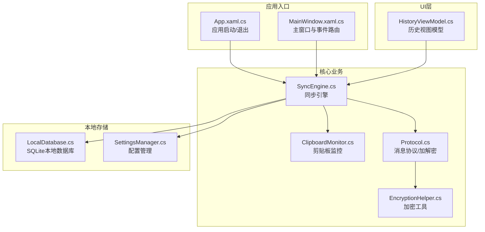
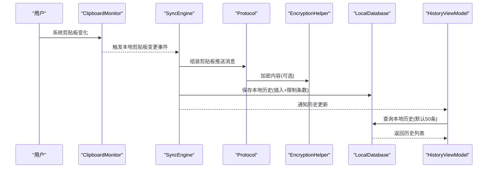
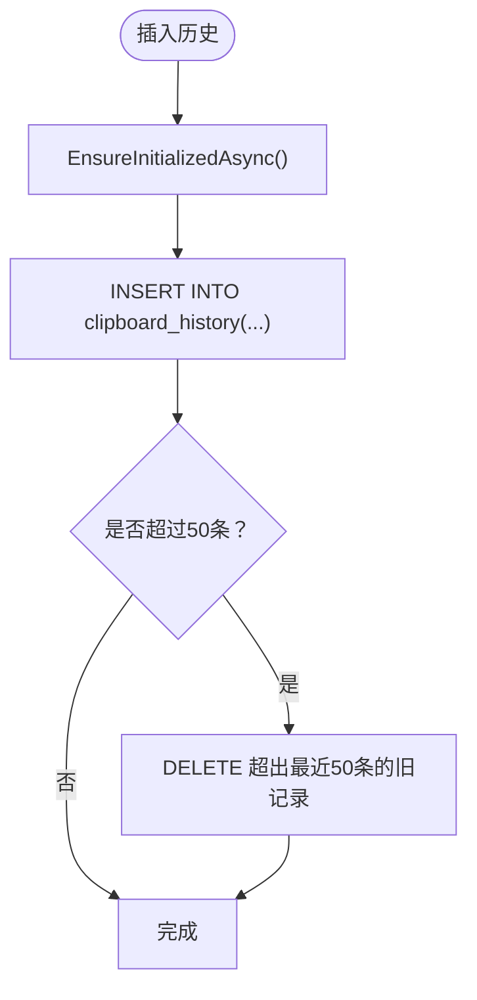
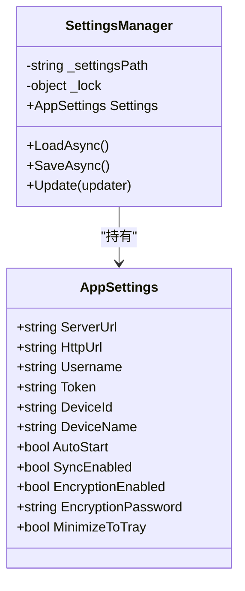
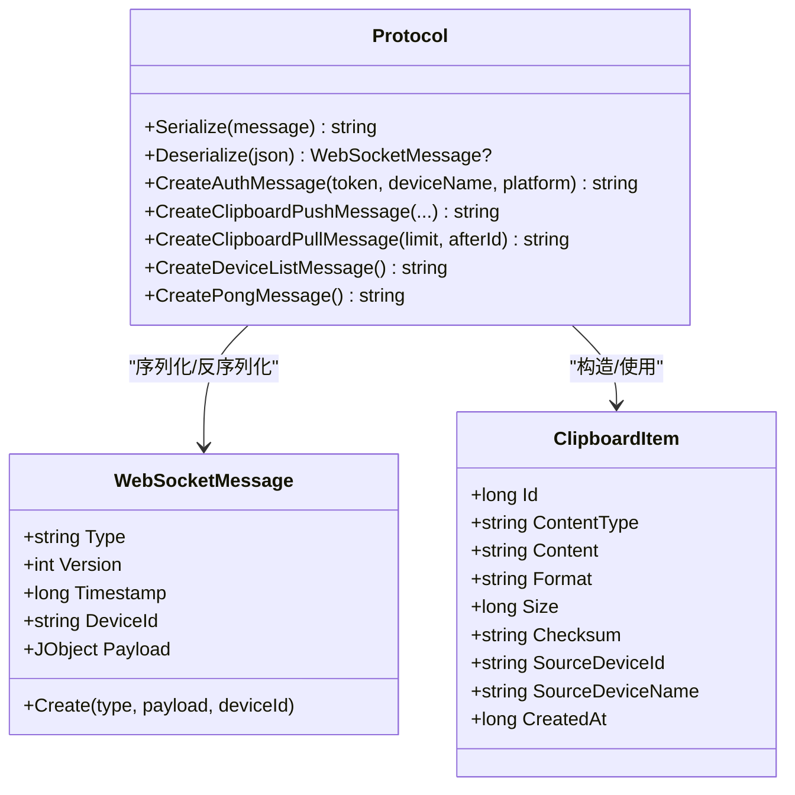
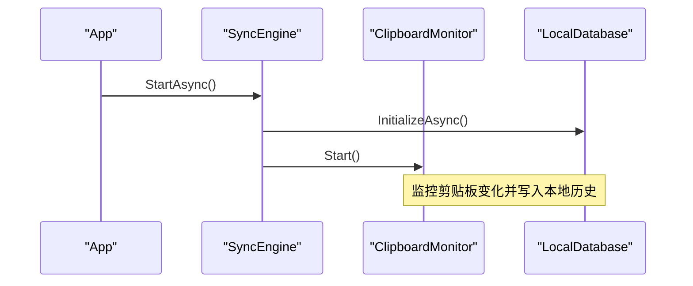
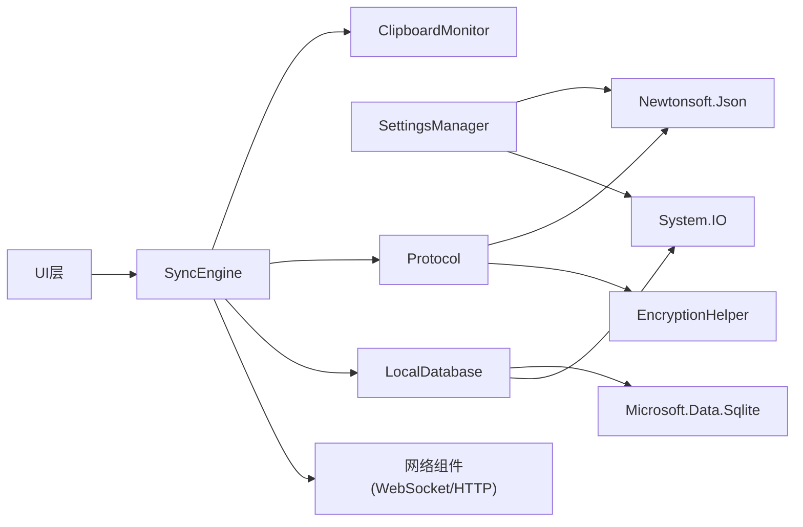

# 本地存储管理

<cite>
**本文引用的文件**
- [LocalDatabase.cs](file://clipSync-windows/ClipSync.WPF/Storage/LocalDatabase.cs)
- [SettingsManager.cs](file://clipSync-windows/ClipSync.WPF/Core/SettingsManager.cs)
- [EncryptionHelper.cs](file://clipSync-windows/ClipSync.WPF/Core/EncryptionHelper.cs)
- [Protocol.cs](file://clipSync-windows/ClipSync.WPF/Network/Protocol.cs)
- [SyncEngine.cs](file://clipSync-windows/ClipSync.WPF/Core/SyncEngine.cs)
- [ClipboardMonitor.cs](file://clipSync-windows/ClipSync.WPF/Core/ClipboardMonitor.cs)
- [HistoryViewModel.cs](file://clipSync-windows/ClipSync.WPF/UI/ViewModels/HistoryViewModel.cs)
- [App.xaml.cs](file://clipSync-windows/ClipSync.WPF/App.xaml.cs)
- [MainWindow.xaml.cs](file://clipSync-windows/ClipSync.WPF/MainWindow.xaml.cs)
</cite>

## 目录
1. [简介](#简介)
2. [项目结构](#项目结构)
3. [核心组件](#核心组件)
4. [架构总览](#架构总览)
5. [详细组件分析](#详细组件分析)
6. [依赖关系分析](#依赖关系分析)
7. [性能考虑](#性能考虑)
8. [故障排查指南](#故障排查指南)
9. [结论](#结论)
10. [附录](#附录)

## 简介
本文件面向Windows客户端的本地存储管理，围绕SQLite数据库操作、数据模型设计、缓存策略与配置管理进行深入解析。重点覆盖：
- LocalDatabase：数据库初始化、表结构、CRUD与事务特性
- SettingsManager：配置项管理、持久化与迁移
- 数据加密、备份恢复与完整性保障
- 性能优化、索引与查询优化
- 数据生命周期管理、存储空间控制与垃圾回收
- 剪贴板历史记录的存储、检索与清理机制

目标是让初学者易懂，同时为有经验的开发者提供足够的技术深度与实现细节参考。

## 项目结构
Windows客户端采用分层架构，本地存储位于Storage层，核心业务逻辑在Core层，网络协议与消息封装在Network层，UI层通过视图模型与核心引擎交互。

图表来源
- [App.xaml.cs:12-52](file://clipSync-windows/ClipSync.WPF/App.xaml.cs#L12-L52)
- [MainWindow.xaml.cs:35-48](file://clipSync-windows/ClipSync.WPF/MainWindow.xaml.cs#L35-L48)
- [SyncEngine.cs:32-57](file://clipSync-windows/ClipSync.WPF/Core/SyncEngine.cs#L32-L57)
- [LocalDatabase.cs:26-58](file://clipSync-windows/ClipSync.WPF/Storage/LocalDatabase.cs#L26-L58)
- [SettingsManager.cs:62-91](file://clipSync-windows/ClipSync.WPF/Core/SettingsManager.cs#L62-L91)
- [Protocol.cs:38-49](file://clipSync-windows/ClipSync.WPF/Network/Protocol.cs#L38-L49)
- [EncryptionHelper.cs:18-134](file://clipSync-windows/ClipSync.WPF/Core/EncryptionHelper.cs#L18-L134)
- [HistoryViewModel.cs:46-62](file://clipSync-windows/ClipSync.WPF/UI/ViewModels/HistoryViewModel.cs#L46-L62)

章节来源
- [App.xaml.cs:12-52](file://clipSync-windows/ClipSync.WPF/App.xaml.cs#L12-L52)
- [MainWindow.xaml.cs:35-48](file://clipSync-windows/ClipSync.WPF/MainWindow.xaml.cs#L35-L48)
- [SyncEngine.cs:32-57](file://clipSync-windows/ClipSync.WPF/Core/SyncEngine.cs#L32-L57)

## 核心组件
- LocalDatabase：负责SQLite数据库初始化、表结构创建、剪贴板历史记录的插入、查询与清理。
- SettingsManager：负责应用配置的加载、保存与更新，配置项包括服务器地址、认证令牌、设备信息、自动启动、同步开关、加密开关与密码等。
- EncryptionHelper：提供AES-256-CBC加解密与校验和计算，统一格式兼容Android与服务端。
- Protocol：定义WebSocket消息结构与序列化/反序列化，封装剪贴板推送/拉取消息及认证消息。
- SyncEngine：协调剪贴板监控、网络连接、消息处理与本地数据库写入。
- ClipboardMonitor：监控系统剪贴板变化，生成去重后的变更事件。
- HistoryViewModel：UI层历史列表的数据绑定与命令执行。

章节来源
- [LocalDatabase.cs:9-169](file://clipSync-windows/ClipSync.WPF/Storage/LocalDatabase.cs#L9-L169)
- [SettingsManager.cs:44-101](file://clipSync-windows/ClipSync.WPF/Core/SettingsManager.cs#L44-L101)
- [EncryptionHelper.cs:18-134](file://clipSync-windows/ClipSync.WPF/Core/EncryptionHelper.cs#L18-L134)
- [Protocol.cs:38-167](file://clipSync-windows/ClipSync.WPF/Network/Protocol.cs#L38-L167)
- [SyncEngine.cs:8-422](file://clipSync-windows/ClipSync.WPF/Core/SyncEngine.cs#L8-L422)
- [ClipboardMonitor.cs:26-174](file://clipSync-windows/ClipSync.WPF/Core/ClipboardMonitor.cs#L26-L174)
- [HistoryViewModel.cs:9-90](file://clipSync-windows/ClipSync.WPF/UI/ViewModels/HistoryViewModel.cs#L9-L90)

## 架构总览
本地存储贯穿“剪贴板监控 -> 协议封装 -> 网络传输 -> 服务端同步 -> 本地落库 -> UI展示”的完整链路。

图表来源
- [ClipboardMonitor.cs:58-87](file://clipSync-windows/ClipSync.WPF/Core/ClipboardMonitor.cs#L58-L87)
- [SyncEngine.cs:95-125](file://clipSync-windows/ClipSync.WPF/Core/SyncEngine.cs#L95-L125)
- [Protocol.cs:99-141](file://clipSync-windows/ClipSync.WPF/Network/Protocol.cs#L99-L141)
- [EncryptionHelper.cs:30-55](file://clipSync-windows/ClipSync.WPF/Core/EncryptionHelper.cs#L30-L55)
- [LocalDatabase.cs:60-96](file://clipSync-windows/ClipSync.WPF/Storage/LocalDatabase.cs#L60-L96)
- [HistoryViewModel.cs:46-62](file://clipSync-windows/ClipSync.WPF/UI/ViewModels/HistoryViewModel.cs#L46-L62)

## 详细组件分析

### LocalDatabase：SQLite本地数据库
- 数据库路径：位于用户应用数据目录下的ClipSync子目录，文件名为clipsync.db。
- 初始化流程：首次使用时创建数据库与表，确保线程安全与幂等。
- 表结构设计：
  - 名称：clipboard_history
  - 字段：id、content_type、content、format、size、checksum、source_device_id、source_device_name、created_at
  - 主键：id（自增）
  - 索引：按created_at降序建立索引，支持高效时间序列查询
- CRUD操作：
  - 插入：InsertClipboardItemAsync，参数为Network.ClipboardItem，插入后自动清理超出上限的历史记录
  - 查询：GetClipboardHistoryAsync，默认返回最近50条，按时间倒序
  - 清理：ClearHistoryAsync，清空所有历史记录
- 事务与并发：当前实现未显式使用事务，但通过单条INSERT与LIMIT删除组合，保证“最多保留N条”语义的一致性；读写分离通过Task.Run异步执行，避免阻塞UI线程。
- 存储空间控制：插入后自动限制保留最近50条，防止无限增长。

图表来源
- [LocalDatabase.cs:60-96](file://clipSync-windows/ClipSync.WPF/Storage/LocalDatabase.cs#L60-L96)

章节来源
- [LocalDatabase.cs:15-58](file://clipSync-windows/ClipSync.WPF/Storage/LocalDatabase.cs#L15-L58)
- [LocalDatabase.cs:60-137](file://clipSync-windows/ClipSync.WPF/Storage/LocalDatabase.cs#L60-L137)
- [LocalDatabase.cs:139-152](file://clipSync-windows/ClipSync.WPF/Storage/LocalDatabase.cs#L139-L152)

### SettingsManager：配置管理与持久化
- 配置项：服务器URL、HTTP URL、用户名、令牌、设备ID、设备名、自动启动、同步开关、加密开关、加密密码、最小化到托盘等。
- 持久化：配置以JSON形式存储于应用数据目录的settings.json，支持异步加载与保存。
- 并发控制：使用锁对象保护配置更新与序列化过程，避免竞态条件。
- 迁移策略：当前未实现版本迁移逻辑，建议后续引入版本号字段与迁移函数，以兼容未来配置结构变更。

图表来源
- [SettingsManager.cs:8-42](file://clipSync-windows/ClipSync.WPF/Core/SettingsManager.cs#L8-L42)
- [SettingsManager.cs:44-101](file://clipSync-windows/ClipSync.WPF/Core/SettingsManager.cs#L44-L101)

章节来源
- [SettingsManager.cs:62-91](file://clipSync-windows/ClipSync.WPF/Core/SettingsManager.cs#L62-L91)
- [SettingsManager.cs:93-99](file://clipSync-windows/ClipSync.WPF/Core/SettingsManager.cs#L93-L99)

### 数据模型与协议：剪贴板历史
- Network.ClipboardItem：用于跨模块传递剪贴板数据，包含类型、内容、格式、大小、校验和、来源设备ID/名称、时间戳等。
- Protocol：定义WebSocket消息结构，提供剪贴板推送/拉取、认证、心跳等消息的序列化/反序列化方法。
- 加密集成：当启用加密时，Protocol在发送前对内容进行加密，接收端根据标记决定是否解密。

图表来源
- [Protocol.cs:38-49](file://clipSync-windows/ClipSync.WPF/Network/Protocol.cs#L38-L49)
- [Protocol.cs:62-77](file://clipSync-windows/ClipSync.WPF/Network/Protocol.cs#L62-L77)
- [Protocol.cs:79-164](file://clipSync-windows/ClipSync.WPF/Network/Protocol.cs#L79-L164)

章节来源
- [Protocol.cs:38-167](file://clipSync-windows/ClipSync.WPF/Network/Protocol.cs#L38-L167)

### 同步引擎与剪贴板监控
- SyncEngine：负责启动/停止、连接认证、消息处理、本地历史保存、登录/注册/登出、设备列表请求等。
- ClipboardMonitor：后台线程监控系统剪贴板变化，去重后触发事件，支持文本与图像两种类型。
- 生命周期：应用启动时加载配置并启动同步引擎；应用退出时停止并释放资源。

图表来源
- [App.xaml.cs:35-51](file://clipSync-windows/ClipSync.WPF/App.xaml.cs#L35-L51)
- [SyncEngine.cs:32-57](file://clipSync-windows/ClipSync.WPF/Core/SyncEngine.cs#L32-L57)
- [ClipboardMonitor.cs:39-56](file://clipSync-windows/ClipSync.WPF/Core/ClipboardMonitor.cs#L39-L56)
- [LocalDatabase.cs:26-58](file://clipSync-windows/ClipSync.WPF/Storage/LocalDatabase.cs#L26-L58)

章节来源
- [SyncEngine.cs:32-57](file://clipSync-windows/ClipSync.WPF/Core/SyncEngine.cs#L32-L57)
- [ClipboardMonitor.cs:58-87](file://clipSync-windows/ClipSync.WPF/Core/ClipboardMonitor.cs#L58-L87)

### UI层：历史视图与命令
- HistoryViewModel：提供刷新、复制、清空命令，从SyncEngine获取本地历史并绑定到UI。
- MainWindow：根据标签页切换加载不同视图，触发历史加载与设备列表请求。

章节来源
- [HistoryViewModel.cs:38-62](file://clipSync-windows/ClipSync.WPF/UI/ViewModels/HistoryViewModel.cs#L38-L62)
- [MainWindow.xaml.cs:181-185](file://clipSync-windows/ClipSync.WPF/MainWindow.xaml.cs#L181-L185)

## 依赖关系分析
- LocalDatabase依赖Microsoft.Data.Sqlite进行SQLite访问，依赖System.IO进行文件路径管理。
- SettingsManager依赖Newtonsoft.Json进行配置序列化/反序列化，依赖System.IO进行文件读写。
- Protocol依赖EncryptionHelper进行内容加解密，依赖Newtonsoft.Json进行消息序列化。
- SyncEngine依赖ClipboardMonitor、WebSocketClient、HttpClient、HeartbeatTimer、ReconnectHandler与LocalDatabase。
- UI层通过视图模型与SyncEngine交互，不直接依赖数据库。

图表来源
- [LocalDatabase.cs:1-6](file://clipSync-windows/ClipSync.WPF/Storage/LocalDatabase.cs#L1-L6)
- [SettingsManager.cs:1-4](file://clipSync-windows/ClipSync.WPF/Core/SettingsManager.cs#L1-L4)
- [Protocol.cs:1-5](file://clipSync-windows/ClipSync.WPF/Network/Protocol.cs#L1-L5)
- [SyncEngine.cs:1-5](file://clipSync-windows/ClipSync.WPF/Core/SyncEngine.cs#L1-L5)

章节来源
- [LocalDatabase.cs:1-6](file://clipSync-windows/ClipSync.WPF/Storage/LocalDatabase.cs#L1-L6)
- [SettingsManager.cs:1-4](file://clipSync-windows/ClipSync.WPF/Core/SettingsManager.cs#L1-L4)
- [Protocol.cs:1-5](file://clipSync-windows/ClipSync.WPF/Network/Protocol.cs#L1-L5)
- [SyncEngine.cs:1-5](file://clipSync-windows/ClipSync.WPF/Core/SyncEngine.cs#L1-L5)

## 性能考虑
- 异步I/O：数据库与配置读写均通过Task.Run异步执行，避免阻塞UI线程。
- 索引优化：为created_at建立降序索引，支持高效的时间序列查询与分页。
- 写入限流：插入后自动限制保留最近50条，控制存储空间与查询开销。
- 序列化成本：配置使用JSON序列化，建议在频繁更新场景下合并多次更新，减少磁盘写入次数。
- 线程模型：剪贴板监控使用后台线程，STA线程用于设置系统剪贴板，避免死锁与异常。

章节来源
- [LocalDatabase.cs:50-54](file://clipSync-windows/ClipSync.WPF/Storage/LocalDatabase.cs#L50-L54)
- [LocalDatabase.cs:85-95](file://clipSync-windows/ClipSync.WPF/Storage/LocalDatabase.cs#L85-L95)
- [ClipboardMonitor.cs:39-56](file://clipSync-windows/ClipSync.WPF/Core/ClipboardMonitor.cs#L39-L56)

## 故障排查指南
- 数据库初始化失败
  - 检查应用数据目录权限与磁盘空间
  - 确认SQLite驱动可用
- 历史记录为空或数量异常
  - 确认SyncEnabled已开启
  - 检查插入后LIMIT删除逻辑是否正常执行
- 配置无法保存
  - 检查settings.json写入权限
  - 确认SaveAsync调用与锁保护
- 加密失败
  - 检查EncryptionEnabled与EncryptionPassword配置
  - 确认加密格式与PBKDF2迭代次数一致
- UI无响应
  - 确保数据库与配置读写在后台线程执行
  - 检查Dispatcher.Invoke在UI线程中使用

章节来源
- [LocalDatabase.cs:26-58](file://clipSync-windows/ClipSync.WPF/Storage/LocalDatabase.cs#L26-L58)
- [SettingsManager.cs:81-91](file://clipSync-windows/ClipSync.WPF/Core/SettingsManager.cs#L81-L91)
- [EncryptionHelper.cs:62-103](file://clipSync-windows/ClipSync.WPF/Core/EncryptionHelper.cs#L62-L103)
- [SyncEngine.cs:95-125](file://clipSync-windows/ClipSync.WPF/Core/SyncEngine.cs#L95-L125)

## 结论
Windows客户端的本地存储管理以SQLite为核心，结合配置持久化与加解密工具，实现了剪贴板历史的可靠存储与高效检索。通过索引优化与写入限流，兼顾了性能与资源占用。建议后续增强配置迁移、事务一致性与备份恢复能力，进一步提升系统的健壮性与可维护性。

## 附录
- 数据完整性保障
  - 使用校验和字段与SHA-256哈希，辅助内容一致性验证
  - 插入后LIMIT删除，保证历史规模可控
- 备份与恢复
  - 当前未实现自动备份/恢复机制，建议定期导出settings.json与数据库文件，或在SettingsManager中扩展备份接口
- 配置迁移
  - 建议引入配置版本号与迁移函数，兼容未来字段变更