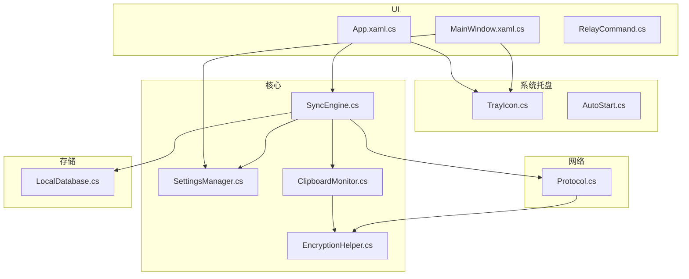
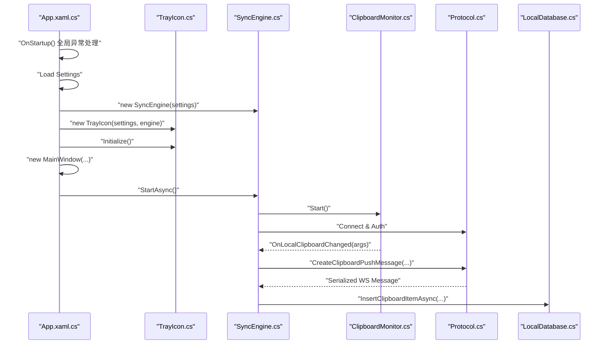
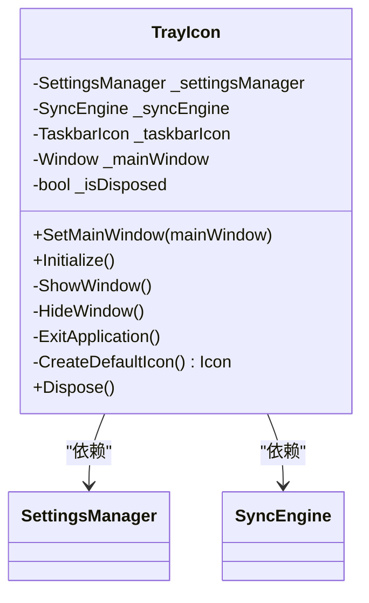
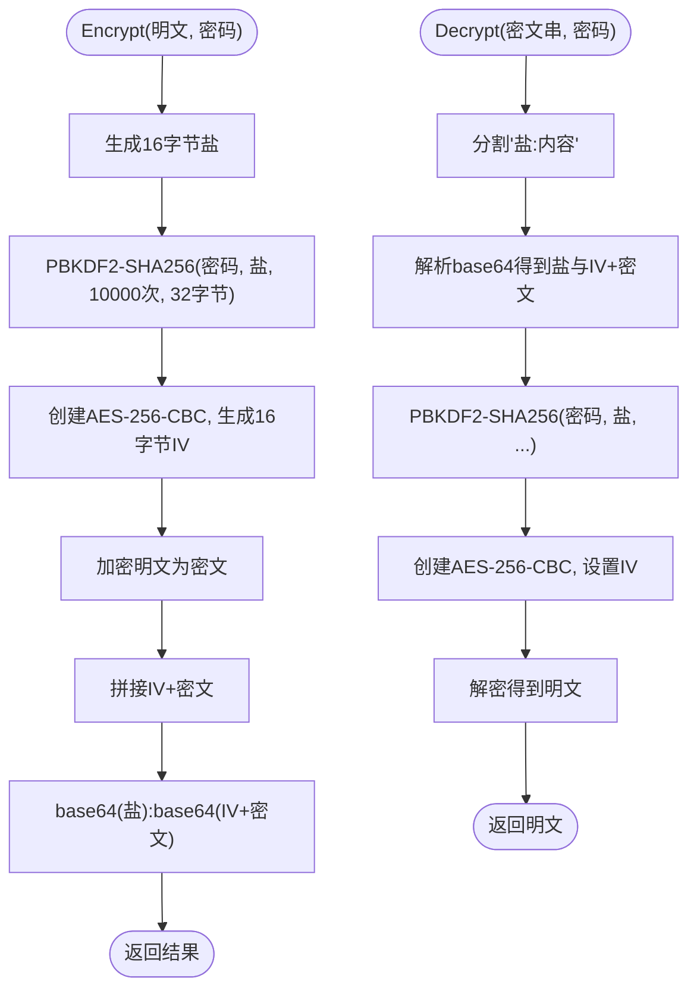
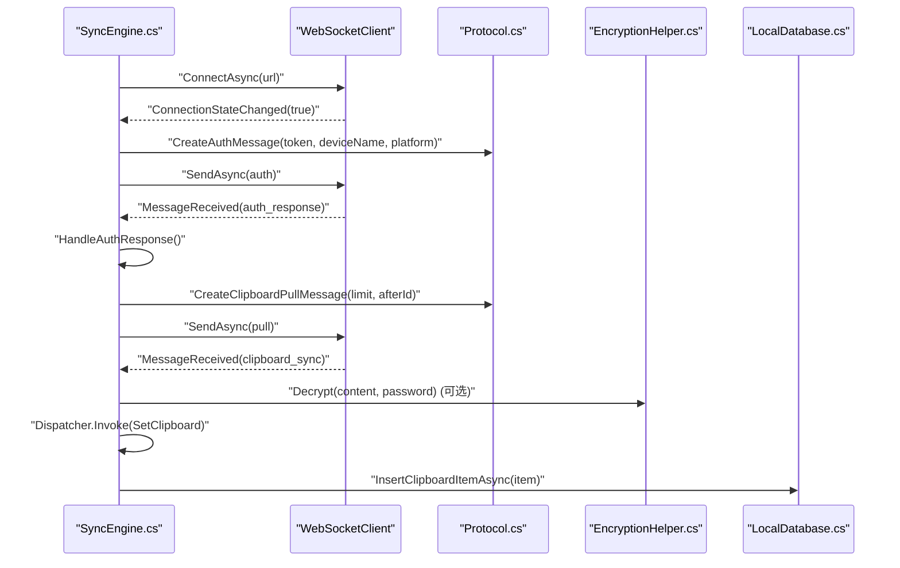
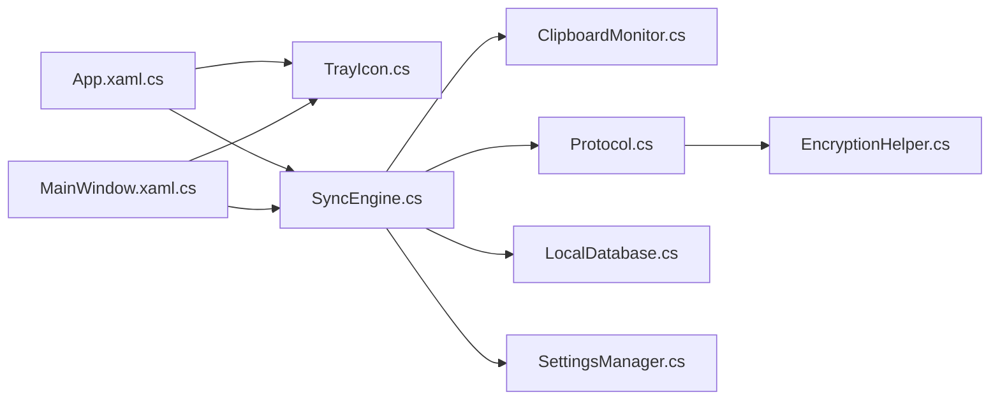

# 系统集成功能

<cite>
**本文引用的文件**
- [TrayIcon.cs](file://clipSync-windows/ClipSync.WPF/SystemTray/TrayIcon.cs)
- [AutoStart.cs](file://clipSync-windows/ClipSync.WPF/SystemTray/AutoStart.cs)
- [EncryptionHelper.cs](file://clipSync-windows/ClipSync.WPF/Core/EncryptionHelper.cs)
- [App.xaml.cs](file://clipSync-windows/ClipSync.WPF/App.xaml.cs)
- [MainWindow.xaml.cs](file://clipSync-windows/ClipSync.WPF/MainWindow.xaml.cs)
- [SettingsManager.cs](file://clipSync-windows/ClipSync.WPF/Core/SettingsManager.cs)
- [SyncEngine.cs](file://clipSync-windows/ClipSync.WPF/Core/SyncEngine.cs)
- [ClipboardMonitor.cs](file://clipSync-windows/ClipSync.WPF/Core/ClipboardMonitor.cs)
- [LocalDatabase.cs](file://clipSync-windows/ClipSync.WPF/Storage/LocalDatabase.cs)
- [Protocol.cs](file://clipSync-windows/ClipSync.WPF/Network/Protocol.cs)
- [RelayCommand.cs](file://clipSync-windows/ClipSync.WPF/RelayCommand.cs)
- [InstallationLog.txt](file://InstallationLog.txt)
</cite>

## 目录
1. [简介](#简介)
2. [项目结构](#项目结构)
3. [核心组件](#核心组件)
4. [架构总览](#架构总览)
5. [详细组件分析](#详细组件分析)
6. [依赖关系分析](#依赖关系分析)
7. [性能考量](#性能考量)
8. [故障排查指南](#故障排查指南)
9. [结论](#结论)
10. [附录](#附录)

## 简介
本文件面向Windows客户端的系统集成功能，围绕系统托盘集成、开机自启动、系统通知与文件关联展开，重点解释托盘图标管理（托盘图标、右键菜单、双击行为）、开机自启动（注册表项维护）、加密与密钥管理（AES-256-CBC、PBKDF2派生、校验和）、系统事件与进程间通信（WPF应用生命周期、剪贴板监控、WebSocket消息处理）、以及安全与兼容性（STA线程、异常处理、最小化到托盘）。文档同时提供面向初学者的易懂说明与面向开发者的深度技术细节。

## 项目结构
Windows客户端位于 clipSync-windows/ClipSync.WPF，采用WPF桌面应用框架，按功能域分层组织：
- SystemTray：系统托盘与开机自启动
- Core：核心业务逻辑（设置、同步引擎、剪贴板监控、加密）
- Network：网络协议与连接（WebSocket、HTTP、心跳、重连）
- Storage：本地SQLite数据库
- UI：视图与视图模型
- 根目录：应用入口与命令绑定



图表来源
- [TrayIcon.cs:1-109](file://clipSync-windows/ClipSync.WPF/SystemTray/TrayIcon.cs#L1-L109)
- [AutoStart.cs:1-33](file://clipSync-windows/ClipSync.WPF/SystemTray/AutoStart.cs#L1-L33)
- [SettingsManager.cs:1-102](file://clipSync-windows/ClipSync.WPF/Core/SettingsManager.cs#L1-L102)
- [SyncEngine.cs:1-422](file://clipSync-windows/ClipSync.WPF/Core/SyncEngine.cs#L1-L422)
- [ClipboardMonitor.cs:1-174](file://clipSync-windows/ClipSync.WPF/Core/ClipboardMonitor.cs#L1-L174)
- [EncryptionHelper.cs:1-134](file://clipSync-windows/ClipSync.WPF/Core/EncryptionHelper.cs#L1-L134)
- [Protocol.cs:1-167](file://clipSync-windows/ClipSync.WPF/Network/Protocol.cs#L1-L167)
- [LocalDatabase.cs:1-169](file://clipSync-windows/ClipSync.WPF/Storage/LocalDatabase.cs#L1-L169)
- [App.xaml.cs:1-66](file://clipSync-windows/ClipSync.WPF/App.xaml.cs#L1-L66)
- [MainWindow.xaml.cs:1-291](file://clipSync-windows/ClipSync.WPF/MainWindow.xaml.cs#L1-L291)
- [RelayCommand.cs:1-56](file://clipSync-windows/ClipSync.WPF/RelayCommand.cs#L1-L56)

章节来源
- [App.xaml.cs:1-66](file://clipSync-windows/ClipSync.WPF/App.xaml.cs#L1-L66)
- [MainWindow.xaml.cs:1-291](file://clipSync-windows/ClipSync.WPF/MainWindow.xaml.cs#L1-L291)

## 核心组件
- 系统托盘集成：通过托盘图标实现最小化到托盘、右键菜单控制（显示/隐藏/退出）、双击恢复窗口；支持动态图标与工具提示。
- 开机自启动：通过当前用户的注册表 Run 项实现启用/禁用；检测当前是否已启用。
- 加密与密钥管理：统一的AES-256-CBC格式（盐+IV+密文），PBKDF2-SHA256派生密钥，SHA-256校验和；支持加密/解密与校验和计算。
- 设置持久化：JSON文件存储在 %APPDATA%\ClipSync，线程安全更新与保存。
- 同步引擎：负责WebSocket连接、认证、心跳、重连、剪贴板推送/拉取、设备列表查询、错误上报与本地历史记录。
- 剪贴板监控：后台线程（STA）轮询剪贴板变化，生成校验和避免重复推送。
- 本地数据库：SQLite存储剪贴板历史，限制保留最近50条。

章节来源
- [TrayIcon.cs:1-109](file://clipSync-windows/ClipSync.WPF/SystemTray/TrayIcon.cs#L1-L109)
- [AutoStart.cs:1-33](file://clipSync-windows/ClipSync.WPF/SystemTray/AutoStart.cs#L1-L33)
- [EncryptionHelper.cs:1-134](file://clipSync-windows/ClipSync.WPF/Core/EncryptionHelper.cs#L1-L134)
- [SettingsManager.cs:1-102](file://clipSync-windows/ClipSync.WPF/Core/SettingsManager.cs#L1-L102)
- [SyncEngine.cs:1-422](file://clipSync-windows/ClipSync.WPF/Core/SyncEngine.cs#L1-L422)
- [ClipboardMonitor.cs:1-174](file://clipSync-windows/ClipSync.WPF/Core/ClipboardMonitor.cs#L1-L174)
- [LocalDatabase.cs:1-169](file://clipSync-windows/ClipSync.WPF/Storage/LocalDatabase.cs#L1-L169)

## 架构总览
应用启动时初始化全局异常处理、加载设置、创建同步引擎与托盘图标，随后显示主窗口并根据设置决定是否最小化到托盘。同步引擎负责与服务端建立WebSocket连接、认证、心跳与重连，同时监控本地剪贴板并通过协议层进行推送或接收处理。所有UI交互通过Dispatcher在UI线程执行，确保STA要求。



图表来源
- [App.xaml.cs:12-52](file://clipSync-windows/ClipSync.WPF/App.xaml.cs#L12-L52)
- [TrayIcon.cs:28-57](file://clipSync-windows/ClipSync.WPF/SystemTray/TrayIcon.cs#L28-L57)
- [SyncEngine.cs:32-57](file://clipSync-windows/ClipSync.WPF/Core/SyncEngine.cs#L32-L57)
- [ClipboardMonitor.cs:39-51](file://clipSync-windows/ClipSync.WPF/Core/ClipboardMonitor.cs#L39-L51)
- [Protocol.cs:99-141](file://clipSync-windows/ClipSync.WPF/Network/Protocol.cs#L99-L141)
- [LocalDatabase.cs:60-96](file://clipSync-windows/ClipSync.WPF/Storage/LocalDatabase.cs#L60-L96)

## 详细组件分析

### 托盘图标与系统托盘集成（TrayIcon）
- 初始化：创建托盘图标、设置默认图标与工具提示、右键菜单激活模式。
- 菜单项：显示/隐藏主窗口、退出应用；双击恢复窗口。
- 生命周期：退出时停止同步引擎并释放托盘资源；最小化到托盘由主窗口控制。
- 图标生成：运行时绘制16x16位图作为托盘图标句柄。



图表来源
- [TrayIcon.cs:9-107](file://clipSync-windows/ClipSync.WPF/SystemTray/TrayIcon.cs#L9-L107)
- [SettingsManager.cs:44-100](file://clipSync-windows/ClipSync.WPF/Core/SettingsManager.cs#L44-L100)
- [SyncEngine.cs:8-31](file://clipSync-windows/ClipSync.WPF/Core/SyncEngine.cs#L8-L31)

章节来源
- [TrayIcon.cs:1-109](file://clipSync-windows/ClipSync.WPF/SystemTray/TrayIcon.cs#L1-L109)
- [MainWindow.xaml.cs:21-48](file://clipSync-windows/ClipSync.WPF/MainWindow.xaml.cs#L21-L48)

### 开机自启动（AutoStart）
- 注册表路径：当前用户 Run 键值，应用名为 ClipSync。
- 操作：
  - 启用：写入可执行文件路径（带引号）。
  - 禁用：删除键值。
  - 检测：读取键值是否存在。
- 权限：仅操作当前用户注册表项，无需管理员权限。

```mermaid
flowchart TD
Start(["调用 Enable()/Disable()/IsEnabled()"]) --> Decide{"操作类型？"}
Decide --> |Enable| GetExe["获取当前进程可执行路径"]
GetExe --> RegOpen["打开 HKCU\\...\\CurrentVersion\\Run (写)"]
RegOpen --> WriteVal["SetValue('ClipSync', '\"{exePath}\"')"]
WriteVal --> End(["完成"])
Decide --> |Disable| RegOpen2["打开 HKCU\\...\\CurrentVersion\\Run (写)"]
RegOpen2 --> DelVal["DeleteValue('ClipSync')"]
DelVal --> End
Decide --> |IsEnabled| RegOpen3["打开 HKCU\\...\\CurrentVersion\\Run (读)"]
RegOpen3 --> ReadVal["GetValue('ClipSync')"]
ReadVal --> Check{"值存在？"}
Check --> |是| ReturnTrue["返回 true"]
Check --> |否| ReturnFalse["返回 false"]
ReturnTrue --> End
ReturnFalse --> End
```

图表来源
- [AutoStart.cs:5-31](file://clipSync-windows/ClipSync.WPF/SystemTray/AutoStart.cs#L5-L31)

章节来源
- [AutoStart.cs:1-33](file://clipSync-windows/ClipSync.WPF/SystemTray/AutoStart.cs#L1-L33)
- [MainWindow.xaml.cs:260-267](file://clipSync-windows/ClipSync.WPF/MainWindow.xaml.cs#L260-L267)

### 加密与密钥管理（EncryptionHelper）
- 统一格式：base64(salt):base64(IV + ciphertext)
- 算法与参数：
  - 对称加密：AES-256-CBC
  - 随机盐：16字节
  - IV：16字节随机
  - 迭代次数：10000
  - 密钥长度：32字节
  - 填充：PKCS7
- 功能：
  - Encrypt：生成盐与IV，派生密钥，加密后拼接IV与密文，返回统一字符串。
  - Decrypt：解析统一字符串，派生密钥，解密并返回明文。
  - ComputeChecksum：对字符串或字节数组计算SHA-256并转小写十六进制。
- 安全要点：
  - 异常即失败，不回退为明文。
  - 与协议层配合，发送前加密，接收后解密。



图表来源
- [EncryptionHelper.cs:18-131](file://clipSync-windows/ClipSync.WPF/Core/EncryptionHelper.cs#L18-L131)
- [Protocol.cs:109-124](file://clipSync-windows/ClipSync.WPF/Network/Protocol.cs#L109-L124)

章节来源
- [EncryptionHelper.cs:1-134](file://clipSync-windows/ClipSync.WPF/Core/EncryptionHelper.cs#L1-L134)
- [Protocol.cs:99-141](file://clipSync-windows/ClipSync.WPF/Network/Protocol.cs#L99-L141)

### 设置与持久化（SettingsManager）
- 存储位置：%APPDATA%\ClipSync\settings.json
- 数据模型：包含服务器地址、用户名、令牌、设备名、自动启动、同步开关、加密开关与密码、最小化到托盘等字段。
- 并发：使用锁保证多线程读写一致性。
- 方法：LoadAsync/SaveAsync/Update。

章节来源
- [SettingsManager.cs:1-102](file://clipSync-windows/ClipSync.WPF/Core/SettingsManager.cs#L1-L102)
- [MainWindow.xaml.cs:246-270](file://clipSync-windows/ClipSync.WPF/MainWindow.xaml.cs#L246-L270)

### 同步引擎（SyncEngine）
- 职责：连接WebSocket、认证、心跳、重连、本地剪贴板监控、消息分发、错误上报、本地历史记录。
- 生命周期：StartAsync/StopAsync/Dispose。
- 事件：连接状态、剪贴板接收、错误、设备列表更新。
- 登录/注册：通过HTTP客户端获取令牌并发起认证。
- 推送/拉取：基于协议层构造消息，必要时触发加密。



图表来源
- [SyncEngine.cs:73-93](file://clipSync-windows/ClipSync.WPF/Core/SyncEngine.cs#L73-L93)
- [SyncEngine.cs:127-163](file://clipSync-windows/ClipSync.WPF/Core/SyncEngine.cs#L127-L163)
- [SyncEngine.cs:188-267](file://clipSync-windows/ClipSync.WPF/Core/SyncEngine.cs#L188-L267)
- [Protocol.cs:79-164](file://clipSync-windows/ClipSync.WPF/Network/Protocol.cs#L79-L164)
- [EncryptionHelper.cs:62-103](file://clipSync-windows/ClipSync.WPF/Core/EncryptionHelper.cs#L62-L103)
- [LocalDatabase.cs:60-96](file://clipSync-windows/ClipSync.WPF/Storage/LocalDatabase.cs#L60-L96)

章节来源
- [SyncEngine.cs:1-422](file://clipSync-windows/ClipSync.WPF/Core/SyncEngine.cs#L1-L422)

### 剪贴板监控（ClipboardMonitor）
- 线程：后台线程，STA公寓状态，避免COM线程模型冲突。
- 逻辑：轮询检查文本/图像格式可用性，读取内容并计算SHA-256校验和，去重后回调上层。
- 异常：捕获短暂锁定导致的COM异常并重试。

章节来源
- [ClipboardMonitor.cs:1-174](file://clipSync-windows/ClipSync.WPF/Core/ClipboardMonitor.cs#L1-L174)

### 本地数据库（LocalDatabase）
- 表结构：clipboard_history（含内容类型、格式、大小、校验和、来源设备、时间戳）。
- 索引：按时间倒序索引，优化查询。
- 限制：最多保留最近50条，超出则删除最早条目。
- 方法：InitializeAsync/InsertClipboardItemAsync/GetClipboardHistoryAsync/ClearHistoryAsync。

章节来源
- [LocalDatabase.cs:1-169](file://clipSync-windows/ClipSync.WPF/Storage/LocalDatabase.cs#L1-L169)

### 应用入口与UI（App.xaml.cs / MainWindow.xaml.cs / RelayCommand）
- App.xaml.cs：全局未处理异常捕获；启动时加载设置、创建引擎与托盘、显示主窗口；退出时停止引擎与释放托盘。
- MainWindow.xaml.cs：承载登录/历史/设备/设置页面，订阅同步引擎事件，响应设置变更（如自动启动）。
- RelayCommand：轻量命令绑定，支持CanExecute与CommandManager。

章节来源
- [App.xaml.cs:12-63](file://clipSync-windows/ClipSync.WPF/App.xaml.cs#L12-L63)
- [MainWindow.xaml.cs:1-291](file://clipSync-windows/ClipSync.WPF/MainWindow.xaml.cs#L1-L291)
- [RelayCommand.cs:1-56](file://clipSync-windows/ClipSync.WPF/RelayCommand.cs#L1-L56)

## 依赖关系分析
- 组件耦合：
  - App.xaml.cs 依赖 TrayIcon 与 SyncEngine。
  - MainWindow.xaml.cs 依赖 SettingsManager、SyncEngine、TrayIcon。
  - SyncEngine 依赖 ClipboardMonitor、Protocol、LocalDatabase、SettingsManager。
  - Protocol 依赖 EncryptionHelper。
- 外部依赖：
  - 系统托盘：Hardcodet.Wpf.TaskbarNotification（从TrayIcon.cs命名空间可见）。
  - SQLite：Microsoft.Data.Sqlite。
  - JSON序列化：Newtonsoft.Json。
- 可能的循环依赖：未发现直接循环；各模块职责清晰，通过事件与接口解耦。



图表来源
- [App.xaml.cs:1-66](file://clipSync-windows/ClipSync.WPF/App.xaml.cs#L1-L66)
- [MainWindow.xaml.cs:1-291](file://clipSync-windows/ClipSync.WPF/MainWindow.xaml.cs#L1-L291)
- [SyncEngine.cs:1-422](file://clipSync-windows/ClipSync.WPF/Core/SyncEngine.cs#L1-L422)
- [ClipboardMonitor.cs:1-174](file://clipSync-windows/ClipSync.WPF/Core/ClipboardMonitor.cs#L1-L174)
- [Protocol.cs:1-167](file://clipSync-windows/ClipSync.WPF/Network/Protocol.cs#L1-L167)
- [LocalDatabase.cs:1-169](file://clipSync-windows/ClipSync.WPF/Storage/LocalDatabase.cs#L1-L169)
- [SettingsManager.cs:1-102](file://clipSync-windows/ClipSync.WPF/Core/SettingsManager.cs#L1-L102)
- [EncryptionHelper.cs:1-134](file://clipSync-windows/ClipSync.WPF/Core/EncryptionHelper.cs#L1-L134)

## 性能考量
- 剪贴板轮询：每500ms检查一次，若无可用格式立即跳过，降低CPU占用。
- 加密开销：PBKDF2迭代10000次，兼顾安全性与性能；建议在UI线程外执行加密/解密以避免阻塞。
- 数据库写入：批量插入后限制保留数量，避免无限增长；查询使用索引按时间倒序。
- 网络重连：断线后调度重连，避免频繁重试造成抖动。
- UI线程：所有剪贴板写入与状态更新通过Dispatcher在UI线程执行，确保STA要求。

## 故障排查指南
- 托盘图标不显示或菜单无效
  - 检查 TaskbarIcon 初始化与右键菜单构建是否成功。
  - 确认图标资源与工具提示设置正确。
- 无法开机自启动
  - 确认当前用户注册表写入成功；检查路径是否包含空格并正确加引号。
  - 使用 IsEnabled 检查当前状态。
- 登录/认证失败
  - 查看同步引擎错误事件输出；确认服务器URL与令牌有效。
- 剪贴板不同步
  - 检查剪贴板监控线程是否运行且STA公寓状态；查看校验和去重逻辑。
- 解密失败
  - 确认加密开关与密码一致；检查统一格式是否符合“盐:内容”。
- 数据库异常
  - 确认SQLite连接字符串与表初始化；检查索引创建与清理逻辑。

章节来源
- [TrayIcon.cs:28-57](file://clipSync-windows/ClipSync.WPF/SystemTray/TrayIcon.cs#L28-L57)
- [AutoStart.cs:10-30](file://clipSync-windows/ClipSync.WPF/SystemTray/AutoStart.cs#L10-L30)
- [SyncEngine.cs:165-186](file://clipSync-windows/ClipSync.WPF/Core/SyncEngine.cs#L165-L186)
- [ClipboardMonitor.cs:58-87](file://clipSync-windows/ClipSync.WPF/Core/ClipboardMonitor.cs#L58-L87)
- [EncryptionHelper.cs:62-103](file://clipSync-windows/ClipSync.WPF/Core/EncryptionHelper.cs#L62-L103)
- [LocalDatabase.cs:26-58](file://clipSync-windows/ClipSync.WPF/Storage/LocalDatabase.cs#L26-L58)

## 结论
该Windows客户端通过系统托盘实现便捷的后台运行与控制，结合注册表实现开机自启动；通过统一的AES-256-CBC与PBKDF2方案保障数据安全；以事件驱动的方式组织同步引擎、剪贴板监控与本地存储，形成稳定可靠的跨设备剪贴板同步能力。整体设计注重线程模型（STA）、异常处理与用户体验（最小化到托盘、状态指示），适合在企业与个人环境中部署使用。

## 附录
- 安装与卸载
  - 当前仓库未包含安装程序脚本或卸载逻辑。若需集成安装器，请参考以下思路：
    - 安装阶段：复制二进制到目标目录，创建 %APPDATA%\ClipSync 并写入初始设置；在 HKCU\Software\Microsoft\Windows\CurrentVersion\Run 写入启动项。
    - 卸载阶段：停止服务/进程，删除启动项，保留用户数据（可选）；或提供清理选项删除 %APPDATA%\ClipSync。
  - 参考日志：仓库中包含一个安装器相关日志文件，可用于定位安装过程中的冲突或目录占用问题。

章节来源
- [InstallationLog.txt:1-8](file://InstallationLog.txt#L1-L8)