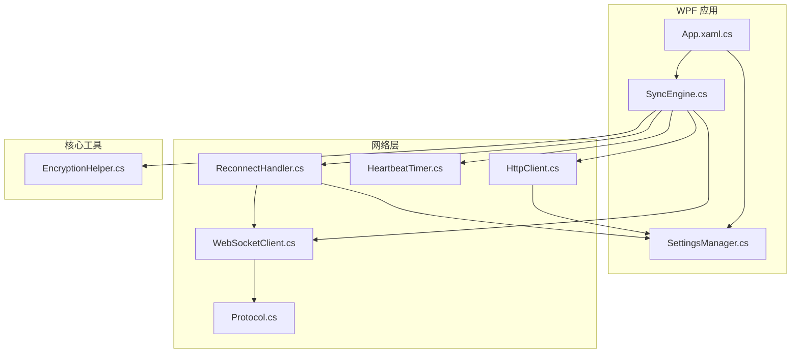
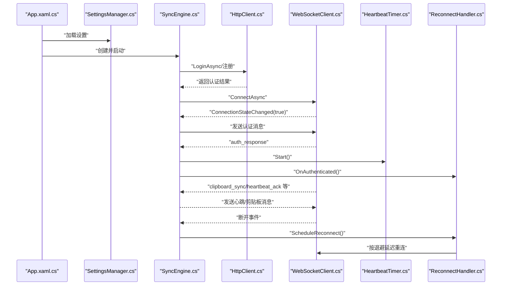
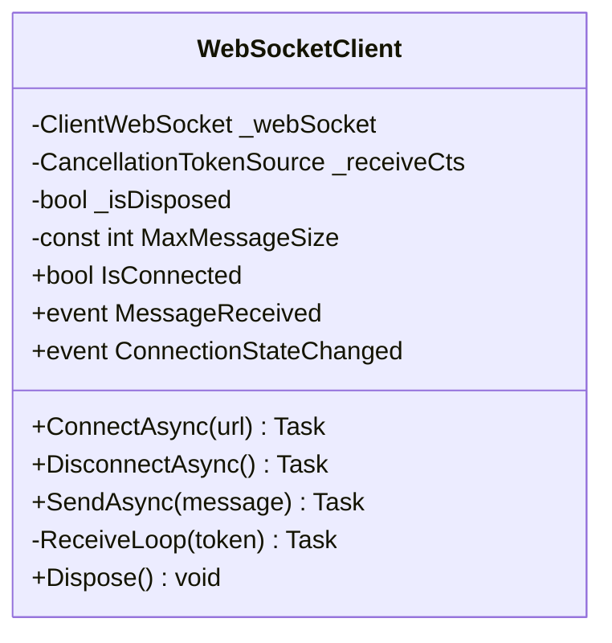
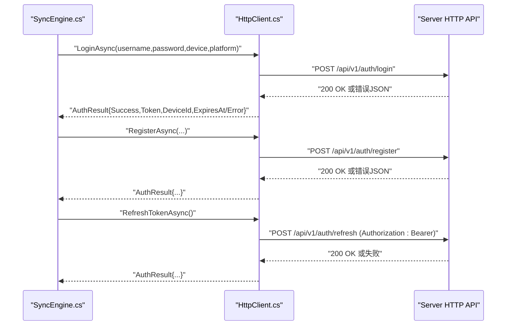
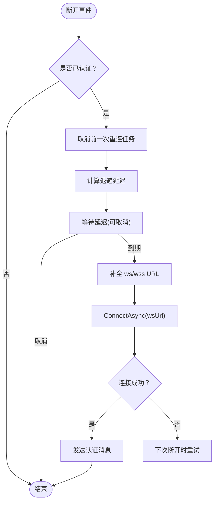
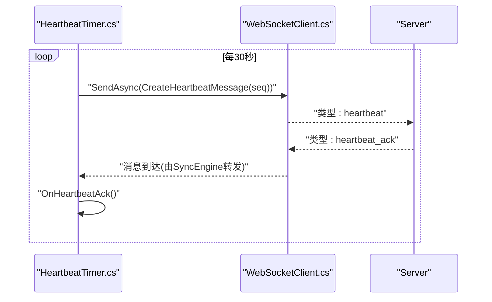
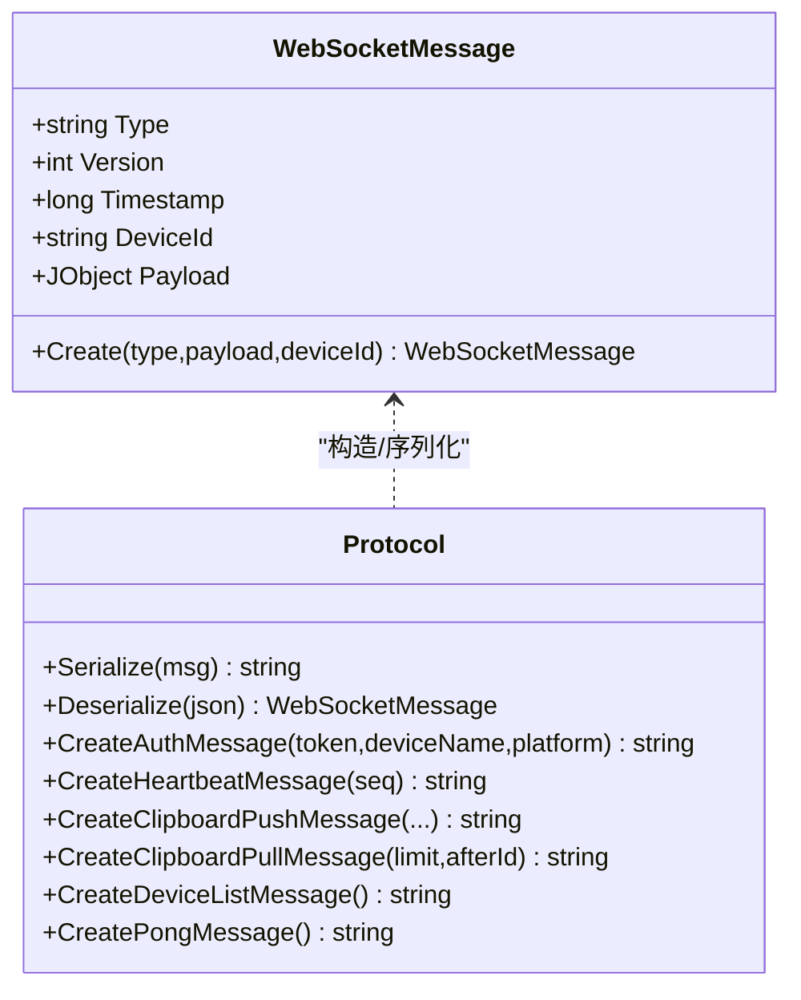
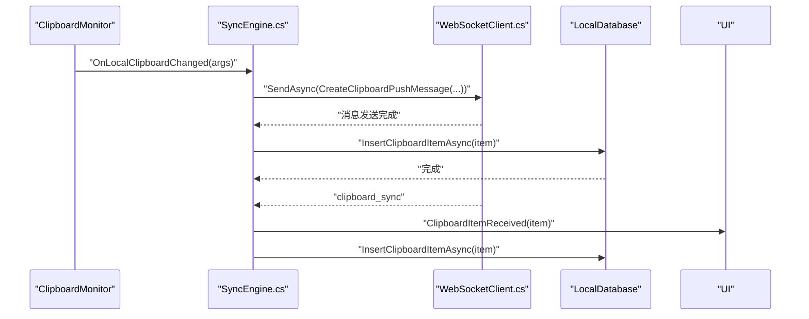
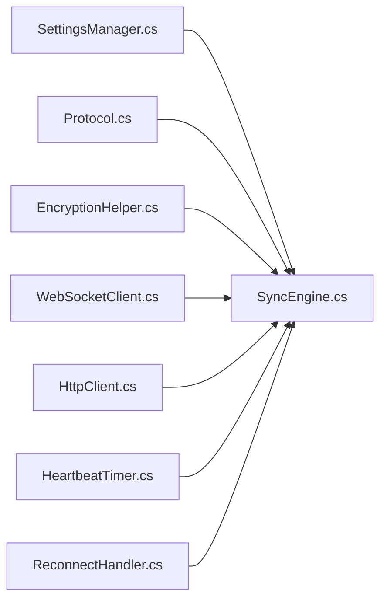

# 网络通信模块

<cite>
**本文引用的文件**
- [WebSocketClient.cs](file://clipSync-windows/ClipSync.WPF/Network/WebSocketClient.cs)
- [HttpClient.cs](file://clipSync-windows/ClipSync.WPF/Network/HttpClient.cs)
- [ReconnectHandler.cs](file://clipSync-windows/ClipSync.WPF/Network/ReconnectHandler.cs)
- [HeartbeatTimer.cs](file://clipSync-windows/ClipSync.WPF/Network/HeartbeatTimer.cs)
- [Protocol.cs](file://clipSync-windows/ClipSync.WPF/Network/Protocol.cs)
- [SyncEngine.cs](file://clipSync-windows/ClipSync.WPF/Core/SyncEngine.cs)
- [SettingsManager.cs](file://clipSync-windows/ClipSync.WPF/Core/SettingsManager.cs)
- [EncryptionHelper.cs](file://clipSync-windows/ClipSync.WPF/Core/EncryptionHelper.cs)
- [App.xaml.cs](file://clipSync-windows/ClipSync.WPF/App.xaml.cs)
</cite>

## 目录
1. [简介](#简介)
2. [项目结构](#项目结构)
3. [核心组件](#核心组件)
4. [架构总览](#架构总览)
5. [详细组件分析](#详细组件分析)
6. [依赖关系分析](#依赖关系分析)
7. [性能考虑](#性能考虑)
8. [故障排查指南](#故障排查指南)
9. [结论](#结论)
10. [附录](#附录)

## 简介
本文件面向Windows客户端的网络通信模块，系统性阐述WebSocket连接管理、HTTP API调用、自动重连机制与心跳检测的实现细节。文档从代码级视角解析：
- WebSocketClient 的连接建立、消息序列化、错误处理与连接状态管理
- HTTP 客户端的请求构建、响应解析、认证处理与超时管理
- 重连策略、退避算法与网络异常处理
- 心跳机制的实现原理、保活策略与网络质量检测
- SSL/TLS 配置、代理支持与防火墙兼容性现状与建议

本文件兼顾初学者可读性与资深开发者的技术深度，所有技术要点均以仓库中实际代码为依据。

## 项目结构
Windows 客户端网络通信模块位于 WPF 工程的 Network 命名空间下，核心类包括：
- WebSocketClient：WebSocket 连接与消息收发
- HttpClient：HTTP 认证与注册登录
- ReconnectHandler：断线重连与退避策略
- HeartbeatTimer：心跳保活定时器
- Protocol：消息模型与序列化工具
- SyncEngine：业务编排与事件分发
- SettingsManager：应用设置与持久化
- EncryptionHelper：加密与校验工具

图表来源
- [App.xaml.cs:12-52](file://clipSync-windows/ClipSync.WPF/App.xaml.cs#L12-L52)
- [SyncEngine.cs:27-57](file://clipSync-windows/ClipSync.WPF/Core/SyncEngine.cs#L27-L57)
- [WebSocketClient.cs:10-146](file://clipSync-windows/ClipSync.WPF/Network/WebSocketClient.cs#L10-L146)
- [HttpClient.cs:20-180](file://clipSync-windows/ClipSync.WPF/Network/HttpClient.cs#L20-L180)
- [HeartbeatTimer.cs:7-52](file://clipSync-windows/ClipSync.WPF/Network/HeartbeatTimer.cs#L7-L52)
- [ReconnectHandler.cs:8-97](file://clipSync-windows/ClipSync.WPF/Network/ReconnectHandler.cs#L8-L97)
- [Protocol.cs:60-167](file://clipSync-windows/ClipSync.WPF/Network/Protocol.cs#L60-L167)
- [SettingsManager.cs:44-102](file://clipSync-windows/ClipSync.WPF/Core/SettingsManager.cs#L44-L102)
- [EncryptionHelper.cs:18-134](file://clipSync-windows/ClipSync.WPF/Core/EncryptionHelper.cs#L18-L134)

章节来源
- [App.xaml.cs:12-52](file://clipSync-windows/ClipSync.WPF/App.xaml.cs#L12-L52)
- [SyncEngine.cs:27-57](file://clipSync-windows/ClipSync.WPF/Core/SyncEngine.cs#L27-L57)

## 核心组件
- WebSocketClient：负责与服务器建立/关闭 WebSocket 连接、发送文本消息、接收消息流并触发事件；内置最大消息大小限制与异常捕获。
- HttpClient：封装登录、注册与令牌刷新的 HTTP 请求，统一处理响应解析与错误返回。
- ReconnectHandler：在认证成功后启用重连策略，使用指数退避算法计算延迟，避免频繁重试导致资源浪费。
- HeartbeatTimer：周期性向服务器发送心跳消息，维持连接活跃度；收到心跳确认后可作为网络质量参考。
- Protocol：定义 WebSocket 消息结构与序列化/反序列化方法，提供多种消息类型的构造函数（认证、心跳、剪贴板推送/拉取、设备列表等）。
- SyncEngine：协调各组件生命周期，处理认证结果、剪贴板同步、设备列表更新与错误上报；在连接断开时触发重连。
- SettingsManager：集中管理服务器地址、HTTP 地址、设备信息、认证令牌、加密开关与密码等配置项。
- EncryptionHelper：提供基于 PBKDF2 的密钥派生与 AES-CBC 加解密，确保剪贴板内容传输安全。

章节来源
- [WebSocketClient.cs:10-146](file://clipSync-windows/ClipSync.WPF/Network/WebSocketClient.cs#L10-L146)
- [HttpClient.cs:20-180](file://clipSync-windows/ClipSync.WPF/Network/HttpClient.cs#L20-L180)
- [ReconnectHandler.cs:8-97](file://clipSync-windows/ClipSync.WPF/Network/ReconnectHandler.cs#L8-L97)
- [HeartbeatTimer.cs:7-52](file://clipSync-windows/ClipSync.WPF/Network/HeartbeatTimer.cs#L7-L52)
- [Protocol.cs:60-167](file://clipSync-windows/ClipSync.WPF/Network/Protocol.cs#L60-L167)
- [SyncEngine.cs:8-422](file://clipSync-windows/ClipSync.WPF/Core/SyncEngine.cs#L8-L422)
- [SettingsManager.cs:44-102](file://clipSync-windows/ClipSync.WPF/Core/SettingsManager.cs#L44-L102)
- [EncryptionHelper.cs:18-134](file://clipSync-windows/ClipSync.WPF/Core/EncryptionHelper.cs#L18-L134)

## 架构总览
下图展示了应用启动到网络通信的关键交互流程，包括登录认证、WebSocket 连接、心跳保活与断线重连。

图表来源
- [App.xaml.cs:35-51](file://clipSync-windows/ClipSync.WPF/App.xaml.cs#L35-L51)
- [SyncEngine.cs:32-93](file://clipSync-windows/ClipSync.WPF/Core/SyncEngine.cs#L32-L93)
- [HttpClient.cs:32-82](file://clipSync-windows/ClipSync.WPF/Network/HttpClient.cs#L32-L82)
- [WebSocketClient.cs:22-39](file://clipSync-windows/ClipSync.WPF/Network/WebSocketClient.cs#L22-L39)
- [HeartbeatTimer.cs:21-28](file://clipSync-windows/ClipSync.WPF/Network/HeartbeatTimer.cs#L21-L28)
- [ReconnectHandler.cs:27-71](file://clipSync-windows/ClipSync.WPF/Network/ReconnectHandler.cs#L27-L71)

## 详细组件分析

### WebSocketClient 组件分析
WebSocketClient 负责与服务器建立 WebSocket 连接、发送/接收消息、维护连接状态并触发事件回调。其关键特性包括：
- 连接建立：ConnectAsync 在断开旧连接后创建新的 ClientWebSocket，发起异步连接并启动接收循环。
- 断开与释放：DisconnectAsync 正常关闭连接并清理资源，Dispose 保证最终释放。
- 发送消息：SendAsync 将字符串编码为 UTF-8 字节并发送文本帧，异常时视为连接可能已断开。
- 接收循环：ReceiveLoop 分块接收数据，拼接完整消息，防止超大消息占用内存；遇到关闭帧或异常时触发断开事件。
- 错误处理：捕获 OperationCanceledException（预期断开）与其他异常；finally 中统一触发断开事件。
- 最大消息大小：限制单条消息不超过 10MB，超过则丢弃并记录调试信息。

图表来源
- [WebSocketClient.cs:10-146](file://clipSync-windows/ClipSync.WPF/Network/WebSocketClient.cs#L10-L146)

章节来源
- [WebSocketClient.cs:17-136](file://clipSync-windows/ClipSync.WPF/Network/WebSocketClient.cs#L17-L136)

### HTTP 客户端组件分析
HTTP 客户端封装了登录、注册与令牌刷新三个核心 API，统一处理请求构建、响应解析与异常返回：
- 登录与注册：LoginAsync/ RegisterAsync 构造 JSON 请求体，POST 到 /api/v1/auth/login 或 /api/v1/auth/register，解析响应中的 token、device_id、expires_at 或错误信息。
- 令牌刷新：RefreshTokenAsync 使用 Bearer 头发起刷新请求，解析新 token 与过期时间。
- 超时控制：HttpClient 默认超时时间为 15 秒。
- 错误处理：捕获异常并返回包含错误信息的 AuthResult，便于上层 UI 展示。

图表来源
- [HttpClient.cs:32-82](file://clipSync-windows/ClipSync.WPF/Network/HttpClient.cs#L32-L82)
- [HttpClient.cs:84-134](file://clipSync-windows/ClipSync.WPF/Network/HttpClient.cs#L84-L134)
- [HttpClient.cs:136-177](file://clipSync-windows/ClipSync.WPF/Network/HttpClient.cs#L136-L177)

章节来源
- [HttpClient.cs:20-180](file://clipSync-windows/ClipSync.WPF/Network/HttpClient.cs#L20-L180)

### 自动重连与退避策略
ReconnectHandler 在认证成功后启用重连逻辑，采用指数退避算法：
- 触发条件：当 WebSocket 断开且已认证时，ScheduleReconnect 会计算延迟并异步重连。
- 退避参数：最小延迟 1 秒，最大延迟 60 秒，倍数为 2.0；每次尝试递增指数。
- 重连流程：取消之前的重连任务，计算延迟后等待；若未被取消，则连接 WebSocket 并发送认证消息。
- 停止与注销：Stop 取消当前重连任务并解除连接状态事件订阅。

图表来源
- [ReconnectHandler.cs:33-71](file://clipSync-windows/ClipSync.WPF/Network/ReconnectHandler.cs#L33-L71)
- [ReconnectHandler.cs:89-94](file://clipSync-windows/ClipSync.WPF/Network/ReconnectHandler.cs#L89-L94)

章节来源
- [ReconnectHandler.cs:8-97](file://clipSync-windows/ClipSync.WPF/Network/ReconnectHandler.cs#L8-L97)

### 心跳机制与保活策略
HeartbeatTimer 通过定时器周期性发送心跳消息，维持连接活跃度：
- 启停控制：Start 创建定时器，Stop 释放资源；重复启动无效。
- 心跳间隔：固定 30 秒发送一次，序列号自增。
- 心跳确认：收到服务器 heartbeat_ack 时可作为网络质量参考（当前实现为空操作）。
- 发送条件：仅在 WebSocket 已连接时发送，避免无意义的发送。

图表来源
- [HeartbeatTimer.cs:21-49](file://clipSync-windows/ClipSync.WPF/Network/HeartbeatTimer.cs#L21-L49)
- [Protocol.cs:90-97](file://clipSync-windows/ClipSync.WPF/Network/Protocol.cs#L90-L97)

章节来源
- [HeartbeatTimer.cs:7-52](file://clipSync-windows/ClipSync.WPF/Network/HeartbeatTimer.cs#L7-L52)
- [Protocol.cs:60-167](file://clipSync-windows/ClipSync.WPF/Network/Protocol.cs#L60-L167)

### 协议与消息序列化
Protocol 提供统一的消息模型与序列化工具：
- WebSocketMessage：包含 type、version、timestamp、device_id、payload 等字段，提供 Create 工厂方法。
- 序列化/反序列化：Serialize/Deserialize 基于 JSON.NET，用于 WebSocket 文本帧的编解码。
- 消息类型构造：提供认证、心跳、剪贴板推送/拉取、设备列表、pong 等消息的构造函数。
- 加密处理：CreateClipboardPushMessage 支持可选加密，失败时不回退为明文，直接抛出异常。

图表来源
- [Protocol.cs:8-36](file://clipSync-windows/ClipSync.WPF/Network/Protocol.cs#L8-L36)
- [Protocol.cs:60-167](file://clipSync-windows/ClipSync.WPF/Network/Protocol.cs#L60-L167)

章节来源
- [Protocol.cs:60-167](file://clipSync-windows/ClipSync.WPF/Network/Protocol.cs#L60-L167)

### 应用编排与事件分发
SyncEngine 是网络通信模块的中枢，负责：
- 生命周期管理：StartAsync 初始化数据库、WebSocket、HTTP、心跳与重连组件；StopAsync 清理资源。
- 认证流程：根据本地令牌决定是否立即连接并发送认证消息。
- 消息处理：根据消息类型分发到相应处理器（认证响应、剪贴板同步、心跳确认、设备列表、错误等）。
- 业务动作：本地剪贴板变更时生成推送消息并保存历史；收到远端剪贴板时写入系统剪贴板并持久化。
- 错误处理：捕获异常并通过 ErrorOccurred 事件上报；连接断开时触发重连调度。

图表来源
- [SyncEngine.cs:95-125](file://clipSync-windows/ClipSync.WPF/Core/SyncEngine.cs#L95-L125)
- [SyncEngine.cs:127-163](file://clipSync-windows/ClipSync.WPF/Core/SyncEngine.cs#L127-L163)
- [SyncEngine.cs:188-267](file://clipSync-windows/ClipSync.WPF/Core/SyncEngine.cs#L188-L267)

章节来源
- [SyncEngine.cs:8-422](file://clipSync-windows/ClipSync.WPF/Core/SyncEngine.cs#L8-L422)

### 设置与加密工具
- SettingsManager：集中管理服务器地址、HTTP 地址、用户名、令牌、设备 ID、设备名称、自动启动、同步开关、加密开关与密码等；提供线程安全的加载/保存与更新接口。
- EncryptionHelper：提供 PBKDF2 密钥派生与 AES-CBC 加解密，格式为 base64(salt):base64(IV + ciphertext)，失败时抛出异常而非回退为明文，确保数据一致性与安全性。

章节来源
- [SettingsManager.cs:44-102](file://clipSync-windows/ClipSync.WPF/Core/SettingsManager.cs#L44-L102)
- [EncryptionHelper.cs:18-134](file://clipSync-windows/ClipSync.WPF/Core/EncryptionHelper.cs#L18-L134)

## 依赖关系分析
- 组件耦合：SyncEngine 依赖 WebSocketClient、HttpClient、HeartbeatTimer、ReconnectHandler、SettingsManager、EncryptionHelper；各组件职责清晰，耦合度适中。
- 事件驱动：WebSocketClient 通过事件向上层广播连接状态与消息；SyncEngine 作为事件汇聚点进行业务处理。
- 数据流：SettingsManager 提供配置，Protocol 提供消息模型，EncryptionHelper 提供加解密能力，SyncEngine 编排业务流程，WebSocketClient/HttpClient 承载网络通信。

图表来源
- [SyncEngine.cs:8-422](file://clipSync-windows/ClipSync.WPF/Core/SyncEngine.cs#L8-L422)
- [WebSocketClient.cs:10-146](file://clipSync-windows/ClipSync.WPF/Network/WebSocketClient.cs#L10-L146)
- [HttpClient.cs:20-180](file://clipSync-windows/ClipSync.WPF/Network/HttpClient.cs#L20-L180)
- [HeartbeatTimer.cs:7-52](file://clipSync-windows/ClipSync.WPF/Network/HeartbeatTimer.cs#L7-L52)
- [ReconnectHandler.cs:8-97](file://clipSync-windows/ClipSync.WPF/Network/ReconnectHandler.cs#L8-L97)
- [Protocol.cs:60-167](file://clipSync-windows/ClipSync.WPF/Network/Protocol.cs#L60-L167)
- [SettingsManager.cs:44-102](file://clipSync-windows/ClipSync.WPF/Core/SettingsManager.cs#L44-L102)
- [EncryptionHelper.cs:18-134](file://clipSync-windows/ClipSync.WPF/Core/EncryptionHelper.cs#L18-L134)

章节来源
- [SyncEngine.cs:8-422](file://clipSync-windows/ClipSync.WPF/Core/SyncEngine.cs#L8-L422)

## 性能考虑
- 消息大小限制：WebSocketClient 对单条消息长度上限为 10MB，避免内存膨胀与 OOM 风险。
- 异步 I/O：ConnectAsync、SendAsync、ReceiveLoop 均采用异步模式，避免阻塞 UI 线程。
- 退避重连：指数退避降低服务器压力，避免“惊群效应”。
- 心跳频率：30 秒心跳间隔平衡保活与带宽消耗。
- 加密成本：加密/解密在本地执行，建议在 UI 线程外进行异步处理，避免阻塞主线程。

[本节为通用性能讨论，不直接分析具体文件]

## 故障排查指南
- 连接失败
  - 检查服务器地址与协议（ws/wss），ReconnectHandler 会在连接失败后按退避策略重试。
  - 关注 WebSocketClient 的断开事件与异常日志，确认是否为网络中断或服务器不可达。
- 认证失败
  - 查看 HTTP 客户端返回的错误信息，确认用户名、密码与设备名称是否正确。
  - 若令牌过期，使用 RefreshTokenAsync 获取新令牌。
- 心跳异常
  - 若长时间未收到 heartbeat_ack，检查网络质量与服务器负载。
  - 确认 HeartbeatTimer 已启动且未被停止。
- 消息过大
  - 当出现消息被丢弃的日志时，检查上游内容大小与压缩策略。
- 加密失败
  - 加密失败不会回退为明文，需检查密码与格式；必要时重新生成密钥或更换密码。

章节来源
- [WebSocketClient.cs:110-116](file://clipSync-windows/ClipSync.WPF/Network/WebSocketClient.cs#L110-L116)
- [ReconnectHandler.cs:33-71](file://clipSync-windows/ClipSync.WPF/Network/ReconnectHandler.cs#L33-L71)
- [HttpClient.cs:74-82](file://clipSync-windows/ClipSync.WPF/Network/HttpClient.cs#L74-L82)
- [HeartbeatTimer.cs:21-28](file://clipSync-windows/ClipSync.WPF/Network/HeartbeatTimer.cs#L21-L28)

## 结论
Windows 客户端网络通信模块以 SyncEngine 为核心，结合 WebSocketClient、HttpClient、HeartbeatTimer、ReconnectHandler 与 Protocol，实现了稳定可靠的跨设备剪贴板同步。模块具备完善的错误处理、退避重连与心跳保活机制，同时通过 EncryptionHelper 提供端到端加密保障。对于初学者，建议从 App.xaml.cs 与 SyncEngine 开始理解整体流程；对于资深开发者，可在 Protocol、ReconnectHandler 与 HeartbeatTimer 上进一步优化与扩展。

[本节为总结性内容，不直接分析具体文件]

## 附录

### SSL/TLS、代理与防火墙兼容性现状与建议
- SSL/TLS：当前 WebSocketClient 使用 System.Net.WebSockets.ClientWebSocket，默认行为遵循系统安全策略。如需强制 wss 或自定义证书验证，可在创建 ClientWebSocket 后设置相关选项（当前代码未显式配置）。
- 代理支持：System.Net.Http.HttpClient 默认使用系统代理设置；如需自定义代理，可通过 HttpClientHandler 配置。当前 HTTP 客户端未显式设置代理。
- 防火墙兼容性：建议在企业网络环境中测试 ws/wss 端口可达性；如遇拦截，优先使用 wss 并确保服务器证书有效。

[本节为通用建议，不直接分析具体文件]