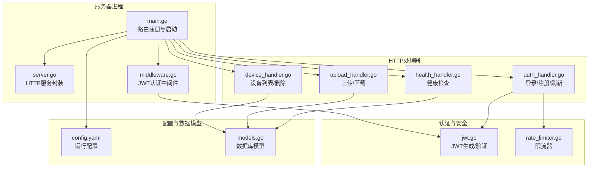
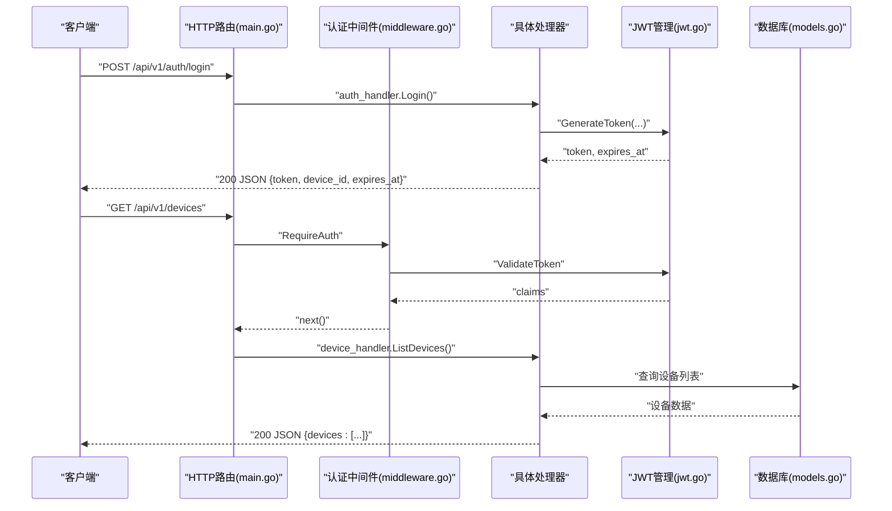
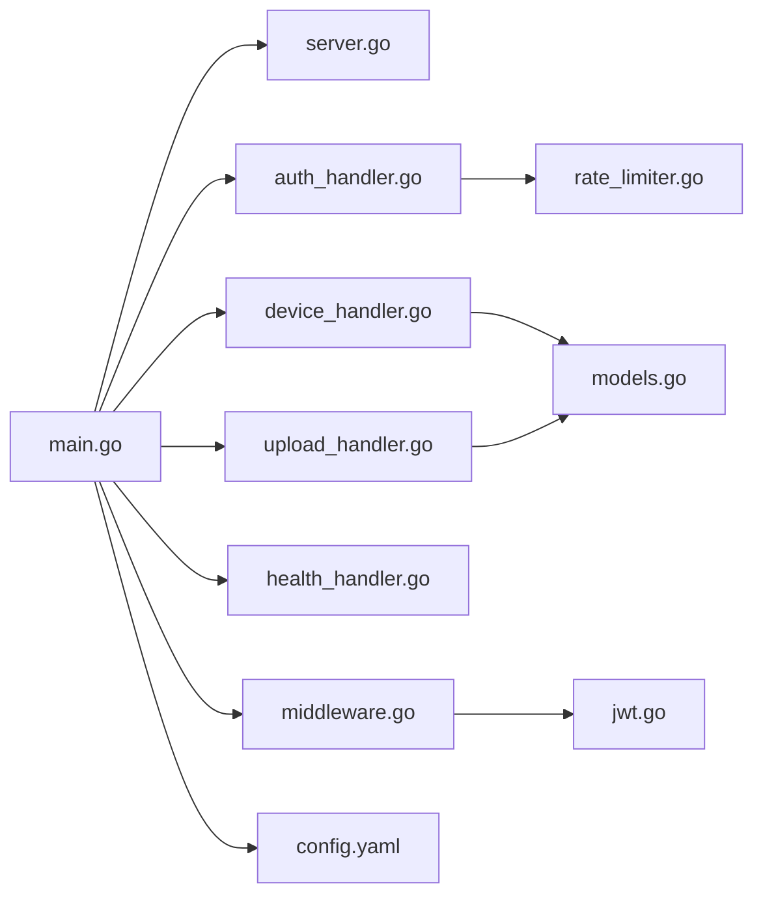

# HTTP API规范

<cite>
**本文档引用的文件**
- [main.go](file://clipSync-server/cmd/server/main.go)
- [server.go](file://clipSync-server/internal/httpserver/server.go)
- [auth_handler.go](file://clipSync-server/internal/httpserver/auth_handler.go)
- [device_handler.go](file://clipSync-server/internal/httpserver/device_handler.go)
- [upload_handler.go](file://clipSync-server/internal/httpserver/upload_handler.go)
- [health_handler.go](file://clipSync-server/internal/httpserver/health_handler.go)
- [middleware.go](file://clipSync-server/internal/auth/middleware.go)
- [jwt.go](file://clipSync-server/internal/auth/jwt.go)
- [config.yaml](file://clipSync-server/configs/config.yaml)
- [http-api.schema.json](file://protocol/http-api.schema.json)
- [models.go](file://clipSync-server/internal/database/models.go)
- [rate_limiter.go](file://clipSync-server/internal/httpserver/rate_limiter.go)
- [DEVELOPMENT_PLAN.md](file://DEVELOPMENT_PLAN.md)
</cite>

## 目录
1. [简介](#简介)
2. [项目结构](#项目结构)
3. [核心组件](#核心组件)
4. [架构总览](#架构总览)
5. [详细组件分析](#详细组件分析)
6. [依赖关系分析](#依赖关系分析)
7. [性能考虑](#性能考虑)
8. [故障排除指南](#故障排除指南)
9. [结论](#结论)
10. [附录](#附录)

## 简介
本文件为 ClipSync 项目的 HTTP API 规范，覆盖认证（登录、注册、刷新）、设备管理、文件上传下载以及健康检查等端点。文档基于实际代码实现与协议规范文件，详细说明每个端点的 HTTP 方法、URL 模式、请求参数、响应格式、状态码、认证方式（JWT 令牌）、请求头要求、参数验证规则，并提供错误响应格式、错误代码说明、API 版本控制策略与向后兼容性保障，以及客户端实现指南与最佳实践。

## 项目结构
服务器采用 Go 编写，路由在主程序中集中注册，HTTP 路由通过标准库 ServeMux 实现；认证中间件负责校验 Authorization 头中的 Bearer 令牌；各处理器模块化封装，分别处理认证、设备、上传下载与健康检查逻辑；配置通过 YAML 文件加载，支持运行时环境变量覆盖。

**图表来源**
- [main.go:74-106](file://clipSync-server/cmd/server/main.go#L74-L106)
- [server.go:18-41](file://clipSync-server/internal/httpserver/server.go#L18-L41)
- [middleware.go:32-61](file://clipSync-server/internal/auth/middleware.go#L32-L61)
- [auth_handler.go:63-109](file://clipSync-server/internal/httpserver/auth_handler.go#L63-L109)
- [device_handler.go:25-82](file://clipSync-server/internal/httpserver/device_handler.go#L25-L82)
- [upload_handler.go:36-150](file://clipSync-server/internal/httpserver/upload_handler.go#L36-L150)
- [health_handler.go:28-54](file://clipSync-server/internal/httpserver/health_handler.go#L28-L54)
- [jwt.go:32-75](file://clipSync-server/internal/auth/jwt.go#L32-L75)
- [rate_limiter.go:72-85](file://clipSync-server/internal/httpserver/rate_limiter.go#L72-L85)
- [config.yaml:1-29](file://clipSync-server/configs/config.yaml#L1-L29)
- [models.go:3-45](file://clipSync-server/internal/database/models.go#L3-L45)

**章节来源**
- [main.go:74-106](file://clipSync-server/cmd/server/main.go#L74-L106)
- [server.go:18-41](file://clipSync-server/internal/httpserver/server.go#L18-L41)
- [config.yaml:1-29](file://clipSync-server/configs/config.yaml#L1-L29)

## 核心组件
- 路由与启动：主程序集中注册所有 HTTP 路由，设置限流器用于认证端点，初始化数据库与迁移，构建 WebSocket Hub 并启动 HTTP 与 WebSocket 服务。
- 认证中间件：从 Authorization 头解析 Bearer 令牌，调用 JWT 管理器进行校验，将用户信息注入请求上下文供后续处理器使用。
- 处理器模块：按功能拆分，分别处理认证、设备管理、文件上传下载与健康检查，统一返回 JSON 响应。
- 配置系统：支持从 YAML 加载配置并通过环境变量覆盖，包含端口、数据库路径、JWT 密钥与过期时间、文件存储路径与大小限制等。
- 错误与限流：统一的错误响应格式，认证端点采用滑动窗口限流器，防止暴力破解与滥用。

**章节来源**
- [main.go:21-146](file://clipSync-server/cmd/server/main.go#L21-L146)
- [middleware.go:32-61](file://clipSync-server/internal/auth/middleware.go#L32-L61)
- [rate_limiter.go:22-54](file://clipSync-server/internal/httpserver/rate_limiter.go#L22-L54)
- [config.yaml:1-29](file://clipSync-server/configs/config.yaml#L1-L29)

## 架构总览
下图展示 HTTP API 的总体交互流程：客户端通过认证端点获取 JWT，随后在需要鉴权的端点中携带 Authorization: Bearer <token> 请求头；中间件校验令牌并将用户信息注入上下文；处理器根据业务逻辑访问数据库或文件系统并返回结果。

**图表来源**
- [main.go:80-93](file://clipSync-server/cmd/server/main.go#L80-L93)
- [middleware.go:32-61](file://clipSync-server/internal/auth/middleware.go#L32-L61)
- [jwt.go:32-55](file://clipSync-server/internal/auth/jwt.go#L32-L55)
- [auth_handler.go:63-109](file://clipSync-server/internal/httpserver/auth_handler.go#L63-L109)
- [device_handler.go:25-82](file://clipSync-server/internal/httpserver/device_handler.go#L25-L82)
- [models.go:11-19](file://clipSync-server/internal/database/models.go#L11-L19)

## 详细组件分析

### 认证端点

#### 登录 /api/v1/auth/login
- 方法与路径：POST /api/v1/auth/login
- 请求头：无
- 请求体字段：
  - username: 字符串，长度 3-50
  - password: 字符串，长度 6-128
  - device_name: 字符串，长度 1-100
  - platform: 枚举值，可选 windows、android、macos、ios
- 成功响应（200）：
  - success: true
  - token: JWT 字符串
  - device_id: 设备标识
  - expires_at: 过期时间（Unix 毫秒）
- 失败响应：
  - 400 INVALID_PAYLOAD：请求体缺失或格式错误
  - 401 INVALID_CREDENTIALS：用户名或密码错误
  - 500 INTERNAL_ERROR：内部错误
- 参数验证：
  - 密码强度：至少8位，包含字母和数字
  - 用户名：3-32字符
- 速率限制：每IP每分钟10次

**章节来源**
- [auth_handler.go:63-109](file://clipSync-server/internal/httpserver/auth_handler.go#L63-L109)
- [http-api.schema.json:8-49](file://protocol/http-api.schema.json#L8-L49)
- [main.go:77-84](file://clipSync-server/cmd/server/main.go#L77-L84)

#### 注册 /api/v1/auth/register
- 方法与路径：POST /api/v1/auth/register
- 请求体字段同登录
- 成功响应（201）：
  - success: true
  - token: JWT 字符串
  - device_id: 设备标识
  - expires_at: 过期时间（Unix 毫秒）
- 失败响应：
  - 400 INVALID_PAYLOAD：用户名或密码不满足规则
  - 409 USERNAME_EXISTS：用户名已存在
  - 500 INTERNAL_ERROR：内部错误
- 参数验证：同登录

**章节来源**
- [auth_handler.go:111-175](file://clipSync-server/internal/httpserver/auth_handler.go#L111-L175)
- [http-api.schema.json:50-91](file://protocol/http-api.schema.json#L50-L91)
- [main.go:77-84](file://clipSync-server/cmd/server/main.go#L77-L84)

#### 刷新令牌 /api/v1/auth/refresh
- 方法与路径：POST /api/v1/auth/refresh
- 请求头：Authorization: Bearer <token>
- 成功响应（200）：
  - success: true
  - token: 新的 JWT 字符串
  - expires_at: 新的过期时间（Unix 毫秒）
- 失败响应：
  - 401 AUTH_FAILED/TOKEN_EXPIRED：令牌无效或已过期
- 注意：该端点不使用限流器

**章节来源**
- [auth_handler.go:177-208](file://clipSync-server/internal/httpserver/auth_handler.go#L177-L208)
- [http-api.schema.json:92-124](file://protocol/http-api.schema.json#L92-L124)
- [main.go:77-84](file://clipSync-server/cmd/server/main.go#L77-L84)

### 设备管理端点

#### 获取设备列表 /api/v1/devices
- 方法与路径：GET /api/v1/devices
- 请求头：Authorization: Bearer <token>
- 成功响应（200）：
  - devices: 数组，元素包含
    - device_id: 设备标识
    - device_name: 设备名称
    - platform: 平台枚举
    - last_seen: 最后在线时间（Unix 毫秒）
    - is_online: 是否在线
    - created_at: 创建时间（Unix 毫秒）
- 失败响应：
  - 401 AUTH_FAILED：未提供有效令牌
  - 500 INTERNAL_ERROR：内部错误

**章节来源**
- [device_handler.go:25-82](file://clipSync-server/internal/httpserver/device_handler.go#L25-L82)
- [http-api.schema.json:144-177](file://protocol/http-api.schema.json#L144-L177)

#### 删除设备 /api/v1/devices/{device_id}
- 方法与路径：DELETE /api/v1/devices/{device_id}
- 请求头：Authorization: Bearer <token>
- 成功响应（200）：
  - success: true
- 失败响应：
  - 400 INVALID_PAYLOAD：缺少设备ID
  - 404 DEVICE_NOT_FOUND：设备不存在
  - 500 INTERNAL_ERROR：内部错误
- 行为：删除设备同时会断开该设备的 WebSocket 连接

**章节来源**
- [device_handler.go:84-137](file://clipSync-server/internal/httpserver/device_handler.go#L84-L137)
- [http-api.schema.json:178-210](file://protocol/http-api.schema.json#L178-L210)

### 文件上传端点

#### 上传文件 /api/v1/upload
- 方法与路径：POST /api/v1/upload
- 请求头：Authorization: Bearer <token>, Content-Type: multipart/form-data
- 请求体字段：
  - file: 二进制文件（必填）
  - checksum: SHA256 校验和（可选）
- 成功响应（200）：
  - success: true
  - file_id: 服务器生成的文件标识
  - download_url: 下载链接（/api/v1/download/{file_id}）
- 失败响应：
  - 400 INVALID_PAYLOAD：缺少文件或表单字段错误
  - 401 AUTH_FAILED：未提供有效令牌
  - 413 CONTENT_TOO_LARGE：文件超过最大大小限制
  - 500 INTERNAL_ERROR：内部错误
- 安全与校验：
  - 限制请求体大小为配置的最大值
  - 可选校验和：若提供则与计算值比对，不一致则拒绝
  - 文件保存在用户专属目录，数据库记录元数据

**章节来源**
- [upload_handler.go:36-150](file://clipSync-server/internal/httpserver/upload_handler.go#L36-L150)
- [http-api.schema.json:211-249](file://protocol/http-api.schema.json#L211-L249)
- [config.yaml:18-22](file://clipSync-server/configs/config.yaml#L18-L22)

#### 下载文件 /api/v1/download/{file_id}
- 方法与路径：GET /api/v1/download/{file_id}
- 请求头：Authorization: Bearer <token>
- 成功响应（200）：返回原始二进制内容，Content-Type 为文件 MIME 类型
- 失败响应：
  - 400 INVALID_FILE_ID：文件ID包含路径遍历字符
  - 401 AUTH_FAILED：未提供有效令牌
  - 403 ACCESS_DENIED：文件不属于当前用户
  - 404 FILE_NOT_FOUND：文件不存在
- 安全与校验：
  - 校验文件ID合法性，防止路径遍历
  - 数据库查询确认文件归属
  - 本地文件存在性检查

**章节来源**
- [upload_handler.go:152-214](file://clipSync-server/internal/httpserver/upload_handler.go#L152-L214)
- [http-api.schema.json:251-278](file://protocol/http-api.schema.json#L251-L278)

### 健康检查端点

#### 健康检查 /api/v1/health
- 方法与路径：GET /api/v1/health
- 请求头：无
- 成功响应（200）：
  - status: "ok"
  - version: 服务器版本
  - uptime: 运行时长（秒）
  - connected_clients: 当前连接的 WebSocket 客户端数量
  - database: 数据库连通性状态
- 失败响应：无（该端点不返回错误）

**章节来源**
- [health_handler.go:28-54](file://clipSync-server/internal/httpserver/health_handler.go#L28-L54)
- [http-api.schema.json:125-143](file://protocol/http-api.schema.json#L125-L143)

### 认证与请求头要求
- 所有需要身份验证的端点必须在请求头中提供 Authorization: Bearer <token>
- 中间件负责解析并校验令牌，失败时返回 401 AUTH_FAILED 或 TOKEN_EXPIRED
- 令牌由登录与注册端点返回，包含用户ID、用户名、设备ID及过期时间

**章节来源**
- [middleware.go:32-61](file://clipSync-server/internal/auth/middleware.go#L32-L61)
- [jwt.go:32-75](file://clipSync-server/internal/auth/jwt.go#L32-L75)
- [auth_handler.go:63-109](file://clipSync-server/internal/httpserver/auth_handler.go#L63-L109)

### 参数验证规则
- 登录/注册：
  - username：3-32字符
  - password：至少8位，包含字母和数字
  - device_name：至少1字符
  - platform：枚举值（windows、android、macos、ios）
- 上传：
  - file：必填
  - checksum：可选，格式为十六进制字符串
- 下载：
  - file_id：不允许包含路径分隔符或父目录引用
- 速率限制：
  - 认证端点：每IP每分钟最多10次请求

**章节来源**
- [auth_handler.go:29-61](file://clipSync-server/internal/httpserver/auth_handler.go#L29-L61)
- [upload_handler.go:73-82](file://clipSync-server/internal/httpserver/upload_handler.go#L73-L82)
- [rate_limiter.go:22-54](file://clipSync-server/internal/httpserver/rate_limiter.go#L22-L54)

### 错误响应格式与错误代码
- 统一错误响应格式：包含 success:false、error（错误代码）、message（可选）
- 常见错误代码与对应HTTP状态：
  - AUTH_FAILED：401
  - TOKEN_EXPIRED：401
  - RATE_LIMITED：429
  - INVALID_PAYLOAD：400
  - CONTENT_TOO_LARGE：413
  - DEVICE_NOT_FOUND：404
  - INTERNAL_ERROR：500
  - DUPLICATE_CONTENT：409
  - USERNAME_EXISTS：409
  - INVALID_CREDENTIALS：401

**章节来源**
- [auth_handler.go:63-109](file://clipSync-server/internal/httpserver/auth_handler.go#L63-L109)
- [device_handler.go:115-137](file://clipSync-server/internal/httpserver/device_handler.go#L115-L137)
- [upload_handler.go:113-143](file://clipSync-server/internal/httpserver/upload_handler.go#L113-L143)
- [http-api.schema.json:280-292](file://protocol/http-api.schema.json#L280-L292)

### API版本控制与兼容性
- 版本策略：URL 使用 /api/v1 命名空间，当前版本为 1.0.0
- 兼容性：开发计划中明确版本包含在 WebSocket 消息中，建议在 HTTP 层也遵循相同约定；如需扩展，应保持向后兼容
- 废弃端点：当前仓库未发现已标记为废弃的端点

**章节来源**
- [main.go:19](file://clipSync-server/cmd/server/main.go#L19)
- [DEVELOPMENT_PLAN.md:902-910](file://DEVELOPMENT_PLAN.md#L902-L910)

### 客户端实现指南与最佳实践
- 令牌管理：
  - 登录成功后缓存 token 与 expires_at
  - 在过期前自动调用刷新接口更新令牌
- 请求头：
  - 对所有受保护端点添加 Authorization: Bearer <token>
- 重试与退避：
  - 对 5xx 错误与网络异常采用指数退避重试
  - 对 429 RATE_LIMITED 等临时错误等待后重试
- 文件上传：
  - 使用 multipart/form-data，必要时提供 checksum
  - 控制单次上传大小不超过配置限制
- 错误处理：
  - 将错误代码映射到用户可理解的消息
  - 对 401/TOKEN_EXPIRED 自动触发重新登录流程
- 性能优化：
  - 合理缓存设备列表与历史记录
  - 并发上传/下载时注意资源占用

**章节来源**
- [auth_handler.go:177-208](file://clipSync-server/internal/httpserver/auth_handler.go#L177-L208)
- [upload_handler.go:36-150](file://clipSync-server/internal/httpserver/upload_handler.go#L36-L150)
- [rate_limiter.go:72-85](file://clipSync-server/internal/httpserver/rate_limiter.go#L72-L85)

## 依赖关系分析

**图表来源**
- [main.go:74-106](file://clipSync-server/cmd/server/main.go#L74-L106)
- [server.go:18-41](file://clipSync-server/internal/httpserver/server.go#L18-L41)
- [auth_handler.go:63-109](file://clipSync-server/internal/httpserver/auth_handler.go#L63-L109)
- [device_handler.go:25-82](file://clipSync-server/internal/httpserver/device_handler.go#L25-L82)
- [upload_handler.go:36-150](file://clipSync-server/internal/httpserver/upload_handler.go#L36-L150)
- [health_handler.go:28-54](file://clipSync-server/internal/httpserver/health_handler.go#L28-L54)
- [middleware.go:32-61](file://clipSync-server/internal/auth/middleware.go#L32-L61)
- [jwt.go:32-75](file://clipSync-server/internal/auth/jwt.go#L32-L75)
- [rate_limiter.go:22-54](file://clipSync-server/internal/httpserver/rate_limiter.go#L22-L54)
- [models.go:3-45](file://clipSync-server/internal/database/models.go#L3-L45)
- [config.yaml:1-29](file://clipSync-server/configs/config.yaml#L1-L29)

**章节来源**
- [main.go:74-106](file://clipSync-server/cmd/server/main.go#L74-L106)
- [middleware.go:32-61](file://clipSync-server/internal/auth/middleware.go#L32-L61)
- [jwt.go:32-75](file://clipSync-server/internal/auth/jwt.go#L32-L75)
- [rate_limiter.go:22-54](file://clipSync-server/internal/httpserver/rate_limiter.go#L22-L54)
- [models.go:3-45](file://clipSync-server/internal/database/models.go#L3-L45)
- [config.yaml:1-29](file://clipSync-server/configs/config.yaml#L1-L29)

## 性能考虑
- 限流：认证端点采用滑动窗口限流，防止暴力破解与滥用
- 请求体大小限制：上传端点限制最大请求体大小，避免内存压力
- 数据库与文件存储：设备与文件元数据存储于 SQLite，文件按用户目录隔离
- WebSocket 与 HTTP 分离：HTTP 与 WebSocket 在不同端口运行，降低相互影响

**章节来源**
- [rate_limiter.go:22-54](file://clipSync-server/internal/httpserver/rate_limiter.go#L22-L54)
- [upload_handler.go:52-61](file://clipSync-server/internal/httpserver/upload_handler.go#L52-L61)
- [main.go:108-125](file://clipSync-server/cmd/server/main.go#L108-L125)

## 故障排除指南
- 401 AUTH_FAILED/TOKEN_EXPIRED：检查 Authorization 头格式是否为 Bearer，确认令牌未过期
- 400 INVALID_PAYLOAD：核对请求体字段类型与长度，确保 multipart/form-data 正确
- 413 CONTENT_TOO_LARGE：减小文件大小或调整服务端配置
- 404 DEVICE_NOT_FOUND：确认设备ID正确且属于当前用户
- 500 INTERNAL_ERROR：查看服务器日志，关注数据库连接与文件系统权限

**章节来源**
- [middleware.go:32-61](file://clipSync-server/internal/auth/middleware.go#L32-L61)
- [auth_handler.go:63-109](file://clipSync-server/internal/httpserver/auth_handler.go#L63-L109)
- [device_handler.go:115-137](file://clipSync-server/internal/httpserver/device_handler.go#L115-L137)
- [upload_handler.go:113-143](file://clipSync-server/internal/httpserver/upload_handler.go#L113-L143)

## 结论
本规范基于实际代码实现，明确了 ClipSync HTTP API 的端点、认证方式、参数验证、响应格式与错误处理策略。通过 JWT 令牌与统一的错误响应格式，客户端可以稳定地完成认证、设备管理与文件同步。建议在客户端侧实现令牌自动刷新、合理的重试与退避策略，并严格遵守参数验证与大小限制，以获得最佳的用户体验与系统稳定性。

## 附录

### 端点一览与状态码对照
- POST /api/v1/auth/login：200 成功，400/401/500 错误
- POST /api/v1/auth/register：201 成功，400/409/500 错误
- POST /api/v1/auth/refresh：200 成功，401 错误
- GET /api/v1/devices：200 成功，401/500 错误
- DELETE /api/v1/devices/{device_id}：200 成功，400/404/500 错误
- POST /api/v1/upload：200 成功，400/401/413/500 错误
- GET /api/v1/download/{file_id}：200 成功，400/401/403/404 错误
- GET /api/v1/health：200 成功

**章节来源**
- [http-api.schema.json:7-279](file://protocol/http-api.schema.json#L7-L279)