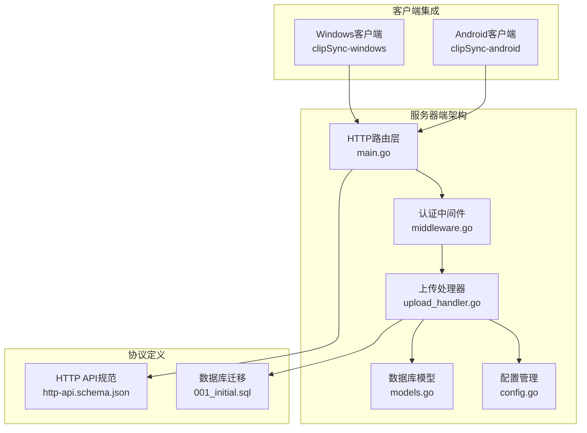
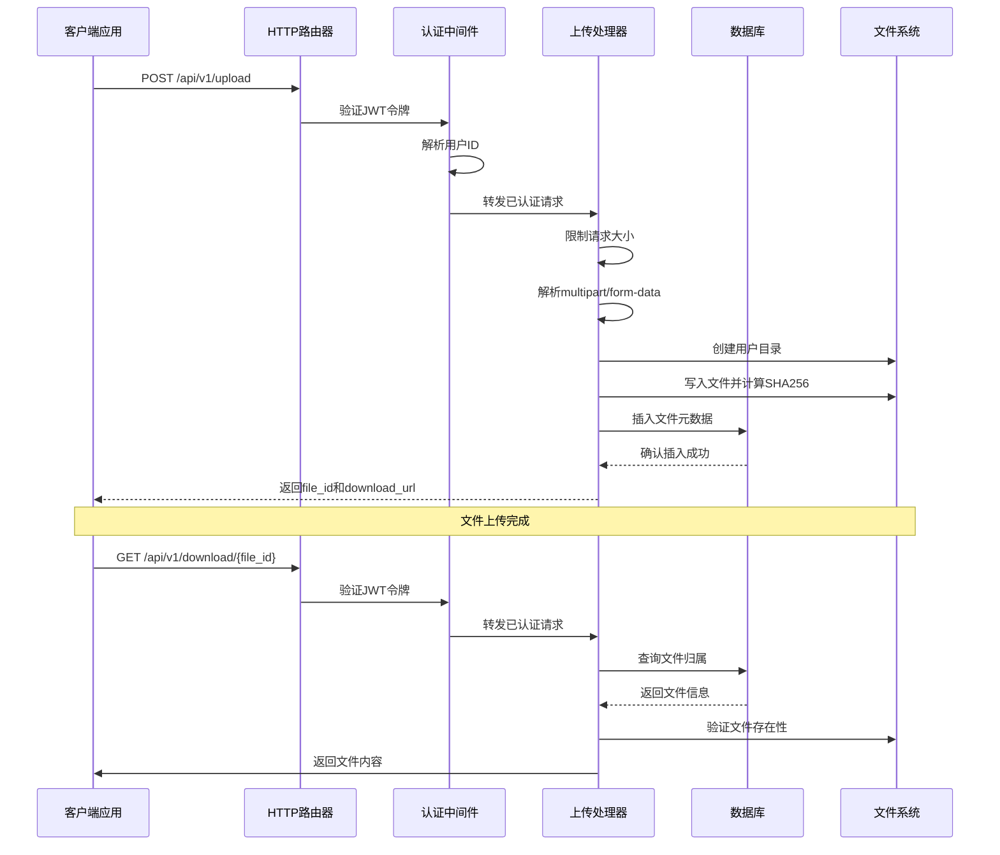
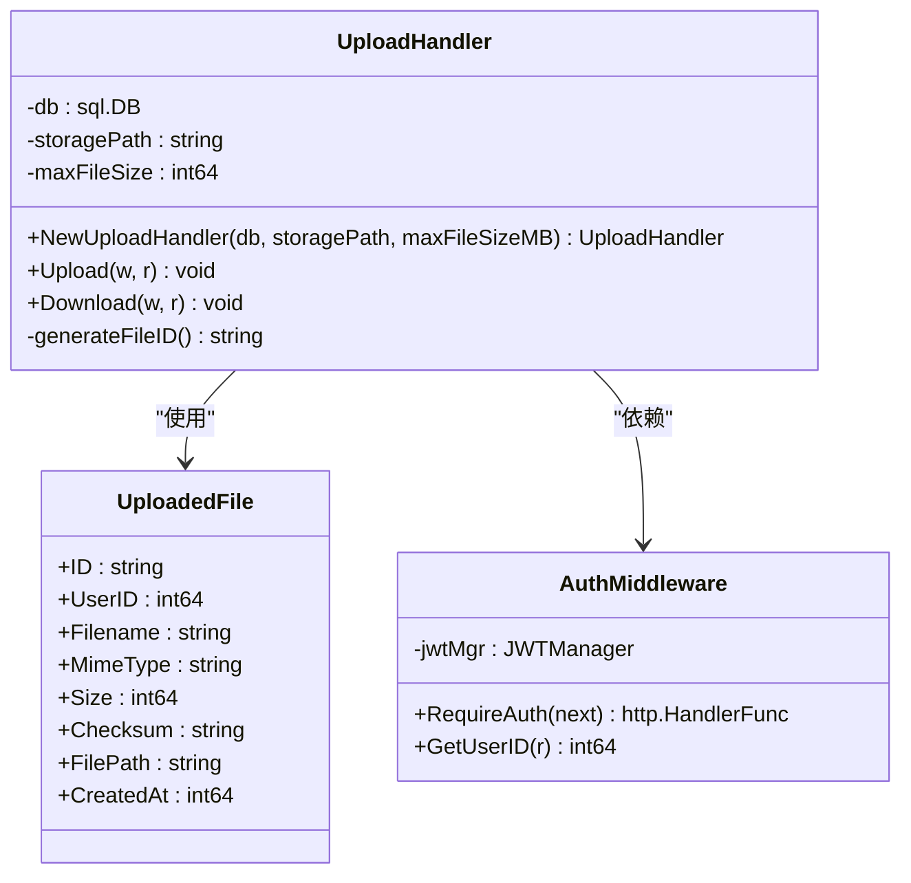
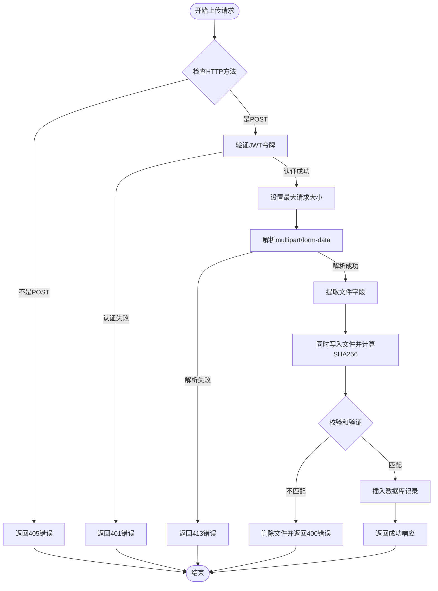
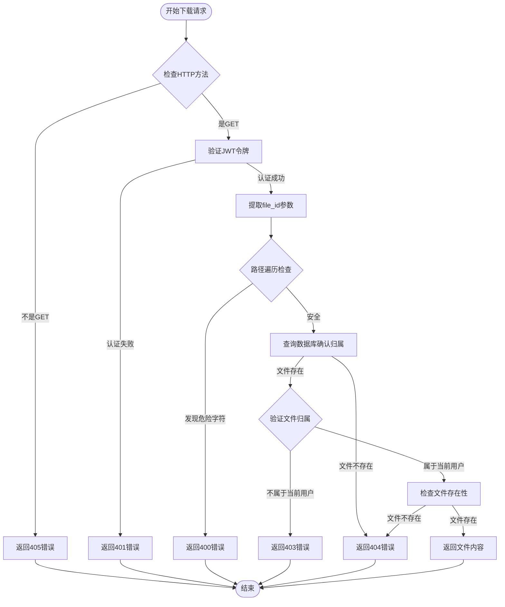
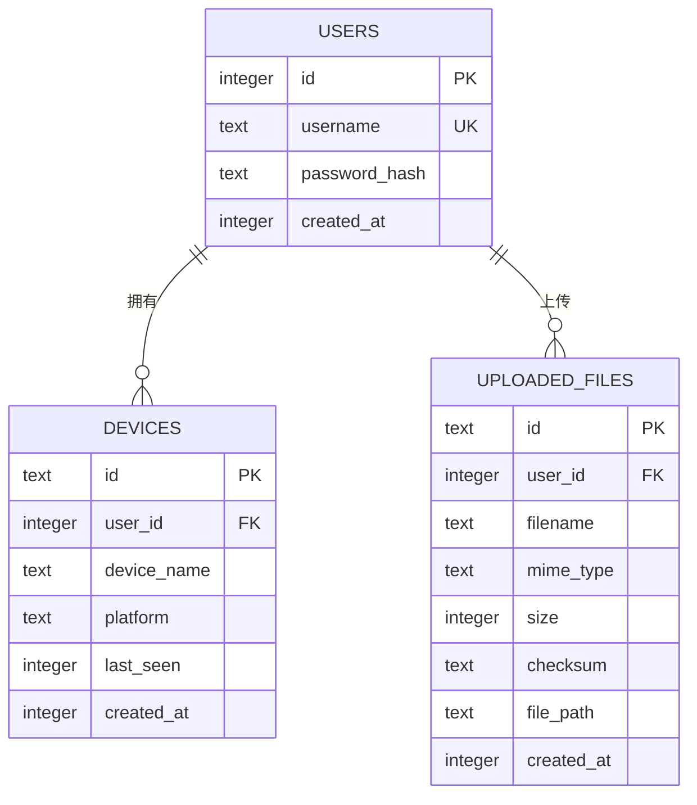
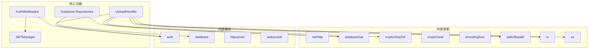
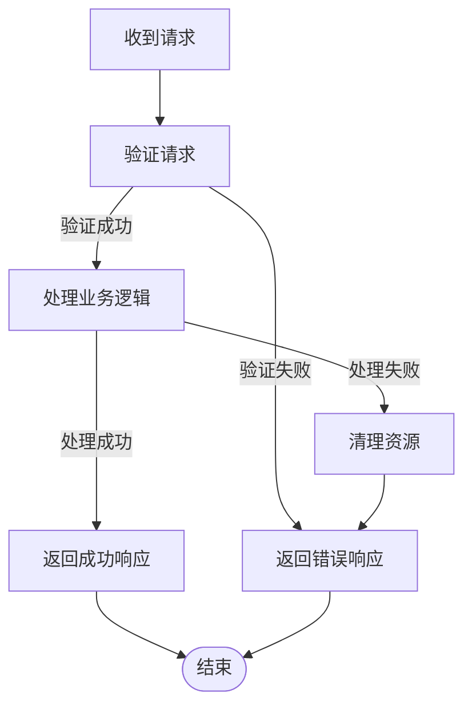

# 文件上传端点

<cite>
**本文档引用的文件**
- [upload_handler.go](file://clipSync-server/internal/httpserver/upload_handler.go)
- [models.go](file://clipSync-server/internal/database/models.go)
- [main.go](file://clipSync-server/cmd/server/main.go)
- [http-api.schema.json](file://protocol/http-api.schema.json)
- [config.go](file://clipSync-server/internal/config/config.go)
- [config.yaml](file://clipSync-server/configs/config.yaml)
- [001_initial.sql](file://clipSync-server/migrations/001_initial.sql)
- [middleware.go](file://clipSync-server/internal/auth/middleware.go)
- [clipboard_repo.go](file://clipSync-server/internal/database/clipboard_repo.go)
</cite>

## 目录
1. [简介](#简介)
2. [项目结构](#项目结构)
3. [核心组件](#核心组件)
4. [架构概览](#架构概览)
5. [详细组件分析](#详细组件分析)
6. [依赖关系分析](#依赖关系分析)
7. [性能考虑](#性能考虑)
8. [故障排除指南](#故障排除指南)
9. [结论](#结论)
10. [附录](#附录)

## 简介
本文档详细描述了ClipSync服务器中的文件上传端点，包括：
- POST /api/v1/upload（文件上传）
- GET /api/v1/download/{file_id}（文件下载）

重点涵盖multipart/form-data格式、二进制数据处理、SHA256校验和验证、文件存储策略、URL生成机制、访问权限控制、文件大小限制（5MB）、重复内容检测以及清理策略。同时提供完整的上传下载示例、错误处理和性能优化建议，并解释文件与剪贴板内容的关联关系和生命周期管理。

## 项目结构
文件上传功能位于Go语言编写的服务器端，采用分层架构设计：



**图表来源**
- [main.go:75-98](file://clipSync-server/cmd/server/main.go#L75-L98)
- [upload_handler.go:19-34](file://clipSync-server/internal/httpserver/upload_handler.go#L19-L34)
- [http-api.schema.json:211-278](file://protocol/http-api.schema.json#L211-L278)

**章节来源**
- [main.go:75-98](file://clipSync-server/cmd/server/main.go#L75-L98)
- [upload_handler.go:19-34](file://clipSync-server/internal/httpserver/upload_handler.go#L19-L34)

## 核心组件
文件上传系统由以下核心组件构成：

### 1. 上传处理器 (UploadHandler)
负责处理文件上传和下载请求，实现以下关键功能：
- 认证验证和用户权限检查
- 文件大小限制和安全防护
- SHA256校验和计算和验证
- 文件存储和元数据管理
- 下载权限控制和文件服务

### 2. 数据库模型
定义了文件存储的数据库结构：
- `uploaded_files`表：存储文件元数据和路径信息
- 支持按用户隔离的文件存储
- 完整的索引优化支持

### 3. 配置系统
提供灵活的配置选项：
- 最大文件大小限制（默认5MB）
- 文件存储目录配置
- JWT认证配置
- 历史记录限制

**章节来源**
- [upload_handler.go:19-34](file://clipSync-server/internal/httpserver/upload_handler.go#L19-L34)
- [models.go:35-45](file://clipSync-server/internal/database/models.go#L35-L45)
- [config.go:10-21](file://clipSync-server/internal/config/config.go#L10-L21)

## 架构概览
文件上传系统的整体架构如下：



**图表来源**
- [main.go:96-98](file://clipSync-server/cmd/server/main.go#L96-L98)
- [upload_handler.go:36-150](file://clipSync-server/internal/httpserver/upload_handler.go#L36-L150)
- [upload_handler.go:152-214](file://clipSync-server/internal/httpserver/upload_handler.go#L152-L214)

## 详细组件分析

### 上传处理器类图


**图表来源**
- [upload_handler.go:19-34](file://clipSync-server/internal/httpserver/upload_handler.go#L19-L34)
- [models.go:35-45](file://clipSync-server/internal/database/models.go#L35-L45)

### 上传流程详细分析
#### 请求处理流程


**图表来源**
- [upload_handler.go:36-150](file://clipSync-server/internal/httpserver/upload_handler.go#L36-L150)

#### 下载流程详细分析


**图表来源**
- [upload_handler.go:152-214](file://clipSync-server/internal/httpserver/upload_handler.go#L152-L214)

### 数据模型设计
文件上传功能使用SQLite数据库存储文件元数据：



**图表来源**
- [001_initial.sql:42-55](file://clipSync-server/migrations/001_initial.sql#L42-L55)

**章节来源**
- [upload_handler.go:131-143](file://clipSync-server/internal/httpserver/upload_handler.go#L131-L143)
- [001_initial.sql:42-55](file://clipSync-server/migrations/001_initial.sql#L42-L55)

## 依赖关系分析
文件上传功能的依赖关系如下：



**图表来源**
- [upload_handler.go:3-17](file://clipSync-server/internal/httpserver/upload_handler.go#L3-L17)
- [middleware.go:22-29](file://clipSync-server/internal/auth/middleware.go#L22-L29)

**章节来源**
- [upload_handler.go:3-17](file://clipSync-server/internal/httpserver/upload_handler.go#L3-L17)
- [middleware.go:22-29](file://clipSync-server/internal/auth/middleware.go#L22-L29)

## 性能考虑
基于代码分析，文件上传系统在性能方面有以下特点：

### 1. 流式处理优势
- 使用`io.MultiWriter`同时写入文件和计算SHA256哈希
- 通过`io.Copy`进行流式数据传输，避免内存峰值
- 支持大文件的渐进式处理

### 2. 存储策略优化
- 用户特定的子目录结构：`./data/files/{user_id}/{file_id}`
- 自动创建必要的目录结构
- 文件路径与用户ID绑定，便于管理和清理

### 3. 并发处理能力
- 每个请求独立处理，无全局锁竞争
- 数据库操作使用连接池
- 文件I/O操作异步化

### 4. 内存使用控制
- 通过`http.MaxBytesReader`限制请求体大小
- 避免将整个文件加载到内存中
- 及时释放文件句柄和资源

**章节来源**
- [upload_handler.go:88-111](file://clipSync-server/internal/httpserver/upload_handler.go#L88-L111)
- [upload_handler.go:27-33](file://clipSync-server/internal/httpserver/upload_handler.go#L27-L33)

## 故障排除指南

### 常见错误类型及处理

#### 1. 认证相关错误
- **AUTH_FAILED (401)**: 令牌缺失或无效
- **TOKEN_EXPIRED (401)**: 令牌过期
- **ACCESS_DENIED (403)**: 权限不足

#### 2. 请求格式错误
- **INVALID_PAYLOAD (400)**: multipart/form-data格式错误
- **INVALID_FILE_ID (400)**: 文件ID包含路径遍历字符
- **CHECKSUM_MISMATCH (400)**: 校验和不匹配

#### 3. 资源相关错误
- **CONTENT_TOO_LARGE (413)**: 文件超过5MB限制
- **FILE_NOT_FOUND (404)**: 文件不存在或已被删除
- **INTERNAL_ERROR (500)**: 服务器内部错误

#### 4. 错误处理流程


**图表来源**
- [upload_handler.go:36-150](file://clipSync-server/internal/httpserver/upload_handler.go#L36-L150)
- [upload_handler.go:152-214](file://clipSync-server/internal/httpserver/upload_handler.go#L152-L214)

**章节来源**
- [upload_handler.go:36-150](file://clipSync-server/internal/httpserver/upload_handler.go#L36-L150)
- [upload_handler.go:152-214](file://clipSync-server/internal/httpserver/upload_handler.go#L152-L214)

## 结论
ClipSync的文件上传系统实现了以下关键特性：

### 技术优势
- **安全性**: 完整的认证授权、路径遍历防护、文件归属验证
- **可靠性**: 流式处理、自动清理、错误恢复机制
- **可扩展性**: 用户隔离存储、配置灵活、模块化设计
- **性能**: 内存友好的流式处理、并发支持

### 功能完整性
- 支持标准的multipart/form-data上传
- 实现SHA256校验和验证
- 提供完整的上传下载API
- 集成剪贴板内容管理

### 改进建议
- 添加文件重复内容检测（基于校验和）
- 实现定期清理策略
- 增加上传进度报告
- 优化并发上传处理

该系统为跨平台的剪贴板同步提供了可靠的文件传输基础，支持多客户端环境下的文件共享需求。

## 附录

### API详细规范

#### 上传文件 (POST /api/v1/upload)
**请求头**
- Authorization: Bearer <token>
- Content-Type: multipart/form-data

**请求体字段**
- file: 二进制文件数据
- checksum: SHA256校验和（可选）

**成功响应**
```json
{
  "success": true,
  "file_id": "string",
  "download_url": "/api/v1/download/{file_id}"
}
```

**错误响应**
- 400: INVALID_PAYLOAD, CHECKSUM_MISMATCH
- 401: AUTH_FAILED, TOKEN_EXPIRED
- 413: CONTENT_TOO_LARGE
- 500: INTERNAL_ERROR

#### 下载文件 (GET /api/v1/download/{file_id})
**请求头**
- Authorization: Bearer <token>

**路径参数**
- file_id: 文件唯一标识符

**成功响应**
- 状态码: 200
- 内容类型: 原始文件MIME类型
- 响应体: 文件二进制数据

**错误响应**
- 401: AUTH_FAILED, TOKEN_EXPIRED
- 403: ACCESS_DENIED
- 404: FILE_NOT_FOUND

### 配置选项
**服务器配置 (config.yaml)**
- max_file_size_mb: 5 (默认)
- file_storage_path: ./data/files (默认)
- jwt_expiry_hours: 720 (默认)

**章节来源**
- [http-api.schema.json:211-278](file://protocol/http-api.schema.json#L211-L278)
- [config.yaml:21-22](file://clipSync-server/configs/config.yaml#L21-L22)