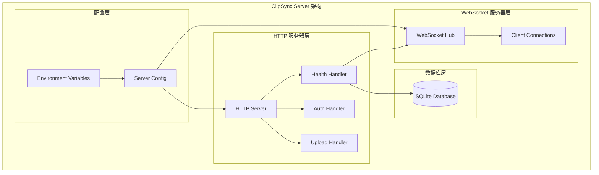
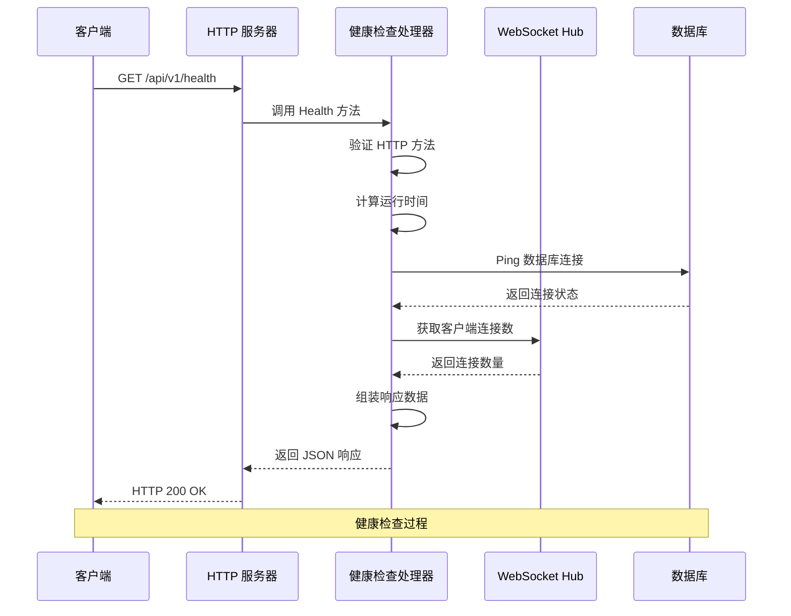
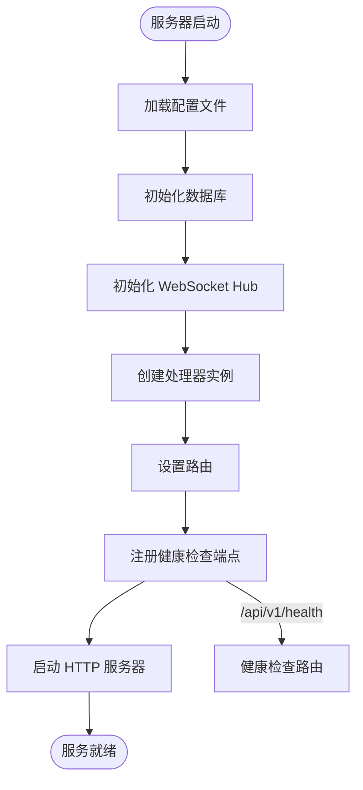
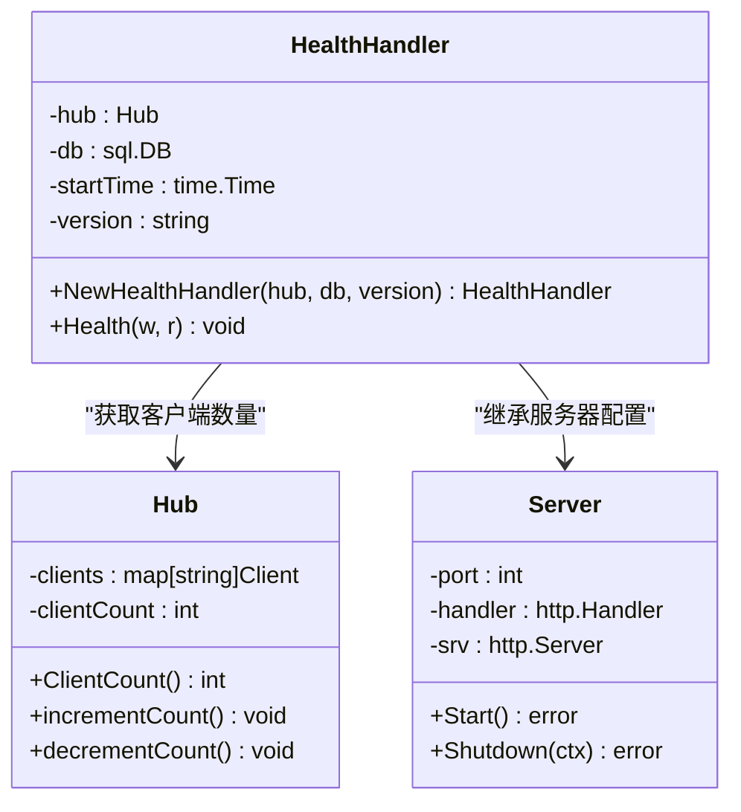
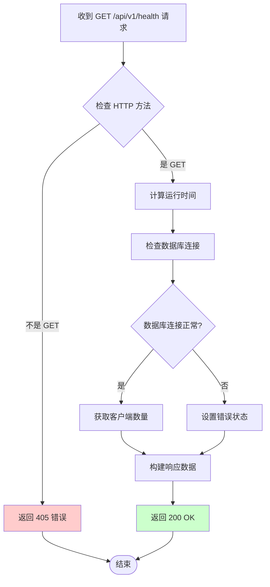
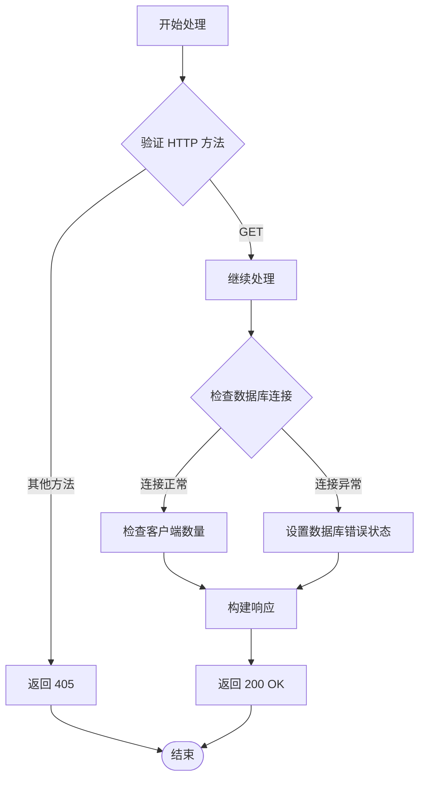
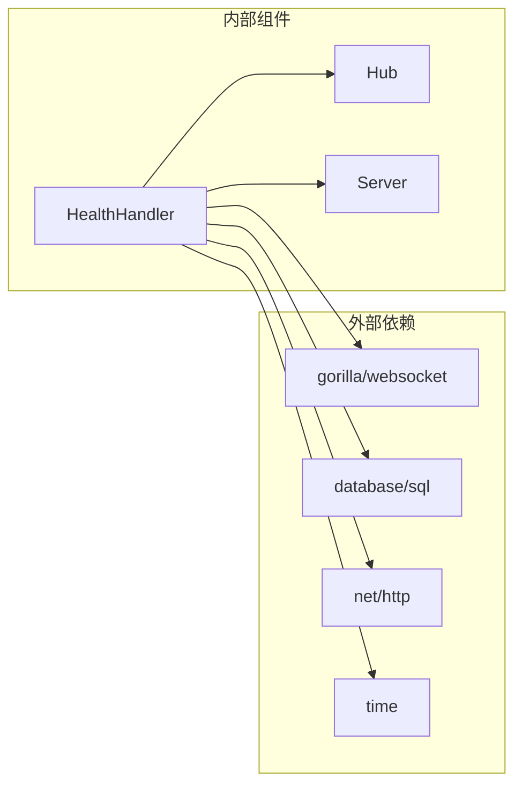
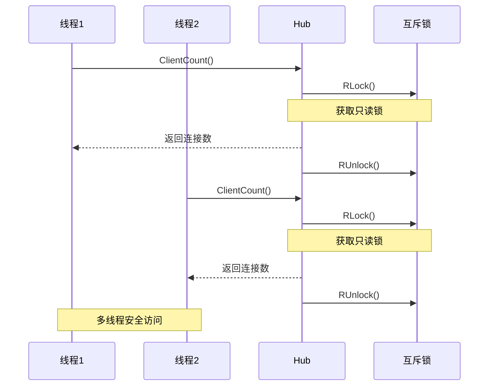

# 系统健康端点

<cite>
**本文档引用的文件**
- [health_handler.go](file://clipSync-server/internal/httpserver/health_handler.go)
- [main.go](file://clipSync-server/cmd/server/main.go)
- [server.go](file://clipSync-server/internal/httpserver/server.go)
- [config.yaml](file://clipSync-server/configs/config.yaml)
- [hub.go](file://clipSync-server/internal/websocket/hub.go)
- [auth_handler.go](file://clipSync-server/internal/httpserver/auth_handler.go)
- [DEVELOPMENT_PLAN.md](file://DEVELOPMENT_PLAN.md)
</cite>

## 目录
1. [简介](#简介)
2. [项目结构](#项目结构)
3. [核心组件](#核心组件)
4. [架构概览](#架构概览)
5. [详细组件分析](#详细组件分析)
6. [依赖关系分析](#依赖关系分析)
7. [性能考虑](#性能考虑)
8. [故障排查指南](#故障排查指南)
9. [结论](#结论)
10. [附录](#附录)

## 简介

ClipSync 系统健康端点是一个用于监控服务器运行状态的重要 API 接口。该端点提供实时的系统健康信息，包括服务状态、版本信息、运行时间以及连接的客户端数量等关键指标。通过这个端点，运维人员可以快速了解服务器的当前运行状况，并将其集成到各种监控系统中进行自动化告警和故障检测。

本系统采用 Go 语言开发，基于 HTTP 协议提供健康检查功能，支持多种监控工具集成，包括 Prometheus、Zabbix、Nagios 等主流监控平台。

## 项目结构

ClipSync 项目采用模块化设计，健康检查端点位于 HTTP 服务器模块中，与 WebSocket 服务器分离部署。这种架构设计确保了健康检查不会影响主要业务逻辑的性能。



**图表来源**
- [main.go:74-106](file://clipSync-server/cmd/server/main.go#L74-L106)
- [health_handler.go:10-26](file://clipSync-server/internal/httpserver/health_handler.go#L10-L26)

**章节来源**
- [main.go:19-146](file://clipSync-server/cmd/server/main.go#L19-L146)
- [config.yaml:1-29](file://clipSync-server/configs/config.yaml#L1-29)

## 核心组件

### 健康检查处理器

健康检查处理器是系统的核心组件，负责处理所有健康检查请求并返回相应的状态信息。该处理器具有以下特点：

- **轻量级设计**：仅包含必要的状态检查逻辑，避免对系统性能造成影响
- **多维度监控**：同时监控服务状态、数据库连接和客户端连接数
- **版本追踪**：提供详细的版本信息，便于版本管理和升级跟踪
- **实时性**：返回精确的运行时间和客户端连接数

### WebSocket Hub 集成

健康检查端点与 WebSocket Hub 深度集成，能够实时获取当前连接的客户端数量。这种集成确保了监控数据的准确性和实时性。

### 数据库连接检查

处理器内置数据库连接检查机制，能够验证数据库的可用性和连接状态。这对于确保系统核心功能的正常运行至关重要。

**章节来源**
- [health_handler.go:10-54](file://clipSync-server/internal/httpserver/health_handler.go#L10-L54)
- [hub.go:136-153](file://clipSync-server/internal/websocket/hub.go#L136-L153)

## 架构概览

ClipSync 的健康检查架构采用了分层设计，确保了系统的可维护性和扩展性。



**图表来源**
- [health_handler.go:28-54](file://clipSync-server/internal/httpserver/health_handler.go#L28-L54)
- [main.go:86-88](file://clipSync-server/cmd/server/main.go#L86-L88)

### 端点路由配置

健康检查端点在服务器启动时被注册到路由系统中，与其他 API 端点并行部署。



**图表来源**
- [main.go:86-88](file://clipSync-server/cmd/server/main.go#L86-L88)
- [server.go:26-41](file://clipSync-server/internal/httpserver/server.go#L26-L41)

**章节来源**
- [main.go:74-106](file://clipSync-server/cmd/server/main.go#L74-L106)
- [server.go:11-49](file://clipSync-server/internal/httpserver/server.go#L11-L49)

## 详细组件分析

### 健康检查处理器类图



**图表来源**
- [health_handler.go:10-26](file://clipSync-server/internal/httpserver/health_handler.go#L10-L26)
- [hub.go:18-58](file://clipSync-server/internal/websocket/hub.go#L18-L58)

### 健康检查流程图



**图表来源**
- [health_handler.go:28-54](file://clipSync-server/internal/httpserver/health_handler.go#L28-L54)

### 响应数据结构

健康检查端点返回标准化的 JSON 响应格式，包含以下关键字段：

| 字段名 | 类型 | 描述 | 示例值 |
|--------|------|------|--------|
| status | string | 服务状态 | "ok" |
| version | string | 服务器版本 | "1.0.0" |
| uptime | number | 运行时间（秒） | 1234.56 |
| connected_clients | integer | 当前连接的客户端数量 | 5 |
| database | string | 数据库连接状态 | "ok" 或 "error: ..." |

**章节来源**
- [health_handler.go:47-53](file://clipSync-server/internal/httpserver/health_handler.go#L47-L53)

### 错误处理机制

健康检查端点实现了完善的错误处理机制，能够优雅地处理各种异常情况：



**图表来源**
- [health_handler.go:28-54](file://clipSync-server/internal/httpserver/health_handler.go#L28-L54)

**章节来源**
- [health_handler.go:28-54](file://clipSync-server/internal/httpserver/health_handler.go#L28-L54)

## 依赖关系分析

### 外部依赖

健康检查端点依赖于以下外部组件：



**图表来源**
- [health_handler.go:3-8](file://clipSync-server/internal/httpserver/health_handler.go#L3-L8)

### 内部耦合关系

健康检查处理器与系统其他组件的耦合关系相对松散，主要体现在以下几个方面：

1. **WebSocket Hub 集成**：通过接口调用获取客户端连接数
2. **数据库连接检查**：直接使用数据库连接对象进行 Ping 操作
3. **服务器配置**：使用服务器启动时间作为运行时间计算的基础

**章节来源**
- [health_handler.go:10-26](file://clipSync-server/internal/httpserver/health_handler.go#L10-L26)
- [hub.go:136-153](file://clipSync-server/internal/websocket/hub.go#L136-L153)

## 性能考虑

### 响应时间优化

健康检查端点的设计充分考虑了性能要求：

- **零数据库查询**：仅进行简单的 Ping 操作，避免复杂的查询操作
- **内存计算**：运行时间通过内存中的时间戳计算，无需额外的 I/O 操作
- **轻量级序列化**：使用标准库进行 JSON 序列化，性能开销最小

### 并发安全性

处理器实现了线程安全的客户端计数获取机制：



**图表来源**
- [hub.go:136-153](file://clipSync-server/internal/websocket/hub.go#L136-L153)

### 资源使用监控

健康检查端点本身对系统资源的占用极小，适合高频次调用：

- **CPU 使用率**：几乎为零
- **内存占用**：仅在响应生成时临时分配
- **网络带宽**：响应体通常小于 200 字节

## 故障排查指南

### 常见问题诊断

#### 1. 数据库连接失败

当数据库连接出现问题时，健康检查会返回错误状态：

**症状**：
- 响应中的 `database` 字段显示错误信息
- 可能伴随 `connected_clients` 数量异常

**解决方案**：
- 检查数据库文件权限和路径
- 验证数据库文件完整性
- 确认数据库服务正常运行

#### 2. 高并发下的性能问题

在高并发场景下可能出现性能瓶颈：

**症状**：
- 响应时间增加
- 客户端连接数统计不准确

**解决方案**：
- 优化服务器硬件配置
- 调整 WebSocket Hub 的缓冲区大小
- 实施适当的限流策略

#### 3. 端点不可访问

如果健康检查端点无法访问，需要检查以下方面：

**症状**：
- 返回 404 错误
- 服务器日志中出现路由错误

**解决方案**：
- 确认端点已正确注册到路由系统
- 检查服务器端口配置
- 验证防火墙设置

### 监控集成最佳实践

#### Prometheus 集成

```yaml
# Prometheus 配置示例
scrape_configs:
  - job_name: 'clipsync'
    static_configs:
      - targets: ['localhost:8081']
    metrics_path: '/api/v1/health'
    scrape_interval: 15s
    timeout: 5s
```

#### Zabbix 集成

在 Zabbix 中创建自定义项：

1. **项目名称**：ClipSync Health Check
2. **键值**：clipsync.health.status
3. **类型**：HTTP 探针
4. **更新间隔**：15 秒
5. **超时**：5 秒

#### Nagios 集成

使用 NRPE 或 NSClient++ 创建检查脚本：

```bash
#!/bin/bash
# check_clipsync_health.sh
response=$(curl -s -m 10 http://localhost:8081/api/v1/health)
status=$(echo $response | jq -r '.status')
clients=$(echo $response | jq -r '.connected_clients')

if [ "$status" = "ok" ]; then
    echo "OK - ClipSync healthy, $clients clients connected"
    exit 0
else
    echo "CRITICAL - ClipSync unhealthy"
    exit 2
fi
```

**章节来源**
- [DEVELOPMENT_PLAN.md:317-328](file://DEVELOPMENT_PLAN.md#L317-L328)

## 结论

ClipSync 系统健康端点提供了一个轻量级、高效且功能完整的健康检查解决方案。通过精心设计的架构和实现，该端点能够在不影响主业务功能的情况下，为系统监控和运维管理提供可靠的数据支持。

该端点的主要优势包括：

- **简单易用**：API 设计简洁明了，易于集成到各种监控系统
- **性能优异**：对系统资源占用极小，适合高频次调用
- **功能完整**：涵盖服务状态、版本信息、运行时间和连接数等关键指标
- **扩展性强**：架构设计允许未来添加更多的监控指标

随着系统的不断发展，健康检查端点将继续发挥重要作用，为 ClipSync 系统的稳定运行提供保障。

## 附录

### API 规范

#### 端点定义

- **方法**：GET
- **路径**：`/api/v1/health`
- **认证**：不需要
- **内容类型**：`application/json`

#### 请求参数

无

#### 响应格式

```json
{
  "status": "ok",
  "version": "1.0.0",
  "uptime": 1234.56,
  "connected_clients": 5,
  "database": "ok"
}
```

#### 状态码

- **200 OK**：服务器健康
- **405 Method Not Allowed**：请求方法不支持

### 部署建议

#### 负载均衡环境

在负载均衡环境中使用健康检查端点时，建议：

1. **轮询间隔**：设置 15-30 秒的检查间隔
2. **超时设置**：设置 5-10 秒的超时时间
3. **重试次数**：配置 2-3 次重试机会
4. **健康阈值**：设置 2-3 次连续失败判定为不健康

#### 容器编排环境

在 Kubernetes 环境中部署时：

```yaml
livenessProbe:
  httpGet:
    path: /api/v1/health
    port: 8081
  initialDelaySeconds: 30
  periodSeconds: 15
  timeoutSeconds: 5
  failureThreshold: 3

readinessProbe:
  httpGet:
    path: /api/v1/health
    port: 8081
  initialDelaySeconds: 5
  periodSeconds: 10
  timeoutSeconds: 3
  failureThreshold: 3
```

#### 最佳实践

1. **监控指标**：结合多个指标进行综合判断
2. **告警策略**：设置合理的阈值和通知机制
3. **日志记录**：记录健康检查结果以便后续分析
4. **定期审计**：定期检查监控系统的有效性