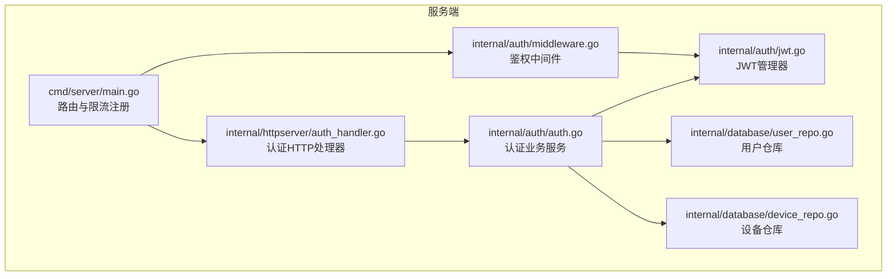
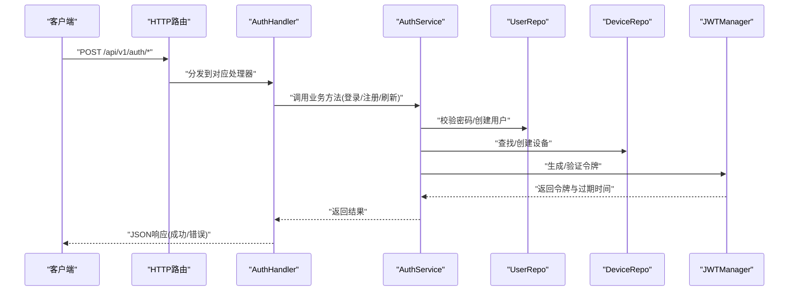
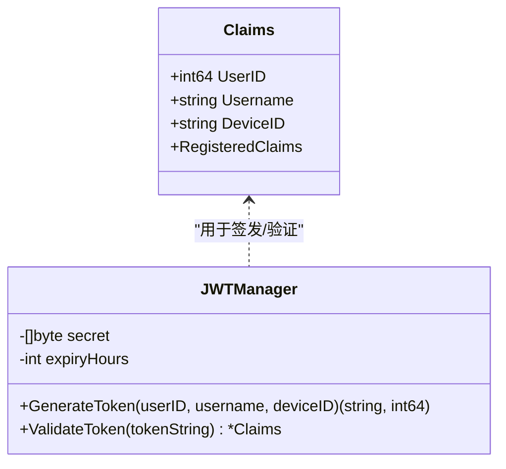
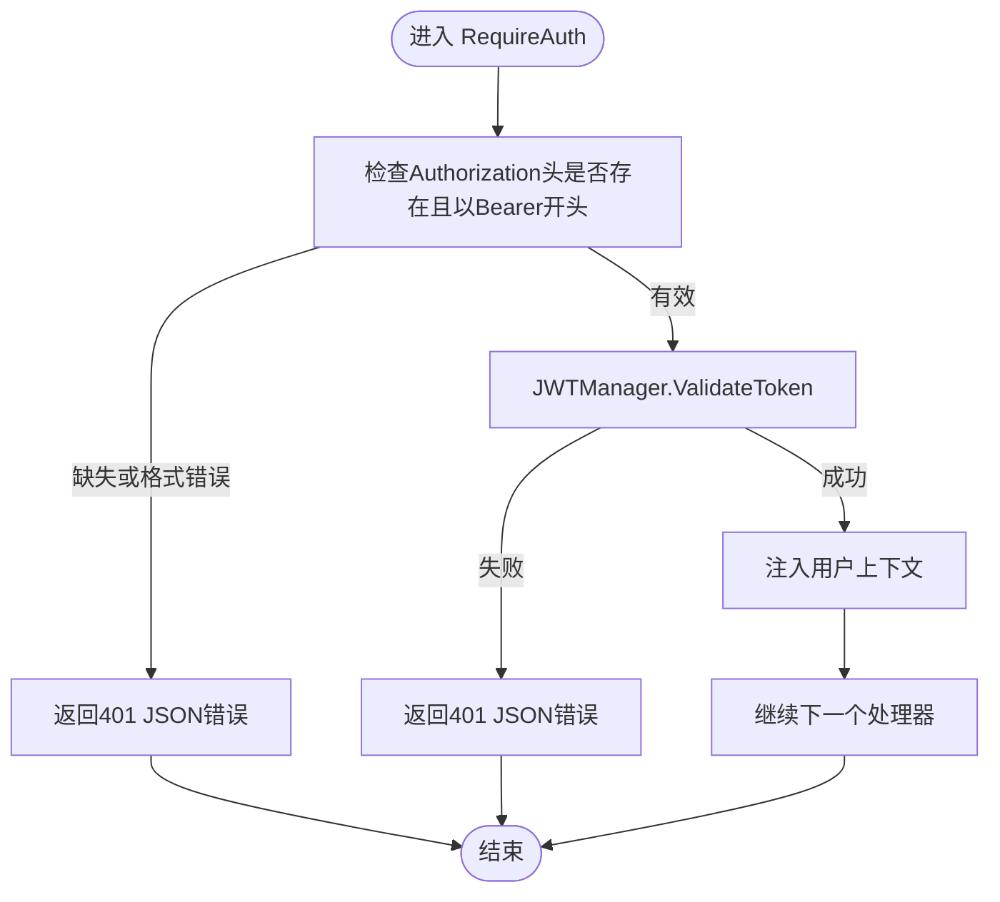
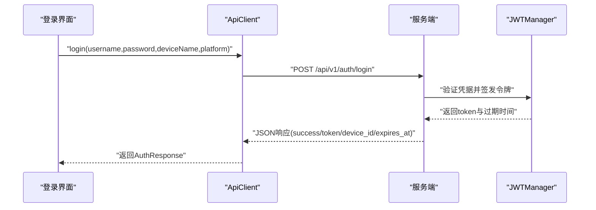
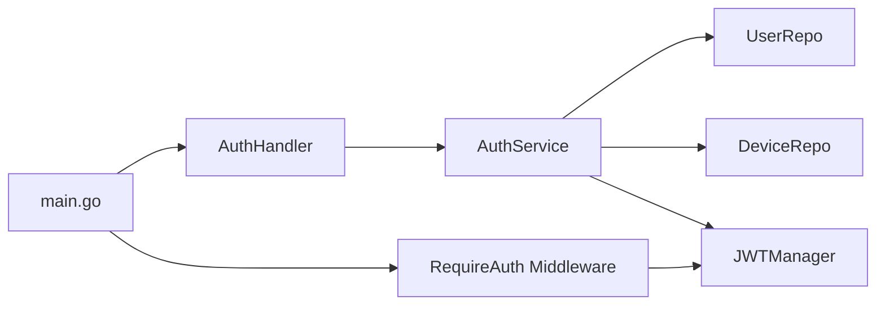

# 认证端点

<cite>
**本文引用的文件**
- [auth.go](file://clipSync-server/internal/auth/auth.go)
- [jwt.go](file://clipSync-server/internal/auth/jwt.go)
- [middleware.go](file://clipSync-server/internal/auth/middleware.go)
- [auth_handler.go](file://clipSync-server/internal/httpserver/auth_handler.go)
- [main.go](file://clipSync-server/cmd/server/main.go)
- [config.yaml](file://clipSync-server/configs/config.yaml)
- [user_repo.go](file://clipSync-server/internal/database/user_repo.go)
- [device_repo.go](file://clipSync-server/internal/database/device_repo.go)
- [ApiClient.kt](file://clipSync-android/app/src/main/java/com/clipsync/app/network/ApiClient.kt)
- [Protocol.kt](file://clipSync-android/app/src/main/java/com/clipsync/app/network/Protocol.kt)
</cite>

## 目录
1. [简介](#简介)
2. [项目结构](#项目结构)
3. [核心组件](#核心组件)
4. [架构总览](#架构总览)
5. [详细组件分析](#详细组件分析)
6. [依赖分析](#依赖分析)
7. [性能考虑](#性能考虑)
8. [故障排除指南](#故障排除指南)
9. [结论](#结论)
10. [附录](#附录)

## 简介
本文件为 ClipSync 服务端认证相关 API 的权威文档，覆盖以下端点：
- POST /api/v1/auth/login：用户登录获取令牌
- POST /api/v1/auth/register：用户注册
- POST /api/v1/auth/refresh：基于旧令牌刷新新令牌

文档详细说明每个端点的请求参数、响应格式、状态码与错误处理；深入解释 JWT 令牌的生成、验证与过期机制；提供完整的请求/响应示例、参数校验规则与安全建议；并给出客户端实现指南，包括令牌存储、自动刷新与错误处理策略。

## 项目结构
认证相关代码主要位于服务端 Go 工程中，关键模块如下：
- 内部包：auth（业务服务、JWT 管理、中间件）
- HTTP 层：httpserver（认证处理器）
- 数据访问层：database（用户与设备仓库）
- 入口：cmd/server（路由注册、限流、启动）

图表来源
- [main.go:74-84](file://clipSync-server/cmd/server/main.go#L74-L84)
- [auth_handler.go:11-19](file://clipSync-server/internal/httpserver/auth_handler.go#L11-L19)
- [auth.go:8-22](file://clipSync-server/internal/auth/auth.go#L8-L22)
- [jwt.go:18-30](file://clipSync-server/internal/auth/jwt.go#L18-L30)
- [middleware.go:22-30](file://clipSync-server/internal/auth/middleware.go#L22-L30)
- [user_repo.go:11-19](file://clipSync-server/internal/database/user_repo.go#L11-L19)
- [device_repo.go:11-18](file://clipSync-server/internal/database/device_repo.go#L11-L18)

章节来源
- [main.go:74-84](file://clipSync-server/cmd/server/main.go#L74-L84)
- [auth_handler.go:11-19](file://clipSync-server/internal/httpserver/auth_handler.go#L11-L19)

## 核心组件
- 认证服务 Service：封装登录、注册、刷新等业务逻辑，协调用户/设备仓库与 JWT 管理器。
- JWT 管理器 JWTManager：负责签发与验证 JWT，设置过期时间与签名密钥。
- 鉴权中间件 Middleware：拦截 HTTP 请求，校验 Authorization 头中的 Bearer 令牌，并将用户上下文注入请求。
- 认证处理器 AuthHandler：实现三个认证端点，执行输入校验、调用服务层并返回统一 JSON 响应。
- 仓库层：UserRepo 与 DeviceRepo 提供用户密码校验、用户名唯一性检查、设备创建与查询等数据操作。

章节来源
- [auth.go:8-22](file://clipSync-server/internal/auth/auth.go#L8-L22)
- [jwt.go:18-30](file://clipSync-server/internal/auth/jwt.go#L18-L30)
- [middleware.go:22-30](file://clipSync-server/internal/auth/middleware.go#L22-L30)
- [auth_handler.go:11-19](file://clipSync-server/internal/httpserver/auth_handler.go#L11-L19)
- [user_repo.go:11-19](file://clipSync-server/internal/database/user_repo.go#L11-L19)
- [device_repo.go:11-18](file://clipSync-server/internal/database/device_repo.go#L11-L18)

## 架构总览
下图展示认证端到端流程：客户端发起认证请求 → HTTP 路由 → 认证处理器 → 业务服务 → 仓库层 → JWT 管理器；后续受保护资源通过中间件进行鉴权。

图表来源
- [main.go:82-84](file://clipSync-server/cmd/server/main.go#L82-L84)
- [auth_handler.go:63-109](file://clipSync-server/internal/httpserver/auth_handler.go#L63-L109)
- [auth_handler.go:111-175](file://clipSync-server/internal/httpserver/auth_handler.go#L111-L175)
- [auth_handler.go:177-208](file://clipSync-server/internal/httpserver/auth_handler.go#L177-L208)
- [auth.go:31-65](file://clipSync-server/internal/auth/auth.go#L31-L65)
- [auth.go:67-116](file://clipSync-server/internal/auth/auth.go#L67-L116)
- [auth.go:118-131](file://clipSync-server/internal/auth/auth.go#L118-L131)
- [jwt.go:32-55](file://clipSync-server/internal/auth/jwt.go#L32-L55)
- [jwt.go:57-75](file://clipSync-server/internal/auth/jwt.go#L57-L75)
- [user_repo.go:65-80](file://clipSync-server/internal/database/user_repo.go#L65-L80)
- [device_repo.go:21-42](file://clipSync-server/internal/database/device_repo.go#L21-L42)

## 详细组件分析

### JWT 令牌模型与生命周期
- Claims 结构包含用户标识、用户名、设备 ID 以及标准声明（签发时间、过期时间、签发者）。
- 令牌签发时设置过期时间为当前时间加上配置的小时数；验证时使用 HS256 签名与预设密钥进行解析与校验。
- 过期后刷新接口会拒绝旧令牌并返回相应错误。

图表来源
- [jwt.go:10-16](file://clipSync-server/internal/auth/jwt.go#L10-L16)
- [jwt.go:18-30](file://clipSync-server/internal/auth/jwt.go#L18-L30)
- [jwt.go:32-55](file://clipSync-server/internal/auth/jwt.go#L32-L55)
- [jwt.go:57-75](file://clipSync-server/internal/auth/jwt.go#L57-L75)

章节来源
- [jwt.go:10-16](file://clipSync-server/internal/auth/jwt.go#L10-L16)
- [jwt.go:32-55](file://clipSync-server/internal/auth/jwt.go#L32-L55)
- [jwt.go:57-75](file://clipSync-server/internal/auth/jwt.go#L57-L75)
- [config.yaml:12-16](file://clipSync-server/configs/config.yaml#L12-L16)

### 鉴权中间件
- 中间件从 Authorization 头提取 Bearer 令牌并调用 JWT 管理器进行验证。
- 验证失败时返回统一错误结构；验证成功则将用户上下文写入请求上下文，供后续处理器使用。

图表来源
- [middleware.go:32-61](file://clipSync-server/internal/auth/middleware.go#L32-L61)
- [middleware.go:102-110](file://clipSync-server/internal/auth/middleware.go#L102-L110)

章节来源
- [middleware.go:32-61](file://clipSync-server/internal/auth/middleware.go#L32-L61)
- [middleware.go:102-110](file://clipSync-server/internal/auth/middleware.go#L102-L110)

### 认证端点定义与行为

#### POST /api/v1/auth/login
- 功能：用户凭据验证，若通过则创建或复用设备并签发令牌。
- 请求体字段
  - username: 字符串，必填
  - password: 字符串，必填
  - device_name: 字符串，必填
  - platform: 字符串，必填
- 成功响应字段
  - success: 布尔值，true
  - token: 字符串，JWT 令牌
  - device_id: 字符串，设备ID
  - expires_at: 数字，毫秒级时间戳，表示过期时间
- 状态码
  - 200 OK：登录成功
  - 400 Bad Request：请求体无效或缺少必要字段
  - 401 Unauthorized：凭据无效
  - 500 Internal Server Error：服务器内部错误
- 错误码
  - INVALID_CREDENTIALS：用户名或密码错误
  - INVALID_PAYLOAD：请求体格式或字段不合法
  - INTERNAL_ERROR：服务器内部错误

章节来源
- [auth_handler.go:63-109](file://clipSync-server/internal/httpserver/auth_handler.go#L63-L109)
- [auth.go:67-116](file://clipSync-server/internal/auth/auth.go#L67-L116)
- [user_repo.go:65-80](file://clipSync-server/internal/database/user_repo.go#L65-L80)
- [device_repo.go:21-42](file://clipSync-server/internal/database/device_repo.go#L21-L42)

#### POST /api/v1/auth/register
- 功能：注册新用户并创建设备，随后签发令牌。
- 请求体字段
  - username: 字符串，必填，长度3~32字符
  - password: 字符串，必填，至少8位，包含字母与数字
  - device_name: 字符串，必填
  - platform: 字符串，必填
- 成功响应字段
  - success: 布尔值，true
  - token: 字符串，JWT 令牌
  - device_id: 字符串，设备ID
  - expires_at: 数字，毫秒级时间戳，表示过期时间
- 状态码
  - 201 Created：注册成功
  - 400 Bad Request：请求体无效或密码/用户名不符合要求
  - 409 Conflict：用户名已存在
  - 500 Internal Server Error：服务器内部错误
- 错误码
  - INVALID_PAYLOAD：用户名或密码不符合规则
  - USERNAME_EXISTS：用户名已被占用
  - INTERNAL_ERROR：服务器内部错误

章节来源
- [auth_handler.go:111-175](file://clipSync-server/internal/httpserver/auth_handler.go#L111-L175)
- [auth.go:31-65](file://clipSync-server/internal/auth/auth.go#L31-L65)
- [user_repo.go:82-90](file://clipSync-server/internal/database/user_repo.go#L82-L90)
- [device_repo.go:21-42](file://clipSync-server/internal/database/device_repo.go#L21-L42)

#### POST /api/v1/auth/refresh
- 功能：对有效的旧令牌进行刷新，返回新的令牌与过期时间。
- 请求头
  - Authorization: Bearer <token>，必填且必须以 Bearer 开头
- 成功响应字段
  - success: 布尔值，true
  - token: 字符串，新的 JWT 令牌
  - expires_at: 数字，毫秒级时间戳，表示新令牌过期时间
- 状态码
  - 200 OK：刷新成功
  - 400 Bad Request：缺少或格式不正确的 Authorization 头
  - 401 Unauthorized：令牌无效或已过期
  - 500 Internal Server Error：服务器内部错误
- 错误码
  - AUTH_FAILED：缺少或格式不正确的授权头
  - TOKEN_EXPIRED：旧令牌无效或已过期
  - INTERNAL_ERROR：服务器内部错误

章节来源
- [auth_handler.go:177-208](file://clipSync-server/internal/httpserver/auth_handler.go#L177-L208)
- [auth.go:118-131](file://clipSync-server/internal/auth/auth.go#L118-L131)
- [jwt.go:57-75](file://clipSync-server/internal/auth/jwt.go#L57-L75)

### 参数验证规则
- 登录/注册
  - 所有字段均不能为空字符串
  - username 长度范围：3~32
  - password 长度至少8位，必须同时包含字母与数字
- 刷新
  - Authorization 头必须存在且以 "Bearer " 开头

章节来源
- [auth_handler.go:79-85](file://clipSync-server/internal/httpserver/auth_handler.go#L79-L85)
- [auth_handler.go:127-133](file://clipSync-server/internal/httpserver/auth_handler.go#L127-L133)
- [auth_handler.go:184-191](file://clipSync-server/internal/httpserver/auth_handler.go#L184-L191)
- [auth_handler.go:29-50](file://clipSync-server/internal/httpserver/auth_handler.go#L29-L50)
- [auth_handler.go:52-61](file://clipSync-server/internal/httpserver/auth_handler.go#L52-L61)

### 响应与错误格式
- 统一响应结构
  - 成功：success=true，携带业务数据
  - 失败：success=false，携带 error 与 message（如适用）
- 错误码
  - INVALID_PAYLOAD：请求体无效或字段不合法
  - INVALID_CREDENTIALS：用户名或密码错误
  - USERNAME_EXISTS：用户名已存在
  - AUTH_FAILED：缺少或格式不正确的授权头
  - TOKEN_EXPIRED：令牌无效或已过期
  - INTERNAL_ERROR：服务器内部错误

章节来源
- [auth_handler.go:70-109](file://clipSync-server/internal/httpserver/auth_handler.go#L70-L109)
- [auth_handler.go:118-175](file://clipSync-server/internal/httpserver/auth_handler.go#L118-L175)
- [auth_handler.go:193-208](file://clipSync-server/internal/httpserver/auth_handler.go#L193-L208)
- [middleware.go:102-110](file://clipSync-server/internal/auth/middleware.go#L102-L110)

### 客户端实现指南（Android 示例）
- 使用 ApiClient 发起认证请求
  - login：POST /api/v1/auth/login
  - register：POST /api/v1/auth/register
  - refreshToken：POST /api/v1/auth/refresh（需在请求头添加 Authorization: Bearer <token>）
- 数据模型
  - LoginRequest/RegisterRequest：包含 username、password、device_name、platform
  - AuthResponse：包含 success、token、device_id、expires_at、error
- 设备列表与注销
  - getDevices：GET /api/v1/devices（需要 Bearer 令牌）
  - unregisterDevice：DELETE /api/v1/devices/{device_id}（需要 Bearer 令牌）
- WebSocket 认证
  - 使用 WsMessageBuilder.auth(token, deviceName) 构造消息体，发送类型为 Auth 的消息完成握手

图表来源
- [ApiClient.kt:23-32](file://clipSync-android/app/src/main/java/com/clipsync/app/network/ApiClient.kt#L23-L32)
- [auth_handler.go:63-109](file://clipSync-server/internal/httpserver/auth_handler.go#L63-L109)
- [jwt.go:32-55](file://clipSync-server/internal/auth/jwt.go#L32-L55)

章节来源
- [ApiClient.kt:14-142](file://clipSync-android/app/src/main/java/com/clipsync/app/network/ApiClient.kt#L14-L142)
- [Protocol.kt:173-196](file://clipSync-android/app/src/main/java/com/clipsync/app/network/Protocol.kt#L173-L196)
- [Protocol.kt:210-218](file://clipSync-android/app/src/main/java/com/clipsync/app/network/Protocol.kt#L210-L218)

## 依赖分析
- 认证处理器依赖认证服务；认证服务依赖用户/设备仓库与 JWT 管理器。
- HTTP 路由在入口处注册认证端点并应用限流中间件。
- 受保护资源通过鉴权中间件进行统一鉴权。

图表来源
- [auth_handler.go:11-19](file://clipSync-server/internal/httpserver/auth_handler.go#L11-L19)
- [auth.go:8-22](file://clipSync-server/internal/auth/auth.go#L8-L22)
- [main.go:82-84](file://clipSync-server/cmd/server/main.go#L82-L84)
- [middleware.go:22-30](file://clipSync-server/internal/auth/middleware.go#L22-L30)

章节来源
- [auth_handler.go:11-19](file://clipSync-server/internal/httpserver/auth_handler.go#L11-L19)
- [auth.go:8-22](file://clipSync-server/internal/auth/auth.go#L8-L22)
- [main.go:82-84](file://clipSync-server/cmd/server/main.go#L82-L84)
- [middleware.go:22-30](file://clipSync-server/internal/auth/middleware.go#L22-L30)

## 性能考虑
- 限流策略：认证端点采用每 IP 每分钟最多 10 次请求的速率限制，有助于缓解暴力破解与滥用。
- 密码哈希：使用 bcrypt 对密码进行加盐哈希存储，降低泄露风险。
- 令牌有效期：默认 30 天，建议生产环境根据安全策略调整；过期后通过刷新接口续期。
- 数据库索引：建议在 users.username 与 devices.id 上建立索引以提升查询性能。

章节来源
- [main.go:77-78](file://clipSync-server/cmd/server/main.go#L77-L78)
- [user_repo.go:21-47](file://clipSync-server/internal/database/user_repo.go#L21-L47)
- [config.yaml:12-16](file://clipSync-server/configs/config.yaml#L12-L16)

## 故障排除指南
- 400 错误（INVALID_PAYLOAD）
  - 检查请求体是否为合法 JSON，字段是否齐全且符合长度/格式要求。
- 401 错误（AUTH_FAILED/TOKEN_EXPIRED）
  - 确认 Authorization 头是否以 "Bearer " 开头；检查令牌是否过期；确认服务端 JWT 密钥与过期时间配置正确。
- 409 错误（USERNAME_EXISTS）
  - 用户名已被占用，请更换用户名后重试。
- 500 错误（INTERNAL_ERROR）
  - 查看服务端日志定位具体异常；检查数据库连接与迁移是否成功。

章节来源
- [auth_handler.go:70-109](file://clipSync-server/internal/httpserver/auth_handler.go#L70-L109)
- [auth_handler.go:118-175](file://clipSync-server/internal/httpserver/auth_handler.go#L118-L175)
- [auth_handler.go:193-208](file://clipSync-server/internal/httpserver/auth_handler.go#L193-L208)
- [middleware.go:32-61](file://clipSync-server/internal/auth/middleware.go#L32-L61)

## 结论
本文档系统化地阐述了 ClipSync 的认证端点与 JWT 机制，提供了清晰的请求/响应规范、参数校验规则、错误处理策略与客户端实现参考。建议在生产环境中妥善保管 JWT 密钥、合理设置过期时间与限流阈值，并在客户端实现令牌持久化、自动刷新与错误恢复策略。

## 附录

### 配置项摘要
- jwt_secret：JWT 签名密钥（生产环境务必修改）
- jwt_expiry_hours：令牌过期小时数，默认 720（即 30 天）

章节来源
- [config.yaml:12-16](file://clipSync-server/configs/config.yaml#L12-L16)