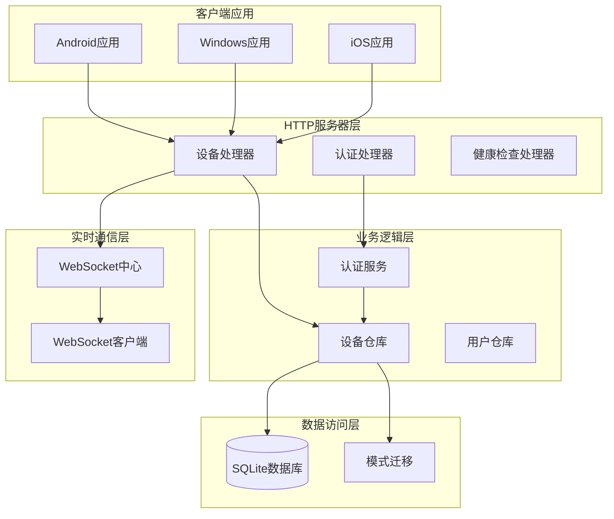
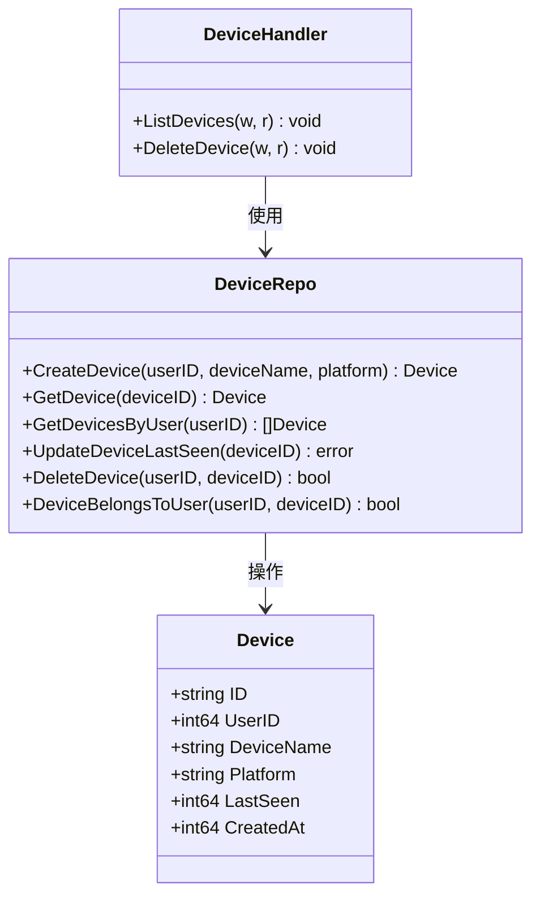
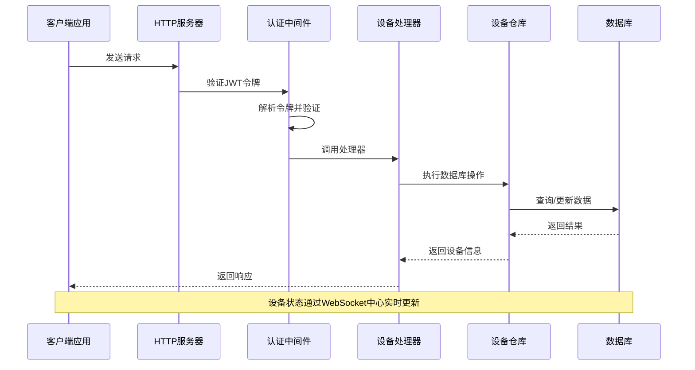
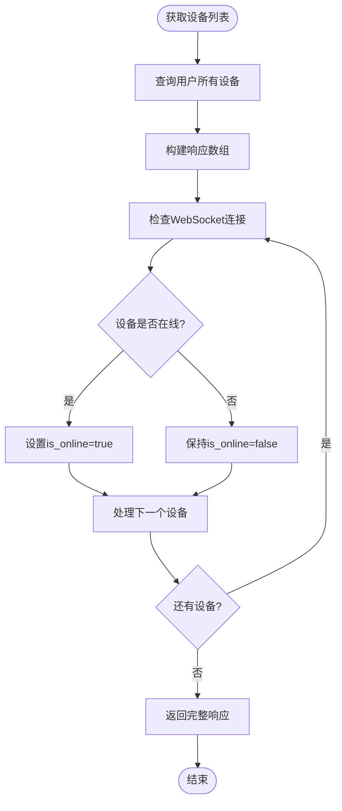
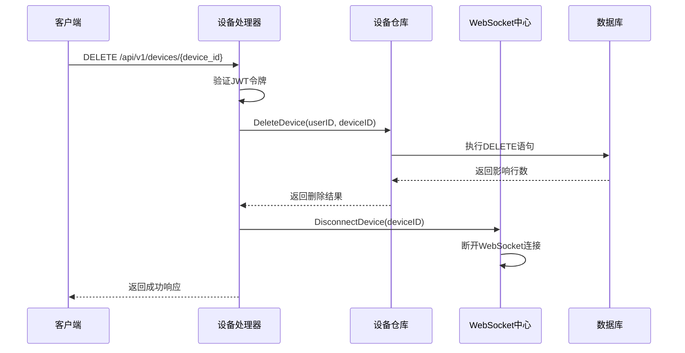
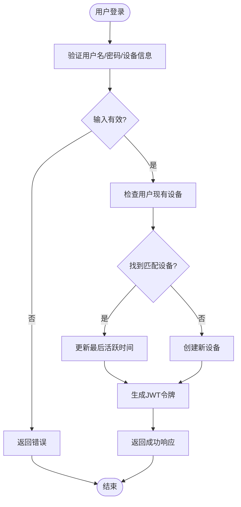
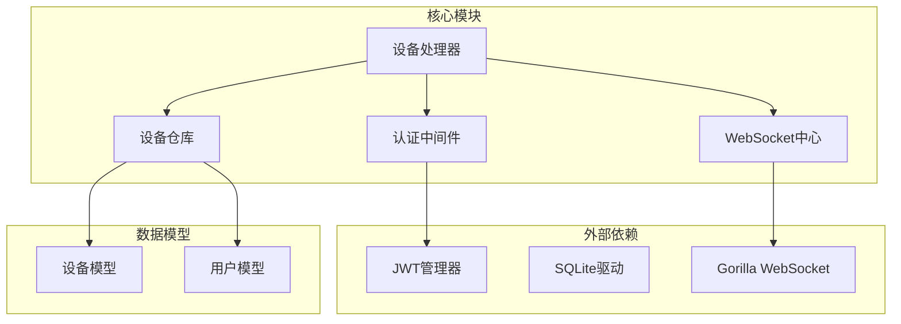
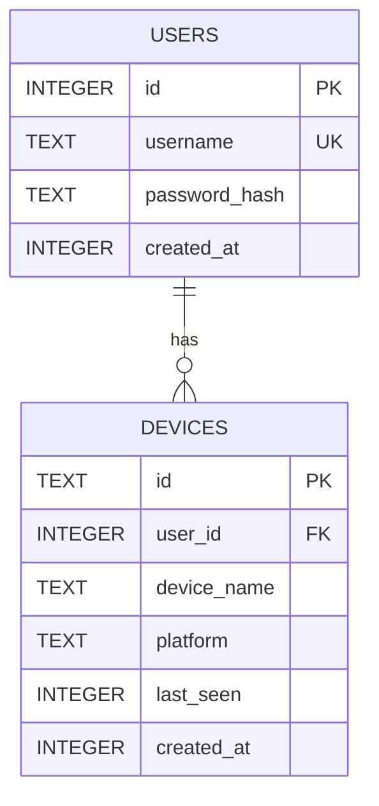

# 设备管理端点

<cite>
**本文档引用的文件**
- [device_handler.go](file://clipSync-server/internal/httpserver/device_handler.go)
- [device_repo.go](file://clipSync-server/internal/database/device_repo.go)
- [models.go](file://clipSync-server/internal/database/models.go)
- [middleware.go](file://clipSync-server/internal/auth/middleware.go)
- [main.go](file://clipSync-server/cmd/server/main.go)
- [hub.go](file://clipSync-server/internal/websocket/hub.go)
- [migrations.go](file://clipSync-server/internal/database/migrations.go)
- [auth.go](file://clipSync-server/internal/auth/auth.go)
- [config.yaml](file://clipSync-server/configs/config.yaml)
- [auth_handler.go](file://clipSync-server/internal/httpserver/auth_handler.go)
- [http-api.schema.json](file://protocol/http-api.schema.json)
</cite>

## 目录
1. [简介](#简介)
2. [项目结构](#项目结构)
3. [核心组件](#核心组件)
4. [架构概览](#架构概览)
5. [详细组件分析](#详细组件分析)
6. [依赖关系分析](#依赖关系分析)
7. [性能考虑](#性能考虑)
8. [故障排除指南](#故障排除指南)
9. [结论](#结论)

## 简介

本文档详细描述了ClipSync服务器中的设备管理端点，包括设备注册流程、设备信息字段、状态管理和生命周期管理。系统支持两个主要的HTTP端点：
- GET /api/v1/devices：获取用户的所有已注册设备列表
- DELETE /api/v1/devices/{device_id}：注销指定设备

设备管理功能通过JWT令牌进行身份验证，确保设备与用户之间的正确关联和数据隔离。

## 项目结构

ClipSync服务器采用分层架构设计，设备管理功能位于HTTP服务器层，通过数据库仓库模式访问底层存储。



**图表来源**
- [main.go:74-93](file://clipSync-server/cmd/server/main.go#L74-L93)
- [device_handler.go:11-23](file://clipSync-server/internal/httpserver/device_handler.go#L11-L23)
- [device_repo.go:11-19](file://clipSync-server/internal/database/device_repo.go#L11-L19)

**章节来源**
- [main.go:74-93](file://clipSync-server/cmd/server/main.go#L74-L93)
- [device_handler.go:11-23](file://clipSync-server/internal/httpserver/device_handler.go#L11-L23)

## 核心组件

### 设备模型定义

设备在系统中以结构化方式表示，包含以下关键字段：



**图表来源**
- [models.go:11-19](file://clipSync-server/internal/database/models.go#L11-L19)
- [device_repo.go:11-19](file://clipSync-server/internal/database/device_repo.go#L11-L19)
- [device_handler.go:11-23](file://clipSync-server/internal/httpserver/device_handler.go#L11-L23)

### 设备字段详解

| 字段名 | 类型 | 描述 | 唯一性约束 |
|--------|------|------|------------|
| device_id | string | 设备唯一标识符，格式为"dev-{hex}" | 主键，全局唯一 |
| device_name | string | 设备显示名称 | 无约束 |
| platform | string | 平台类型（windows/android/macos/ios） | 无约束 |
| last_seen | int64 | 最后活跃时间戳（毫秒） | 自动更新 |
| created_at | int64 | 设备创建时间戳（毫秒） | 自动设置 |

**章节来源**
- [models.go:11-19](file://clipSync-server/internal/database/models.go#L11-L19)
- [migrations.go:35-44](file://clipSync-server/internal/database/migrations.go#L35-L44)

## 架构概览

设备管理系统采用分层架构，确保职责分离和可维护性。



**图表来源**
- [main.go:90-93](file://clipSync-server/cmd/server/main.go#L90-L93)
- [middleware.go:32-61](file://clipSync-server/internal/auth/middleware.go#L32-L61)
- [device_handler.go:25-82](file://clipSync-server/internal/httpserver/device_handler.go#L25-L82)

## 详细组件分析

### 设备列表端点（GET /api/v1/devices）

#### 请求规范

**端点**: `GET /api/v1/devices`
**认证**: 必需（Bearer Token）
**权限**: 用户必须已登录

#### 请求头
- Authorization: Bearer {JWT_TOKEN}

#### 成功响应
- 状态码: 200 OK
- 内容类型: application/json

#### 响应体结构
```json
{
  "devices": [
    {
      "device_id": "string",
      "device_name": "string", 
      "platform": "string",
      "last_seen": integer,
      "is_online": boolean,
      "created_at": integer
    }
  ]
}
```

#### 在线状态检测机制

系统通过WebSocket连接状态实时检测设备在线状态：



**图表来源**
- [device_handler.go:49-77](file://clipSync-server/internal/httpserver/device_handler.go#L49-L77)
- [hub.go:168-179](file://clipSync-server/internal/websocket/hub.go#L168-L179)

#### 错误处理

| 状态码 | 错误代码 | 描述 |
|--------|----------|------|
| 401 | AUTH_FAILED | 未提供有效令牌或令牌无效 |
| 405 | METHOD_NOT_ALLOWED | 请求方法不被允许 |
| 500 | INTERNAL_ERROR | 服务器内部错误 |

**章节来源**
- [device_handler.go:25-82](file://clipSync-server/internal/httpserver/device_handler.go#L25-L82)
- [http-api.schema.json:144-176](file://protocol/http-api.schema.json#L144-L176)

### 设备注销端点（DELETE /api/v1/devices/{device_id}）

#### 请求规范

**端点**: `DELETE /api/v1/devices/{device_id}`
**认证**: 必需（Bearer Token）
**权限**: 设备必须属于当前用户

#### 路径参数
- device_id: 设备唯一标识符

#### 成功响应
- 状态码: 200 OK
- 内容类型: application/json
- 响应体: `{ "success": true }`

#### 删除流程



**图表来源**
- [device_handler.go:84-136](file://clipSync-server/internal/httpserver/device_handler.go#L84-L136)
- [device_repo.go:92-106](file://clipSync-server/internal/database/device_repo.go#L92-L106)
- [hub.go:155-166](file://clipSync-server/internal/websocket/hub.go#L155-L166)

#### 权限验证机制

系统通过以下步骤验证设备所有权：

1. **JWT令牌解析**: 从Authorization头提取并验证JWT令牌
2. **用户ID提取**: 从令牌声明中获取用户ID
3. **设备所有权检查**: 验证目标设备确实属于该用户
4. **执行删除操作**: 如果验证通过则执行删除

#### 错误处理

| 状态码 | 错误代码 | 描述 |
|--------|----------|------|
| 400 | INVALID_PAYLOAD | 缺少或无效的设备ID |
| 401 | AUTH_FAILED | 令牌验证失败 |
| 404 | DEVICE_NOT_FOUND | 设备不存在或不属于当前用户 |
| 405 | METHOD_NOT_ALLOWED | 请求方法不被允许 |
| 500 | INTERNAL_ERROR | 服务器内部错误 |

**章节来源**
- [device_handler.go:84-136](file://clipSync-server/internal/httpserver/device_handler.go#L84-L136)
- [http-api.schema.json:178-209](file://protocol/http-api.schema.json#L178-L209)

### 设备注册流程

设备注册通过认证流程自动完成，无需单独的注册端点。

#### 注册流程图



**图表来源**
- [auth.go:67-116](file://clipSync-server/internal/auth/auth.go#L67-L116)
- [auth.go:32-65](file://clipSync-server/internal/auth/auth.go#L32-L65)

#### 注册响应结构
```json
{
  "success": true,
  "token": "string",
  "device_id": "string",
  "expires_at": integer
}
```

**章节来源**
- [auth.go:67-116](file://clipSync-server/internal/auth/auth.go#L67-L116)
- [auth_handler.go:63-109](file://clipSync-server/internal/httpserver/auth_handler.go#L63-L109)

## 依赖关系分析

### 组件依赖图



**图表来源**
- [device_handler.go:3-9](file://clipSync-server/internal/httpserver/device_handler.go#L3-L9)
- [device_repo.go:3-9](file://clipSync-server/internal/database/device_repo.go#L3-L9)
- [main.go:4-8](file://clipSync-server/cmd/server/main.go#L4-L8)

### 数据库模式设计

设备表采用外键约束确保数据完整性：



**图表来源**
- [migrations.go:28-44](file://clipSync-server/internal/database/migrations.go#L28-L44)

**章节来源**
- [migrations.go:28-44](file://clipSync-server/internal/database/migrations.go#L28-L44)
- [device_repo.go:92-106](file://clipSync-server/internal/database/device_repo.go#L92-L106)

## 性能考虑

### 连接池和并发处理

系统使用Gorilla WebSocket库处理高并发连接，WebSocket中心通过通道模式实现高效的消息传递。

### 数据库优化

- **索引优化**: 为`devices.user_id`建立索引以加速用户设备查询
- **事务处理**: 所有数据库操作都在事务中执行以确保一致性
- **连接复用**: 使用单个数据库连接池减少连接开销

### 缓存策略

- **在线状态缓存**: WebSocket中心维护在线设备映射表
- **JWT令牌缓存**: 认证中间件缓存令牌验证结果

## 故障排除指南

### 常见问题诊断

#### 设备列表为空
**可能原因**:
- 用户尚未注册任何设备
- JWT令牌过期或无效
- 数据库连接问题

**解决方案**:
1. 验证JWT令牌有效性
2. 确认用户已完成至少一次登录
3. 检查数据库连接状态

#### 设备注销失败
**可能原因**:
- 设备ID格式不正确
- 设备不属于当前用户
- 数据库操作失败

**解决方案**:
1. 验证设备ID格式（dev-前缀+十六进制字符串）
2. 确认设备所有权
3. 检查数据库日志

#### 在线状态检测异常
**可能原因**:
- WebSocket连接中断
- 心跳超时设置过短
- 网络延迟过高

**解决方案**:
1. 检查WebSocket服务器状态
2. 调整心跳超时配置
3. 监控网络连接质量

**章节来源**
- [hub.go:155-166](file://clipSync-server/internal/websocket/hub.go#L155-L166)
- [config.yaml:27-29](file://clipSync-server/configs/config.yaml#L27-L29)

## 结论

ClipSync的设备管理端点提供了完整的设备生命周期管理功能，包括设备注册、列表查询、状态检测和注销操作。系统通过JWT令牌确保安全性和数据隔离，通过WebSocket实现实时状态同步。

### 关键特性总结

1. **安全性**: JWT令牌认证确保设备与用户关联的完整性
2. **实时性**: WebSocket连接提供准确的在线状态检测
3. **可靠性**: 外键约束和事务处理保证数据一致性
4. **可扩展性**: 分层架构支持功能扩展和性能优化

### 最佳实践建议

1. **令牌管理**: 定期刷新JWT令牌以维持会话有效性
2. **设备监控**: 定期清理长时间未使用的设备
3. **性能监控**: 监控WebSocket连接数量和数据库查询性能
4. **安全审计**: 记录设备注册和注销操作的日志