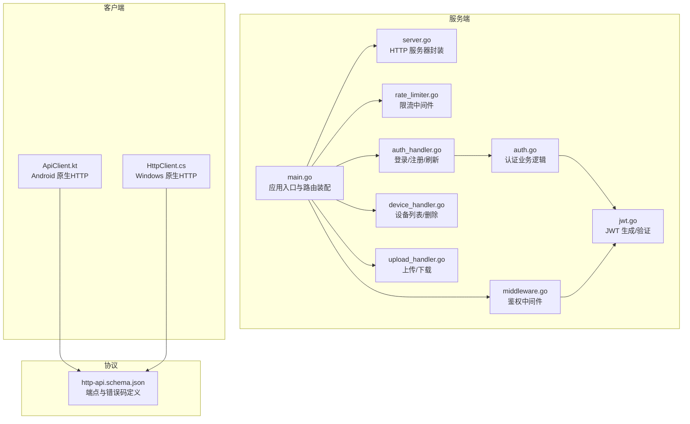
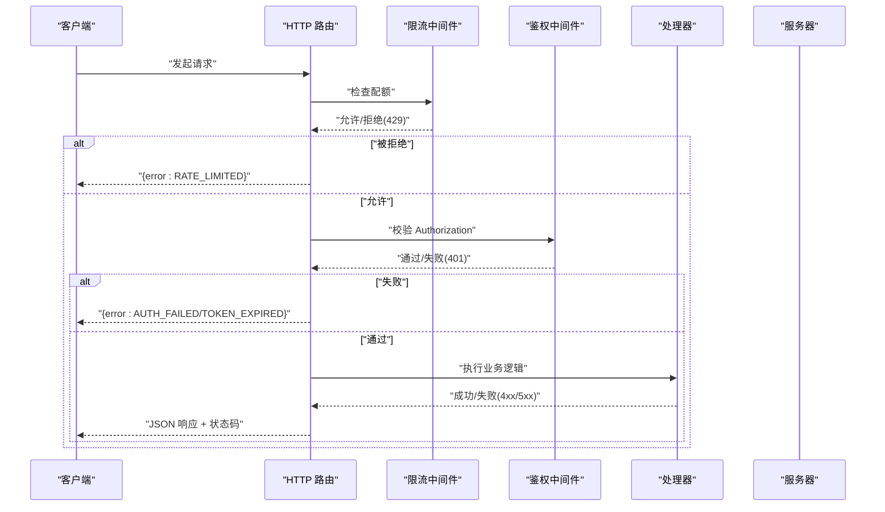
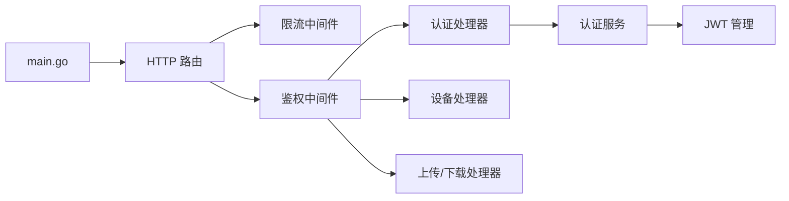

# 错误处理和响应码

<cite>
**本文引用的文件**
- [clipSync-server/cmd/server/main.go](file://clipSync-server/cmd/server/main.go)
- [clipSync-server/internal/httpserver/server.go](file://clipSync-server/internal/httpserver/server.go)
- [clipSync-server/internal/httpserver/auth_handler.go](file://clipSync-server/internal/httpserver/auth_handler.go)
- [clipSync-server/internal/httpserver/device_handler.go](file://clipSync-server/internal/httpserver/device_handler.go)
- [clipSync-server/internal/httpserver/upload_handler.go](file://clipSync-server/internal/httpserver/upload_handler.go)
- [clipSync-server/internal/httpserver/rate_limiter.go](file://clipSync-server/internal/httpserver/rate_limiter.go)
- [clipSync-server/internal/auth/middleware.go](file://clipSync-server/internal/auth/middleware.go)
- [clipSync-server/internal/auth/auth.go](file://clipSync-server/internal/auth/auth.go)
- [clipSync-server/internal/auth/jwt.go](file://clipSync-server/internal/auth/jwt.go)
- [protocol/http-api.schema.json](file://protocol/http-api.schema.json)
- [clipSync-android/app/src/main/java/com/clipsync/app/network/ApiClient.kt](file://clipSync-android/app/src/main/java/com/clipsync/app/network/ApiClient.kt)
- [clipSync-windows/ClipSync.WPF/Network/HttpClient.cs](file://clipSync-windows/ClipSync.WPF/Network/HttpClient.cs)
</cite>

## 目录
1. [简介](#简介)
2. [项目结构](#项目结构)
3. [核心组件](#核心组件)
4. [架构总览](#架构总览)
5. [详细组件分析](#详细组件分析)
6. [依赖分析](#依赖分析)
7. [性能考虑](#性能考虑)
8. [故障排查指南](#故障排查指南)
9. [结论](#结论)
10. [附录](#附录)

## 简介
本文件系统性梳理 ClipSync 服务端与协议中定义的 HTTP API 错误处理与响应码规范，覆盖 400 客户端错误、401 认证错误、404 资源错误、409 冲突错误、429 限流错误以及 500 服务器错误，并给出触发条件、响应格式、处理建议、最佳实践、重试策略与用户体验优化方案。同时提供客户端错误处理指南与调试技巧，帮助开发者在多端实现一致且可预期的错误体验。

## 项目结构
- 服务端入口负责加载配置、初始化数据库与迁移、构建路由、挂载鉴权中间件与限流器，并启动 HTTP 与 WebSocket 服务。
- HTTP 层包含鉴权、设备管理、上传下载等处理器；鉴权中间件负责校验 Bearer Token 并注入用户上下文。
- 协议层通过 JSON Schema 明确定义了各端点的请求/响应契约与错误码映射。
- 客户端（Android、Windows）基于原生网络栈实现，统一解析服务端返回的错误码并进行相应处理。

**图表来源**
- [clipSync-server/cmd/server/main.go:74-106](file://clipSync-server/cmd/server/main.go#L74-L106)
- [clipSync-server/internal/httpserver/server.go:18-41](file://clipSync-server/internal/httpserver/server.go#L18-L41)
- [clipSync-server/internal/httpserver/rate_limiter.go:71-85](file://clipSync-server/internal/httpserver/rate_limiter.go#L71-L85)
- [clipSync-server/internal/auth/middleware.go:32-61](file://clipSync-server/internal/auth/middleware.go#L32-L61)
- [protocol/http-api.schema.json:7-292](file://protocol/http-api.schema.json#L7-L292)

**章节来源**
- [clipSync-server/cmd/server/main.go:74-106](file://clipSync-server/cmd/server/main.go#L74-L106)
- [protocol/http-api.schema.json:7-292](file://protocol/http-api.schema.json#L7-L292)

## 核心组件
- 鉴权中间件：校验 Authorization 头、解析并验证 JWT，失败时返回 401 错误码（AUTH_FAILED/TOKEN_EXPIRED）。
- 认证处理器：登录/注册/刷新接口，返回统一 JSON 结构，错误时携带自定义错误码。
- 设备处理器：列出与删除设备，删除不存在设备返回 404 DEVICE_NOT_FOUND。
- 上传处理器：限制请求体大小，解析 multipart 表单，校验 checksum，返回 413 CONTENT_TOO_LARGE 或 400 INVALID_PAYLOAD。
- 下载处理器：校验路径参数与访问权限，返回 404 FILE_NOT_FOUND 或 403 ACCESS_DENIED。
- 限流中间件：基于滑动窗口的 IP 级限流，超限时返回 429 RATE_LIMITED。
- 服务器封装：统一读写超时与优雅关闭。

**章节来源**
- [clipSync-server/internal/auth/middleware.go:32-61](file://clipSync-server/internal/auth/middleware.go#L32-L61)
- [clipSync-server/internal/httpserver/auth_handler.go:63-109](file://clipSync-server/internal/httpserver/auth_handler.go#L63-L109)
- [clipSync-server/internal/httpserver/device_handler.go:84-136](file://clipSync-server/internal/httpserver/device_handler.go#L84-L136)
- [clipSync-server/internal/httpserver/upload_handler.go:36-150](file://clipSync-server/internal/httpserver/upload_handler.go#L36-L150)
- [clipSync-server/internal/httpserver/upload_handler.go:152-214](file://clipSync-server/internal/httpserver/upload_handler.go#L152-L214)
- [clipSync-server/internal/httpserver/rate_limiter.go:34-85](file://clipSync-server/internal/httpserver/rate_limiter.go#L34-L85)
- [clipSync-server/internal/httpserver/server.go:27-41](file://clipSync-server/internal/httpserver/server.go#L27-L41)

## 架构总览
下图展示从客户端到服务端的关键调用链与错误码映射，涵盖鉴权、限流、业务处理与响应。

**图表来源**
- [clipSync-server/cmd/server/main.go:77-84](file://clipSync-server/cmd/server/main.go#L77-L84)
- [clipSync-server/internal/httpserver/rate_limiter.go:71-85](file://clipSync-server/internal/httpserver/rate_limiter.go#L71-L85)
- [clipSync-server/internal/auth/middleware.go:32-61](file://clipSync-server/internal/auth/middleware.go#L32-L61)
- [clipSync-server/internal/httpserver/auth_handler.go:63-109](file://clipSync-server/internal/httpserver/auth_handler.go#L63-L109)
- [clipSync-server/internal/httpserver/device_handler.go:84-136](file://clipSync-server/internal/httpserver/device_handler.go#L84-L136)
- [clipSync-server/internal/httpserver/upload_handler.go:36-150](file://clipSync-server/internal/httpserver/upload_handler.go#L36-L150)

## 详细组件分析

### 400 系列：客户端错误
- INVALID_PAYLOAD
  - 触发条件
    - 登录/注册请求体解析失败或字段缺失
    - 上传未提供 file 字段或表单解析失败
    - 删除设备缺少路径参数
  - 响应格式
    - JSON 对象，包含 success=false 与 error=INVALID_PAYLOAD
    - 个别场景携带 message 字段用于提示具体校验失败原因
  - 处理建议
    - 前端严格校验必填字段与格式后再发送
    - 对于注册场景，前端展示密码/用户名强度要求
    - 上传前计算并传入 checksum，避免后续校验失败
  - 参考实现
    - 登录/注册字段校验与错误返回
    - 上传表单解析与字段缺失处理
    - 设备删除路径参数校验

**章节来源**
- [clipSync-server/internal/httpserver/auth_handler.go:70-84](file://clipSync-server/internal/httpserver/auth_handler.go#L70-L84)
- [clipSync-server/internal/httpserver/auth_handler.go:118-133](file://clipSync-server/internal/httpserver/auth_handler.go#L118-L133)
- [clipSync-server/internal/httpserver/upload_handler.go:55-69](file://clipSync-server/internal/httpserver/upload_handler.go#L55-L69)
- [clipSync-server/internal/httpserver/device_handler.go:100-113](file://clipSync-server/internal/httpserver/device_handler.go#L100-L113)

### 401 系列：认证错误
- AUTH_FAILED
  - 触发条件
    - 缺少 Authorization 头或格式不正确（非 Bearer）
    - 中间件无法解析或校验失败
  - 响应格式
    - JSON 对象，success=false，error=AUTH_FAILED
  - 处理建议
    - 引导用户重新登录或检查令牌格式
- TOKEN_EXPIRED
  - 触发条件
    - 刷新接口收到无效或已过期的旧令牌
  - 响应格式
    - JSON 对象，success=false，error=TOKEN_EXPIRED
  - 处理建议
    - 自动跳转登录流程或提示重新授权
- INVALID_CREDENTIALS
  - 触发条件
    - 登录时用户名或密码错误
  - 响应格式
    - JSON 对象，success=false，error=INVALID_CREDENTIALS
  - 处理建议
    - 清空本地存储的令牌，提示用户修正凭据

**章节来源**
- [clipSync-server/internal/auth/middleware.go:32-61](file://clipSync-server/internal/auth/middleware.go#L32-L61)
- [clipSync-server/internal/httpserver/auth_handler.go:177-208](file://clipSync-server/internal/httpserver/auth_handler.go#L177-L208)
- [clipSync-server/internal/auth/auth.go:67-116](file://clipSync-server/internal/auth/auth.go#L67-L116)

### 404 系列：资源错误
- DEVICE_NOT_FOUND
  - 触发条件
    - 删除设备时目标设备不存在或不属于当前用户
  - 响应格式
    - JSON 对象，error=DEVICE_NOT_FOUND
  - 处理建议
    - 提示用户设备可能已被移除，刷新设备列表
- FILE_NOT_FOUND
  - 触发条件
    - 下载文件不存在或与当前用户不匹配
  - 响应格式
    - JSON 对象，success=false/error 字段存在（视端点而定）
  - 处理建议
    - 提示用户文件可能已被清理或更换设备

**章节来源**
- [clipSync-server/internal/httpserver/device_handler.go:123-128](file://clipSync-server/internal/httpserver/device_handler.go#L123-L128)
- [clipSync-server/internal/httpserver/upload_handler.go:186-193](file://clipSync-server/internal/httpserver/upload_handler.go#L186-L193)

### 409 系列：冲突错误
- USERNAME_EXISTS
  - 触发条件
    - 注册时用户名已被占用
  - 响应格式
    - JSON 对象，success=false，error=USERNAME_EXISTS
  - 处理建议
    - 引导用户选择其他用户名或直接登录
- DUPLICATE_CONTENT
  - 协议中定义，但当前服务端未见显式返回该错误码
  - 建议：若未来实现去重校验，按 409 返回

**章节来源**
- [clipSync-server/internal/httpserver/auth_handler.go:154-166](file://clipSync-server/internal/httpserver/auth_handler.go#L154-L166)
- [protocol/http-api.schema.json:288-289](file://protocol/http-api.schema.json#L288-L289)

### 413 系列：请求实体过大
- CONTENT_TOO_LARGE
  - 触发条件
    - 上传文件超过最大尺寸限制（服务端限制）
  - 响应格式
    - JSON 对象，success=false，error=CONTENT_TOO_LARGE
  - 处理建议
    - 前端提示用户压缩文件或分卷上传

**章节来源**
- [clipSync-server/internal/httpserver/upload_handler.go:55-61](file://clipSync-server/internal/httpserver/upload_handler.go#L55-L61)

### 429 系列：限流错误
- RATE_LIMITED
  - 触发条件
    - 同一 IP 在时间窗口内超过请求数阈值（默认 10 次/分钟）
  - 响应格式
    - JSON 对象，success=false，error=RATE_LIMITED，message 提示稍后重试
  - 处理建议
    - 客户端指数退避重试，避免雪崩效应
    - 区分不同端点的限流策略

**章节来源**
- [clipSync-server/internal/httpserver/rate_limiter.go:34-85](file://clipSync-server/internal/httpserver/rate_limiter.go#L34-L85)
- [clipSync-server/cmd/server/main.go:77-84](file://clipSync-server/cmd/server/main.go#L77-L84)

### 500 系列：服务器错误
- INTERNAL_ERROR
  - 触发条件
    - 数据库操作失败、文件系统异常、加密/解密失败等未捕获异常
  - 响应格式
    - JSON 对象，error=INTERNAL_ERROR 或 success=false + error=INTERNAL_ERROR
  - 处理建议
    - 客户端显示通用错误并引导用户重试或联系支持
    - 服务端记录详细日志并监控告警

**章节来源**
- [clipSync-server/internal/httpserver/auth_handler.go:88-100](file://clipSync-server/internal/httpserver/auth_handler.go#L88-L100)
- [clipSync-server/internal/httpserver/auth_handler.go:154-166](file://clipSync-server/internal/httpserver/auth_handler.go#L154-L166)
- [clipSync-server/internal/httpserver/device_handler.go:42-47](file://clipSync-server/internal/httpserver/device_handler.go#L42-L47)
- [clipSync-server/internal/httpserver/upload_handler.go:80-96](file://clipSync-server/internal/httpserver/upload_handler.go#L80-L96)

### 下载端点补充：403 访问拒绝
- ACCESS_DENIED
  - 触发条件
    - 用户尝试下载并非其拥有的文件
  - 响应格式
    - JSON 对象，success=false，error=ACCESS_DENIED
  - 处理建议
    - 提示用户切换账号或确认文件归属

**章节来源**
- [clipSync-server/internal/httpserver/upload_handler.go:194-200](file://clipSync-server/internal/httpserver/upload_handler.go#L194-L200)

## 依赖分析
- 入口层负责装配路由、挂载限流与鉴权中间件，确保所有受保护端点均经过认证。
- 处理器层根据业务逻辑返回对应状态码与错误码，保持响应一致性。
- 协议层统一定义错误码与 HTTP 状态码映射，便于客户端实现一致的错误处理。

**图表来源**
- [clipSync-server/cmd/server/main.go:74-106](file://clipSync-server/cmd/server/main.go#L74-L106)
- [clipSync-server/internal/auth/middleware.go:32-61](file://clipSync-server/internal/auth/middleware.go#L32-L61)
- [clipSync-server/internal/httpserver/rate_limiter.go:71-85](file://clipSync-server/internal/httpserver/rate_limiter.go#L71-L85)

**章节来源**
- [clipSync-server/cmd/server/main.go:74-106](file://clipSync-server/cmd/server/main.go#L74-L106)
- [clipSync-server/internal/auth/middleware.go:32-61](file://clipSync-server/internal/auth/middleware.go#L32-L61)
- [clipSync-server/internal/httpserver/rate_limiter.go:71-85](file://clipSync-server/internal/httpserver/rate_limiter.go#L71-L85)

## 性能考虑
- 限流策略
  - 使用滑动窗口计数器，定期清理过期条目，降低内存占用
  - 建议对不同端点设置差异化阈值（如登录/注册更严格）
- 超时配置
  - 服务器统一设置读取/写入/空闲超时，避免连接泄漏
- 文件上传
  - 使用 MaxBytesReader 限制请求体大小，防止内存膨胀
  - 并行写入磁盘与哈希计算，提升吞吐

**章节来源**
- [clipSync-server/internal/httpserver/rate_limiter.go:22-69](file://clipSync-server/internal/httpserver/rate_limiter.go#L22-L69)
- [clipSync-server/internal/httpserver/server.go:27-34](file://clipSync-server/internal/httpserver/server.go#L27-L34)
- [clipSync-server/internal/httpserver/upload_handler.go:52-53](file://clipSync-server/internal/httpserver/upload_handler.go#L52-L53)
- [clipSync-server/internal/httpserver/upload_handler.go:100-111](file://clipSync-server/internal/httpserver/upload_handler.go#L100-L111)

## 故障排查指南
- 常见问题定位
  - 401 AUTH_FAILED：检查 Authorization 头是否为 Bearer 格式，确认服务端密钥与签发方一致
  - 401 TOKEN_EXPIRED：确认令牌未过期，必要时使用刷新接口获取新令牌
  - 404 DEVICE_NOT_FOUND：确认设备 ID 正确且属于当前用户
  - 413 CONTENT_TOO_LARGE：调整文件大小或分卷上传
  - 429 RATE_LIMITED：降低请求频率或增加退避策略
  - 500 INTERNAL_ERROR：查看服务端日志，关注数据库与文件系统异常
- 客户端调试
  - Android：基于 HttpURLConnection 的 ApiClient 统一抛出 IO 异常，包含 HTTP 状态码与响应体，便于定位
  - Windows：基于 HttpClient 的 AuthResult 统一解析 error 字段，异常时返回连接错误信息
- 协议一致性
  - 使用协议 JSON Schema 校验端点与错误码，确保跨端一致性

**章节来源**
- [clipSync-android/app/src/main/java/com/clipsync/app/network/ApiClient.kt:124-136](file://clipSync-android/app/src/main/java/com/clipsync/app/network/ApiClient.kt#L124-L136)
- [clipSync-windows/ClipSync.WPF/Network/HttpClient.cs:48-82](file://clipSync-windows/ClipSync.WPF/Network/HttpClient.cs#L48-L82)
- [protocol/http-api.schema.json:280-292](file://protocol/http-api.schema.json#L280-L292)

## 结论
本项目在服务端与协议层建立了清晰的错误码体系与响应规范，配合限流与鉴权中间件，能够有效保障系统的稳定性与安全性。客户端应遵循统一的错误码解析与重试策略，提升用户体验与系统韧性。建议持续完善日志与监控，及时发现并修复潜在问题。

## 附录

### 错误码与状态码对照（来自协议）
- AUTH_FAILED → 401
- TOKEN_EXPIRED → 401
- INVALID_CREDENTIALS → 401
- RATE_LIMITED → 429
- INVALID_PAYLOAD → 400
- CONTENT_TOO_LARGE → 413
- DEVICE_NOT_FOUND → 404
- FILE_NOT_FOUND → 404
- ACCESS_DENIED → 403
- INTERNAL_ERROR → 500
- DUPLICATE_CONTENT → 409
- USERNAME_EXISTS → 409

**章节来源**
- [protocol/http-api.schema.json:280-292](file://protocol/http-api.schema.json#L280-L292)

### 最佳实践与重试策略
- 重试策略
  - 对 408/409/429/500 建议指数退避重试（如 1s、2s、4s…），上限不超过 60s
  - 对 400/401/403 不建议自动重试，需提示用户修正
- 用户体验
  - 显示具体错误码与友好提示，避免“未知错误”
  - 对限流错误提供预估等待时间
  - 对认证错误提供一键重新登录入口
- 客户端实现要点
  - 统一解析 error 字段，区分 success=false 与 success=true 的场景
  - 对二进制下载端点（如下载文件）注意 Content-Type 与文件保存路径

**章节来源**
- [clipSync-server/internal/httpserver/rate_limiter.go:71-85](file://clipSync-server/internal/httpserver/rate_limiter.go#L71-L85)
- [clipSync-server/internal/httpserver/upload_handler.go:213-214](file://clipSync-server/internal/httpserver/upload_handler.go#L213-L214)
- [clipSync-android/app/src/main/java/com/clipsync/app/network/ApiClient.kt:124-136](file://clipSync-android/app/src/main/java/com/clipsync/app/network/ApiClient.kt#L124-L136)
- [clipSync-windows/ClipSync.WPF/Network/HttpClient.cs:48-82](file://clipSync-windows/ClipSync.WPF/Network/HttpClient.cs#L48-L82)