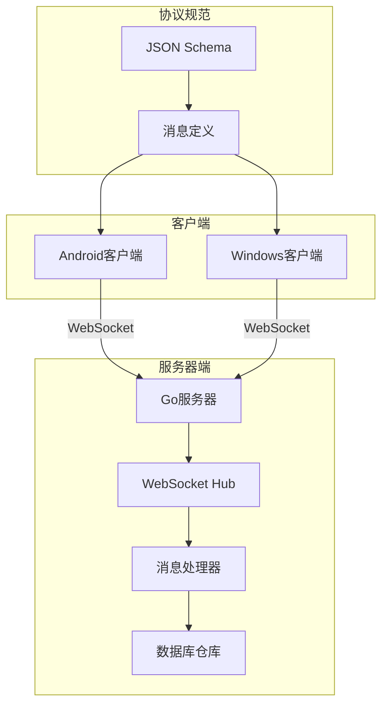
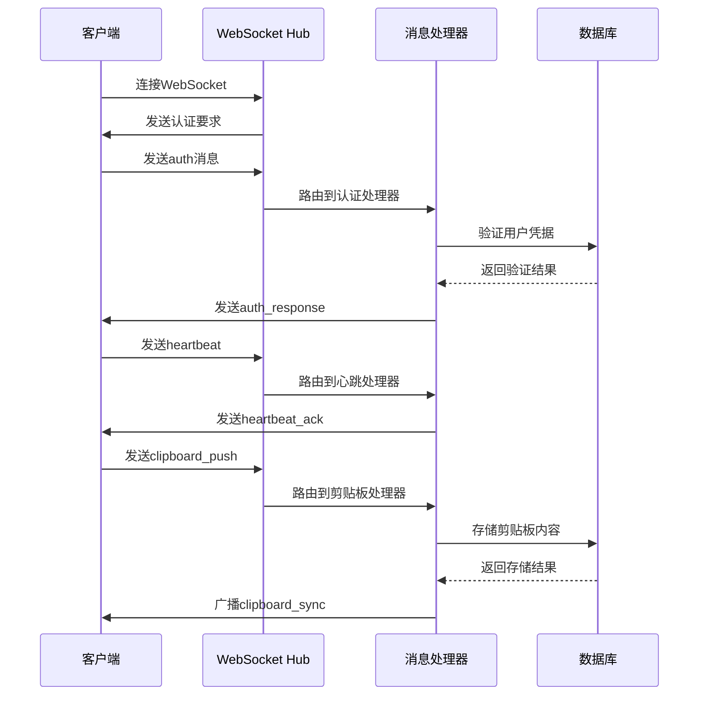
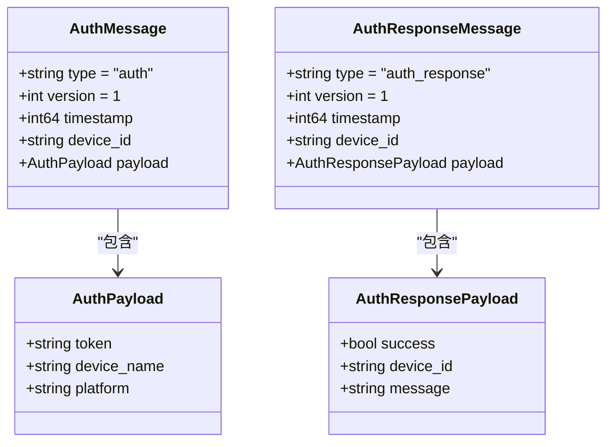
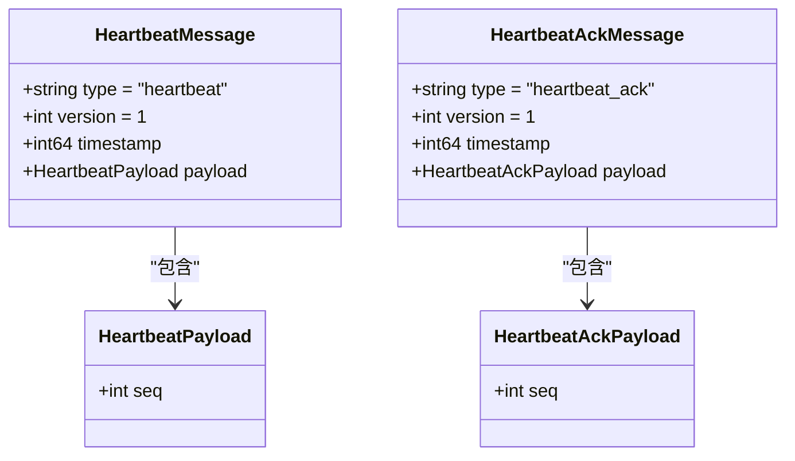
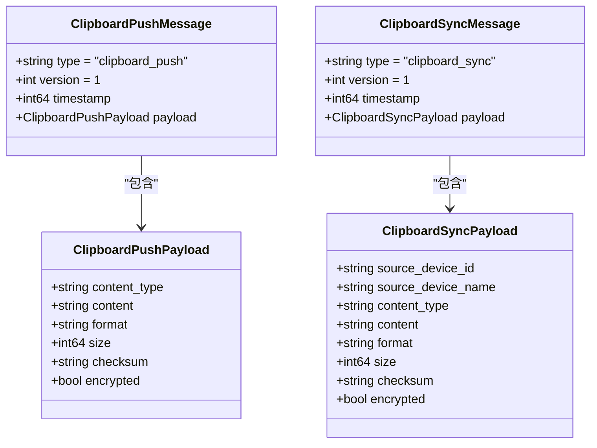
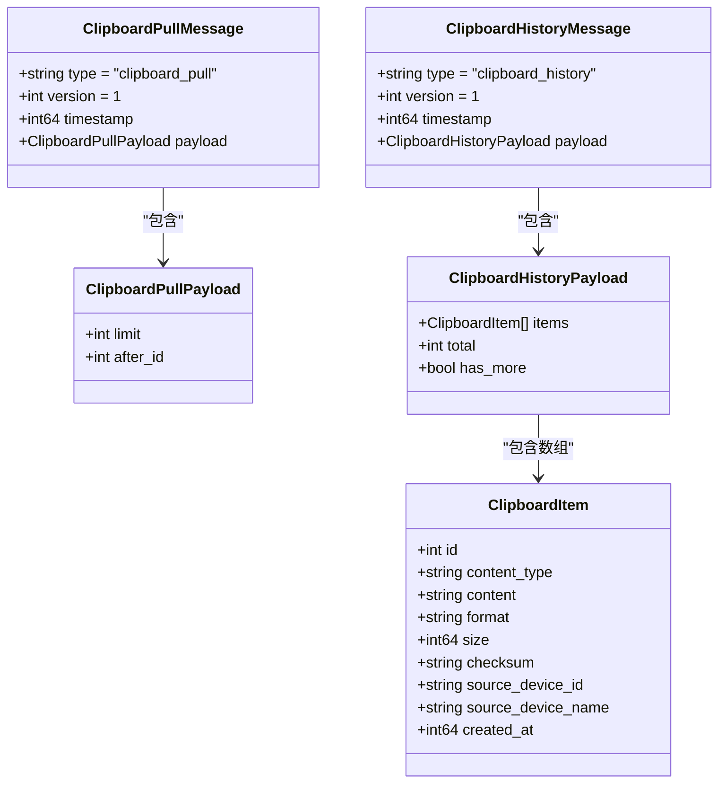
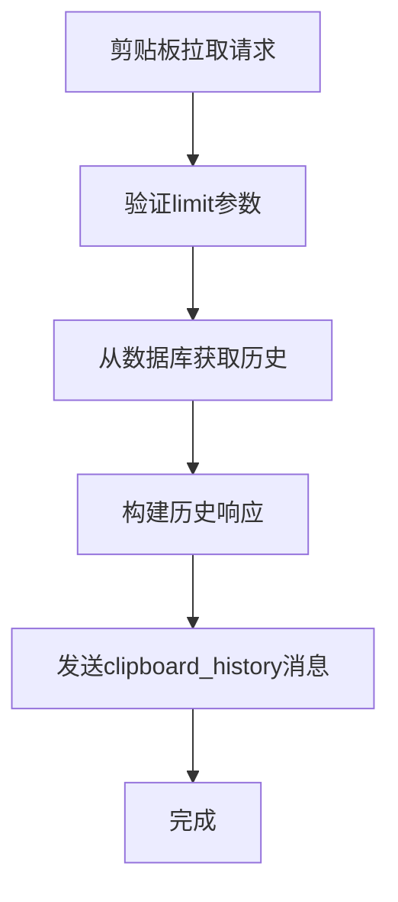
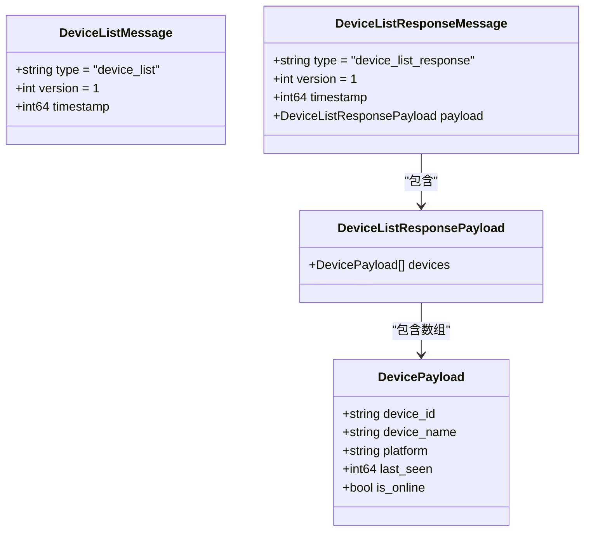
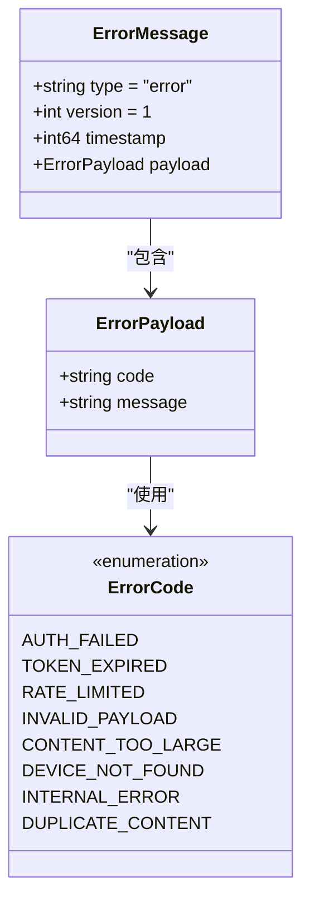
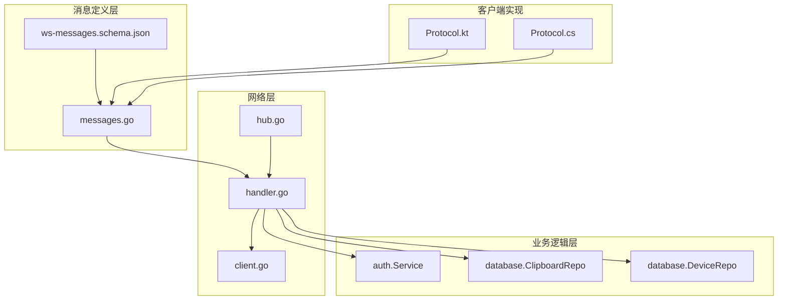

# WebSocket消息协议

<cite>
**本文档引用的文件**
- [ws-messages.schema.json](file://protocol/ws-messages.schema.json)
- [messages.go](file://clipSync-server/pkg/protocol/messages.go)
- [handler.go](file://clipSync-server/internal/websocket/handler.go)
- [client.go](file://clipSync-server/internal/websocket/client.go)
- [hub.go](file://clipSync-server/internal/websocket/hub.go)
- [Protocol.kt](file://clipSync-android/app/src/main/java/com/clipsync/app/network/Protocol.kt)
- [Protocol.cs](file://clipSync-windows/ClipSync.WPF/Network/Protocol.cs)
- [http-api.schema.json](file://protocol/http-api.schema.json)
- [main.go](file://clipSync-server/cmd/server/main.go)
</cite>

## 目录
1. [简介](#简介)
2. [项目结构](#项目结构)
3. [核心组件](#核心组件)
4. [架构概览](#架构概览)
5. [详细组件分析](#详细组件分析)
6. [依赖关系分析](#依赖关系分析)
7. [性能考虑](#性能考虑)
8. [故障排除指南](#故障排除指南)
9. [结论](#结论)

## 简介

ClipSync是一个跨平台的剪贴板同步系统，通过WebSocket实现设备间的实时通信。本文件详细说明了WebSocket消息协议的所有消息类型、字段定义、数据类型、约束条件和使用场景。

## 项目结构

ClipSync采用多语言实现，包含以下主要组件：

**图表来源**
- [main.go:108-125](file://clipSync-server/cmd/server/main.go#L108-L125)
- [hub.go:18-35](file://clipSync-server/internal/websocket/hub.go#L18-L35)

**章节来源**
- [main.go:1-146](file://clipSync-server/cmd/server/main.go#L1-146)
- [hub.go:18-58](file://clipSync-server/internal/websocket/hub.go#L18-L58)

## 核心组件

### 消息包络结构

所有WebSocket消息都遵循统一的包络格式：

| 字段名 | 数据类型 | 必填 | 描述 |
|--------|----------|------|------|
| type | string | 是 | 消息类型标识符 |
| version | integer | 是 | 协议版本（固定为1） |
| timestamp | integer | 是 | Unix毫秒时间戳 |
| device_id | string | 否 | 设备唯一标识符 |
| payload | object | 是 | 类型特定的有效载荷 |

### 消息类型枚举

服务器端支持的消息类型：
- `auth` - 认证请求
- `auth_response` - 认证响应
- `heartbeat` - 心跳请求
- `heartbeat_ack` - 心跳确认
- `clipboard_push` - 剪贴板推送
- `clipboard_sync` - 剪贴板同步
- `clipboard_pull` - 剪贴板拉取
- `clipboard_history` - 剪贴板历史
- `device_list` - 设备列表请求
- `device_list_response` - 设备列表响应
- `device_unregister` - 设备注销
- `error` - 错误响应
- `ping` - 服务器发起的心跳
- `pong` - 客户端响应

**章节来源**
- [messages.go:107-123](file://clipSync-server/pkg/protocol/messages.go#L107-L123)
- [ws-messages.schema.json:10-25](file://protocol/ws-messages.schema.json#L10-L25)

## 架构概览

**图表来源**
- [handler.go:11-31](file://clipSync-server/internal/websocket/handler.go#L11-L31)
- [client.go:33-67](file://clipSync-server/internal/websocket/client.go#L33-L67)

## 详细组件分析

### 认证消息 (auth)

认证消息用于建立安全的WebSocket连接。

**消息结构：**

**字段定义：**
- `token`: JWT访问令牌，必填
- `device_name`: 设备名称，可选
- `platform`: 平台类型（windows/android/macos/ios），可选

**使用场景：**
1. 新设备首次连接时进行身份验证
2. 已认证设备重新连接时的身份确认
3. 支持设备信息的动态更新

**错误处理：**
- AUTH_FAILED: 无效的令牌或凭据
- TOKEN_EXPIRED: 令牌过期
- INVALID_PAYLOAD: 令牌为空

**章节来源**
- [ws-messages.schema.json:89-114](file://protocol/ws-messages.schema.json#L89-L114)
- [handler.go:34-110](file://clipSync-server/internal/websocket/handler.go#L34-L110)

### 心跳消息 (heartbeat)

心跳机制用于维持连接活跃状态和检测设备在线状态。

**消息结构：**

**字段定义：**
- `seq`: 序列号，用于匹配请求和响应

**使用场景：**
1. 客户端定期发送心跳保持连接
2. 服务器响应心跳确认连接状态
3. 维护设备最后在线时间

**时间戳处理：**
- 服务器收到心跳时更新设备最后在线时间
- 心跳间隔默认30秒，超时时间为15秒

**章节来源**
- [ws-messages.schema.json:115-134](file://protocol/ws-messages.schema.json#L115-L134)
- [handler.go:112-140](file://clipSync-server/internal/websocket/handler.go#L112-L140)

### 剪贴板推送消息 (clipboard_push)

剪贴板推送用于向其他设备广播新的剪贴板内容。

**消息结构：**

**字段定义：**
- `content_type`: 内容类型（text/image/file）
- `content`: 编码后的内容（Base64）
- `format`: MIME格式类型
- `size`: 内容大小（字节）
- `checksum`: SHA256校验和
- `encrypted`: 是否加密标记

**使用场景：**
1. 用户复制新内容时触发推送
2. 在同一用户的不同设备间同步
3. 支持重复内容检测避免循环同步

**数据验证：**
- 内容类型必须为text、image或file之一
- 检查重复的校验和以避免重复同步
- 支持最大1MB的消息大小限制

**章节来源**
- [ws-messages.schema.json:135-167](file://protocol/ws-messages.schema.json#L135-L167)
- [handler.go:142-234](file://clipSync-server/internal/websocket/handler.go#L142-L234)

### 剪贴板同步消息 (clipboard_sync)

剪贴板同步消息用于在设备间传播剪贴板内容。

**消息结构：**
- 包含源设备信息和完整的内容详情
- 与推送消息相比，包含额外的源设备标识

**使用场景：**
1. 广播给同一用户的其他设备
2. 提供内容来源的完整信息
3. 支持设备间的内容溯源

**章节来源**
- [ws-messages.schema.json:150-167](file://protocol/ws-messages.schema.json#L150-L167)
- [handler.go:191-214](file://clipSync-server/internal/websocket/handler.go#L191-L214)

### 剪贴板拉取消息 (clipboard_pull)

剪贴板拉取消息用于获取历史记录。

**消息结构：**

**字段定义：**
- `limit`: 获取数量限制，默认20，范围1-50
- `after_id`: 分页参数，获取指定ID之后的内容

**使用场景：**
1. 初始化设备时获取历史记录
2. 用户查看剪贴板历史
3. 支持分页加载大量历史数据

**数据流：**

**章节来源**
- [ws-messages.schema.json:168-194](file://protocol/ws-messages.schema.json#L168-L194)
- [handler.go:236-285](file://clipSync-server/internal/websocket/handler.go#L236-L285)

### 设备列表消息 (device_list)

设备列表消息用于管理用户注册的设备。

**消息结构：**

**字段定义：**
- `devices`: 设备信息数组
  - `device_id`: 设备唯一标识符
  - `device_name`: 设备名称
  - `platform`: 平台类型
  - `last_seen`: 最后在线时间
  - `is_online`: 是否在线

**使用场景：**
1. 显示用户已注册的设备列表
2. 实时显示设备在线状态
3. 支持设备注销功能

**章节来源**
- [ws-messages.schema.json:210-234](file://protocol/ws-messages.schema.json#L210-L234)
- [handler.go:287-339](file://clipSync-server/internal/websocket/handler.go#L287-L339)

### 错误消息 (error)

错误消息用于标准化错误响应。

**消息结构：**

**错误代码：**
- `AUTH_FAILED`: 认证失败
- `TOKEN_EXPIRED`: 令牌过期
- `RATE_LIMITED`: 请求过于频繁
- `INVALID_PAYLOAD`: 无效载荷
- `CONTENT_TOO_LARGE`: 内容过大
- `DEVICE_NOT_FOUND`: 设备未找到
- `INTERNAL_ERROR`: 内部错误
- `DUPLICATE_CONTENT`: 重复内容

**章节来源**
- [ws-messages.schema.json:235-258](file://protocol/ws-messages.schema.json#L235-L258)
- [handler.go:119-135](file://clipSync-server/internal/websocket/handler.go#L119-L135)

## 依赖关系分析

**图表来源**
- [messages.go:1-132](file://clipSync-server/pkg/protocol/messages.go#L1-L132)
- [handler.go:1-31](file://clipSync-server/internal/websocket/handler.go#L1-L31)

**章节来源**
- [messages.go:1-132](file://clipSync-server/pkg/protocol/messages.go#L1-L132)
- [handler.go:1-31](file://clipSync-server/internal/websocket/handler.go#L1-L31)

## 性能考虑

### 消息序列化和反序列化

**Go服务器端实现：**
- 使用标准库json包进行高性能序列化
- 消息大小限制为1MB防止内存溢出
- 批量写入优化：检查Send通道剩余容量并批量发送

**客户端实现：**
- Android: Kotlinx.serialization提供编译时优化
- Windows: Newtonsoft.Json支持灵活的序列化配置

### 连接管理

**心跳机制：**
- 读取超时：15秒，超时后断开连接
- 心跳间隔：30秒，确保连接活跃
- 服务器ping：每30秒发送一次，客户端必须响应

**缓冲区管理：**
- 客户端发送缓冲区：256个消息
- 广播消息缓冲区：256个消息
- 满缓冲区时自动断开连接

### 批量处理优化

**剪贴板同步：**
- 支持批量消息聚合
- 广播时检查接收方缓冲区状态
- 自动丢弃无法及时传输的消息

**历史记录：**
- 默认限制20条记录
- 支持分页参数after_id
- 最大限制50条记录

**章节来源**
- [client.go:69-117](file://clipSync-server/internal/websocket/client.go#L69-L117)
- [hub.go:114-121](file://clipSync-server/internal/websocket/hub.go#L114-L121)

## 故障排除指南

### 常见问题诊断

**连接问题：**
1. 检查认证是否在30秒内完成
2. 验证JWT令牌有效性
3. 确认服务器端口配置正确

**消息处理问题：**
1. 验证消息格式符合JSON Schema
2. 检查必需字段是否完整
3. 确认时间戳格式正确

**性能问题：**
1. 监控客户端缓冲区状态
2. 检查消息大小限制
3. 验证心跳机制正常工作

### 错误处理策略

**服务器端错误处理：**
- 无效消息：返回INVALID_PAYLOAD错误
- 认证失败：返回AUTH_FAILED错误
- 内部错误：返回INTERNAL_ERROR错误

**客户端错误处理：**
- 重连机制：自动重试连接
- 退避算法：指数退避重连
- 状态恢复：重新同步设备状态

**章节来源**
- [client.go:119-149](file://clipSync-server/internal/websocket/client.go#L119-L149)
- [handler.go:28-31](file://clipSync-server/internal/websocket/handler.go#L28-L31)

## 结论

ClipSync的WebSocket消息协议设计具有以下特点：

1. **标准化**: 基于JSON Schema的严格消息定义
2. **安全性**: JWT令牌认证和心跳机制
3. **可扩展性**: 支持多种内容类型和设备平台
4. **可靠性**: 完善的错误处理和重连机制
5. **性能**: 优化的序列化和批量处理

该协议为跨平台的剪贴板同步提供了稳定可靠的技术基础，支持多设备间的实时内容同步和设备管理功能。