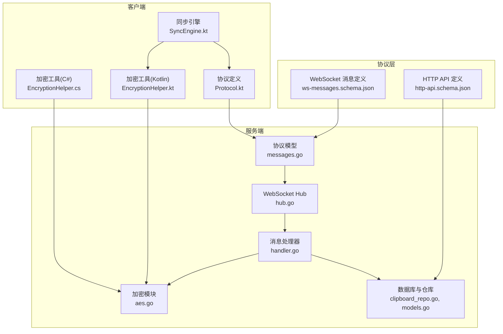
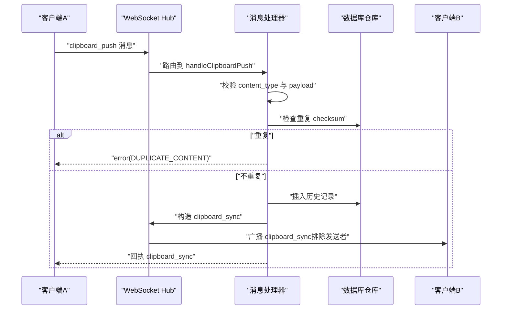
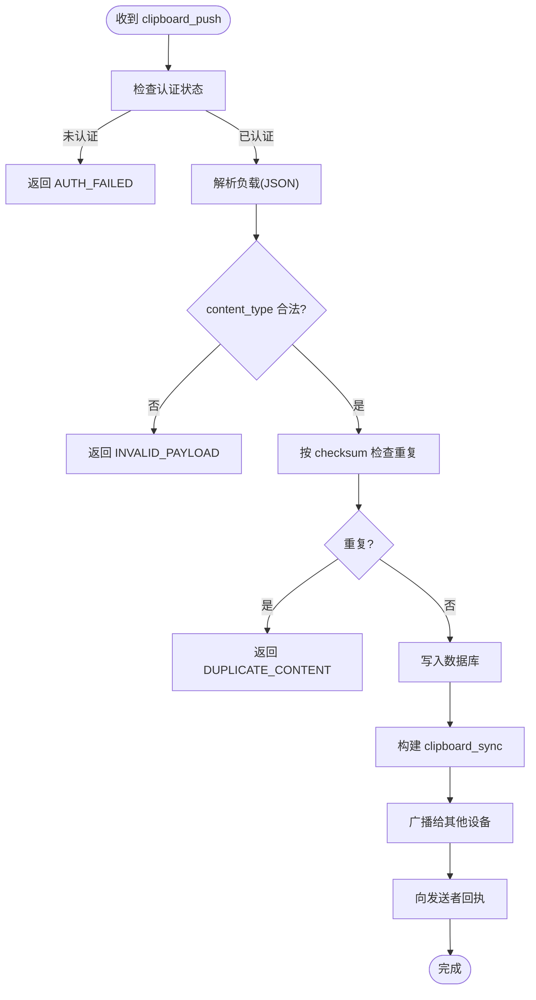
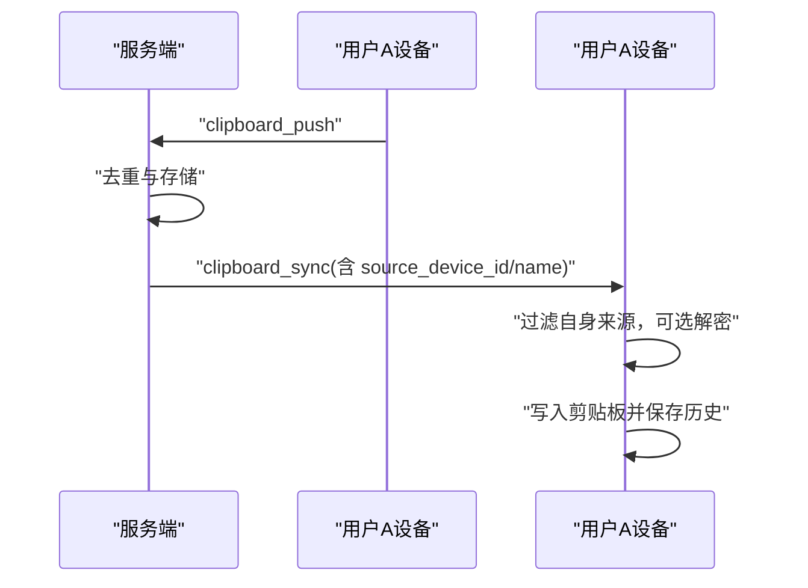
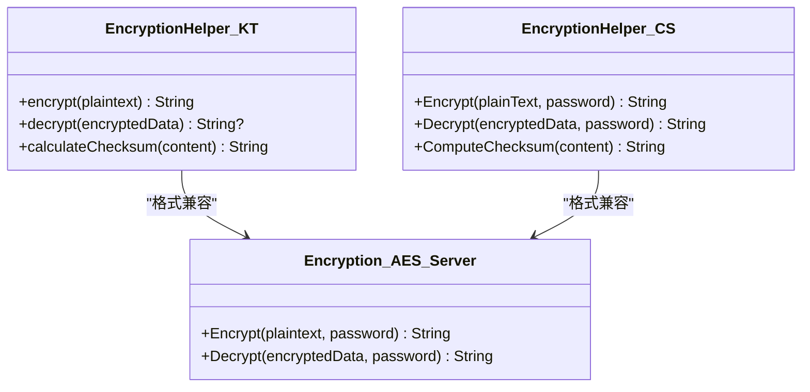
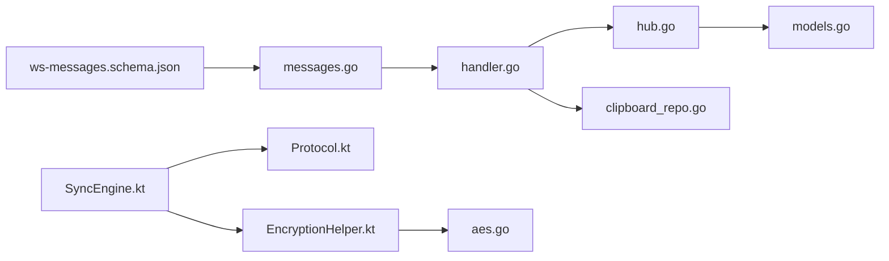

# 剪贴板同步消息

<cite>
**本文档引用的文件**
- [ws-messages.schema.json](file://protocol/ws-messages.schema.json)
- [messages.go](file://clipSync-server/pkg/protocol/messages.go)
- [handler.go](file://clipSync-server/internal/websocket/handler.go)
- [hub.go](file://clipSync-server/internal/websocket/hub.go)
- [client.go](file://clipSync-server/internal/websocket/client.go)
- [aes.go](file://clipSync-server/internal/encryption/aes.go)
- [clipboard_repo.go](file://clipSync-server/internal/database/clipboard_repo.go)
- [models.go](file://clipSync-server/internal/database/models.go)
- [SyncEngine.kt](file://clipSync-android/app/src/main/java/com/clipsync/app/core/SyncEngine.kt)
- [Protocol.kt](file://clipSync-android/app/src/main/java/com/clipsync/app/network/Protocol.kt)
- [EncryptionHelper.kt](file://clipSync-android/app/src/main/java/com/clipsync/app/core/EncryptionHelper.kt)
- [EncryptionHelper.cs](file://clipSync-windows/ClipSync.WPF/Core/EncryptionHelper.cs)
- [http-api.schema.json](file://protocol/http-api.schema.json)
- [upload_handler.go](file://clipSync-server/internal/httpserver/upload_handler.go)
- [main.go](file://clipSync-server/cmd/server/main.go)
</cite>

## 目录
1. [简介](#简介)
2. [项目结构](#项目结构)
3. [核心组件](#核心组件)
4. [架构总览](#架构总览)
5. [详细组件分析](#详细组件分析)
6. [依赖关系分析](#依赖关系分析)
7. [性能考虑](#性能考虑)
8. [故障排除指南](#故障排除指南)
9. [结论](#结论)

## 简介
本文件系统性地阐述 ClipSync 剪贴板同步协议中的两类关键消息：clipboard_push 和 clipboard_sync 的消息结构与处理流程，并补充内容类型枚举、格式转换机制、加密标志位与端到端加密流程、内容验证、重复检测与错误处理策略。目标是帮助开发者与运维人员准确理解消息契约、实现细节与最佳实践。

## 项目结构
- 协议定义位于 protocol 目录，包含 WebSocket 消息与 HTTP API 的 JSON Schema。
- 服务端位于 clipSync-server，包含协议模型、WebSocket 处理、数据库与加密模块。
- 客户端位于 clipSync-android 与 clipSync-windows，分别提供 Android 与 Windows 平台的同步引擎、网络协议与加密实现。
- HTTP 文件上传/下载用于大文件场景下的内容分发。

**图表来源**
- [ws-messages.schema.json:1-261](file://protocol/ws-messages.schema.json#L1-L261)
- [messages.go:1-132](file://clipSync-server/pkg/protocol/messages.go#L1-L132)
- [hub.go:1-230](file://clipSync-server/internal/websocket/hub.go#L1-L230)
- [handler.go:1-392](file://clipSync-server/internal/websocket/handler.go#L1-L392)
- [aes.go:1-135](file://clipSync-server/internal/encryption/aes.go#L1-L135)
- [clipboard_repo.go:1-140](file://clipSync-server/internal/database/clipboard_repo.go#L1-L140)
- [models.go:1-46](file://clipSync-server/internal/database/models.go#L1-L46)
- [SyncEngine.kt:1-250](file://clipSync-android/app/src/main/java/com/clipsync/app/core/SyncEngine.kt#L1-L250)
- [Protocol.kt:1-263](file://clipSync-android/app/src/main/java/com/clipsync/app/network/Protocol.kt#L1-L263)
- [EncryptionHelper.kt:1-157](file://clipSync-android/app/src/main/java/com/clipsync/app/core/EncryptionHelper.kt#L1-L157)
- [EncryptionHelper.cs:1-134](file://clipSync-windows/ClipSync.WPF/Core/EncryptionHelper.cs#L1-L134)
- [http-api.schema.json:1-293](file://protocol/http-api.schema.json#L1-L293)

**章节来源**
- [ws-messages.schema.json:1-261](file://protocol/ws-messages.schema.json#L1-L261)
- [messages.go:1-132](file://clipSync-server/pkg/protocol/messages.go#L1-L132)
- [hub.go:1-230](file://clipSync-server/internal/websocket/hub.go#L1-L230)
- [handler.go:1-392](file://clipSync-server/internal/websocket/handler.go#L1-L392)
- [aes.go:1-135](file://clipSync-server/internal/encryption/aes.go#L1-L135)
- [clipboard_repo.go:1-140](file://clipSync-server/internal/database/clipboard_repo.go#L1-L140)
- [models.go:1-46](file://clipSync-server/internal/database/models.go#L1-L46)
- [SyncEngine.kt:1-250](file://clipSync-android/app/src/main/java/com/clipsync/app/core/SyncEngine.kt#L1-L250)
- [Protocol.kt:1-263](file://clipSync-android/app/src/main/java/com/clipsync/app/network/Protocol.kt#L1-L263)
- [EncryptionHelper.kt:1-157](file://clipSync-android/app/src/main/java/com/clipsync/app/core/EncryptionHelper.kt#L1-L157)
- [EncryptionHelper.cs:1-134](file://clipSync-windows/ClipSync.WPF/Core/EncryptionHelper.cs#L1-L134)
- [http-api.schema.json:1-293](file://protocol/http-api.schema.json#L1-L293)

## 核心组件
- 消息包络与负载结构：所有 WebSocket 消息遵循统一包络（type、version、timestamp、device_id、payload），具体负载由各消息类型定义。
- clipboard_push 负载字段：
  - content_type：内容类型枚举（text、image、file）
  - content：内容字符串（可能为加密后的文本或文件标识）
  - format：格式信息（如 text/plain）
  - size：字节大小（非负整数）
  - checksum：内容校验和（十六进制字符串）
  - encrypted：是否已加密（布尔值）
- clipboard_sync 负载字段：
  - source_device_id：发送设备唯一标识
  - source_device_name：发送设备名称
  - 其余字段与 clipboard_push 对应，且包含 encrypted 字段
- 内容类型枚举与格式转换：
  - text：纯文本，format 默认 text/plain
  - image：图片，format 可为图像 MIME 类型
  - file：文件，通常通过 HTTP 上传/下载，clipboard 中存储文件标识或元数据
- 加密标志位 encrypted：
  - 当客户端启用加密时，content 为加密格式（base64(salt):base64(IV+ciphertext)），encrypted=true
  - 服务端在广播前不主动解密；接收端根据设置决定是否解密
- 内容验证、重复检测与错误处理：
  - 验证：服务端对 content_type 进行白名单校验，对 payload 结构进行 JSON 解析与字段存在性检查
  - 重复检测：基于 checksum 的去重，避免环路与冗余广播
  - 错误处理：标准化错误码（如 DUPLICATE_CONTENT、INVALID_PAYLOAD、AUTH_FAILED）

**章节来源**
- [ws-messages.schema.json:135-167](file://protocol/ws-messages.schema.json#L135-L167)
- [messages.go:33-53](file://clipSync-server/pkg/protocol/messages.go#L33-L53)
- [handler.go:142-234](file://clipSync-server/internal/websocket/handler.go#L142-L234)
- [clipboard_repo.go:128-139](file://clipSync-server/internal/database/clipboard_repo.go#L128-L139)

## 架构总览
下图展示从客户端推送 clipboard_push 到服务端，再到其他客户端接收 clipboard_sync 的完整流程。

**图表来源**
- [handler.go:142-234](file://clipSync-server/internal/websocket/handler.go#L142-L234)
- [hub.go:114-121](file://clipSync-server/internal/websocket/hub.go#L114-L121)
- [clipboard_repo.go:128-139](file://clipSync-server/internal/database/clipboard_repo.go#L128-L139)

## 详细组件分析

### clipboard_push 消息结构与处理
- 结构要点
  - 包络：type=clipboard_push，version=1，timestamp=Unix毫秒
  - 负载：content_type、content、format、size、checksum、encrypted
- 处理流程
  - 认证检查：未认证设备禁止推送
  - 负载解析：JSON 反序列化，字段存在性与类型校验
  - 内容类型校验：仅允许 text、image、file
  - 重复检测：按 checksum 查询用户历史，命中则返回 DUPLICATE_CONTENT
  - 存储：写入 clipboard_history 表，维护历史上限
  - 广播：构造 clipboard_sync，排除发送者，向同用户其他设备广播
  - 回执：向发送者回发 clipboard_sync 作为确认
- 错误处理
  - INVALID_PAYLOAD：负载解析失败或字段缺失
  - DUPLICATE_CONTENT：checksum 已存在
  - AUTH_FAILED：未认证
  - INTERNAL_ERROR：数据库操作失败

**图表来源**
- [handler.go:142-234](file://clipSync-server/internal/websocket/handler.go#L142-L234)
- [clipboard_repo.go:128-139](file://clipSync-server/internal/database/clipboard_repo.go#L128-L139)

**章节来源**
- [ws-messages.schema.json:135-149](file://protocol/ws-messages.schema.json#L135-L149)
- [messages.go:33-41](file://clipSync-server/pkg/protocol/messages.go#L33-L41)
- [handler.go:142-234](file://clipSync-server/internal/websocket/handler.go#L142-L234)
- [clipboard_repo.go:20-64](file://clipSync-server/internal/database/clipboard_repo.go#L20-L64)

### clipboard_sync 消息结构与同步机制
- 结构要点
  - 包络：type=clipboard_sync，version=1
  - 负载：source_device_id、source_device_name、content_type、content、format、size、checksum、encrypted
- 同步机制
  - 发送方：服务端在收到 clipboard_push 后，将该条目广播给同一用户的其他设备
  - 接收方：过滤掉来自自身设备的消息，避免回环；根据设置决定是否解密；将内容写入本地剪贴板并保存历史
- 重复检测
  - 客户端本地也进行去重：若与上次发送的 checksum 相同则跳过，防止抖动与环路

**图表来源**
- [handler.go:191-231](file://clipSync-server/internal/websocket/handler.go#L191-L231)
- [SyncEngine.kt:128-160](file://clipSync-android/app/src/main/java/com/clipsync/app/core/SyncEngine.kt#L128-L160)

**章节来源**
- [ws-messages.schema.json:150-167](file://protocol/ws-messages.schema.json#L150-L167)
- [messages.go:43-53](file://clipSync-server/pkg/protocol/messages.go#L43-L53)
- [handler.go:191-231](file://clipSync-server/internal/websocket/handler.go#L191-L231)
- [SyncEngine.kt:128-160](file://clipSync-android/app/src/main/java/com/clipsync/app/core/SyncEngine.kt#L128-L160)

### 内容类型枚举与格式转换
- 枚举与含义
  - text：纯文本内容，format 默认 text/plain
  - image：图像内容，format 为对应 MIME 类型
  - file：文件内容，通常通过 HTTP 上传/下载，clipboard 中存储文件标识或元数据
- 格式转换
  - 文本：直接以字符串形式传输
  - 图片：建议使用 base64 或文件 ID，配合 format 字段标识类型
  - 文件：优先采用 HTTP 上传/下载，clipboard 中携带文件标识与校验和，减少 WebSocket 负载

**章节来源**
- [ws-messages.schema.json:141-146](file://protocol/ws-messages.schema.json#L141-L146)
- [messages.go:34-39](file://clipSync-server/pkg/protocol/messages.go#L34-L39)
- [http-api.schema.json:211-249](file://protocol/http-api.schema.json#L211-L249)
- [upload_handler.go:36-150](file://clipSync-server/internal/httpserver/upload_handler.go#L36-L150)

### 加密标志位与端到端加密流程
- 加密标志位 encrypted
  - 作用：指示 content 是否经过端到端加密
  - 传播：clipboard_push 与 clipboard_sync 负载均包含该字段
- 端到端加密流程
  - 密钥派生：PBKDF2-SHA256(password, salt, 10000 次, 32 字节)
  - 分组模式：AES-256-CBC，随机 IV（16 字节）
  - 填充：PKCS#7
  - 输出格式：base64(salt):base64(IV + ciphertext)
- 客户端实现
  - Android：EncryptionHelper.kt 提供 encrypt/decrypt 与 checksum 计算
  - Windows：EncryptionHelper.cs 提供等价功能
  - 服务端：encryption/aes.go 提供兼容的解密能力（用于跨平台一致性）
- 使用建议
  - 仅在需要保护隐私时启用加密
  - 密码需安全存储与管理，避免硬编码
  - 保持客户端与服务端的加密格式一致

**图表来源**
- [EncryptionHelper.kt:51-102](file://clipSync-android/app/src/main/java/com/clipsync/app/core/EncryptionHelper.kt#L51-L102)
- [EncryptionHelper.cs:30-103](file://clipSync-windows/ClipSync.WPF/Core/EncryptionHelper.cs#L30-L103)
- [aes.go:25-106](file://clipSync-server/internal/encryption/aes.go#L25-L106)

**章节来源**
- [ws-messages.schema.json:163-163](file://protocol/ws-messages.schema.json#L163-L163)
- [messages.go:40-52](file://clipSync-server/pkg/protocol/messages.go#L40-L52)
- [EncryptionHelper.kt:51-102](file://clipSync-android/app/src/main/java/com/clipsync/app/core/EncryptionHelper.kt#L51-L102)
- [EncryptionHelper.cs:30-103](file://clipSync-windows/ClipSync.WPF/Core/EncryptionHelper.cs#L30-L103)
- [aes.go:25-106](file://clipSync-server/internal/encryption/aes.go#L25-L106)

### 内容验证、重复检测与错误处理策略
- 内容验证
  - 类型校验：content_type 必须为 text/image/file
  - 结构校验：JSON 负载必须包含必需字段
  - 大小限制：客户端在发送前计算 size，服务端读取限制为 1MB（图像/文件）
- 重复检测
  - 服务端：基于 checksum 查询用户历史，命中则拒绝
  - 客户端：本地 lastSentChecksum 去重，避免环路
- 错误处理
  - 标准化错误码：AUTH_FAILED、INVALID_PAYLOAD、CONTENT_TOO_LARGE、DEVICE_NOT_FOUND、INTERNAL_ERROR、DUPLICATE_CONTENT
  - 客户端回退：重连后重置去重状态，确保后续同步正常

**章节来源**
- [handler.go:156-172](file://clipSync-server/internal/websocket/handler.go#L156-L172)
- [client.go:40-41](file://clipSync-server/internal/websocket/client.go#L40-L41)
- [SyncEngine.kt:85-91](file://clipSync-android/app/src/main/java/com/clipsync/app/core/SyncEngine.kt#L85-L91)
- [ws-messages.schema.json:235-258](file://protocol/ws-messages.schema.json#L235-L258)

## 依赖关系分析
- 协议层依赖
  - ws-messages.schema.json 定义了消息契约，messages.go 实现了对应的 Go 结构体
- 服务端依赖
  - handler 依赖 hub 进行广播，依赖 clipboard_repo 进行数据持久化与重复检测
  - hub 依赖 auth 服务与数据库仓库
- 客户端依赖
  - SyncEngine 依赖 WebSocket 客户端、剪贴板监控、设置管理与数据库
  - Protocol.kt 定义消息结构，EncryptionHelper 提供加密/解密与校验和计算

**图表来源**
- [ws-messages.schema.json:1-261](file://protocol/ws-messages.schema.json#L1-L261)
- [messages.go:1-132](file://clipSync-server/pkg/protocol/messages.go#L1-L132)
- [handler.go:1-392](file://clipSync-server/internal/websocket/handler.go#L1-L392)
- [hub.go:1-230](file://clipSync-server/internal/websocket/hub.go#L1-L230)
- [clipboard_repo.go:1-140](file://clipSync-server/internal/database/clipboard_repo.go#L1-L140)
- [models.go:1-46](file://clipSync-server/internal/database/models.go#L1-L46)
- [SyncEngine.kt:1-250](file://clipSync-android/app/src/main/java/com/clipsync/app/core/SyncEngine.kt#L1-L250)
- [Protocol.kt:1-263](file://clipSync-android/app/src/main/java/com/clipsync/app/network/Protocol.kt#L1-L263)
- [EncryptionHelper.kt:1-157](file://clipSync-android/app/src/main/java/com/clipsync/app/core/EncryptionHelper.kt#L1-L157)
- [aes.go:1-135](file://clipSync-server/internal/encryption/aes.go#L1-L135)

**章节来源**
- [main.go:67-69](file://clipSync-server/cmd/server/main.go#L67-L69)
- [handler.go:1-31](file://clipSync-server/internal/websocket/handler.go#L1-L31)
- [hub.go:45-58](file://clipSync-server/internal/websocket/hub.go#L45-L58)

## 性能考虑
- WebSocket 读取限制：图像/文件最大消息为 1MB，避免内存压力
- 数据库存储：历史上限控制，定期清理旧记录，降低查询与存储开销
- 广播优化：按用户维度过滤，避免跨用户广播
- 连接池与 WAL：SQLite 使用 WAL 模式与连接池参数优化并发读写

**章节来源**
- [client.go:40-41](file://clipSync-server/internal/websocket/client.go#L40-L41)
- [clipboard_repo.go:39-50](file://clipSync-server/internal/database/clipboard_repo.go#L39-L50)
- [db.go:17-56](file://clipSync-server/internal/database/db.go#L17-L56)

## 故障排除指南
- 常见错误码
  - AUTH_FAILED：令牌无效或未认证
  - INVALID_PAYLOAD：消息格式或字段不合法
  - DUPLICATE_CONTENT：checksum 重复
  - CONTENT_TOO_LARGE：超过大小限制
  - INTERNAL_ERROR：服务器内部错误
- 排查步骤
  - 检查认证：确认 token 有效且未过期
  - 校验负载：确保包含必需字段且类型正确
  - 去重问题：确认客户端去重逻辑与服务端去重一致
  - 加密问题：确认加密密码一致、格式符合 base64(salt):base64(IV+ciphertext)
  - 文件同步：使用 HTTP 上传/下载接口验证文件完整性

**章节来源**
- [ws-messages.schema.json:235-258](file://protocol/ws-messages.schema.json#L235-L258)
- [handler.go:156-172](file://clipSync-server/internal/websocket/handler.go#L156-L172)
- [upload_handler.go:113-123](file://clipSync-server/internal/httpserver/upload_handler.go#L113-L123)

## 结论
本文档系统梳理了 clipboard_push 与 clipboard_sync 的消息结构、处理流程与安全机制，明确了内容类型、格式转换、加密与去重策略，并提供了服务端与客户端的关键实现参考。遵循本文档的约定与最佳实践，可确保跨平台、跨语言的一致性与可靠性。