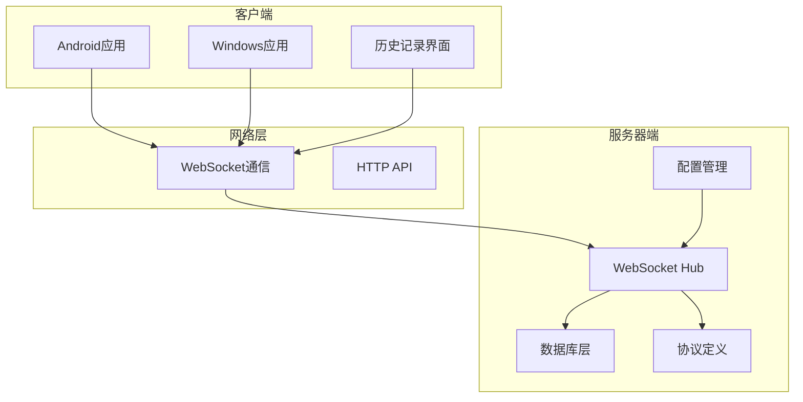
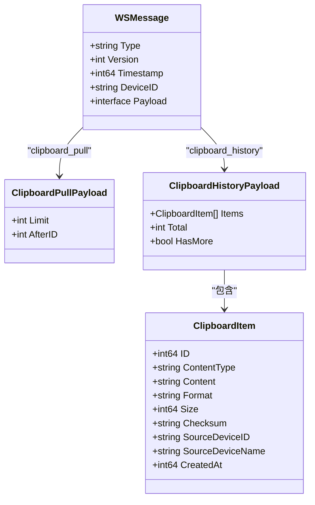
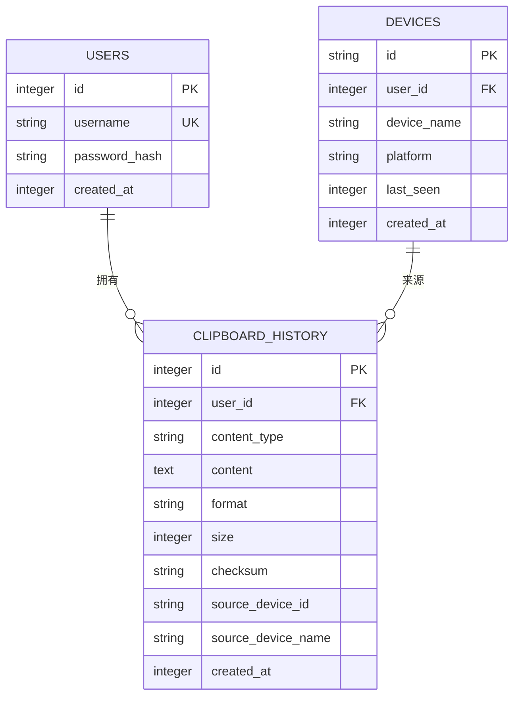
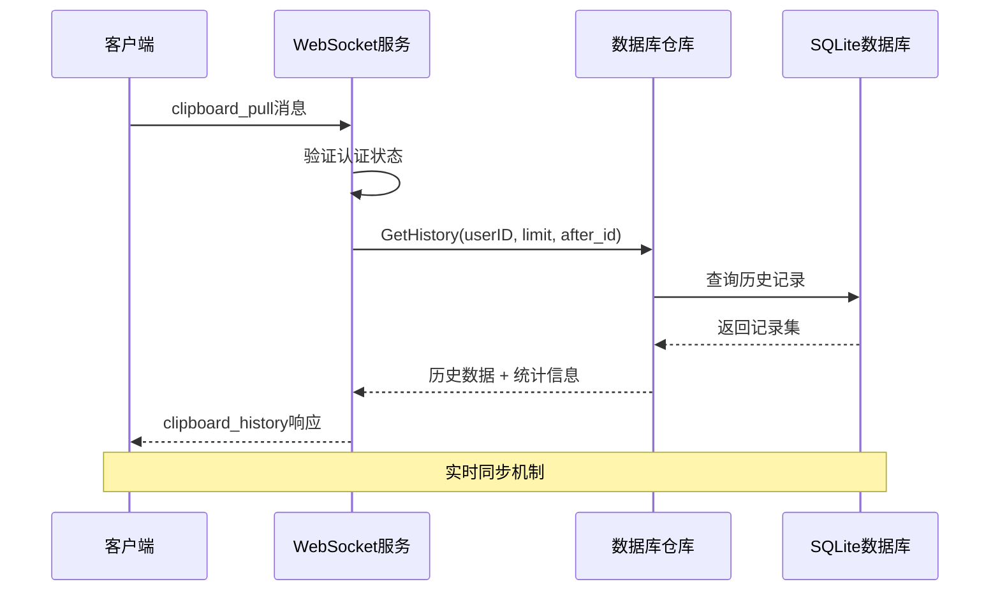
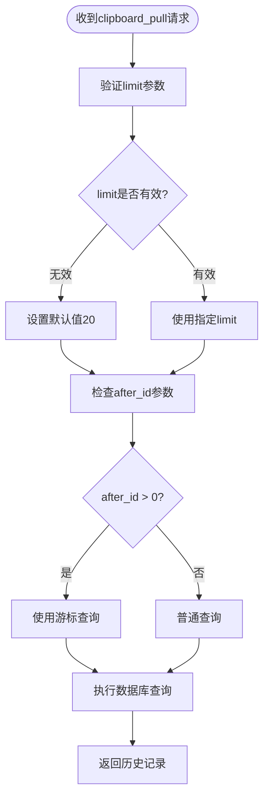
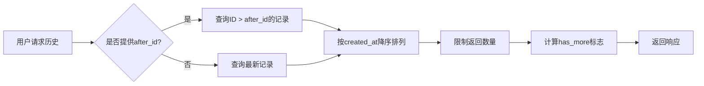
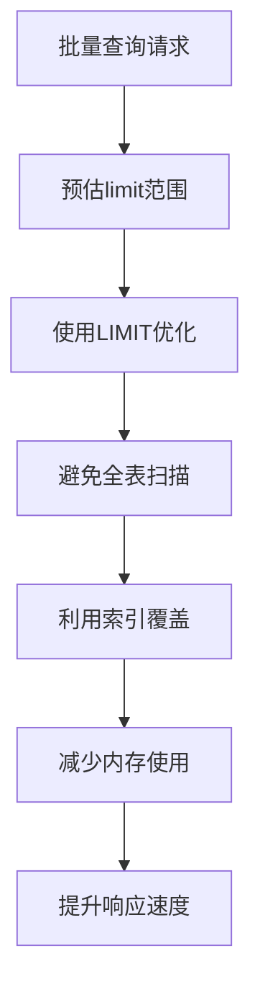
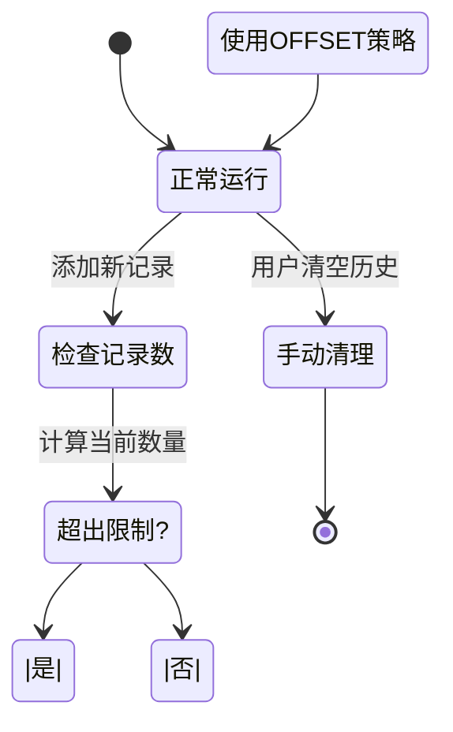
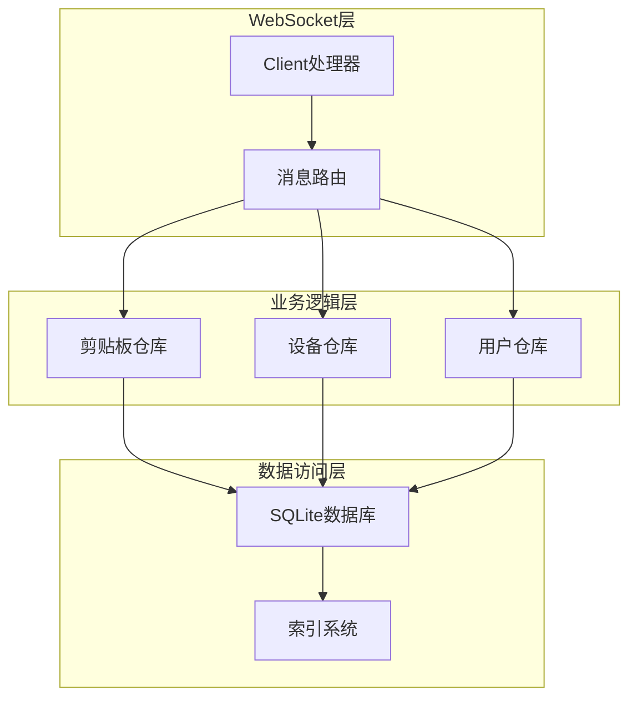
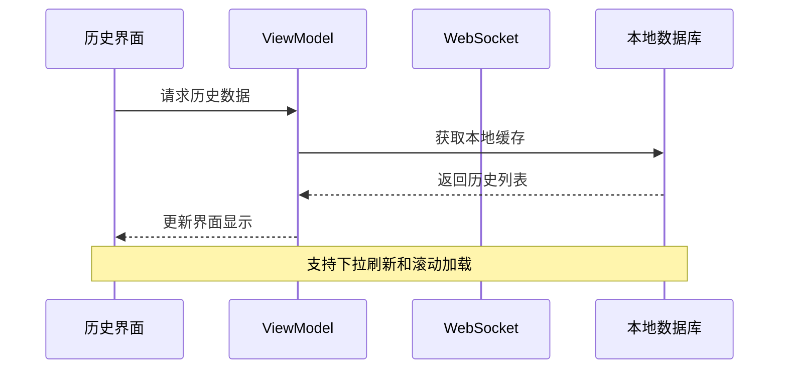

# 历史记录消息

<cite>
**本文档引用的文件**
- [messages.go](file://clipSync-server/pkg/protocol/messages.go)
- [handler.go](file://clipSync-server/internal/websocket/handler.go)
- [clipboard_repo.go](file://clipSync-server/internal/database/clipboard_repo.go)
- [models.go](file://clipSync-server/internal/database/models.go)
- [001_initial.sql](file://clipSync-server/migrations/001_initial.sql)
- [config.yaml](file://clipSync-server/configs/config.yaml)
- [main.go](file://clipSync-server/cmd/server/main.go)
- [ws-messages.schema.json](file://protocol/ws-messages.schema.json)
- [HistoryScreen.kt](file://clipSync-android/app/src/main/java/com/clipsync/app/ui/screens/HistoryScreen.kt)
- [MainViewModel.kt](file://clipSync-android/app/src/main/java/com/clipsync/app/viewmodel/MainViewModel.kt)
</cite>

## 目录
1. [简介](#简介)
2. [项目结构](#项目结构)
3. [核心组件](#核心组件)
4. [架构概览](#架构概览)
5. [详细组件分析](#详细组件分析)
6. [依赖关系分析](#依赖关系分析)
7. [性能考虑](#性能考虑)
8. [故障排除指南](#故障排除指南)
9. [结论](#结论)

## 简介

本文档详细说明了ClipSync系统中历史记录消息的完整实现，重点关注`clipboard_pull`消息的查询结构和`clipboard_history`消息的响应结构。该系统实现了跨设备的剪贴板同步功能，支持历史记录的分页浏览、数据过滤和排序。

## 项目结构

ClipSync采用多平台架构设计，包含服务器端Go实现和客户端Android/WPF实现：



**图表来源**
- [main.go:1-146](file://clipSync-server/cmd/server/main.go#L1-L146)
- [handler.go:1-392](file://clipSync-server/internal/websocket/handler.go#L1-L392)

**章节来源**
- [main.go:1-146](file://clipSync-server/cmd/server/main.go#L1-L146)
- [config.yaml:1-29](file://clipSync-server/configs/config.yaml#L1-L29)

## 核心组件

### 协议消息定义

系统基于统一的消息协议，定义了完整的消息类型和数据结构：



**图表来源**
- [messages.go:5-79](file://clipSync-server/pkg/protocol/messages.go#L5-L79)

### 数据模型结构



**图表来源**
- [models.go:21-33](file://clipSync-server/internal/database/models.go#L21-L33)
- [001_initial.sql:24-37](file://clipSync-server/migrations/001_initial.sql#L24-L37)

**章节来源**
- [messages.go:1-132](file://clipSync-server/pkg/protocol/messages.go#L1-L132)
- [models.go:1-46](file://clipSync-server/internal/database/models.go#L1-L46)

## 架构概览

ClipSync采用事件驱动的架构模式，通过WebSocket实现实时双向通信：



**图表来源**
- [handler.go:236-285](file://clipSync-server/internal/websocket/handler.go#L236-L285)
- [clipboard_repo.go:67-110](file://clipSync-server/internal/database/clipboard_repo.go#L67-L110)

## 详细组件分析

### clipboard_pull 消息查询结构

#### 查询参数规范

| 参数名 | 类型 | 必填 | 默认值 | 范围 | 描述 |
|--------|------|------|--------|------|------|
| limit | 整数 | 否 | 20 | 1-50 | 返回记录数量限制 |
| after_id | 整数 | 否 | 0 | 任意整数 | 游标参数，用于分页 |



**图表来源**
- [handler.go:249-251](file://clipSync-server/internal/websocket/handler.go#L249-L251)
- [clipboard_repo.go:67-88](file://clipSync-server/internal/database/clipboard_repo.go#L67-L88)

#### 服务器端处理逻辑

服务器端对`clipboard_pull`消息的处理流程：

1. **认证验证**：确保客户端已通过身份认证
2. **参数校验**：验证limit和after_id的有效性
3. **历史查询**：根据参数从数据库获取历史记录
4. **结果组装**：构建`clipboard_history`响应消息

**章节来源**
- [handler.go:236-285](file://clipSync-server/internal/websocket/handler.go#L236-L285)

### clipboard_history 响应结构

#### 响应数据模型

| 字段名 | 类型 | 必填 | 描述 |
|--------|------|------|------|
| items | 数组 | 是 | 历史项列表 |
| total | 整数 | 是 | 总记录数统计 |
| has_more | 布尔值 | 是 | 是否还有更多数据 |

#### 历史项数据结构

每个历史项包含以下字段：

| 字段名 | 类型 | 必填 | 描述 |
|--------|------|------|------|
| id | 整数 | 是 | 历史记录ID |
| content_type | 字符串 | 是 | 内容类型（text/image/file） |
| content | 字符串 | 是 | 剪贴板内容 |
| format | 字符串 | 是 | 内容格式 |
| size | 整数 | 是 | 内容大小（字节） |
| checksum | 字符串 | 是 | 内容校验和 |
| source_device_id | 字符串 | 是 | 来源设备ID |
| source_device_name | 字符串 | 是 | 来源设备名称 |
| created_at | 整数 | 是 | 创建时间戳（毫秒） |

**章节来源**
- [messages.go:74-79](file://clipSync-server/pkg/protocol/messages.go#L74-L79)
- [messages.go:61-72](file://clipSync-server/pkg/protocol/messages.go#L61-L72)

### 分页机制实现

#### 游标分页策略

系统采用基于ID的游标分页机制，支持高效的增量加载：



**图表来源**
- [clipboard_repo.go:79-88](file://clipSync-server/internal/database/clipboard_repo.go#L79-L88)
- [clipboard_repo.go:108](file://clipSync-server/internal/database/clipboard_repo.go#L108)

#### 分页算法复杂度

- **时间复杂度**：O(log n + k)，其中n为总记录数，k为返回记录数
- **空间复杂度**：O(k)
- **索引利用**：充分利用created_at和user_id复合索引

**章节来源**
- [clipboard_repo.go:67-110](file://clipSync-server/internal/database/clipboard_repo.go#L67-L110)

### 数据过滤和排序规则

#### 过滤条件

1. **用户隔离**：通过`user_id`确保用户间数据隔离
2. **内容去重**：基于`checksum`防止重复内容存储
3. **类型限制**：仅存储text、image、file三种类型

#### 排序规则

- **主要排序**：按`created_at`降序排列（最新在前）
- **次要排序**：当创建时间相同时，按`id`升序排列
- **索引优化**：使用`(user_id, created_at DESC)`复合索引

**章节来源**
- [clipboard_repo.go:128-139](file://clipSync-server/internal/database/clipboard_repo.go#L128-L139)
- [001_initial.sql:38-40](file://clipSync-server/migrations/001_initial.sql#L38-L40)

### 存储格式和索引策略

#### 数据库存储结构

```mermaid
erDiagram
CLIPBOARD_HISTORY {
integer id AI PK
integer user_id
string content_type
text content
string format
integer size
string checksum
string source_device_id
string source_device_name
integer created_at
}
INDEXES {
index idx_clipboard_user_id
index idx_clipboard_checksum
index idx_clipboard_created
}
CLIPBOARD_HISTORY ||--|| INDEXES : "使用"
```

**图表来源**
- [001_initial.sql:24-40](file://clipSync-server/migrations/001_initial.sql#L24-L40)

#### 索引设计策略

1. **主索引**：`idx_clipboard_user_id` - 用户查询优化
2. **去重索引**：`idx_clipboard_checksum` - 内容去重优化  
3. **排序索引**：`idx_clipboard_created` - 时间排序优化

**章节来源**
- [001_initial.sql:24-40](file://clipSync-server/migrations/001_initial.sql#L24-L40)

### 查询优化技术

#### 批量查询优化



#### 历史记录限制机制

服务器端通过配置控制历史记录上限：

- **默认限制**：50条记录
- **限制范围**：1-50条
- **自动清理**：超出限制时删除最旧记录

**章节来源**
- [config.yaml:24-25](file://clipSync-server/configs/config.yaml#L24-L25)
- [clipboard_repo.go:39-50](file://clipSync-server/internal/database/clipboard_repo.go#L39-L50)

### 历史记录清理策略

#### 自动清理机制



#### 清理策略特点

- **时间复杂度**：O(n log n)，其中n为超出限制的数量
- **空间效率**：原地删除，不产生额外空间开销
- **一致性保证**：使用事务确保数据完整性

**章节来源**
- [clipboard_repo.go:39-50](file://clipSync-server/internal/database/clipboard_repo.go#L39-L50)

### 数据保留期限配置

#### 配置参数

| 参数名 | 默认值 | 单位 | 描述 |
|--------|--------|------|------|
| clipboard_history_limit | 50 | 条记录 | 历史记录最大数量 |
| jwt_expiry_hours | 720 | 小时 | JWT令牌过期时间 |
| heartbeat_timeout_seconds | 90 | 秒 | 心跳超时时间 |

#### 配置影响

- **历史记录数量**：直接影响查询性能和存储空间
- **内存使用**：限制单次查询返回的数据量
- **用户体验**：平衡数据完整性和响应速度

**章节来源**
- [config.yaml:24-28](file://clipSync-server/configs/config.yaml#L24-L28)

## 依赖关系分析

### 服务器端组件依赖



**图表来源**
- [handler.go:10-31](file://clipSync-server/internal/websocket/handler.go#L10-L31)
- [main.go:56-69](file://clipSync-server/cmd/server/main.go#L56-L69)

### 客户端集成实现

#### Android客户端历史记录展示



**图表来源**
- [HistoryScreen.kt:68-82](file://clipSync-android/app/src/main/java/com/clipsync/app/ui/screens/HistoryScreen.kt#L68-L82)
- [MainViewModel.kt:128-134](file://clipSync-android/app/src/main/java/com/clipsync/app/viewmodel/MainViewModel.kt#L128-L134)

**章节来源**
- [HistoryScreen.kt:1-149](file://clipSync-android/app/src/main/java/com/clipsync/app/ui/screens/HistoryScreen.kt#L1-L149)
- [MainViewModel.kt:128-134](file://clipSync-android/app/src/main/java/com/clipsync/app/viewmodel/MainViewModel.kt#L128-L134)

## 性能考虑

### 查询性能优化

1. **索引优化**：合理使用复合索引提高查询效率
2. **连接池管理**：SQLite连接池配置优化并发性能
3. **内存管理**：批量处理减少内存占用
4. **网络优化**：WebSocket长连接减少连接开销

### 存储优化策略

- **数据压缩**：对大文本内容进行压缩存储
- **索引维护**：定期重建索引保持查询性能
- **垃圾回收**：定期清理无效数据和索引碎片

## 故障排除指南

### 常见问题诊断

#### 历史记录查询失败

**可能原因**：
- 数据库连接异常
- 查询参数格式错误
- 权限验证失败

**解决方案**：
- 检查数据库连接状态
- 验证JSON消息格式
- 确认用户认证状态

#### 性能问题排查

**症状**：历史记录加载缓慢

**排查步骤**：
1. 检查数据库索引使用情况
2. 监控查询执行计划
3. 分析数据库锁等待情况

**章节来源**
- [handler.go:254-258](file://clipSync-server/internal/websocket/handler.go#L254-L258)

## 结论

ClipSync的历史记录系统通过精心设计的协议结构、高效的数据库查询和智能的分页机制，实现了跨设备的实时剪贴板同步功能。系统采用游标分页策略，在保证用户体验的同时优化了查询性能。通过合理的索引设计和自动清理机制，系统能够在大数据量场景下保持稳定的性能表现。

该实现为类似的历史记录同步需求提供了完整的参考方案，包括消息协议设计、数据库优化策略和客户端集成模式等方面的最佳实践。