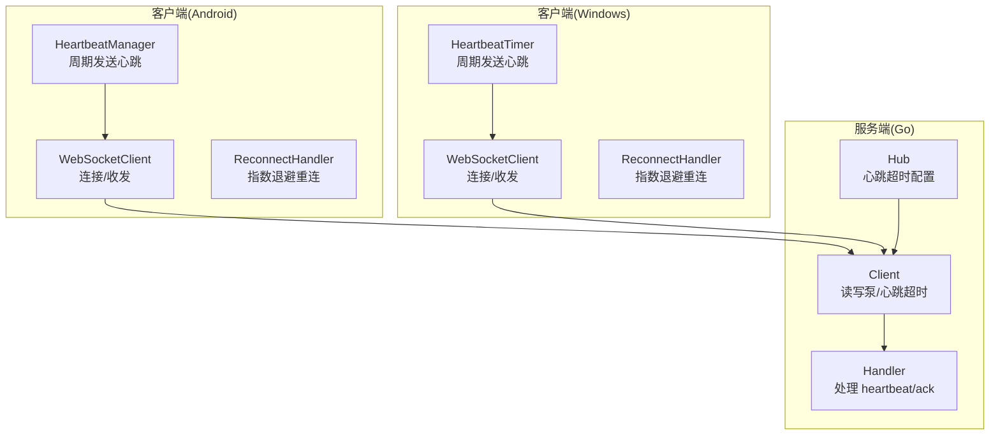
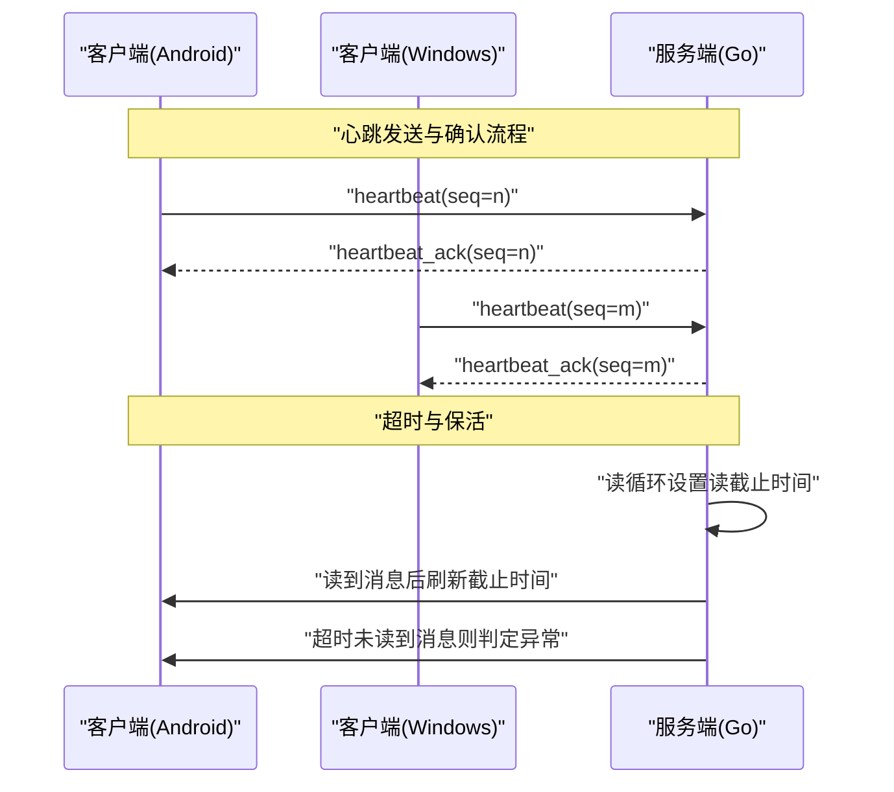
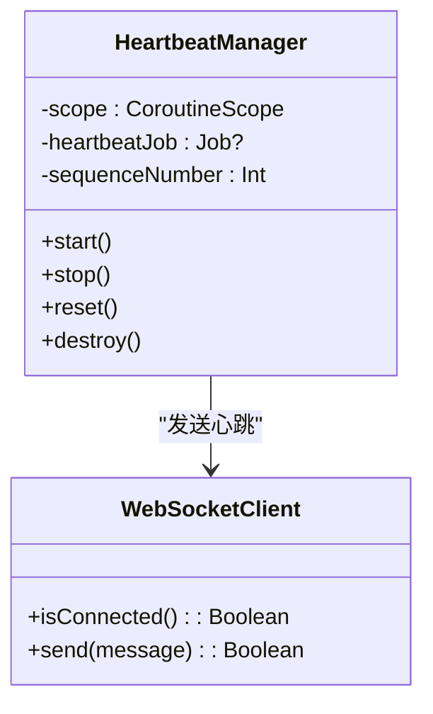
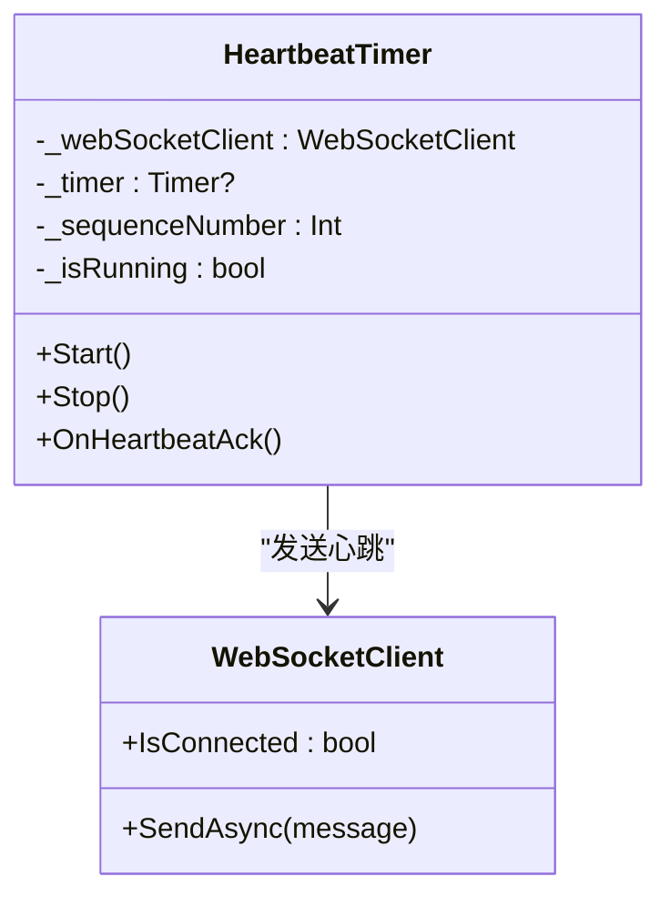
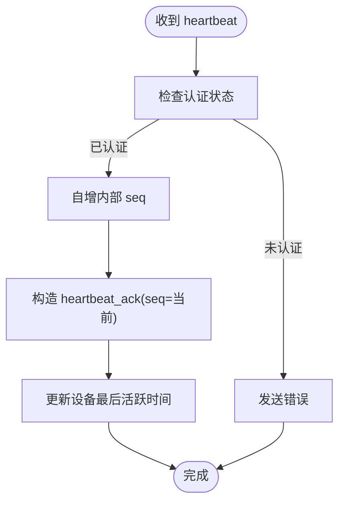
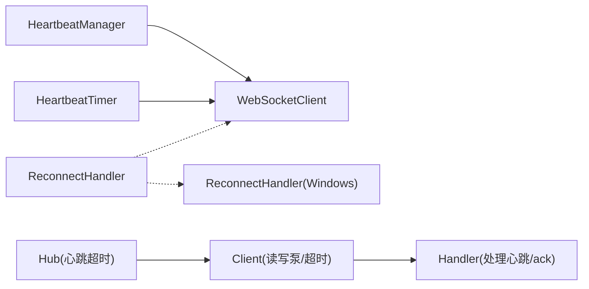

# 心跳消息

<cite>
**本文引用的文件**
- [HeartbeatManager.kt](file://clipSync-android/app/src/main/java/com/clipsync/app/network/HeartbeatManager.kt)
- [Protocol.kt](file://clipSync-android/app/src/main/java/com/clipsync/app/network/Protocol.kt)
- [WebSocketClient.kt](file://clipSync-android/app/src/main/java/com/clipsync/app/network/WebSocketClient.kt)
- [ReconnectHandler.kt](file://clipSync-android/app/src/main/java/com/clipsync/app/network/ReconnectHandler.kt)
- [HeartbeatTimer.cs](file://clipSync-windows/ClipSync.WPF/Network/HeartbeatTimer.cs)
- [Protocol.cs](file://clipSync-windows/ClipSync.WPF/Network/Protocol.cs)
- [WebSocketClient.cs](file://clipSync-windows/ClipSync.WPF/Network/WebSocketClient.cs)
- [ReconnectHandler.cs](file://clipSync-windows/ClipSync.WPF/Network/ReconnectHandler.cs)
- [messages.go](file://clipSync-server/pkg/protocol/messages.go)
- [handler.go](file://clipSync-server/internal/websocket/handler.go)
- [client.go](file://clipSync-server/internal/websocket/client.go)
- [hub.go](file://clipSync-server/internal/websocket/hub.go)
- [main.go](file://clipSync-server/cmd/server/main.go)
</cite>

## 目录
1. [简介](#简介)
2. [项目结构](#项目结构)
3. [核心组件](#核心组件)
4. [架构总览](#架构总览)
5. [详细组件分析](#详细组件分析)
6. [依赖分析](#依赖分析)
7. [性能考量](#性能考量)
8. [故障排查指南](#故障排查指南)
9. [结论](#结论)

## 简介
本文件系统性地阐述 ClipSync 项目中的心跳消息机制，覆盖以下方面：
- heartbeat 消息结构与 seq 字段的作用与使用场景
- heartbeat_ack 响应结构与确认机制
- 心跳检测工作原理、超时阈值设置与连接保活策略
- 心跳频率配置、网络异常检测与自动重连触发机制
- 心跳消息的发送与接收实现细节，包含错误处理与性能优化建议

## 项目结构
心跳机制在三端（Android、Windows、服务端 Go）均有实现，采用统一的消息协议与时间配置：
- 客户端侧负责周期性发送 heartbeat，并维护本地序列号
- 服务端侧在读循环中更新读截止时间并在收到 heartbeat 后立即返回 heartbeat_ack
- 双端均具备自动重连策略，以应对网络抖动或短暂断开

图表来源
- [HeartbeatManager.kt:27-44](file://clipSync-android/app/src/main/java/com/clipsync/app/network/HeartbeatManager.kt#L27-L44)
- [WebSocketClient.kt:83-103](file://clipSync-android/app/src/main/java/com/clipsync/app/network/WebSocketClient.kt#L83-L103)
- [ReconnectHandler.kt:37-52](file://clipSync-android/app/src/main/java/com/clipsync/app/network/ReconnectHandler.kt#L37-L52)
- [HeartbeatTimer.cs:21-28](file://clipSync-windows/ClipSync.WPF/Network/HeartbeatTimer.cs#L21-L28)
- [WebSocketClient.cs:22-39](file://clipSync-windows/ClipSync.WPF/Network/WebSocketClient.cs#L22-L39)
- [ReconnectHandler.cs:33-71](file://clipSync-windows/ClipSync.WPF/Network/ReconnectHandler.cs#L33-L71)
- [hub.go:45-57](file://clipSync-server/internal/websocket/hub.go#L45-L57)
- [client.go:34-67](file://clipSync-server/internal/websocket/client.go#L34-L67)
- [handler.go:112-140](file://clipSync-server/internal/websocket/handler.go#L112-L140)

章节来源
- [HeartbeatManager.kt:16-75](file://clipSync-android/app/src/main/java/com/clipsync/app/network/HeartbeatManager.kt#L16-L75)
- [HeartbeatTimer.cs:7-51](file://clipSync-windows/ClipSync.WPF/Network/HeartbeatTimer.cs#L7-L51)
- [messages.go:28-31](file://clipSync-server/pkg/protocol/messages.go#L28-L31)
- [handler.go:112-140](file://clipSync-server/internal/websocket/handler.go#L112-L140)
- [client.go:34-67](file://clipSync-server/internal/websocket/client.go#L34-L67)
- [hub.go:45-57](file://clipSync-server/internal/websocket/hub.go#L45-L57)

## 核心组件
- 心跳消息结构
  - 类型常量：heartbeat、heartbeat_ack
  - 载荷结构：heartbeat 包含 seq（整数），heartbeat_ack 返回相同 seq
- 序列号 seq 的作用
  - 标识心跳序号，便于客户端和服务端对齐与跟踪
  - 支持丢包检测与重复处理，确保保活信号可追踪
- 心跳频率
  - Android/Windows 客户端默认 30 秒一次
  - 服务端通过 Hub 配置心跳超时阈值，用于读截止时间与异常检测
- 自动重连
  - 客户端采用指数退避策略，最大延迟上限为 60 秒
  - 重连触发条件：连接关闭、连接失败、读超时等

章节来源
- [messages.go:107-123](file://clipSync-server/pkg/protocol/messages.go#L107-L123)
- [messages.go:28-31](file://clipSync-server/pkg/protocol/messages.go#L28-L31)
- [Protocol.kt:70-78](file://clipSync-android/app/src/main/java/com/clipsync/app/network/Protocol.kt#L70-L78)
- [Protocol.cs:90-97](file://clipSync-windows/ClipSync.WPF/Network/Protocol.cs#L90-L97)
- [client.go:40-45](file://clipSync-server/internal/websocket/client.go#L40-L45)
- [hub.go:55](file://clipSync-server/internal/websocket/hub.go#L55)
- [ReconnectHandler.kt:14-78](file://clipSync-android/app/src/main/java/com/clipsync/app/network/ReconnectHandler.kt#L14-L78)
- [ReconnectHandler.cs:8-94](file://clipSync-windows/ClipSync.WPF/Network/ReconnectHandler.cs#L8-L94)

## 架构总览
心跳机制在两端分别运行，服务端集中管理连接与超时策略。

图表来源
- [handler.go:112-140](file://clipSync-server/internal/websocket/handler.go#L112-L140)
- [client.go:40-45](file://clipSync-server/internal/websocket/client.go#L40-L45)
- [client.go:42-44](file://clipSync-server/internal/websocket/client.go#L42-L44)
- [Protocol.kt:220-225](file://clipSync-android/app/src/main/java/com/clipsync/app/network/Protocol.kt#L220-L225)
- [Protocol.cs:90-97](file://clipSync-windows/ClipSync.WPF/Network/Protocol.cs#L90-L97)

## 详细组件分析

### Android 心跳管理器（HeartbeatManager）
- 发送周期：每 30 秒发送一次 heartbeat
- 序列号：自增 seq，随消息体发送
- 连接状态：仅在已连接时发送
- 错误处理：发送失败时记录警告日志
- 生命周期：支持启动/停止/重置/销毁

图表来源
- [HeartbeatManager.kt:16-75](file://clipSync-android/app/src/main/java/com/clipsync/app/network/HeartbeatManager.kt#L16-L75)
- [WebSocketClient.kt:139](file://clipSync-android/app/src/main/java/com/clipsync/app/network/WebSocketClient.kt#L139)

章节来源
- [HeartbeatManager.kt:27-44](file://clipSync-android/app/src/main/java/com/clipsync/app/network/HeartbeatManager.kt#L27-L44)
- [Protocol.kt:220-225](file://clipSync-android/app/src/main/java/com/clipsync/app/network/Protocol.kt#L220-L225)

### Windows 心跳计时器（HeartbeatTimer）
- 发送周期：每 30 秒发送一次 heartbeat
- 序列号：自增 seq，随消息体发送
- 连接状态：仅在已连接时发送
- 异步发送：使用异步发送接口

图表来源
- [HeartbeatTimer.cs:7-51](file://clipSync-windows/ClipSync.WPF/Network/HeartbeatTimer.cs#L7-L51)
- [WebSocketClient.cs:17](file://clipSync-windows/ClipSync.WPF/Network/WebSocketClient.cs#L17)

章节来源
- [HeartbeatTimer.cs:21-28](file://clipSync-windows/ClipSync.WPF/Network/HeartbeatTimer.cs#L21-L28)
- [Protocol.cs:90-97](file://clipSync-windows/ClipSync.WPF/Network/Protocol.cs#L90-L97)

### 服务端心跳处理（Go）
- 接收 heartbeat：解析载荷中的 seq，自增内部计数
- 发送 heartbeat_ack：携带相同 seq 回复客户端
- 保活策略：读循环设置读截止时间；每次收到消息刷新截止时间
- 超时阈值：由 Hub 配置，用于判定连接是否异常

图表来源
- [handler.go:112-140](file://clipSync-server/internal/websocket/handler.go#L112-L140)
- [client.go:40-45](file://clipSync-server/internal/websocket/client.go#L40-L45)

章节来源
- [handler.go:112-140](file://clipSync-server/internal/websocket/handler.go#L112-L140)
- [client.go:34-67](file://clipSync-server/internal/websocket/client.go#L34-L67)

### 协议定义（消息类型与载荷）
- 心跳消息类型：heartbeat、heartbeat_ack
- 载荷字段：heartbeat.payload.seq（整数）

章节来源
- [messages.go:107-123](file://clipSync-server/pkg/protocol/messages.go#L107-L123)
- [messages.go:28-31](file://clipSync-server/pkg/protocol/messages.go#L28-L31)
- [Protocol.kt:70-78](file://clipSync-android/app/src/main/java/com/clipsync/app/network/Protocol.kt#L70-L78)

### 自动重连机制
- 指数退避：初始 1 秒，每次翻倍，上限 60 秒
- 触发条件：连接关闭、连接失败、读超时
- 客户端恢复认证：重连成功后重新发送认证消息（Windows）

章节来源
- [ReconnectHandler.kt:37-52](file://clipSync-android/app/src/main/java/com/clipsync/app/network/ReconnectHandler.kt#L37-L52)
- [ReconnectHandler.cs:33-71](file://clipSync-windows/ClipSync.WPF/Network/ReconnectHandler.cs#L33-L71)

## 依赖分析
- 客户端依赖
  - 心跳管理器依赖 WebSocket 客户端状态与发送能力
  - 重连处理器独立于心跳，但会在断线后触发
- 服务端依赖
  - Hub 统一管理心跳超时阈值
  - Client 读写泵负责保活与超时判定
  - Handler 处理业务消息，包括心跳与确认

图表来源
- [HeartbeatManager.kt:16-75](file://clipSync-android/app/src/main/java/com/clipsync/app/network/HeartbeatManager.kt#L16-L75)
- [HeartbeatTimer.cs:7-51](file://clipSync-windows/ClipSync.WPF/Network/HeartbeatTimer.cs#L7-L51)
- [WebSocketClient.kt:26-145](file://clipSync-android/app/src/main/java/com/clipsync/app/network/WebSocketClient.kt#L26-L145)
- [WebSocketClient.cs:10-146](file://clipSync-windows/ClipSync.WPF/Network/WebSocketClient.cs#L10-L146)
- [hub.go:45-57](file://clipSync-server/internal/websocket/hub.go#L45-L57)
- [client.go:34-67](file://clipSync-server/internal/websocket/client.go#L34-L67)
- [handler.go:112-140](file://clipSync-server/internal/websocket/handler.go#L112-L140)

章节来源
- [WebSocketClient.kt:39-44](file://clipSync-android/app/src/main/java/com/clipsync/app/network/WebSocketClient.kt#L39-L44)
- [WebSocketClient.cs:19-21](file://clipSync-windows/ClipSync.WPF/Network/WebSocketClient.cs#L19-L21)
- [hub.go:45-57](file://clipSync-server/internal/websocket/hub.go#L45-L57)

## 性能考量
- 心跳频率
  - 默认 30 秒一次，折中网络开销与保活灵敏度
  - 可根据网络环境调整（需客户端与服务端一致）
- 序列号管理
  - 客户端自增，服务端回显，避免额外状态存储
  - 建议在应用生命周期内保持连续，避免重启导致的“跳跃”
- 超时阈值
  - 服务端读截止时间基于心跳超时配置，建议与心跳间隔匹配或略大
- 发送缓冲与背压
  - 服务端发送通道有容量限制，过载会触发断开清理
- 日志与可观测性
  - 建议在关键节点输出日志（发送/接收/超时），便于定位问题

## 故障排查指南
- 症状：心跳频繁断开/重连
  - 检查网络质量与防火墙策略
  - 查看客户端日志中“发送失败”与“断线”记录
  - 确认服务端心跳超时阈值是否过小
- 症状：长时间无响应
  - 检查服务端读截止时间是否被持续刷新
  - 确认客户端是否正确发送 heartbeat
- 症状：认证后仍被断开
  - 检查服务端认证超时（默认 30 秒）是否满足
- 症状：消息堆积或断线
  - 检查服务端发送通道容量与背压处理逻辑

章节来源
- [client.go:40-45](file://clipSync-server/internal/websocket/client.go#L40-L45)
- [client.go:94-98](file://clipSync-server/internal/websocket/client.go#L94-L98)
- [hub.go:197-204](file://clipSync-server/internal/websocket/hub.go#L197-L204)
- [WebSocketClient.kt:73-77](file://clipSync-android/app/src/main/java/com/clipsync/app/network/WebSocketClient.kt#L73-L77)
- [WebSocketClient.cs:124-135](file://clipSync-windows/ClipSync.WPF/Network/WebSocketClient.cs#L124-L135)

## 结论
- 心跳机制通过统一的协议与定时策略，在三端实现了可靠的连接保活
- seq 字段用于确认与追踪，配合服务端超时阈值实现异常检测
- 客户端采用指数退避重连，提升在网络波动下的稳定性
- 建议在部署前统一心跳频率与超时阈值，并结合日志进行监控与调优