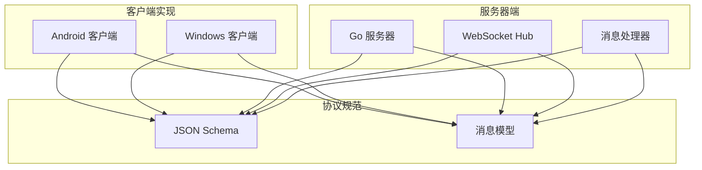
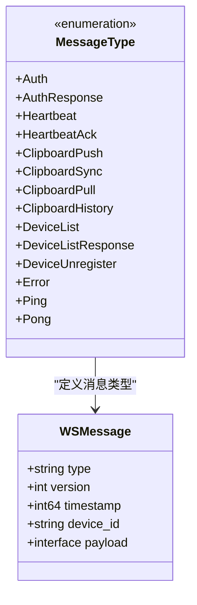
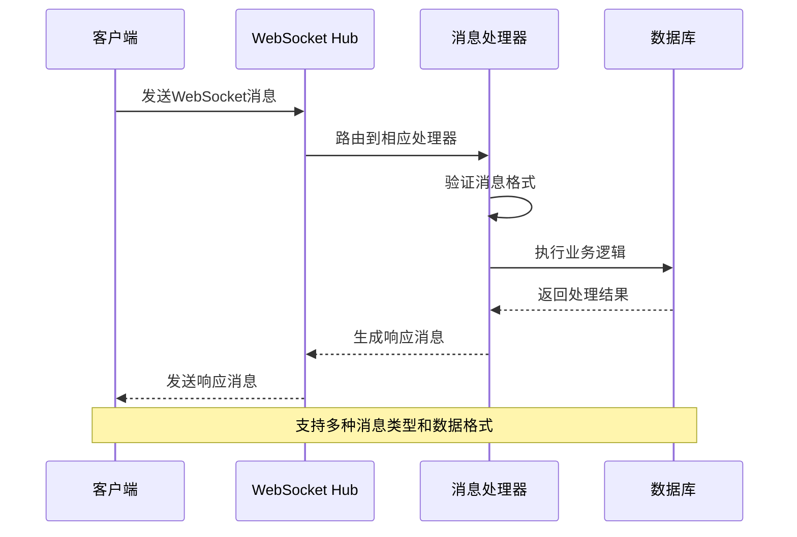
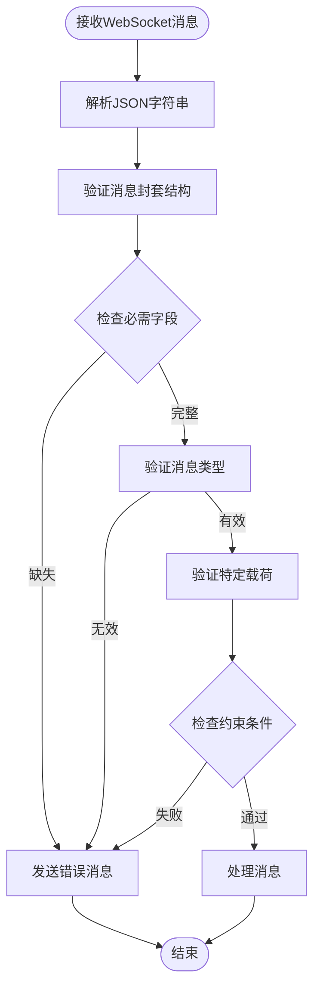
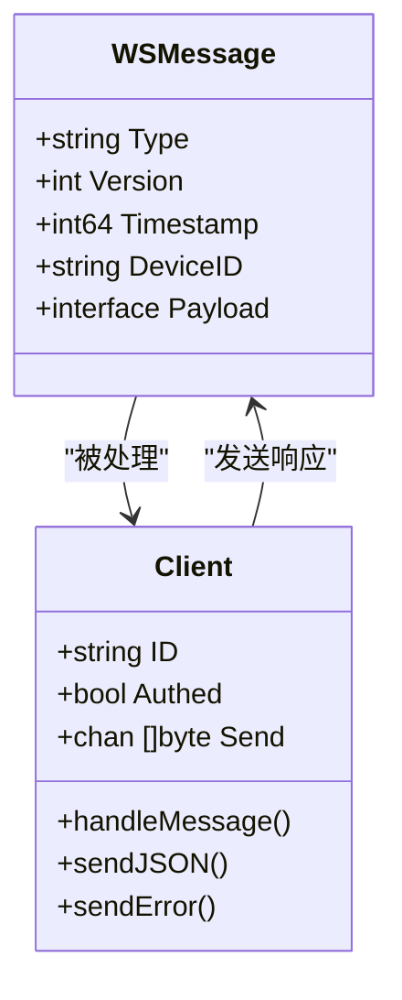
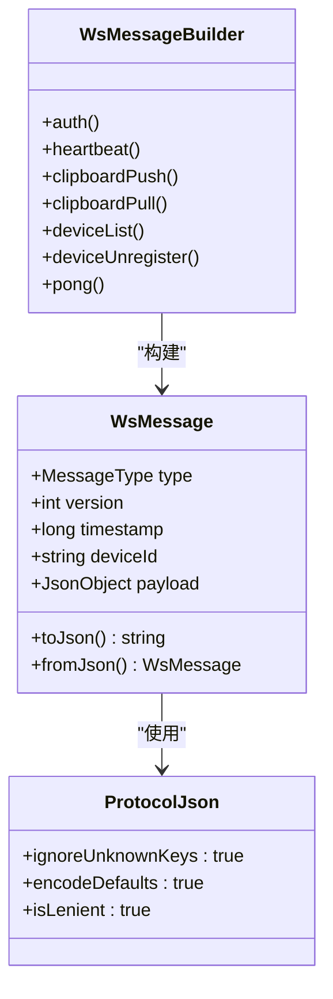
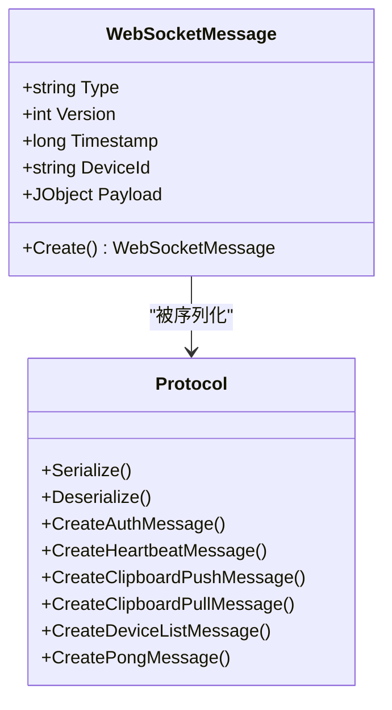
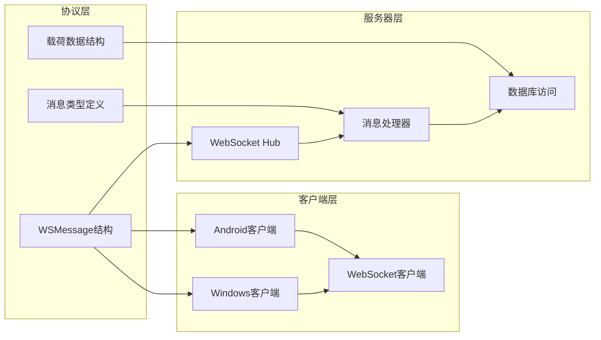

# 消息封装格式

<cite>
**本文档引用的文件**
- [ws-messages.schema.json](file://protocol/ws-messages.schema.json)
- [messages.go](file://clipSync-server/pkg/protocol/messages.go)
- [client.go](file://clipSync-server/internal/websocket/client.go)
- [handler.go](file://clipSync-server/internal/websocket/handler.go)
- [Protocol.kt](file://clipSync-android/app/src/main/java/com/clipsync/app/network/Protocol.kt)
- [WebSocketClient.kt](file://clipSync-android/app/src/main/java/com/clipsync/app/network/WebSocketClient.kt)
- [Protocol.cs](file://clipSync-windows/ClipSync.WPF/Network/Protocol.cs)
- [WebSocketClient.cs](file://clipSync-windows/ClipSync.WPF/Network/WebSocketClient.cs)
- [test-protocol-compatibility.ps1](file://scripts/test-protocol-compatibility.ps1)
</cite>

## 目录
1. [简介](#简介)
2. [项目结构](#项目结构)
3. [核心组件](#核心组件)
4. [架构概览](#架构概览)
5. [详细组件分析](#详细组件分析)
6. [依赖关系分析](#依赖关系分析)
7. [性能考虑](#性能考虑)
8. [故障排除指南](#故障排除指南)
9. [结论](#结论)

## 简介

ClipSync的WebSocket消息封装格式是一个标准化的消息传输协议，用于在客户端和服务器之间进行实时通信。该协议定义了统一的消息结构，确保跨平台兼容性和数据完整性。

## 项目结构

ClipSync项目采用多语言实现，包含以下关键组件：



**图表来源**
- [ws-messages.schema.json:1-261](file://protocol/ws-messages.schema.json#L1-L261)
- [messages.go:1-132](file://clipSync-server/pkg/protocol/messages.go#L1-L132)

## 核心组件

### 基本消息结构

所有WebSocket消息都遵循统一的封装格式，包含以下必需字段：

| 字段名 | 数据类型 | 必需性 | 描述 |
|--------|----------|--------|------|
| type | string | 必需 | 消息类型标识符 |
| version | integer | 必需 | 协议版本号（固定为1） |
| timestamp | integer | 必需 | Unix时间戳（毫秒） |
| device_id | string | 可选 | 设备唯一标识符 |
| payload | object | 必需 | 类型特定的有效载荷数据 |

### 消息类型枚举

系统支持14种不同的消息类型，每种都有特定的用途和数据结构：



**图表来源**
- [ws-messages.schema.json:37-26](file://protocol/ws-messages.schema.json#L37-L26)
- [messages.go:107-123](file://clipSync-server/pkg/protocol/messages.go#L107-L123)

**章节来源**
- [ws-messages.schema.json:5-44](file://protocol/ws-messages.schema.json#L5-L44)
- [messages.go:5-12](file://clipSync-server/pkg/protocol/messages.go#L5-L12)

## 架构概览

ClipSync采用分层架构设计，确保消息处理的清晰分离：



**图表来源**
- [client.go:33-67](file://clipSync-server/internal/websocket/client.go#L33-L67)
- [handler.go:10-31](file://clipSync-server/internal/websocket/handler.go#L10-L31)

## 详细组件分析

### JSON Schema验证机制

消息验证通过JSON Schema实现，提供严格的结构和数据类型检查：



**图表来源**
- [ws-messages.schema.json:6-87](file://protocol/ws-messages.schema.json#L6-L87)
- [client.go:59-65](file://clipSync-server/internal/websocket/client.go#L59-L65)

### 消息序列化和反序列化

#### Go服务器端实现

服务器端使用标准库进行JSON序列化：



**图表来源**
- [messages.go:6-12](file://clipSync-server/pkg/protocol/messages.go#L6-L12)
- [client.go:13-31](file://clipSync-server/internal/websocket/client.go#L13-L31)

#### Android客户端实现

Android客户端使用Kotlin序列化库：



**图表来源**
- [Protocol.kt:20-34](file://clipSync-android/app/src/main/java/com/clipsync/app/network/Protocol.kt#L20-L34)
- [Protocol.kt:12-16](file://clipSync-android/app/src/main/java/com/clipsync/app/network/Protocol.kt#L12-L16)

#### Windows客户端实现

Windows客户端使用Newtonsoft.Json进行序列化：



**图表来源**
- [Protocol.cs:8-36](file://clipSync-windows/ClipSync.WPF/Network/Protocol.cs#L8-L36)
- [Protocol.cs:60-165](file://clipSync-windows/ClipSync.WPF/Network/Protocol.cs#L60-L165)

**章节来源**
- [Protocol.kt:12-34](file://clipSync-android/app/src/main/java/com/clipsync/app/network/Protocol.kt#L12-L34)
- [Protocol.cs:62-77](file://clipSync-windows/ClipSync.WPF/Network/Protocol.cs#L62-L77)

### 消息验证规则

#### 必需字段检查

所有消息必须包含以下必需字段：
- `type`: 必须是预定义的消息类型之一
- `version`: 必须为1（固定版本）
- `timestamp`: 必须为Unix毫秒时间戳
- `payload`: 必须为有效的JSON对象

#### 类型特定验证

不同消息类型的载荷具有不同的验证规则：

| 消息类型 | 必需字段 | 约束条件 |
|----------|----------|----------|
| auth | token | 必需，非空字符串 |
| auth_response | success | 必需，布尔值 |
| clipboard_push | content_type, content, format, checksum | content_type必须为"text"、"image"或"file" |
| clipboard_sync | 同上 + source_device_id, source_device_name | 同上，且新增加密标志 |
| clipboard_pull | 无必需字段 | limit默认20，范围1-50 |
| device_list_response | devices | devices必须为数组 |
| error | code, message | code必须为预定义错误码之一 |

**章节来源**
- [ws-messages.schema.json:46-87](file://protocol/ws-messages.schema.json#L46-L87)
- [handler.go:142-234](file://clipSync-server/internal/websocket/handler.go#L142-L234)

### 完整JSON示例

以下是各种消息类型的完整JSON示例：

#### 认证消息
```json
{
  "type": "auth",
  "version": 1,
  "timestamp": 1703678400000,
  "device_id": "device-001",
  "payload": {
    "token": "eyJhbGciOiJIUzI1NiIsInR5cCI6IkpXVCJ9...",
    "device_name": "Android Phone",
    "platform": "android"
  }
}
```

#### 剪贴板推送消息
```json
{
  "type": "clipboard_push",
  "version": 1,
  "timestamp": 1703678401000,
  "payload": {
    "content_type": "text",
    "content": "Hello World",
    "format": "text/plain",
    "size": 11,
    "checksum": "a1b2c3d4e5f6",
    "encrypted": false
  }
}
```

#### 心跳消息
```json
{
  "type": "heartbeat",
  "version": 1,
  "timestamp": 1703678402000,
  "payload": {
    "seq": 1
  }
}
```

#### 错误消息
```json
{
  "type": "error",
  "version": 1,
  "timestamp": 1703678403000,
  "payload": {
    "code": "AUTH_FAILED",
    "message": "Authentication required"
  }
}
```

## 依赖关系分析

### 组件耦合度



**图表来源**
- [messages.go:1-132](file://clipSync-server/pkg/protocol/messages.go#L1-L132)
- [client.go:1-150](file://clipSync-server/internal/websocket/client.go#L1-L150)

### 外部依赖

系统主要依赖以下外部库：

- **Go服务器**: gorilla/websocket（WebSocket协议实现）
- **Android客户端**: kotlinx.serialization（Kotlin JSON序列化）
- **Windows客户端**: Newtonsoft.Json（.NET JSON序列化）

**章节来源**
- [client.go:3-7](file://clipSync-server/internal/websocket/client.go#L3-L7)
- [Protocol.kt:3-6](file://clipSync-android/app/src/main/java/com/clipsync/app/network/Protocol.kt#L3-L6)
- [Protocol.cs:3-4](file://clipSync-windows/ClipSync.WPF/Network/Protocol.cs#L3-L4)

## 性能考虑

### 消息大小限制

- **单个消息最大大小**: 1MB（图像和文件内容）
- **历史消息限制**: 默认20条，最大50条
- **发送缓冲区**: 256条消息队列

### 连接管理

- **心跳间隔**: 30秒
- **认证超时**: 30秒内必须完成认证
- **连接超时**: 无读取超时（WebSocket专用）

### 序列化优化

- **Go服务器**: 使用标准JSON库，性能稳定
- **Android客户端**: Kotlin序列化库，零反射开销
- **Windows客户端**: Newtonsoft.Json，高性能JSON处理

## 故障排除指南

### 常见错误类型

| 错误代码 | 描述 | 解决方案 |
|----------|------|----------|
| AUTH_FAILED | 认证失败 | 检查token有效性，重新登录 |
| TOKEN_EXPIRED | 令牌过期 | 请求新的访问令牌 |
| INVALID_PAYLOAD | 无效载荷 | 检查JSON格式和必需字段 |
| DUPLICATE_CONTENT | 重复内容 | 检查去重机制 |
| DEVICE_NOT_FOUND | 设备未找到 | 验证设备ID正确性 |

### 调试建议

1. **启用详细日志**: 在开发环境中启用详细的WebSocket消息日志
2. **验证JSON Schema**: 使用在线JSON Schema验证器测试消息格式
3. **检查时间同步**: 确保客户端和服务器的时间同步
4. **监控连接状态**: 实时监控WebSocket连接状态变化

**章节来源**
- [handler.go:119-135](file://clipSync-server/internal/websocket/handler.go#L119-L135)
- [test-protocol-compatibility.ps1:150-164](file://scripts/test-protocol-compatibility.ps1#L150-L164)

## 结论

ClipSync的WebSocket消息封装格式提供了高度一致和可靠的跨平台通信机制。通过严格的JSON Schema验证、标准化的消息结构和完善的错误处理机制，确保了系统的稳定性和可维护性。

该协议的设计充分考虑了实际应用场景的需求，支持多种消息类型、灵活的载荷结构和强大的扩展能力。同时，通过多语言实现确保了广泛的平台兼容性。

未来可以考虑的改进方向包括：
- 添加消息签名验证机制
- 实现更细粒度的错误分类
- 增加消息压缩功能
- 支持批量消息传输