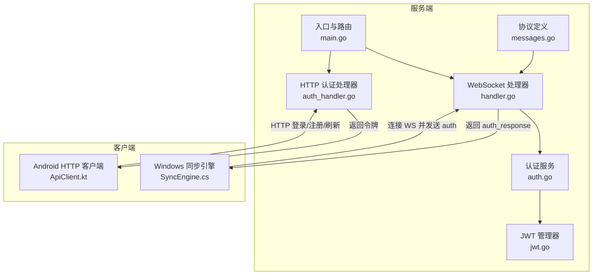
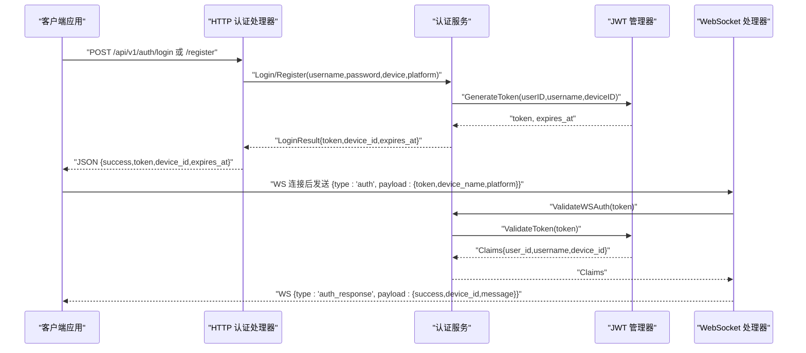
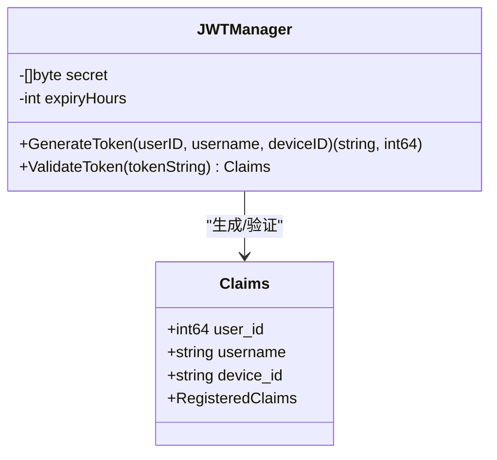
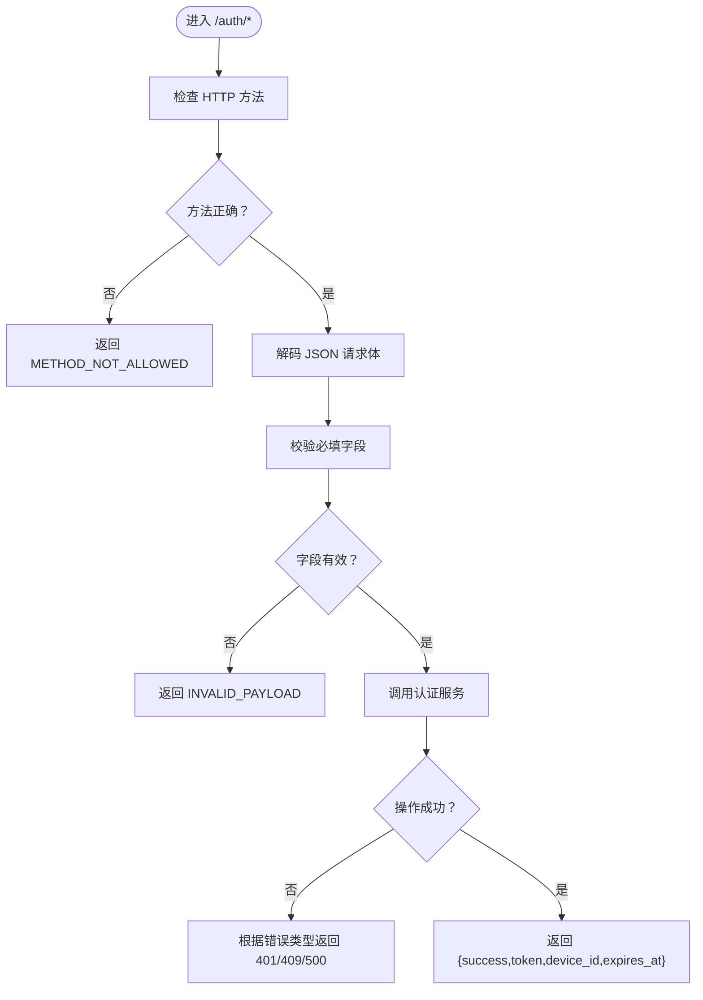
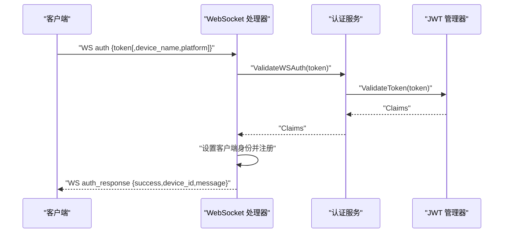
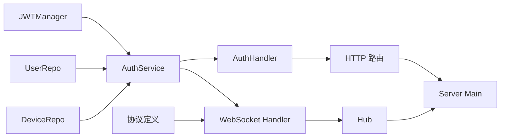

# 认证消息

<cite>
**本文引用的文件**
- [auth.go](file://clipSync-server/internal/auth/auth.go)
- [jwt.go](file://clipSync-server/internal/auth/jwt.go)
- [middleware.go](file://clipSync-server/internal/auth/middleware.go)
- [messages.go](file://clipSync-server/pkg/protocol/messages.go)
- [auth_handler.go](file://clipSync-server/internal/httpserver/auth_handler.go)
- [handler.go](file://clipSync-server/internal/websocket/handler.go)
- [ws-messages.schema.json](file://protocol/ws-messages.schema.json)
- [ApiClient.kt](file://clipSync-android/app/src/main/java/com/clipsync/app/network/ApiClient.kt)
- [SyncEngine.cs](file://clipSync-windows/ClipSync.WPF/Core/SyncEngine.cs)
- [main.go](file://clipSync-server/cmd/server/main.go)
</cite>

## 目录
1. [简介](#简介)
2. [项目结构](#项目结构)
3. [核心组件](#核心组件)
4. [架构总览](#架构总览)
5. [详细组件分析](#详细组件分析)
6. [依赖分析](#依赖分析)
7. [性能考虑](#性能考虑)
8. [故障排除指南](#故障排除指南)
9. [结论](#结论)
10. [附录](#附录)

## 简介
本文件聚焦于“认证消息”的完整说明，覆盖以下方面：
- auth 消息结构：token 字段（JWT 令牌）、device_name 字段（设备名称）、platform 字段（平台类型）
- auth_response 响应结构：success 字段（认证结果）、device_id 字段（设备 ID）、message 字段（消息内容）
- 认证流程与状态管理：登录/注册/刷新令牌的端到端流程、WebSocket 认证握手、错误码与重试策略
- JWT 令牌生成与验证机制：Claims 结构、签发与校验逻辑
- 客户端实现要点：Android 与 Windows 客户端如何发起认证请求与处理响应

## 项目结构
认证相关代码主要分布在服务端的认证模块、协议定义、HTTP 处理器与 WebSocket 处理器；客户端在 Android 与 Windows 平台分别通过 HTTP API 获取令牌，并通过 WebSocket 发送认证消息。

图表来源
- [auth.go:1-137](file://clipSync-server/internal/auth/auth.go#L1-L137)
- [jwt.go:1-76](file://clipSync-server/internal/auth/jwt.go#L1-L76)
- [auth_handler.go:1-215](file://clipSync-server/internal/httpserver/auth_handler.go#L1-L215)
- [handler.go:1-392](file://clipSync-server/internal/websocket/handler.go#L1-L392)
- [messages.go:1-132](file://clipSync-server/pkg/protocol/messages.go#L1-L132)
- [main.go:1-146](file://clipSync-server/cmd/server/main.go#L1-L146)
- [ApiClient.kt:1-142](file://clipSync-android/app/src/main/java/com/clipsync/app/network/ApiClient.kt#L1-L142)
- [SyncEngine.cs:1-422](file://clipSync-windows/ClipSync.WPF/Core/SyncEngine.cs#L1-L422)

章节来源
- [main.go:74-125](file://clipSync-server/cmd/server/main.go#L74-L125)
- [messages.go:14-26](file://clipSync-server/pkg/protocol/messages.go#L14-L26)

## 核心组件
- 认证服务 Service：负责用户/设备存在性检查、密码验证、设备创建与更新、JWT 令牌生成与刷新
- JWT 管理器 JWTManager：负责 Claims 结构、HS256 签名、过期时间控制、令牌生成与验证
- HTTP 认证处理器 AuthHandler：提供登录、注册、刷新接口，进行参数校验与错误响应
- WebSocket 处理器：接收 auth 消息，验证 JWT，设置客户端身份，返回 auth_response
- 协议定义 messages.go：定义 WSMessage、AuthPayload、AuthResponsePayload 等结构
- 客户端实现：Android 使用 ApiClient 发起 HTTP 请求；Windows 使用 SyncEngine 连接 WS 并发送 auth

章节来源
- [auth.go:8-137](file://clipSync-server/internal/auth/auth.go#L8-L137)
- [jwt.go:10-76](file://clipSync-server/internal/auth/jwt.go#L10-L76)
- [auth_handler.go:11-215](file://clipSync-server/internal/httpserver/auth_handler.go#L11-L215)
- [handler.go:33-110](file://clipSync-server/internal/websocket/handler.go#L33-L110)
- [messages.go:5-132](file://clipSync-server/pkg/protocol/messages.go#L5-L132)

## 架构总览
下图展示从客户端到服务端的认证交互路径，包括 HTTP 登录/注册/刷新与 WebSocket 认证握手。

图表来源
- [auth_handler.go:63-175](file://clipSync-server/internal/httpserver/auth_handler.go#L63-L175)
- [auth.go:67-116](file://clipSync-server/internal/auth/auth.go#L67-L116)
- [jwt.go:32-75](file://clipSync-server/internal/auth/jwt.go#L32-L75)
- [handler.go:33-110](file://clipSync-server/internal/websocket/handler.go#L33-L110)

## 详细组件分析

### 认证消息结构与响应
- auth 消息（WebSocket）
  - 类型：WSMessage.Type = "auth"
  - 载荷：AuthPayload
    - token：字符串，必填
    - device_name：字符串，可选
    - platform：字符串，枚举值为 windows/android/macos/ios，可选
  - 参考 JSON Schema 定义与协议常量
- auth_response 消息（WebSocket）
  - 类型：WSMessage.Type = "auth_response"
  - 载荷：AuthResponsePayload
    - success：布尔值
    - device_id：字符串，可选
    - message：字符串，可选
  - 参考 JSON Schema 定义与协议常量

章节来源
- [messages.go:14-26](file://clipSync-server/pkg/protocol/messages.go#L14-L26)
- [messages.go:21-26](file://clipSync-server/pkg/protocol/messages.go#L21-L26)
- [ws-messages.schema.json:89-114](file://protocol/ws-messages.schema.json#L89-L114)

### JWT 令牌生成与验证
- Claims 结构
  - 包含 user_id、username、device_id 以及标准声明（过期时间、签发时间、发行者）
- 生成流程
  - 设置过期时间（小时配置），构造 Claims，使用 HS256 签名生成 token
- 验证流程
  - 校验签名算法，解析 Claims，确认 token 有效

图表来源
- [jwt.go:10-22](file://clipSync-server/internal/auth/jwt.go#L10-L22)
- [jwt.go:32-75](file://clipSync-server/internal/auth/jwt.go#L32-L75)

章节来源
- [jwt.go:10-76](file://clipSync-server/internal/auth/jwt.go#L10-L76)

### HTTP 认证流程（登录/注册/刷新）
- 登录/注册
  - 参数校验：用户名长度、密码强度、设备名与平台均非空
  - 登录：验证凭据，查找或创建设备，生成 JWT
  - 注册：检查用户名是否存在，创建用户与设备，生成 JWT
- 刷新
  - 从 Authorization 头提取 Bearer Token，验证后重新签发新 token

图表来源
- [auth_handler.go:63-175](file://clipSync-server/internal/httpserver/auth_handler.go#L63-L175)

章节来源
- [auth_handler.go:21-215](file://clipSync-server/internal/httpserver/auth_handler.go#L21-L215)

### WebSocket 认证握手
- 客户端连接 WS 后发送 auth 消息
- 服务端解析 payload，校验 token
- 成功后设置客户端身份（UserID/Username/DeviceID/DeviceName/Platform），注册到 Hub，并返回 auth_response

图表来源
- [handler.go:33-110](file://clipSync-server/internal/websocket/handler.go#L33-L110)
- [auth.go:133-136](file://clipSync-server/internal/auth/auth.go#L133-L136)
- [jwt.go:57-75](file://clipSync-server/internal/auth/jwt.go#L57-L75)

章节来源
- [handler.go:33-110](file://clipSync-server/internal/websocket/handler.go#L33-L110)

### 客户端实现要点
- Android（ApiClient.kt）
  - 提供 login/register/refresh 接口，内部以 JSON 形式发送请求
  - refresh 时在 Authorization 头添加 Bearer token
- Windows（SyncEngine.cs）
  - 连接 WS 后构造 auth 消息并发送
  - 收到 auth_response 后更新本地设备信息并启动心跳与重连

章节来源
- [ApiClient.kt:20-54](file://clipSync-android/app/src/main/java/com/clipsync/app/network/ApiClient.kt#L20-L54)
- [SyncEngine.cs:73-93](file://clipSync-windows/ClipSync.WPF/Core/SyncEngine.cs#L73-L93)
- [SyncEngine.cs:165-186](file://clipSync-windows/ClipSync.WPF/Core/SyncEngine.cs#L165-L186)

## 依赖分析
- 认证服务依赖 JWT 管理器与数据库仓库（用户、设备）
- HTTP 路由中对 /api/v1/auth/* 应用速率限制中间件
- WebSocket 服务器独立端口运行，路由到 Hub 的 WSHandler
- 协议定义统一了消息结构与枚举值，确保客户端与服务端一致

图表来源
- [auth.go:8-22](file://clipSync-server/internal/auth/auth.go#L8-L22)
- [auth_handler.go:80-84](file://clipSync-server/internal/httpserver/auth_handler.go#L80-L84)
- [main.go:74-125](file://clipSync-server/cmd/server/main.go#L74-L125)
- [messages.go:107-123](file://clipSync-server/pkg/protocol/messages.go#L107-L123)

章节来源
- [main.go:74-125](file://clipSync-server/cmd/server/main.go#L74-L125)
- [messages.go:107-123](file://clipSync-server/pkg/protocol/messages.go#L107-L123)

## 性能考虑
- JWT 过期时间：通过配置项控制，建议根据业务安全需求调整
- 速率限制：对认证端点启用每 IP 每分钟 10 次的限流，防止暴力破解
- WebSocket 连接：独立端口与轻量级消息处理，避免阻塞 HTTP 业务

## 故障排除指南
- 常见错误码（来自协议 JSON Schema）
  - AUTH_FAILED：认证失败（如未提供 Authorization 或 token 无效）
  - TOKEN_EXPIRED：令牌过期（刷新接口返回）
  - INVALID_PAYLOAD：请求体格式或字段不合法
  - RATE_LIMITED：超过速率限制
  - INTERNAL_ERROR：服务器内部错误
- 错误处理策略
  - HTTP 层：针对不同错误返回对应状态码与错误码
  - WebSocket 层：认证失败时发送 error 消息，客户端据此切换状态
  - 重试机制：客户端在连接断开或认证失败时，按指数退避策略重连与重试
- 典型排查步骤
  - 确认 Authorization 头格式是否为 Bearer
  - 检查 token 是否过期，必要时调用刷新接口
  - 校验设备名与平台是否符合枚举值
  - 查看服务端日志定位具体错误位置

章节来源
- [auth_handler.go:87-100](file://clipSync-server/internal/httpserver/auth_handler.go#L87-L100)
- [auth_handler.go:153-167](file://clipSync-server/internal/httpserver/auth_handler.go#L153-L167)
- [auth_handler.go:194-201](file://clipSync-server/internal/httpserver/auth_handler.go#L194-L201)
- [handler.go:53-63](file://clipSync-server/internal/websocket/handler.go#L53-L63)
- [ws-messages.schema.json:243-258](file://protocol/ws-messages.schema.json#L243-L258)

## 结论
本文系统梳理了认证消息的结构、JWT 令牌的生成与验证、HTTP 与 WebSocket 的认证流程、错误处理与重试策略，并结合客户端实现给出实践建议。遵循本文档可确保跨平台客户端与服务端在认证环节保持一致的行为与健壮性。

## 附录

### 认证消息 JSON 示例
- auth 请求（WebSocket）
  - 字段：type="auth"，version=1，timestamp=毫秒时间戳，payload={token, device_name(可选), platform(可选)}
  - 参考协议定义与 JSON Schema
- auth_response 响应（WebSocket）
  - 字段：type="auth_response"，version=1，timestamp=毫秒时间戳，payload={success, device_id(可选), message(可选)}
  - 参考协议定义与 JSON Schema

章节来源
- [messages.go:5-12](file://clipSync-server/pkg/protocol/messages.go#L5-L12)
- [messages.go:21-26](file://clipSync-server/pkg/protocol/messages.go#L21-L26)
- [ws-messages.schema.json:89-114](file://protocol/ws-messages.schema.json#L89-L114)