# 设备管理消息

<cite>
**本文档引用的文件**
- [messages.go](file://clipSync-server/pkg/protocol/messages.go)
- [device_repo.go](file://clipSync-server/internal/database/device_repo.go)
- [device_handler.go](file://clipSync-server/internal/httpserver/device_handler.go)
- [hub.go](file://clipSync-server/internal/websocket/hub.go)
- [models.go](file://clipSync-server/internal/database/models.go)
- [ws-messages.schema.json](file://protocol/ws-messages.schema.json)
- [Protocol.kt](file://clipSync-android/app/src/main/java/com/clipsync/app/network/Protocol.kt)
- [SyncEngine.cs](file://clipSync-windows/ClipSync.WPF/Core/SyncEngine.cs)
- [WebSocketClient.kt](file://clipSync-android/app/src/main/java/com/clipsync/app/network/WebSocketClient.kt)
- [WebSocketClient.cs](file://clipSync-windows/ClipSync.WPF/Network/WebSocketClient.cs)
- [DeviceEntity.kt](file://clipSync-android/app/src/main/java/com/clipsync/app/data/entities/DeviceEntity.kt)
</cite>

## 目录
1. [简介](#简介)
2. [项目结构](#项目结构)
3. [核心组件](#核心组件)
4. [架构概览](#架构概览)
5. [详细组件分析](#详细组件分析)
6. [依赖关系分析](#依赖关系分析)
7. [性能考虑](#性能考虑)
8. [故障排除指南](#故障排除指南)
9. [结论](#结论)

## 简介

本文档详细说明了ClipSync设备管理系统的消息协议，特别是`device_list_response`消息的结构和处理流程。该系统支持多平台设备间的剪贴板同步，通过WebSocket实现实时通信，并提供了完整的设备生命周期管理功能。

## 项目结构

ClipSync采用分层架构设计，主要分为以下层次：

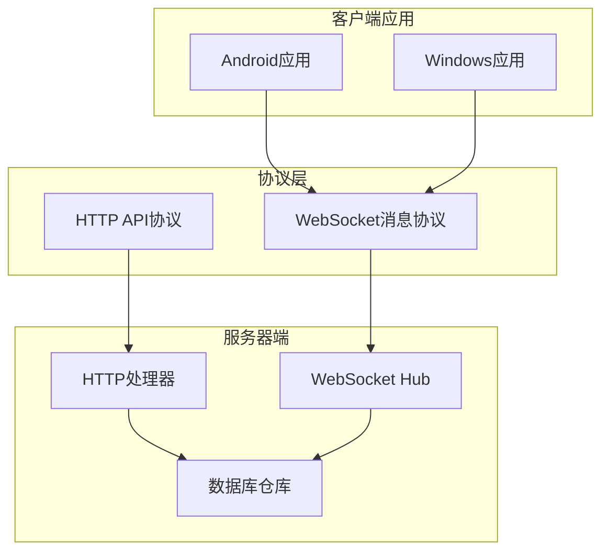

**图表来源**
- [messages.go:1-132](file://clipSync-server/pkg/protocol/messages.go#L1-L132)
- [device_handler.go:1-137](file://clipSync-server/internal/httpserver/device_handler.go#L1-L137)
- [hub.go:1-230](file://clipSync-server/internal/websocket/hub.go#L1-L230)

**章节来源**
- [messages.go:1-132](file://clipSync-server/pkg/protocol/messages.go#L1-L132)
- [device_handler.go:1-137](file://clipSync-server/internal/httpserver/device_handler.go#L1-L137)

## 核心组件

### 设备管理消息协议

系统使用统一的消息协议框架，所有WebSocket消息都遵循相同的包头格式：

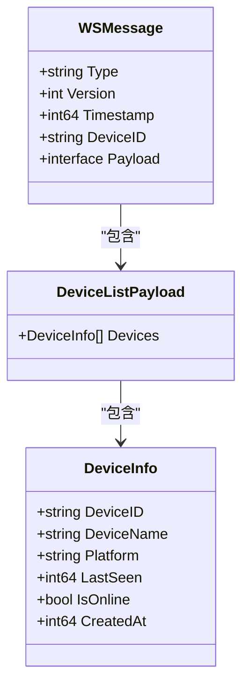

**图表来源**
- [messages.go:6-132](file://clipSync-server/pkg/protocol/messages.go#L6-L132)

### 设备实体模型

服务器端和客户端都维护着设备实体的结构：

| 字段名 | 类型 | 必填 | 描述 | 平台支持 |
|--------|------|------|------|----------|
| device_id | string | 是 | 设备唯一标识符 | 所有平台 |
| device_name | string | 否 | 设备显示名称 | 所有平台 |
| platform | string | 否 | 设备平台类型 | windows/android/macos/ios |
| last_seen | integer | 是 | 最后活跃时间戳(ms) | 所有平台 |
| is_online | boolean | 是 | 当前在线状态 | 所有平台 |
| created_at | integer | 否 | 设备注册时间戳(ms) | 所有平台 |

**章节来源**
- [messages.go:81-89](file://clipSync-server/pkg/protocol/messages.go#L81-L89)
- [DeviceEntity.kt:10-17](file://clipSync-android/app/src/main/java/com/clipsync/app/data/entities/DeviceEntity.kt#L10-L17)

## 架构概览

设备管理系统的核心架构如下：

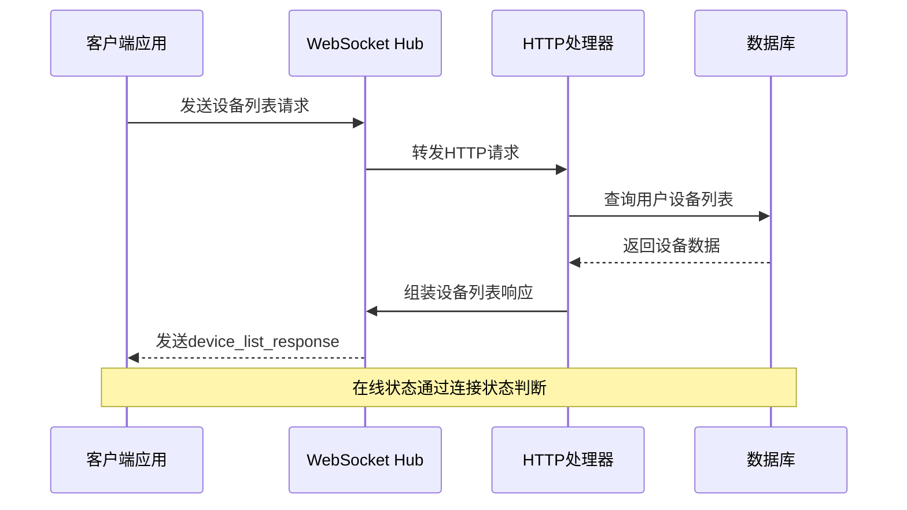

**图表来源**
- [device_handler.go:25-82](file://clipSync-server/internal/httpserver/device_handler.go#L25-L82)
- [hub.go:168-179](file://clipSync-server/internal/websocket/hub.go#L168-L179)

## 详细组件分析

### 设备列表响应消息

`device_list_response`消息是设备管理的核心响应格式：

#### 消息结构定义

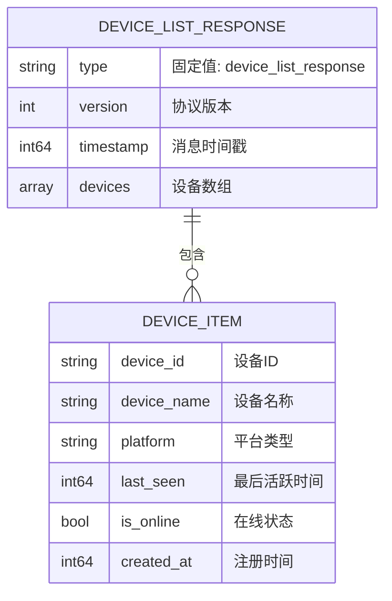

**图表来源**
- [messages.go:91-94](file://clipSync-server/pkg/protocol/messages.go#L91-L94)
- [ws-messages.schema.json:210-234](file://protocol/ws-messages.schema.json#L210-L234)

#### 服务器端实现流程

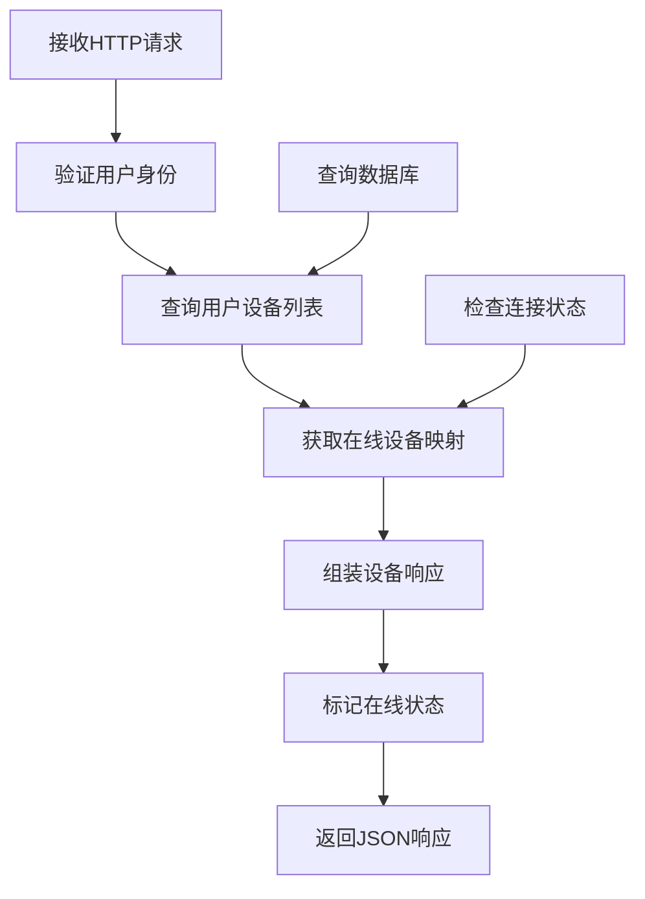

**图表来源**
- [device_handler.go:25-82](file://clipSync-server/internal/httpserver/device_handler.go#L25-L82)

**章节来源**
- [device_handler.go:25-82](file://clipSync-server/internal/httpserver/device_handler.go#L25-L82)

### 设备注册流程

设备注册涉及多个步骤的协作：

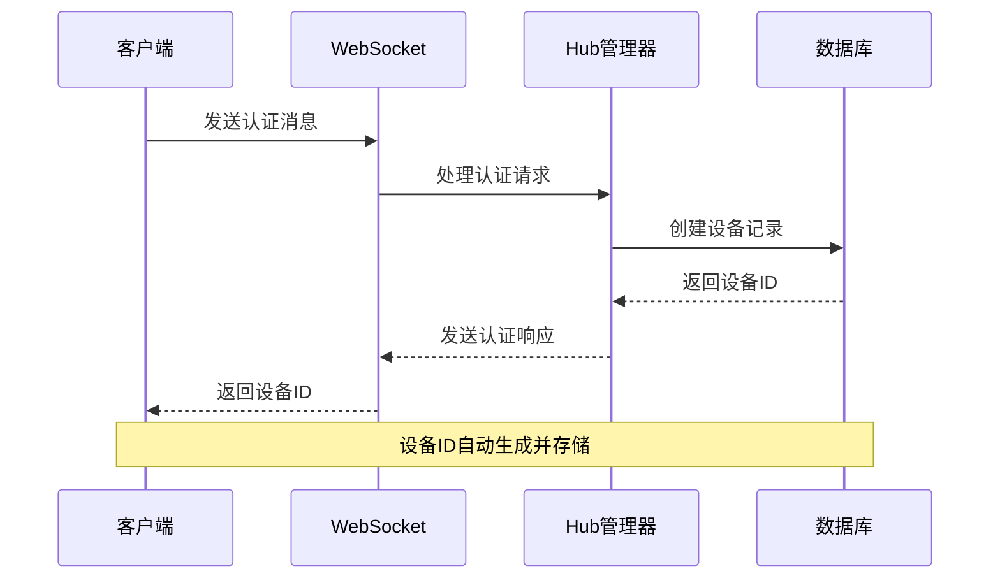

**图表来源**
- [device_repo.go:21-42](file://clipSync-server/internal/database/device_repo.go#L21-L42)

**章节来源**
- [device_repo.go:21-42](file://clipSync-server/internal/database/device_repo.go#L21-L42)

### 设备注销流程

设备注销通过HTTP DELETE请求实现：

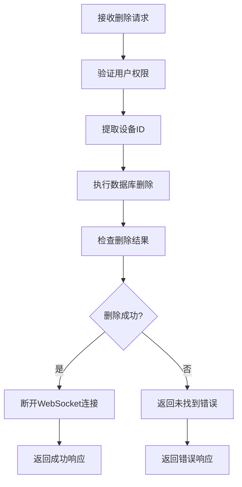

**图表来源**
- [device_handler.go:84-137](file://clipSync-server/internal/httpserver/device_handler.go#L84-L137)

**章节来源**
- [device_handler.go:84-137](file://clipSync-server/internal/httpserver/device_handler.go#L84-L137)

### 在线状态检测机制

系统通过WebSocket连接状态来判断设备在线状态：

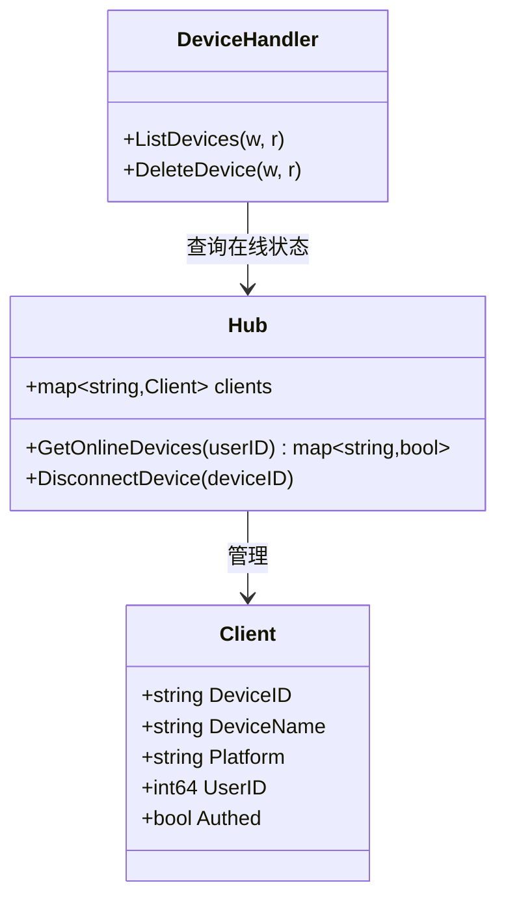

**图表来源**
- [hub.go:18-35](file://clipSync-server/internal/websocket/hub.go#L18-L35)
- [hub.go:168-179](file://clipSync-server/internal/websocket/hub.go#L168-L179)

**章节来源**
- [hub.go:168-179](file://clipSync-server/internal/websocket/hub.go#L168-L179)

### 设备信息存储格式

#### 服务器端存储结构

| 字段名 | 类型 | 约束 | 描述 |
|--------|------|------|------|
| id | string | 主键 | 设备唯一ID |
| user_id | bigint | 外键 | 用户ID |
| device_name | string | 可空 | 设备名称 |
| platform | string | 非空 | 平台类型 |
| last_seen | bigint | 非空 | 最后活跃时间 |
| created_at | bigint | 非空 | 注册时间 |

#### 客户端存储结构

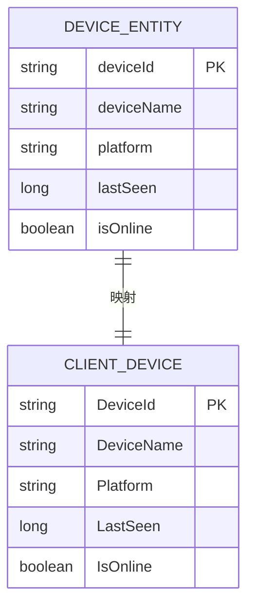

**图表来源**
- [models.go:11-19](file://clipSync-server/internal/database/models.go#L11-L19)
- [DeviceEntity.kt:10-17](file://clipSync-android/app/src/main/java/com/clipsync/app/data/entities/DeviceEntity.kt#L10-L17)

**章节来源**
- [models.go:11-19](file://clipSync-server/internal/database/models.go#L11-L19)
- [DeviceEntity.kt:10-17](file://clipSync-android/app/src/main/java/com/clipsync/app/data/entities/DeviceEntity.kt#L10-L17)

## 依赖关系分析

### 组件间依赖关系

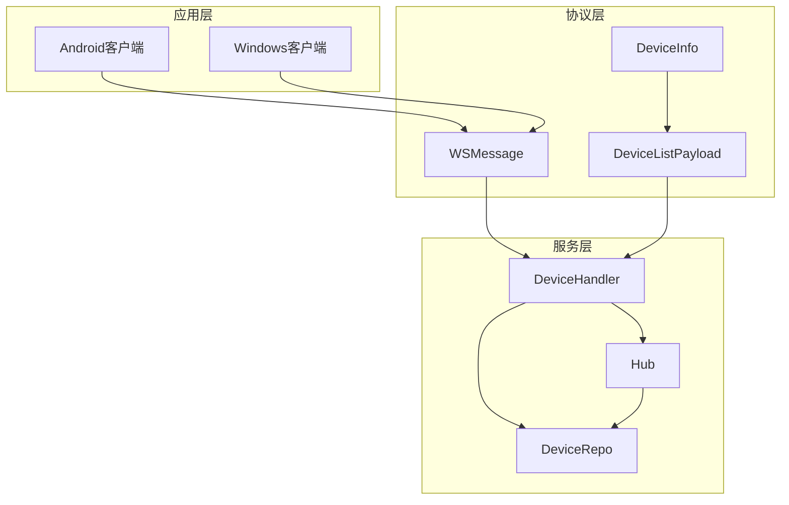

**图表来源**
- [messages.go:1-132](file://clipSync-server/pkg/protocol/messages.go#L1-L132)
- [device_handler.go:1-23](file://clipSync-server/internal/httpserver/device_handler.go#L1-L23)

### 数据流依赖

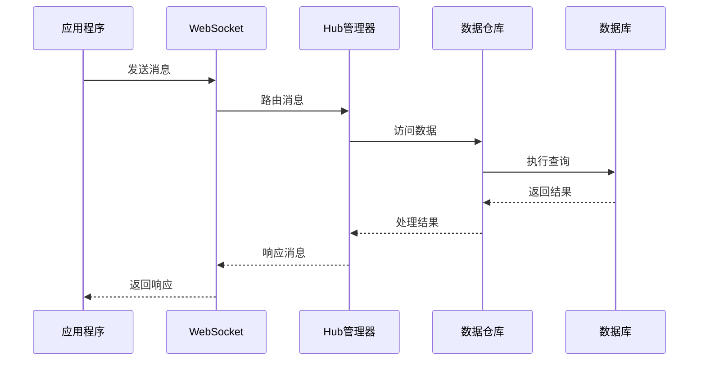

**图表来源**
- [hub.go:60-112](file://clipSync-server/internal/websocket/hub.go#L60-L112)
- [device_repo.go:1-126](file://clipSync-server/internal/database/device_repo.go#L1-L126)

**章节来源**
- [hub.go:60-112](file://clipSync-server/internal/websocket/hub.go#L60-L112)
- [device_repo.go:1-126](file://clipSync-server/internal/database/device_repo.go#L1-L126)

## 性能考虑

### 查询优化策略

1. **索引优化**
   - 为`devices.user_id`建立索引以加速用户设备查询
   - 为`devices.id`建立主键索引确保唯一性约束

2. **连接池管理**
   - 使用连接池复用数据库连接
   - 实施连接超时和重试机制

3. **内存缓存**
   - 缓存用户设备列表减少数据库查询
   - 实施LRU缓存策略避免内存泄漏

### WebSocket性能优化

1. **消息队列**
   - 使用带缓冲的消息队列处理高并发
   - 实施背压机制防止内存溢出

2. **心跳机制**
   - 定期发送心跳包维持连接
   - 实施超时检测及时清理无效连接

## 故障排除指南

### 常见问题诊断

#### 设备列表为空
- 检查用户认证状态
- 验证设备是否正确注册
- 确认数据库连接正常

#### 在线状态异常
- 检查WebSocket连接状态
- 验证心跳机制是否正常工作
- 查看Hub中的客户端连接数

#### 设备注销失败
- 确认设备ID格式正确
- 验证用户权限
- 检查数据库事务状态

### 错误处理机制

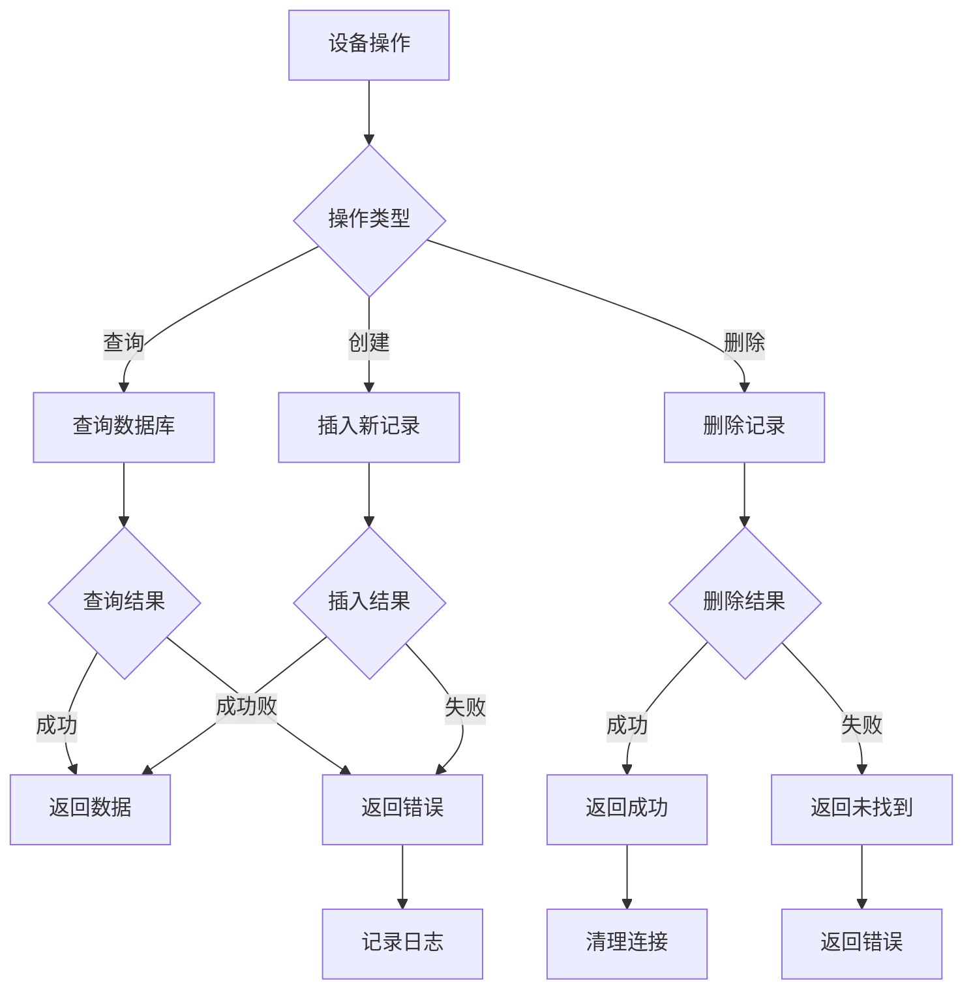

**图表来源**
- [device_handler.go:41-136](file://clipSync-server/internal/httpserver/device_handler.go#L41-L136)

**章节来源**
- [device_handler.go:41-136](file://clipSync-server/internal/httpserver/device_handler.go#L41-L136)

## 结论

ClipSync设备管理系统通过标准化的消息协议实现了跨平台的设备管理功能。系统采用分层架构设计，具有良好的可扩展性和维护性。`device_list_response`消息作为核心协议元素，为客户端提供了完整的设备状态信息。

关键特性包括：
- 统一的消息协议格式
- 基于WebSocket的实时通信
- 完整的设备生命周期管理
- 灵活的权限控制机制
- 优化的查询和存储策略

该系统为多设备间的剪贴板同步提供了可靠的技术基础，支持未来功能的扩展和增强。