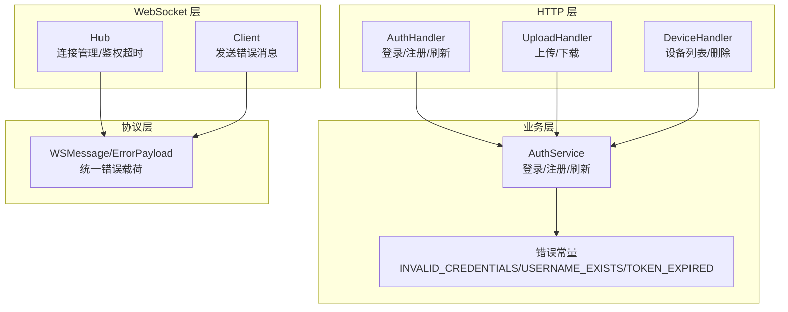
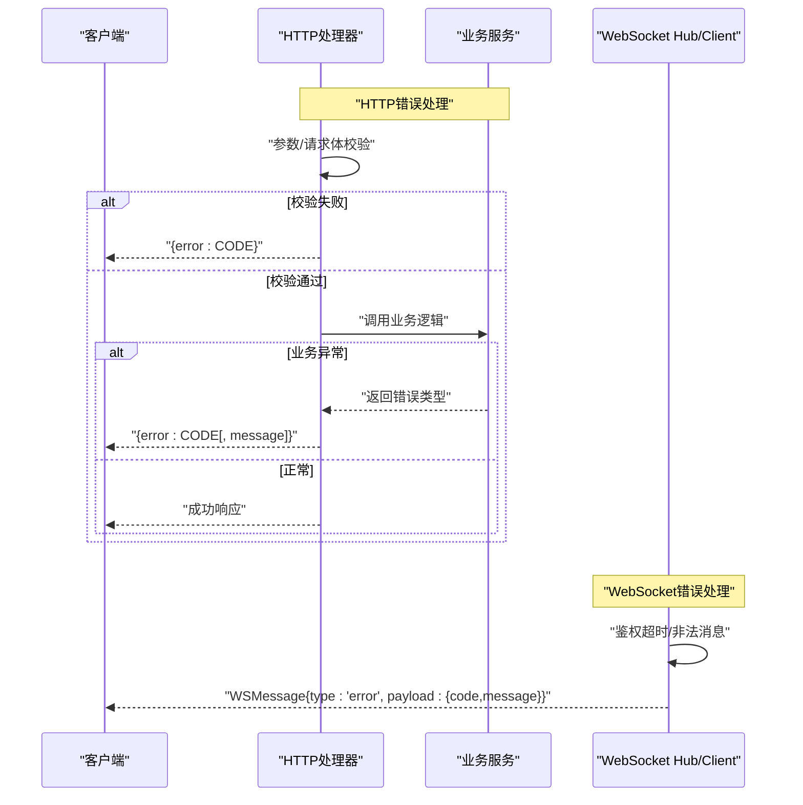
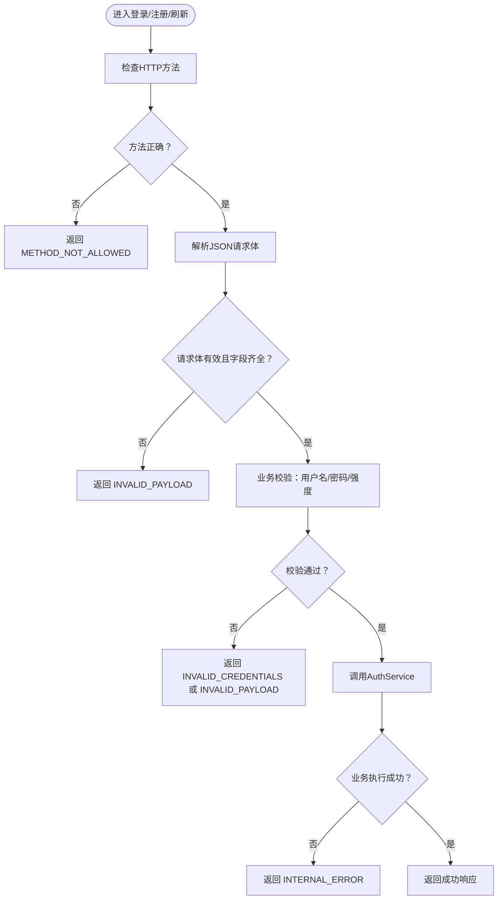
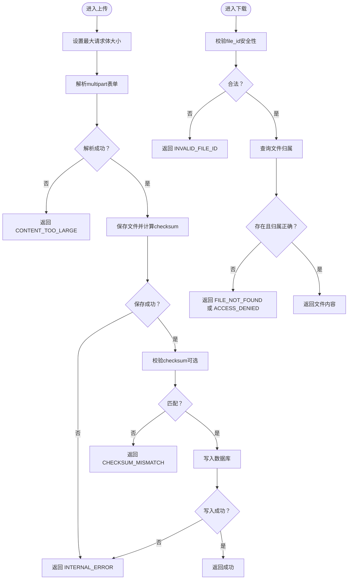
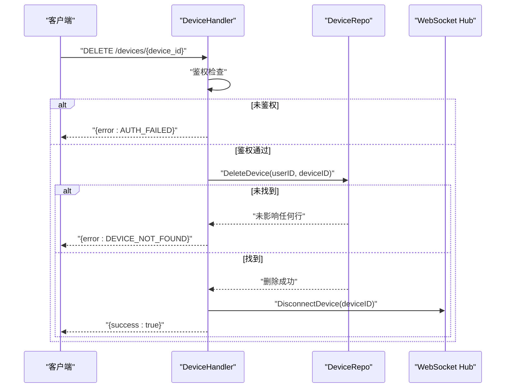
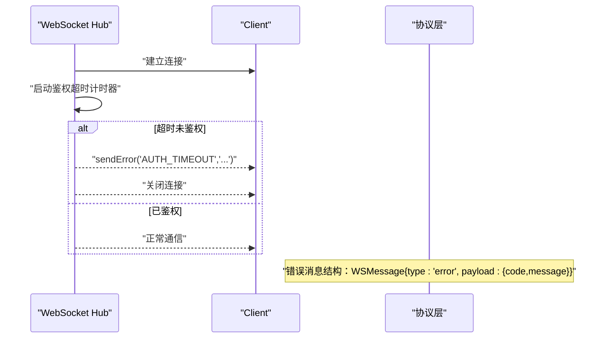
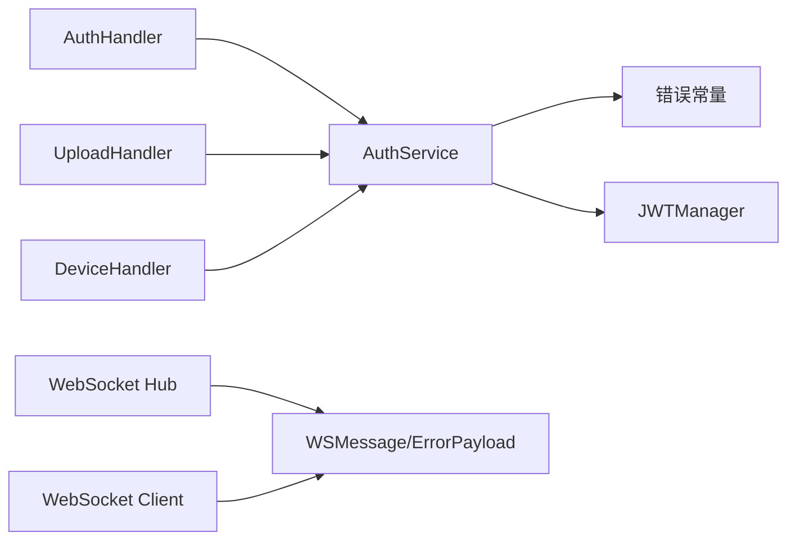

# 错误处理消息

<cite>
**本文引用的文件**
- [clipSync-server/internal/httpserver/auth_handler.go](file://clipSync-server/internal/httpserver/auth_handler.go)
- [clipSync-server/internal/httpserver/upload_handler.go](file://clipSync-server/internal/httpserver/upload_handler.go)
- [clipSync-server/internal/httpserver/device_handler.go](file://clipSync-server/internal/httpserver/device_handler.go)
- [clipSync-server/internal/auth/auth.go](file://clipSync-server/internal/auth/auth.go)
- [clipSync-server/internal/auth/errors.go](file://clipSync-server/internal/auth/errors.go)
- [clipSync-server/pkg/protocol/messages.go](file://clipSync-server/pkg/protocol/messages.go)
- [clipSync-server/internal/websocket/hub.go](file://clipSync-server/internal/websocket/hub.go)
- [clipSync-server/internal/websocket/client.go](file://clipSync-server/internal/websocket/client.go)
- [protocol/http-api.schema.json](file://protocol/http-api.schema.json)
- [DEVELOPMENT_PLAN.md](file://DEVELOPMENT_PLAN.md)
</cite>

## 目录
1. [简介](#简介)
2. [项目结构](#项目结构)
3. [核心组件](#核心组件)
4. [架构总览](#架构总览)
5. [详细组件分析](#详细组件分析)
6. [依赖分析](#依赖分析)
7. [性能考虑](#性能考虑)
8. [故障排查指南](#故障排查指南)
9. [结论](#结论)
10. [附录](#附录)

## 简介
本文件系统性梳理服务端的错误处理消息规范与实现，重点覆盖以下方面：
- 错误消息结构：统一使用包含 code 与 message 的错误载荷，便于客户端一致化处理。
- 错误代码清单与语义：涵盖 AUTH_FAILED、TOKEN_EXPIRED、RATE_LIMITED、INVALID_PAYLOAD、CONTENT_TOO_LARGE、DEVICE_NOT_FOUND、INTERNAL_ERROR、DUPLICATE_CONTENT 等。
- 分类与处理策略：区分认证/授权、资源访问、业务校验、网络与限流等类别，并给出重试与用户提示建议。
- 日志与监控：提供错误日志记录要点与可采集的监控指标建议。

## 项目结构
服务端采用分层设计，错误处理贯穿 HTTP 层、业务层与 WebSocket 层：
- HTTP 层：在各处理器中对输入参数、鉴权状态、业务约束进行校验，并返回标准化错误响应。
- 业务层：通过错误类型与错误值区分具体问题，避免字符串比较，提升健壮性。
- WebSocket 层：在连接建立、消息收发过程中发送统一的错误消息体，确保协议一致性。

图表来源
- [clipSync-server/internal/httpserver/auth_handler.go:64-208](file://clipSync-server/internal/httpserver/auth_handler.go#L64-L208)
- [clipSync-server/internal/httpserver/upload_handler.go:37-214](file://clipSync-server/internal/httpserver/upload_handler.go#L37-L214)
- [clipSync-server/internal/httpserver/device_handler.go:25-136](file://clipSync-server/internal/httpserver/device_handler.go#L25-L136)
- [clipSync-server/internal/auth/auth.go:32-131](file://clipSync-server/internal/auth/auth.go#L32-L131)
- [clipSync-server/internal/auth/errors.go:7-11](file://clipSync-server/internal/auth/errors.go#L7-L11)
- [clipSync-server/internal/websocket/hub.go:197-229](file://clipSync-server/internal/websocket/hub.go#L197-L229)
- [clipSync-server/internal/websocket/client.go:119-149](file://clipSync-server/internal/websocket/client.go#L119-L149)
- [clipSync-server/pkg/protocol/messages.go:101-105](file://clipSync-server/pkg/protocol/messages.go#L101-L105)

章节来源
- [clipSync-server/internal/httpserver/auth_handler.go:64-208](file://clipSync-server/internal/httpserver/auth_handler.go#L64-L208)
- [clipSync-server/internal/httpserver/upload_handler.go:37-214](file://clipSync-server/internal/httpserver/upload_handler.go#L37-L214)
- [clipSync-server/internal/httpserver/device_handler.go:25-136](file://clipSync-server/internal/httpserver/device_handler.go#L25-L136)
- [clipSync-server/internal/auth/auth.go:32-131](file://clipSync-server/internal/auth/auth.go#L32-L131)
- [clipSync-server/internal/auth/errors.go:7-11](file://clipSync-server/internal/auth/errors.go#L7-L11)
- [clipSync-server/internal/websocket/hub.go:197-229](file://clipSync-server/internal/websocket/hub.go#L197-L229)
- [clipSync-server/internal/websocket/client.go:119-149](file://clipSync-server/internal/websocket/client.go#L119-L149)
- [clipSync-server/pkg/protocol/messages.go:101-105](file://clipSync-server/pkg/protocol/messages.go#L101-L105)

## 核心组件
- 统一错误载荷结构
  - 字段：code（字符串，错误码）、message（字符串，可选的人类可读描述）
  - 用于 HTTP 响应体与 WebSocket 错误消息
- HTTP 错误响应
  - 使用标准 HTTP 状态码映射到错误码，如 400 对 INVALID_PAYLOAD、401 对 AUTH_FAILED/TOKEN_EXPIRED、404 对 DEVICE_NOT_FOUND、413 对 CONTENT_TOO_LARGE、429 对 RATE_LIMITED、409 对 DUPLICATE_CONTENT、500 对 INTERNAL_ERROR
- 业务错误类型
  - 通过错误常量区分 INVALID_CREDENTIALS、USERNAME_EXISTS、TOKEN_EXPIRED，便于用 errors.Is 判断
- WebSocket 错误消息
  - 通过 Hub/Client 发送统一格式的错误消息，Type=error，Payload=ErrorPayload

章节来源
- [clipSync-server/pkg/protocol/messages.go:101-105](file://clipSync-server/pkg/protocol/messages.go#L101-L105)
- [protocol/http-api.schema.json:283-291](file://protocol/http-api.schema.json#L283-L291)
- [DEVELOPMENT_PLAN.md:350-363](file://DEVELOPMENT_PLAN.md#L350-L363)

## 架构总览
下图展示错误处理在不同层的流转路径与关键决策点。

图表来源
- [clipSync-server/internal/httpserver/auth_handler.go:64-208](file://clipSync-server/internal/httpserver/auth_handler.go#L64-L208)
- [clipSync-server/internal/httpserver/upload_handler.go:37-214](file://clipSync-server/internal/httpserver/upload_handler.go#L37-L214)
- [clipSync-server/internal/websocket/hub.go:197-229](file://clipSync-server/internal/websocket/hub.go#L197-L229)
- [clipSync-server/internal/websocket/client.go:119-149](file://clipSync-server/internal/websocket/client.go#L119-L149)

## 详细组件分析

### HTTP 认证与会话错误处理
- 登录/注册/刷新接口对方法、请求体、必填字段进行严格校验；对密码强度、用户名长度进行验证；对业务错误使用错误常量判断并返回对应错误码。
- 刷新令牌时若 JWT 校验失败，返回 TOKEN_EXPIRED；登录失败返回 INVALID_CREDENTIALS；注册用户名冲突返回 USERNAME_EXISTS。

图表来源
- [clipSync-server/internal/httpserver/auth_handler.go:64-208](file://clipSync-server/internal/httpserver/auth_handler.go#L64-L208)
- [clipSync-server/internal/auth/auth.go:32-131](file://clipSync-server/internal/auth/auth.go#L32-L131)
- [clipSync-server/internal/auth/errors.go:7-11](file://clipSync-server/internal/auth/errors.go#L7-L11)

章节来源
- [clipSync-server/internal/httpserver/auth_handler.go:64-208](file://clipSync-server/internal/httpserver/auth_handler.go#L64-L208)
- [clipSync-server/internal/auth/auth.go:32-131](file://clipSync-server/internal/auth/auth.go#L32-L131)
- [clipSync-server/internal/auth/errors.go:7-11](file://clipSync-server/internal/auth/errors.go#L7-L11)

### 文件上传与下载错误处理
- 上传接口对请求体大小进行限制；解析表单失败返回 INVALID_PAYLOAD；文件保存或数据库写入失败返回 INTERNAL_ERROR；校验客户端提供的 checksum 与服务端计算结果不一致时返回 CHECKSUM_MISMATCH；当目标用户不存在或未鉴权时返回 AUTH_FAILED。
- 下载接口对路径进行安全校验，防止路径穿越；查询不到文件或越权访问分别返回 FILE_NOT_FOUND 和 ACCESS_DENIED；文件不存在返回 FILE_NOT_FOUND。

图表来源
- [clipSync-server/internal/httpserver/upload_handler.go:37-214](file://clipSync-server/internal/httpserver/upload_handler.go#L37-L214)

章节来源
- [clipSync-server/internal/httpserver/upload_handler.go:37-214](file://clipSync-server/internal/httpserver/upload_handler.go#L37-L214)

### 设备管理错误处理
- 列表与删除接口均需鉴权；删除设备时若未找到设备返回 DEVICE_NOT_FOUND；数据库操作异常返回 INTERNAL_ERROR；删除后主动断开该设备的在线连接。

图表来源
- [clipSync-server/internal/httpserver/device_handler.go:84-136](file://clipSync-server/internal/httpserver/device_handler.go#L84-L136)

章节来源
- [clipSync-server/internal/httpserver/device_handler.go:25-136](file://clipSync-server/internal/httpserver/device_handler.go#L25-L136)

### WebSocket 错误处理
- 连接建立后若 30 秒内未完成鉴权，Hub 将发送 AUTH_TIMEOUT 并断开连接。
- 客户端与 Hub 均可通过 sendError 发送统一格式的错误消息，Payload 包含 code 与 message。

图表来源
- [clipSync-server/internal/websocket/hub.go:197-229](file://clipSync-server/internal/websocket/hub.go#L197-L229)
- [clipSync-server/internal/websocket/client.go:119-149](file://clipSync-server/internal/websocket/client.go#L119-L149)
- [clipSync-server/pkg/protocol/messages.go:101-105](file://clipSync-server/pkg/protocol/messages.go#L101-L105)

章节来源
- [clipSync-server/internal/websocket/hub.go:197-229](file://clipSync-server/internal/websocket/hub.go#L197-L229)
- [clipSync-server/internal/websocket/client.go:119-149](file://clipSync-server/internal/websocket/client.go#L119-L149)
- [clipSync-server/pkg/protocol/messages.go:101-105](file://clipSync-server/pkg/protocol/messages.go#L101-L105)

## 依赖分析
- HTTP 层依赖业务服务与鉴权中间件；业务服务依赖仓库层与 JWT 管理器；WebSocket 层依赖协议层的消息结构。
- 错误常量集中定义于 auth/errors.go，供 HTTP 与业务层使用，避免字符串耦合。

图表来源
- [clipSync-server/internal/httpserver/auth_handler.go:64-208](file://clipSync-server/internal/httpserver/auth_handler.go#L64-L208)
- [clipSync-server/internal/httpserver/upload_handler.go:37-214](file://clipSync-server/internal/httpserver/upload_handler.go#L37-L214)
- [clipSync-server/internal/httpserver/device_handler.go:25-136](file://clipSync-server/internal/httpserver/device_handler.go#L25-L136)
- [clipSync-server/internal/auth/auth.go:32-131](file://clipSync-server/internal/auth/auth.go#L32-L131)
- [clipSync-server/internal/auth/errors.go:7-11](file://clipSync-server/internal/auth/errors.go#L7-L11)
- [clipSync-server/internal/websocket/hub.go:216-229](file://clipSync-server/internal/websocket/hub.go#L216-L229)
- [clipSync-server/internal/websocket/client.go:119-149](file://clipSync-server/internal/websocket/client.go#L119-L149)
- [clipSync-server/pkg/protocol/messages.go:101-105](file://clipSync-server/pkg/protocol/messages.go#L101-L105)

章节来源
- [clipSync-server/internal/auth/errors.go:7-11](file://clipSync-server/internal/auth/errors.go#L7-L11)

## 性能考虑
- 请求体大小限制：上传接口通过 MaxBytesReader 限制请求体大小，避免内存压力与拒绝服务风险。
- 超时配置：HTTP 服务器设置了读取、写入与空闲超时，有助于及时释放资源。
- 缓冲区与背压：WebSocket 发送缓冲区满时记录日志，避免阻塞主循环。
- 重试策略：对于临时性错误（如网络抖动），客户端可在指数退避基础上进行有限重试；对于认证/权限类错误，直接提示用户重新登录或检查权限。

## 故障排查指南
- 常见错误定位
  - AUTH_FAILED：检查 Authorization 头是否为 Bearer 令牌；确认用户已登录且设备已注册。
  - TOKEN_EXPIRED：触发刷新令牌流程；若刷新失败，引导用户重新登录。
  - INVALID_PAYLOAD：核对请求体 JSON 结构与字段完整性；检查必填项与格式。
  - CONTENT_TOO_LARGE：确认上传文件大小未超过限制；优化传输策略（分片/压缩）。
  - DEVICE_NOT_FOUND：确认设备 ID 是否正确；检查用户与设备的归属关系。
  - INTERNAL_ERROR：查看服务端日志中的堆栈信息；关注数据库连接与磁盘 IO。
  - DUPLICATE_CONTENT：检查客户端是否重复提交相同内容（基于 checksum）。
- 日志记录建议
  - 记录时间戳、错误码、请求上下文（用户 ID、设备 ID、请求 ID）、简要原因与堆栈摘要。
  - 对敏感信息进行脱敏（如口令、令牌）。
- 监控指标
  - 指标维度：错误码分布、错误率、响应时间分位、速率限制触发次数、鉴权失败次数。
  - 告警阈值：错误率突增、特定错误码占比异常、服务可用性下降。

章节来源
- [protocol/http-api.schema.json:283-291](file://protocol/http-api.schema.json#L283-L291)
- [DEVELOPMENT_PLAN.md:350-363](file://DEVELOPMENT_PLAN.md#L350-L363)

## 结论
本项目在 HTTP 与 WebSocket 层实现了统一的错误消息结构与清晰的错误码体系，结合错误常量与协议层消息，提升了客户端的一致化处理能力。建议在后续迭代中完善限流策略与更细粒度的监控告警，以进一步提升系统的稳定性与可观测性。

## 附录

### 错误码定义与处理策略
- AUTH_FAILED（401）
  - 触发场景：未提供有效认证头、鉴权失败、未登录。
  - 处理策略：提示用户重新登录；刷新令牌后重试。
- TOKEN_EXPIRED（401）
  - 触发场景：JWT 校验失败或过期。
  - 处理策略：调用刷新接口获取新令牌；若刷新失败，强制重新登录。
- RATE_LIMITED（429）
  - 触发场景：超出请求频率限制。
  - 处理策略：等待冷却时间后重试；调整客户端重试策略（指数退避）。
- INVALID_PAYLOAD（400）
  - 触发场景：请求体格式错误、字段缺失或不满足约束。
  - 处理策略：修正请求体；增强前端校验与提示。
- CONTENT_TOO_LARGE（413）
  - 触发场景：上传文件超过最大允许大小。
  - 处理策略：压缩/分片上传；提示用户调整文件大小。
- DEVICE_NOT_FOUND（404）
  - 触发场景：设备 ID 不存在或不属于当前用户。
  - 处理策略：引导用户重新注册设备或检查设备 ID。
- INTERNAL_ERROR（500）
  - 触发场景：服务端内部异常（数据库、IO、加密等）。
  - 处理策略：记录日志并上报；对客户端显示通用错误提示，建议稍后重试。
- DUPLICATE_CONTENT（409）
  - 触发场景：客户端重复提交相同内容（基于 checksum）。
  - 处理策略：提示用户无需重复提交；或允许幂等覆盖。

章节来源
- [protocol/http-api.schema.json:283-291](file://protocol/http-api.schema.json#L283-L291)
- [DEVELOPMENT_PLAN.md:350-363](file://DEVELOPMENT_PLAN.md#L350-L363)