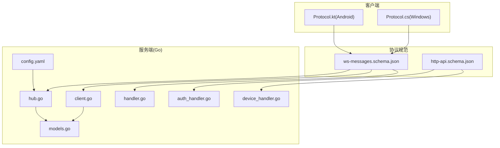
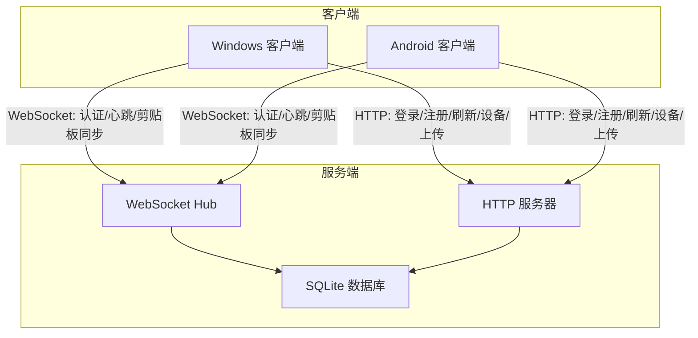
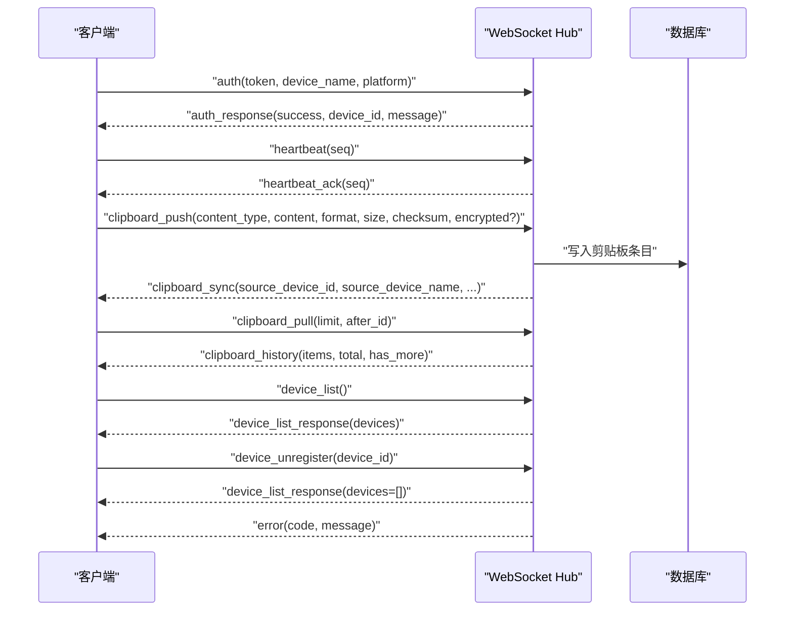
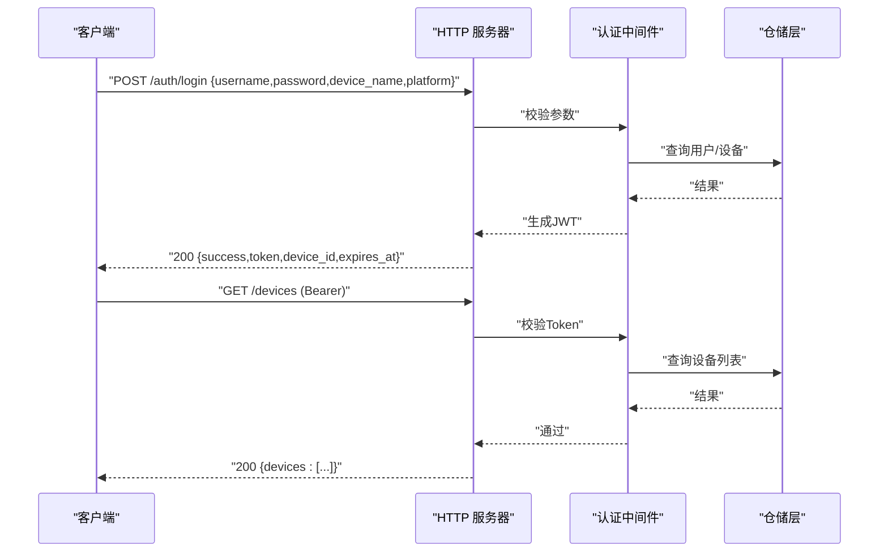
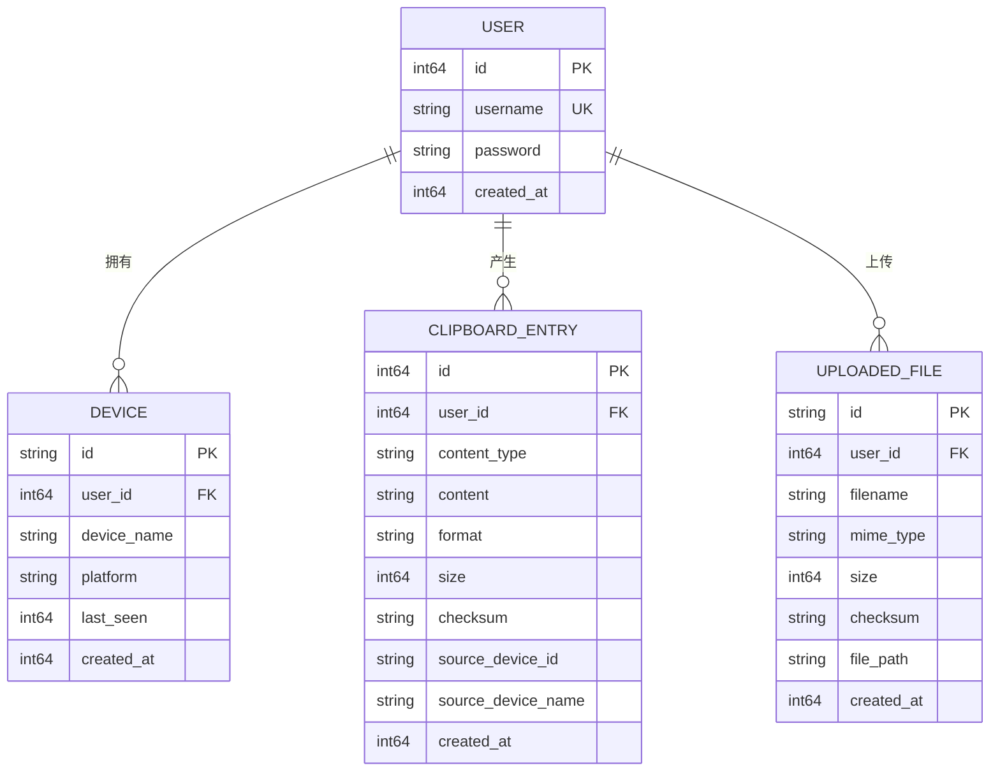
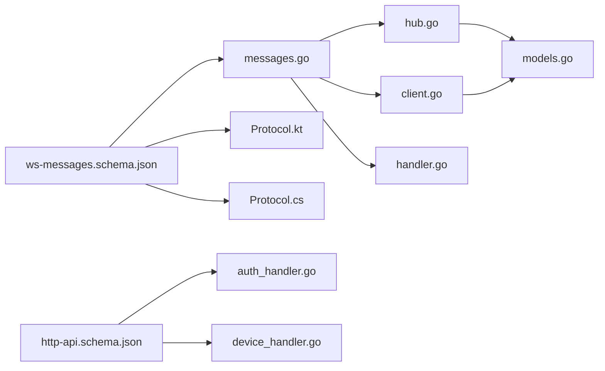

# 协议规范

<cite>
**本文引用的文件**
- [ws-messages.schema.json](file://protocol/ws-messages.schema.json)
- [http-api.schema.json](file://protocol/http-api.schema.json)
- [messages.go](file://clipSync-server/pkg/protocol/messages.go)
- [protocol.go](file://clipSync-server/internal/websocket/protocol.go)
- [hub.go](file://clipSync-server/internal/websocket/hub.go)
- [client.go](file://clipSync-server/internal/websocket/client.go)
- [handler.go](file://clipSync-server/internal/websocket/handler.go)
- [auth_handler.go](file://clipSync-server/internal/httpserver/auth_handler.go)
- [device_handler.go](file://clipSync-server/internal/httpserver/device_handler.go)
- [models.go](file://clipSync-server/internal/database/models.go)
- [Protocol.kt](file://clipSync-android/app/src/main/java/com/clipsync/app/network/Protocol.kt)
- [Protocol.cs](file://clipSync-windows/ClipSync.WPF/Network/Protocol.cs)
- [DEVELOPMENT_PLAN.md](file://DEVELOPMENT_PLAN.md)
- [config.yaml](file://clipSync-server/configs/config.yaml)
- [test-protocol-compatibility.ps1](file://scripts/test-protocol-compatibility.ps1)
- [middleware.go](file://clipSync-server/internal/auth/middleware.go)
- [server.go](file://clipSync-server/internal/httpserver/server.go)
</cite>

## 目录
1. [简介](#简介)
2. [项目结构](#项目结构)
3. [核心组件](#核心组件)
4. [架构总览](#架构总览)
5. [详细组件分析](#详细组件分析)
6. [依赖分析](#依赖分析)
7. [性能考量](#性能考量)
8. [故障排查指南](#故障排查指南)
9. [结论](#结论)
10. [附录](#附录)

## 简介
本文件为 ClipSync 协议规范的权威文档，覆盖 WebSocket 消息协议与 HTTP API 规范、数据模型与实体关系、版本控制与向后兼容策略、错误处理与安全考虑、速率限制与版本信息、常见用例与客户端实现指南、性能优化技巧、调试与监控方法，以及弃用功能的迁移与兼容性说明。内容以仓库中 JSON Schema、Go 服务端实现、Android/Kotlin 客户端实现为依据，确保规范的准确性与可执行性。

## 项目结构
- 协议规范来源：protocol 目录下的 JSON Schema 文件，定义了 WebSocket 消息与 HTTP API 的契约。
- 服务端实现：Go 语言实现，包含 WebSocket Hub、消息路由、HTTP 路由与中间件、数据库模型等。
- 客户端实现：Android（Kotlin）与 Windows WPF（C#），均遵循同一协议规范进行序列化/反序列化与消息交互。
- 配置与测试：服务端配置文件定义运行参数；PowerShell 测试脚本用于协议一致性验证。

**图表来源**
- [ws-messages.schema.json:1-261](file://protocol/ws-messages.schema.json#L1-L261)
- [http-api.schema.json:1-293](file://protocol/http-api.schema.json#L1-L293)
- [hub.go:1-230](file://clipSync-server/internal/websocket/hub.go#L1-L230)
- [client.go:1-150](file://clipSync-server/internal/websocket/client.go#L1-L150)
- [handler.go:1-392](file://clipSync-server/internal/websocket/handler.go#L1-L392)
- [auth_handler.go:1-161](file://clipSync-server/internal/httpserver/auth_handler.go#L1-L161)
- [device_handler.go:1-137](file://clipSync-server/internal/httpserver/device_handler.go#L1-L137)
- [models.go:1-46](file://clipSync-server/internal/database/models.go#L1-L46)
- [config.yaml:1-29](file://clipSync-server/configs/config.yaml#L1-L29)
- [Protocol.kt:1-263](file://clipSync-android/app/src/main/java/com/clipsync/app/network/Protocol.kt#L1-L263)
- [Protocol.cs:1-165](file://clipSync-windows/ClipSync.WPF/Network/Protocol.cs#L1-L165)

**章节来源**
- [DEVELOPMENT_PLAN.md:1-929](file://DEVELOPMENT_PLAN.md#L1-L929)
- [config.yaml:1-29](file://clipSync-server/configs/config.yaml#L1-L29)

## 核心组件
- WebSocket 消息协议：统一的信封格式（type、version、timestamp、device_id、payload），支持认证、心跳、剪贴板推送/同步/拉取、设备列表、错误通知等消息类型。
- HTTP API：登录/注册/刷新令牌、健康检查、设备管理、文件上传下载等端点，配合 Bearer Token 认证。
- 数据模型：用户、设备、剪贴板条目、上传文件等，支撑服务端存储与业务逻辑。
- 客户端实现：Android 与 Windows 客户端分别提供消息序列化/反序列化与消息构建器，保证跨平台一致性。

**章节来源**
- [ws-messages.schema.json:1-261](file://protocol/ws-messages.schema.json#L1-L261)
- [http-api.schema.json:1-293](file://protocol/http-api.schema.json#L1-L293)
- [messages.go:1-132](file://clipSync-server/pkg/protocol/messages.go#L1-L132)
- [models.go:1-46](file://clipSync-server/internal/database/models.go#L1-L46)
- [Protocol.kt:1-263](file://clipSync-android/app/src/main/java/com/clipsync/app/network/Protocol.kt#L1-L263)
- [Protocol.cs:1-165](file://clipSync-windows/ClipSync.WPF/Network/Protocol.cs#L1-L165)

## 架构总览
ClipSync 采用“HTTP 认证 + WebSocket 实时同步”的双通道架构：
- HTTP 通道负责身份认证、设备管理与大文件传输；
- WebSocket 通道负责低延迟的剪贴板内容实时广播与心跳保活。

**图表来源**
- [auth_handler.go:1-161](file://clipSync-server/internal/httpserver/auth_handler.go#L1-L161)
- [device_handler.go:1-137](file://clipSync-server/internal/httpserver/device_handler.go#L1-L137)
- [hub.go:1-230](file://clipSync-server/internal/websocket/hub.go#L1-L230)
- [models.go:1-46](file://clipSync-server/internal/database/models.go#L1-L46)

## 详细组件分析

### WebSocket 消息协议
- 统一信封字段
  - type：消息类型枚举，如 auth、heartbeat、clipboard_push、clipboard_sync、clipboard_pull、clipboard_history、device_list、device_list_response、device_unregister、error、ping、pong。
  - version：协议版本号（v1 固定值）。
  - timestamp：Unix 毫秒时间戳。
  - device_id：可选的设备标识符。
  - payload：按 type 定义的结构化载荷。
- 类型与载荷
  - 认证类：auth（携带 token、device_name、platform）、auth_response（success、device_id、message）。
  - 心跳类：heartbeat（seq）、heartbeat_ack（seq）。
  - 剪贴板类：clipboard_push（content_type、content、format、size、checksum、可选 encrypted）、clipboard_sync（含 source_device_id/name）、clipboard_pull（limit、after_id）、clipboard_history（items、total、has_more）。
  - 设备类：device_list、device_list_response（devices 数组，含 device_id、device_name、platform、last_seen、is_online、created_at）、device_unregister（device_id）。
  - 错误类：error（code、message），code 枚举包括 AUTH_FAILED、TOKEN_EXPIRED、RATE_LIMITED、INVALID_PAYLOAD、CONTENT_TOO_LARGE、DEVICE_NOT_FOUND、INTERNAL_ERROR、DUPLICATE_CONTENT。
- 服务端行为
  - 连接升级、鉴权超时（30 秒）、心跳超时（默认 90 秒）、广播到同用户其他设备、重复内容去重（基于 checksum）。
- 客户端行为
  - 30 秒心跳、Ping/Pong 保活、发送缓冲区满时丢弃或断开策略、错误码回传。

**图表来源**
- [handler.go:1-392](file://clipSync-server/internal/websocket/handler.go#L1-L392)
- [hub.go:1-230](file://clipSync-server/internal/websocket/hub.go#L1-L230)
- [client.go:1-150](file://clipSync-server/internal/websocket/client.go#L1-L150)
- [ws-messages.schema.json:1-261](file://protocol/ws-messages.schema.json#L1-L261)

**章节来源**
- [ws-messages.schema.json:1-261](file://protocol/ws-messages.schema.json#L1-L261)
- [messages.go:1-132](file://clipSync-server/pkg/protocol/messages.go#L1-L132)
- [hub.go:1-230](file://clipSync-server/internal/websocket/hub.go#L1-L230)
- [client.go:1-150](file://clipSync-server/internal/websocket/client.go#L1-L150)
- [handler.go:1-392](file://clipSync-server/internal/websocket/handler.go#L1-L392)

### HTTP API 规范
- 基础信息
  - 基础 URL：http://localhost:8081/api/v1
  - 认证方式：Bearer Token（Authorization 头）
- 端点与契约
  - POST /auth/login：用户名、密码、设备名、平台；返回 success、token、device_id、expires_at；401 INVALID_CREDENTIALS。
  - POST /auth/register：同上；201 成功；409 USERNAME_EXISTS。
  - POST /auth/refresh：刷新令牌；401 AUTH_FAILED/TOKEN_EXPIRED。
  - GET /health：健康检查；返回 status、version、uptime、connected_clients。
  - GET /devices：列出设备；返回 devices 数组（device_id、device_name、platform、last_seen、is_online、created_at）。
  - DELETE /devices/{device_id}：注销设备；404 DEVICE_NOT_FOUND。
  - POST /upload：multipart/form-data，file 与 checksum；200 返回 file_id 与 download_url；413 CONTENT_TOO_LARGE。
  - GET /download/{file_id}：返回原始二进制内容；404 FILE_NOT_FOUND。
- 错误码映射
  - AUTH_FAILED、TOKEN_EXPIRED、RATE_LIMITED、INVALID_PAYLOAD、CONTENT_TOO_LARGE、DEVICE_NOT_FOUND、INTERNAL_ERROR、DUPLICATE_CONTENT、USERNAME_EXISTS、INVALID_CREDENTIALS。

**图表来源**
- [auth_handler.go:1-161](file://clipSync-server/internal/httpserver/auth_handler.go#L1-L161)
- [device_handler.go:1-137](file://clipSync-server/internal/httpserver/device_handler.go#L1-L137)
- [middleware.go:1-111](file://clipSync-server/internal/auth/middleware.go#L1-L111)
- [http-api.schema.json:1-293](file://protocol/http-api.schema.json#L1-L293)

**章节来源**
- [http-api.schema.json:1-293](file://protocol/http-api.schema.json#L1-L293)
- [auth_handler.go:1-161](file://clipSync-server/internal/httpserver/auth_handler.go#L1-L161)
- [device_handler.go:1-137](file://clipSync-server/internal/httpserver/device_handler.go#L1-L137)
- [middleware.go:1-111](file://clipSync-server/internal/auth/middleware.go#L1-L111)

### 数据模型与实体关系
- 用户（User）：ID、用户名、密码（bcrypt）、创建时间（Unix ms）。
- 设备（Device）：ID、用户ID、设备名、平台、最后在线时间、创建时间。
- 剪贴板条目（ClipboardEntry）：ID、用户ID、内容类型、内容、格式、大小、校验和、来源设备ID/名称、创建时间。
- 已上传文件（UploadedFile）：ID、用户ID、文件名、MIME 类型、大小、校验和、路径、创建时间。

**图表来源**
- [models.go:1-46](file://clipSync-server/internal/database/models.go#L1-L46)

**章节来源**
- [models.go:1-46](file://clipSync-server/internal/database/models.go#L1-L46)

### 版本控制与向后兼容
- 协议版本：WebSocket 信封中的 version 字段固定为 1；HTTP API 元数据包含 version 字段。
- 向后兼容策略：
  - 新增消息类型或字段时，保持旧字段可选且不影响解析；服务端对未知类型返回错误，客户端应优雅降级。
  - HTTP 错误码与语义保持稳定，新增错误码需在 schema 中同步更新。
  - 配置项变更（如最大历史数、心跳超时）通过配置文件集中管理，避免硬编码破坏兼容性。

**章节来源**
- [ws-messages.schema.json:28-32](file://protocol/ws-messages.schema.json#L28-L32)
- [http-api.schema.json:5-6](file://protocol/http-api.schema.json#L5-L6)
- [config.yaml:24-28](file://clipSync-server/configs/config.yaml#L24-L28)

### 错误处理策略
- WebSocket 错误：服务端统一构造 error 消息，包含 code 与 message；客户端收到后根据 code 做相应处理（重试、重新登录、提示用户）。
- HTTP 错误：按状态码返回 success=false 与 error 字段，错误码与 HTTP 状态映射见 schema。
- 常见错误场景：认证失败、令牌过期、无效载荷、内容过大、设备不存在、内部错误、重复内容、用户名已存在、无效凭据。

**章节来源**
- [handler.go:28-30](file://clipSync-server/internal/websocket/handler.go#L28-L30)
- [client.go:119-135](file://clipSync-server/internal/websocket/client.go#L119-L135)
- [http-api.schema.json:280-291](file://protocol/http-api.schema.json#L280-L291)

### 安全考虑
- 认证与授权：HTTP 使用 Bearer Token；WebSocket 在连接建立后要求在 30 秒内完成认证。
- 令牌管理：JWT 密钥与过期时间在配置文件中设置，生产环境必须修改默认密钥与合理设置过期时间。
- 内容加密：clipboard_push 支持 encrypted 标志，客户端可选择启用端到端加密（AES-256）。
- CORS 与升级：WebSocket 升级器允许所有来源（生产环境建议限制）。

**章节来源**
- [middleware.go:32-61](file://clipSync-server/internal/auth/middleware.go#L32-L61)
- [hub.go:197-204](file://clipSync-server/internal/websocket/hub.go#L197-L204)
- [config.yaml:12-16](file://clipSync-server/configs/config.yaml#L12-L16)
- [Protocol.cs:99-139](file://clipSync-windows/ClipSync.WPF/Network/Protocol.cs#L99-L139)

### 速率限制与配额
- HTTP 层未显式实现速率限制；可在网关或中间件层扩展。
- WebSocket 层通过心跳超时（默认 90 秒）与连接数统计进行资源保护；客户端应避免高频抖动消息。

**章节来源**
- [config.yaml:28-29](file://clipSync-server/configs/config.yaml#L28-L29)
- [hub.go:60-112](file://clipSync-server/internal/websocket/hub.go#L60-L112)

### 版本信息
- 协议版本：v1
- HTTP API 版本：1.0.0
- 服务端端口：WebSocket 8080，HTTP 8081

**章节来源**
- [ws-messages.schema.json:28-32](file://protocol/ws-messages.schema.json#L28-L32)
- [http-api.schema.json:5-6](file://protocol/http-api.schema.json#L5-L6)
- [config.yaml:3-7](file://clipSync-server/configs/config.yaml#L3-L7)

### 常见用例与客户端实现指南
- 用例
  - 跨设备剪贴板同步：文本/图片/文件内容通过 clipboard_push 广播，其他设备接收 clipboard_sync。
  - 历史查看：clipboard_pull 获取分页历史，clipboard_history 返回 items、total、has_more。
  - 设备管理：device_list 获取设备列表，device_unregister 注销设备并断开连接。
  - 大文件处理：使用 /upload 上传，/download 下载，避免 WebSocket 负载过大。
- 客户端实现要点
  - 序列化/反序列化：Android 使用 Kotlin Serialization，Windows 使用 Newtonsoft.Json；严格遵循 snake_case 字段命名。
  - 心跳与保活：每 30 秒发送 heartbeat 或 server 主动 ping，客户端及时 pong。
  - 错误处理：收到 error 消息或 HTTP 错误时，按 code 分流处理（重试、重新登录、提示）。
  - 加密：当启用加密时，在 clipboard_push 中设置 encrypted 并正确传递密钥派生参数。

**章节来源**
- [Protocol.kt:1-263](file://clipSync-android/app/src/main/java/com/clipsync/app/network/Protocol.kt#L1-L263)
- [Protocol.cs:1-165](file://clipSync-windows/ClipSync.WPF/Network/Protocol.cs#L1-L165)
- [DEVELOPMENT_PLAN.md:18-363](file://DEVELOPMENT_PLAN.md#L18-L363)

### 性能优化技巧
- 消息聚合：writePump 中对 Send 缓冲区内的多条消息进行聚合写入，减少系统调用次数。
- 发送缓冲区满处理：当缓冲区满时记录日志并丢弃后续消息，避免阻塞主循环。
- 心跳与保活：合理的心跳间隔与超时设置，避免频繁断线与资源浪费。
- 历史限制：服务端限制每个用户的剪贴板历史数量，降低查询与广播压力。
- 文件上传：大内容走 HTTP 上传下载，WebSocket 仅传输元数据与摘要。

**章节来源**
- [client.go:69-117](file://clipSync-server/internal/websocket/client.go#L69-L117)
- [config.yaml:24-25](file://clipSync-server/configs/config.yaml#L24-L25)

### 调试工具与监控方法
- 协议一致性测试：PowerShell 脚本扫描 Go/Windows/Android 源码，验证消息类型、字段命名、HTTP 端点、版本、心跳、加密、错误码等是否一致，并测试健康检查与登录端点连通性。
- Mock 服务器：Go 提供的 mock_server 可模拟登录、回显剪贴板消息、心跳响应、设备列表响应，便于客户端离线开发与回归测试。
- 日志与指标：服务端记录连接/断开、认证超时、错误码、客户端数量等；HTTP 服务器设置 Read/Write/Idle 超时，提升稳定性。

**章节来源**
- [test-protocol-compatibility.ps1:1-207](file://scripts/test-protocol-compatibility.ps1#L1-L207)
- [DEVELOPMENT_PLAN.md:583-612](file://DEVELOPMENT_PLAN.md#L583-L612)
- [server.go:25-40](file://clipSync-server/internal/httpserver/server.go#L25-L40)

### 弃用功能与迁移指南
- 当前仓库未发现明确标记的弃用功能；若未来引入新版本协议，建议：
  - 保留旧版本解析器一段时间，逐步引导客户端升级；
  - 在 HTTP 与 WebSocket 两端同时发布兼容层，提供迁移指引；
  - 通过配置开关或协商机制平滑过渡，避免中断用户会话。

[本节为概念性指导，不直接分析具体文件]

## 依赖分析
- 服务端
  - WebSocket Hub 依赖认证服务、数据库仓储（剪贴板/设备/用户）、gorilla/websocket 升级器。
  - HTTP 服务器依赖认证中间件、各业务处理器（认证/设备/上传/健康）。
- 客户端
  - Android 与 Windows 客户端均依赖协议定义（消息类型、字段命名、序列化库）。
- 协议规范
  - JSON Schema 作为单一事实来源，约束消息类型、字段与取值范围。

**图表来源**
- [ws-messages.schema.json:1-261](file://protocol/ws-messages.schema.json#L1-L261)
- [http-api.schema.json:1-293](file://protocol/http-api.schema.json#L1-L293)
- [messages.go:1-132](file://clipSync-server/pkg/protocol/messages.go#L1-L132)
- [hub.go:1-230](file://clipSync-server/internal/websocket/hub.go#L1-L230)
- [client.go:1-150](file://clipSync-server/internal/websocket/client.go#L1-L150)
- [handler.go:1-392](file://clipSync-server/internal/websocket/handler.go#L1-L392)
- [auth_handler.go:1-161](file://clipSync-server/internal/httpserver/auth_handler.go#L1-L161)
- [device_handler.go:1-137](file://clipSync-server/internal/httpserver/device_handler.go#L1-L137)
- [models.go:1-46](file://clipSync-server/internal/database/models.go#L1-L46)
- [Protocol.kt:1-263](file://clipSync-android/app/src/main/java/com/clipsync/app/network/Protocol.kt#L1-L263)
- [Protocol.cs:1-165](file://clipSync-windows/ClipSync.WPF/Network/Protocol.cs#L1-L165)

**章节来源**
- [ws-messages.schema.json:1-261](file://protocol/ws-messages.schema.json#L1-L261)
- [http-api.schema.json:1-293](file://protocol/http-api.schema.json#L1-L293)
- [messages.go:1-132](file://clipSync-server/pkg/protocol/messages.go#L1-L132)
- [hub.go:1-230](file://clipSync-server/internal/websocket/hub.go#L1-L230)
- [client.go:1-150](file://clipSync-server/internal/websocket/client.go#L1-L150)
- [handler.go:1-392](file://clipSync-server/internal/websocket/handler.go#L1-L392)
- [auth_handler.go:1-161](file://clipSync-server/internal/httpserver/auth_handler.go#L1-L161)
- [device_handler.go:1-137](file://clipSync-server/internal/httpserver/device_handler.go#L1-L137)
- [models.go:1-46](file://clipSync-server/internal/database/models.go#L1-L46)
- [Protocol.kt:1-263](file://clipSync-android/app/src/main/java/com/clipsync/app/network/Protocol.kt#L1-L263)
- [Protocol.cs:1-165](file://clipSync-windows/ClipSync.WPF/Network/Protocol.cs#L1-L165)

## 性能考量
- 传输层
  - WebSocket：合理的心跳间隔与超时，避免频繁断线；聚合写入减少系统调用。
  - HTTP：设置合理的 Read/Write/Idle 超时，防止慢连接占用资源。
- 存储层
  - 历史条目上限控制，避免无限增长；定期清理过期或重复内容。
- 客户端
  - 避免高频抖动消息；对大文件优先使用 HTTP 上传下载。

[本节提供通用指导，不直接分析具体文件]

## 故障排查指南
- WebSocket 连接问题
  - 检查认证是否在 30 秒内完成；确认服务端日志中的认证超时与断开记录。
  - 核对心跳是否正常（30 秒间隔），Pong 是否及时响应。
- HTTP 认证问题
  - 确认 Authorization 头格式为 Bearer <token>；检查令牌是否过期。
- 协议一致性
  - 使用 PowerShell 测试脚本验证消息类型、字段命名、错误码是否一致。
- Mock 服务器
  - 启动 mock_server 验证健康检查与登录端点可用性，再进行端到端联调。

**章节来源**
- [hub.go:197-204](file://clipSync-server/internal/websocket/hub.go#L197-L204)
- [client.go:70-117](file://clipSync-server/internal/websocket/client.go#L70-L117)
- [middleware.go:32-61](file://clipSync-server/internal/auth/middleware.go#L32-L61)
- [test-protocol-compatibility.ps1:166-191](file://scripts/test-protocol-compatibility.ps1#L166-L191)

## 结论
本协议规范以 JSON Schema 为契约，结合 Go 服务端实现与 Android/Windows 客户端实现，提供了完整的 WebSocket 消息协议与 HTTP API 规范。通过严格的字段命名、版本控制、错误码映射与安全策略，确保跨平台一致性与可维护性。建议在生产环境中强化速率限制、TLS 传输、令牌安全与监控告警，并持续使用协议一致性测试保障演进过程中的稳定性。

## 附录
- 配置项参考
  - WebSocket 端口：8080
  - HTTP 端口：8081
  - JWT 密钥：需在生产环境修改
  - 最大文件大小：5MB
  - 剪贴板历史上限：50 条
  - 心跳超时：90 秒

**章节来源**
- [config.yaml:1-29](file://clipSync-server/configs/config.yaml#L1-L29)