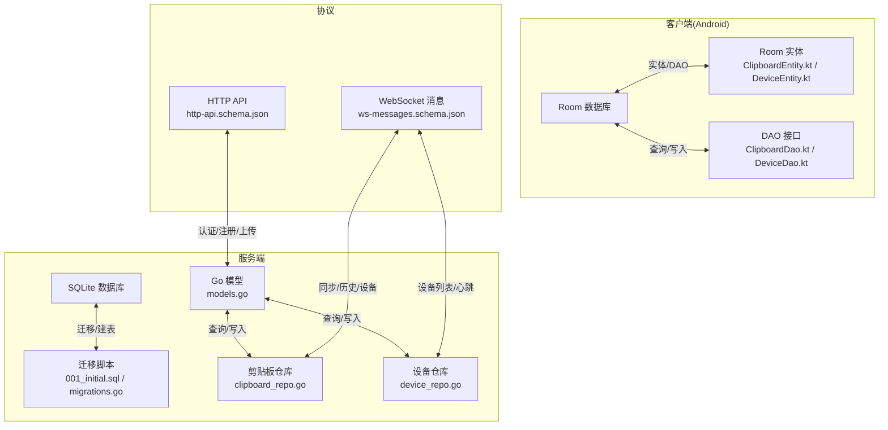
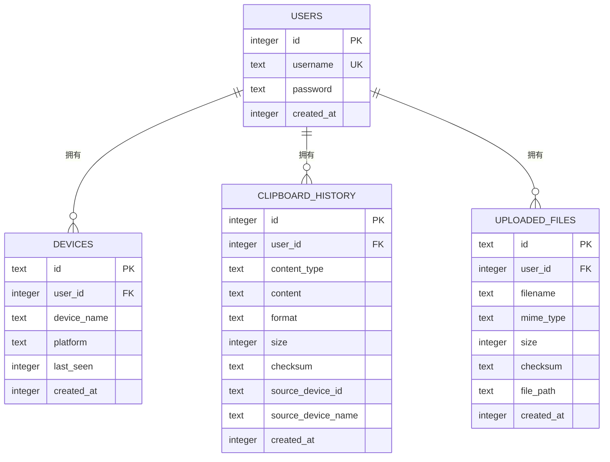
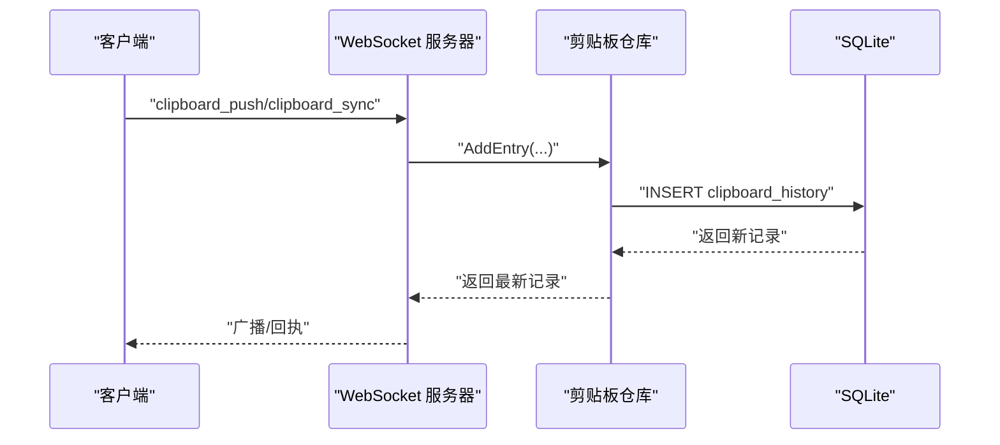
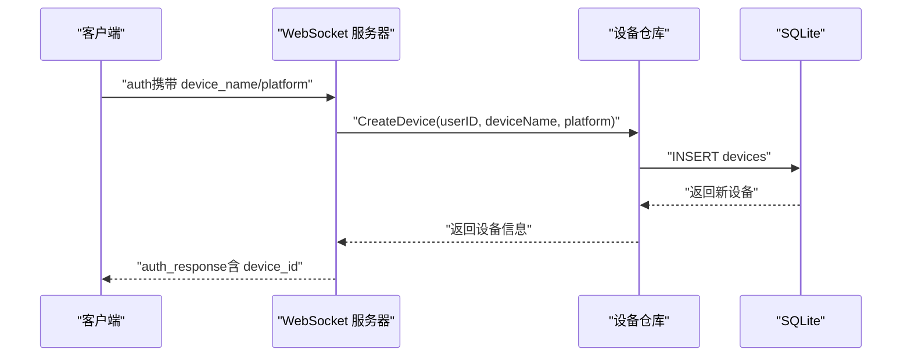
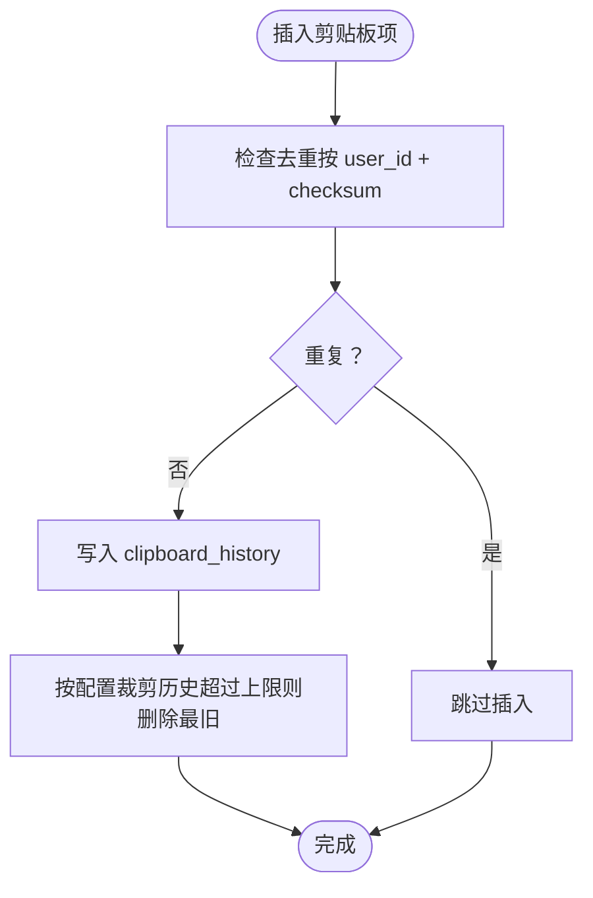

# 数据模型定义

<cite>
**本文引用的文件**
- [ClipboardEntity.kt](file://clipSync-android/app/src/main/java/com/clipsync/app/data/entities/ClipboardEntity.kt)
- [DeviceEntity.kt](file://clipSync-android/app/src/main/java/com/clipsync/app/data/entities/DeviceEntity.kt)
- [AppDatabase.kt](file://clipSync-android/app/src/main/java/com/clipsync/app/data/AppDatabase.kt)
- [ClipboardDao.kt](file://clipSync-android/app/src/main/java/com/clipsync/app/data/ClipboardDao.kt)
- [DeviceDao.kt](file://clipSync-android/app/src/main/java/com/clipsync/app/data/DeviceDao.kt)
- [models.go](file://clipSync-server/internal/database/models.go)
- [migrations.go](file://clipSync-server/internal/database/migrations.go)
- [001_initial.sql](file://clipSync-server/migrations/001_initial.sql)
- [clipboard_repo.go](file://clipSync-server/internal/database/clipboard_repo.go)
- [device_repo.go](file://clipSync-server/internal/database/device_repo.go)
- [ws-messages.schema.json](file://protocol/ws-messages.schema.json)
- [http-api.schema.json](file://protocol/http-api.schema.json)
- [config.yaml](file://clipSync-server/configs/config.yaml)
</cite>

## 目录
1. [简介](#简介)
2. [项目结构](#项目结构)
3. [核心组件](#核心组件)
4. [架构总览](#架构总览)
5. [详细组件分析](#详细组件分析)
6. [依赖分析](#依赖分析)
7. [性能考虑](#性能考虑)
8. [故障排查指南](#故障排查指南)
9. [结论](#结论)
10. [附录](#附录)

## 简介
本文件系统性梳理 ClipSync 的数据模型与跨平台一致性保障，覆盖以下核心实体：
- 剪贴板项（ClipboardEntry/ClipboardEntity）
- 设备（Device/DeviceEntity）
- 用户（User）

重点说明：
- 字段类型、约束、索引与关系映射
- 外键约束与级联行为
- 数据验证规则、默认值与业务规则
- 表结构定义、字段说明与示例数据
- 数据生命周期、存储策略与性能考量
- 跨平台数据模型一致性与迁移策略

## 项目结构
数据模型在服务端与客户端分别落地：
- 服务端：SQLite 模式定义与迁移脚本，Go 结构体作为 ORM 映射
- 客户端（Android）：Room 实体与 DAO，本地 SQLite 存储
- 协议：WebSocket/HTTP 消息契约，确保跨平台数据格式一致

图表来源
- [001_initial.sql:1-55](file://clipSync-server/migrations/001_initial.sql#L1-L55)
- [migrations.go:20-80](file://clipSync-server/internal/database/migrations.go#L20-L80)
- [models.go:3-46](file://clipSync-server/internal/database/models.go#L3-L46)
- [clipboard_repo.go:20-140](file://clipSync-server/internal/database/clipboard_repo.go#L20-L140)
- [device_repo.go:21-126](file://clipSync-server/internal/database/device_repo.go#L21-L126)
- [ClipboardEntity.kt:9-19](file://clipSync-android/app/src/main/java/com/clipsync/app/data/entities/ClipboardEntity.kt#L9-L19)
- [DeviceEntity.kt:9-17](file://clipSync-android/app/src/main/java/com/clipsync/app/data/entities/DeviceEntity.kt#L9-L17)
- [ClipboardDao.kt:14-49](file://clipSync-android/app/src/main/java/com/clipsync/app/data/ClipboardDao.kt#L14-L49)
- [DeviceDao.kt:14-43](file://clipSync-android/app/src/main/java/com/clipsync/app/data/DeviceDao.kt#L14-L43)
- [ws-messages.schema.json:135-258](file://protocol/ws-messages.schema.json#L135-L258)
- [http-api.schema.json:8-278](file://protocol/http-api.schema.json#L8-L278)

章节来源
- [AppDatabase.kt:14-23](file://clipSync-android/app/src/main/java/com/clipsync/app/data/AppDatabase.kt#L14-L23)
- [models.go:3-46](file://clipSync-server/internal/database/models.go#L3-L46)
- [001_initial.sql:1-55](file://clipSync-server/migrations/001_initial.sql#L1-L55)

## 核心组件
本节对三大核心实体进行字段级说明，并给出约束、索引与关系映射。

- 用户（User）
  - 字段
    - id: 整数主键（自增）
    - username: 文本，唯一，非空
    - password: 文本，bcrypt 哈希存储
    - created_at: 整数（毫秒时间戳）
  - 约束
    - 主键：id
    - 唯一：username
    - 默认值：created_at 使用当前时间（毫秒）
  - 关系
    - 一对多：一个用户拥有多个设备与剪贴板条目

- 设备（Device）
  - 字段
    - id: 文本主键（设备唯一标识）
    - user_id: 整数，外键指向 users.id
    - device_name: 文本，非空
    - platform: 文本，非空
    - last_seen: 整数（毫秒时间戳），默认当前时间
    - created_at: 整数（毫秒时间戳），默认当前时间
  - 约束
    - 主键：id
    - 外键：user_id 引用 users(id)，级联删除
    - 索引：idx_devices_user_id
  - 关系
    - 多对一：多个设备属于一个用户

- 剪贴板项（ClipboardEntry）
  - 字段
    - id: 整数主键（自增）
    - user_id: 整数，外键指向 users.id
    - content_type: 文本，非空
    - content: 文本，非空
    - format: 文本，默认 text/plain
    - size: 整数，默认 0
    - checksum: 文本，非空（用于去重）
    - source_device_id: 文本，非空
    - source_device_name: 文本，非空
    - created_at: 整数（毫秒时间戳），默认当前时间
  - 约束
    - 主键：id
    - 外键：user_id 引用 users(id)，级联删除
    - 索引：idx_clipboard_user_id、idx_clipboard_checksum、idx_clipboard_created
  - 关系
    - 多对一：多个剪贴板项属于一个用户

- 已上传文件（UploadedFile）
  - 字段
    - id: 文本主键（文件唯一标识）
    - user_id: 整数，外键指向 users.id
    - filename: 文本，非空
    - mime_type: 文本，非空
    - size: 整数，非空
    - checksum: 文本，非空
    - file_path: 文本，非空
    - created_at: 整数（毫秒时间戳），默认当前时间
  - 约束
    - 主键：id
    - 外键：user_id 引用 users(id)，级联删除
    - 索引：idx_files_user_id
  - 关系
    - 多对一：多个文件属于一个用户

章节来源
- [models.go:3-46](file://clipSync-server/internal/database/models.go#L3-L46)
- [001_initial.sql:4-54](file://clipSync-server/migrations/001_initial.sql#L4-L54)
- [migrations.go:20-80](file://clipSync-server/internal/database/migrations.go#L20-L80)

## 架构总览
下图展示服务端与客户端在数据模型层面的对应关系与交互路径。

图表来源
- [models.go:3-46](file://clipSync-server/internal/database/models.go#L3-L46)
- [001_initial.sql:4-54](file://clipSync-server/migrations/001_initial.sql#L4-L54)

## 详细组件分析

### 剪贴板项（ClipboardEntry/ClipboardEntity）
- 服务端模型与字段
  - 类型：整数主键、整数 user_id、文本 content_type/content/format/checksum/source_device_id/source_device_name、整数 created_at
  - 约束：NOT NULL、默认值、外键、索引
  - 业务规则：通过 checksum 去重；历史上限由服务端控制（配置项）
- 客户端实体
  - 字段：整数 id、字符串 content、字符串 contentType（默认 text）、字符串 checksum（默认空）、字符串 sourceDeviceId/sourceDeviceName（默认空）、长整型 createdAt（默认当前毫秒）
  - 约束：Room 主键自增；默认值
- 关系映射
  - 服务端：clipboard_history.user_id -> users.id（级联删除）
  - 客户端：无外键（本地 Room），但通过业务逻辑保证 user_id 一致性
- 验证与默认值
  - 服务端：format 默认 text/plain；size 默认 0；created_at 默认当前时间
  - 客户端：contentType 默认 text；checksum/sourceDevice* 默认空；createdAt 默认当前毫秒
- 性能与索引
  - 服务端：按 user_id、checksum、created_at 建立复合/单列索引，支持去重与分页查询
- 生命周期
  - 服务端：历史上限由配置控制，插入时强制裁剪超出部分
  - 客户端：支持按最近 N 条裁剪（DAO 提供清理方法）

图表来源
- [clipboard_repo.go:20-64](file://clipSync-server/internal/database/clipboard_repo.go#L20-L64)
- [ws-messages.schema.json:135-167](file://protocol/ws-messages.schema.json#L135-L167)

章节来源
- [models.go:21-33](file://clipSync-server/internal/database/models.go#L21-L33)
- [001_initial.sql:24-36](file://clipSync-server/migrations/001_initial.sql#L24-L36)
- [migrations.go:47-63](file://clipSync-server/internal/database/migrations.go#L47-L63)
- [ClipboardEntity.kt:9-19](file://clipSync-android/app/src/main/java/com/clipsync/app/data/entities/ClipboardEntity.kt#L9-L19)
- [ClipboardDao.kt:14-49](file://clipSync-android/app/src/main/java/com/clipsync/app/data/ClipboardDao.kt#L14-L49)
- [config.yaml:24-25](file://clipSync-server/configs/config.yaml#L24-L25)

### 设备（Device/DeviceEntity）
- 服务端模型与字段
  - 类型：文本主键 id、整数 user_id、文本 device_name/platform、整数 last_seen/created_at
  - 约束：NOT NULL、外键、索引
  - 业务规则：last_seen 更新以反映在线状态
- 客户端实体
  - 字段：字符串 deviceId（主键）、字符串 deviceName、字符串 platform（默认 android）、长整型 lastSeen（默认当前毫秒）、布尔 isOnline（默认 false）
  - 约束：Room 主键；默认值
- 关系映射
  - 服务端：devices.user_id -> users.id（级联删除）
  - 客户端：本地 Room，无外键约束
- 验证与默认值
  - 服务端：last_seen/created_at 默认当前时间
  - 客户端：platform 默认 android；lastSeen 默认当前毫秒；isOnline 默认 false
- 性能与索引
  - 服务端：按 user_id 建立索引，支持快速查询某用户的设备列表
- 生命周期
  - 服务端：设备注册后定期更新 last_seen；删除时校验归属
  - 客户端：维护在线状态与最后活跃时间

图表来源
- [device_repo.go:21-42](file://clipSync-server/internal/database/device_repo.go#L21-L42)
- [ws-messages.schema.json:89-114](file://protocol/ws-messages.schema.json#L89-L114)

章节来源
- [models.go:11-19](file://clipSync-server/internal/database/models.go#L11-L19)
- [001_initial.sql:12-22](file://clipSync-server/migrations/001_initial.sql#L12-L22)
- [migrations.go:35-46](file://clipSync-server/internal/database/migrations.go#L35-L46)
- [DeviceEntity.kt:9-17](file://clipSync-android/app/src/main/java/com/clipsync/app/data/entities/DeviceEntity.kt#L9-L17)
- [DeviceDao.kt:14-43](file://clipSync-android/app/src/main/java/com/clipsync/app/data/DeviceDao.kt#L14-L43)

### 用户（User）
- 服务端模型与字段
  - 类型：整数主键 id、文本 username（唯一）、文本 password（哈希）、整数 created_at
  - 约束：主键、唯一、默认值
- 客户端映射
  - 未直接暴露为 Room 实体；通过登录/注册流程与服务端交互
- 关系映射
  - 一对多：用户 -> 设备、剪贴板项
- 验证与默认值
  - created_at 默认当前时间（毫秒）
- 生命周期
  - 注册即创建；删除用户会级联删除其设备与剪贴板历史

章节来源
- [models.go:3-9](file://clipSync-server/internal/database/models.go#L3-L9)
- [001_initial.sql:4-10](file://clipSync-server/migrations/001_initial.sql#L4-L10)
- [migrations.go:27-33](file://clipSync-server/internal/database/migrations.go#L27-L33)

## 依赖分析
- 外键与级联
  - devices.user_id -> users.id（ON DELETE CASCADE）
  - clipboard_history.user_id -> users.id（ON DELETE CASCADE）
  - uploaded_files.user_id -> users.id（ON DELETE CASCADE）
- 索引
  - devices: idx_devices_user_id
  - clipboard_history: idx_clipboard_user_id、idx_clipboard_checksum、idx_clipboard_created
  - uploaded_files: idx_files_user_id
- 业务依赖
  - 剪贴板历史上限由服务端配置控制，插入时执行裁剪
  - 客户端通过 DAO 提供的清理接口维持本地历史规模

图表来源
- [clipboard_repo.go:128-140](file://clipSync-server/internal/database/clipboard_repo.go#L128-L140)
- [config.yaml:24-25](file://clipSync-server/configs/config.yaml#L24-L25)

章节来源
- [migrations.go:35-80](file://clipSync-server/internal/database/migrations.go#L35-L80)
- [001_initial.sql:12-54](file://clipSync-server/migrations/001_initial.sql#L12-L54)

## 性能考虑
- 查询优化
  - 按用户维度查询剪贴板历史与设备列表，使用索引加速
  - 剪贴板历史按 created_at 降序分页，避免全表扫描
- 写入优化
  - 去重基于 checksum，减少重复存储
  - 服务端插入后立即裁剪，避免无限增长
- 存储策略
  - 服务端 SQLite 文件路径可配置，便于迁移与备份
  - 文件上传采用独立表与文件系统分离，降低数据库膨胀
- 并发与一致性
  - 迁移在事务中执行，保证模式演进原子性
  - 客户端本地 Room 与服务端通过协议保持数据一致性

## 故障排查指南
- 常见错误与定位
  - DUPLICATE_CONTENT：同一用户相同 checksum 已存在，检查去重逻辑与消息幂等性
  - DEVICE_NOT_FOUND：设备不存在或不属于当前用户，检查设备归属校验
  - CONTENT_TOO_LARGE：文件大小超限，检查配置与上传限制
  - AUTH_FAILED/TOKEN_EXPIRED：鉴权失败或令牌过期，检查登录流程与密钥配置
- 日志建议
  - 记录迁移版本应用情况、仓库操作结果与异常堆栈
  - 记录客户端去重命中率与历史裁剪次数

章节来源
- [http-api.schema.json:280-291](file://protocol/http-api.schema.json#L280-L291)
- [ws-messages.schema.json:235-258](file://protocol/ws-messages.schema.json#L235-L258)

## 结论
本数据模型以 SQLite 为核心，服务端与客户端分别以 Go 模型与 Room 实体落地，通过协议规范确保跨平台一致性。外键与索引设计兼顾查询效率与数据完整性，历史上限与去重机制有效控制存储成本。迁移脚本与事务化执行保障了模式演进的稳定性。

## 附录

### 数据模型字段对照表
- 用户（users）
  - id: 整数（主键）
  - username: 文本（唯一，非空）
  - password: 文本（哈希）
  - created_at: 整数（毫秒时间戳，默认当前时间）

- 设备（devices）
  - id: 文本（主键）
  - user_id: 整数（外键 users.id，级联删除）
  - device_name: 文本（非空）
  - platform: 文本（非空）
  - last_seen: 整数（毫秒时间戳，默认当前时间）
  - created_at: 整数（毫秒时间戳，默认当前时间）

- 剪贴板历史（clipboard_history）
  - id: 整数（主键）
  - user_id: 整数（外键 users.id，级联删除）
  - content_type: 文本（非空）
  - content: 文本（非空）
  - format: 文本（默认 text/plain）
  - size: 整数（默认 0）
  - checksum: 文本（非空）
  - source_device_id: 文本（非空）
  - source_device_name: 文本（非空）
  - created_at: 整数（毫秒时间戳，默认当前时间）

- 已上传文件（uploaded_files）
  - id: 文本（主键）
  - user_id: 整数（外键 users.id，级联删除）
  - filename: 文本（非空）
  - mime_type: 文本（非空）
  - size: 整数（非空）
  - checksum: 文本（非空）
  - file_path: 文本（非空）
  - created_at: 整数（毫秒时间戳，默认当前时间）

### 示例数据
- 用户
  - id=1, username="alice", password="...", created_at=1710000000000
- 设备
  - id="dev-a1b2c3", user_id=1, device_name="Pixel 8", platform="android", last_seen=1710000000000, created_at=1710000000000
- 剪贴板历史
  - id=101, user_id=1, content_type="text", content="Hello", format="text/plain", size=5, checksum="abc123", source_device_id="dev-a1b2c3", source_device_name="Pixel 8", created_at=1710000000000

### 跨平台一致性与迁移策略
- 一致性
  - 协议定义统一的消息结构与枚举值，确保各平台解析一致
  - 服务端模型与迁移脚本定义明确的表结构与约束
- 迁移
  - 迁移脚本以版本化管理，事务内执行，记录已应用版本
  - 新增索引与约束需谨慎评估对现有数据的影响

章节来源
- [ws-messages.schema.json:135-258](file://protocol/ws-messages.schema.json#L135-L258)
- [http-api.schema.json:8-278](file://protocol/http-api.schema.json#L8-L278)
- [migrations.go:8-114](file://clipSync-server/internal/database/migrations.go#L8-L114)
- [001_initial.sql:1-55](file://clipSync-server/migrations/001_initial.sql#L1-L55)