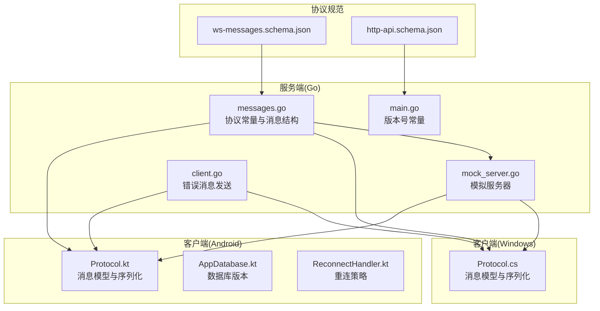
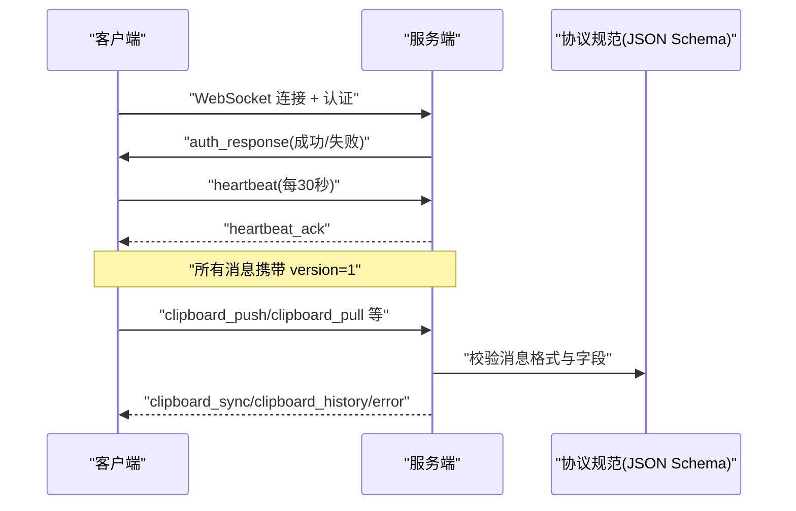
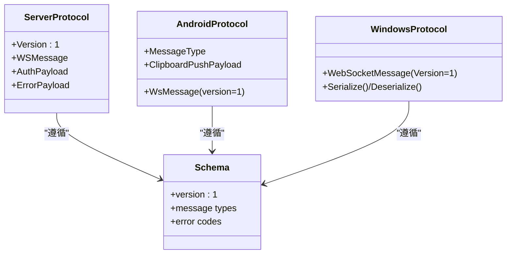
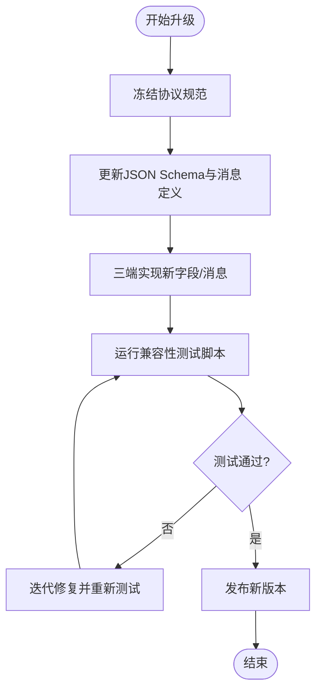
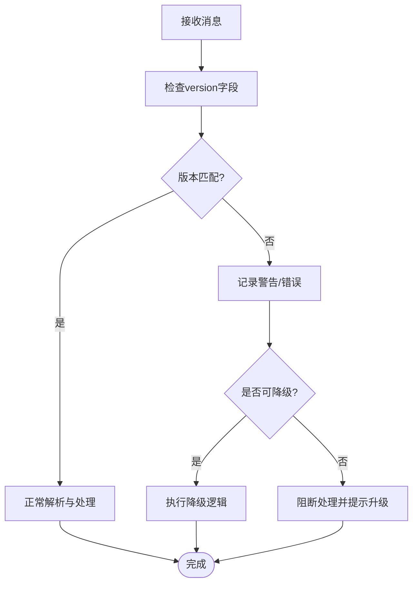
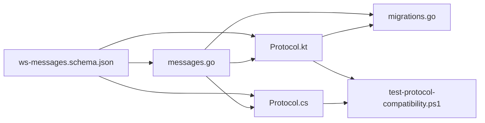

# 版本控制策略

<cite>
**本文档引用的文件**
- [messages.go](file://clipSync-server/pkg/protocol/messages.go)
- [protocol.go](file://clipSync-server/internal/websocket/protocol.go)
- [Protocol.kt](file://clipSync-android/app/src/main/java/com/clipsync/app/network/Protocol.kt)
- [Protocol.cs](file://clipSync-windows/ClipSync.WPF/Network/Protocol.cs)
- [ws-messages.schema.json](file://protocol/ws-messages.schema.json)
- [http-api.schema.json](file://protocol/http-api.schema.json)
- [test-protocol-compatibility.ps1](file://scripts/test-protocol-compatibility.ps1)
- [DEVELOPMENT_PLAN.md](file://DEVELOPMENT_PLAN.md)
- [main.go](file://clipSync-server/cmd/server/main.go)
- [mock_server.go](file://clipSync-server/scripts/mock_server.go)
- [client.go](file://clipSync-server/internal/websocket/client.go)
- [migrations.go](file://clipSync-server/internal/database/migrations.go)
- [AppDatabase.kt](file://clipSync-android/app/src/main/java/com/clipsync/app/data/AppDatabase.kt)
- [ReconnectHandler.kt](file://clipSync-android/app/src/main/java/com/clipsync/app/network/ReconnectHandler.kt)
</cite>

## 目录
1. [引言](#引言)
2. [项目结构](#项目结构)
3. [核心组件](#核心组件)
4. [架构总览](#架构总览)
5. [详细组件分析](#详细组件分析)
6. [依赖关系分析](#依赖关系分析)
7. [性能考量](#性能考量)
8. [故障排查指南](#故障排查指南)
9. [结论](#结论)
10. [附录](#附录)

## 引言
本文件系统化阐述 ClipSync 的协议版本控制策略，覆盖版本号机制、向后兼容与向前兼容策略、版本升级与废弃流程、迁移指南、版本检查与客户端兼容性检测、降级处理、发布周期、测试与兼容性验证方法、破坏性变更与新功能引入策略、性能改进处理、版本回滚与故障恢复方案，以及版本历史、变更日志与社区反馈机制。

## 项目结构
- 协议规范以 JSON Schema 和共享消息模型为核心，确保跨平台一致性。
- 服务端 Go 实现提供 WebSocket 与 HTTP 接口，并内置协议常量与版本号。
- 客户端 Android 与 Windows 分别实现对应的协议数据类与序列化逻辑。
- 提供自动化兼容性测试脚本，验证三端一致性与错误码覆盖。

**图表来源**
- [ws-messages.schema.json:1-261](file://protocol/ws-messages.schema.json#L1-L261)
- [http-api.schema.json:1-293](file://protocol/http-api.schema.json#L1-L293)
- [messages.go:1-132](file://clipSync-server/pkg/protocol/messages.go#L1-L132)
- [main.go:1-146](file://clipSync-server/cmd/server/main.go#L1-L146)
- [mock_server.go:1-200](file://clipSync-server/scripts/mock_server.go#L1-L200)
- [client.go:119-149](file://clipSync-server/internal/websocket/client.go#L119-L149)
- [Protocol.kt:1-263](file://clipSync-android/app/src/main/java/com/clipsync/app/network/Protocol.kt#L1-L263)
- [Protocol.cs:1-167](file://clipSync-windows/ClipSync.WPF/Network/Protocol.cs#L1-L167)
- [AppDatabase.kt:1-200](file://clipSync-android/app/src/main/java/com/clipsync/app/data/AppDatabase.kt#L1-L200)
- [ReconnectHandler.kt:45-79](file://clipSync-android/app/src/main/java/com/clipsync/app/network/ReconnectHandler.kt#L45-L79)

**章节来源**
- [ws-messages.schema.json:1-261](file://protocol/ws-messages.schema.json#L1-L261)
- [http-api.schema.json:1-293](file://protocol/http-api.schema.json#L1-L293)
- [messages.go:1-132](file://clipSync-server/pkg/protocol/messages.go#L1-L132)
- [main.go:1-146](file://clipSync-server/cmd/server/main.go#L1-L146)
- [mock_server.go:1-200](file://clipSync-server/scripts/mock_server.go#L1-L200)
- [client.go:119-149](file://clipSync-server/internal/websocket/client.go#L119-L149)
- [Protocol.kt:1-263](file://clipSync-android/app/src/main/java/com/clipsync/app/network/Protocol.kt#L1-L263)
- [Protocol.cs:1-167](file://clipSync-windows/ClipSync.WPF/Network/Protocol.cs#L1-L167)
- [AppDatabase.kt:1-200](file://clipSync-android/app/src/main/java/com/clipsync/app/data/AppDatabase.kt#L1-L200)
- [ReconnectHandler.kt:45-79](file://clipSync-android/app/src/main/java/com/clipsync/app/network/ReconnectHandler.kt#L45-L79)

## 核心组件
- 协议版本号：服务端在协议包中定义常量版本号为 1；HTTP 健康检查返回版本字符串 "1.0.0"；客户端（Android/Windows）默认版本字段为 1。
- 消息结构：统一的 WebSocket 消息封装包含 type、version、timestamp、device_id、payload 字段。
- 错误码：通过 JSON Schema 定义错误码集合，服务端在消息发送路径中使用统一错误码。
- 兼容性测试：PowerShell 脚本扫描三端源码与协议规范，验证消息类型、字段命名、HTTP 端点、版本号、心跳、加密与错误码一致性。

**章节来源**
- [messages.go:125-126](file://clipSync-server/pkg/protocol/messages.go#L125-L126)
- [main.go:19-19](file://clipSync-server/cmd/server/main.go#L19-L19)
- [ws-messages.schema.json:28-32](file://protocol/ws-messages.schema.json#L28-L32)
- [Protocol.kt:22-24](file://clipSync-android/app/src/main/java/com/clipsync/app/network/Protocol.kt#L22-L24)
- [Protocol.cs:13-14](file://clipSync-windows/ClipSync.WPF/Network/Protocol.cs#L13-L14)
- [test-protocol-compatibility.ps1:122-129](file://scripts/test-protocol-compatibility.ps1#L122-L129)

## 架构总览
协议版本控制贯穿服务端与客户端两端，形成“规范先行、版本常量、自动校验”的闭环。

**图表来源**
- [ws-messages.schema.json:46-87](file://protocol/ws-messages.schema.json#L46-L87)
- [messages.go:125-126](file://clipSync-server/pkg/protocol/messages.go#L125-L126)
- [client.go:119-149](file://clipSync-server/internal/websocket/client.go#L119-L149)
- [Protocol.kt:22-24](file://clipSync-android/app/src/main/java/com/clipsync/app/network/Protocol.kt#L22-L24)
- [Protocol.cs:13-14](file://clipSync-windows/ClipSync.WPF/Network/Protocol.cs#L13-L14)

## 详细组件分析

### 协议版本号机制
- 服务端协议常量：在协议包中定义版本常量为 1，用于消息结构体字段。
- HTTP 健康检查：返回版本字符串 "1.0.0"，作为服务端语义化版本标识。
- 客户端默认值：Android 与 Windows 客户端消息结构中的 version 字段默认为 1。
- 数据库版本：Android Room 数据库版本号为 1，与协议版本保持一致便于关联。

**图表来源**
- [messages.go:125-126](file://clipSync-server/pkg/protocol/messages.go#L125-L126)
- [main.go:19-19](file://clipSync-server/cmd/server/main.go#L19-L19)
- [Protocol.kt:22-24](file://clipSync-android/app/src/main/java/com/clipsync/app/network/Protocol.kt#L22-L24)
- [Protocol.cs:13-14](file://clipSync-windows/ClipSync.WPF/Network/Protocol.cs#L13-L14)
- [ws-messages.schema.json:28-32](file://protocol/ws-messages.schema.json#L28-L32)
- [AppDatabase.kt:1-200](file://clipSync-android/app/src/main/java/com/clipsync/app/data/AppDatabase.kt#L1-L200)

**章节来源**
- [messages.go:125-126](file://clipSync-server/pkg/protocol/messages.go#L125-L126)
- [main.go:19-19](file://clipSync-server/cmd/server/main.go#L19-L19)
- [Protocol.kt:22-24](file://clipSync-android/app/src/main/java/com/clipsync/app/network/Protocol.kt#L22-L24)
- [Protocol.cs:13-14](file://clipSync-windows/ClipSync.WPF/Network/Protocol.cs#L13-L14)
- [ws-messages.schema.json:28-32](file://protocol/ws-messages.schema.json#L28-L32)
- [AppDatabase.kt:1-200](file://clipSync-android/app/src/main/java/com/clipsync/app/data/AppDatabase.kt#L1-L200)

### 向后兼容性保证
- JSON Schema 对字段进行严格约束，要求 type、version、timestamp、payload 必填，version 固定为 1，确保客户端可安全解析。
- 未知字段通过客户端 JSON 解析器忽略（Android 使用 Kotlinx 序列化配置忽略未知键），避免因新增字段导致解析失败。
- 错误码集中定义于 JSON Schema，服务端在发送错误消息时使用统一错误码，客户端按码处理。

**章节来源**
- [ws-messages.schema.json:6-44](file://protocol/ws-messages.schema.json#L6-L44)
- [Protocol.kt:12-16](file://clipSync-android/app/src/main/java/com/clipsync/app/network/Protocol.kt#L12-L16)
- [client.go:120-129](file://clipSync-server/internal/websocket/client.go#L120-L129)

### 向前兼容性策略
- 服务端在消息发送路径中始终设置 version=1，确保旧客户端能正确识别。
- 客户端在反序列化时忽略未知字段，允许服务端在未来版本中扩展 payload 内容而不破坏现有客户端。
- HTTP API 的错误码与响应结构在 JSON Schema 中明确，新增错误码需同步更新规范与三端实现。

**章节来源**
- [mock_server.go:178-190](file://clipSync-server/scripts/mock_server.go#L178-L190)
- [Protocol.kt:12-16](file://clipSync-android/app/src/main/java/com/clipsync/app/network/Protocol.kt#L12-L16)
- [ws-messages.schema.json:235-258](file://protocol/ws-messages.schema.json#L235-L258)

### 版本升级流程
- 冻结协议规范：开发计划明确协议冻结原则，任何变更需版本号提升并保证向后兼容。
- 三端同步：升级前先在协议规范中定义新字段或消息类型，随后在三端实现对应结构与序列化逻辑。
- 自动化测试：运行兼容性测试脚本，验证消息类型、字段命名、HTTP 端点、版本号、心跳、加密与错误码一致性。
- 验收与发布：通过集成里程碑测试后，发布新版本并更新健康检查返回的语义化版本号。

**图表来源**
- [DEVELOPMENT_PLAN.md:806-806](file://DEVELOPMENT_PLAN.md#L806-L806)
- [test-protocol-compatibility.ps1:1-207](file://scripts/test-protocol-compatibility.ps1#L1-L207)

**章节来源**
- [DEVELOPMENT_PLAN.md:806-806](file://DEVELOPMENT_PLAN.md#L806-L806)
- [test-protocol-compatibility.ps1:1-207](file://scripts/test-protocol-compatibility.ps1#L1-L207)

### 废弃机制与迁移指南
- 废弃策略：在协议规范中标注废弃字段或消息类型，同时在服务端保留兼容逻辑一段时间。
- 迁移步骤：提供迁移脚本或客户端引导逻辑，提示用户升级到支持新版本的客户端。
- 渐进式下线：通过服务端兼容层与客户端降级处理，逐步停止对旧版本的支持。

**章节来源**
- [ws-messages.schema.json:1-261](file://protocol/ws-messages.schema.json#L1-L261)
- [DEVELOPMENT_PLAN.md:806-806](file://DEVELOPMENT_PLAN.md#L806-L806)

### 版本检查逻辑、客户端兼容性检测与降级处理
- 版本检查：客户端在收到消息时读取 version 字段并与本地期望版本比较，不匹配则触发降级或拒绝处理。
- 兼容性检测：PowerShell 测试脚本扫描三端源码与协议规范，验证消息类型、字段命名、HTTP 端点、版本号、心跳、加密与错误码一致性。
- 降级处理：当发现不兼容时，客户端采用默认行为或提示用户升级；服务端对未知字段忽略处理。

**图表来源**
- [test-protocol-compatibility.ps1:17-28](file://scripts/test-protocol-compatibility.ps1#L17-L28)
- [Protocol.kt:12-16](file://clipSync-android/app/src/main/java/com/clipsync/app/network/Protocol.kt#L12-L16)
- [Protocol.cs:13-14](file://clipSync-windows/ClipSync.WPF/Network/Protocol.cs#L13-L14)

**章节来源**
- [test-protocol-compatibility.ps1:17-28](file://scripts/test-protocol-compatibility.ps1#L17-L28)
- [Protocol.kt:12-16](file://clipSync-android/app/src/main/java/com/clipsync/app/network/Protocol.kt#L12-L16)
- [Protocol.cs:13-14](file://clipSync-windows/ClipSync.WPF/Network/Protocol.cs#L13-L14)

### 发布周期、测试策略与兼容性验证
- 发布周期：按开发计划分阶段发布，每个阶段包含协议兼容性、认证流、WebSocket 连接、剪贴板同步与全功能集成等里程碑。
- 测试策略：使用 PowerShell 自动化脚本进行三端一致性验证；结合模拟服务器进行端到端测试。
- 兼容性验证：JSON Schema 作为契约，三端实现必须满足字段类型、枚举值与必填项约束。

**章节来源**
- [DEVELOPMENT_PLAN.md:718-797](file://DEVELOPMENT_PLAN.md#L718-L797)
- [test-protocol-compatibility.ps1:1-207](file://scripts/test-protocol-compatibility.ps1#L1-L207)
- [ws-messages.schema.json:1-261](file://protocol/ws-messages.schema.json#L1-L261)

### 处理破坏性变更、新功能引入与性能改进
- 破坏性变更：需提升协议版本号并在开发计划中明确冻结与兼容策略。
- 新功能引入：先在协议规范中定义，再在三端实现；通过兼容性测试确保无损发布。
- 性能改进：优化服务端查询与连接管理，客户端优化重连与心跳策略；通过负载测试验证稳定性。

**章节来源**
- [DEVELOPMENT_PLAN.md:806-806](file://DEVELOPMENT_PLAN.md#L806-L806)
- [ReconnectHandler.kt:45-79](file://clipSync-android/app/src/main/java/com/clipsync/app/network/ReconnectHandler.kt#L45-L79)
- [mock_server.go:161-176](file://clipSync-server/scripts/mock_server.go#L161-L176)

### 版本回滚策略与故障恢复方案
- 回滚策略：若新版本出现严重问题，回退到上一稳定版本；确保客户端与服务端均回滚至兼容版本。
- 故障恢复：模拟服务器支持延迟与错误注入，用于验证客户端的重连与错误处理能力；服务端错误消息统一格式，便于客户端快速定位问题。

**章节来源**
- [mock_server.go:161-176](file://clipSync-server/scripts/mock_server.go#L161-L176)
- [client.go:119-149](file://clipSync-server/internal/websocket/client.go#L119-L149)

### 版本历史、变更日志与社区反馈机制
- 版本历史：服务端健康检查返回 "1.0.0"，作为语义化版本标识；协议常量版本为 1。
- 变更日志：建议在开发计划中维护各阶段里程碑与变更摘要，便于追踪。
- 社区反馈：通过测试脚本输出汇总结果，收集三端实现差异与问题报告。

**章节来源**
- [main.go:19-19](file://clipSync-server/cmd/server/main.go#L19-L19)
- [messages.go:125-126](file://clipSync-server/pkg/protocol/messages.go#L125-L126)
- [test-protocol-compatibility.ps1:193-207](file://scripts/test-protocol-compatibility.ps1#L193-L207)

## 依赖关系分析
- 协议规范驱动三端实现：JSON Schema 与服务端协议常量共同决定消息结构与版本。
- 服务端依赖：WebSocket 消息发送路径使用协议常量与错误码；数据库迁移与应用版本保持一致。
- 客户端依赖：Kotlinx 序列化忽略未知键；C# JSON 序列化捕获异常并降级处理。

**图表来源**
- [ws-messages.schema.json:1-261](file://protocol/ws-messages.schema.json#L1-L261)
- [messages.go:1-132](file://clipSync-server/pkg/protocol/messages.go#L1-L132)
- [Protocol.kt:1-263](file://clipSync-android/app/src/main/java/com/clipsync/app/network/Protocol.kt#L1-L263)
- [Protocol.cs:1-167](file://clipSync-windows/ClipSync.WPF/Network/Protocol.cs#L1-L167)
- [migrations.go:82-113](file://clipSync-server/internal/database/migrations.go#L82-L113)
- [test-protocol-compatibility.ps1:1-207](file://scripts/test-protocol-compatibility.ps1#L1-L207)

**章节来源**
- [ws-messages.schema.json:1-261](file://protocol/ws-messages.schema.json#L1-L261)
- [messages.go:1-132](file://clipSync-server/pkg/protocol/messages.go#L1-L132)
- [Protocol.kt:1-263](file://clipSync-android/app/src/main/java/com/clipsync/app/network/Protocol.kt#L1-L263)
- [Protocol.cs:1-167](file://clipSync-windows/ClipSync.WPF/Network/Protocol.cs#L1-L167)
- [migrations.go:82-113](file://clipSync-server/internal/database/migrations.go#L82-L113)
- [test-protocol-compatibility.ps1:1-207](file://scripts/test-protocol-compatibility.ps1#L1-L207)

## 性能考量
- 心跳与重连：客户端定时发送心跳，服务端监控超时；客户端实现指数退避重连，降低网络波动影响。
- 数据库与迁移：服务端使用 SQLite 并通过迁移脚本管理模式演进，保持与应用版本一致。
- 负载与稳定性：通过模拟服务器进行压力测试，验证服务端在多连接下的表现。

**章节来源**
- [ReconnectHandler.kt:45-79](file://clipSync-android/app/src/main/java/com/clipsync/app/network/ReconnectHandler.kt#L45-L79)
- [migrations.go:82-113](file://clipSync-server/internal/database/migrations.go#L82-L113)
- [mock_server.go:161-176](file://clipSync-server/scripts/mock_server.go#L161-L176)

## 故障排查指南
- 协议不一致：使用兼容性测试脚本定位缺失的消息类型、字段命名或端点。
- 错误码不匹配：核对 JSON Schema 中定义的错误码集合，确保服务端与客户端一致。
- 加密问题：确认三端 AES-256 实现符合规范，加密失败时不回退明文，直接抛出异常。
- 连接与重连：检查心跳间隔与重连退避参数，必要时调整以适配网络环境。

**章节来源**
- [test-protocol-compatibility.ps1:17-28](file://scripts/test-protocol-compatibility.ps1#L17-L28)
- [ws-messages.schema.json:235-258](file://protocol/ws-messages.schema.json#L235-L258)
- [Protocol.cs:111-124](file://clipSync-windows/ClipSync.WPF/Network/Protocol.cs#L111-L124)
- [ReconnectHandler.kt:45-79](file://clipSync-android/app/src/main/java/com/clipsync/app/network/ReconnectHandler.kt#L45-L79)

## 结论
通过“协议规范先行、版本常量统一、自动化测试保障”的策略，ClipSync 在三端实现了强一致的协议版本控制。该策略既保证了向后兼容，又为未来版本演进预留了空间，同时提供了完善的测试与故障排查手段，确保系统在持续迭代中的稳定性与可靠性。

## 附录
- 开发计划中的里程碑与风险评估为版本控制提供了实践框架。
- 健康检查返回的 "1.0.0" 与协议常量 "1" 形成双层版本标识，便于运维与监控。

**章节来源**
- [DEVELOPMENT_PLAN.md:718-797](file://DEVELOPMENT_PLAN.md#L718-L797)
- [main.go:19-19](file://clipSync-server/cmd/server/main.go#L19-L19)
- [messages.go:125-126](file://clipSync-server/pkg/protocol/messages.go#L125-L126)