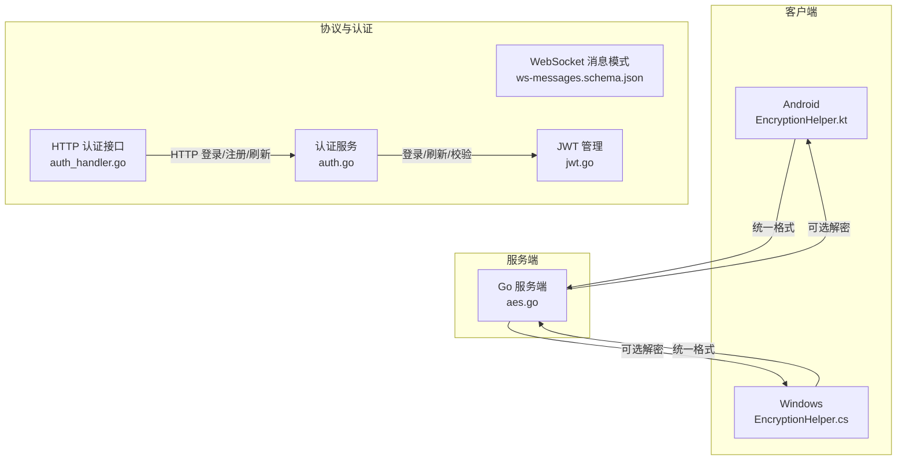
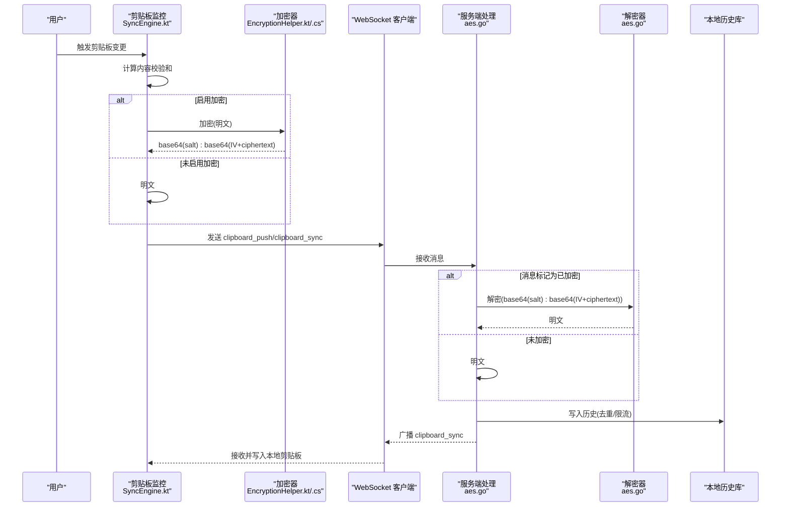
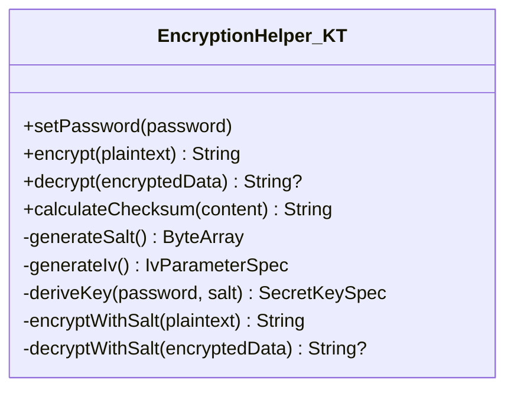
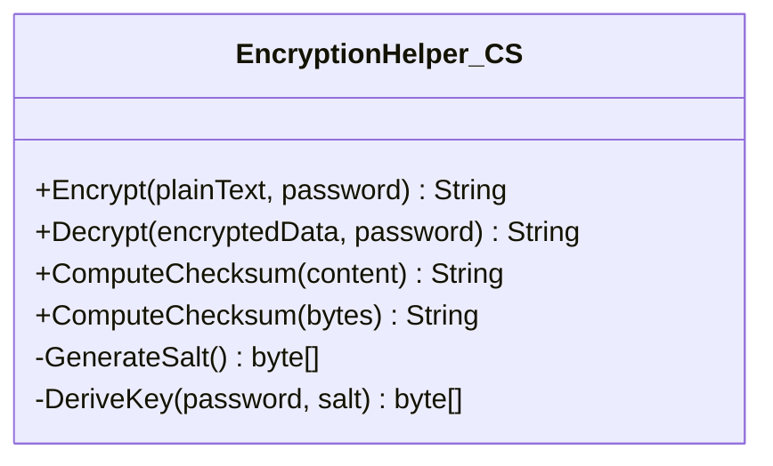
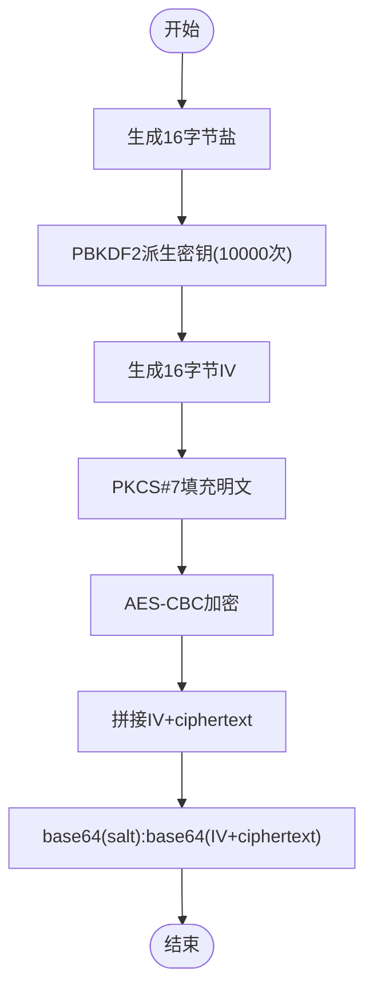
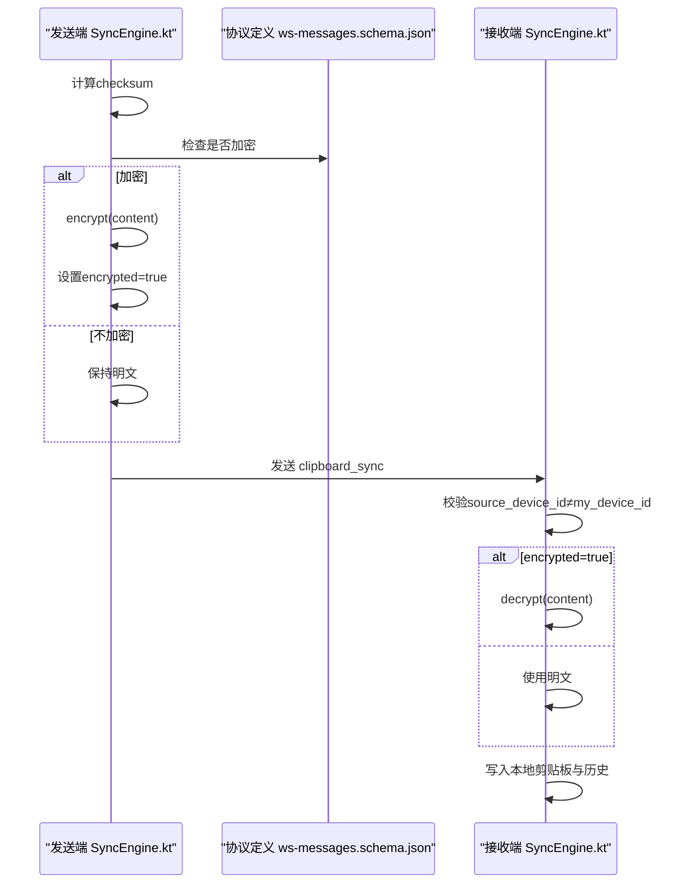
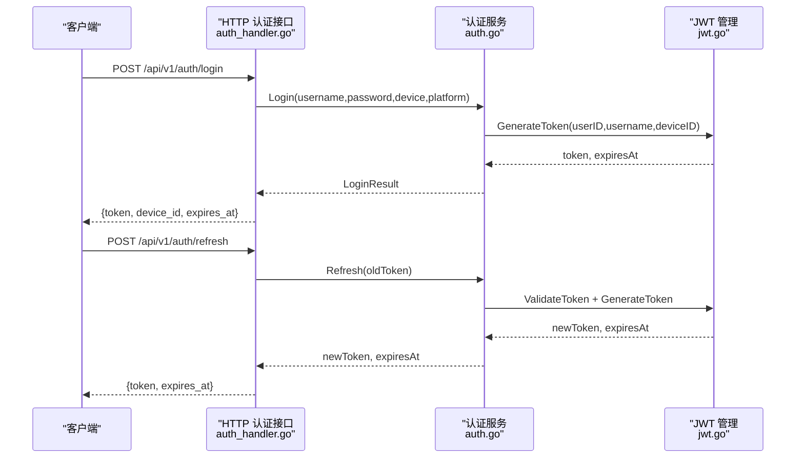
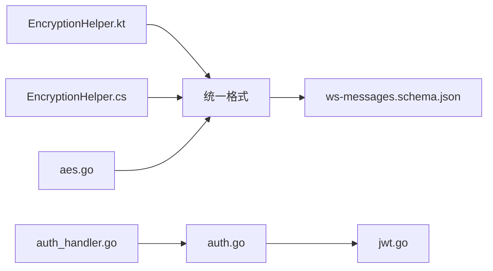

# 加密算法

<cite>
**本文引用的文件**
- [EncryptionHelper.kt](file://clipSync-android/app/src/main/java/com/clipsync/app/core/EncryptionHelper.kt)
- [EncryptionHelper.cs](file://clipSync-windows/ClipSync.WPF/Core/EncryptionHelper.cs)
- [aes.go](file://clipSync-server/internal/encryption/aes.go)
- [SyncEngine.kt](file://clipSync-android/app/src/main/java/com/clipsync/app/core/SyncEngine.kt)
- [ws-messages.schema.json](file://protocol/ws-messages.schema.json)
- [DEVELOPMENT_PLAN.md](file://DEVELOPMENT_PLAN.md)
- [auth.go](file://clipSync-server/internal/auth/auth.go)
- [jwt.go](file://clipSync-server/internal/auth/jwt.go)
- [auth_handler.go](file://clipSync-server/internal/httpserver/auth_handler.go)
</cite>

## 目录
1. [简介](#简介)
2. [项目结构](#项目结构)
3. [核心组件](#核心组件)
4. [架构总览](#架构总览)
5. [详细组件分析](#详细组件分析)
6. [依赖分析](#依赖分析)
7. [性能考虑](#性能考虑)
8. [故障排查指南](#故障排查指南)
9. [结论](#结论)
10. [附录](#附录)

## 简介
本文件系统化阐述 ClipSync 跨平台加密模块的设计与实现，覆盖以下要点：
- AES-256-CBC 对称加密在 Android、Windows 和 Go 服务端的一致实现
- PBKDF2 密钥派生（SHA-256）与随机盐、迭代次数、密钥长度
- PKCS#7 填充机制
- 跨平台加密兼容性与统一数据格式
- 密钥管理策略与安全建议
- 与认证系统的集成关系
- 常见问题与解决方案
- 面向初学者的易懂说明与面向资深工程师的技术深度

## 项目结构
加密模块横跨三个平台，采用统一的数据格式与算法参数，确保互操作性：
- Android：使用 Java/Javax Crypto 实现 AES-256-CBC、PBKDF2、PKCS#5Padding
- Windows：使用 .NET System.Security.Cryptography 实现 AES-256-CBC、PBKDF2、PKCS7
- Go 服务端：使用标准库 crypto/aes、crypto/cipher 与 golang.org/x/crypto/pbkdf2 实现 AES-256-CBC、PBKDF2、自定义 PKCS#7

图表来源
- [EncryptionHelper.kt:13-156](file://clipSync-android/app/src/main/java/com/clipsync/app/core/EncryptionHelper.kt#L13-L156)
- [EncryptionHelper.cs:8-133](file://clipSync-windows/ClipSync.WPF/Core/EncryptionHelper.cs#L8-L133)
- [aes.go:1-135](file://clipSync-server/internal/encryption/aes.go#L1-L135)
- [ws-messages.schema.json:135-167](file://protocol/ws-messages.schema.json#L135-L167)
- [auth.go:67-136](file://clipSync-server/internal/auth/auth.go#L67-L136)
- [jwt.go:18-76](file://clipSync-server/internal/auth/jwt.go#L18-L76)
- [auth_handler.go:63-208](file://clipSync-server/internal/httpserver/auth_handler.go#L63-L208)

章节来源
- [EncryptionHelper.kt:13-156](file://clipSync-android/app/src/main/java/com/clipsync/app/core/EncryptionHelper.kt#L13-L156)
- [EncryptionHelper.cs:8-133](file://clipSync-windows/ClipSync.WPF/Core/EncryptionHelper.cs#L8-L133)
- [aes.go:1-135](file://clipSync-server/internal/encryption/aes.go#L1-L135)
- [ws-messages.schema.json:135-167](file://protocol/ws-messages.schema.json#L135-L167)
- [DEVELOPMENT_PLAN.md:330-348](file://DEVELOPMENT_PLAN.md#L330-L348)

## 核心组件
- 统一加密数据格式
  - 格式：base64(salt):base64(IV + ciphertext)
  - 该格式在 Android、Windows、Go 三端一致，便于跨平台传输与解析
- 关键参数
  - 密钥派生：PBKDF2-SHA256，迭代次数 10000，输出 32 字节密钥
  - 初始化向量 IV：16 字节随机
  - 填充：PKCS#7（Android 使用 PKCS5Padding，本质等价）
  - 盐：16 字节随机
- 平台实现差异
  - Android：Javax Crypto Cipher(AES/CBC/PKCS5Padding)，PBKDF2WithHmacSHA256
  - Windows：System.Security.Cryptography.Aes，Rfc2898DeriveBytes(SHA256)
  - Go：crypto/aes + golang.org/x/crypto/pbkdf2，自定义 PKCS#7 工具函数

章节来源
- [EncryptionHelper.kt:24-31](file://clipSync-android/app/src/main/java/com/clipsync/app/core/EncryptionHelper.kt#L24-L31)
- [EncryptionHelper.cs:18-23](file://clipSync-windows/ClipSync.WPF/Core/EncryptionHelper.cs#L18-L23)
- [aes.go:16-20](file://clipSync-server/internal/encryption/aes.go#L16-L20)

## 架构总览
下图展示从剪贴板事件到网络传输再到接收端解密的完整流程，以及与认证系统的衔接。

图表来源
- [SyncEngine.kt:72-160](file://clipSync-android/app/src/main/java/com/clipsync/app/core/SyncEngine.kt#L72-L160)
- [EncryptionHelper.kt:51-102](file://clipSync-android/app/src/main/java/com/clipsync/app/core/EncryptionHelper.kt#L51-L102)
- [EncryptionHelper.cs:30-103](file://clipSync-windows/ClipSync.WPF/Core/EncryptionHelper.cs#L30-L103)
- [aes.go:25-106](file://clipSync-server/internal/encryption/aes.go#L25-L106)

## 详细组件分析

### Android 加密组件（EncryptionHelper.kt）
- 功能职责
  - 生成随机盐与 IV
  - 使用 PBKDF2WithHmacSHA256 从密码与盐派生 256 位密钥
  - AES/CBC/PKCS5Padding 加密，输出统一格式
  - 解密时按统一格式解析并验证长度
  - 提供内容校验和计算用于去重
- 关键常量
  - 算法与变换：AES、AES/CBC/PKCS5Padding
  - 迭代次数：10000
  - 密钥长度：256 位
  - IV/盐长度：16 字节
- 错误处理
  - 加密失败抛异常；解密失败返回空值并记录日志

图表来源
- [EncryptionHelper.kt:22-156](file://clipSync-android/app/src/main/java/com/clipsync/app/core/EncryptionHelper.kt#L22-L156)

章节来源
- [EncryptionHelper.kt:13-156](file://clipSync-android/app/src/main/java/com/clipsync/app/core/EncryptionHelper.kt#L13-L156)

### Windows 加密组件（EncryptionHelper.cs）
- 功能职责
  - 生成随机盐与 IV
  - 使用 Rfc2898DeriveBytes(SHA256) 派生 256 位密钥
  - AES-CBC+PKCS7 加密，输出统一格式
  - 解密时按统一格式解析并验证长度
  - 提供内容校验和计算用于去重
- 关键常量
  - KeySize=32、IvSize=16、SaltSize=16、Iterations=10000

图表来源
- [EncryptionHelper.cs:18-133](file://clipSync-windows/ClipSync.WPF/Core/EncryptionHelper.cs#L18-L133)

章节来源
- [EncryptionHelper.cs:8-133](file://clipSync-windows/ClipSync.WPF/Core/EncryptionHelper.cs#L8-L133)

### Go 服务端加密组件（aes.go）
- 功能职责
  - 生成随机盐与 IV
  - 使用 pbkdf2.Key(SHA3-256) 派生 256 位密钥
  - 自定义 PKCS#7 填充/去填充
  - 统一格式编码与解码
- 关键常量
  - saltSize=16、keySize=32、iterations=10000
- 错误处理
  - 对盐长度、内容格式、解码失败、填充错误进行显式检查

图表来源
- [aes.go:25-57](file://clipSync-server/internal/encryption/aes.go#L25-L57)

章节来源
- [aes.go:1-135](file://clipSync-server/internal/encryption/aes.go#L1-L135)

### 协议与去重（ws-messages.schema.json 与 SyncEngine.kt）
- 协议字段
  - clipboard_sync 消息支持 encrypted 标记，指示 payload 是否经过 AES-256-CBC 加密
  - payload.content 可以是明文或加密后的字符串
- 去重策略
  - 发送前计算 SHA-256 校验和，避免重复推送相同内容
  - 接收端跳过来自自身设备的内容，防止回环

图表来源
- [ws-messages.schema.json:150-167](file://protocol/ws-messages.schema.json#L150-L167)
- [SyncEngine.kt:72-160](file://clipSync-android/app/src/main/java/com/clipsync/app/core/SyncEngine.kt#L72-L160)

章节来源
- [ws-messages.schema.json:135-167](file://protocol/ws-messages.schema.json#L135-L167)
- [SyncEngine.kt:72-160](file://clipSync-android/app/src/main/java/com/clipsync/app/core/SyncEngine.kt#L72-L160)

### 认证系统集成
- 登录/刷新/校验
  - HTTP 登录/注册/刷新由 auth_handler.go 处理
  - 认证服务 auth.go 调用 JWT 管理 jwt.go 生成/校验令牌
  - 服务端 aes.go 可在需要时对敏感数据进行解密（如历史查询）
- 令牌与会话
  - 通过 Authorization: Bearer 传递 JWT
  - 服务端中间件校验令牌有效性

图表来源
- [auth_handler.go:63-208](file://clipSync-server/internal/httpserver/auth_handler.go#L63-L208)
- [auth.go:67-136](file://clipSync-server/internal/auth/auth.go#L67-L136)
- [jwt.go:32-75](file://clipSync-server/internal/auth/jwt.go#L32-L75)

章节来源
- [auth_handler.go:63-208](file://clipSync-server/internal/httpserver/auth_handler.go#L63-L208)
- [auth.go:67-136](file://clipSync-server/internal/auth/auth.go#L67-L136)
- [jwt.go:18-76](file://clipSync-server/internal/auth/jwt.go#L18-L76)

## 依赖分析
- 组件耦合
  - 客户端加密器与协议定义强耦合：必须严格遵循统一格式
  - 服务端 aes.go 与客户端实现弱耦合：仅依赖统一格式约定
- 外部依赖
  - Android：Javax Crypto、SecureRandom
  - Windows：System.Security.Cryptography、Rfc2898DeriveBytes
  - Go：crypto/aes、crypto/cipher、golang.org/x/crypto/pbkdf2、sha3

图表来源
- [EncryptionHelper.kt:22-65](file://clipSync-android/app/src/main/java/com/clipsync/app/core/EncryptionHelper.kt#L22-L65)
- [EncryptionHelper.cs:18-55](file://clipSync-windows/ClipSync.WPF/Core/EncryptionHelper.cs#L18-L55)
- [aes.go:25-57](file://clipSync-server/internal/encryption/aes.go#L25-L57)
- [ws-messages.schema.json:135-167](file://protocol/ws-messages.schema.json#L135-L167)
- [auth.go:8-22](file://clipSync-server/internal/auth/auth.go#L8-L22)
- [jwt.go:18-30](file://clipSync-server/internal/auth/jwt.go#L18-L30)
- [auth_handler.go:16-19](file://clipSync-server/internal/httpserver/auth_handler.go#L16-L19)

章节来源
- [EncryptionHelper.kt:22-65](file://clipSync-android/app/src/main/java/com/clipsync/app/core/EncryptionHelper.kt#L22-L65)
- [EncryptionHelper.cs:18-55](file://clipSync-windows/ClipSync.WPF/Core/EncryptionHelper.cs#L18-L55)
- [aes.go:25-57](file://clipSync-server/internal/encryption/aes.go#L25-L57)
- [ws-messages.schema.json:135-167](file://protocol/ws-messages.schema.json#L135-L167)
- [auth.go:8-22](file://clipSync-server/internal/auth/auth.go#L8-L22)
- [jwt.go:18-30](file://clipSync-server/internal/auth/jwt.go#L18-L30)
- [auth_handler.go:16-19](file://clipSync-server/internal/httpserver/auth_handler.go#L16-L19)

## 性能考虑
- PBKDF2 迭代次数
  - 当前为 10000 次，兼顾安全性与交互体验；在资源受限设备上可评估调低，但需权衡安全风险
- 加密开销
  - 对于大文本，加密/解密与 PKCS#7 填充/去填充带来 CPU 开销；可在批量处理时合并
- 去重与网络
  - 基于 SHA-256 的去重减少冗余传输，显著降低带宽占用
- I/O 与并发
  - 客户端与服务端均采用异步/协程模型，避免阻塞主线程

## 故障排查指南
- 常见错误与定位
  - 格式错误：salt 或 content 缺失或 base64 解码失败
  - 长度不足：IV 或 ciphertext 小于块大小
  - 填充错误：去填充时校验失败
  - 密钥派生不一致：不同平台使用的哈希算法或迭代次数不一致
- Android
  - 解密返回空值：检查密码是否与加密时一致、日志中是否有异常
  - 加密抛异常：检查输入参数与权限
- Windows
  - 解密抛出格式异常：确认输入格式为 base64(salt):base64(IV+ciphertext)
- Go 服务端
  - 返回错误：查看具体错误类型（盐长度、解码、填充等）

章节来源
- [EncryptionHelper.kt:72-102](file://clipSync-android/app/src/main/java/com/clipsync/app/core/EncryptionHelper.kt#L72-L102)
- [EncryptionHelper.cs:62-103](file://clipSync-windows/ClipSync.WPF/Core/EncryptionHelper.cs#L62-L103)
- [aes.go:62-106](file://clipSync-server/internal/encryption/aes.go#L62-L106)

## 结论
- 三端采用统一的加密数据格式与参数，确保跨平台互操作
- PBKDF2-SHA256 与 PKCS#7 填充提供了良好的安全性与兼容性
- 与认证系统的清晰边界：认证负责身份与令牌，加密负责数据机密性
- 建议在生产环境中：
  - 使用用户可配置的强口令，避免硬编码默认口令
  - 在高负载场景评估 PBKDF2 迭代次数与批处理策略
  - 强化错误日志与告警，便于快速定位问题

## 附录

### 加密函数与参数一览
- Android
  - 函数：encrypt(String)、decrypt(String)、calculateChecksum(String)
  - 参数：明文字符串、加密密码（可设置）
  - 返回：加密结果字符串或解密结果字符串/空
  - 关键常量：算法、变换、迭代次数、密钥长度、IV/盐长度
- Windows
  - 函数：Encrypt(String, String)、Decrypt(String, String)、ComputeChecksum(...)
  - 参数：明文、密码
  - 返回：加密结果字符串或解密结果字符串
  - 关键常量：KeySize、IvSize、SaltSize、Iterations
- Go 服务端
  - 函数：Encrypt(String, String)、Decrypt(String, String)
  - 参数：明文、密码
  - 返回：加密结果字符串或解密结果字符串
  - 关键常量：saltSize、keySize、iterations

章节来源
- [EncryptionHelper.kt:39-156](file://clipSync-android/app/src/main/java/com/clipsync/app/core/EncryptionHelper.kt#L39-L156)
- [EncryptionHelper.cs:30-133](file://clipSync-windows/ClipSync.WPF/Core/EncryptionHelper.cs#L30-L133)
- [aes.go:25-106](file://clipSync-server/internal/encryption/aes.go#L25-L106)

### 数据格式规范
- 统一格式：base64(salt):base64(IV + ciphertext)
- 协议字段：clipboard_sync.payload.encrypted 标识是否加密
- 开发计划中的加密规范与注释可作为参考

章节来源
- [DEVELOPMENT_PLAN.md:330-348](file://DEVELOPMENT_PLAN.md#L330-L348)
- [ws-messages.schema.json:150-167](file://protocol/ws-messages.schema.json#L150-L167)