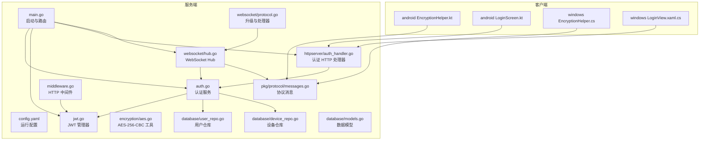
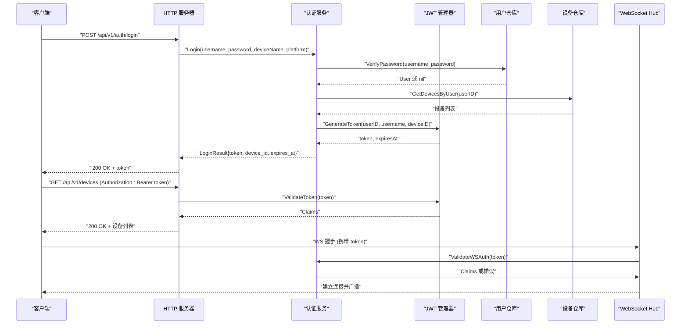
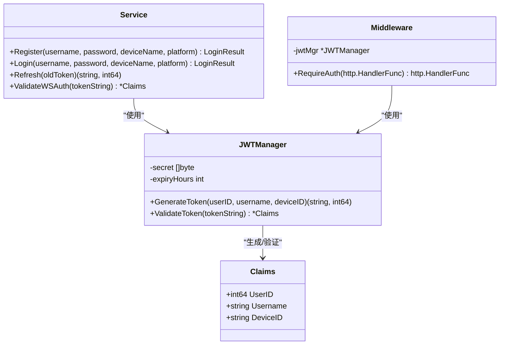
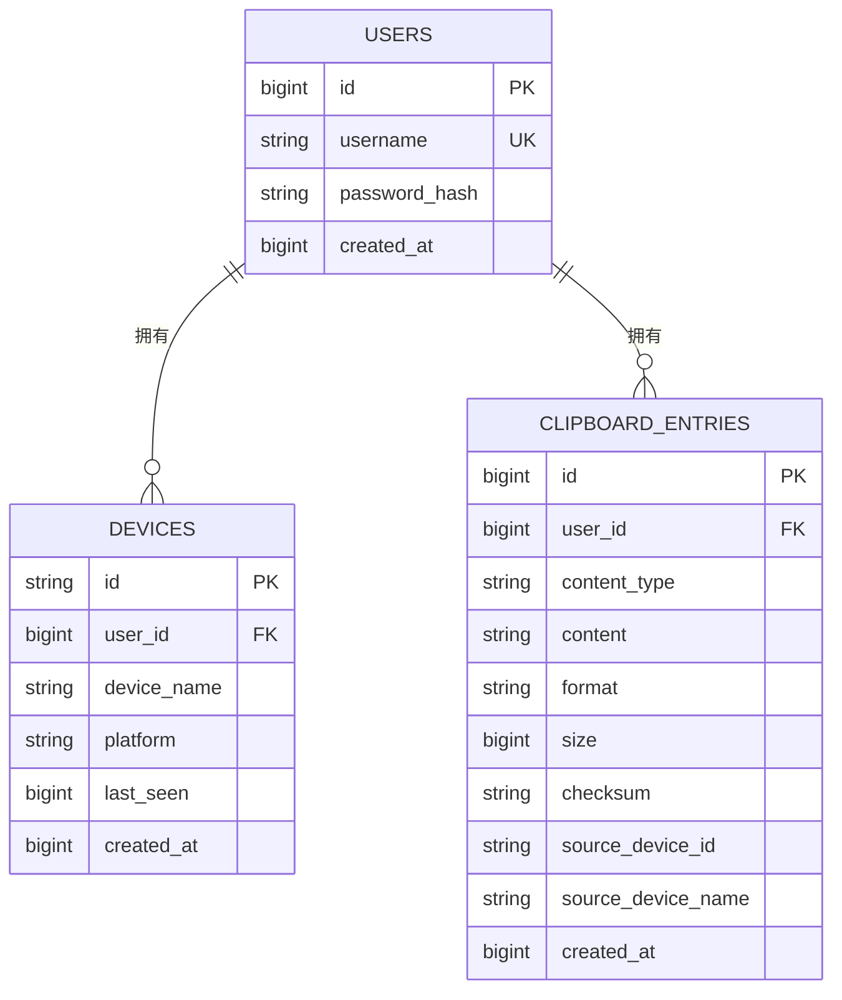
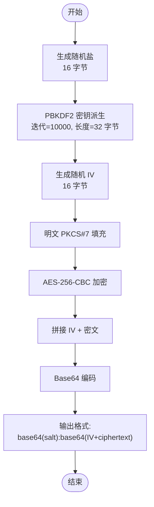
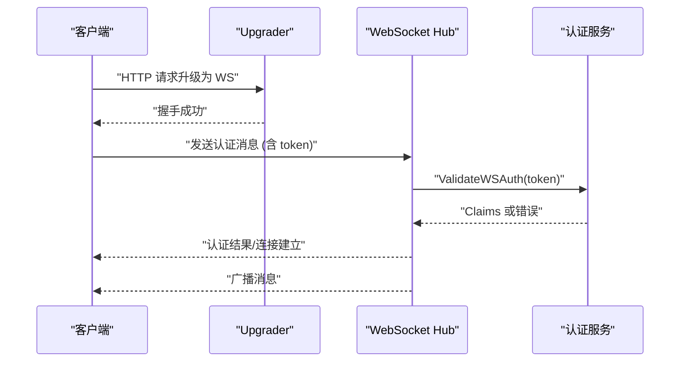
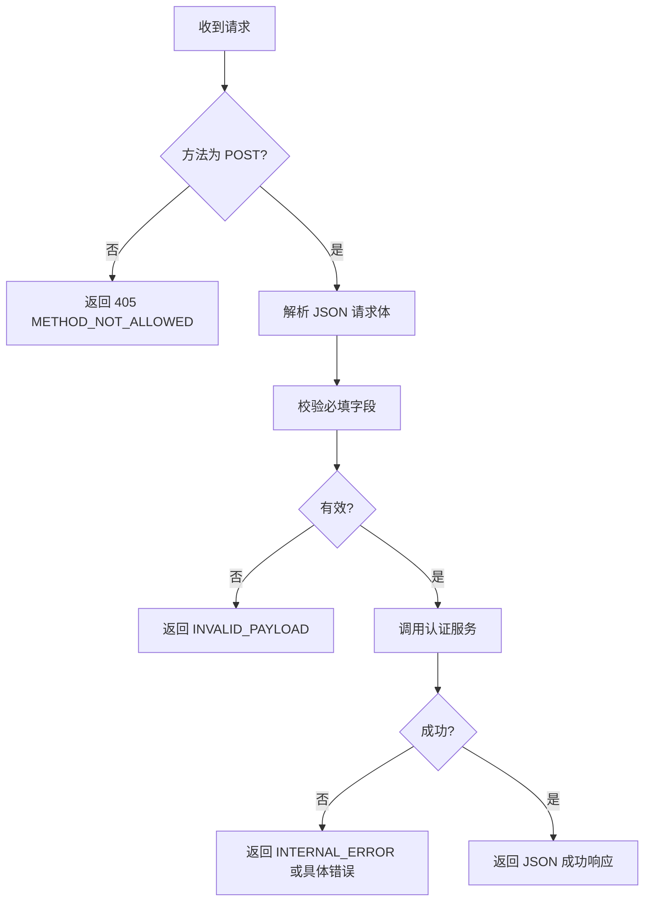
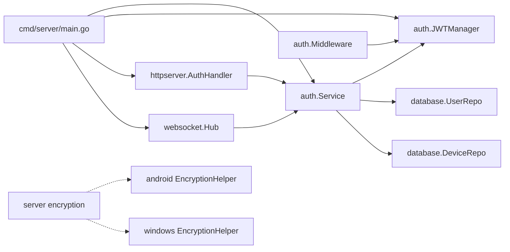

# 安全和加密

<cite>
**本文引用的文件**
- [clipSync-server/cmd/server/main.go](file://clipSync-server/cmd/server/main.go)
- [clipSync-server/configs/config.yaml](file://clipSync-server/configs/config.yaml)
- [clipSync-server/internal/auth/auth.go](file://clipSync-server/internal/auth/auth.go)
- [clipSync-server/internal/auth/jwt.go](file://clipSync-server/internal/auth/jwt.go)
- [clipSync-server/internal/auth/middleware.go](file://clipSync-server/internal/auth/middleware.go)
- [clipSync-server/internal/encryption/aes.go](file://clipSync-server/internal/encryption/aes.go)
- [clipSync-server/internal/database/models.go](file://clipSync-server/internal/database/models.go)
- [clipSync-server/internal/database/user_repo.go](file://clipSync-server/internal/database/user_repo.go)
- [clipSync-server/internal/database/device_repo.go](file://clipSync-server/internal/database/device_repo.go)
- [clipSync-server/internal/httpserver/auth_handler.go](file://clipSync-server/internal/httpserver/auth_handler.go)
- [clipSync-server/internal/websocket/hub.go](file://clipSync-server/internal/websocket/hub.go)
- [clipSync-server/internal/websocket/protocol.go](file://clipSync-server/internal/websocket/protocol.go)
- [clipSync-server/pkg/protocol/messages.go](file://clipSync-server/pkg/protocol/messages.go)
- [clipSync-android/app/src/main/java/com/clipsync/app/core/EncryptionHelper.kt](file://clipSync-android/app/src/main/java/com/clipsync/app/core/EncryptionHelper.kt)
- [clipSync-android/app/src/main/java/com/clipsync/app/ui/screens/LoginScreen.kt](file://clipSync-android/app/src/main/java/com/clipsync/app/ui/screens/LoginScreen.kt)
- [clipSync-windows/ClipSync.WPF/Core/EncryptionHelper.cs](file://clipSync-windows/ClipSync.WPF/Core/EncryptionHelper.cs)
- [clipSync-windows/ClipSync.WPF/UI/Views/LoginView.xaml.cs](file://clipSync-windows/ClipSync.WPF/UI/Views/LoginView.xaml.cs)
</cite>

## 目录
1. [简介](#简介)
2. [项目结构](#项目结构)
3. [核心组件](#核心组件)
4. [架构总览](#架构总览)
5. [详细组件分析](#详细组件分析)
6. [依赖关系分析](#依赖关系分析)
7. [性能考量](#性能考量)
8. [故障排查指南](#故障排查指南)
9. [结论](#结论)
10. [附录](#附录)

## 简介
本文件系统化梳理 ClipSync 的安全与加密实现，覆盖以下主题：
- 认证机制：用户名密码校验、设备注册与识别、JWT 令牌签发与刷新
- 令牌管理：签发、验证、过期控制、WebSocket 鉴权
- 数据加密：跨平台统一的 AES-256-CBC 加密方案（PBKDF2 密钥派生）
- 平台实现：服务端 Go、Android Kotlin、Windows WPF 的一致性设计
- 安全最佳实践：密码哈希、速率限制、错误处理、最小暴露面
- 与其他组件的关系：HTTP 路由、WebSocket、数据库、协议消息
- 常见问题与解决方案：令牌过期、格式错误、解密失败、并发广播

## 项目结构
围绕“安全与加密”的关键目录与文件：
- 服务端（Go）：认证服务、JWT 管理器、HTTP 中间件、加密工具、数据库仓库、WebSocket Hub、协议定义
- 客户端（Android/Kotlin）：加密工具、登录界面
- 客户端（Windows/WPF）：加密工具、登录界面
- 配置：JWT 秘钥、过期时长、端口、文件存储路径、历史限制等

**图表来源**
- [clipSync-server/cmd/server/main.go:1-141](file://clipSync-server/cmd/server/main.go#L1-L141)
- [clipSync-server/configs/config.yaml:1-29](file://clipSync-server/configs/config.yaml#L1-L29)
- [clipSync-server/internal/auth/auth.go:1-137](file://clipSync-server/internal/auth/auth.go#L1-L137)
- [clipSync-server/internal/auth/jwt.go:1-76](file://clipSync-server/internal/auth/jwt.go#L1-L76)
- [clipSync-server/internal/auth/middleware.go:1-111](file://clipSync-server/internal/auth/middleware.go#L1-L111)
- [clipSync-server/internal/encryption/aes.go:1-135](file://clipSync-server/internal/encryption/aes.go#L1-L135)
- [clipSync-server/internal/database/user_repo.go:1-91](file://clipSync-server/internal/database/user_repo.go#L1-L91)
- [clipSync-server/internal/database/device_repo.go:1-126](file://clipSync-server/internal/database/device_repo.go#L1-L126)
- [clipSync-server/internal/database/models.go:1-46](file://clipSync-server/internal/database/models.go#L1-L46)
- [clipSync-server/internal/httpserver/auth_handler.go:1-215](file://clipSync-server/internal/httpserver/auth_handler.go#L1-L215)
- [clipSync-server/internal/websocket/hub.go:1-230](file://clipSync-server/internal/websocket/hub.go#L1-L230)
- [clipSync-server/internal/websocket/protocol.go:1-27](file://clipSync-server/internal/websocket/protocol.go#L1-L27)
- [clipSync-server/pkg/protocol/messages.go:1-132](file://clipSync-server/pkg/protocol/messages.go#L1-L132)
- [clipSync-android/app/src/main/java/com/clipsync/app/core/EncryptionHelper.kt:1-157](file://clipSync-android/app/src/main/java/com/clipsync/app/core/EncryptionHelper.kt#L1-L157)
- [clipSync-android/app/src/main/java/com/clipsync/app/ui/screens/LoginScreen.kt:1-291](file://clipSync-android/app/src/main/java/com/clipsync/app/ui/screens/LoginScreen.kt#L1-L291)
- [clipSync-windows/ClipSync.WPF/Core/EncryptionHelper.cs:1-134](file://clipSync-windows/ClipSync.WPF/Core/EncryptionHelper.cs#L1-L134)
- [clipSync-windows/ClipSync.WPF/UI/Views/LoginView.xaml.cs:1-71](file://clipSync-windows/ClipSync.WPF/UI/Views/LoginView.xaml.cs#L1-L71)

**章节来源**
- [clipSync-server/cmd/server/main.go:1-141](file://clipSync-server/cmd/server/main.go#L1-L141)
- [clipSync-server/configs/config.yaml:1-29](file://clipSync-server/configs/config.yaml#L1-L29)

## 核心组件
- 认证服务（服务端）：负责用户注册/登录、设备创建与识别、JWT 生成与刷新
- JWT 管理器：负责 HS256 签名的令牌生成与验证
- HTTP 中间件：从 Authorization 头解析 Bearer Token，注入上下文
- 加密工具（服务端/客户端）：统一的 AES-256-CBC 加密方案，PBKDF2-SHA3 或 PBKDF2-SHA256 密钥派生
- 数据库仓库：用户与设备的持久化、密码哈希（bcrypt）
- WebSocket Hub：连接管理、鉴权超时、广播
- 协议消息：WebSocket 消息结构与类型常量

**章节来源**
- [clipSync-server/internal/auth/auth.go:1-137](file://clipSync-server/internal/auth/auth.go#L1-L137)
- [clipSync-server/internal/auth/jwt.go:1-76](file://clipSync-server/internal/auth/jwt.go#L1-L76)
- [clipSync-server/internal/auth/middleware.go:1-111](file://clipSync-server/internal/auth/middleware.go#L1-L111)
- [clipSync-server/internal/encryption/aes.go:1-135](file://clipSync-server/internal/encryption/aes.go#L1-L135)
- [clipSync-server/internal/database/user_repo.go:1-91](file://clipSync-server/internal/database/user_repo.go#L1-L91)
- [clipSync-server/internal/database/device_repo.go:1-126](file://clipSync-server/internal/database/device_repo.go#L1-L126)
- [clipSync-server/internal/websocket/hub.go:1-230](file://clipSync-server/internal/websocket/hub.go#L1-L230)
- [clipSync-server/pkg/protocol/messages.go:1-132](file://clipSync-server/pkg/protocol/messages.go#L1-L132)

## 架构总览
下图展示从客户端到服务端的关键交互流程：登录/注册 → 获取 JWT → HTTP 请求携带 Bearer Token → WebSocket 连接携带 Token → 服务端鉴权与业务处理。

**图表来源**
- [clipSync-server/internal/httpserver/auth_handler.go:63-109](file://clipSync-server/internal/httpserver/auth_handler.go#L63-L109)
- [clipSync-server/internal/auth/auth.go:67-116](file://clipSync-server/internal/auth/auth.go#L67-L116)
- [clipSync-server/internal/auth/jwt.go:32-55](file://clipSync-server/internal/auth/jwt.go#L32-L55)
- [clipSync-server/internal/auth/middleware.go:32-61](file://clipSync-server/internal/auth/middleware.go#L32-L61)
- [clipSync-server/internal/websocket/hub.go:181-200](file://clipSync-server/internal/websocket/hub.go#L181-L200)

## 详细组件分析

### 认证与令牌管理（服务端）
- 登录/注册流程
  - 注册：检查用户名是否存在，不存在则创建用户（密码经 bcrypt 哈希），再创建设备，最后签发 JWT
  - 登录：验证密码，查找或创建设备，签发 JWT
  - 刷新：基于旧令牌验证后重新签发新令牌
- JWT Claims 结构：包含用户 ID、用户名、设备 ID、标准声明（过期、签发时间、发行方）
- HTTP 中间件：要求 Authorization 头以 Bearer 开头，解析并验证令牌，将 Claims 写入请求上下文
- WebSocket 鉴权：通过服务端认证服务验证 WS 传入的 Token

**图表来源**
- [clipSync-server/internal/auth/auth.go:1-137](file://clipSync-server/internal/auth/auth.go#L1-L137)
- [clipSync-server/internal/auth/jwt.go:1-76](file://clipSync-server/internal/auth/jwt.go#L1-L76)
- [clipSync-server/internal/auth/middleware.go:1-111](file://clipSync-server/internal/auth/middleware.go#L1-L111)

**章节来源**
- [clipSync-server/internal/auth/auth.go:31-136](file://clipSync-server/internal/auth/auth.go#L31-L136)
- [clipSync-server/internal/auth/jwt.go:10-75](file://clipSync-server/internal/auth/jwt.go#L10-L75)
- [clipSync-server/internal/auth/middleware.go:22-100](file://clipSync-server/internal/auth/middleware.go#L22-L100)

### 数据库与密码哈希
- 用户模型：保存用户名与密码哈希（bcrypt）
- 设备模型：记录设备名称、平台、最近在线时间
- 用户仓库：创建用户（密码哈希）、按用户名查询、验证密码、检查用户名是否已存在
- 设备仓库：创建设备、按用户查询设备、更新最近在线时间、删除设备、校验所有权

**图表来源**
- [clipSync-server/internal/database/models.go:3-45](file://clipSync-server/internal/database/models.go#L3-L45)
- [clipSync-server/internal/database/user_repo.go:21-80](file://clipSync-server/internal/database/user_repo.go#L21-L80)
- [clipSync-server/internal/database/device_repo.go:21-90](file://clipSync-server/internal/database/device_repo.go#L21-L90)

**章节来源**
- [clipSync-server/internal/database/models.go:3-45](file://clipSync-server/internal/database/models.go#L3-L45)
- [clipSync-server/internal/database/user_repo.go:21-80](file://clipSync-server/internal/database/user_repo.go#L21-L80)
- [clipSync-server/internal/database/device_repo.go:21-90](file://clipSync-server/internal/database/device_repo.go#L21-L90)

### AES-256-CBC 加密（服务端与客户端）
- 统一格式：base64(salt):base64(IV + ciphertext)
- 密钥派生：PBKDF2（迭代次数、密钥长度、哈希算法）
- 块大小与填充：AES 块大小 16 字节，PKCS#7 填充
- 服务端：使用 golang.org/x/crypto/pbkdf2 与 sha3.New256
- Android：使用 PBKDF2WithHmacSHA256 与 SHA-256
- Windows：使用 Rfc2898DeriveBytes（PBKDF2-SHA256）

**图表来源**
- [clipSync-server/internal/encryption/aes.go:22-58](file://clipSync-server/internal/encryption/aes.go#L22-L58)
- [clipSync-android/app/src/main/java/com/clipsync/app/core/EncryptionHelper.kt:36-65](file://clipSync-android/app/src/main/java/com/clipsync/app/core/EncryptionHelper.kt#L36-L65)
- [clipSync-windows/ClipSync.WPF/Core/EncryptionHelper.cs:25-55](file://clipSync-windows/ClipSync.WPF/Core/EncryptionHelper.cs#L25-L55)

**章节来源**
- [clipSync-server/internal/encryption/aes.go:22-106](file://clipSync-server/internal/encryption/aes.go#L22-L106)
- [clipSync-android/app/src/main/java/com/clipsync/app/core/EncryptionHelper.kt:36-102](file://clipSync-android/app/src/main/java/com/clipsync/app/core/EncryptionHelper.kt#L36-L102)
- [clipSync-windows/ClipSync.WPF/Core/EncryptionHelper.cs:25-103](file://clipSync-windows/ClipSync.WPF/Core/EncryptionHelper.cs#L25-L103)

### WebSocket 与协议
- WebSocket 升级：允许所有来源（生产环境建议限制）
- Hub：维护客户端集合、心跳超时、广播、在线设备查询
- 协议消息：定义消息类型、版本、时间戳、负载结构（如剪贴板推送、同步、历史、设备列表等）

**图表来源**
- [clipSync-server/internal/websocket/protocol.go:9-27](file://clipSync-server/internal/websocket/protocol.go#L9-L27)
- [clipSync-server/internal/websocket/hub.go:181-200](file://clipSync-server/internal/websocket/hub.go#L181-L200)
- [clipSync-server/internal/auth/auth.go:133-136](file://clipSync-server/internal/auth/auth.go#L133-L136)
- [clipSync-server/pkg/protocol/messages.go:5-132](file://clipSync-server/pkg/protocol/messages.go#L5-L132)

**章节来源**
- [clipSync-server/internal/websocket/protocol.go:9-27](file://clipSync-server/internal/websocket/protocol.go#L9-L27)
- [clipSync-server/internal/websocket/hub.go:181-200](file://clipSync-server/internal/websocket/hub.go#L181-L200)
- [clipSync-server/pkg/protocol/messages.go:5-132](file://clipSync-server/pkg/protocol/messages.go#L5-L132)

### HTTP 接口与速率限制
- 认证接口：登录、注册、刷新；注册时进行用户名与密码强度校验
- 速率限制：认证端点每 IP 每分钟最多 10 次请求
- 中间件：统一的 Bearer Token 校验，失败返回 JSON 错误

**图表来源**
- [clipSync-server/internal/httpserver/auth_handler.go:63-109](file://clipSync-server/internal/httpserver/auth_handler.go#L63-L109)
- [clipSync-server/internal/httpserver/auth_handler.go:111-175](file://clipSync-server/internal/httpserver/auth_handler.go#L111-L175)
- [clipSync-server/internal/httpserver/auth_handler.go:177-208](file://clipSync-server/internal/httpserver/auth_handler.go#L177-L208)

**章节来源**
- [clipSync-server/internal/httpserver/auth_handler.go:21-215](file://clipSync-server/internal/httpserver/auth_handler.go#L21-L215)
- [clipSync-server/cmd/server/main.go:72-80](file://clipSync-server/cmd/server/main.go#L72-L80)

## 依赖关系分析
- 组件耦合
  - 认证服务依赖 JWT 管理器、用户/设备仓库
  - HTTP 中间件依赖 JWT 管理器
  - WebSocket Hub 依赖认证服务与协议消息
  - 客户端加密工具与服务端加密工具保持格式一致
- 外部依赖
  - JWT 库：golang-jwt/jwt/v5
  - 密码哈希：bcrypt
  - PBKDF2：golang.org/x/crypto/pbkdf2 与 .NET Rfc2898DeriveBytes
  - WebSocket：gorilla/websocket

**图表来源**
- [clipSync-server/internal/auth/auth.go:8-22](file://clipSync-server/internal/auth/auth.go#L8-L22)
- [clipSync-server/internal/auth/jwt.go:18-30](file://clipSync-server/internal/auth/jwt.go#L18-L30)
- [clipSync-server/internal/auth/middleware.go:22-30](file://clipSync-server/internal/auth/middleware.go#L22-L30)
- [clipSync-server/internal/httpserver/auth_handler.go:12-19](file://clipSync-server/internal/httpserver/auth_handler.go#L12-L19)
- [clipSync-server/cmd/server/main.go:56-67](file://clipSync-server/cmd/server/main.go#L56-L67)
- [clipSync-server/internal/websocket/hub.go:44-57](file://clipSync-server/internal/websocket/hub.go#L44-L57)
- [clipSync-server/internal/encryption/aes.go:22-58](file://clipSync-server/internal/encryption/aes.go#L22-L58)
- [clipSync-android/app/src/main/java/com/clipsync/app/core/EncryptionHelper.kt:36-65](file://clipSync-android/app/src/main/java/com/clipsync/app/core/EncryptionHelper.kt#L36-L65)
- [clipSync-windows/ClipSync.WPF/Core/EncryptionHelper.cs:25-55](file://clipSync-windows/ClipSync.WPF/Core/EncryptionHelper.cs#L25-L55)

**章节来源**
- [clipSync-server/internal/auth/auth.go:8-22](file://clipSync-server/internal/auth/auth.go#L8-L22)
- [clipSync-server/internal/auth/jwt.go:18-30](file://clipSync-server/internal/auth/jwt.go#L18-L30)
- [clipSync-server/internal/auth/middleware.go:22-30](file://clipSync-server/internal/auth/middleware.go#L22-L30)
- [clipSync-server/internal/httpserver/auth_handler.go:12-19](file://clipSync-server/internal/httpserver/auth_handler.go#L12-L19)
- [clipSync-server/cmd/server/main.go:56-67](file://clipSync-server/cmd/server/main.go#L56-L67)
- [clipSync-server/internal/websocket/hub.go:44-57](file://clipSync-server/internal/websocket/hub.go#L44-L57)
- [clipSync-server/internal/encryption/aes.go:22-58](file://clipSync-server/internal/encryption/aes.go#L22-L58)
- [clipSync-android/app/src/main/java/com/clipsync/app/core/EncryptionHelper.kt:36-65](file://clipSync-android/app/src/main/java/com/clipsync/app/core/EncryptionHelper.kt#L36-L65)
- [clipSync-windows/ClipSync.WPF/Core/EncryptionHelper.cs:25-55](file://clipSync-windows/ClipSync.WPF/Core/EncryptionHelper.cs#L25-L55)

## 性能考量
- 密钥派生迭代次数：10000 次在移动端与桌面端平衡了安全性与性能
- AES CBC 模式：块大小 16 字节，PKCS#7 填充，加解密开销低
- JWT 过期时间：可配置，默认 30 天，减少频繁刷新带来的压力
- WebSocket 广播：使用带缓冲通道与并发广播，注意客户端发送队列满导致断连
- 数据库存取：设备与用户查询使用索引字段（用户名、设备 ID），避免全表扫描

[本节为通用指导，无需特定文件来源]

## 故障排查指南
- 登录/注册失败
  - 可能原因：用户名或密码不满足校验规则、用户名已存在、数据库写入失败
  - 解决方案：检查用户名长度与字符集、密码长度与字母数字要求、确认数据库迁移完成
- 令牌无效或过期
  - 可能原因：Authorization 头格式错误、签名密钥不一致、令牌过期
  - 解决方案：确保使用 Bearer 前缀、核对配置中的 JWT 秘钥与过期小时数、必要时调用刷新接口
- WebSocket 无法连接或被断开
  - 可能原因：未在 30 秒内完成认证、认证失败、心跳超时、客户端发送缓冲区溢出
  - 解决方案：确保首次消息包含有效 token、检查服务端日志、降低广播频率或增大缓冲
- 加密/解密异常
  - 可能原因：格式不正确（缺少冒号分隔符）、盐长度不符、解密时使用的密码错误
  - 解决方案：确认输出格式为 base64(salt):base64(IV+ciphertext)、确保三端使用相同密码与迭代次数
- 并发广播导致断连
  - 可能原因：客户端发送队列满
  - 解决方案：增加客户端缓冲、降低消息频率、检查网络状况

**章节来源**
- [clipSync-server/internal/httpserver/auth_handler.go:29-61](file://clipSync-server/internal/httpserver/auth_handler.go#L29-L61)
- [clipSync-server/internal/auth/middleware.go:32-61](file://clipSync-server/internal/auth/middleware.go#L32-L61)
- [clipSync-server/internal/websocket/hub.go:60-112](file://clipSync-server/internal/websocket/hub.go#L60-L112)
- [clipSync-server/internal/encryption/aes.go:60-106](file://clipSync-server/internal/encryption/aes.go#L60-L106)
- [clipSync-android/app/src/main/java/com/clipsync/app/core/EncryptionHelper.kt:67-102](file://clipSync-android/app/src/main/java/com/clipsync/app/core/EncryptionHelper.kt#L67-L102)
- [clipSync-windows/ClipSync.WPF/Core/EncryptionHelper.cs:62-103](file://clipSync-windows/ClipSync.WPF/Core/EncryptionHelper.cs#L62-L103)

## 结论
本项目在服务端与两端客户端实现了统一的安全与加密策略：
- 使用 bcrypt 存储密码，JWT 实现无状态认证，支持刷新与过期控制
- 采用 PBKDF2+AES-256-CBC 的跨平台加密方案，保证数据在传输与存储中的机密性
- 通过 HTTP 中间件与 WebSocket Hub 强化访问控制与连接生命周期管理
- 提供清晰的错误处理与速率限制，提升系统稳定性与抗攻击能力

[本节为总结，无需特定文件来源]

## 附录

### 配置项与参数说明
- 服务端配置（config.yaml）
  - ws_port：WebSocket 服务端口
  - http_port：HTTP API 服务端口
  - db_path：SQLite 数据库路径
  - jwt_secret：JWT 签名密钥（生产环境必须更改）
  - jwt_expiry_hours：JWT 过期小时数
  - file_storage_path：文件上传存储目录
  - max_file_size_mb：最大文件大小（MB）
  - clipboard_history_limit：每个用户的剪贴板历史条目上限
  - heartbeat_timeout_seconds：心跳超时秒数

**章节来源**
- [clipSync-server/configs/config.yaml:1-29](file://clipSync-server/configs/config.yaml#L1-L29)

### 返回值与错误码
- HTTP 认证接口
  - 登录/注册：成功返回 token、device_id、expires_at；失败返回对应错误码（如 INVALID_CREDENTIALS、USERNAME_EXISTS、INVALID_PAYLOAD、INTERNAL_ERROR）
  - 刷新：成功返回新 token 与过期时间；失败返回 TOKEN_EXPIRED
- WebSocket
  - 认证失败或超时将断开连接
  - 广播失败时 Hub 会清理发送队列满的客户端

**章节来源**
- [clipSync-server/internal/httpserver/auth_handler.go:63-109](file://clipSync-server/internal/httpserver/auth_handler.go#L63-L109)
- [clipSync-server/internal/httpserver/auth_handler.go:111-175](file://clipSync-server/internal/httpserver/auth_handler.go#L111-L175)
- [clipSync-server/internal/httpserver/auth_handler.go:177-208](file://clipSync-server/internal/httpserver/auth_handler.go#L177-L208)
- [clipSync-server/internal/websocket/hub.go:181-200](file://clipSync-server/internal/websocket/hub.go#L181-L200)

### 与客户端 UI 的集成
- Android 登录界面：输入服务器地址、用户名、密码，触发登录/注册事件
- Windows 登录界面：类似逻辑，触发登录/注册事件
- 客户端加密工具：在本地对剪贴板内容进行加解密，遵循统一格式

**章节来源**
- [clipSync-android/app/src/main/java/com/clipsync/app/ui/screens/LoginScreen.kt:50-291](file://clipSync-android/app/src/main/java/com/clipsync/app/ui/screens/LoginScreen.kt#L50-L291)
- [clipSync-windows/ClipSync.WPF/UI/Views/LoginView.xaml.cs:12-71](file://clipSync-windows/ClipSync.WPF/UI/Views/LoginView.xaml.cs#L12-L71)
- [clipSync-android/app/src/main/java/com/clipsync/app/core/EncryptionHelper.kt:36-102](file://clipSync-android/app/src/main/java/com/clipsync/app/core/EncryptionHelper.kt#L36-L102)
- [clipSync-windows/ClipSync.WPF/Core/EncryptionHelper.cs:25-103](file://clipSync-windows/ClipSync.WPF/Core/EncryptionHelper.cs#L25-L103)