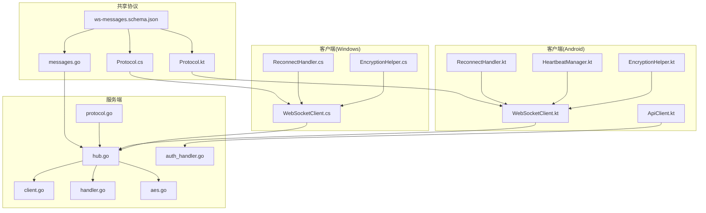
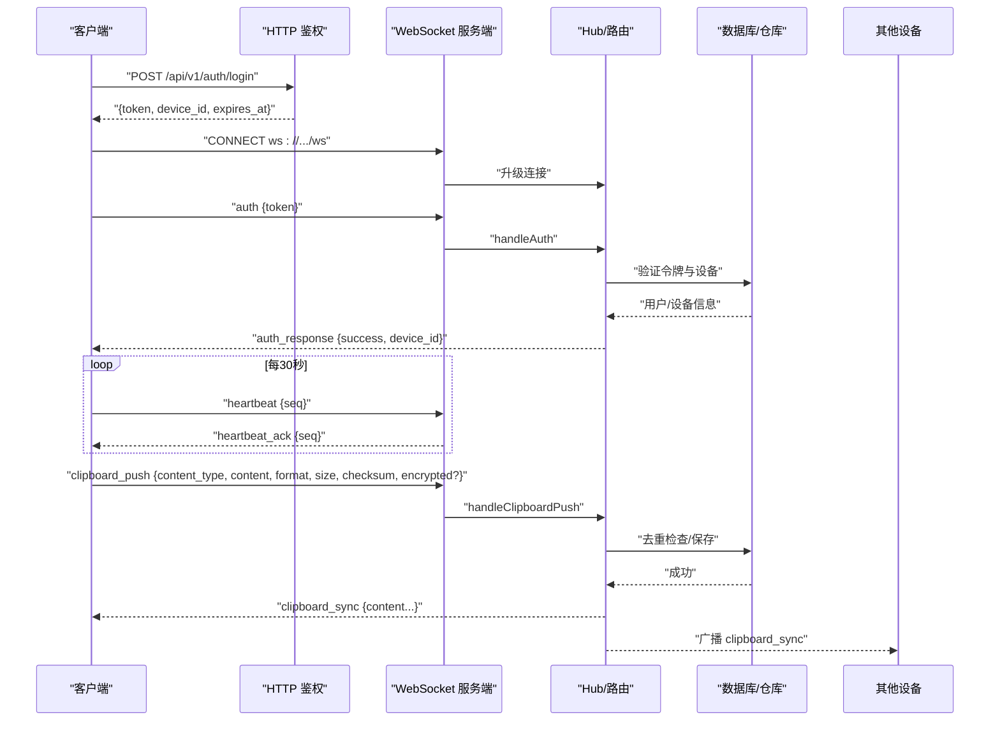
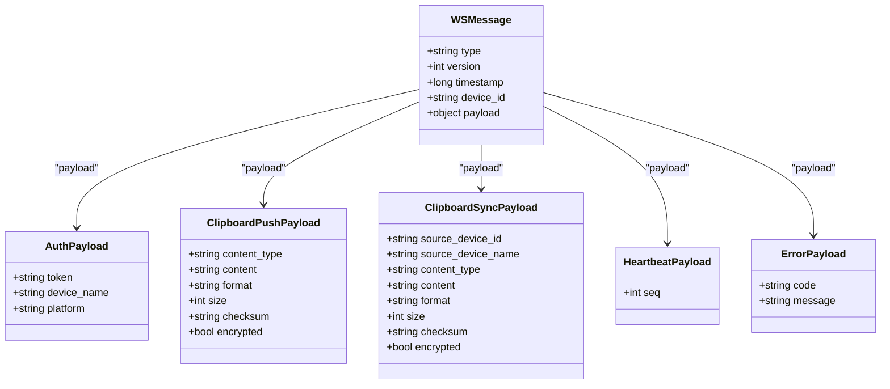
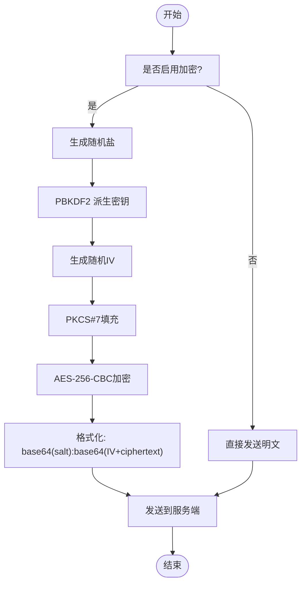
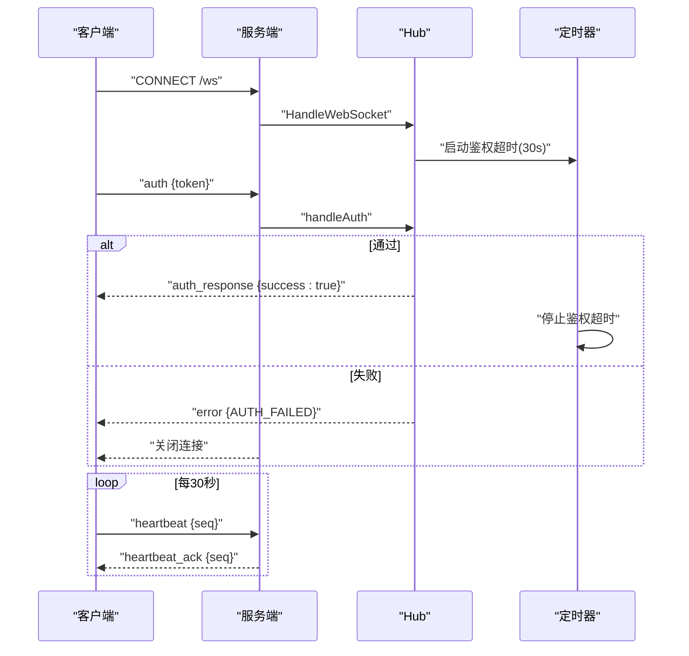
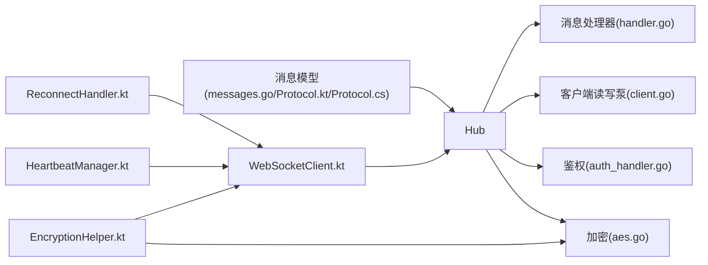

# 安全通信

<cite>
**本文引用的文件**
- [Protocol.kt](file://clipSync-android/app/src/main/java/com/clipsync/app/network/Protocol.kt)
- [messages.go](file://clipSync-server/pkg/protocol/messages.go)
- [protocol.go](file://clipSync-server/internal/websocket/protocol.go)
- [WebSocketClient.kt](file://clipSync-android/app/src/main/java/com/clipsync/app/network/WebSocketClient.kt)
- [client.go](file://clipSync-server/internal/websocket/client.go)
- [hub.go](file://clipSync-server/internal/websocket/hub.go)
- [handler.go](file://clipSync-server/internal/websocket/handler.go)
- [EncryptionHelper.kt](file://clipSync-android/app/core/EncryptionHelper.kt)
- [aes.go](file://clipSync-server/internal/encryption/aes.go)
- [Protocol.cs](file://clipSync-windows/ClipSync.WPF/Network/Protocol.cs)
- [ws-messages.schema.json](file://protocol/ws-messages.schema.json)
- [ApiClient.kt](file://clipSync-android/app/src/main/java/com/clipsync/app/network/ApiClient.kt)
- [auth_handler.go](file://clipSync-server/internal/httpserver/auth_handler.go)
- [HeartbeatManager.kt](file://clipSync-android/app/src/main/java/com/clipsync/app/network/HeartbeatManager.kt)
- [ReconnectHandler.kt](file://clipSync-android/app/src/main/java/com/clipsync/app/network/ReconnectHandler.kt)
- [ReconnectHandler.cs](file://clipSync-windows/ClipSync.WPF/Network/ReconnectHandler.cs)
</cite>

## 目录
1. [简介](#简介)
2. [项目结构](#项目结构)
3. [核心组件](#核心组件)
4. [架构总览](#架构总览)
5. [详细组件分析](#详细组件分析)
6. [依赖关系分析](#依赖关系分析)
7. [性能考量](#性能考量)
8. [故障排查指南](#故障排查指南)
9. [结论](#结论)
10. [附录](#附录)

## 简介
本文件系统性梳理 ClipSync 跨平台剪贴板同步项目中的“安全通信模块”，聚焦以下目标：
- WebSocket 消息协议：消息封装、类型、载荷、协议版本与时间戳
- 数据传输加密：端到端加密策略、密钥派生、加解密流程与完整性校验
- 消息完整性验证：校验和（Checksum）去重与错误处理
- 客户端与服务器安全通信流程：鉴权、心跳、自动重连、广播与回执
- 协议版本管理：版本字段、向后兼容与演进策略
- 接口与参数：HTTP API 与 WebSocket 消息的输入输出规范
- 与网络层的关系：HTTP 鉴权与 WebSocket 连接、升级与读写泵
- 常见安全问题与解决方案：弱密码、明文传输、重复内容、连接劫持等

本文件既面向初学者提供循序渐进的理解路径，也为有经验的开发者提供代码级参考与图示。

## 项目结构
安全通信涉及三层：
- 共享协议层：定义 WebSocket 消息结构与 HTTP API 合同
- 服务端实现层：WebSocket Hub、消息路由、鉴权与存储
- 客户端实现层：WebSocket 客户端、心跳、重连、HTTP 鉴权

图表来源
- [ws-messages.schema.json:1-261](file://protocol/ws-messages.schema.json#L1-L261)
- [messages.go:1-132](file://clipSync-server/pkg/protocol/messages.go#L1-L132)
- [Protocol.kt:1-263](file://clipSync-android/app/src/main/java/com/clipsync/app/network/Protocol.kt#L1-L263)
- [Protocol.cs:1-167](file://clipSync-windows/ClipSync.WPF/Network/Protocol.cs#L1-L167)
- [hub.go:1-230](file://clipSync-server/internal/websocket/hub.go#L1-L230)
- [client.go:1-150](file://clipSync-server/internal/websocket/client.go#L1-L150)
- [handler.go:1-392](file://clipSync-server/internal/websocket/handler.go#L1-L392)
- [auth_handler.go:1-215](file://clipSync-server/internal/httpserver/auth_handler.go#L1-L215)
- [protocol.go:1-27](file://clipSync-server/internal/websocket/protocol.go#L1-L27)
- [WebSocketClient.kt:1-156](file://clipSync-android/app/src/main/java/com/clipsync/app/network/WebSocketClient.kt#L1-L156)
- [HeartbeatManager.kt:1-76](file://clipSync-android/app/src/main/java/com/clipsync/app/network/HeartbeatManager.kt#L1-L76)
- [ReconnectHandler.kt:1-80](file://clipSync-android/app/src/main/java/com/clipsync/app/network/ReconnectHandler.kt#L1-L80)
- [ReconnectHandler.cs:1-97](file://clipSync-windows/ClipSync.WPF/Network/ReconnectHandler.cs#L1-L97)
- [ApiClient.kt:1-142](file://clipSync-android/app/src/main/java/com/clipsync/app/network/ApiClient.kt#L1-L142)
- [EncryptionHelper.kt:1-157](file://clipSync-android/app/core/EncryptionHelper.kt#L1-L157)
- [aes.go:1-135](file://clipSync-server/internal/encryption/aes.go#L1-L135)

章节来源
- [ws-messages.schema.json:1-261](file://protocol/ws-messages.schema.json#L1-L261)
- [messages.go:1-132](file://clipSync-server/pkg/protocol/messages.go#L1-L132)
- [Protocol.kt:1-263](file://clipSync-android/app/src/main/java/com/clipsync/app/network/Protocol.kt#L1-L263)
- [Protocol.cs:1-167](file://clipSync-windows/ClipSync.WPF/Network/Protocol.cs#L1-L167)
- [hub.go:1-230](file://clipSync-server/internal/websocket/hub.go#L1-L230)
- [client.go:1-150](file://clipSync-server/internal/websocket/client.go#L1-L150)
- [handler.go:1-392](file://clipSync-server/internal/websocket/handler.go#L1-L392)
- [auth_handler.go:1-215](file://clipSync-server/internal/httpserver/auth_handler.go#L1-L215)
- [protocol.go:1-27](file://clipSync-server/internal/websocket/protocol.go#L1-L27)
- [WebSocketClient.kt:1-156](file://clipSync-android/app/src/main/java/com/clipsync/app/network/WebSocketClient.kt#L1-L156)
- [HeartbeatManager.kt:1-76](file://clipSync-android/app/src/main/java/com/clipsync/app/network/HeartbeatManager.kt#L1-L76)
- [ReconnectHandler.kt:1-80](file://clipSync-android/app/src/main/java/com/clipsync/app/network/ReconnectHandler.kt#L1-L80)
- [ReconnectHandler.cs:1-97](file://clipSync-windows/ClipSync.WPF/Network/ReconnectHandler.cs#L1-L97)
- [ApiClient.kt:1-142](file://clipSync-android/app/src/main/java/com/clipsync/app/network/ApiClient.kt#L1-L142)
- [EncryptionHelper.kt:1-157](file://clipSync-android/app/core/EncryptionHelper.kt#L1-L157)
- [aes.go:1-135](file://clipSync-server/internal/encryption/aes.go#L1-L135)

## 核心组件
- WebSocket 消息模型与序列化
  - Android/Kotlin：使用 kotlinx.serialization 定义消息结构与序列化配置
  - Go：使用原生结构体与 JSON 编解码
  - Windows/C#：Newtonsoft.Json 序列化
- 加密与完整性
  - Android：AES-256-CBC + PBKDF2-SHA256，PKCS#7 填充；校验和用于去重
  - Go：AES-256-CBC + PBKDF2-SHA3，PKCS#7 填充；与 Android 格式兼容
- 会话与鉴权
  - HTTP 层：登录/注册/刷新令牌，Bearer 认证
  - WebSocket 层：鉴权消息携带令牌，30 秒内未鉴权断开
- 心跳与重连
  - 客户端每 30 秒发送心跳；服务端超时检测；指数退避自动重连
- 广播与历史
  - 服务端按用户广播剪贴板同步；支持拉取历史与设备列表

章节来源
- [Protocol.kt:1-263](file://clipSync-android/app/src/main/java/com/clipsync/app/network/Protocol.kt#L1-L263)
- [messages.go:1-132](file://clipSync-server/pkg/protocol/messages.go#L1-L132)
- [Protocol.cs:1-167](file://clipSync-windows/ClipSync.WPF/Network/Protocol.cs#L1-L167)
- [EncryptionHelper.kt:1-157](file://clipSync-android/app/core/EncryptionHelper.kt#L1-L157)
- [aes.go:1-135](file://clipSync-server/internal/encryption/aes.go#L1-L135)
- [ApiClient.kt:1-142](file://clipSync-android/app/src/main/java/com/clipsync/app/network/ApiClient.kt#L1-L142)
- [WebSocketClient.kt:1-156](file://clipSync-android/app/src/main/java/com/clipsync/app/network/WebSocketClient.kt#L1-L156)
- [HeartbeatManager.kt:1-76](file://clipSync-android/app/src/main/java/com/clipsync/app/network/HeartbeatManager.kt#L1-L76)
- [ReconnectHandler.kt:1-80](file://clipSync-android/app/src/main/java/com/clipsync/app/network/ReconnectHandler.kt#L1-L80)
- [ReconnectHandler.cs:1-97](file://clipSync-windows/ClipSync.WPF/Network/ReconnectHandler.cs#L1-L97)
- [hub.go:1-230](file://clipSync-server/internal/websocket/hub.go#L1-L230)
- [handler.go:1-392](file://clipSync-server/internal/websocket/handler.go#L1-L392)

## 架构总览
下图展示从 HTTP 鉴权到 WebSocket 连接、鉴权、心跳与剪贴板同步的完整流程。

图表来源
- [auth_handler.go:63-109](file://clipSync-server/internal/httpserver/auth_handler.go#L63-L109)
- [protocol.go:20-27](file://clipSync-server/internal/websocket/protocol.go#L20-L27)
- [handler.go:33-110](file://clipSync-server/internal/websocket/handler.go#L33-L110)
- [hub.go:181-208](file://clipSync-server/internal/websocket/hub.go#L181-L208)
- [client.go:33-67](file://clipSync-server/internal/websocket/client.go#L33-L67)
- [WebSocketClient.kt:83-103](file://clipSync-android/app/src/main/java/com/clipsync/app/network/WebSocketClient.kt#L83-L103)
- [HeartbeatManager.kt:27-44](file://clipSync-android/app/src/main/java/com/clipsync/app/network/HeartbeatManager.kt#L27-L44)

## 详细组件分析

### WebSocket 消息协议与版本管理
- 消息封装
  - 统一包络：type、version、timestamp、device_id、payload
  - 版本常量：Go 中为常量，Android/C# 中在构造函数或静态方法中设置默认值
- 消息类型
  - 认证：auth、auth_response
  - 心跳：heartbeat、heartbeat_ack
  - 剪贴板：clipboard_push、clipboard_sync、clipboard_pull、clipboard_history
  - 设备：device_list、device_list_response、device_unregister
  - 错误：error
  - 控制：ping、pong
- 协议版本
  - schema 固定版本 1；客户端/服务端均需严格校验
  - 不同平台的消息模型需与 schema 保持一致

图表来源
- [messages.go:5-132](file://clipSync-server/pkg/protocol/messages.go#L5-L132)
- [Protocol.kt:20-169](file://clipSync-android/app/src/main/java/com/clipsync/app/network/Protocol.kt#L20-L169)
- [ws-messages.schema.json:46-87](file://protocol/ws-messages.schema.json#L46-L87)

章节来源
- [messages.go:1-132](file://clipSync-server/pkg/protocol/messages.go#L1-L132)
- [Protocol.kt:1-263](file://clipSync-android/app/src/main/java/com/clipsync/app/network/Protocol.kt#L1-L263)
- [ws-messages.schema.json:1-261](file://protocol/ws-messages.schema.json#L1-L261)

### 数据传输加密与完整性校验
- 加密算法与参数
  - AES-256-CBC，PBKDF2 密钥派生（迭代次数、盐长度）
  - PKCS#7 填充
  - 输出格式：base64(salt):base64(IV + ciphertext)，跨平台兼容
- 完整性校验
  - 使用 SHA-256 计算内容校验和，用于去重与一致性检查
- 客户端行为
  - Android：可选启用加密；失败则拒绝发送，不回退为明文
  - Windows：同 Android 行为，失败抛出异常阻止发送
- 服务端行为
  - 存储前进行去重检查；广播时保留 encrypted 标志

图表来源
- [EncryptionHelper.kt:51-102](file://clipSync-android/app/core/EncryptionHelper.kt#L51-L102)
- [aes.go:25-106](file://clipSync-server/internal/encryption/aes.go#L25-L106)
- [Protocol.cs:109-141](file://clipSync-windows/ClipSync.WPF/Network/Protocol.cs#L109-L141)

章节来源
- [EncryptionHelper.kt:1-157](file://clipSync-android/app/core/EncryptionHelper.kt#L1-L157)
- [aes.go:1-135](file://clipSync-server/internal/encryption/aes.go#L1-L135)
- [Protocol.cs:1-167](file://clipSync-windows/ClipSync.WPF/Network/Protocol.cs#L1-L167)

### 客户端与服务器安全通信流程
- HTTP 鉴权
  - 登录/注册：用户名、密码、设备名、平台
  - 刷新：携带 Bearer Token
- WebSocket 连接
  - 升级：服务端 Upgrader 支持读写缓冲与跨域策略
  - 鉴权：auth 消息携带 token；30 秒内未鉴权断开
  - 心跳：客户端 30 秒发送一次 heartbeat；服务端返回 heartbeat_ack
  - 错误：统一 error 类型返回错误码与描述
- 自动重连
  - 指数退避（最小 1s，最大 60s）
  - 断线触发，认证成功后清零重试计数

图表来源
- [protocol.go:9-18](file://clipSync-server/internal/websocket/protocol.go#L9-L18)
- [hub.go:181-208](file://clipSync-server/internal/websocket/hub.go#L181-L208)
- [handler.go:33-110](file://clipSync-server/internal/websocket/handler.go#L33-L110)
- [WebSocketClient.kt:83-103](file://clipSync-android/app/src/main/java/com/clipsync/app/network/WebSocketClient.kt#L83-L103)
- [HeartbeatManager.kt:27-44](file://clipSync-android/app/src/main/java/com/clipsync/app/network/HeartbeatManager.kt#L27-L44)

章节来源
- [protocol.go:1-27](file://clipSync-server/internal/websocket/protocol.go#L1-L27)
- [hub.go:1-230](file://clipSync-server/internal/websocket/hub.go#L1-L230)
- [handler.go:1-392](file://clipSync-server/internal/websocket/handler.go#L1-L392)
- [WebSocketClient.kt:1-156](file://clipSync-android/app/src/main/java/com/clipsync/app/network/WebSocketClient.kt#L1-L156)
- [HeartbeatManager.kt:1-76](file://clipSync-android/app/src/main/java/com/clipsync/app/network/HeartbeatManager.kt#L1-L76)

### 消息格式规范与接口定义
- HTTP API（Android 客户端）
  - 登录：POST /api/v1/auth/login
  - 注册：POST /api/v1/auth/register
  - 刷新：POST /api/v1/auth/refresh（Authorization: Bearer）
  - 获取设备：GET /api/v1/devices（Authorization: Bearer）
  - 注销设备：DELETE /api/v1/devices/{device_id}（Authorization: Bearer）
  - 健康检查：GET /api/v1/health
- WebSocket 消息（Android/Kotlin/Windows/C#）
  - auth/auth_response：鉴权
  - heartbeat/heartbeat_ack：心跳
  - clipboard_push：推送剪贴板内容（含 content_type、content、format、size、checksum、encrypted 可选）
  - clipboard_sync：广播同步（含 source_device_id/name）
  - clipboard_pull/clipboard_history：历史查询
  - device_list/device_list_response：设备列表
  - error：错误通知
  - ping/pong：连接探测

章节来源
- [ApiClient.kt:23-71](file://clipSync-android/app/src/main/java/com/clipsync/app/network/ApiClient.kt#L23-L71)
- [auth_handler.go:63-175](file://clipSync-server/internal/httpserver/auth_handler.go#L63-L175)
- [Protocol.kt:56-169](file://clipSync-android/app/src/main/java/com/clipsync/app/network/Protocol.kt#L56-L169)
- [Protocol.cs:79-164](file://clipSync-windows/ClipSync.WPF/Network/Protocol.cs#L79-L164)
- [ws-messages.schema.json:46-258](file://protocol/ws-messages.schema.json#L46-L258)

### 与网络层的关系
- HTTP 层负责身份认证与设备管理，确保后续 WebSocket 会话可信
- WebSocket 层负责实时双向通信，承载剪贴板同步与控制消息
- 服务端通过 Hub 管理连接、路由消息、执行业务逻辑
- 客户端通过 OkHttp（Android）或 .NET WebSocket（Windows）实现稳定连接与事件回调

章节来源
- [ApiClient.kt:1-142](file://clipSync-android/app/src/main/java/com/clipsync/app/network/ApiClient.kt#L1-L142)
- [WebSocketClient.kt:1-156](file://clipSync-android/app/src/main/java/com/clipsync/app/network/WebSocketClient.kt#L1-L156)
- [hub.go:1-230](file://clipSync-server/internal/websocket/hub.go#L1-L230)

## 依赖关系分析
- 协议一致性
  - Android/Kotlin 与 Go 的消息结构保持一致，Windows/C# 也遵循相同 JSON 字段
- 服务端耦合
  - Hub 依赖 auth、database、protocol 包；client 负责读写泵与超时；handler 路由消息
- 客户端耦合
  - WebSocketClient 依赖 OkHttp；HeartbeatManager 与 ReconnectHandler 分别负责心跳与重连
- 加密依赖
  - 客户端与服务端采用相同的密钥派生与格式约定，保证互操作性

图表来源
- [messages.go:1-132](file://clipSync-server/pkg/protocol/messages.go#L1-L132)
- [Protocol.kt:1-263](file://clipSync-android/app/src/main/java/com/clipsync/app/network/Protocol.kt#L1-L263)
- [Protocol.cs:1-167](file://clipSync-windows/ClipSync.WPF/Network/Protocol.cs#L1-L167)
- [hub.go:1-230](file://clipSync-server/internal/websocket/hub.go#L1-L230)
- [handler.go:1-392](file://clipSync-server/internal/websocket/handler.go#L1-L392)
- [client.go:1-150](file://clipSync-server/internal/websocket/client.go#L1-L150)
- [auth_handler.go:1-215](file://clipSync-server/internal/httpserver/auth_handler.go#L1-L215)
- [aes.go:1-135](file://clipSync-server/internal/encryption/aes.go#L1-L135)
- [WebSocketClient.kt:1-156](file://clipSync-android/app/src/main/java/com/clipsync/app/network/WebSocketClient.kt#L1-L156)
- [ReconnectHandler.kt:1-80](file://clipSync-android/app/src/main/java/com/clipsync/app/network/ReconnectHandler.kt#L1-L80)
- [HeartbeatManager.kt:1-76](file://clipSync-android/app/src/main/java/com/clipsync/app/network/HeartbeatManager.kt#L1-L76)
- [EncryptionHelper.kt:1-157](file://clipSync-android/app/core/EncryptionHelper.kt#L1-L157)

章节来源
- [hub.go:1-230](file://clipSync-server/internal/websocket/hub.go#L1-L230)
- [handler.go:1-392](file://clipSync-server/internal/websocket/handler.go#L1-L392)
- [client.go:1-150](file://clipSync-server/internal/websocket/client.go#L1-L150)
- [auth_handler.go:1-215](file://clipSync-server/internal/httpserver/auth_handler.go#L1-L215)
- [aes.go:1-135](file://clipSync-server/internal/encryption/aes.go#L1-L135)
- [WebSocketClient.kt:1-156](file://clipSync-android/app/src/main/java/com/clipsync/app/network/WebSocketClient.kt#L1-L156)
- [ReconnectHandler.kt:1-80](file://clipSync-android/app/src/main/java/com/clipsync/app/network/ReconnectHandler.kt#L1-L80)
- [HeartbeatManager.kt:1-76](file://clipSync-android/app/src/main/java/com/clipsync/app/network/HeartbeatManager.kt#L1-L76)
- [EncryptionHelper.kt:1-157](file://clipSync-android/app/core/EncryptionHelper.kt#L1-L157)

## 性能考量
- 连接与读写
  - 服务端 Upgrader 设置合理的读写缓冲区大小，避免内存压力
  - 客户端使用协程与共享流处理消息，降低阻塞
- 心跳与超时
  - 30 秒心跳间隔平衡保活与带宽；服务端读超时与 pong 处理防止僵尸连接
- 去重与历史
  - 基于校验和的去重减少重复广播；历史限制避免无限增长
- 加密成本
  - 对大文本/图片建议启用加密；注意 CPU 开销与延迟

## 故障排查指南
- 常见错误与定位
  - AUTH_FAILED/TOKEN_EXPIRED：检查 HTTP 鉴权与 Bearer Token 生命周期
  - INVALID_PAYLOAD：检查消息类型、必需字段与 schema 一致性
  - RATE_LIMITED/CONTENT_TOO_LARGE：检查请求频率与内容大小
  - DEVICE_NOT_FOUND/INTERNAL_ERROR：检查设备存在性与服务端日志
- 心跳与断线
  - 若长时间无响应，确认客户端心跳是否正常发送，服务端是否正确更新 LastSeen
  - 指数退避重连是否生效，URL 是否正确
- 加密问题
  - Android/C# 加密失败应拒绝发送，避免明文回退
  - 校验和不匹配导致 DUPLICATE_CONTENT，需检查客户端计算逻辑

章节来源
- [handler.go:142-234](file://clipSync-server/internal/websocket/handler.go#L142-L234)
- [client.go:33-67](file://clipSync-server/internal/websocket/client.go#L33-L67)
- [hub.go:181-208](file://clipSync-server/internal/websocket/hub.go#L181-L208)
- [ReconnectHandler.kt:37-53](file://clipSync-android/app/src/main/java/com/clipsync/app/network/ReconnectHandler.kt#L37-L53)
- [ReconnectHandler.cs:33-71](file://clipSync-windows/ClipSync.WPF/Network/ReconnectHandler.cs#L33-L71)
- [EncryptionHelper.kt:48-50](file://clipSync-android/app/core/EncryptionHelper.kt#L48-L50)

## 结论
本安全通信模块以“共享协议 + 强鉴权 + 心跳与重连 + 加密与完整性校验”为核心设计，实现了跨平台、可扩展且安全的实时通信能力。通过严格的版本控制、去重机制与错误处理，系统在复杂网络环境下仍能保持稳定与一致。建议在生产环境中进一步强化 TLS、访问控制与审计日志，持续提升整体安全性。

## 附录
- 协议版本演进建议
  - 保持向后兼容：新增字段需可选，旧客户端忽略未知字段
  - 版本协商：可在握手阶段引入版本协商，避免强制升级
- 安全加固建议
  - 强制使用 WSS（WebSocket Secure），避免明文传输
  - 引入速率限制与连接配额，抵御滥用
  - 对敏感操作（注销设备、删除账户）增加二次确认与审计