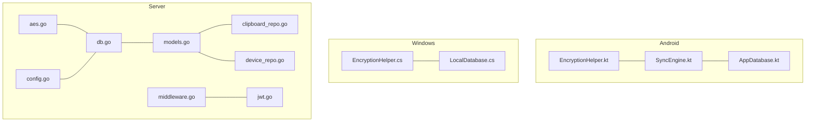
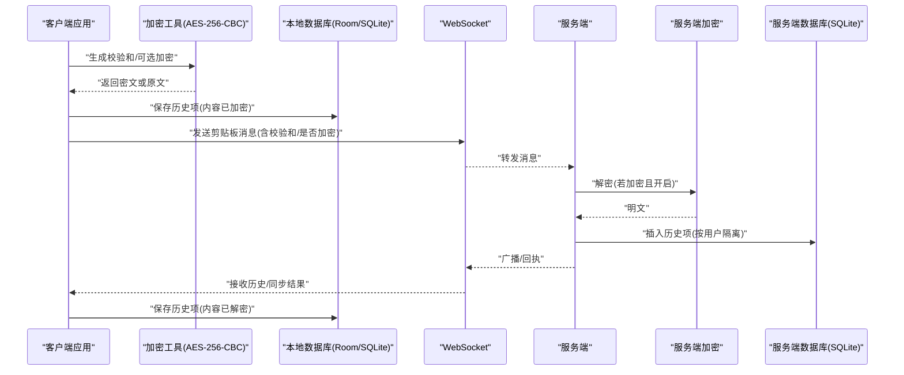
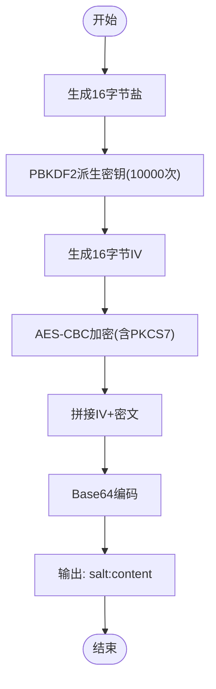
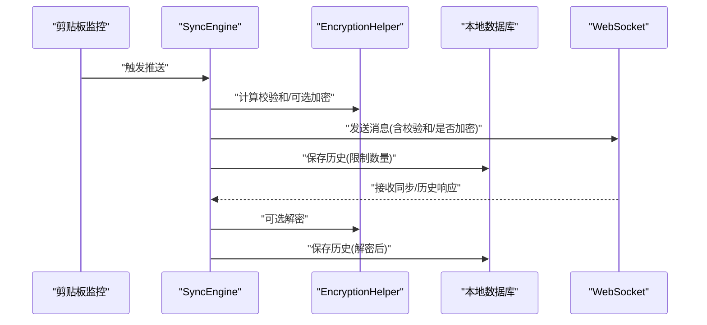
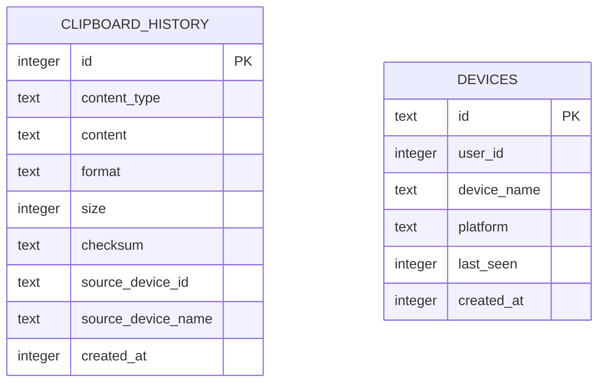
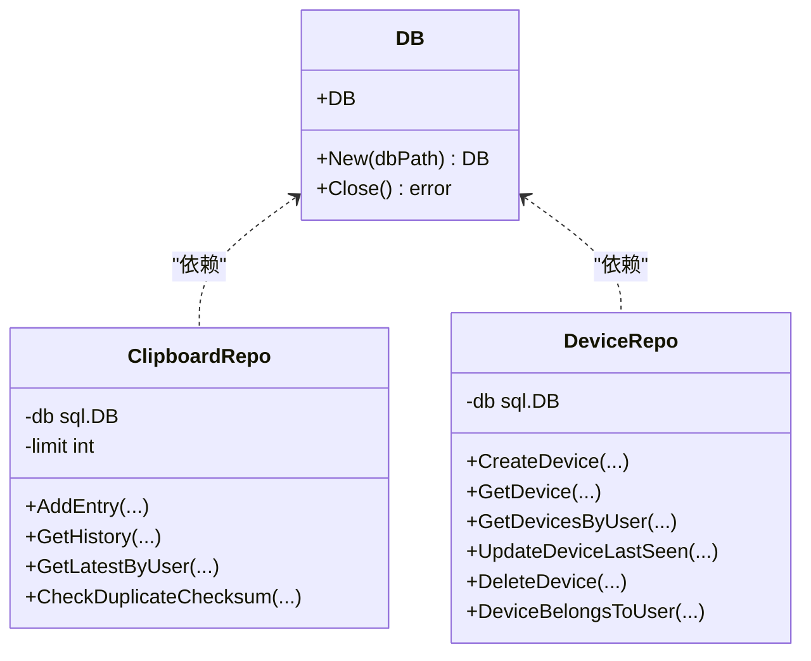
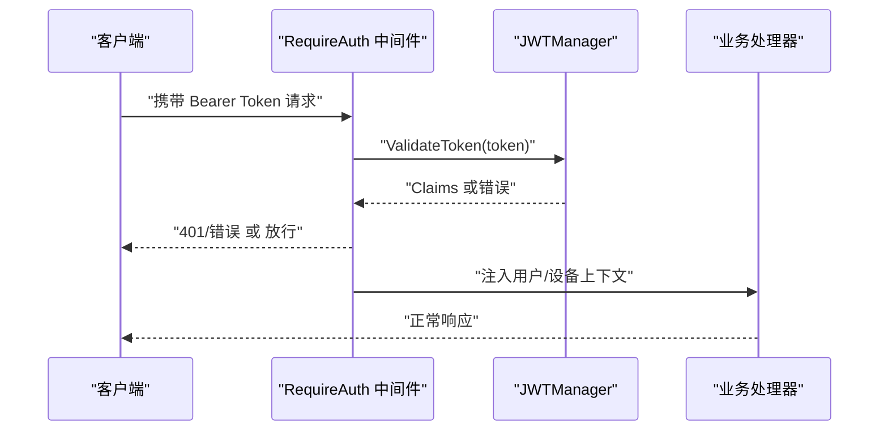
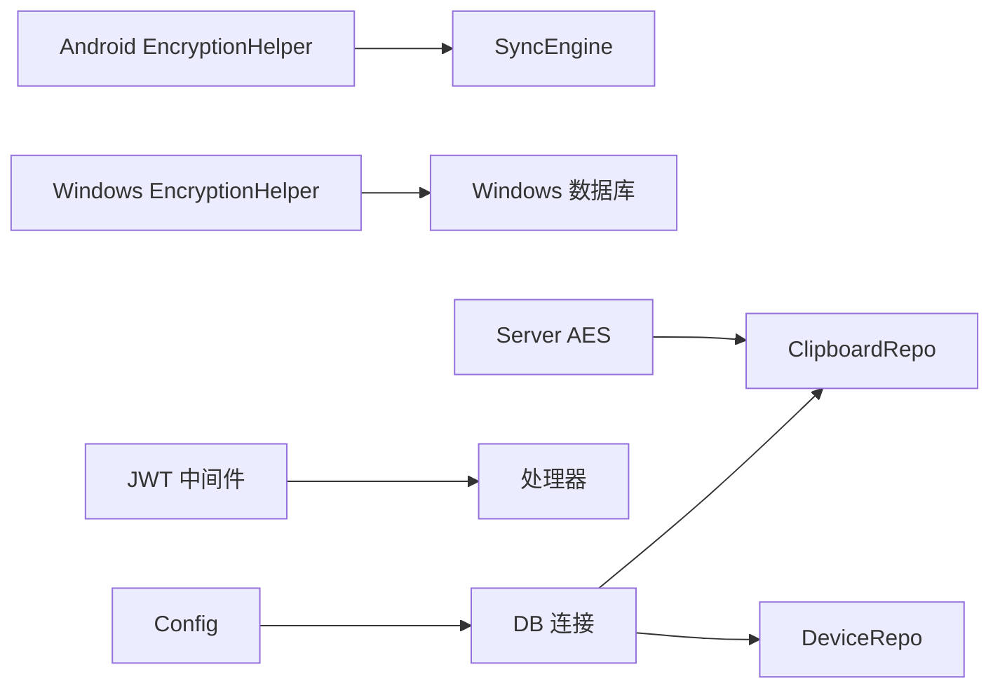

# 数据保护

<cite>
**本文引用的文件**
- [EncryptionHelper.kt](file://clipSync-android/app/src/main/java/com/clipsync/app/core/EncryptionHelper.kt)
- [EncryptionHelper.cs](file://clipSync-windows/ClipSync.WPF/Core/EncryptionHelper.cs)
- [aes.go](file://clipSync-server/internal/encryption/aes.go)
- [AppDatabase.kt](file://clipSync-android/app/src/main/java/com/clipsync/app/data/AppDatabase.kt)
- [LocalDatabase.cs](file://clipSync-windows/ClipSync.WPF/Storage/LocalDatabase.cs)
- [db.go](file://clipSync-server/internal/database/db.go)
- [models.go](file://clipSync-server/internal/database/models.go)
- [clipboard_repo.go](file://clipSync-server/internal/database/clipboard_repo.go)
- [device_repo.go](file://clipSync-server/internal/database/device_repo.go)
- [SyncEngine.kt](file://clipSync-android/app/src/main/java/com/clipsync/app/core/SyncEngine.kt)
- [middleware.go](file://clipSync-server/internal/auth/middleware.go)
- [jwt.go](file://clipSync-server/internal/auth/jwt.go)
- [config.go](file://clipSync-server/internal/config/config.go)
</cite>

## 目录
1. [简介](#简介)
2. [项目结构](#项目结构)
3. [核心组件](#核心组件)
4. [架构总览](#架构总览)
5. [详细组件分析](#详细组件分析)
6. [依赖分析](#依赖分析)
7. [性能考虑](#性能考虑)
8. [故障排查指南](#故障排查指南)
9. [结论](#结论)
10. [附录](#附录)

## 简介
本文件聚焦于数据保护模块，系统性阐述以下主题：
- 数据库加密存储：统一的端到端加密方案（AES-256-CBC + PBKDF2），确保本地与服务器端一致的加解密格式。
- 敏感数据脱敏：通过校验和去重与最小化可见性策略，避免重复同步与泄露。
- 数据访问控制：基于 JWT 的认证中间件，严格限制资源访问范围。
- 本地存储加密：Windows 客户端使用 SQLite 存储历史；Android 使用 Room；均以明文存储经加密后的数据字段。
- 云端数据保护：服务端接收加密内容，按用户隔离存储，配合鉴权与历史上限策略。
- 数据生命周期管理：历史项上限、索引优化、定期清理。

本文件面向初学者与资深开发者，既提供概念性说明，也给出代码级定位与图示。

## 项目结构
数据保护相关代码分布于三端与服务端：
- Android 端：加密工具、同步引擎、Room 数据库。
- Windows 端：加密工具、SQLite 本地数据库。
- 服务端：加密工具、数据库连接与模型、仓库层、鉴权中间件与配置。

图表来源
- [EncryptionHelper.kt:1-157](file://clipSync-android/app/src/main/java/com/clipsync/app/core/EncryptionHelper.kt#L1-L157)
- [SyncEngine.kt:1-250](file://clipSync-android/app/src/main/java/com/clipsync/app/core/SyncEngine.kt#L1-L250)
- [AppDatabase.kt:1-41](file://clipSync-android/app/src/main/java/com/clipsync/app/data/AppDatabase.kt#L1-L41)
- [EncryptionHelper.cs:1-134](file://clipSync-windows/ClipSync.WPF/Core/EncryptionHelper.cs#L1-L134)
- [LocalDatabase.cs:1-169](file://clipSync-windows/ClipSync.WPF/Storage/LocalDatabase.cs#L1-L169)
- [aes.go:1-135](file://clipSync-server/internal/encryption/aes.go#L1-L135)
- [db.go:1-62](file://clipSync-server/internal/database/db.go#L1-L62)
- [models.go:1-46](file://clipSync-server/internal/database/models.go#L1-L46)
- [clipboard_repo.go:1-140](file://clipSync-server/internal/database/clipboard_repo.go#L1-L140)
- [device_repo.go:1-126](file://clipSync-server/internal/database/device_repo.go#L1-L126)
- [middleware.go:1-111](file://clipSync-server/internal/auth/middleware.go#L1-L111)
- [jwt.go:1-76](file://clipSync-server/internal/auth/jwt.go#L1-L76)
- [config.go:1-72](file://clipSync-server/internal/config/config.go#L1-L72)

章节来源
- [EncryptionHelper.kt:1-157](file://clipSync-android/app/src/main/java/com/clipsync/app/core/EncryptionHelper.kt#L1-L157)
- [EncryptionHelper.cs:1-134](file://clipSync-windows/ClipSync.WPF/Core/EncryptionHelper.cs#L1-L134)
- [aes.go:1-135](file://clipSync-server/internal/encryption/aes.go#L1-L135)
- [SyncEngine.kt:1-250](file://clipSync-android/app/src/main/java/com/clipsync/app/core/SyncEngine.kt#L1-L250)
- [AppDatabase.kt:1-41](file://clipSync-android/app/src/main/java/com/clipsync/app/data/AppDatabase.kt#L1-L41)
- [LocalDatabase.cs:1-169](file://clipSync-windows/ClipSync.WPF/Storage/LocalDatabase.cs#L1-L169)
- [db.go:1-62](file://clipSync-server/internal/database/db.go#L1-L62)
- [models.go:1-46](file://clipSync-server/internal/database/models.go#L1-L46)
- [clipboard_repo.go:1-140](file://clipSync-server/internal/database/clipboard_repo.go#L1-L140)
- [device_repo.go:1-126](file://clipSync-server/internal/database/device_repo.go#L1-L126)
- [middleware.go:1-111](file://clipSync-server/internal/auth/middleware.go#L1-L111)
- [jwt.go:1-76](file://clipSync-server/internal/auth/jwt.go#L1-L76)
- [config.go:1-72](file://clipSync-server/internal/config/config.go#L1-L72)

## 核心组件
- 加密工具（跨平台统一格式）
  - Android：AES-256-CBC + PBKDF2（迭代 10000 次，盐 16 字节，IV 16 字节，PKCS5Padding）。
  - Windows：AES-256-CBC + PBKDF2（迭代 10000 次，盐 16 字节，IV 16 字节，PKCS7）。
  - 服务端：AES-256-CBC + PBKDF2（PBKDF2-HMAC-SHA3-256，迭代 10000 次）。
  - 统一输出格式：base64(salt):base64(IV + ciphertext)，便于跨端传输与兼容。
- 同步引擎（去重与本地持久化）
  - 基于内容校验和进行去重，避免重复推送。
  - 支持可选加密开关：当启用时，推送前加密，接收后解密。
  - 将历史项写入本地数据库，并限制保留数量。
- 数据库层
  - Android：Room 数据库，包含剪贴板历史与设备表。
  - Windows：SQLite 数据库，包含剪贴板历史表与索引。
  - 服务端：SQLite 连接池与 WAL 模式，启用外键约束与缓存优化。
- 访问控制
  - JWT 中间件：校验 Bearer Token，注入用户与设备上下文。
  - 配置校验：默认密钥与过期时间提示生产风险。

章节来源
- [EncryptionHelper.kt:13-157](file://clipSync-android/app/src/main/java/com/clipsync/app/core/EncryptionHelper.kt#L13-L157)
- [EncryptionHelper.cs:8-134](file://clipSync-windows/ClipSync.WPF/Core/EncryptionHelper.cs#L8-L134)
- [aes.go:16-106](file://clipSync-server/internal/encryption/aes.go#L16-L106)
- [SyncEngine.kt:69-160](file://clipSync-android/app/src/main/java/com/clipsync/app/core/SyncEngine.kt#L69-L160)
- [AppDatabase.kt:14-40](file://clipSync-android/app/src/main/java/com/clipsync/app/data/AppDatabase.kt#L14-L40)
- [LocalDatabase.cs:26-137](file://clipSync-windows/ClipSync.WPF/Storage/LocalDatabase.cs#L26-L137)
- [db.go:17-56](file://clipSync-server/internal/database/db.go#L17-L56)
- [middleware.go:32-61](file://clipSync-server/internal/auth/middleware.go#L32-L61)
- [jwt.go:32-75](file://clipSync-server/internal/auth/jwt.go#L32-L75)
- [config.go:57-71](file://clipSync-server/internal/config/config.go#L57-L71)

## 架构总览
下图展示从客户端到服务端的数据流，以及各端的加密与存储位置。

图表来源
- [SyncEngine.kt:69-160](file://clipSync-android/app/src/main/java/com/clipsync/app/core/SyncEngine.kt#L69-L160)
- [EncryptionHelper.kt:51-102](file://clipSync-android/app/src/main/java/com/clipsync/app/core/EncryptionHelper.kt#L51-L102)
- [EncryptionHelper.cs:30-103](file://clipSync-windows/ClipSync.WPF/Core/EncryptionHelper.cs#L30-L103)
- [aes.go:25-106](file://clipSync-server/internal/encryption/aes.go#L25-L106)
- [clipboard_repo.go:20-64](file://clipSync-server/internal/database/clipboard_repo.go#L20-L64)

## 详细组件分析

### 加密组件（Android/Windows/Server）
- 统一格式与参数
  - 输出格式：base64(salt):base64(IV + ciphertext)
  - 密钥派生：PBKDF2（Android/Windows 使用 SHA-256，服务端使用 SHA3-256）
  - 迭代次数：10000
  - 盐长度：16 字节
  - IV 长度：16 字节
  - 填充：Android/Windows 使用 PKCS5/7，服务端自实现 PKCS7
- 关键流程
  - 加密：随机盐 + 随机 IV + CBC 加密 + PKCS7 填充 + Base64 编码
  - 解密：解析盐与组合密文，派生密钥，分离 IV 与密文，CBC 解密，去填充
- 错误处理
  - Android/Windows：异常抛出，调用方需捕获
  - 服务端：返回错误包装，便于 HTTP 层处理

图表来源
- [EncryptionHelper.kt:51-65](file://clipSync-android/app/src/main/java/com/clipsync/app/core/EncryptionHelper.kt#L51-L65)
- [EncryptionHelper.cs:30-55](file://clipSync-windows/ClipSync.WPF/Core/EncryptionHelper.cs#L30-L55)
- [aes.go:25-58](file://clipSync-server/internal/encryption/aes.go#L25-L58)

章节来源
- [EncryptionHelper.kt:13-157](file://clipSync-android/app/src/main/java/com/clipsync/app/core/EncryptionHelper.kt#L13-L157)
- [EncryptionHelper.cs:8-134](file://clipSync-windows/ClipSync.WPF/Core/EncryptionHelper.cs#L8-L134)
- [aes.go:16-135](file://clipSync-server/internal/encryption/aes.go#L16-L135)

### 同步引擎（去重与本地持久化）
- 功能要点
  - 推送：计算校验和，跳过与上次相同的内容；根据设置决定是否加密；发送消息并保存本地历史。
  - 接收：过滤自身设备来源；根据是否加密与设置决定解密；写入本地历史。
  - 历史：限制本地保留数量，避免无限增长。
- 参数与行为
  - 输入：剪贴板文本、是否加密、设备标识、消息负载。
  - 输出：成功/失败状态、日志记录、本地数据库更新。

图表来源
- [SyncEngine.kt:69-160](file://clipSync-android/app/src/main/java/com/clipsync/app/core/SyncEngine.kt#L69-L160)
- [EncryptionHelper.kt:51-102](file://clipSync-android/app/src/main/java/com/clipsync/app/core/EncryptionHelper.kt#L51-L102)

章节来源
- [SyncEngine.kt:69-234](file://clipSync-android/app/src/main/java/com/clipsync/app/core/SyncEngine.kt#L69-L234)

### 本地数据库（Android/Windows）
- Android（Room）
  - 数据库类定义、DAO 访问器、单例构建。
  - 表：剪贴板历史、设备表。
- Windows（SQLite）
  - 初始化表与索引，插入、查询、清理历史。
  - 限制保留最近 50 条记录。

图表来源
- [AppDatabase.kt:14-23](file://clipSync-android/app/src/main/java/com/clipsync/app/data/AppDatabase.kt#L14-L23)
- [LocalDatabase.cs:36-57](file://clipSync-windows/ClipSync.WPF/Storage/LocalDatabase.cs#L36-L57)
- [models.go:21-33](file://clipSync-server/internal/database/models.go#L21-L33)

章节来源
- [AppDatabase.kt:14-40](file://clipSync-android/app/src/main/java/com/clipsync/app/data/AppDatabase.kt#L14-L40)
- [LocalDatabase.cs:26-137](file://clipSync-windows/ClipSync.WPF/Storage/LocalDatabase.cs#L26-L137)
- [models.go:3-46](file://clipSync-server/internal/database/models.go#L3-L46)

### 服务端数据库与仓库
- 连接与优化
  - SQLite 连接池、WAL 模式、同步级别、缓存大小、临时存储内存。
- 仓库职责
  - 剪贴板：插入、查询历史、去重检查、历史上限维护。
  - 设备：注册、查询、归属校验、最后在线时间更新、删除。
- 数据模型
  - 用户、设备、剪贴板条目、上传文件。

图表来源
- [db.go:12-62](file://clipSync-server/internal/database/db.go#L12-L62)
- [clipboard_repo.go:9-140](file://clipSync-server/internal/database/clipboard_repo.go#L9-L140)
- [device_repo.go:11-126](file://clipSync-server/internal/database/device_repo.go#L11-L126)

章节来源
- [db.go:17-56](file://clipSync-server/internal/database/db.go#L17-L56)
- [clipboard_repo.go:20-140](file://clipSync-server/internal/database/clipboard_repo.go#L20-L140)
- [device_repo.go:21-126](file://clipSync-server/internal/database/device_repo.go#L21-L126)
- [models.go:3-46](file://clipSync-server/internal/database/models.go#L3-L46)

### 访问控制（JWT 中间件）
- 要求 Authorization 头为 Bearer Token，校验签名与有效期。
- 将用户 ID、用户名、设备 ID 注入请求上下文，供后续处理器使用。
- 提供提取函数从上下文中读取。

图表来源
- [middleware.go:32-61](file://clipSync-server/internal/auth/middleware.go#L32-L61)
- [jwt.go:57-75](file://clipSync-server/internal/auth/jwt.go#L57-L75)

章节来源
- [middleware.go:32-111](file://clipSync-server/internal/auth/middleware.go#L32-L111)
- [jwt.go:18-76](file://clipSync-server/internal/auth/jwt.go#L18-L76)

### 配置与安全建议
- 默认配置包含不安全默认值（如 JWT 密钥、较长过期时间），生产环境必须覆盖。
- 建议：强制变更密钥、缩短过期时间、启用 HTTPS、最小权限原则。

章节来源
- [config.go:23-71](file://clipSync-server/internal/config/config.go#L23-L71)

## 依赖分析
- 平台一致性
  - 三端采用相同的加密格式与参数，保证跨端互操作。
- 组件耦合
  - Android 同步引擎依赖加密工具与数据库；Windows 同步逻辑由 UI/服务层驱动，加密工具独立。
  - 服务端仓库依赖数据库连接与模型；中间件依赖 JWT 管理器；配置影响运行参数。
- 循环依赖
  - 当前未发现循环导入；模块边界清晰。

图表来源
- [EncryptionHelper.kt:51-102](file://clipSync-android/app/src/main/java/com/clipsync/app/core/EncryptionHelper.kt#L51-L102)
- [EncryptionHelper.cs:30-103](file://clipSync-windows/ClipSync.WPF/Core/EncryptionHelper.cs#L30-L103)
- [aes.go:25-106](file://clipSync-server/internal/encryption/aes.go#L25-L106)
- [clipboard_repo.go:20-64](file://clipSync-server/internal/database/clipboard_repo.go#L20-L64)
- [middleware.go:32-61](file://clipSync-server/internal/auth/middleware.go#L32-L61)
- [config.go:38-55](file://clipSync-server/internal/config/config.go#L38-L55)
- [db.go:17-56](file://clipSync-server/internal/database/db.go#L17-L56)

## 性能考虑
- 加密成本
  - PBKDF2 迭代 10000 次在移动端可接受，但应避免在主线程执行；当前在 IO 协程中异步处理。
- 数据库存取
  - Android 使用 Room，支持异步 DAO；Windows 使用 SQLite，注意参数化查询与索引（按创建时间倒序）。
  - 服务端 WAL 模式提升并发读取性能，连接池与缓存参数针对小规模部署优化。
- 历史上限
  - 服务端与两端均限制历史数量，防止无限增长导致查询与存储压力。

章节来源
- [SyncEngine.kt:33-49](file://clipSync-android/app/src/main/java/com/clipsync/app/core/SyncEngine.kt#L33-L49)
- [LocalDatabase.cs:85-95](file://clipSync-windows/ClipSync.WPF/Storage/LocalDatabase.cs#L85-L95)
- [clipboard_repo.go:39-50](file://clipSync-server/internal/database/clipboard_repo.go#L39-L50)
- [db.go:29-50](file://clipSync-server/internal/database/db.go#L29-L50)

## 故障排查指南
- 加密/解密失败
  - 现象：返回空或抛出异常。
  - 排查：确认格式为“base64(salt):base64(IV+ciphertext)”；核对密码与盐长度；检查 Base64 编解码。
  - 参考路径：[EncryptionHelper.kt:72-102](file://clipSync-android/app/src/main/java/com/clipsync/app/core/EncryptionHelper.kt#L72-L102)、[EncryptionHelper.cs:62-103](file://clipSync-windows/ClipSync.WPF/Core/EncryptionHelper.cs#L62-L103)、[aes.go:62-106](file://clipSync-server/internal/encryption/aes.go#L62-L106)
- 重复推送被跳过
  - 现象：短时间内重复内容未上行。
  - 排查：确认校验和计算与去重逻辑；必要时重置去重状态。
  - 参考路径：[SyncEngine.kt:85-92](file://clipSync-android/app/src/main/java/com/clipsync/app/core/SyncEngine.kt#L85-L92)
- 无法连接或推送失败
  - 现象：未连接时跳过推送。
  - 排查：检查 WebSocket 连接状态；确认同步开关。
  - 参考路径：[SyncEngine.kt:79-83](file://clipSync-android/app/src/main/java/com/clipsync/app/core/SyncEngine.kt#L79-L83)
- 本地历史未更新
  - 现象：接收同步后未落库。
  - 排查：确认保存逻辑与 DAO 调用；检查设备来源过滤。
  - 参考路径：[SyncEngine.kt:157-159](file://clipSync-android/app/src/main/java/com/clipsync/app/core/SyncEngine.kt#L157-L159)、[LocalDatabase.cs:60-96](file://clipSync-windows/ClipSync.WPF/Storage/LocalDatabase.cs#L60-L96)
- 服务端鉴权失败
  - 现象：401 未授权。
  - 排查：确认 Authorization 头格式、Token 是否过期、密钥是否匹配。
  - 参考路径：[middleware.go:32-61](file://clipSync-server/internal/auth/middleware.go#L32-L61)、[jwt.go:57-75](file://clipSync-server/internal/auth/jwt.go#L57-L75)
- 历史过多或查询慢
  - 现象：查询变慢或空间占用大。
  - 排查：确认历史上限与索引；检查服务端与两端的清理策略。
  - 参考路径：[clipboard_repo.go:39-50](file://clipSync-server/internal/database/clipboard_repo.go#L39-L50)、[LocalDatabase.cs:85-95](file://clipSync-windows/ClipSync.WPF/Storage/LocalDatabase.cs#L85-L95)

## 结论
本项目在三端实现了统一的端到端加密方案，并通过校验和去重、历史上限与索引优化保障了性能与隐私。服务端通过 JWT 鉴权与 SQLite 连接池优化，提供了基础的安全与可用性。建议在生产环境中替换默认密钥、缩短令牌过期时间，并持续监控与审计访问日志。

## 附录
- 数据模型与字段说明（服务端）
  - 用户：ID、用户名、密码（bcrypt）、创建时间。
  - 设备：ID、用户ID、设备名、平台、最后在线、创建时间。
  - 剪贴板条目：ID、用户ID、内容类型、内容、格式、大小、校验和、来源设备ID/名称、创建时间。
  - 上传文件：ID、用户ID、文件名、MIME 类型、大小、校验和、文件路径、创建时间。

章节来源
- [models.go:3-46](file://clipSync-server/internal/database/models.go#L3-L46)