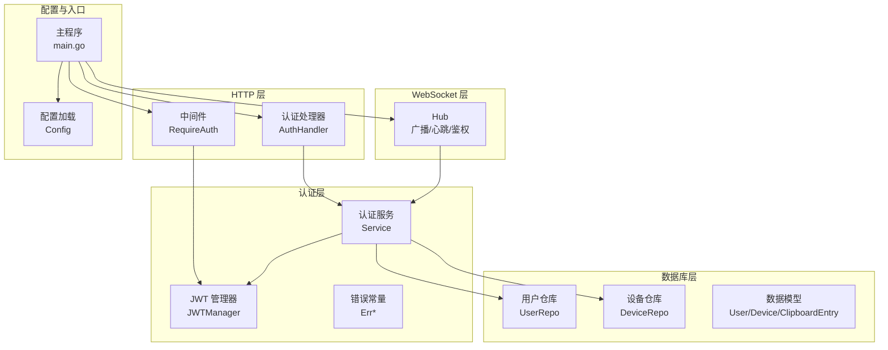
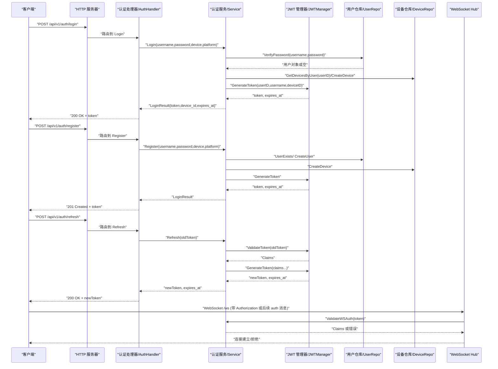
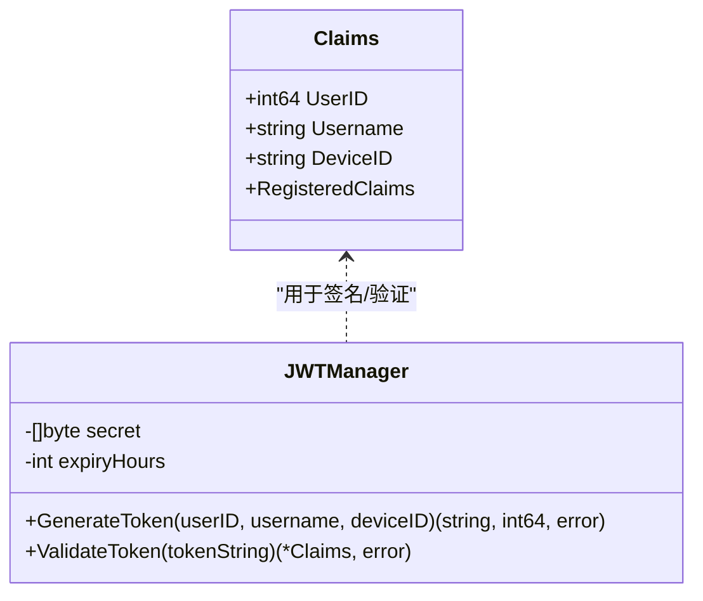
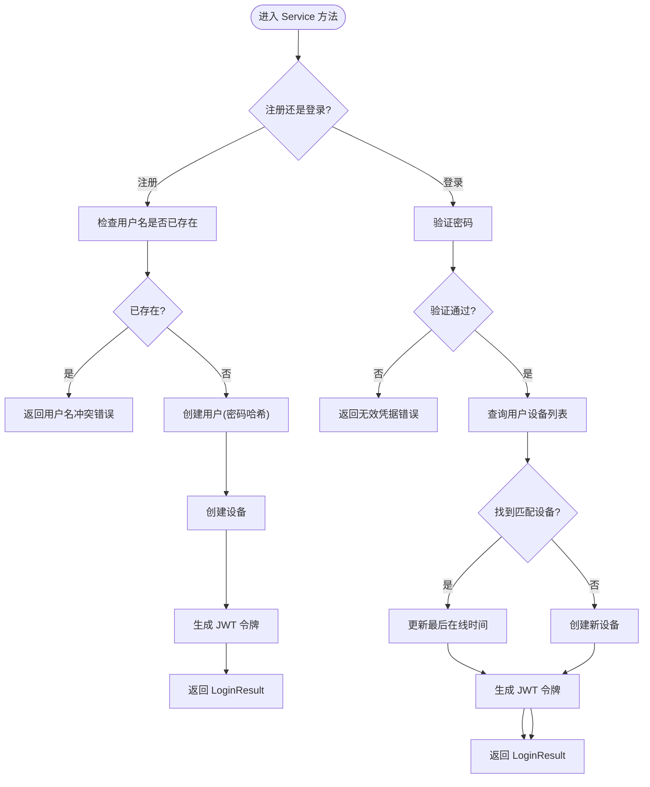
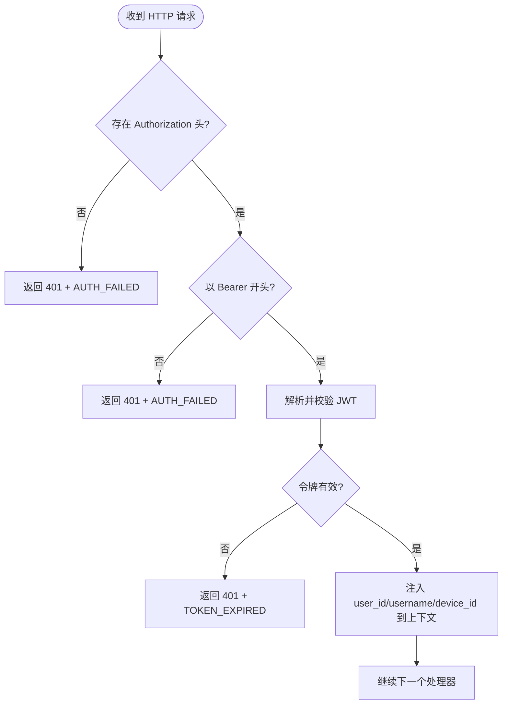
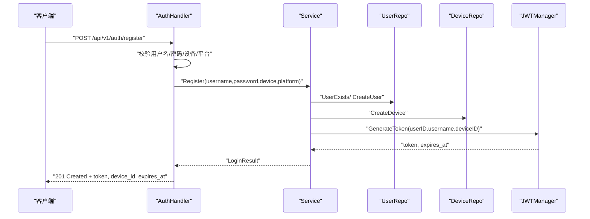
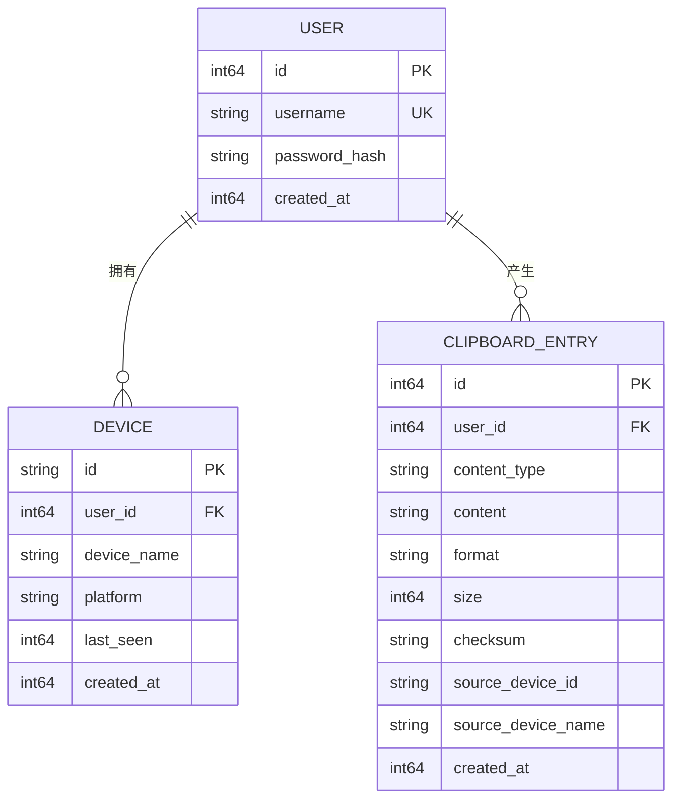
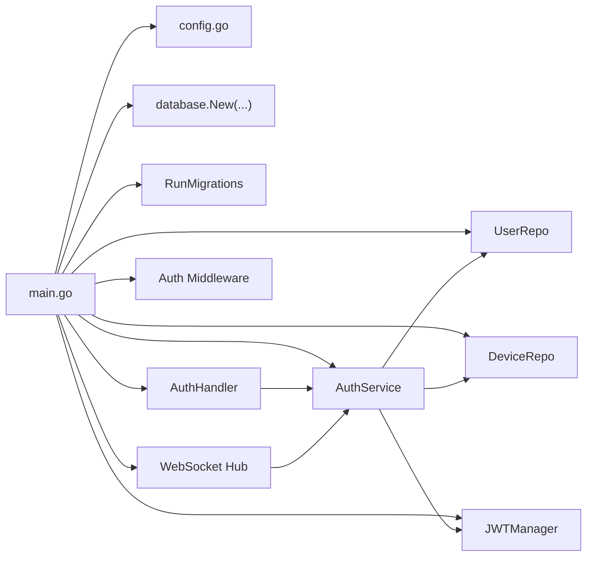

# 认证系统

<cite>
**本文引用的文件**
- [auth.go](file://clipSync-server/internal/auth/auth.go)
- [jwt.go](file://clipSync-server/internal/auth/jwt.go)
- [middleware.go](file://clipSync-server/internal/auth/middleware.go)
- [errors.go](file://clipSync-server/internal/auth/errors.go)
- [auth_handler.go](file://clipSync-server/internal/httpserver/auth_handler.go)
- [user_repo.go](file://clipSync-server/internal/database/user_repo.go)
- [device_repo.go](file://clipSync-server/internal/database/device_repo.go)
- [models.go](file://clipSync-server/internal/database/models.go)
- [main.go](file://clipSync-server/cmd/server/main.go)
- [config.yaml](file://clipSync-server/configs/config.yaml)
- [config.go](file://clipSync-server/internal/config/config.go)
- [hub.go](file://clipSync-server/internal/websocket/hub.go)
- [ws-messages.schema.json](file://protocol/ws-messages.schema.json)
</cite>

## 目录
1. [简介](#简介)
2. [项目结构](#项目结构)
3. [核心组件](#核心组件)
4. [架构总览](#架构总览)
5. [详细组件分析](#详细组件分析)
6. [依赖关系分析](#依赖关系分析)
7. [性能考量](#性能考量)
8. [故障排查指南](#故障排查指南)
9. [结论](#结论)
10. [附录](#附录)

## 简介
本文件面向“认证系统”的完整技术文档，覆盖以下主题：
- JWT 令牌认证机制与生命周期管理
- 用户身份验证流程（注册、登录、刷新）
- 中间件拦截器实现与上下文传递
- 服务器端认证逻辑、令牌生成与验证过程
- 认证接口定义、请求参数与响应格式
- 与数据库层的关系与数据模型
- 常见认证问题及解决方案
- 面向初学者的易懂讲解与面向资深开发者的深度细节

## 项目结构
认证系统位于后端服务 clipSync-server 的内部模块中，采用分层设计：HTTP 层负责接口暴露与限流；认证层负责业务逻辑与 JWT 管理；数据库层负责用户与设备信息持久化；WebSocket 层在连接建立时进行二次校验。

图表来源
- [auth.go:1-137](file://clipSync-server/internal/auth/auth.go#L1-L137)
- [jwt.go:1-76](file://clipSync-server/internal/auth/jwt.go#L1-L76)
- [middleware.go:1-111](file://clipSync-server/internal/auth/middleware.go#L1-L111)
- [auth_handler.go:1-215](file://clipSync-server/internal/httpserver/auth_handler.go#L1-L215)
- [user_repo.go:1-91](file://clipSync-server/internal/database/user_repo.go#L1-L91)
- [device_repo.go:1-126](file://clipSync-server/internal/database/device_repo.go#L1-L126)
- [models.go:1-46](file://clipSync-server/internal/database/models.go#L1-L46)
- [main.go:1-146](file://clipSync-server/cmd/server/main.go#L1-L146)
- [config.go:1-72](file://clipSync-server/internal/config/config.go#L1-L72)

章节来源
- [main.go:1-146](file://clipSync-server/cmd/server/main.go#L1-L146)
- [config.yaml:1-29](file://clipSync-server/configs/config.yaml#L1-L29)

## 核心组件
- 认证服务 Service：封装注册、登录、刷新等业务逻辑，协调用户仓库、设备仓库与 JWT 管理器。
- JWT 管理器 JWTManager：负责令牌签发与校验，携带密钥与过期时间配置。
- 认证中间件 Middleware：HTTP 层拦截器，从 Authorization 头解析 Bearer 令牌并注入上下文。
- 认证处理器 AuthHandler：对外暴露 /api/v1/auth/* 接口，执行输入校验与调用认证服务。
- 数据库仓库：UserRepo、DeviceRepo 负责用户密码哈希、设备登记与最后在线时间更新。
- 错误常量：统一的业务错误类型，便于上层判断与处理。
- 配置：JWT 密钥、过期小时数、端口、存储路径等运行时参数。

章节来源
- [auth.go:1-137](file://clipSync-server/internal/auth/auth.go#L1-L137)
- [jwt.go:1-76](file://clipSync-server/internal/auth/jwt.go#L1-L76)
- [middleware.go:1-111](file://clipSync-server/internal/auth/middleware.go#L1-L111)
- [auth_handler.go:1-215](file://clipSync-server/internal/httpserver/auth_handler.go#L1-L215)
- [user_repo.go:1-91](file://clipSync-server/internal/database/user_repo.go#L1-L91)
- [device_repo.go:1-126](file://clipSync-server/internal/database/device_repo.go#L1-L126)
- [errors.go:1-11](file://clipSync-server/internal/auth/errors.go#L1-L11)

## 架构总览
下图展示从客户端到服务器的认证交互流程，包括 HTTP 登录/注册/刷新与 WebSocket 连接鉴权。

图表来源
- [auth_handler.go:63-208](file://clipSync-server/internal/httpserver/auth_handler.go#L63-L208)
- [auth.go:67-136](file://clipSync-server/internal/auth/auth.go#L67-L136)
- [jwt.go:32-75](file://clipSync-server/internal/auth/jwt.go#L32-L75)
- [user_repo.go:65-80](file://clipSync-server/internal/database/user_repo.go#L65-L80)
- [device_repo.go:60-90](file://clipSync-server/internal/database/device_repo.go#L60-L90)
- [hub.go:181-200](file://clipSync-server/internal/websocket/hub.go#L181-L200)

## 详细组件分析

### JWT 令牌与 Claims 结构
- Claims 包含用户标识、用户名、设备标识以及标准注册声明（过期、签发、发行者）。
- JWTManager 负责使用 HS256 签名算法与配置的密钥生成与校验令牌，并设置过期时间。
- 令牌在 HTTP 与 WebSocket 场景均被使用，前者通过 Authorization: Bearer 头传递，后者通过协议消息中的 token 字段传递。

图表来源
- [jwt.go:10-75](file://clipSync-server/internal/auth/jwt.go#L10-L75)

章节来源
- [jwt.go:1-76](file://clipSync-server/internal/auth/jwt.go#L1-L76)

### 认证服务 Service
- Register：检查用户名是否存在，不存在则创建用户与设备，再签发令牌并返回 token、device_id、expires_at。
- Login：验证密码，若存在同设备则复用并更新最后在线时间，否则新建设备；随后签发令牌。
- Refresh：校验旧令牌有效性，有效则基于原 Claims 重新签发新令牌。
- ValidateWSAuth：供 WebSocket 使用，直接委托 JWTManager 校验令牌。

图表来源
- [auth.go:32-116](file://clipSync-server/internal/auth/auth.go#L32-L116)

章节来源
- [auth.go:1-137](file://clipSync-server/internal/auth/auth.go#L1-L137)

### 认证中间件 Middleware
- 从请求头提取 Authorization: Bearer token。
- 调用 JWTManager 校验令牌有效性。
- 将用户 ID、用户名、设备 ID 注入请求上下文，供后续处理器使用。
- 对缺失或格式不正确的头部、无效/过期令牌分别返回 401 并携带统一错误码。

图表来源
- [middleware.go:32-61](file://clipSync-server/internal/auth/middleware.go#L32-L61)

章节来源
- [middleware.go:1-111](file://clipSync-server/internal/auth/middleware.go#L1-L111)

### 认证处理器 AuthHandler
- Login：POST /api/v1/auth/login，校验必填字段，调用 Service.Login，返回成功响应或错误码。
- Register：POST /api/v1/auth/register，校验用户名长度与密码强度，调用 Service.Register，返回成功响应或错误码。
- Refresh：POST /api/v1/auth/refresh，从 Authorization 头提取 Bearer token，调用 Service.Refresh，返回新令牌。
- 统一 JSON 响应格式：success、error、message（可选）、token、device_id、expires_at 等。

图表来源
- [auth_handler.go:111-175](file://clipSync-server/internal/httpserver/auth_handler.go#L111-L175)
- [auth.go:32-65](file://clipSync-server/internal/auth/auth.go#L32-L65)

章节来源
- [auth_handler.go:1-215](file://clipSync-server/internal/httpserver/auth_handler.go#L1-L215)

### 数据库层与模型
- UserRepo：提供创建用户（密码哈希）、按用户名查询、验证密码、检查用户名是否已存在。
- DeviceRepo：提供创建设备（自动生成设备 ID）、按 ID/用户查询、更新最后在线时间、删除设备、校验所有权。
- 数据模型：User、Device、ClipboardEntry、UploadedFile，字段涵盖标识、时间戳、平台、名称等。

图表来源
- [models.go:3-45](file://clipSync-server/internal/database/models.go#L3-L45)
- [user_repo.go:21-80](file://clipSync-server/internal/database/user_repo.go#L21-L80)
- [device_repo.go:21-90](file://clipSync-server/internal/database/device_repo.go#L21-L90)

章节来源
- [user_repo.go:1-91](file://clipSync-server/internal/database/user_repo.go#L1-L91)
- [device_repo.go:1-126](file://clipSync-server/internal/database/device_repo.go#L1-L126)
- [models.go:1-46](file://clipSync-server/internal/database/models.go#L1-L46)

### WebSocket 认证与 Hub
- Hub 在升级 WebSocket 连接后，对未认证客户端设置 30 秒超时；后续可通过协议消息完成认证。
- Hub 可调用认证服务 ValidateWSAuth 对传入的 token 进行校验，成功后建立稳定的实时连接。
- Hub 提供广播、心跳、在线设备查询等功能，均基于用户维度进行隔离。

章节来源
- [hub.go:181-200](file://clipSync-server/internal/websocket/hub.go#L181-L200)
- [auth.go:133-136](file://clipSync-server/internal/auth/auth.go#L133-L136)

## 依赖关系分析
- 入口 main.go 初始化配置、数据库、迁移、仓库、JWT 管理器、认证服务、WebSocket Hub 与中间件。
- HTTP 路由将 /api/v1/auth/* 交由 AuthHandler 处理，受限流保护；受认证中间件保护的路由包括设备管理与上传下载。
- 认证服务依赖 UserRepo、DeviceRepo、JWTManager；JWTManager 依赖配置中的密钥与过期时间。
- WebSocket Hub 依赖认证服务进行连接级鉴权。

图表来源
- [main.go:44-108](file://clipSync-server/cmd/server/main.go#L44-L108)
- [config.go:38-71](file://clipSync-server/internal/config/config.go#L38-L71)

章节来源
- [main.go:1-146](file://clipSync-server/cmd/server/main.go#L1-L146)
- [config.go:1-72](file://clipSync-server/internal/config/config.go#L1-L72)

## 性能考量
- 密钥与过期时间：建议生产环境修改默认密钥，合理设置过期时间（默认 30 天），避免长期有效令牌带来的风险。
- 密码哈希成本：bcrypt 默认成本已较安全，如需进一步优化可结合硬件能力调整。
- 设备最后在线时间：登录时更新 last_seen，有助于快速识别在线设备与离线清理策略。
- 限流：认证接口使用限流中间件，防止暴力破解与滥用。
- WebSocket：Hub 采用并发 map 管理客户端，广播时按用户过滤，避免跨用户泄露。

## 故障排查指南
- 401 AUTH_FAILED：缺少 Authorization 头或格式不正确（非 Bearer）。
- 401 TOKEN_EXPIRED：令牌无效或已过期。
- 400 INVALID_PAYLOAD：请求体缺失必填字段或用户名/密码不符合规则。
- 409 USERNAME_EXISTS：注册时用户名已被占用。
- 500 INTERNAL_ERROR：服务器内部错误，通常为数据库或加密失败。
- WebSocket 认证超时：未在 30 秒内完成认证消息发送或令牌校验失败。

常见问题与解决
- 密钥泄露或默认密钥：立即在配置中更换 jwt_secret，并重启服务。
- 令牌过期频繁：适当缩短 jwt_expiry_hours，或在客户端定期调用刷新接口。
- 设备重复登录：登录时会复用同平台同设备名的设备记录并更新最后在线时间。
- 密码强度不足：注册前会校验长度与字母数字要求，需满足最小长度与字符类型。
- WebSocket 无法连接：确认客户端在握手后发送协议消息完成认证，或检查 Hub 的认证超时设置。

章节来源
- [auth_handler.go:63-208](file://clipSync-server/internal/httpserver/auth_handler.go#L63-L208)
- [middleware.go:32-61](file://clipSync-server/internal/auth/middleware.go#L32-L61)
- [errors.go:1-11](file://clipSync-server/internal/auth/errors.go#L1-L11)
- [hub.go:197-200](file://clipSync-server/internal/websocket/hub.go#L197-L200)

## 结论
该认证系统以清晰的分层设计实现了完整的 JWT 令牌认证闭环：从 HTTP 接口到中间件拦截，再到服务层业务逻辑与数据库持久化，最终在 WebSocket 层完成连接级鉴权。系统提供了注册、登录、刷新等核心能力，并通过统一错误码与响应格式提升了可维护性与一致性。建议在生产环境中强化密钥管理与令牌有效期策略，并持续监控限流与日志以保障安全与稳定性。

## 附录

### 认证接口一览
- POST /api/v1/auth/login
  - 请求体字段：username、password、device_name、platform
  - 成功响应：token、device_id、expires_at
  - 错误码：INVALID_CREDENTIALS、INVALID_PAYLOAD、INTERNAL_ERROR
- POST /api/v1/auth/register
  - 请求体字段：username、password、device_name、platform
  - 成功响应：token、device_id、expires_at
  - 错误码：USERNAME_EXISTS、INVALID_PAYLOAD、INTERNAL_ERROR
- POST /api/v1/auth/refresh
  - 请求头：Authorization: Bearer <token>
  - 成功响应：token、expires_at
  - 错误码：AUTH_FAILED、TOKEN_EXPIRED

章节来源
- [auth_handler.go:63-208](file://clipSync-server/internal/httpserver/auth_handler.go#L63-L208)

### WebSocket 协议与认证
- 协议消息类型包含 auth、auth_response 等，客户端在连接后发送 auth 类型消息携带 token、device_name、platform。
- 服务器通过 Hub 调用认证服务 ValidateWSAuth 完成校验，成功后建立稳定连接。

章节来源
- [ws-messages.schema.json:89-114](file://protocol/ws-messages.schema.json#L89-L114)
- [hub.go:181-200](file://clipSync-server/internal/websocket/hub.go#L181-L200)

### 配置项说明
- jwt_secret：JWT 签名密钥（务必在生产环境修改）
- jwt_expiry_hours：令牌过期小时数（默认 720，即 30 天）
- http_port、ws_port：HTTP 与 WebSocket 端口
- db_path：SQLite 数据库路径
- file_storage_path、max_file_size_mb：文件上传存储与大小限制
- clipboard_history_limit、heartbeat_timeout_seconds：剪贴板历史条目上限与心跳超时

章节来源
- [config.yaml:1-29](file://clipSync-server/configs/config.yaml#L1-L29)
- [config.go:10-21](file://clipSync-server/internal/config/config.go#L10-L21)