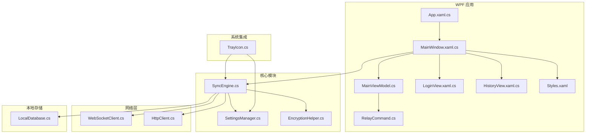
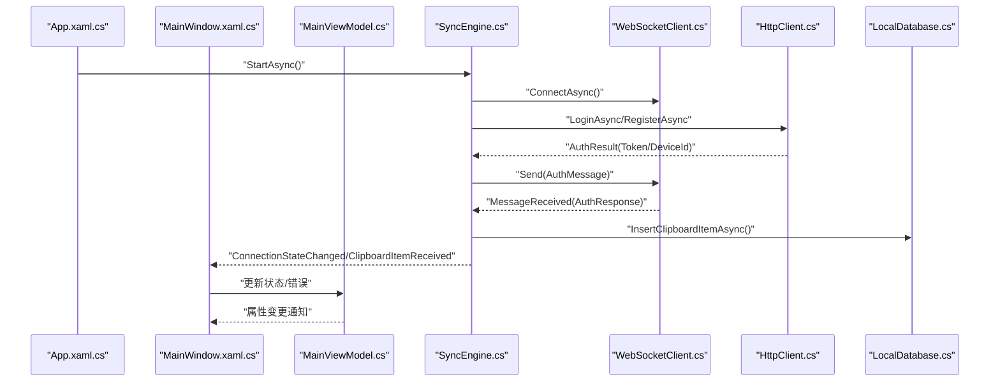
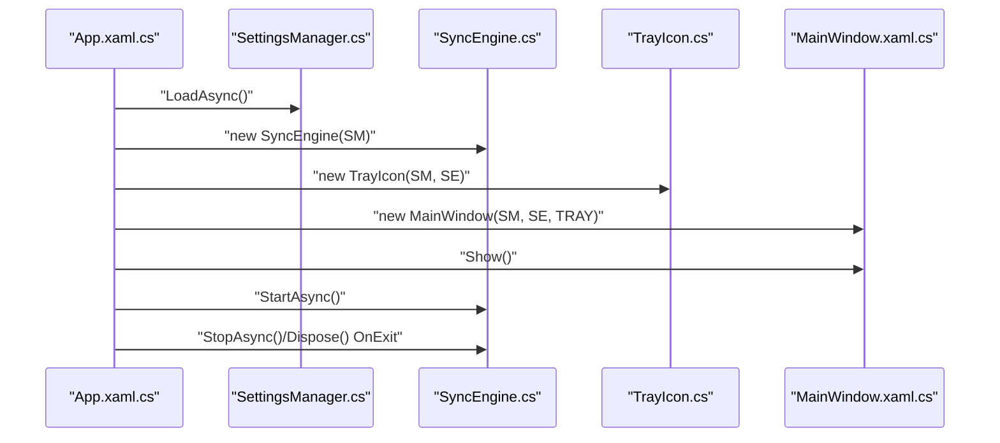
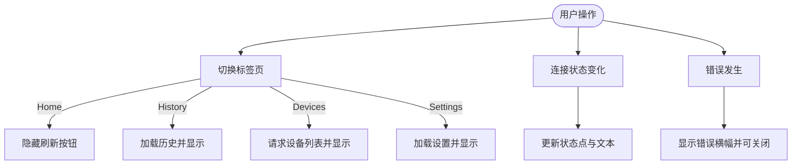
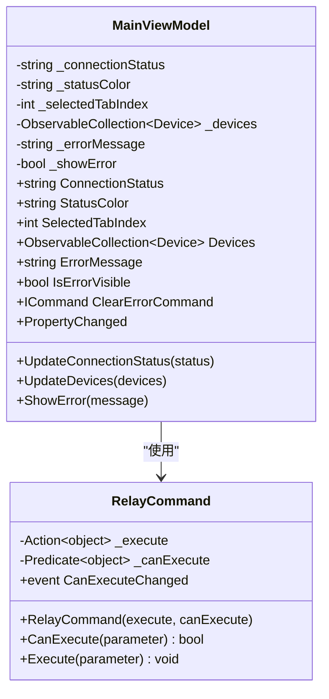
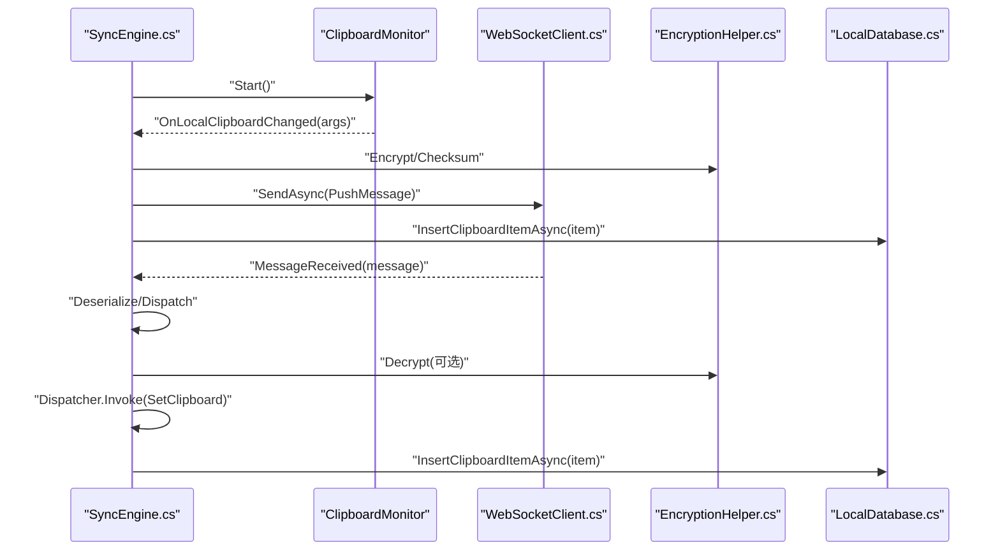
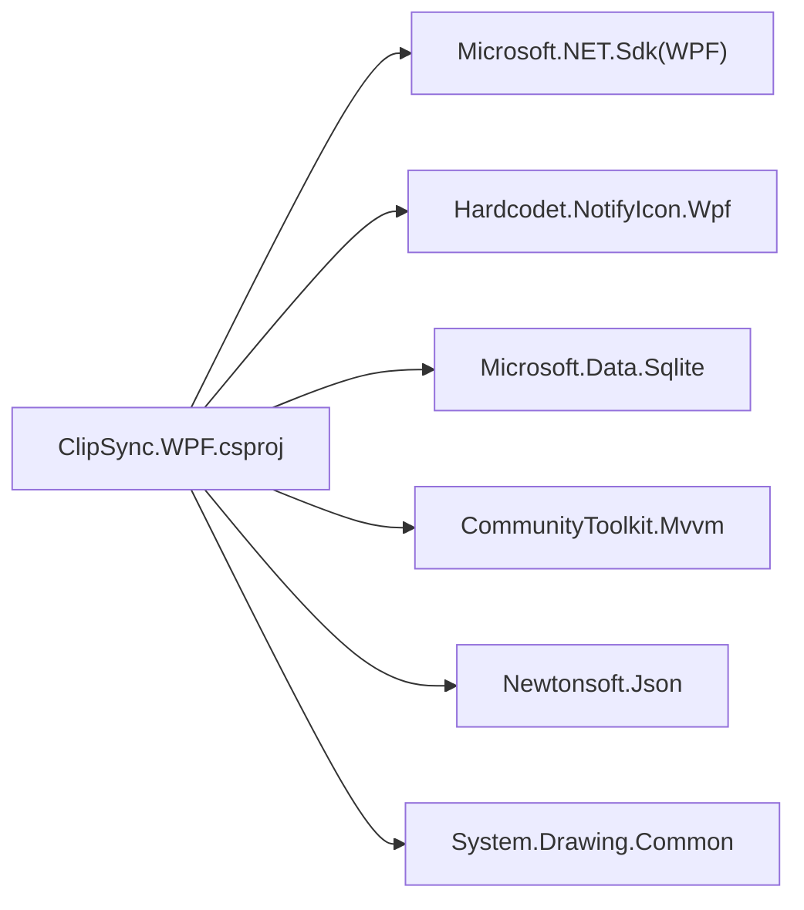

# C#代码规范

<cite>
**本文引用的文件**
- [App.xaml.cs](file://clipSync-windows/ClipSync.WPF/App.xaml.cs)
- [MainWindow.xaml.cs](file://clipSync-windows/ClipSync.WPF/MainWindow.xaml.cs)
- [RelayCommand.cs](file://clipSync-windows/ClipSync.WPF/RelayCommand.cs)
- [MainViewModel.cs](file://clipSync-windows/ClipSync.WPF/UI/ViewModels/MainViewModel.cs)
- [SyncEngine.cs](file://clipSync-windows/ClipSync.WPF/Core/SyncEngine.cs)
- [SettingsManager.cs](file://clipSync-windows/ClipSync.WPF/Core/SettingsManager.cs)
- [HttpClient.cs](file://clipSync-windows/ClipSync.WPF/Network/HttpClient.cs)
- [TrayIcon.cs](file://clipSync-windows/ClipSync.WPF/SystemTray/TrayIcon.cs)
- [LocalDatabase.cs](file://clipSync-windows/ClipSync.WPF/Storage/LocalDatabase.cs)
- [ClipSync.WPF.csproj](file://clipSync-windows/ClipSync.WPF/ClipSync.WPF.csproj)
- [LoginView.xaml.cs](file://clipSync-windows/ClipSync.WPF/UI/Views/LoginView.xaml.cs)
- [HistoryView.xaml.cs](file://clipSync-windows/ClipSync.WPF/UI/Views/HistoryView.xaml.cs)
- [Styles.xaml](file://clipSync-windows/ClipSync.WPF/Resources/Styles.xaml)
- [WebSocketClient.cs](file://clipSync-windows/ClipSync.WPF/Network/WebSocketClient.cs)
- [EncryptionHelper.cs](file://clipSync-windows/ClipSync.WPF/Core/EncryptionHelper.cs)
</cite>

## 目录
1. [简介](#简介)
2. [项目结构](#项目结构)
3. [核心组件](#核心组件)
4. [架构总览](#架构总览)
5. [详细组件分析](#详细组件分析)
6. [依赖关系分析](#依赖关系分析)
7. [性能考虑](#性能考虑)
8. [故障排查指南](#故障排查指南)
9. [结论](#结论)
10. [附录](#附录)

## 简介
本文件面向C#与WPF应用开发，结合clipSync-windows项目的实际实现，系统化梳理编码风格、命名约定、类设计原则、MVVM模式实践、网络通信模块、UI/UX最佳实践、资源管理策略以及性能与线程安全注意事项。文档以“可读性优先、可维护性优先”的原则组织，既适合初学者快速上手，也为有经验的开发者提供深度参考。

## 项目结构
项目采用按功能域分层的目录组织方式：核心业务逻辑（Core）、网络通信（Network）、系统托盘（SystemTray）、存储（Storage）、用户界面（UI）以及资源（Resources）。WPF工程通过XAML定义视图，C#代码隐藏负责事件与数据绑定；同时通过MVVM模式分离视图模型与视图，提升可测试性与可维护性。

**图表来源**
- [App.xaml.cs:12-52](file://clipSync-windows/ClipSync.WPF/App.xaml.cs#L12-L52)
- [MainWindow.xaml.cs:21-48](file://clipSync-windows/ClipSync.WPF/MainWindow.xaml.cs#L21-L48)
- [MainViewModel.cs:8-58](file://clipSync-windows/ClipSync.WPF/UI/ViewModels/MainViewModel.cs#L8-L58)
- [SyncEngine.cs:32-57](file://clipSync-windows/ClipSync.WPF/Core/SyncEngine.cs#L32-L57)
- [SettingsManager.cs:44-99](file://clipSync-windows/ClipSync.WPF/Core/SettingsManager.cs#L44-L99)
- [HttpClient.cs:20-30](file://clipSync-windows/ClipSync.WPF/Network/HttpClient.cs#L20-L30)
- [WebSocketClient.cs:10-21](file://clipSync-windows/ClipSync.WPF/Network/WebSocketClient.cs#L10-L21)
- [TrayIcon.cs:9-21](file://clipSync-windows/ClipSync.WPF/SystemTray/TrayIcon.cs#L9-L21)
- [LocalDatabase.cs:9-24](file://clipSync-windows/ClipSync.WPF/Storage/LocalDatabase.cs#L9-L24)
- [RelayCommand.cs:6-32](file://clipSync-windows/ClipSync.WPF/RelayCommand.cs#L6-L32)
- [Styles.xaml:1-252](file://clipSync-windows/ClipSync.WPF/Resources/Styles.xaml#L1-L252)

**章节来源**
- [ClipSync.WPF.csproj:1-24](file://clipSync-windows/ClipSync.WPF/ClipSync.WPF.csproj#L1-L24)

## 核心组件
- 应用入口与生命周期管理：在应用启动时初始化全局异常处理、设置管理器、同步引擎与系统托盘，并根据配置决定主窗口是否最小化到托盘；退出时优雅停止同步引擎并释放资源。
- 同步引擎：负责本地剪贴板监控、WebSocket连接与认证、心跳与重连、消息解析与派发、历史记录入库与查询、错误上报等。
- 设置管理器：提供线程安全的设置读写与更新，持久化到用户目录下的JSON文件。
- 网络层：HTTP客户端封装登录/注册/刷新令牌接口；WebSocket客户端封装连接、发送、接收循环与断开流程。
- 视图模型与命令：基于INotifyPropertyChanged的属性变更通知，使用自研RelayCommand简化命令绑定。
- 系统托盘：提供右键菜单与双击显示窗口的能力，并在退出时关闭同步引擎。
- 本地数据库：SQLite轻量存储剪贴板历史，自动建表与索引，限制保留条目数量。
- 加密辅助：统一的AES-256-CBC加解密格式与校验算法，确保跨平台一致性。

**章节来源**
- [App.xaml.cs:12-63](file://clipSync-windows/ClipSync.WPF/App.xaml.cs#L12-L63)
- [SyncEngine.cs:32-57](file://clipSync-windows/ClipSync.WPF/Core/SyncEngine.cs#L32-L57)
- [SettingsManager.cs:62-99](file://clipSync-windows/ClipSync.WPF/Core/SettingsManager.cs#L62-L99)
- [HttpClient.cs:32-82](file://clipSync-windows/ClipSync.WPF/Network/HttpClient.cs#L32-L82)
- [WebSocketClient.cs:22-62](file://clipSync-windows/ClipSync.WPF/Network/WebSocketClient.cs#L22-L62)
- [MainViewModel.cs:8-58](file://clipSync-windows/ClipSync.WPF/UI/ViewModels/MainViewModel.cs#L8-L58)
- [RelayCommand.cs:6-32](file://clipSync-windows/ClipSync.WPF/RelayCommand.cs#L6-L32)
- [TrayIcon.cs:28-57](file://clipSync-windows/ClipSync.WPF/SystemTray/TrayIcon.cs#L28-L57)
- [LocalDatabase.cs:26-58](file://clipSync-windows/ClipSync.WPF/Storage/LocalDatabase.cs#L26-L58)
- [EncryptionHelper.cs:18-55](file://clipSync-windows/ClipSync.WPF/Core/EncryptionHelper.cs#L18-L55)

## 架构总览
下图展示从应用启动到剪贴板同步的关键交互路径，体现MVVM与模块化职责划分。

**图表来源**
- [App.xaml.cs:35-51](file://clipSync-windows/ClipSync.WPF/App.xaml.cs#L35-L51)
- [SyncEngine.cs:73-93](file://clipSync-windows/ClipSync.WPF/Core/SyncEngine.cs#L73-L93)
- [HttpClient.cs:32-82](file://clipSync-windows/ClipSync.WPF/Network/HttpClient.cs#L32-L82)
- [WebSocketClient.cs:22-39](file://clipSync-windows/ClipSync.WPF/Network/WebSocketClient.cs#L22-L39)
- [LocalDatabase.cs:60-96](file://clipSync-windows/ClipSync.WPF/Storage/LocalDatabase.cs#L60-L96)
- [MainWindow.xaml.cs:112-164](file://clipSync-windows/ClipSync.WPF/MainWindow.xaml.cs#L112-L164)
- [MainViewModel.cs:60-85](file://clipSync-windows/ClipSync.WPF/UI/ViewModels/MainViewModel.cs#L60-L85)

## 详细组件分析

### 应用入口与生命周期（App）
- 全局异常处理：捕获DispatcherUnhandledException、AppDomain.UnhandledException、TaskScheduler.UnobservedTaskException，避免崩溃并记录日志。
- 启动流程：加载设置、初始化同步引擎与系统托盘、创建并显示主窗口，依据设置决定是否最小化到托盘；随后启动同步引擎。
- 退出流程：停止并释放同步引擎，释放托盘图标，调用基类退出。

**图表来源**
- [App.xaml.cs:12-63](file://clipSync-windows/ClipSync.WPF/App.xaml.cs#L12-L63)

**章节来源**
- [App.xaml.cs:12-63](file://clipSync-windows/ClipSync.WPF/App.xaml.cs#L12-L63)

### 主窗口与视图（MainWindow）
- 职责：承载登录、历史、设备、设置四个标签页；响应连接状态变化、错误事件与剪贴板项到达；根据设置控制最小化到托盘行为。
- 事件绑定：Tab切换、刷新设备列表、错误横幅点击、登录/注册请求、设置保存、注销等。
- 数据流：从同步引擎拉取历史、更新设备列表、设置当前登录态与UI可见性。

**图表来源**
- [MainWindow.xaml.cs:187-214](file://clipSync-windows/ClipSync.WPF/MainWindow.xaml.cs#L187-L214)
- [MainWindow.xaml.cs:112-154](file://clipSync-windows/ClipSync.WPF/MainWindow.xaml.cs#L112-L154)

**章节来源**
- [MainWindow.xaml.cs:21-291](file://clipSync-windows/ClipSync.WPF/MainWindow.xaml.cs#L21-L291)

### 视图模型与命令（MainViewModel + RelayCommand）
- 视图模型：实现INotifyPropertyChanged，提供连接状态、设备列表、错误信息等属性；通过命令清理错误。
- 命令：RelayCommand通用实现，支持泛型与非泛型版本，订阅CommandManager的CanExecute变更事件，简化XAML绑定。

**图表来源**
- [MainViewModel.cs:8-108](file://clipSync-windows/ClipSync.WPF/UI/ViewModels/MainViewModel.cs#L8-L108)
- [RelayCommand.cs:6-54](file://clipSync-windows/ClipSync.WPF/RelayCommand.cs#L6-L54)

**章节来源**
- [MainViewModel.cs:8-110](file://clipSync-windows/ClipSync.WPF/UI/ViewModels/MainViewModel.cs#L8-L110)
- [RelayCommand.cs:6-56](file://clipSync-windows/ClipSync.WPF/RelayCommand.cs#L6-L56)

### 同步引擎（SyncEngine）
- 组成：剪贴板监控、WebSocket客户端、HTTP客户端、心跳计时器、重连处理器、本地数据库、设置管理器。
- 流程：启动时初始化数据库、建立WebSocket连接、发起认证；本地剪贴板变化时序列化并发送；收到远端消息时反序列化并处理，必要时解密、写入剪贴板、入库并触发事件。
- 错误处理：对异常进行捕获与上报，避免主线程阻塞或崩溃。

**图表来源**
- [SyncEngine.cs:95-125](file://clipSync-windows/ClipSync.WPF/Core/SyncEngine.cs#L95-L125)
- [SyncEngine.cs:127-163](file://clipSync-windows/ClipSync.WPF/Core/SyncEngine.cs#L127-L163)
- [SyncEngine.cs:188-267](file://clipSync-windows/ClipSync.WPF/Core/SyncEngine.cs#L188-L267)
- [EncryptionHelper.cs:30-55](file://clipSync-windows/ClipSync.WPF/Core/EncryptionHelper.cs#L30-L55)
- [LocalDatabase.cs:60-96](file://clipSync-windows/ClipSync.WPF/Storage/LocalDatabase.cs#L60-L96)

**章节来源**
- [SyncEngine.cs:8-422](file://clipSync-windows/ClipSync.WPF/Core/SyncEngine.cs#L8-L422)

### 设置管理器（SettingsManager）
- 设计：线程安全的设置对象，使用锁保护读写；通过JSON序列化持久化到用户目录。
- 使用：在应用启动时加载，在设置变更后保存；提供Update委托以原子性修改字段。

**章节来源**
- [SettingsManager.cs:44-102](file://clipSync-windows/ClipSync.WPF/Core/SettingsManager.cs#L44-L102)

### 网络通信（HTTP + WebSocket）
- HTTP客户端：封装登录、注册、令牌刷新，统一返回结果对象，包含成功标志、错误信息与过期时间。
- WebSocket客户端：连接、断开、发送、接收循环；内置最大消息大小限制与异常兜底；断开时触发状态变更。

**章节来源**
- [HttpClient.cs:20-178](file://clipSync-windows/ClipSync.WPF/Network/HttpClient.cs#L20-L178)
- [WebSocketClient.cs:10-146](file://clipSync-windows/ClipSync.WPF/Network/WebSocketClient.cs#L10-L146)

### 系统托盘（TrayIcon）
- 功能：创建托盘图标、右键菜单（显示/隐藏/退出）、双击显示窗口；退出时停止同步引擎并关闭应用。
- 线程：通过Dispatcher.Invoke确保UI操作在正确线程执行。

**章节来源**
- [TrayIcon.cs:9-109](file://clipSync-windows/ClipSync.WPF/SystemTray/TrayIcon.cs#L9-L109)

### 本地数据库（LocalDatabase）
- 初始化：首次使用时创建SQLite数据库与表，建立时间戳索引。
- 写入：插入剪贴板项并限制保留最近50条。
- 查询：按时间倒序返回历史记录。

**章节来源**
- [LocalDatabase.cs:9-169](file://clipSync-windows/ClipSync.WPF/Storage/LocalDatabase.cs#L9-L169)

### 加密辅助（EncryptionHelper）
- 格式：统一的“盐:密文”格式，兼容Android与服务端；PBKDF2-SHA256派生密钥，AES-256-CBC加密，PKCS7填充。
- 校验：SHA-256计算内容摘要，用于去重与一致性校验。

**章节来源**
- [EncryptionHelper.cs:18-134](file://clipSync-windows/ClipSync.WPF/Core/EncryptionHelper.cs#L18-L134)

### 视图层（LoginView / HistoryView）
- 登录视图：暴露登录/注册事件，输入校验，错误提示。
- 历史视图：绑定列表数据源，支持复制、刷新、清空等操作。

**章节来源**
- [LoginView.xaml.cs:7-71](file://clipSync-windows/ClipSync.WPF/UI/Views/LoginView.xaml.cs#L7-L71)
- [HistoryView.xaml.cs:7-36](file://clipSync-windows/ClipSync.WPF/UI/Views/HistoryView.xaml.cs#L7-L36)

### 资源与样式（Styles.xaml）
- 主题：定义品牌色板、圆角半径、阴影效果与常用控件样式（按钮、文本框、复选框、列表等），统一UI风格。
- 使用：通过静态资源引用，便于主题替换与扩展。

**章节来源**
- [Styles.xaml:1-252](file://clipSync-windows/ClipSync.WPF/Resources/Styles.xaml#L1-L252)

## 依赖关系分析
- 工程文件声明了WPF、SQLite、通知图标、JSON序列化与绘图相关依赖，体现了应用的运行时需求。
- 模块间耦合：同步引擎聚合多个子系统；视图依赖视图模型；网络层与存储层相对独立，通过同步引擎协调。

**图表来源**
- [ClipSync.WPF.csproj:13-19](file://clipSync-windows/ClipSync.WPF/ClipSync.WPF.csproj#L13-L19)

**章节来源**
- [ClipSync.WPF.csproj:1-24](file://clipSync-windows/ClipSync.WPF/ClipSync.WPF.csproj#L1-L24)

## 性能考虑
- 异步优先：所有IO与网络操作均采用async/await，避免阻塞UI线程；数据库与文件读写使用Task.Run隔离。
- 线程安全：设置管理器使用锁保护并发访问；UI更新通过Dispatcher.Invoke确保STA线程上下文。
- 资源释放：在退出与异常路径中显式停止与释放WebSocket、数据库、托盘图标等资源。
- 存储优化：SQLite表建立索引，限制历史记录数量，降低查询与写入成本。
- 网络健壮性：WebSocket客户端限制消息大小、捕获异常并触发断开回调，避免内存膨胀与卡顿。

[本节为通用指导，不直接分析具体文件]

## 故障排查指南
- 连接失败：检查服务器URL与网络可达性；查看同步引擎错误事件输出；确认认证令牌有效。
- 剪贴板无法同步：确认启用同步开关与加密设置一致；检查加密密码是否正确；验证去重校验值。
- UI无响应：确认未在后台线程直接操作UI；使用Dispatcher.Invoke包裹UI更新。
- 日志定位：利用全局异常处理器输出异常信息，结合调试器定位具体调用栈。

**章节来源**
- [App.xaml.cs:16-33](file://clipSync-windows/ClipSync.WPF/App.xaml.cs#L16-L33)
- [SyncEngine.cs:127-163](file://clipSync-windows/ClipSync.WPF/Core/SyncEngine.cs#L127-L163)
- [MainWindow.xaml.cs:142-154](file://clipSync-windows/ClipSync.WPF/MainWindow.xaml.cs#L142-L154)

## 结论
本规范以clipSync-windows项目为蓝本，总结了C#与WPF开发中的编码风格、MVVM实践、网络通信与存储策略、UI资源管理以及性能与线程安全要点。建议在团队内推广一致的命名、结构与异常处理策略，持续通过单元测试与静态分析工具提升质量。

[本节为总结性内容，不直接分析具体文件]

## 附录
- 命名约定
  - 类型：PascalCase（如SyncEngine、SettingsManager）
  - 方法：PascalCase（如StartAsync、SaveAsync）
  - 字段：私有使用驼峰命名（如_isStarted），公共属性使用PascalCase
  - 事件：使用现在分词（如ConnectionStateChanged）
- MVVM最佳实践
  - 视图模型仅暴露可绑定属性与命令，避免在视图中直接访问业务逻辑
  - 使用INotifyPropertyChanged与集合变更通知，确保UI自动刷新
  - 命令参数尽量传递强类型，减少字符串硬编码
- WPF UI/UX最佳实践
  - 控制器样式集中于ResourceDictionary，统一主题与交互
  - 列表项使用GridView与绑定，避免在代码中动态拼装UI
  - 对图片等大对象使用BitmapImage并冻结，降低内存占用
- 异步编程与线程安全
  - 所有IO与网络调用使用异步方法，避免阻塞UI线程
  - 在STA线程中操作剪贴板与Dispatcher
  - 使用锁或不可变数据结构保护共享状态
- 依赖注入与工具链
  - 当前项目未引入DI框架，建议在大型项目中引入容器以降低耦合
  - 使用Visual Studio的代码分析工具与静态分析规则，持续改进代码质量
  - 单元测试建议覆盖核心业务逻辑（如加密、消息解析、设置读写）

[本节为通用指导，不直接分析具体文件]