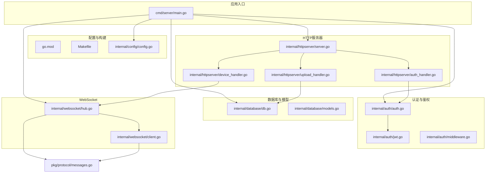
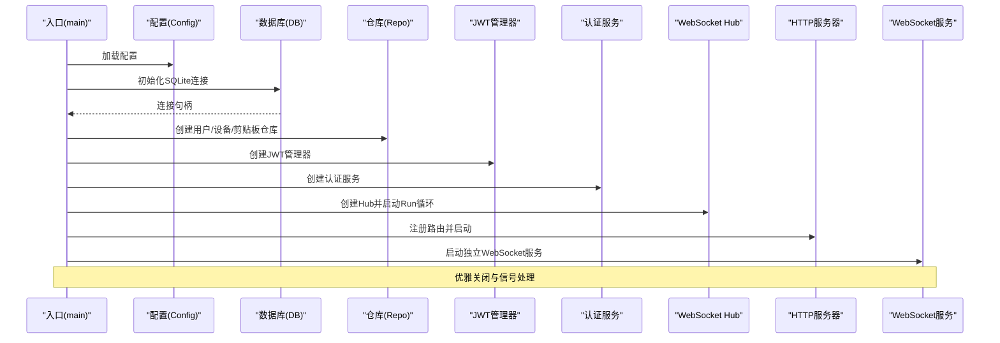
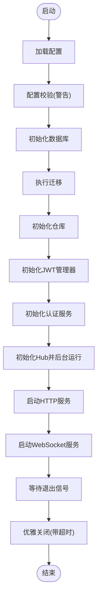
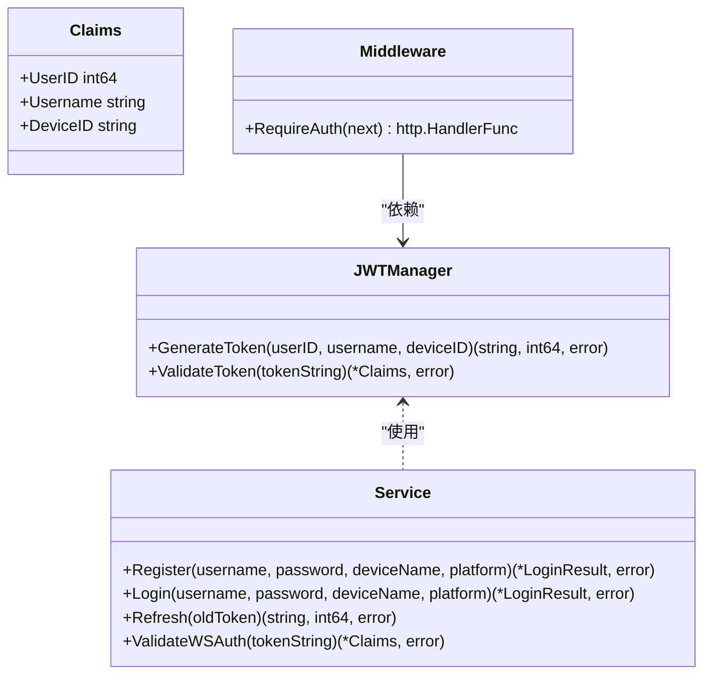
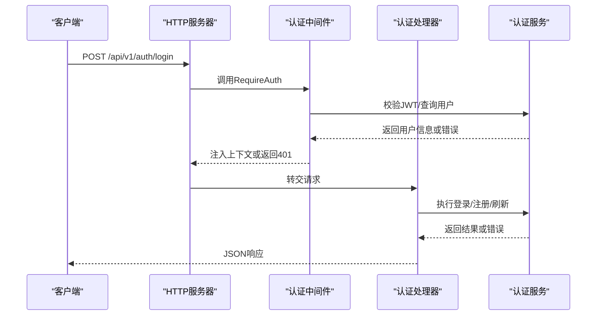
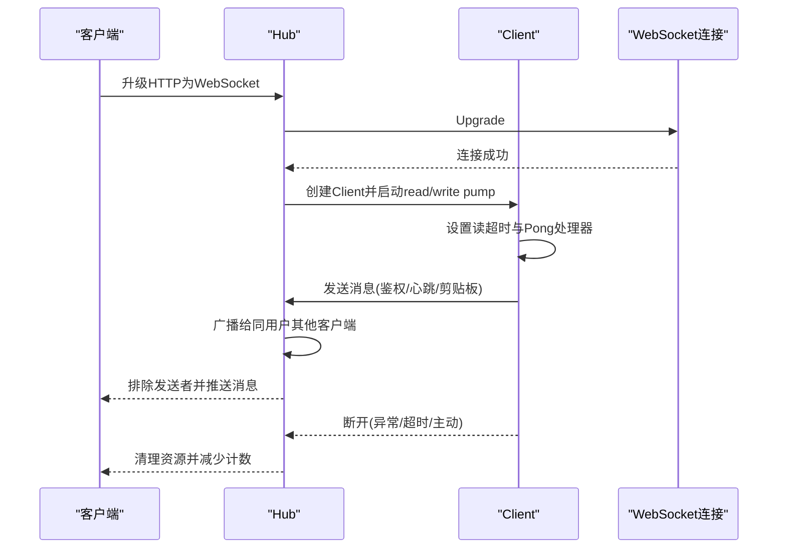
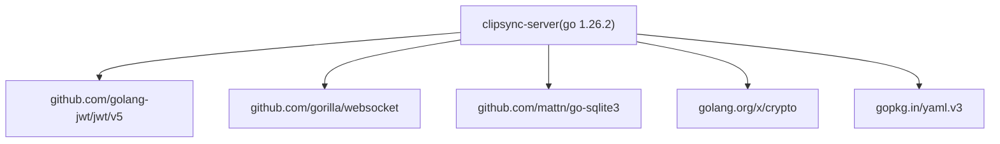

# Go语言代码规范

<cite>
**本文引用的文件**
- [go.mod](file://clipSync-server/go.mod)
- [Makefile](file://clipSync-server/Makefile)
- [main.go](file://clipSync-server/cmd/server/main.go)
- [config.go](file://clipSync-server/internal/config/config.go)
- [db.go](file://clipSync-server/internal/database/db.go)
- [models.go](file://clipSync-server/internal/database/models.go)
- [jwt.go](file://clipSync-server/internal/auth/jwt.go)
- [auth.go](file://clipSync-server/internal/auth/auth.go)
- [middleware.go](file://clipSync-server/internal/auth/middleware.go)
- [server.go](file://clipSync-server/internal/httpserver/server.go)
- [auth_handler.go](file://clipSync-server/internal/httpserver/auth_handler.go)
- [device_handler.go](file://clipSync-server/internal/httpserver/device_handler.go)
- [upload_handler.go](file://clipSync-server/internal/httpserver/upload_handler.go)
- [hub.go](file://clipSync-server/internal/websocket/hub.go)
- [client.go](file://clipSync-server/internal/websocket/client.go)
- [messages.go](file://clipSync-server/pkg/protocol/messages.go)
</cite>

## 目录
1. [引言](#引言)
2. [项目结构](#项目结构)
3. [核心组件](#核心组件)
4. [架构总览](#架构总览)
5. [详细组件分析](#详细组件分析)
6. [依赖分析](#依赖分析)
7. [性能考虑](#性能考虑)
8. [故障排查指南](#故障排查指南)
9. [结论](#结论)
10. [附录](#附录)

## 引言
本文件面向Go语言开发者，结合clipSync-server项目的实际实现，系统阐述Go编码风格、命名约定、包结构组织与最佳实践；详解模块管理、依赖版本控制与构建配置；并基于真实代码示例讲解WebSocket Hub实现、认证系统与HTTP服务器架构。同时覆盖错误处理模式、接口设计原则、并发编程最佳实践、代码格式化与静态分析工具使用、单元测试规范、性能优化与内存管理建议，以及常见问题与调试技巧。

## 项目结构
clipSync-server采用按职责分层的包结构：入口程序位于cmd/server，核心业务逻辑分布在internal目录下，协议定义在pkg中，配置与构建脚本位于根目录。该结构清晰分离了应用入口、领域服务、基础设施与协议契约，便于维护与扩展。

**图表来源**
- [main.go:1-146](file://clipSync-server/cmd/server/main.go#L1-L146)
- [config.go:1-72](file://clipSync-server/internal/config/config.go#L1-L72)
- [server.go:1-50](file://clipSync-server/internal/httpserver/server.go#L1-L50)
- [auth_handler.go:1-215](file://clipSync-server/internal/httpserver/auth_handler.go#L1-L215)
- [device_handler.go:1-137](file://clipSync-server/internal/httpserver/device_handler.go#L1-L137)
- [upload_handler.go:1-221](file://clipSync-server/internal/httpserver/upload_handler.go#L1-L221)
- [auth.go:1-137](file://clipSync-server/internal/auth/auth.go#L1-L137)
- [jwt.go:1-76](file://clipSync-server/internal/auth/jwt.go#L1-L76)
- [middleware.go:1-111](file://clipSync-server/internal/auth/middleware.go#L1-L111)
- [db.go:1-62](file://clipSync-server/internal/database/db.go#L1-L62)
- [models.go:1-46](file://clipSync-server/internal/database/models.go#L1-L46)
- [hub.go:1-230](file://clipSync-server/internal/websocket/hub.go#L1-L230)
- [client.go:1-150](file://clipSync-server/internal/websocket/client.go#L1-L150)
- [messages.go:1-132](file://clipSync-server/pkg/protocol/messages.go#L1-L132)

**章节来源**
- [main.go:1-146](file://clipSync-server/cmd/server/main.go#L1-L146)
- [go.mod:1-14](file://clipSync-server/go.mod#L1-L14)
- [Makefile:1-33](file://clipSync-server/Makefile#L1-L33)

## 核心组件
- 配置加载与校验：支持从YAML读取配置，并对生产不安全默认值给出警告。
- 数据库初始化：SQLite连接池与WAL模式优化，确保并发读写性能。
- 认证与鉴权：JWT令牌生成与验证，HTTP中间件注入用户上下文，WebSocket鉴权超时机制。
- HTTP服务器：统一的Server封装，优雅关闭，路由注册与限流策略。
- WebSocket Hub：客户端注册/注销、广播消息、心跳与超时处理、设备断连。
- 协议模型：统一的消息结构与类型常量，保障前后端一致性。

**章节来源**
- [config.go:1-72](file://clipSync-server/internal/config/config.go#L1-L72)
- [db.go:1-62](file://clipSync-server/internal/database/db.go#L1-L62)
- [jwt.go:1-76](file://clipSync-server/internal/auth/jwt.go#L1-L76)
- [auth.go:1-137](file://clipSync-server/internal/auth/auth.go#L1-L137)
- [middleware.go:1-111](file://clipSync-server/internal/auth/middleware.go#L1-L111)
- [server.go:1-50](file://clipSync-server/internal/httpserver/server.go#L1-L50)
- [hub.go:1-230](file://clipSync-server/internal/websocket/hub.go#L1-L230)
- [messages.go:1-132](file://clipSync-server/pkg/protocol/messages.go#L1-L132)

## 架构总览
下图展示启动流程、路由注册、认证链路与WebSocket交互的关键步骤。

**图表来源**
- [main.go:21-146](file://clipSync-server/cmd/server/main.go#L21-L146)
- [config.go:38-72](file://clipSync-server/internal/config/config.go#L38-L72)
- [db.go:17-62](file://clipSync-server/internal/database/db.go#L17-L62)
- [jwt.go:24-76](file://clipSync-server/internal/auth/jwt.go#L24-L76)
- [auth.go:15-137](file://clipSync-server/internal/auth/auth.go#L15-L137)
- [hub.go:44-112](file://clipSync-server/internal/websocket/hub.go#L44-L112)
- [server.go:18-50](file://clipSync-server/internal/httpserver/server.go#L18-L50)

## 详细组件分析

### 入口与生命周期管理（main）
- 日志格式设置、环境变量覆盖配置路径、配置校验与警告输出。
- 数据库初始化、迁移执行、仓库实例化。
- 认证服务与JWT管理器初始化。
- HTTP与WebSocket服务器分别启动，独立端口监听。
- 信号捕获与优雅关闭，含超时控制。

**图表来源**
- [main.go:21-146](file://clipSync-server/cmd/server/main.go#L21-L146)

**章节来源**
- [main.go:21-146](file://clipSync-server/cmd/server/main.go#L21-L146)

### 配置系统（internal/config）
- 默认配置提供合理的开发/演示值，生产需覆盖敏感字段。
- 支持从文件读取并回退到默认值；校验JWT密钥与过期时间是否合理。

**章节来源**
- [config.go:23-72](file://clipSync-server/internal/config/config.go#L23-L72)

### 数据库与模型（internal/database）
- SQLite连接池参数针对小规模服务器优化，启用WAL与若干PRAGMA提升并发与可靠性。
- 模型定义简洁明确，字段命名遵循Go风格，时间戳统一为毫秒级Unix时间。

**章节来源**
- [db.go:17-62](file://clipSync-server/internal/database/db.go#L17-L62)
- [models.go:3-46](file://clipSync-server/internal/database/models.go#L3-L46)

### 认证与JWT（internal/auth）
- JWT管理器负责签发与校验，Claims包含用户ID、用户名、设备ID及标准声明。
- 认证服务封装注册、登录与刷新流程，返回结构化结果。
- 中间件从Authorization头解析Bearer Token，校验后注入上下文供后续处理器使用。

**图表来源**
- [jwt.go:18-76](file://clipSync-server/internal/auth/jwt.go#L18-L76)
- [auth.go:8-137](file://clipSync-server/internal/auth/auth.go#L8-L137)
- [middleware.go:22-111](file://clipSync-server/internal/auth/middleware.go#L22-L111)

**章节来源**
- [jwt.go:18-76](file://clipSync-server/internal/auth/jwt.go#L18-L76)
- [auth.go:8-137](file://clipSync-server/internal/auth/auth.go#L8-L137)
- [middleware.go:22-111](file://clipSync-server/internal/auth/middleware.go#L22-L111)

### HTTP服务器与路由（internal/httpserver）
- 统一封装http.Server，设置读写与空闲超时，提供Start/Shutdown方法。
- 路由注册集中在入口处，使用中间件保护受保护端点。
- 速率限制器用于防刷认证端点。
- 处理器内部统一JSON响应与状态码返回。

**图表来源**
- [server.go:18-50](file://clipSync-server/internal/httpserver/server.go#L18-L50)
- [auth_handler.go:63-215](file://clipSync-server/internal/httpserver/auth_handler.go#L63-L215)
- [middleware.go:32-61](file://clipSync-server/internal/auth/middleware.go#L32-L61)

**章节来源**
- [server.go:18-50](file://clipSync-server/internal/httpserver/server.go#L18-L50)
- [auth_handler.go:63-215](file://clipSync-server/internal/httpserver/auth_handler.go#L63-L215)
- [device_handler.go:25-137](file://clipSync-server/internal/httpserver/device_handler.go#L25-L137)
- [upload_handler.go:36-221](file://clipSync-server/internal/httpserver/upload_handler.go#L36-L221)

### WebSocket Hub与客户端（internal/websocket）
- Hub维护客户端集合、注册/注销通道、广播队列与计数器，使用读写锁保证并发安全。
- 客户端读写泵分离，心跳超时与Pong处理，发送缓冲区满时的断连策略。
- WebSocket升级失败与鉴权超时的错误处理与消息通知。

**图表来源**
- [hub.go:181-230](file://clipSync-server/internal/websocket/hub.go#L181-L230)
- [client.go:33-150](file://clipSync-server/internal/websocket/client.go#L33-L150)

**章节来源**
- [hub.go:18-230](file://clipSync-server/internal/websocket/hub.go#L18-L230)
- [client.go:13-150](file://clipSync-server/internal/websocket/client.go#L13-L150)

### 协议模型（pkg/protocol）
- 统一的WSMessage结构体承载消息类型、版本、时间戳与负载。
- 定义认证、心跳、剪贴板同步/拉取、设备列表、错误等消息类型常量。
- 提供NowMillis辅助函数，确保跨平台时间一致性。

**章节来源**
- [messages.go:5-132](file://clipSync-server/pkg/protocol/messages.go#L5-L132)

## 依赖分析
- 模块与Go版本：模块名为clipsync-server，Go版本1.26.2。
- 主要外部依赖：JWT、WebSocket、SQLite驱动、加密库、YAML解析。
- 构建与测试：通过Makefile提供构建、运行、测试与清理命令；go mod tidy统一依赖。

**图表来源**
- [go.mod:1-14](file://clipSync-server/go.mod#L1-L14)

**章节来源**
- [go.mod:1-14](file://clipSync-server/go.mod#L1-L14)
- [Makefile:18-33](file://clipSync-server/Makefile#L18-L33)

## 性能考虑
- 数据库连接池：小服务器场景设置较小的最大打开/空闲连接数，配合WAL与PRAGMA优化并发读写。
- WebSocket缓冲：客户端发送缓冲区大小适中，避免内存膨胀；广播时检测阻塞并及时断连，防止连锁反应。
- 心跳与超时：读超时与心跳序列结合，及时发现失联客户端；WebSocket鉴权超时降低未授权连接占用。
- HTTP超时：为读、写、空闲设置合理超时，避免资源泄露。
- 文件上传：多路复用写入与哈希计算，限制请求体大小，校验校验和，失败时清理临时文件。

**章节来源**
- [db.go:29-50](file://clipSync-server/internal/database/db.go#L29-L50)
- [client.go:70-117](file://clipSync-server/internal/websocket/client.go#L70-L117)
- [hub.go:61-112](file://clipSync-server/internal/websocket/hub.go#L61-L112)
- [server.go:27-41](file://clipSync-server/internal/httpserver/server.go#L27-L41)
- [upload_handler.go:52-150](file://clipSync-server/internal/httpserver/upload_handler.go#L52-L150)

## 故障排查指南
- 配置问题：检查JWT密钥是否为默认值、过期时间是否过长；确认配置文件路径与权限。
- 数据库问题：确认数据库目录可写、WAL启用成功、连接池参数合理；关注并发读写冲突。
- 认证问题：确认Authorization头格式正确、Bearer前缀存在；检查JWT签名算法与密钥匹配。
- WebSocket问题：关注鉴权超时、心跳超时、发送缓冲区满导致的断连；核对消息格式与类型常量。
- HTTP问题：确认路由注册顺序、中间件顺序与限流配置；检查超时设置与日志输出。

**章节来源**
- [config.go:57-72](file://clipSync-server/internal/config/config.go#L57-L72)
- [db.go:17-62](file://clipSync-server/internal/database/db.go#L17-L62)
- [middleware.go:32-61](file://clipSync-server/internal/auth/middleware.go#L32-L61)
- [hub.go:181-230](file://clipSync-server/internal/websocket/hub.go#L181-L230)
- [auth_handler.go:63-215](file://clipSync-server/internal/httpserver/auth_handler.go#L63-L215)

## 结论
本规范以clipSync-server的实际实现为依据，总结了Go项目的编码风格、包结构、模块管理与构建配置要点，并结合认证、HTTP与WebSocket等核心组件展示了工程化的最佳实践。建议在团队内推广一致的命名与结构约定，严格执行错误处理与并发安全策略，持续利用go fmt、go vet与go test等工具保障代码质量与稳定性。

## 附录

### 命名约定与编码风格
- 包名：小写、简洁、语义明确；避免复数与缩写。
- 函数/方法：首字母大写导出，动词开头；参数与返回值语义清晰。
- 类型：首字母大写导出，结构体字段遵循驼峰命名。
- 错误：使用fmt.Errorf包裹底层错误，携带上下文；使用errors.Is进行错误分类。
- 变量：短作用域优先，必要时使用局部变量提升可读性。

### 接口设计原则
- 小而专一：接口方法数量少且职责单一。
- 明确输入输出：参数与返回值类型明确，避免空接口滥用。
- 依赖倒置：上层依赖抽象接口，具体实现注入。

### 并发编程最佳实践
- 使用互斥锁保护共享状态；读写锁区分读多写少场景。
- 使用带缓冲通道进行解耦；注意背压与阻塞风险。
- 使用context控制超时与取消；在goroutine间传递。
- 关注资源泄漏：及时关闭连接、通道与文件句柄。

### 错误处理模式
- 统一错误包装与分类；对外暴露稳定错误码与消息。
- 对于可恢复错误与不可恢复错误区分处理。
- 在HTTP与WebSocket层统一响应格式与状态码。

### 工具与流程
- 代码格式化：使用go fmt；在CI中强制执行。
- 静态分析：使用go vet与golint（如引入）；结合gosec进行安全扫描。
- 测试：单元测试覆盖关键路径；集成测试覆盖端到端流程。
- 构建与发布：使用Makefile或Make目标；确保go mod tidy与测试通过后再打包。

### 单元测试编写规范
- 测试文件以*_test.go命名；测试函数以TestXxx开头。
- 使用表驱动测试覆盖边界条件与异常分支。
- 使用mock或内存数据库隔离外部依赖。
- 覆盖错误路径与并发场景（如适用）。

### 性能优化与内存管理
- 选择合适的数据结构与算法；避免不必要的拷贝。
- 控制缓冲区大小与容量增长；及时释放不再使用的资源。
- 利用连接池与缓存（如WAL与PRAGMA）提升I/O性能。
- 监控GC行为与内存分配热点，定位瓶颈。