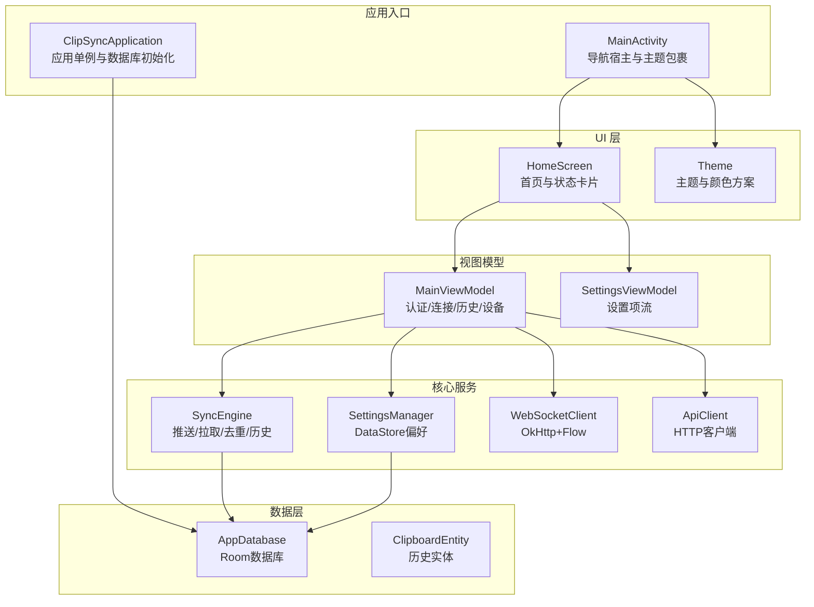
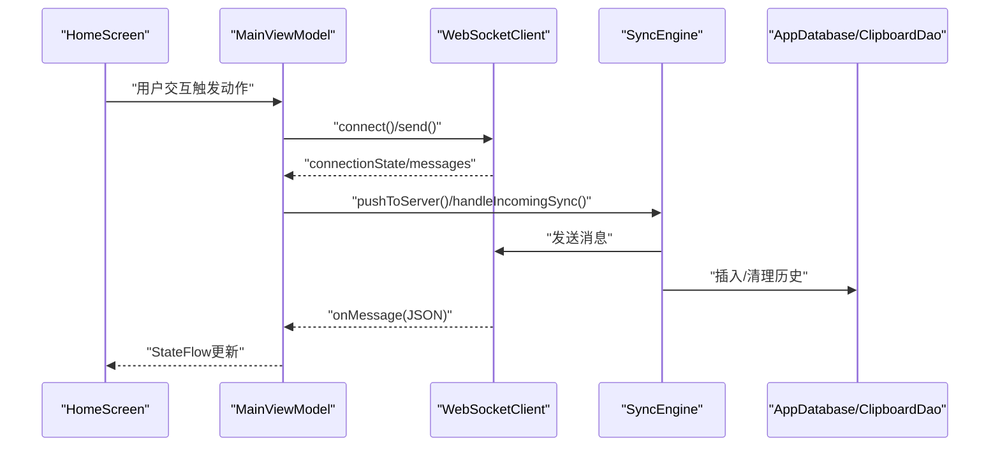
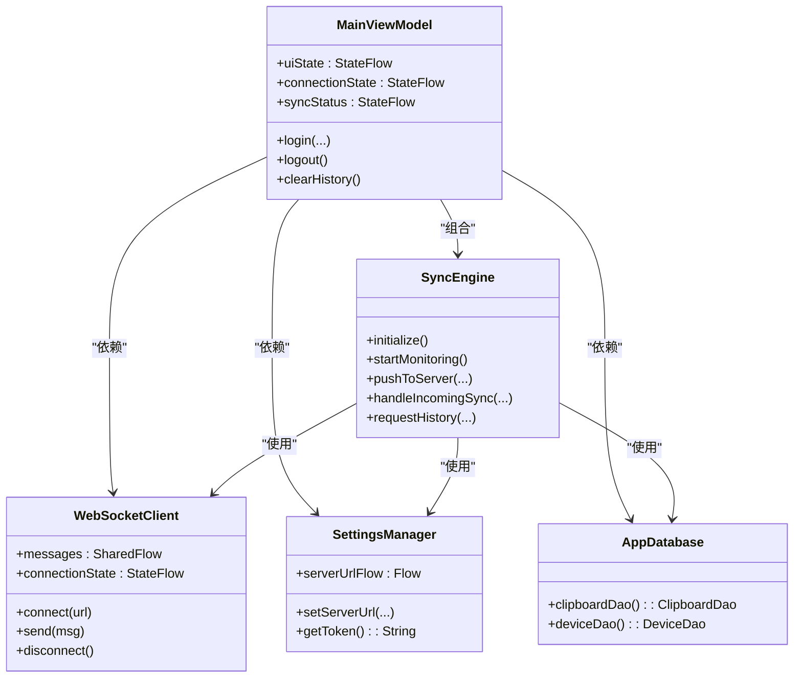
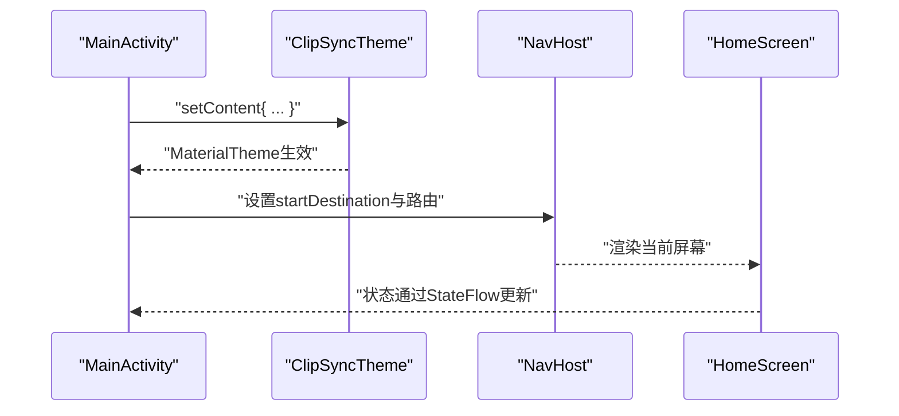
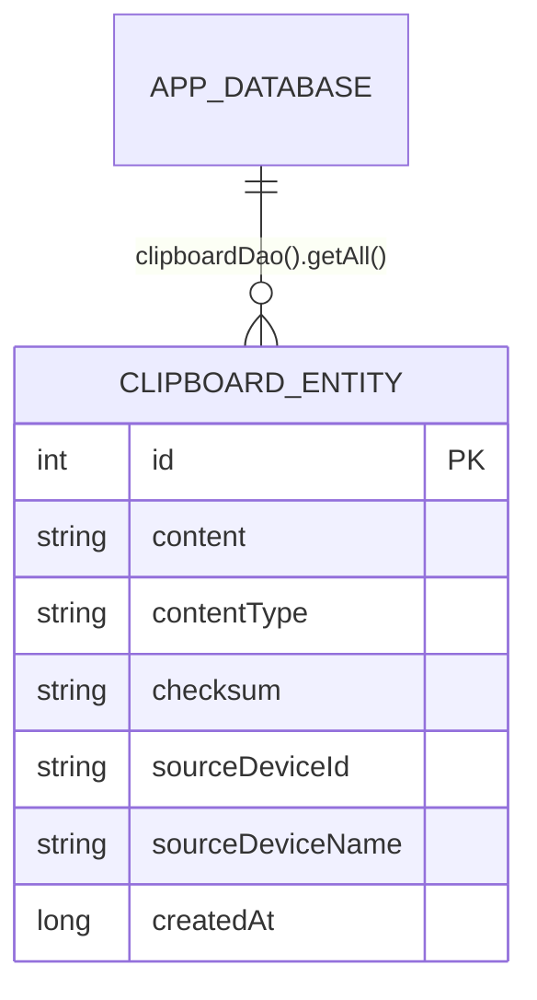
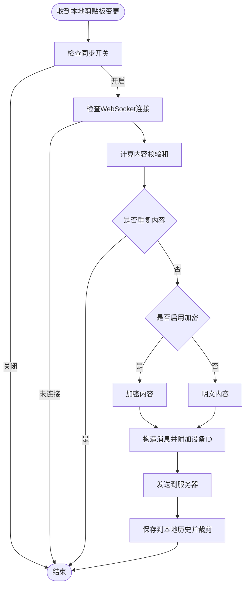
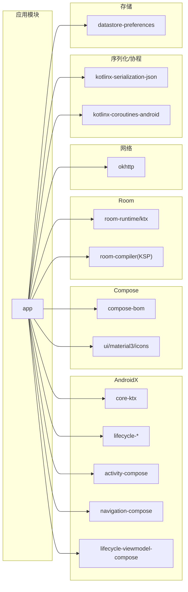

# Kotlin代码规范

<cite>
**本文引用的文件**
- [ClipSyncApplication.kt](file://clipSync-android/app/src/main/java/com/clipsync/app/ClipSyncApplication.kt)
- [MainActivity.kt](file://clipSync-android/app/src/main/java/com/clipsync/app/MainActivity.kt)
- [MainViewModel.kt](file://clipSync-android/app/src/main/java/com/clipsync/app/viewmodel/MainViewModel.kt)
- [SettingsViewModel.kt](file://clipSync-android/app/src/main/java/com/clipsync/app/viewmodel/SettingsViewModel.kt)
- [HomeScreen.kt](file://clipSync-android/app/src/main/java/com/clipsync/app/ui/screens/HomeScreen.kt)
- [Theme.kt](file://clipSync-android/app/src/main/java/com/clipsync/app/ui/theme/Theme.kt)
- [AppDatabase.kt](file://clipSync-android/app/src/main/java/com/clipsync/app/data/AppDatabase.kt)
- [ClipboardEntity.kt](file://clipSync-android/app/src/main/java/com/clipsync/app/data/entities/ClipboardEntity.kt)
- [WebSocketClient.kt](file://clipSync-android/app/src/main/java/com/clipsync/app/network/WebSocketClient.kt)
- [SyncEngine.kt](file://clipSync-android/app/src/main/java/com/clipsync/app/core/SyncEngine.kt)
- [SettingsManager.kt](file://clipSync-android/app/src/main/java/com/clipsync/app/core/SettingsManager.kt)
- [ApiClient.kt](file://clipSync-android/app/src/main/java/com/clipsync/app/network/ApiClient.kt)
- [app/build.gradle.kts](file://clipSync-android/app/build.gradle.kts)
- [settings.gradle.kts](file://clipSync-android/settings.gradle.kts)
- [gradle.properties](file://clipSync-android/gradle.properties)
</cite>

## 目录
1. [引言](#引言)
2. [项目结构](#项目结构)
3. [核心组件](#核心组件)
4. [架构总览](#架构总览)
5. [组件详解](#组件详解)
6. [依赖关系分析](#依赖关系分析)
7. [性能与内存优化](#性能与内存优化)
8. [故障排查指南](#故障排查指南)
9. [结论](#结论)
10. [附录：Kotlin编码规范要点](#附录kotlin编码规范要点)

## 引言
本文件面向Android/Kotlin开发者，系统化梳理clipSync-android项目的Kotlin编码规范与工程实践，覆盖以下主题：
- 编码风格与命名约定
- 协程与异步处理
- Jetpack Compose UI开发规范
- MVVM架构落地
- Room数据库与数据层设计
- 网络通信（OkHttp + WebSocket）与消息协议
- Gradle构建配置与依赖管理
- Kotlin特性最佳实践（空安全、扩展函数、数据类、作用域函数）
- 工具链与静态分析建议
- 响应式编程与内存优化
- 常见问题与性能瓶颈定位

## 项目结构
clipSync-android采用标准Android应用结构，按功能域分包组织：
- core：业务核心组件（剪贴板监听、加密、同步引擎、设置管理）
- data：Room数据库与实体
- network：网络客户端与WebSocket封装
- ui：Compose UI屏幕与主题
- viewmodel：MVVM视图模型
- 入口：Application、Activity

图表来源
- [ClipSyncApplication.kt:10-25](file://clipSync-android/app/src/main/java/com/clipsync/app/ClipSyncApplication.kt#L10-L25)
- [MainActivity.kt:26-42](file://clipSync-android/app/src/main/java/com/clipsync/app/MainActivity.kt#L26-L42)
- [HomeScreen.kt:62-270](file://clipSync-android/app/src/main/java/com/clipsync/app/ui/screens/HomeScreen.kt#L62-L270)
- [Theme.kt:88-116](file://clipSync-android/app/src/main/java/com/clipsync/app/ui/theme/Theme.kt#L88-L116)
- [MainViewModel.kt:39-81](file://clipSync-android/app/src/main/java/com/clipsync/app/viewmodel/MainViewModel.kt#L39-L81)
- [SettingsViewModel.kt:17-41](file://clipSync-android/app/src/main/java/com/clipsync/app/viewmodel/SettingsViewModel.kt#L17-L41)
- [SyncEngine.kt:27-50](file://clipSync-android/app/src/main/java/com/clipsync/app/core/SyncEngine.kt#L27-L50)
- [SettingsManager.kt:21-40](file://clipSync-android/app/src/main/java/com/clipsync/app/core/SettingsManager.kt#L21-L40)
- [WebSocketClient.kt:26-44](file://clipSync-android/app/src/main/java/com/clipsync/app/network/WebSocketClient.kt#L26-L44)
- [ApiClient.kt:14-32](file://clipSync-android/app/src/main/java/com/clipsync/app/network/ApiClient.kt#L14-L32)
- [AppDatabase.kt:14-39](file://clipSync-android/app/src/main/java/com/clipsync/app/data/AppDatabase.kt#L14-L39)
- [ClipboardEntity.kt:9-19](file://clipSync-android/app/src/main/java/com/clipsync/app/data/entities/ClipboardEntity.kt#L9-L19)

章节来源
- [MainActivity.kt:26-42](file://clipSync-android/app/src/main/java/com/clipsync/app/MainActivity.kt#L26-L42)
- [settings.gradle.kts:16-17](file://clipSync-android/settings.gradle.kts#L16-L17)

## 核心组件
- 应用入口与全局资源
  - 应用单例持有数据库实例，提供懒加载与全局访问能力
  - 参考路径：[ClipSyncApplication.kt:10-25](file://clipSync-android/app/src/main/java/com/clipsync/app/ClipSyncApplication.kt#L10-L25)
- 导航与主题
  - Activity作为Compose根，使用NavHost承载多屏导航
  - 主题通过Material3动态色与自定义色彩方案统一视觉
  - 参考路径：[MainActivity.kt:26-42](file://clipSync-android/app/src/main/java/com/clipsync/app/MainActivity.kt#L26-L42)、[Theme.kt:88-116](file://clipSync-android/app/src/main/java/com/clipsync/app/ui/theme/Theme.kt#L88-L116)
- 视图模型（MVVM）
  - MainViewModel集中管理认证、连接、同步、历史与设备列表；SettingsViewModel负责设置项的读写
  - 使用StateFlow暴露不可变状态，viewModelScope进行协程调度
  - 参考路径：[MainViewModel.kt:39-81](file://clipSync-android/app/src/main/java/com/clipsync/app/viewmodel/MainViewModel.kt#L39-L81)、[SettingsViewModel.kt:17-41](file://clipSync-android/app/src/main/java/com/clipsync/app/viewmodel/SettingsViewModel.kt#L17-L41)
- 数据层
  - AppDatabase声明实体与DAO接口；ClipboardEntity定义历史字段
  - 参考路径：[AppDatabase.kt:14-39](file://clipSync-android/app/src/main/java/com/clipsync/app/data/AppDatabase.kt#L14-L39)、[ClipboardEntity.kt:9-19](file://clipSync-android/app/src/main/java/com/clipsync/app/data/entities/ClipboardEntity.kt#L9-L19)
- 网络与同步
  - WebSocketClient基于OkHttp，使用SharedFlow/StateFlow管理消息与连接状态
  - SyncEngine负责推送去重、加解密、回显防护与历史入库
  - 参考路径：[WebSocketClient.kt:26-44](file://clipSync-android/app/src/main/java/com/clipsync/app/network/WebSocketClient.kt#L26-L44)、[SyncEngine.kt:27-50](file://clipSync-android/app/src/main/java/com/clipsync/app/core/SyncEngine.kt#L27-L50)
- 设置与偏好
  - SettingsManager使用DataStore Preferences持久化配置，提供Flow驱动的响应式读取
  - 参考路径：[SettingsManager.kt:21-40](file://clipSync-android/app/src/main/java/com/clipsync/app/core/SettingsManager.kt#L21-L40)
- HTTP客户端
  - ApiClient以序列化库为基础，封装常用HTTP方法，统一错误处理
  - 参考路径：[ApiClient.kt:14-32](file://clipSync-android/app/src/main/java/com/clipsync/app/network/ApiClient.kt#L14-L32)

章节来源
- [ClipSyncApplication.kt:10-25](file://clipSync-android/app/src/main/java/com/clipsync/app/ClipSyncApplication.kt#L10-L25)
- [MainActivity.kt:26-42](file://clipSync-android/app/src/main/java/com/clipsync/app/MainActivity.kt#L26-L42)
- [MainViewModel.kt:39-81](file://clipSync-android/app/src/main/java/com/clipsync/app/viewmodel/MainViewModel.kt#L39-L81)
- [SettingsViewModel.kt:17-41](file://clipSync-android/app/src/main/java/com/clipsync/app/viewmodel/SettingsViewModel.kt#L17-L41)
- [AppDatabase.kt:14-39](file://clipSync-android/app/src/main/java/com/clipsync/app/data/AppDatabase.kt#L14-L39)
- [ClipboardEntity.kt:9-19](file://clipSync-android/app/src/main/java/com/clipsync/app/data/entities/ClipboardEntity.kt#L9-L19)
- [WebSocketClient.kt:26-44](file://clipSync-android/app/src/main/java/com/clipsync/app/network/WebSocketClient.kt#L26-L44)
- [SyncEngine.kt:27-50](file://clipSync-android/app/src/main/java/com/clipsync/app/core/SyncEngine.kt#L27-L50)
- [SettingsManager.kt:21-40](file://clipSync-android/app/src/main/java/com/clipsync/app/core/SettingsManager.kt#L21-L40)
- [ApiClient.kt:14-32](file://clipSync-android/app/src/main/java/com/clipsync/app/network/ApiClient.kt#L14-L32)

## 架构总览
下图展示从UI到网络与数据层的调用关系与数据流。

图表来源
- [HomeScreen.kt:62-270](file://clipSync-android/app/src/main/java/com/clipsync/app/ui/screens/HomeScreen.kt#L62-L270)
- [MainViewModel.kt:95-157](file://clipSync-android/app/src/main/java/com/clipsync/app/viewmodel/MainViewModel.kt#L95-L157)
- [WebSocketClient.kt:26-44](file://clipSync-android/app/src/main/java/com/clipsync/app/network/WebSocketClient.kt#L26-L44)
- [SyncEngine.kt:72-160](file://clipSync-android/app/src/main/java/com/clipsync/app/core/SyncEngine.kt#L72-L160)
- [AppDatabase.kt:14-39](file://clipSync-android/app/src/main/java/com/clipsync/app/data/AppDatabase.kt#L14-L39)

## 组件详解

### 视图模型与状态管理（MainViewModel）
- 状态建模
  - 使用密封类表达UI状态与连接/同步状态，保证类型安全与可穷举处理
  - 参考路径：[MainViewModel.kt:353-358](file://clipSync-android/app/src/main/java/com/clipsync/app/viewmodel/MainViewModel.kt#L353-L358)、[SyncEngine.kt:244-249](file://clipSync-android/app/src/main/java/com/clipsync/app/core/SyncEngine.kt#L244-L249)
- 订阅与收集
  - 通过viewModelScope启动协程，使用collectLatest订阅Flow，避免泄漏
  - 参考路径：[MainViewModel.kt:118-142](file://clipSync-android/app/src/main/java/com/clipsync/app/viewmodel/MainViewModel.kt#L118-L142)
- 异步与错误处理
  - 使用fold处理Result，统一错误提示与状态更新
  - 参考路径：[MainViewModel.kt:219-236](file://clipSync-android/app/src/main/java/com/clipsync/app/viewmodel/MainViewModel.kt#L219-L236)
- 生命周期与资源释放
  - onCleared中停止监听与断开连接，确保资源回收
  - 参考路径：[MainViewModel.kt:338-343](file://clipSync-android/app/src/main/java/com/clipsync/app/viewmodel/MainViewModel.kt#L338-L343)

图表来源
- [MainViewModel.kt:39-81](file://clipSync-android/app/src/main/java/com/clipsync/app/viewmodel/MainViewModel.kt#L39-L81)
- [SyncEngine.kt:27-50](file://clipSync-android/app/src/main/java/com/clipsync/app/core/SyncEngine.kt#L27-L50)
- [WebSocketClient.kt:26-44](file://clipSync-android/app/src/main/java/com/clipsync/app/network/WebSocketClient.kt#L26-L44)
- [SettingsManager.kt:21-40](file://clipSync-android/app/src/main/java/com/clipsync/app/core/SettingsManager.kt#L21-L40)
- [AppDatabase.kt:14-39](file://clipSync-android/app/src/main/java/com/clipsync/app/data/AppDatabase.kt#L14-L39)

章节来源
- [MainViewModel.kt:39-81](file://clipSync-android/app/src/main/java/com/clipsync/app/viewmodel/MainViewModel.kt#L39-L81)
- [MainViewModel.kt:205-271](file://clipSync-android/app/src/main/java/com/clipsync/app/viewmodel/MainViewModel.kt#L205-L271)
- [MainViewModel.kt:338-343](file://clipSync-android/app/src/main/java/com/clipsync/app/viewmodel/MainViewModel.kt#L338-L343)

### Compose UI与主题
- 导航与状态绑定
  - 使用rememberNavController与NavHost建立路由；通过collectAsStateWithLifecycle将ViewModel状态注入UI
  - 参考路径：[MainActivity.kt:44-138](file://clipSync-android/app/src/main/java/com/clipsync/app/MainActivity.kt#L44-L138)
- 首页布局与状态卡片
  - HomeScreen展示连接与同步状态卡片，使用脉冲动画与Material3组件
  - 参考路径：[HomeScreen.kt:62-270](file://clipSync-android/app/src/main/java/com/clipsync/app/ui/screens/HomeScreen.kt#L62-L270)
- 主题与动态色
  - ClipSyncTheme根据系统深浅模式与动态色生成色彩方案，并设置状态栏外观
  - 参考路径：[Theme.kt:88-116](file://clipSync-android/app/src/main/java/com/clipsync/app/ui/theme/Theme.kt#L88-L116)

图表来源
- [MainActivity.kt:33-41](file://clipSync-android/app/src/main/java/com/clipsync/app/MainActivity.kt#L33-L41)
- [Theme.kt:88-116](file://clipSync-android/app/src/main/java/com/clipsync/app/ui/theme/Theme.kt#L88-L116)
- [HomeScreen.kt:62-270](file://clipSync-android/app/src/main/java/com/clipsync/app/ui/screens/HomeScreen.kt#L62-L270)

章节来源
- [MainActivity.kt:44-138](file://clipSync-android/app/src/main/java/com/clipsync/app/MainActivity.kt#L44-L138)
- [HomeScreen.kt:62-270](file://clipSync-android/app/src/main/java/com/clipsync/app/ui/screens/HomeScreen.kt#L62-L270)
- [Theme.kt:88-116](file://clipSync-android/app/src/main/java/com/clipsync/app/ui/theme/Theme.kt#L88-L116)

### 数据层与Room
- 数据库与实体
  - AppDatabase声明实体与DAO；ClipboardEntity定义历史字段与默认值
  - 参考路径：[AppDatabase.kt:14-39](file://clipSync-android/app/src/main/java/com/clipsync/app/data/AppDatabase.kt#L14-L39)、[ClipboardEntity.kt:9-19](file://clipSync-android/app/src/main/java/com/clipsync/app/data/entities/ClipboardEntity.kt#L9-L19)
- DAO与查询
  - 历史列表在ViewModel中限制返回数量，避免过度占用内存
  - 参考路径：[MainViewModel.kt:129-133](file://clipSync-android/app/src/main/java/com/clipsync/app/viewmodel/MainViewModel.kt#L129-L133)

图表来源
- [ClipboardEntity.kt:9-19](file://clipSync-android/app/src/main/java/com/clipsync/app/data/entities/ClipboardEntity.kt#L9-L19)
- [AppDatabase.kt:14-39](file://clipSync-android/app/src/main/java/com/clipsync/app/data/AppDatabase.kt#L14-L39)

章节来源
- [AppDatabase.kt:14-39](file://clipSync-android/app/src/main/java/com/clipsync/app/data/AppDatabase.kt#L14-L39)
- [ClipboardEntity.kt:9-19](file://clipSync-android/app/src/main/java/com/clipsync/app/data/entities/ClipboardEntity.kt#L9-L19)
- [MainViewModel.kt:129-133](file://clipSync-android/app/src/main/java/com/clipsync/app/viewmodel/MainViewModel.kt#L129-L133)

### 网络与同步（WebSocket + HTTP）
- WebSocket客户端
  - 使用OkHttp与自定义WebSocketListener；通过SharedFlow广播消息，StateFlow反映连接状态
  - 参考路径：[WebSocketClient.kt:26-44](file://clipSync-android/app/src/main/java/com/clipsync/app/network/WebSocketClient.kt#L26-L44)
- 同步引擎
  - 推送前去重（校验和）、支持加解密、回显防护、历史入库与上限裁剪
  - 参考路径：[SyncEngine.kt:72-160](file://clipSync-android/app/src/main/java/com/clipsync/app/core/SyncEngine.kt#L72-L160)
- HTTP客户端
  - 使用序列化库与URL/HttpURLConnection封装，统一Result与错误处理
  - 参考路径：[ApiClient.kt:14-32](file://clipSync-android/app/src/main/java/com/clipsync/app/network/ApiClient.kt#L14-L32)

图表来源
- [SyncEngine.kt:72-123](file://clipSync-android/app/src/main/java/com/clipsync/app/core/SyncEngine.kt#L72-L123)

章节来源
- [WebSocketClient.kt:26-44](file://clipSync-android/app/src/main/java/com/clipsync/app/network/WebSocketClient.kt#L26-L44)
- [SyncEngine.kt:72-160](file://clipSync-android/app/src/main/java/com/clipsync/app/core/SyncEngine.kt#L72-L160)
- [ApiClient.kt:14-32](file://clipSync-android/app/src/main/java/com/clipsync/app/network/ApiClient.kt#L14-L32)

### 设置与偏好（DataStore）
- 偏好键与默认值
  - 使用Preferences键管理服务器地址、用户名、令牌、设备名、同步与加密开关等
  - 参考路径：[SettingsManager.kt:21-40](file://clipSync-android/app/src/main/java/com/clipsync/app/core/SettingsManager.kt#L21-L40)
- 流式读取与写入
  - 通过collectLatest在ViewModel中订阅设置变化，实现UI即时更新
  - 参考路径：[SettingsViewModel.kt:43-63](file://clipSync-android/app/src/main/java/com/clipsync/app/viewmodel/SettingsViewModel.kt#L43-L63)

章节来源
- [SettingsManager.kt:21-40](file://clipSync-android/app/src/main/java/com/clipsync/app/core/SettingsManager.kt#L21-L40)
- [SettingsViewModel.kt:43-63](file://clipSync-android/app/src/main/java/com/clipsync/app/viewmodel/SettingsViewModel.kt#L43-L63)

## 依赖关系分析
- 构建脚本与插件
  - 应用插件：Android应用、Kotlin、KSP、Serialization
  - Compose启用与BOM平台版本管理
  - 参考路径：[app/build.gradle.kts:1-102](file://clipSync-android/app/build.gradle.kts#L1-L102)
- 依赖矩阵（节选）
  - AndroidX：Core-KTX、Lifecycle、Activity-Compose、Navigation-Compose、ViewModel-Compose
  - Jetpack Compose：BOM、Material3、Icons
  - Room：runtime、ktx、compiler（KSP）
  - OkHttp：WebSocket
  - kotlinx.serialization：JSON
  - Coroutines：Android
  - DataStore：Preferences
  - 参考路径：[app/build.gradle.kts:57-101](file://clipSync-android/app/build.gradle.kts#L57-L101)

图表来源
- [app/build.gradle.kts:57-101](file://clipSync-android/app/build.gradle.kts#L57-L101)

章节来源
- [app/build.gradle.kts:1-102](file://clipSync-android/app/build.gradle.kts#L1-L102)
- [settings.gradle.kts:1-18](file://clipSync-android/settings.gradle.kts#L1-L18)
- [gradle.properties:1-2](file://clipSync-android/gradle.properties#L1-L2)

## 性能与内存优化
- 协程与调度
  - 使用Dispatchers.IO与SupervisorJob隔离异常；避免在主线程执行耗时操作
  - 参考路径：[WebSocketClient.kt:28](file://clipSync-android/app/src/main/java/com/clipsync/app/network/WebSocketClient.kt#L28)、[SyncEngine.kt:33](file://clipSync-android/app/src/main/java/com/clipsync/app/core/SyncEngine.kt#L33)
- Flow与背压
  - WebSocket消息使用SharedFlow缓冲容量；合理控制上游发射速率
  - 参考路径：[WebSocketClient.kt:33](file://clipSync-android/app/src/main/java/com/clipsync/app/network/WebSocketClient.kt#L33)
- 数据库与内存
  - 历史列表限制返回条数与定期裁剪，避免无限增长
  - 参考路径：[MainViewModel.kt:130-132](file://clipSync-android/app/src/main/java/com/clipsync/app/viewmodel/MainViewModel.kt#L130-L132)、[SyncEngine.kt:224-226](file://clipSync-android/app/src/main/java/com/clipsync/app/core/SyncEngine.kt#L224-L226)
- UI与重组
  - 使用collectAsStateWithLifecycle减少不必要重组；仅在需要时使用rememberSaveable
  - 参考路径：[MainActivity.kt:49-62](file://clipSync-android/app/src/main/java/com/clipsync/app/MainActivity.kt#L49-L62)、[HomeScreen.kt:71](file://clipSync-android/app/src/main/java/com/clipsync/app/ui/screens/HomeScreen.kt#L71)
- 构建与混淆
  - Release启用混淆与压缩；调试使用ui-tooling与ui-test-manifest
  - 参考路径：[app/build.gradle.kts:25-36](file://clipSync-android/app/build.gradle.kts#L25-L36)、[app/build.gradle.kts:98-100](file://clipSync-android/app/build.gradle.kts#L98-L100)

[本节为通用指导，无需列出具体文件来源]

## 故障排查指南
- WebSocket无法连接或频繁断开
  - 检查连接状态与重连处理器；确认URL与网络权限
  - 参考路径：[WebSocketClient.kt:83-103](file://clipSync-android/app/src/main/java/com/clipsync/app/network/WebSocketClient.kt#L83-L103)、[MainViewModel.kt:319-326](file://clipSync-android/app/src/main/java/com/clipsync/app/viewmodel/MainViewModel.kt#L319-L326)
- 认证失败或无令牌
  - 校验HTTP返回与Result分支；检查设置中的token与device_id
  - 参考路径：[MainViewModel.kt:219-236](file://clipSync-android/app/src/main/java/com/clipsync/app/viewmodel/MainViewModel.kt#L219-L236)、[SettingsManager.kt:95-112](file://clipSync-android/app/src/main/java/com/clipsync/app/core/SettingsManager.kt#L95-L112)
- 历史为空或未更新
  - 确认请求历史与消息解析；检查DAO插入与裁剪逻辑
  - 参考路径：[MainViewModel.kt:128-142](file://clipSync-android/app/src/main/java/com/clipsync/app/viewmodel/MainViewModel.kt#L128-L142)、[SyncEngine.kt:164-194](file://clipSync-android/app/src/main/java/com/clipsync/app/core/SyncEngine.kt#L164-L194)
- UI状态不同步
  - 确保使用collectAsStateWithLifecycle；避免直接修改MutableStateFlow
  - 参考路径：[MainActivity.kt:49-62](file://clipSync-android/app/src/main/java/com/clipsync/app/MainActivity.kt#L49-L62)

章节来源
- [WebSocketClient.kt:83-103](file://clipSync-android/app/src/main/java/com/clipsync/app/network/WebSocketClient.kt#L83-L103)
- [MainViewModel.kt:219-236](file://clipSync-android/app/src/main/java/com/clipsync/app/viewmodel/MainViewModel.kt#L219-L236)
- [SettingsManager.kt:95-112](file://clipSync-android/app/src/main/java/com/clipsync/app/core/SettingsManager.kt#L95-L112)
- [SyncEngine.kt:164-194](file://clipSync-android/app/src/main/java/com/clipsync/app/core/SyncEngine.kt#L164-L194)
- [MainActivity.kt:49-62](file://clipSync-android/app/src/main/java/com/clipsync/app/MainActivity.kt#L49-L62)

## 结论
本规范文档基于clipSync-android的实际代码，总结了Kotlin在Android端的工程化实践要点：以MVVM与Flow为核心的状态管理、以Compose为UI的声明式开发、以Room与DataStore为数据层的持久化策略、以及以OkHttp与WebSocket为通信层的实时同步。遵循本文档的编码风格、命名约定与最佳实践，有助于提升代码一致性、可维护性与运行效率。

[本节为总结性内容，无需列出具体文件来源]

## 附录：Kotlin编码规范要点
- 命名约定
  - 包名全小写；类/接口首字母大写；函数/属性驼峰；常量全大写
  - 参考路径：[MainActivity.kt:1](file://clipSync-android/app/src/main/java/com/clipsync/app/MainActivity.kt#L1)、[MainViewModel.kt:1](file://clipSync-android/app/src/main/java/com/clipsync/app/viewmodel/MainViewModel.kt#L1)
- 空安全
  - 明确可空类型；使用安全调用与Elvis运算符；避免强制解包
  - 参考路径：[MainViewModel.kt:72-73](file://clipSync-android/app/src/main/java/com/clipsync/app/viewmodel/MainViewModel.kt#L72-L73)
- 扩展函数
  - 将与领域相关的辅助逻辑放入扩展函数，保持核心类简洁
  - 参考路径：[SettingsManager.kt:15](file://clipSync-android/app/src/main/java/com/clipsync/app/core/SettingsManager.kt#L15)
- 数据类
  - 使用data class承载不可变数据；合理设置默认值
  - 参考路径：[ClipboardEntity.kt:10-19](file://clipSync-android/app/src/main/java/com/clipsync/app/data/entities/ClipboardEntity.kt#L10-L19)
- 作用域函数
  - 使用run/apply/let/also/with选择合适的作用域；避免深层嵌套
  - 参考路径：[SyncEngine.kt:144-148](file://clipSync-android/app/src/main/java/com/clipsync/app/core/SyncEngine.kt#L144-L148)
- 协程与异步
  - 明确Dispatcher；使用SupervisorJob隔离子任务；避免主线程阻塞
  - 参考路径：[WebSocketClient.kt:28](file://clipSync-android/app/src/main/java/com/clipsync/app/network/WebSocketClient.kt#L28)
- 响应式编程
  - 使用StateFlow/SharedFlow表达状态与事件；结合collectLatest避免泄漏
  - 参考路径：[MainViewModel.kt:118-142](file://clipSync-android/app/src/main/java/com/clipsync/app/viewmodel/MainViewModel.kt#L118-L142)
- Compose UI
  - 使用Material3组件；合理拆分可复用组件；避免重组抖动
  - 参考路径：[HomeScreen.kt:62-270](file://clipSync-android/app/src/main/java/com/clipsync/app/ui/screens/HomeScreen.kt#L62-L270)
- 工具链与静态分析
  - Gradle启用KSP与Serialization插件；在CI中集成Lint与KtLint
  - 参考路径：[app/build.gradle.kts:1-6](file://clipSync-android/app/build.gradle.kts#L1-L6)

章节来源
- [MainActivity.kt:1](file://clipSync-android/app/src/main/java/com/clipsync/app/MainActivity.kt#L1)
- [MainViewModel.kt:72-73](file://clipSync-android/app/src/main/java/com/clipsync/app/viewmodel/MainViewModel.kt#L72-L73)
- [SettingsManager.kt:15](file://clipSync-android/app/src/main/java/com/clipsync/app/core/SettingsManager.kt#L15)
- [ClipboardEntity.kt:10-19](file://clipSync-android/app/src/main/java/com/clipsync/app/data/entities/ClipboardEntity.kt#L10-L19)
- [WebSocketClient.kt:28](file://clipSync-android/app/src/main/java/com/clipsync/app/network/WebSocketClient.kt#L28)
- [MainViewModel.kt:118-142](file://clipSync-android/app/src/main/java/com/clipsync/app/viewmodel/MainViewModel.kt#L118-L142)
- [HomeScreen.kt:62-270](file://clipSync-android/app/src/main/java/com/clipsync/app/ui/screens/HomeScreen.kt#L62-L270)
- [app/build.gradle.kts:1-6](file://clipSync-android/app/build.gradle.kts#L1-L6)