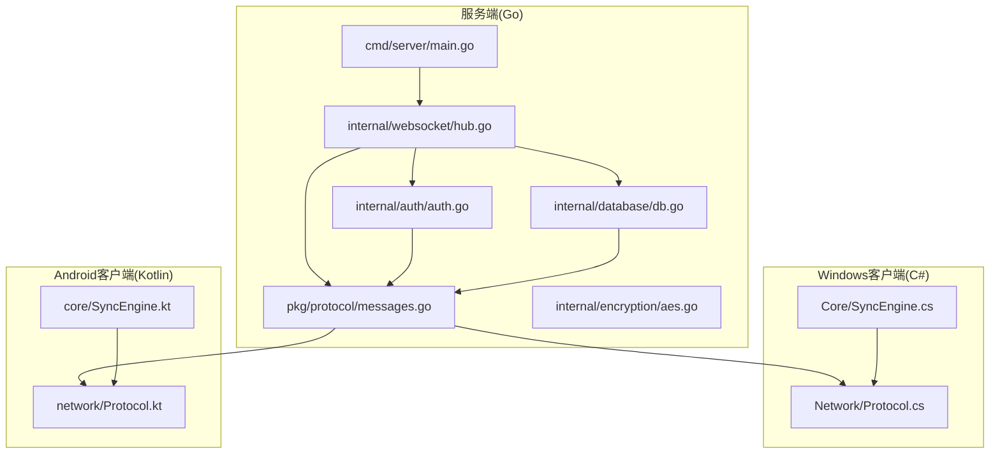
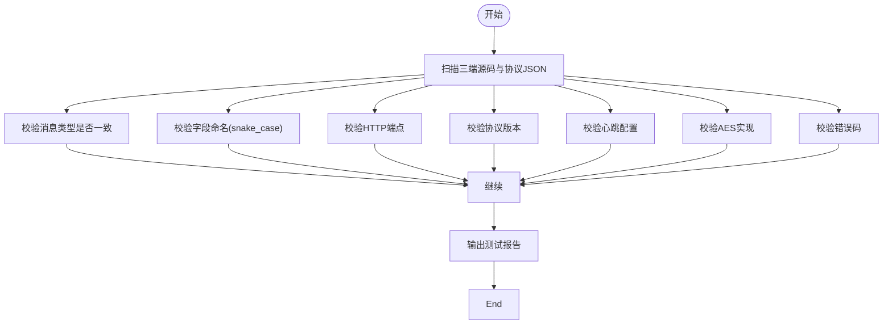
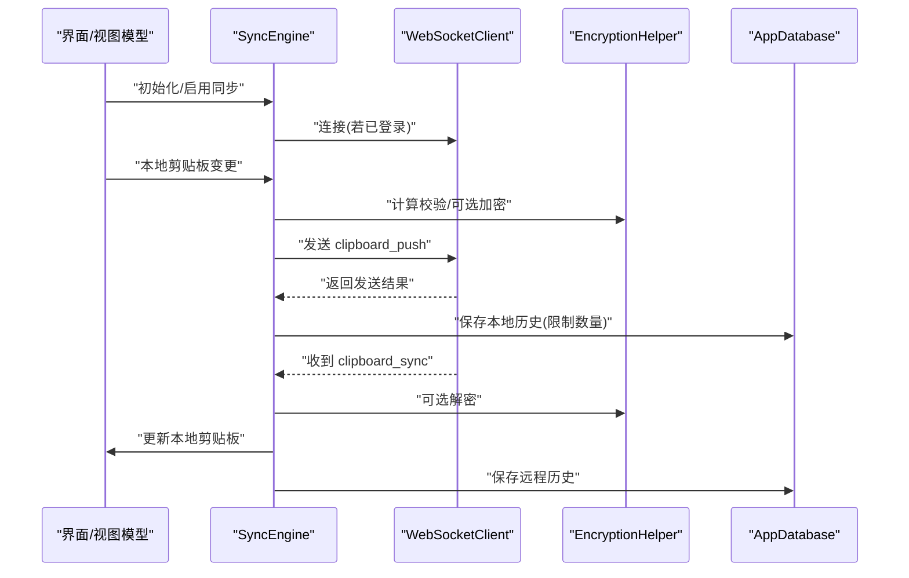
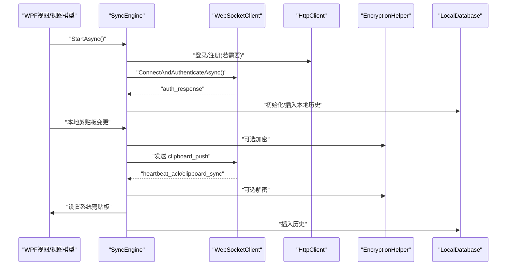
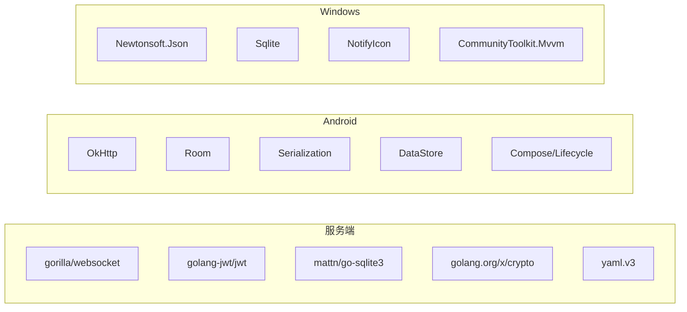

# 代码规范

<cite>
**本文引用的文件**   
- [DEVELOPMENT_PLAN.md](file://DEVELOPMENT_PLAN.md)
- [go.mod](file://clipSync-server/go.mod)
- [go.sum](file://clipSync-server/go.sum)
- [build.gradle.kts（根）](file://clipSync-android/build.gradle.kts)
- [build.gradle.kts（应用模块）](file://clipSync-android/app/build.gradle.kts)
- [ClipSync.WPF.csproj](file://clipSync-windows/ClipSync.WPF/ClipSync.WPF.csproj)
- [main.go](file://clipSync-server/cmd/server/main.go)
- [config.go](file://clipSync-server/internal/config/config.go)
- [auth.go](file://clipSync-server/internal/auth/auth.go)
- [db.go](file://clipSync-server/internal/database/db.go)
- [messages.go](file://clipSync-server/pkg/protocol/messages.go)
- [SyncEngine.kt（Android）](file://clipSync-android/app/src/main/java/com/clipsync/app/core/SyncEngine.kt)
- [Protocol.kt（Android）](file://clipSync-android/app/src/main/java/com/clipsync/app/network/Protocol.kt)
- [SyncEngine.cs（Windows）](file://clipSync-windows/ClipSync.WPF/Core/SyncEngine.cs)
- [Protocol.cs（Windows）](file://clipSync-windows/ClipSync.WPF/Network/Protocol.cs)
- [hub.go](file://clipSync-server/internal/websocket/hub.go)
- [aes.go](file://clipSync-server/internal/encryption/aes.go)
- [test-protocol-compatibility.ps1](file://scripts/test-protocol-compatibility.ps1)
</cite>

## 目录
1. [引言](#引言)
2. [项目结构](#项目结构)
3. [核心组件](#核心组件)
4. [架构总览](#架构总览)
5. [详细组件分析](#详细组件分析)
6. [依赖关系分析](#依赖关系分析)
7. [性能考虑](#性能考虑)
8. [故障排查指南](#故障排查指南)
9. [结论](#结论)
10. [附录](#附录)

## 引言
本文件面向ClipSync跨平台开发团队，系统化制定代码规范与最佳实践，覆盖Go服务端、Windows WPF客户端与Android Kotlin客户端。内容包括：跨平台代码风格与命名约定、注释标准、依赖与构建配置、协议一致性、加密与安全、错误处理与日志、性能优化、代码审查与静态分析、自动化检查流程，以及多语言协作规范。目标是统一风格、提升可读性与可维护性，并保障端到端功能的一致性。

## 项目结构
- 共享协议与规范：通过协议文档与脚本确保三端消息类型、字段命名、版本号、错误码一致。
- 服务端（Go）：采用分层架构（cmd/server入口、internal业务域、pkg共享协议、scripts工具），SQLite + WAL，限流与健康检查。
- 客户端（Windows）：WPF + MVVM，本地数据库缓存，系统托盘与开机自启动，基于接口的网络层。
- 客户端（Android）：Jetpack Compose + Room + 协程，OkHttp WebSocket，序列化与数据类。
- 脚本与测试：PowerShell兼容性测试脚本，验证消息类型、字段命名、HTTP端点、心跳、加密与错误码。



**图表来源**
- [main.go:1-146](file://clipSync-server/cmd/server/main.go#L1-L146)
- [hub.go:1-230](file://clipSync-server/internal/websocket/hub.go#L1-L230)
- [auth.go:1-137](file://clipSync-server/internal/auth/auth.go#L1-L137)
- [db.go:1-62](file://clipSync-server/internal/database/db.go#L1-L62)
- [messages.go:1-132](file://clipSync-server/pkg/protocol/messages.go#L1-L132)
- [aes.go:1-135](file://clipSync-server/internal/encryption/aes.go#L1-L135)
- [SyncEngine.cs:1-422](file://clipSync-windows/ClipSync.WPF/Core/SyncEngine.cs#L1-L422)
- [Protocol.cs:1-167](file://clipSync-windows/ClipSync.WPF/Network/Protocol.cs#L1-L167)
- [SyncEngine.kt:1-250](file://clipSync-android/app/src/main/java/com/clipsync/app/core/SyncEngine.kt#L1-L250)
- [Protocol.kt:1-263](file://clipSync-android/app/src/main/java/com/clipsync/app/network/Protocol.kt#L1-L263)

**章节来源**
- [DEVELOPMENT_PLAN.md:365-527](file://DEVELOPMENT_PLAN.md#L365-L527)

## 核心组件
- 服务端入口与路由：加载配置、初始化数据库与迁移、注册HTTP路由与WebSocket处理器、优雅关闭。
- 配置与校验：默认值与生产安全警告；环境变量覆盖路径。
- 认证与授权：用户/设备仓库、JWT签发与校验、中间件鉴权、速率限制。
- 数据库：SQLite连接、WAL模式、连接池与参数优化。
- 协议模型：统一的消息封装与各消息体定义，含版本号与时间戳。
- 加密：AES-256-CBC + PBKDF2，跨端兼容格式。
- 客户端同步引擎：去重、推送/拉取、历史管理、加解密、回显防护。
- 客户端协议编解码：消息枚举、序列化/反序列化、构造器。

**章节来源**
- [main.go:21-146](file://clipSync-server/cmd/server/main.go#L21-L146)
- [config.go:10-72](file://clipSync-server/internal/config/config.go#L10-L72)
- [auth.go:8-137](file://clipSync-server/internal/auth/auth.go#L8-L137)
- [db.go:17-62](file://clipSync-server/internal/database/db.go#L17-L62)
- [messages.go:5-132](file://clipSync-server/pkg/protocol/messages.go#L5-L132)
- [aes.go:22-135](file://clipSync-server/internal/encryption/aes.go#L22-L135)
- [SyncEngine.cs:32-422](file://clipSync-windows/ClipSync.WPF/Core/SyncEngine.cs#L32-L422)
- [SyncEngine.kt:27-250](file://clipSync-android/app/src/main/java/com/clipsync/app/core/SyncEngine.kt#L27-L250)
- [Protocol.cs:60-167](file://clipSync-windows/ClipSync.WPF/Network/Protocol.cs#L60-L167)
- [Protocol.kt:20-263](file://clipSync-android/app/src/main/java/com/clipsync/app/network/Protocol.kt#L20-L263)

## 架构总览
服务端作为中心枢纽，负责认证、设备与用户管理、剪贴板广播与历史查询；客户端通过WebSocket与HTTP与服务端交互，实现跨设备实时同步。协议与加密在三端保持一致，确保互操作性。

```mermaid
sequenceDiagram
participant Win as "Windows客户端"
participant And as "Android客户端"
participant Srv as "Go服务端"
participant Hub as "WebSocket Hub"
participant Repo as "数据库/仓库"
Win->>Srv : "HTTP 登录/注册"
Srv-->>Win : "返回token+device_id"
Win->>Srv : "WebSocket 认证"
Srv-->>Win : "认证响应"
Win->>Srv : "剪贴板推送"
Srv->>Hub : "广播消息"
Hub->>And : "剪贴板同步"
And->>Srv : "心跳/拉取历史"
Srv->>Repo : "写入/查询"
Repo-->>Srv : "结果"
```

**图表来源**
- [main.go:74-125](file://clipSync-server/cmd/server/main.go#L74-L125)
- [hub.go:61-121](file://clipSync-server/internal/websocket/hub.go#L61-L121)
- [auth.go:67-131](file://clipSync-server/internal/auth/auth.go#L67-L131)
- [SyncEngine.cs:73-163](file://clipSync-windows/ClipSync.WPF/Core/SyncEngine.cs#L73-L163)
- [SyncEngine.kt:72-160](file://clipSync-android/app/src/main/java/com/clipsync/app/core/SyncEngine.kt#L72-L160)

## 详细组件分析

### Go服务端规范
- 代码风格
  - 包名小写，结构体与方法首字母大写；错误通过fmt.Errorf包裹并携带上下文。
  - 日志使用短文件名与时间前缀，便于定位。
- 命名约定
  - 结构体：DB、Service、Hub等；常量使用全大写+下划线或驼峰（如Version）。
  - 方法：动词+名词（如Run、HandleWebSocket、Encrypt）。
- 注释标准
  - 包注释与导出类型/方法注释；复杂逻辑函数提供行为说明与边界条件。
- 错误处理
  - 统一错误包装与返回，避免丢弃错误上下文；对不可恢复错误进行致命日志。
- 性能与并发
  - 使用goroutine与select处理Hub主循环；客户端通道缓冲与断连清理。
- 配置与部署
  - YAML配置文件与环境变量覆盖；生产前检查默认密钥与过期时长。
- 依赖管理
  - go.mod声明JWT、WebSocket、SQLite、YAML与加密库；go.sum锁定版本。

**章节来源**
- [main.go:21-146](file://clipSync-server/cmd/server/main.go#L21-L146)
- [config.go:23-72](file://clipSync-server/internal/config/config.go#L23-L72)
- [db.go:17-62](file://clipSync-server/internal/database/db.go#L17-L62)
- [hub.go:61-121](file://clipSync-server/internal/websocket/hub.go#L61-L121)
- [go.mod:1-14](file://clipSync-server/go.mod#L1-L14)
- [go.sum:1-15](file://clipSync-server/go.sum#L1-L15)

### Windows WPF客户端规范（C#）
- 代码风格
  - 类型与成员首字母大写；事件驱动与异步方法命名清晰（StartAsync、Handle...）。
- 命名约定
  - 命名空间与项目根一致；类名语义明确（SyncEngine、WebSocketClient、Protocol）。
- 注释标准
  - 公共API与复杂流程添加XML注释；关键异常分支补充说明。
- 错误处理
  - 捕获异常并触发ErrorOccurred事件；对UI操作使用Dispatcher确保STA线程。
- 线程与并发
  - 后台任务与事件回调分离；WebSocket消息处理忽略无效负载，避免崩溃。
- 依赖与构建
  - NuGet包：NotifyIcon、Sqlite、CommunityToolkit.Mvvm、Newtonsoft.Json、System.Drawing。
- 协议与同步
  - Protocol类统一序列化/反序列化；SyncEngine负责去重、加解密与历史持久化。

**章节来源**
- [SyncEngine.cs:32-422](file://clipSync-windows/ClipSync.WPF/Core/SyncEngine.cs#L32-L422)
- [Protocol.cs:60-167](file://clipSync-windows/ClipSync.WPF/Network/Protocol.cs#L60-L167)
- [ClipSync.WPF.csproj:1-24](file://clipSync-windows/ClipSync.WPF/ClipSync.WPF.csproj#L1-L24)

### Android客户端规范（Kotlin）
- 代码风格
  - 文件与类名采用帕斯卡命名；数据类与密封类用于消息与状态。
- 命名约定
  - 包名com.clipsync.app；类名与目录层级对应（core、network、data、ui）。
- 注释标准
  - 关键函数与状态机（SyncStatus）添加简要说明；枚举与序列化字段使用SerialName映射。
- 错误处理
  - 序列化失败返回空；加密失败抛出异常并阻止发送未加密内容。
- 并发与生命周期
  - 协程作用域+IO调度器；StateFlow/Flow管理状态与事件；Room异步写入。
- 依赖与构建
  - Gradle插件：Android Application、Kotlin、KSP、Serialization；Compose、Lifecycle、Room、OkHttp、DataStore。
- 协议与同步
  - Protocol.kt定义消息枚举与序列化；SyncEngine.kt实现去重、加解密、历史写入与回显防护。

**章节来源**
- [SyncEngine.kt:27-250](file://clipSync-android/app/src/main/java/com/clipsync/app/core/SyncEngine.kt#L27-L250)
- [Protocol.kt:20-263](file://clipSync-android/app/src/main/java/com/clipsync/app/network/Protocol.kt#L20-L263)
- [build.gradle.kts（根）:1-8](file://clipSync-android/build.gradle.kts#L1-L8)
- [build.gradle.kts（应用模块）:57-102](file://clipSync-android/app/build.gradle.kts#L57-L102)

### 协议与加密一致性
- 协议模型
  - 服务端messages.go定义统一消息结构与常量；三端消息类型、字段命名与版本号保持一致。
- 加密规范
  - AES-256-CBC + PBKDF2（10000次迭代，SHA3-256派生），跨端兼容格式：base64(salt):base64(IV+ciphertext)。
- 自动化校验
  - PowerShell脚本扫描三端源码与协议JSON，验证消息类型、字段命名、HTTP端点、版本、心跳、加密与错误码。



**图表来源**
- [test-protocol-compatibility.ps1:52-164](file://scripts/test-protocol-compatibility.ps1#L52-L164)
- [messages.go:107-126](file://clipSync-server/pkg/protocol/messages.go#L107-L126)
- [Protocol.cs:60-167](file://clipSync-windows/ClipSync.WPF/Network/Protocol.cs#L60-L167)
- [Protocol.kt:20-170](file://clipSync-android/app/src/main/java/com/clipsync/app/network/Protocol.kt#L20-L170)
- [aes.go:22-58](file://clipSync-server/internal/encryption/aes.go#L22-L58)

**章节来源**
- [DEVELOPMENT_PLAN.md:18-362](file://DEVELOPMENT_PLAN.md#L18-L362)
- [test-protocol-compatibility.ps1:1-207](file://scripts/test-protocol-compatibility.ps1#L1-L207)
- [messages.go:5-132](file://clipSync-server/pkg/protocol/messages.go#L5-L132)
- [aes.go:22-135](file://clipSync-server/internal/encryption/aes.go#L22-L135)

### 同步引擎工作流（Android）


**图表来源**
- [SyncEngine.kt:43-250](file://clipSync-android/app/src/main/java/com/clipsync/app/core/SyncEngine.kt#L43-L250)
- [Protocol.kt:210-263](file://clipSync-android/app/src/main/java/com/clipsync/app/network/Protocol.kt#L210-L263)

**章节来源**
- [SyncEngine.kt:27-250](file://clipSync-android/app/src/main/java/com/clipsync/app/core/SyncEngine.kt#L27-L250)
- [Protocol.kt:20-263](file://clipSync-android/app/src/main/java/com/clipsync/app/network/Protocol.kt#L20-L263)

### 同步引擎工作流（Windows）


**图表来源**
- [SyncEngine.cs:32-422](file://clipSync-windows/ClipSync.WPF/Core/SyncEngine.cs#L32-L422)
- [Protocol.cs:60-167](file://clipSync-windows/ClipSync.WPF/Network/Protocol.cs#L60-L167)

**章节来源**
- [SyncEngine.cs:32-422](file://clipSync-windows/ClipSync.WPF/Core/SyncEngine.cs#L32-L422)
- [Protocol.cs:60-167](file://clipSync-windows/ClipSync.WPF/Network/Protocol.cs#L60-L167)

## 依赖关系分析
- 服务端外部依赖：JWT、WebSocket、SQLite驱动、YAML解析、加密工具集。
- Android依赖：Compose、Lifecycle、Room、OkHttp、Serialization、DataStore、协程。
- Windows依赖：NotifyIcon、Sqlite、CommunityToolkit.Mvvm、Newtonsoft.Json、System.Drawing。



**图表来源**
- [go.mod:5-11](file://clipSync-server/go.mod#L5-L11)
- [build.gradle.kts（应用模块）:57-102](file://clipSync-android/app/build.gradle.kts#L57-L102)
- [ClipSync.WPF.csproj:13-19](file://clipSync-windows/ClipSync.WPF/ClipSync.WPF.csproj#L13-L19)

**章节来源**
- [go.mod:1-14](file://clipSync-server/go.mod#L1-L14)
- [build.gradle.kts（应用模块）:57-102](file://clipSync-android/app/build.gradle.kts#L57-L102)
- [ClipSync.WPF.csproj:13-19](file://clipSync-windows/ClipSync.WPF/ClipSync.WPF.csproj#L13-L19)

## 性能考虑
- 服务端
  - SQLite WAL模式、连接池上限与空闲数、同步级别与缓存大小调优，适配2核2G服务器。
  - 心跳超时与客户端计数，避免僵尸连接。
- 客户端
  - Android：Room异步写入、协程IO调度；去重减少重复推送。
  - Windows：UI线程与STA约束，避免阻塞；WebSocket缓冲队列与断连清理。
- 通用
  - 大对象上传走HTTP文件接口；剪贴板内容按需加密，避免不必要的CPU消耗。

**章节来源**
- [db.go:17-62](file://clipSync-server/internal/database/db.go#L17-L62)
- [hub.go:136-153](file://clipSync-server/internal/websocket/hub.go#L136-L153)
- [SyncEngine.kt:72-123](file://clipSync-android/app/src/main/java/com/clipsync/app/core/SyncEngine.kt#L72-L123)
- [SyncEngine.cs:95-125](file://clipSync-windows/ClipSync.WPF/Core/SyncEngine.cs#L95-L125)

## 故障排查指南
- 协议不一致
  - 使用PowerShell脚本扫描三端源码与协议JSON，定位缺失类型、字段命名差异、HTTP端点不一致、版本不符、心跳未实现、加密未覆盖、错误码缺失。
- 连接与认证
  - 检查服务端日志与配置；确认WebSocket升级失败原因；验证JWT签名与过期时间。
- 加密问题
  - 确认跨端加密格式一致；检查盐与IV生成、PBKDF2迭代次数与哈希算法。
- 客户端行为
  - Android：关注去重与回显防护；Kotlin序列化失败返回空；加密失败阻止发送。
  - Windows：UI线程调用剪贴板；异常捕获后触发错误事件。

**章节来源**
- [test-protocol-compatibility.ps1:52-164](file://scripts/test-protocol-compatibility.ps1#L52-L164)
- [hub.go:182-208](file://clipSync-server/internal/websocket/hub.go#L182-L208)
- [aes.go:22-106](file://clipSync-server/internal/encryption/aes.go#L22-L106)
- [SyncEngine.kt:85-122](file://clipSync-android/app/src/main/java/com/clipsync/app/core/SyncEngine.kt#L85-L122)
- [SyncEngine.cs:117-125](file://clipSync-windows/ClipSync.WPF/Core/SyncEngine.cs#L117-L125)

## 结论
通过统一的协议与加密规范、严格的依赖与构建配置、完善的错误处理与日志策略，以及自动化兼容性测试，ClipSync在Go服务端与两端客户端之间实现了高一致性与可维护性。建议持续执行协议兼容性测试，强化静态分析与代码审查，确保跨平台同步稳定可靠。

## 附录

### 代码审查标准
- 协议一致性：消息类型、字段命名、版本号、错误码必须与协议文档一致。
- 错误处理：所有外部调用需捕获并记录错误，必要时向上抛出带上下文的错误。
- 可读性：函数职责单一、变量命名清晰、注释简洁准确。
- 安全性：生产配置不得使用默认密钥；敏感信息不落盘；加密失败不允许降级为明文。
- 性能：避免阻塞UI线程；合理使用协程与连接池；控制历史条目上限。

### 静态分析与自动化检查
- 协议兼容性：PowerShell脚本定期运行，覆盖消息类型、字段、端点、版本、心跳、加密与错误码。
- 构建与依赖：Gradle与NuGet包锁定版本；Go依赖由go.mod/go.sum管理。
- 日志与告警：服务端启动阶段打印配置与安全警告；客户端异常通过事件上报。

**章节来源**
- [test-protocol-compatibility.ps1:1-207](file://scripts/test-protocol-compatibility.ps1#L1-L207)
- [go.mod:1-14](file://clipSync-server/go.mod#L1-L14)
- [go.sum:1-15](file://clipSync-server/go.sum#L1-L15)
- [config.go:57-71](file://clipSync-server/internal/config/config.go#L57-L71)