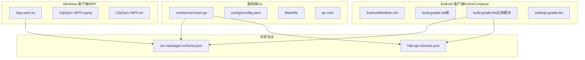
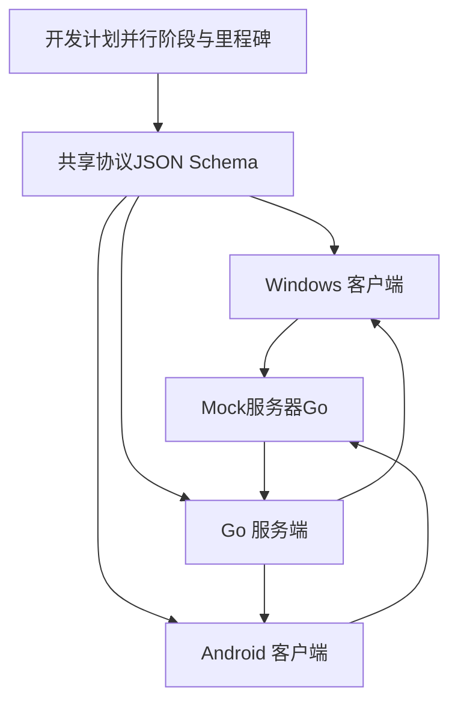
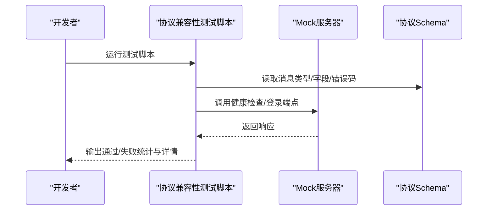
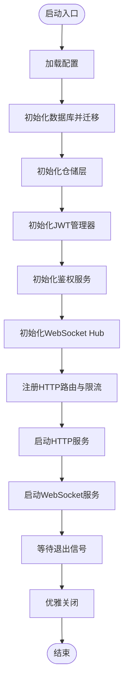
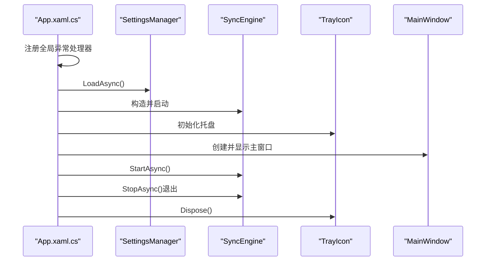
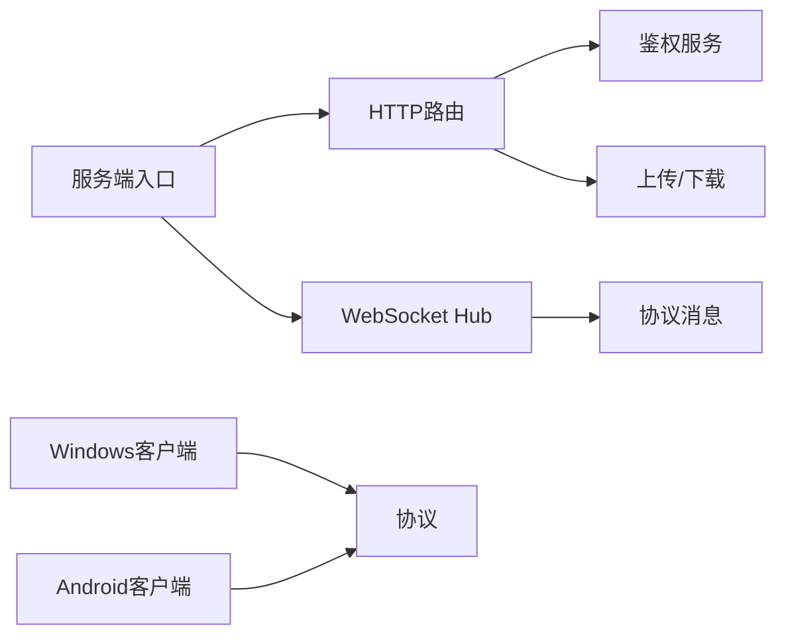

# 开发工作流程

<cite>
**本文引用的文件**
- [DEVELOPMENT_PLAN.md](file://DEVELOPMENT_PLAN.md)
- [Makefile](file://clipSync-server/Makefile)
- [go.mod](file://clipSync-server/go.mod)
- [main.go](file://clipSync-server/cmd/server/main.go)
- [config.yaml](file://clipSync-server/configs/config.yaml)
- [build.gradle.kts（根）](file://clipSync-android/build.gradle.kts)
- [build.gradle.kts（应用模块）](file://clipSync-android/app/build.gradle.kts)
- [settings.gradle.kts](file://clipSync-android/settings.gradle.kts)
- [AndroidManifest.xml](file://clipSync-android/app/src/main/AndroidManifest.xml)
- [ClipSync.WPF.csproj](file://clipSync-windows/ClipSync.WPF/ClipSync.WPF.csproj)
- [ClipSync.WPF.sln](file://clipSync-windows/ClipSync.WPF.sln)
- [App.xaml.cs](file://clipSync-windows/ClipSync.WPF/App.xaml.cs)
- [test-protocol-compatibility.ps1](file://scripts/test-protocol-compatibility.ps1)
- [ws-messages.schema.json](file://protocol/ws-messages.schema.json)
- [http-api.schema.json](file://protocol/http-api.schema.json)
- [InstallationLog.txt](file://InstallationLog.txt)
</cite>

## 目录
1. [引言](#引言)
2. [项目结构](#项目结构)
3. [核心组件](#核心组件)
4. [架构总览](#架构总览)
5. [详细组件分析](#详细组件分析)
6. [依赖分析](#依赖分析)
7. [性能考虑](#性能考虑)
8. [故障排查指南](#故障排查指南)
9. [结论](#结论)
10. [附录](#附录)

## 引言
本文件面向ClipSync项目的并行开发与协作，系统化梳理跨平台（Go服务端、Windows WPF客户端、Android客户端）的开发模式、代码审查流程、持续集成策略、环境配置、构建脚本与部署流程，并给出协议一致性测试、质量门禁、性能监控与团队协作建议。目标是帮助新成员快速上手，同时为长期维护提供可执行的工作流规范。

## 项目结构
项目采用“多子仓库 + 协议共享”的组织方式：
- clipSync-server：Go实现的服务端，包含HTTP API与WebSocket服务、认证、数据库、迁移与加密等模块。
- clipSync-windows：Windows WPF客户端，包含剪贴板监听、同步引擎、网络层、UI与托盘集成等。
- clipSync-android：Android客户端，包含剪贴板监听、同步引擎、Room数据库、Compose UI与前台服务等。
- protocol：共享协议的JSON Schema定义，作为三端的“单一事实来源”。
- scripts：自动化测试脚本（协议兼容性测试）。
- 其他：开发计划文档、安装日志等辅助材料。

图表来源
- [main.go:1-146](file://clipSync-server/cmd/server/main.go#L1-L146)
- [config.yaml:1-29](file://clipSync-server/configs/config.yaml#L1-L29)
- [Makefile:1-33](file://clipSync-server/Makefile#L1-L33)
- [go.mod:1-14](file://clipSync-server/go.mod#L1-L14)
- [App.xaml.cs:1-66](file://clipSync-windows/ClipSync.WPF/App.xaml.cs#L1-L66)
- [ClipSync.WPF.csproj:1-24](file://clipSync-windows/ClipSync.WPF/ClipSync.WPF.csproj#L1-L24)
- [ClipSync.WPF.sln:1-20](file://clipSync-windows/ClipSync.WPF.sln#L1-L20)
- [AndroidManifest.xml:1-64](file://clipSync-android/app/src/main/AndroidManifest.xml#L1-L64)
- [build.gradle.kts（根）:1-8](file://clipSync-android/build.gradle.kts#L1-L8)
- [build.gradle.kts（应用模块）:1-102](file://clipSync-android/app/build.gradle.kts#L1-L102)
- [settings.gradle.kts:1-18](file://clipSync-android/settings.gradle.kts#L1-L18)
- [ws-messages.schema.json](file://protocol/ws-messages.schema.json)
- [http-api.schema.json](file://protocol/http-api.schema.json)

章节来源
- [DEVELOPMENT_PLAN.md:365-527](file://DEVELOPMENT_PLAN.md#L365-L527)

## 核心组件
- 协议与契约
  - 共享协议通过JSON Schema定义WebSocket消息与HTTP API契约，确保三端一致性。
  - 关键字段命名、消息类型、错误码均以协议为准。
- 服务端（Go）
  - 启动入口负责加载配置、初始化数据库与迁移、注册路由、启动HTTP与WebSocket服务。
  - 提供认证、设备管理、文件上传下载、健康检查等接口。
- 客户端（Windows）
  - 应用入口集中处理未捕获异常、初始化设置、托盘图标与主窗口，随后启动同步引擎。
  - 使用SQLite本地缓存、通知与系统托盘集成。
- 客户端（Android）
  - 使用OkHttp进行WebSocket与HTTP通信，Room持久化历史数据，Compose UI，前台服务与开机自启。
  - 权限清单覆盖网络、前台服务、开机广播等。

章节来源
- [DEVELOPMENT_PLAN.md:18-362](file://DEVELOPMENT_PLAN.md#L18-L362)
- [main.go:21-146](file://clipSync-server/cmd/server/main.go#L21-L146)
- [App.xaml.cs:12-63](file://clipSync-windows/ClipSync.WPF/App.xaml.cs#L12-L63)
- [AndroidManifest.xml:5-18](file://clipSync-android/app/src/main/AndroidManifest.xml#L5-L18)

## 架构总览
下图展示三端并行开发与集成的关键路径：协议驱动、Mock策略、端到端集成里程碑。

图表来源
- [DEVELOPMENT_PLAN.md:531-797](file://DEVELOPMENT_PLAN.md#L531-L797)
- [test-protocol-compatibility.ps1:1-207](file://scripts/test-protocol-compatibility.ps1#L1-L207)

## 详细组件分析

### 并行开发模式与阶段划分
- 阶段0：基础搭建（三端并行，零依赖）
  - 服务端：工程骨架、配置系统、SQLite连接、协议消息结构、Mock服务器。
  - Windows：工程骨架、协议类（C#）、Mock WebSocket、基础UI壳。
  - Android：工程骨架、协议类（Kotlin）、Mock配置、基础Compose壳。
- 阶段1：核心基础设施（三端并行）
  - 服务端：HTTP认证端点、JWT、SQLite模式与迁移、用户/设备模型、健康检查。
  - 客户端：系统剪贴板监听、本地设置存储、HTTP客户端（认证流程）、WebSocket骨架、AES-256加密助手。
- 阶段2：WebSocket与同步（三端并行）
  - 服务端：WebSocket Hub、消息路由/处理、WS鉴权中间件、心跳监控、剪贴板广播、自动重连。
  - 客户端：WS消息处理、心跳定时器（30秒）、自动重连、剪贴板推送与接收、本地历史缓存。
- 阶段3：功能与打磨（三端并行）
  - 服务端：文件上传/下载、设备管理API、限流、连接限制、日志与错误处理、WAL优化。
  - 客户端：系统托盘、开机自启、图像/文件支持、设备列表、设置与历史界面。
- 阶段4：集成与测试（收敛）
  - 三端共同完成端到端测试、跨平台同步验证、性能测试（双核服务器）、缺陷修复、安全审计。

章节来源
- [DEVELOPMENT_PLAN.md:531-581](file://DEVELOPMENT_PLAN.md#L531-L581)

### Mock/Stub 策略与接口优先
- Mock服务器（Go）：在本地8080/8081端口运行，模拟登录、WS连接、心跳、设备列表与剪贴板回显；支持延迟与错误注入。
- 客户端侧Mock：通过接口注入（DI）在开发时替换真实实现，便于离线测试与协议验证。
- Mock数据生成：生成包含剪贴板项与设备信息的示例数据，用于前端与交互测试。
- 接口优先：三端均围绕接口编程，避免直接依赖具体实现，降低耦合度。

章节来源
- [DEVELOPMENT_PLAN.md:583-714](file://DEVELOPMENT_PLAN.md#L583-L714)

### 协议一致性测试流程
- 脚本扫描三端源码与协议Schema，逐项校验：
  - WebSocket消息类型是否齐全
  - JSON字段命名一致性（snake_case）
  - HTTP端点存在性
  - 协议版本号
  - 心跳配置
  - 加密支持
  - 错误码定义
  - 健康检查与登录端点连通性
- 测试结果汇总输出，失败项定位缺失模块。

图表来源
- [test-protocol-compatibility.ps1:1-207](file://scripts/test-protocol-compatibility.ps1#L1-L207)

章节来源
- [test-protocol-compatibility.ps1:1-207](file://scripts/test-protocol-compatibility.ps1#L1-L207)

### 服务端启动与配置
- 启动流程要点
  - 日志格式化与版本打印
  - 配置加载（支持环境变量覆盖）
  - 数据库初始化与迁移
  - 仓储层初始化
  - JWT管理器与鉴权服务
  - WebSocket Hub与HTTP路由注册
  - 分别启动HTTP与WebSocket服务
  - 信号量优雅关闭
- 关键配置项
  - WS端口、HTTP端口、数据库路径、JWT密钥/过期时间、文件存储目录、最大文件大小、历史条数上限、心跳超时。

图表来源
- [main.go:21-146](file://clipSync-server/cmd/server/main.go#L21-L146)
- [config.yaml:1-29](file://clipSync-server/configs/config.yaml#L1-L29)

章节来源
- [main.go:21-146](file://clipSync-server/cmd/server/main.go#L21-L146)
- [config.yaml:1-29](file://clipSync-server/configs/config.yaml#L1-L29)

### Windows 客户端应用生命周期
- 全局异常处理：防止崩溃导致进程退出
- 初始化顺序：设置管理器 → 同步引擎 → 托盘图标 → 主窗口
- 行为控制：根据设置决定最小化到托盘
- 退出流程：停止同步、释放资源

图表来源
- [App.xaml.cs:12-63](file://clipSync-windows/ClipSync.WPF/App.xaml.cs#L12-L63)

章节来源
- [App.xaml.cs:12-63](file://clipSync-windows/ClipSync.WPF/App.xaml.cs#L12-L63)

### Android 客户端权限与构建配置
- 权限清单
  - 网络访问、前台服务、开机广播、通知等
- 构建配置
  - Gradle根脚本统一插件版本
  - 应用模块启用Compose、Room KSP、OkHttp、序列化、协程、DataStore等
  - 编译选项与打包排除
- 清单声明
  - 活动、服务、广播接收器等

章节来源
- [AndroidManifest.xml:5-64](file://clipSync-android/app/src/main/AndroidManifest.xml#L5-L64)
- [build.gradle.kts（根）:1-8](file://clipSync-android/build.gradle.kts#L1-L8)
- [build.gradle.kts（应用模块）:1-102](file://clipSync-android/app/build.gradle.kts#L1-L102)
- [settings.gradle.kts:1-18](file://clipSync-android/settings.gradle.kts#L1-L18)

### 服务端构建与测试（Makefile）
- 目标
  - build：编译二进制
  - build-linux：交叉编译Linux二进制
  - run：本地运行
  - deps：依赖整理
  - test：全量测试
  - clean：清理构建产物与数据目录
  - all：依赖整理后构建

章节来源
- [Makefile:1-33](file://clipSync-server/Makefile#L1-L33)

### 依赖与外部库
- 服务端依赖
  - JWT、WebSocket、SQLite驱动、加解密、YAML解析等
- Windows客户端依赖
  - WPF、SQLite、MVVM工具包、JSON序列化、系统托盘等
- Android客户端依赖
  - AndroidX、Compose、Room、OkHttp、协程、DataStore等

章节来源
- [go.mod:5-14](file://clipSync-server/go.mod#L5-L14)
- [ClipSync.WPF.csproj:13-19](file://clipSync-windows/ClipSync.WPF/ClipSync.WPF.csproj#L13-L19)
- [build.gradle.kts（应用模块）:57-101](file://clipSync-android/app/build.gradle.kts#L57-L101)

## 依赖分析
- 组件内聚与耦合
  - 服务端按职责分层（配置、鉴权、HTTP、WebSocket、数据库、加密），模块边界清晰。
  - 客户端通过接口与协议解耦，便于Mock替换与并行开发。
- 外部依赖
  - 服务端：gorilla/websocket、mattn/go-sqlite3、golang-jwt、golang.org/x/crypto、yaml.v3。
  - Windows：Microsoft.Data.Sqlite、CommunityToolkit.Mvvm、Newtonsoft.Json、NotifyIcon。
  - Android：OkHttp、Room、Compose、DataStore、协程、序列化。
- 可能的循环依赖
  - 当前结构以协议为“单一事实来源”，三端均依赖协议，不构成循环；服务端内部模块间无循环导入迹象。

图表来源
- [main.go:3-17](file://clipSync-server/cmd/server/main.go#L3-L17)
- [go.mod:5-14](file://clipSync-server/go.mod#L5-L14)

章节来源
- [go.mod:5-14](file://clipSync-server/go.mod#L5-L14)

## 性能考虑
- 服务端
  - SQLite WAL模式优化写入吞吐；心跳超时控制长连接占用；限流保护认证端点；历史条数上限控制内存与IO。
- 客户端
  - Windows：SQLite本地缓存，减少网络往返；托盘与最小化策略降低UI开销。
  - Android：Room异步读写、协程调度；前台服务与通知管理；Compose按需渲染。
- 并发与稳定性
  - 服务端双端口分离（HTTP/WS），独立超时配置；客户端30秒心跳维持连接活性；自动重连与断线恢复。

章节来源
- [config.yaml:24-29](file://clipSync-server/configs/config.yaml#L24-L29)
- [main.go:108-125](file://clipSync-server/cmd/server/main.go#L108-L125)

## 故障排查指南
- 协议不一致
  - 使用协议兼容性测试脚本定位缺失的消息类型、字段或错误码；对照协议Schema逐一修正。
- 认证失败
  - 检查JWT密钥与过期时间配置；确认HTTP登录返回token与device_id；验证WebSocket鉴权流程。
- 连接不稳定
  - 校验心跳间隔（30秒）与超时阈值（服务端默认90秒）；观察Mock服务器延迟与错误注入参数。
- 文件上传/下载异常
  - 检查最大文件大小限制与存储目录权限；确认上传后下载URL可用。
- Windows崩溃
  - 查看全局异常处理器输出；确认同步引擎与托盘资源释放顺序。
- Android权限问题
  - 确认清单中网络、前台服务、开机广播等权限已声明；前台服务类型与通知权限。

章节来源
- [test-protocol-compatibility.ps1:1-207](file://scripts/test-protocol-compatibility.ps1#L1-L207)
- [config.yaml:12-22](file://clipSync-server/configs/config.yaml#L12-L22)
- [App.xaml.cs:16-33](file://clipSync-windows/ClipSync.WPF/App.xaml.cs#L16-L33)
- [AndroidManifest.xml:5-18](file://clipSync-android/app/src/main/AndroidManifest.xml#L5-L18)

## 结论
ClipSync通过“协议即契约 + Mock策略 + 并行阶段”的开发模式，实现了三端零阻塞并行开发与可控集成。配合明确的里程碑、自动化测试与质量门禁，项目可在保证一致性的同时快速迭代。建议持续完善CI流水线、覆盖率与性能基线，强化跨平台回归测试与安全审计。

## 附录

### 开发环境配置与工具推荐
- 通用
  - Git（分支与提交规范）、VS Code/IntelliJ IDEA、Postman（API测试）、Docker（可选容器化）
- 服务端（Go）
  - Go 1.26+、Make命令、SQLite CLI（可选）
- Windows（WPF）
  - .NET 8、Visual Studio 2022、SQLite Browser（可选）
- Android
  - Android Studio、JDK 17、Android SDK/NDK、模拟器/真机调试

章节来源
- [go.mod:3](file://clipSync-server/go.mod#L3)
- [ClipSync.WPF.csproj:4-11](file://clipSync-windows/ClipSync.WPF/ClipSync.WPF.csproj#L4-L11)
- [build.gradle.kts（应用模块）:37-49](file://clipSync-android/app/build.gradle.kts#L37-L49)

### 构建脚本与部署流程
- 服务端
  - 本地开发：make run；测试：make test；打包：make build 或 make build-linux
  - 部署：将二进制与配置文件（config.yaml）部署至目标服务器，设置环境变量覆盖配置（如CLIPSYNC_CONFIG）
- Windows
  - 使用Visual Studio解决方案或dotnet CLI构建；生成的EXE与依赖随安装包分发
- Android
  - 使用Gradle构建APK/AAB；release类型启用混淆与签名；发布前进行混淆规则与权限校验

章节来源
- [Makefile:1-33](file://clipSync-server/Makefile#L1-L33)
- [config.yaml:27-28](file://clipSync-server/configs/config.yaml#L27-L28)
- [ClipSync.WPF.sln:1-20](file://clipSync-windows/ClipSync.WPF.sln#L1-L20)
- [build.gradle.kts（应用模块）:25-36](file://clipSync-android/app/build.gradle.kts#L25-L36)

### 代码审查与分支管理
- 代码审查标准
  - 协议一致性：所有变更必须与协议Schema保持一致
  - 可测试性：新增逻辑具备单元/集成测试覆盖
  - 可靠性：异常处理、资源释放、日志记录完整
  - 性能：避免阻塞UI/主线程；合理使用缓存与并发
- 分支管理策略
  - 主干保护：master/main仅允许合并PR
  - 功能分支：feature/前缀；修复分支：fix/前缀；平台分支：platform/android、platform/windows
  - PR要求：关联任务单、通过CI、至少一名Reviewer同意
- 版本发布流程
  - 里程碑评审（M1-M6）通过后，打标签并生成发布说明；服务端二进制与客户端APK/AAB归档

章节来源
- [DEVELOPMENT_PLAN.md:716-797](file://DEVELOPMENT_PLAN.md#L716-L797)

### 自动化测试与质量门禁
- 协议兼容性测试：每次变更后运行脚本，确保三端消息类型、字段、错误码与端点一致
- 单元测试：服务端使用go test；Windows与Android分别使用各自框架
- 集成测试：Mock服务器 + 端到端场景（认证、WS连接、剪贴板同步、设备管理、文件传输）
- 质量门禁：CI中强制执行测试、覆盖率阈值与静态分析

章节来源
- [test-protocol-compatibility.ps1:1-207](file://scripts/test-protocol-compatibility.ps1#L1-L207)
- [Makefile:22-24](file://clipSync-server/Makefile#L22-L24)

### 性能监控与运维
- 服务端指标：连接数、请求QPS、错误率、数据库查询耗时、内存占用
- 客户端指标：心跳丢失率、重连次数、本地缓存命中率、前台服务CPU/内存
- 运维建议：双核2G云服务器起步，WAL模式与历史上限调优；定期备份数据库与文件存储

章节来源
- [config.yaml:24-29](file://clipSync-server/configs/config.yaml#L24-L29)
- [main.go:108-125](file://clipSync-server/cmd/server/main.go#L108-L125)

### 团队协作与沟通
- 技术决策
  - 采用接口优先与Mock策略，降低耦合；协议先行，避免实现分歧
- 项目管理
  - 每周同步各平台进度，记录阻塞问题与风险；里程碑节点进行跨平台联调
- 新成员入职
  - 准备环境脚手架（Go/VS/.NET/Android Studio）；提供协议与Mock服务器使用说明；安排导师与结对伙伴

章节来源
- [DEVELOPMENT_PLAN.md:531-581](file://DEVELOPMENT_PLAN.md#L531-L581)
- [InstallationLog.txt:1-8](file://InstallationLog.txt#L1-L8)