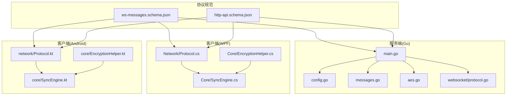
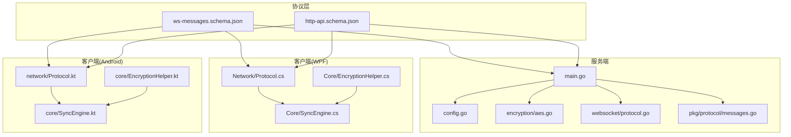
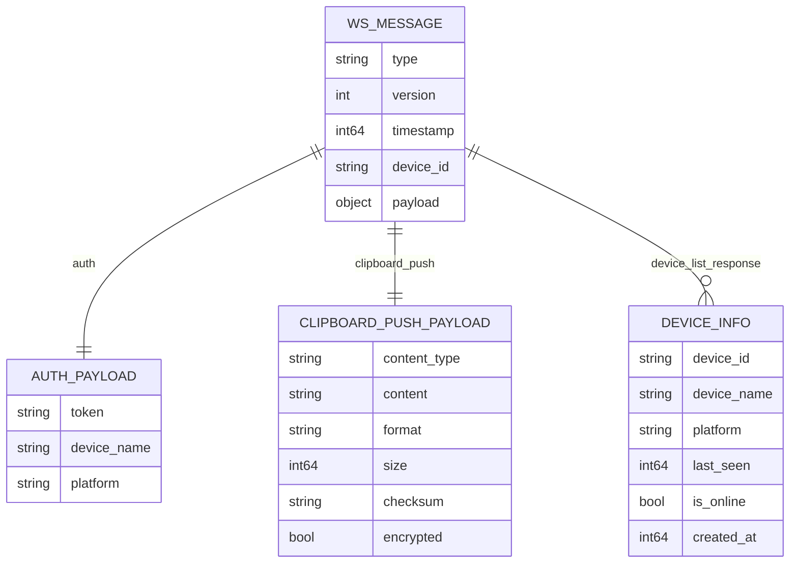
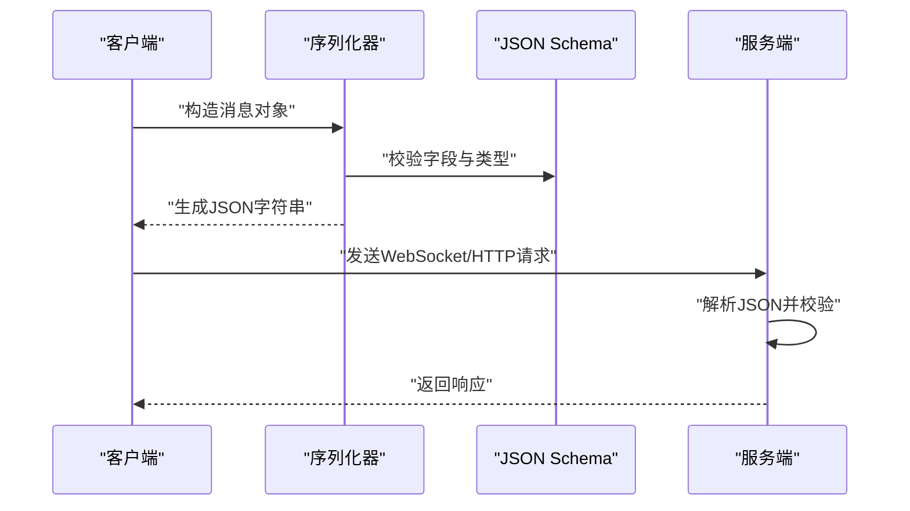
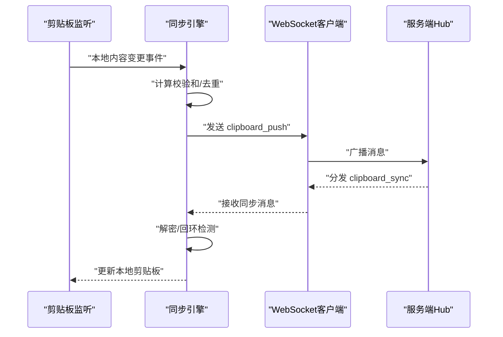
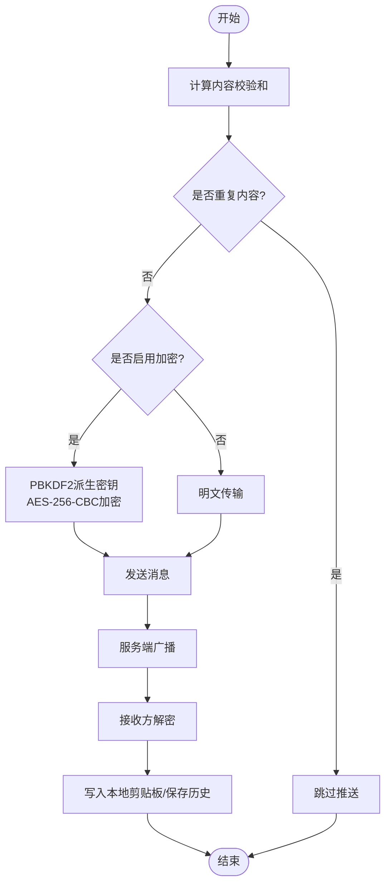
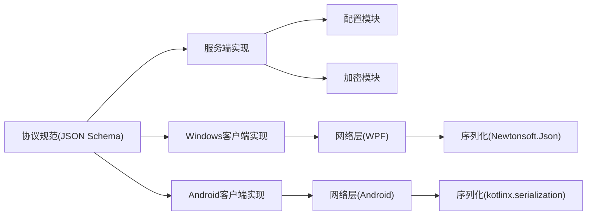

# 跨平台一致性规范

<cite>
**本文档引用的文件**
- [ws-messages.schema.json](file://protocol/ws-messages.schema.json)
- [http-api.schema.json](file://protocol/http-api.schema.json)
- [DEVELOPMENT_PLAN.md](file://DEVELOPMENT_PLAN.md)
- [test-protocol-compatibility.ps1](file://scripts/test-protocol-compatibility.ps1)
- [messages.go](file://clipSync-server/pkg/protocol/messages.go)
- [protocol.go](file://clipSync-server/internal/websocket/protocol.go)
- [config.go](file://clipSync-server/internal/config/config.go)
- [main.go](file://clipSync-server/cmd/server/main.go)
- [Protocol.cs](file://clipSync-windows/ClipSync.WPF/Network/Protocol.cs)
- [SyncEngine.cs](file://clipSync-windows/ClipSync.WPF/Core/SyncEngine.cs)
- [EncryptionHelper.cs](file://clipSync-windows/ClipSync.WPF/Core/EncryptionHelper.cs)
- [Protocol.kt](file://clipSync-android/app/src/main/java/com/clipsync/app/network/Protocol.kt)
- [SyncEngine.kt](file://clipSync-android/app/src/main/java/com/clipsync/app/core/SyncEngine.kt)
- [aes.go](file://clipSync-server/internal/encryption/aes.go)
</cite>

## 目录
1. [引言](#引言)
2. [项目结构](#项目结构)
3. [核心组件](#核心组件)
4. [架构总览](#架构总览)
5. [详细组件分析](#详细组件分析)
6. [依赖关系分析](#依赖关系分析)
7. [性能考量](#性能考量)
8. [故障排查指南](#故障排查指南)
9. [结论](#结论)
10. [附录](#附录)

## 引言
本规范旨在系统化阐述 ClipSync 在 Go 服务器、Windows WPF 客户端与 Android 客户端之间保持代码与行为一致性的策略与标准。通过对协议规范（WebSocket 消息与 HTTP API）、数据模型、序列化约定、错误码体系以及加密算法的统一设计，结合自动化测试与版本控制策略，确保三端在功能、性能与用户体验上的一致性。

## 项目结构
项目采用“协议先行”的并行开发模式：以 JSON Schema 作为协议规范的单一事实来源，三端分别实现各自的网络层、序列化与业务编排模块，通过 Mock 服务器与自动化脚本进行早期集成验证。

图表来源
- [main.go:1-146](file://clipSync-server/cmd/server/main.go#L1-L146)
- [config.go:1-72](file://clipSync-server/internal/config/config.go#L1-L72)
- [messages.go:1-132](file://clipSync-server/pkg/protocol/messages.go#L1-L132)
- [protocol.go:1-27](file://clipSync-server/internal/websocket/protocol.go#L1-L27)
- [aes.go:1-135](file://clipSync-server/internal/encryption/aes.go#L1-L135)
- [Protocol.cs:1-167](file://clipSync-windows/ClipSync.WPF/Network/Protocol.cs#L1-L167)
- [SyncEngine.cs:1-422](file://clipSync-windows/ClipSync.WPF/Core/SyncEngine.cs#L1-L422)
- [EncryptionHelper.cs:1-134](file://clipSync-windows/ClipSync.WPF/Core/EncryptionHelper.cs#L1-L134)
- [Protocol.kt:1-263](file://clipSync-android/app/src/main/java/com/clipsync/app/network/Protocol.kt#L1-L263)
- [SyncEngine.kt:1-250](file://clipSync-android/app/src/main/java/com/clipsync/app/core/SyncEngine.kt#L1-L250)

章节来源
- [DEVELOPMENT_PLAN.md:1-929](file://DEVELOPMENT_PLAN.md#L1-L929)

## 核心组件
- 协议规范：以 JSON Schema 描述 WebSocket 消息与 HTTP API 的字段、取值范围与响应契约，确保三端对消息结构与语义达成一致。
- 数据模型：服务端使用结构体承载消息与数据库实体；客户端使用类或数据类映射消息与本地存储模型。
- 序列化与反序列化：服务端使用标准库 JSON；Windows 使用 Newtonsoft.Json；Android 使用 kotlinx.serialization。
- 加密与校验：统一采用 PBKDF2 + AES-256-CBC + PKCS7 填充，加密输出格式为 base64(salt):base64(IV+ciphertext)，并使用 SHA-256 进行内容去重。
- 错误码与状态：HTTP 与 WebSocket 统一错误码，服务端在配置中提供安全默认值与校验告警。

章节来源
- [ws-messages.schema.json:1-261](file://protocol/ws-messages.schema.json#L1-L261)
- [http-api.schema.json:1-293](file://protocol/http-api.schema.json#L1-L293)
- [messages.go:1-132](file://clipSync-server/pkg/protocol/messages.go#L1-L132)
- [Protocol.cs:1-167](file://clipSync-windows/ClipSync.WPF/Network/Protocol.cs#L1-L167)
- [Protocol.kt:1-263](file://clipSync-android/app/src/main/java/com/clipsync/app/network/Protocol.kt#L1-L263)
- [aes.go:1-135](file://clipSync-server/internal/encryption/aes.go#L1-L135)

## 架构总览
下图展示三端在协议、序列化与业务编排层面的交互关系，以及服务端的配置与加密模块。

图表来源
- [main.go:1-146](file://clipSync-server/cmd/server/main.go#L1-L146)
- [config.go:1-72](file://clipSync-server/internal/config/config.go#L1-L72)
- [aes.go:1-135](file://clipSync-server/internal/encryption/aes.go#L1-L135)
- [protocol.go:1-27](file://clipSync-server/internal/websocket/protocol.go#L1-L27)
- [messages.go:1-132](file://clipSync-server/pkg/protocol/messages.go#L1-L132)
- [Protocol.cs:1-167](file://clipSync-windows/ClipSync.WPF/Network/Protocol.cs#L1-L167)
- [SyncEngine.cs:1-422](file://clipSync-windows/ClipSync.WPF/Core/SyncEngine.cs#L1-L422)
- [EncryptionHelper.cs:1-134](file://clipSync-windows/ClipSync.WPF/Core/EncryptionHelper.cs#L1-L134)
- [Protocol.kt:1-263](file://clipSync-android/app/src/main/java/com/clipsync/app/network/Protocol.kt#L1-L263)
- [SyncEngine.kt:1-250](file://clipSync-android/app/src/main/java/com/clipsync/app/core/SyncEngine.kt#L1-L250)

## 详细组件分析

### 协议规范与数据模型
- WebSocket 消息封装：统一的 envelope 包含 type、version、timestamp、device_id 与 payload 字段；payload 类型随消息类型变化。
- HTTP API 约定：明确请求/响应体字段、状态码与错误码映射，支持认证、设备管理与文件上传下载。
- 数据模型一致性：服务端结构体与客户端数据类均严格遵循 schema 中字段命名（snake_case）与枚举值。

图表来源
- [messages.go:1-132](file://clipSync-server/pkg/protocol/messages.go#L1-L132)
- [ws-messages.schema.json:1-261](file://protocol/ws-messages.schema.json#L1-L261)

章节来源
- [ws-messages.schema.json:1-261](file://protocol/ws-messages.schema.json#L1-L261)
- [http-api.schema.json:1-293](file://protocol/http-api.schema.json#L1-L293)
- [messages.go:1-132](file://clipSync-server/pkg/protocol/messages.go#L1-L132)

### 序列化与反序列化策略
- Go 服务端：使用标准库 JSON，消息结构体直接映射 schema 字段。
- Windows 客户端：Newtonsoft.Json，字段属性标注 JSON 名称映射，支持时间戳与可选字段。
- Android 客户端：kotlinx.serialization，枚举与字段名通过 SerialName 映射到 schema。

图表来源
- [Protocol.cs:60-167](file://clipSync-windows/ClipSync.WPF/Network/Protocol.cs#L60-L167)
- [Protocol.kt:12-34](file://clipSync-android/app/src/main/java/com/clipsync/app/network/Protocol.kt#L12-L34)
- [messages.go:5-12](file://clipSync-server/pkg/protocol/messages.go#L5-L12)
- [ws-messages.schema.json:1-45](file://protocol/ws-messages.schema.json#L1-L45)

章节来源
- [Protocol.cs:1-167](file://clipSync-windows/ClipSync.WPF/Network/Protocol.cs#L1-L167)
- [Protocol.kt:1-263](file://clipSync-android/app/src/main/java/com/clipsync/app/network/Protocol.kt#L1-L263)
- [messages.go:1-132](file://clipSync-server/pkg/protocol/messages.go#L1-L132)

### 同步引擎与消息处理
- Windows 同步引擎：负责连接建立、认证、心跳、去重、历史保存与剪贴板设置；对加密内容进行解密后再写入剪贴板。
- Android 同步引擎：基于协程与 Flow，处理推送、去重、解密与本地数据库持久化；支持历史拉取与回环避免。

图表来源
- [SyncEngine.cs:95-267](file://clipSync-windows/ClipSync.WPF/Core/SyncEngine.cs#L95-L267)
- [SyncEngine.kt:72-160](file://clipSync-android/app/src/main/java/com/clipsync/app/core/SyncEngine.kt#L72-L160)

章节来源
- [SyncEngine.cs:1-422](file://clipSync-windows/ClipSync.WPF/Core/SyncEngine.cs#L1-L422)
- [SyncEngine.kt:1-250](file://clipSync-android/app/src/main/java/com/clipsync/app/core/SyncEngine.kt#L1-L250)

### 加密与去重机制
- 统一加密：PBKDF2-SHA3 或 PBKDF2-SHA256 + AES-256-CBC + PKCS7，输出格式 base64(salt):base64(IV+ciphertext)。
- 内容去重：使用 SHA-256 计算 checksum，服务端与客户端均进行重复内容过滤，避免循环与冗余传输。

图表来源
- [aes.go:22-106](file://clipSync-server/internal/encryption/aes.go#L22-L106)
- [EncryptionHelper.cs:30-103](file://clipSync-windows/ClipSync.WPF/Core/EncryptionHelper.cs#L30-L103)
- [SyncEngine.cs:108-124](file://clipSync-windows/ClipSync.WPF/Core/SyncEngine.cs#L108-L124)
- [SyncEngine.kt:86-104](file://clipSync-android/app/src/main/java/com/clipsync/app/core/SyncEngine.kt#L86-L104)

章节来源
- [aes.go:1-135](file://clipSync-server/internal/encryption/aes.go#L1-L135)
- [EncryptionHelper.cs:1-134](file://clipSync-windows/ClipSync.WPF/Core/EncryptionHelper.cs#L1-L134)
- [SyncEngine.cs:95-125](file://clipSync-windows/ClipSync.WPF/Core/SyncEngine.cs#L95-L125)
- [SyncEngine.kt:72-104](file://clipSync-android/app/src/main/java/com/clipsync/app/core/SyncEngine.kt#L72-L104)

### 配置管理与安全默认
- 服务端配置：端口、JWT 密钥与过期时间、文件存储路径、最大文件大小、历史条数限制、心跳超时等。
- 安全校验：对默认密钥与过期时间给出生产环境警告，建议用户在部署前修改。

章节来源
- [config.go:1-72](file://clipSync-server/internal/config/config.go#L1-L72)
- [main.go:21-71](file://clipSync-server/cmd/server/main.go#L21-L71)

## 依赖关系分析
- 协议规范是三端的共同依赖，所有实现必须与 schema 保持一致。
- 服务端依赖配置模块与加密模块，提供统一的错误码与健康检查。
- 客户端依赖各自的网络层与序列化库，通过抽象接口实现可替换性（Mock/Real）。

图表来源
- [ws-messages.schema.json:1-261](file://protocol/ws-messages.schema.json#L1-L261)
- [http-api.schema.json:1-293](file://protocol/http-api.schema.json#L1-L293)
- [config.go:1-72](file://clipSync-server/internal/config/config.go#L1-L72)
- [aes.go:1-135](file://clipSync-server/internal/encryption/aes.go#L1-L135)
- [Protocol.cs:1-167](file://clipSync-windows/ClipSync.WPF/Network/Protocol.cs#L1-L167)
- [Protocol.kt:1-263](file://clipSync-android/app/src/main/java/com/clipsync/app/network/Protocol.kt#L1-L263)

章节来源
- [DEVELOPMENT_PLAN.md:583-714](file://DEVELOPMENT_PLAN.md#L583-L714)

## 性能考量
- 心跳与超时：服务端配置心跳超时阈值，客户端定时发送心跳并处理 ack，保障长连接稳定性。
- 历史限制：服务端与客户端均限制历史条数，避免内存与带宽压力。
- 去重与压缩：基于 checksum 去重，大文件通过 HTTP 上传/下载，减少 WebSocket 负载。
- 并发模型：Android 使用协程与 IO 调度器，Windows 使用异步与 Dispatcher，降低 UI 阻塞风险。

章节来源
- [config.go:19-20](file://clipSync-server/internal/config/config.go#L19-L20)
- [SyncEngine.kt:199-203](file://clipSync-android/app/src/main/java/com/clipsync/app/core/SyncEngine.kt#L199-L203)
- [SyncEngine.cs:374-379](file://clipSync-windows/ClipSync.WPF/Core/SyncEngine.cs#L374-L379)

## 故障排查指南
- 协议兼容性测试：通过 PowerShell 脚本扫描三端源码，验证消息类型、字段命名、HTTP 端点、版本号、心跳与加密支持、错误码定义与健康检查连通性。
- 常见问题定位：
  - 消息类型缺失：检查各端是否包含 schema 中定义的所有 type。
  - 字段命名不一致：确认 snake_case 命名在三端一致。
  - 版本不匹配：核对协议版本常量与 schema。
  - 加密异常：确认密钥派生参数与输出格式一致。
  - 错误码不一致：比对服务端与 schema 的错误码集合。

章节来源
- [test-protocol-compatibility.ps1:1-207](file://scripts/test-protocol-compatibility.ps1#L1-L207)

## 结论
通过以 JSON Schema 为核心的协议规范、统一的数据模型与序列化策略、严格的加密与去重机制，以及自动化测试与配置校验，ClipSync 实现了跨平台一致性。该规范为后续扩展与维护提供了清晰的路径：任何变更需先更新协议规范，再同步到三端实现并通过兼容性测试。

## 附录

### 协议规范要点速查
- WebSocket 消息类型：auth、auth_response、heartbeat、heartbeat_ack、clipboard_push、clipboard_sync、clipboard_pull、clipboard_history、device_list、device_list_response、device_unregister、error、ping、pong。
- HTTP API 端点：/api/v1/auth/login、/api/v1/auth/register、/api/v1/auth/refresh、/api/v1/health、/api/v1/devices、/api/v1/upload、/api/v1/download/{file_id}。
- 错误码：AUTH_FAILED、TOKEN_EXPIRED、RATE_LIMITED、INVALID_PAYLOAD、CONTENT_TOO_LARGE、DEVICE_NOT_FOUND、INTERNAL_ERROR、DUPLICATE_CONTENT。

章节来源
- [ws-messages.schema.json:8-26](file://protocol/ws-messages.schema.json#L8-L26)
- [http-api.schema.json:7-279](file://protocol/http-api.schema.json#L7-L279)
- [DEVELOPMENT_PLAN.md:350-362](file://DEVELOPMENT_PLAN.md#L350-L362)