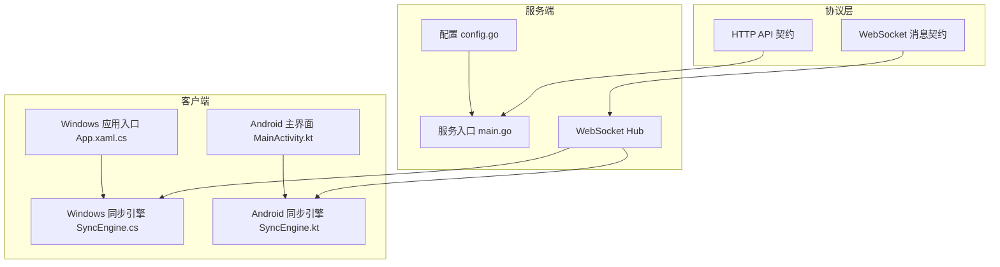
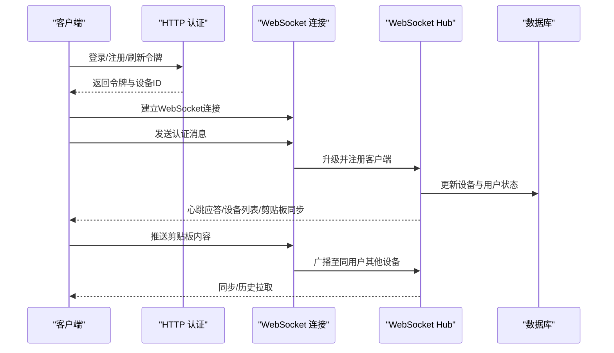
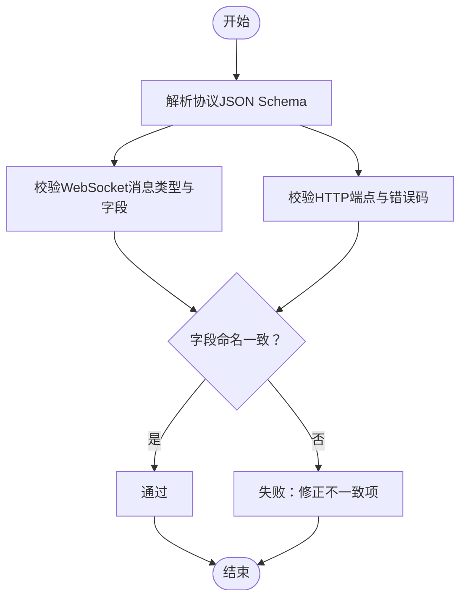
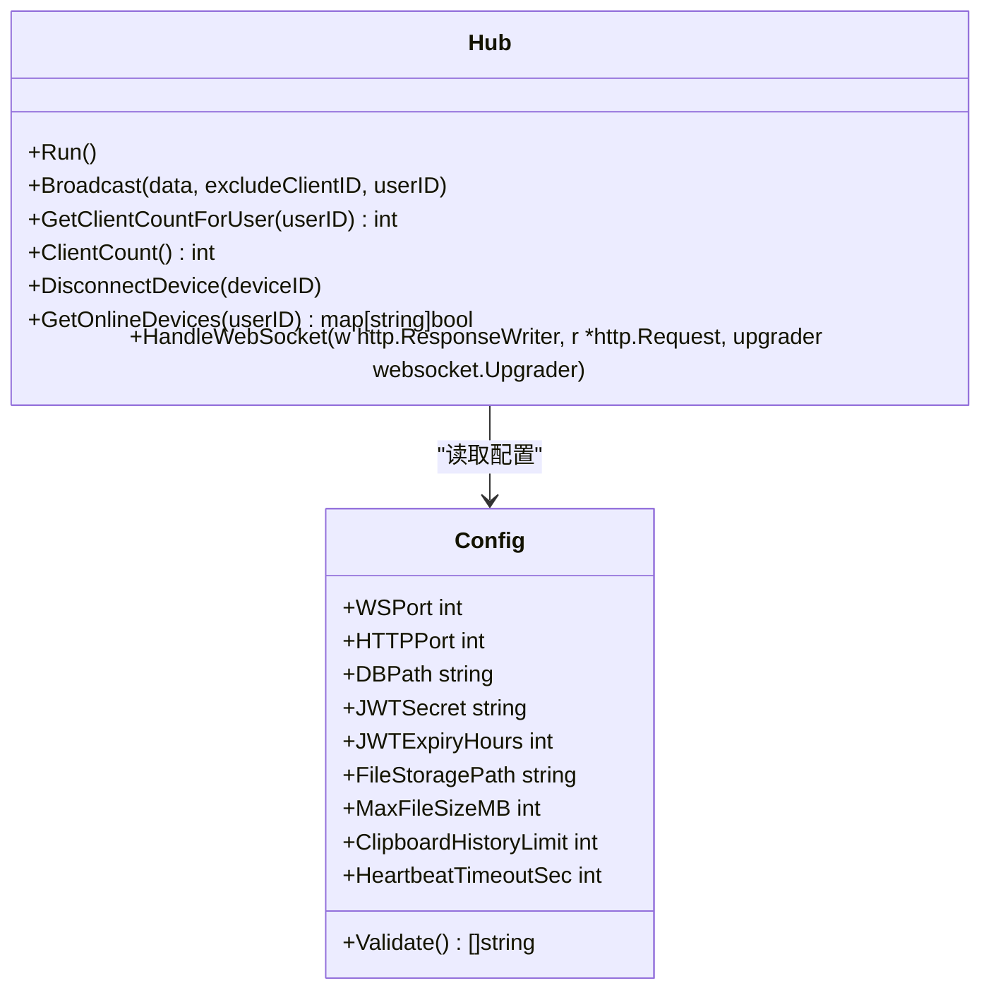
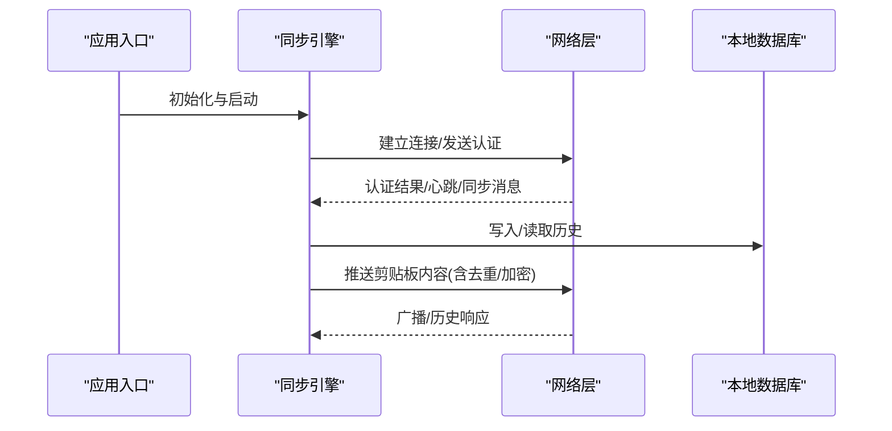
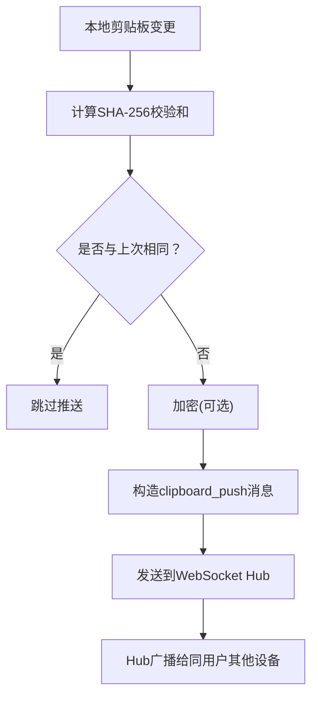
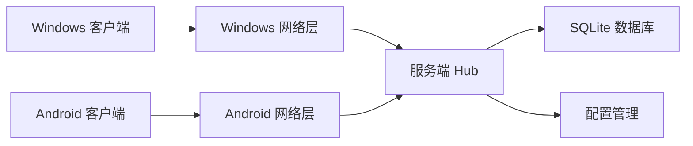

# 协作规范

<cite>
**本文引用的文件**
- [DEVELOPMENT_PLAN.md](file://DEVELOPMENT_PLAN.md)
- [main.go](file://clipSync-server/cmd/server/main.go)
- [hub.go](file://clipSync-server/internal/websocket/hub.go)
- [config.go](file://clipSync-server/internal/config/config.go)
- [http-api.schema.json](file://protocol/http-api.schema.json)
- [ws-messages.schema.json](file://protocol/ws-messages.schema.json)
- [test-protocol-compatibility.ps1](file://scripts/test-protocol-compatibility.ps1)
- [App.xaml.cs](file://clipSync-windows/ClipSync.WPF/App.xaml.cs)
- [SyncEngine.cs](file://clipSync-windows/ClipSync.WPF/Core/SyncEngine.cs)
- [MainActivity.kt](file://clipSync-android/app/src/main/java/com/clipsync/app/MainActivity.kt)
- [SyncEngine.kt](file://clipSync-android/app/src/main/java/com/clipsync/app/core/SyncEngine.kt)
- [EncryptionHelper.kt](file://clipSync-android/app/src/main/java/com/clipsync/app/core/EncryptionHelper.kt)
- [EncryptionHelper.cs](file://clipSync-windows/ClipSync.WPF/Core/EncryptionHelper.cs)
</cite>

## 目录
1. [引言](#引言)
2. [项目结构](#项目结构)
3. [核心组件](#核心组件)
4. [架构总览](#架构总览)
5. [详细组件分析](#详细组件分析)
6. [依赖关系分析](#依赖关系分析)
7. [性能考量](#性能考量)
8. [故障排查指南](#故障排查指南)
9. [结论](#结论)
10. [附录](#附录)

## 引言
本协作规范面向ClipSync跨平台团队，围绕“零阻塞并行开发”目标，系统化梳理三端（Go服务端、Windows WPF客户端、Android客户端）的开发轨道、协议与接口契约、集成里程碑、风险与应急策略，并给出远程协作、会议与文档管理建议。文档既适合初学者快速上手，也为资深工程师提供可落地的技术细节与可视化图示。

## 项目结构
ClipSync采用“协议先行、接口驱动”的并行开发模式：
- 协议层：统一的WebSocket消息与HTTP API契约，确保三端一致性。
- 服务端：Go实现的HTTP与WebSocket服务，负责认证、设备与剪贴板数据管理。
- 客户端：Windows WPF与Android分别实现本地剪贴板监听、消息编解码、心跳与重连、历史缓存等能力。
- 工具链：Mock服务器、协议兼容性测试脚本保障独立开发与早期集成验证。

图表来源
- [main.go:21-146](file://clipSync-server/cmd/server/main.go#L21-L146)
- [hub.go:18-230](file://clipSync-server/internal/websocket/hub.go#L18-L230)
- [config.go:10-72](file://clipSync-server/internal/config/config.go#L10-L72)
- [App.xaml.cs:12-66](file://clipSync-windows/ClipSync.WPF/App.xaml.cs#L12-L66)
- [SyncEngine.cs:32-422](file://clipSync-windows/ClipSync.WPF/Core/SyncEngine.cs#L32-L422)
- [MainActivity.kt:26-139](file://clipSync-android/app/src/main/java/com/clipsync/app/MainActivity.kt#L26-L139)
- [SyncEngine.kt:27-250](file://clipSync-android/app/src/main/java/com/clipsync/app/core/SyncEngine.kt#L27-L250)

章节来源
- [DEVELOPMENT_PLAN.md:365-527](file://DEVELOPMENT_PLAN.md#L365-L527)
- [main.go:21-146](file://clipSync-server/cmd/server/main.go#L21-L146)
- [hub.go:18-230](file://clipSync-server/internal/websocket/hub.go#L18-L230)
- [config.go:10-72](file://clipSync-server/internal/config/config.go#L10-L72)
- [http-api.schema.json:1-293](file://protocol/http-api.schema.json#L1-L293)
- [ws-messages.schema.json:1-261](file://protocol/ws-messages.schema.json#L1-L261)

## 核心组件
- 协议与接口契约
  - WebSocket消息类型、字段命名、版本号与错误码在协议JSON Schema中统一定义，三端严格遵循。
  - HTTP API端点、请求/响应格式与错误码同样在HTTP契约中明确。
- 服务端核心
  - 配置加载与校验、数据库初始化与迁移、认证中间件、路由注册、HTTP与WebSocket服务启动、优雅停机。
  - WebSocket Hub负责连接管理、广播、心跳超时检测与设备在线状态维护。
- 客户端核心
  - Windows：应用入口设置全局异常处理；同步引擎负责连接、认证、推送/接收剪贴板、心跳、重连、历史持久化。
  - Android：主界面承载导航与视图模型；同步引擎负责去重、加密/解密、推送/接收、历史拉取与本地存储。

章节来源
- [DEVELOPMENT_PLAN.md:18-362](file://DEVELOPMENT_PLAN.md#L18-L362)
- [main.go:21-146](file://clipSync-server/cmd/server/main.go#L21-L146)
- [hub.go:18-230](file://clipSync-server/internal/websocket/hub.go#L18-L230)
- [App.xaml.cs:12-66](file://clipSync-windows/ClipSync.WPF/App.xaml.cs#L12-L66)
- [SyncEngine.cs:32-422](file://clipSync-windows/ClipSync.WPF/Core/SyncEngine.cs#L32-L422)
- [MainActivity.kt:26-139](file://clipSync-android/app/src/main/java/com/clipsync/app/MainActivity.kt#L26-L139)
- [SyncEngine.kt:27-250](file://clipSync-android/app/src/main/java/com/clipsync/app/core/SyncEngine.kt#L27-L250)

## 架构总览
下图展示从协议到服务端再到客户端的消息流与职责边界：

图表来源
- [main.go:74-125](file://clipSync-server/cmd/server/main.go#L74-L125)
- [hub.go:182-230](file://clipSync-server/internal/websocket/hub.go#L182-L230)
- [SyncEngine.cs:73-186](file://clipSync-windows/ClipSync.WPF/Core/SyncEngine.cs#L73-L186)
- [SyncEngine.kt:72-160](file://clipSync-android/app/src/main/java/com/clipsync/app/core/SyncEngine.kt#L72-L160)

## 详细组件分析

### 协议与接口契约
- WebSocket消息契约
  - 统一的Envelope字段（类型、版本、时间戳、设备ID、载荷），消息类型覆盖认证、心跳、剪贴板推送/同步/拉取、设备列表、错误等。
  - 字段命名采用snake_case，版本号固定为1，便于三端一致解析。
- HTTP API契约
  - 登录/注册/刷新、健康检查、设备管理、文件上传下载等端点与响应格式明确，错误码统一映射。
- 加密规范
  - AES-256-CBC，PBKDF2-SHA256派生密钥，10000次迭代，16字节盐与IV，PKCS#7填充，统一输出格式base64(salt):base64(IV+ciphertext)。

图表来源
- [ws-messages.schema.json:6-87](file://protocol/ws-messages.schema.json#L6-L87)
- [http-api.schema.json:7-49](file://protocol/http-api.schema.json#L7-L49)
- [test-protocol-compatibility.ps1:52-164](file://scripts/test-protocol-compatibility.ps1#L52-L164)

章节来源
- [DEVELOPMENT_PLAN.md:18-362](file://DEVELOPMENT_PLAN.md#L18-L362)
- [ws-messages.schema.json:1-261](file://protocol/ws-messages.schema.json#L1-L261)
- [http-api.schema.json:1-293](file://protocol/http-api.schema.json#L1-L293)
- [test-protocol-compatibility.ps1:1-207](file://scripts/test-protocol-compatibility.ps1#L1-L207)

### 服务端组件
- 配置与启动
  - 支持从环境变量或配置文件加载，提供生产安全警告（默认密钥等）。
  - 初始化数据库、运行迁移、构建HTTP与WebSocket路由，分别启动服务并在信号量触发时优雅关闭。
- WebSocket Hub
  - 管理客户端注册/注销、广播、计数统计、按用户过滤、心跳超时与断开、在线设备查询。
  - 提供错误消息发送与客户端ID生成。

图表来源
- [hub.go:18-230](file://clipSync-server/internal/websocket/hub.go#L18-L230)
- [config.go:10-72](file://clipSync-server/internal/config/config.go#L10-L72)
- [main.go:21-146](file://clipSync-server/cmd/server/main.go#L21-L146)

章节来源
- [main.go:21-146](file://clipSync-server/cmd/server/main.go#L21-L146)
- [hub.go:18-230](file://clipSync-server/internal/websocket/hub.go#L18-L230)
- [config.go:10-72](file://clipSync-server/internal/config/config.go#L10-L72)

### 客户端组件
- Windows WPF
  - 应用入口设置全局未处理异常捕获，避免崩溃；同步引擎负责连接、认证、心跳、重连、推送/接收、历史持久化。
- Android
  - 主界面承载导航与视图模型；同步引擎负责去重、加密/解密、推送/接收、历史拉取与Room数据库存储。

图表来源
- [App.xaml.cs:12-66](file://clipSync-windows/ClipSync.WPF/App.xaml.cs#L12-L66)
- [SyncEngine.cs:32-422](file://clipSync-windows/ClipSync.WPF/Core/SyncEngine.cs#L32-L422)
- [MainActivity.kt:26-139](file://clipSync-android/app/src/main/java/com/clipsync/app/MainActivity.kt#L26-L139)
- [SyncEngine.kt:27-250](file://clipSync-android/app/src/main/java/com/clipsync/app/core/SyncEngine.kt#L27-L250)

章节来源
- [App.xaml.cs:12-66](file://clipSync-windows/ClipSync.WPF/App.xaml.cs#L12-L66)
- [SyncEngine.cs:32-422](file://clipSync-windows/ClipSync.WPF/Core/SyncEngine.cs#L32-L422)
- [MainActivity.kt:26-139](file://clipSync-android/app/src/main/java/com/clipsync/app/MainActivity.kt#L26-L139)
- [SyncEngine.kt:27-250](file://clipSync-android/app/src/main/java/com/clipsync/app/core/SyncEngine.kt#L27-L250)

### 加密与去重
- 加密实现
  - 三端均采用AES-256-CBC，PBKDF2-SHA256派生密钥，统一格式base64(salt):base64(IV+ciphertext)，确保跨端互操作。
- 去重机制
  - 基于SHA-256校验和，避免重复推送与回环（自身推送内容不回显）。

图表来源
- [EncryptionHelper.kt:107-111](file://clipSync-android/app/src/main/java/com/clipsync/app/core/EncryptionHelper.kt#L107-L111)
- [EncryptionHelper.cs:105-117](file://clipSync-windows/ClipSync.WPF/Core/EncryptionHelper.cs#L105-L117)
- [SyncEngine.kt:85-122](file://clipSync-android/app/src/main/java/com/clipsync/app/core/SyncEngine.kt#L85-L122)
- [SyncEngine.cs:95-125](file://clipSync-windows/ClipSync.WPF/Core/SyncEngine.cs#L95-L125)

章节来源
- [EncryptionHelper.kt:1-157](file://clipSync-android/app/src/main/java/com/clipsync/app/core/EncryptionHelper.kt#L1-L157)
- [EncryptionHelper.cs:1-134](file://clipSync-windows/ClipSync.WPF/Core/EncryptionHelper.cs#L1-L134)
- [SyncEngine.kt:85-122](file://clipSync-android/app/src/main/java/com/clipsync/app/core/SyncEngine.kt#L85-L122)
- [SyncEngine.cs:95-125](file://clipSync-windows/ClipSync.WPF/Core/SyncEngine.cs#L95-L125)

## 依赖关系分析
- 耦合与内聚
  - 服务端以Hub为中心，围绕认证、设备、剪贴板仓库进行模块化；客户端以同步引擎为核心，围绕网络、存储、加密进行模块化。
- 外部依赖
  - 服务端：gorilla/websocket、SQLite、YAML配置、JWT。
  - 客户端：系统剪贴板API、网络栈、加密库、数据库（WPF本地数据库、Android Room）。
- 依赖链
  - 客户端通过HTTP获取令牌后，再通过WebSocket完成认证与数据同步；服务端通过Hub进行广播与状态维护。

图表来源
- [main.go:21-146](file://clipSync-server/cmd/server/main.go#L21-L146)
- [hub.go:18-230](file://clipSync-server/internal/websocket/hub.go#L18-L230)
- [SyncEngine.cs:32-422](file://clipSync-windows/ClipSync.WPF/Core/SyncEngine.cs#L32-L422)
- [SyncEngine.kt:27-250](file://clipSync-android/app/src/main/java/com/clipsync/app/core/SyncEngine.kt#L27-L250)

章节来源
- [main.go:21-146](file://clipSync-server/cmd/server/main.go#L21-L146)
- [hub.go:18-230](file://clipSync-server/internal/websocket/hub.go#L18-L230)
- [SyncEngine.cs:32-422](file://clipSync-windows/ClipSync.WPF/Core/SyncEngine.cs#L32-L422)
- [SyncEngine.kt:27-250](file://clipSync-android/app/src/main/java/com/clipsync/app/core/SyncEngine.kt#L27-L250)

## 性能考量
- 服务端
  - 使用SQLite WAL模式提升并发写入；限制剪贴板历史条目数量与单连接设备数；心跳超时与连接池优化。
- 客户端
  - 去重与限流减少无效推送；本地数据库分页与清理任务控制存储增长；后台服务与前台通知适配各平台限制。
- 测试与监控
  - 在集成阶段进行压力测试与内存泄漏检测，确保24小时稳定运行。

## 故障排查指南
- 协议一致性
  - 使用协议兼容性测试脚本扫描三端实现，定位消息类型、字段命名、版本号与错误码不一致问题。
- 连接与认证
  - 检查服务端日志与配置，确认端口、JWT密钥与心跳超时设置；客户端确认URL、令牌与认证流程。
- 加密与去重
  - 校验加密密码与格式，确认校验和计算与消息体一致；排查自身推送导致的回环。
- 健康检查
  - 通过HTTP健康端点确认服务可用性；Mock服务器用于离线验证。

章节来源
- [test-protocol-compatibility.ps1:1-207](file://scripts/test-protocol-compatibility.ps1#L1-L207)
- [main.go:21-146](file://clipSync-server/cmd/server/main.go#L21-L146)
- [http-api.schema.json:125-143](file://protocol/http-api.schema.json#L125-L143)

## 结论
通过“协议即契约、接口驱动、Mock先行、里程碑集成”的协作范式，ClipSync实现了三端零阻塞并行开发与高质量交付。建议持续坚持协议版本化、严格的集成测试与风险预案，确保跨平台团队高效协同与长期演进。

## 附录
- 并行执行矩阵与集成里程碑
  - 参考开发计划中的周度并行矩阵与M1-M6集成里程碑，确保阶段性产出与质量门禁。
- 风险评估与应急
  - 列出协议变更、平台差异、连接限制、后台限制等风险及缓解措施，形成可执行的应急清单。
- 快速命令与版本/大小限制
  - 提供服务端、Windows、Android的快速启动命令；明确协议版本、大小限制与超时参数。

章节来源
- [DEVELOPMENT_PLAN.md:834-929](file://DEVELOPMENT_PLAN.md#L834-L929)