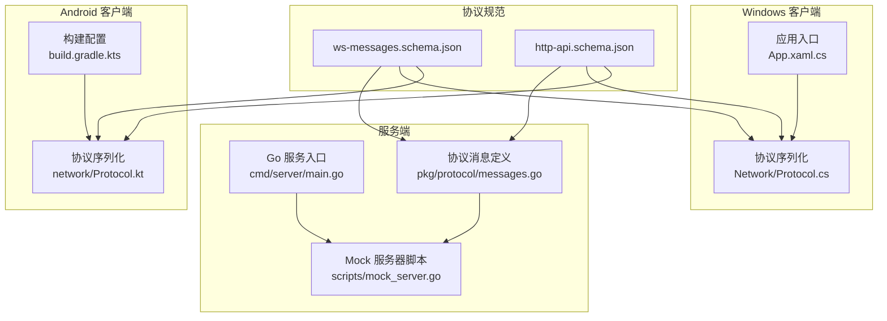
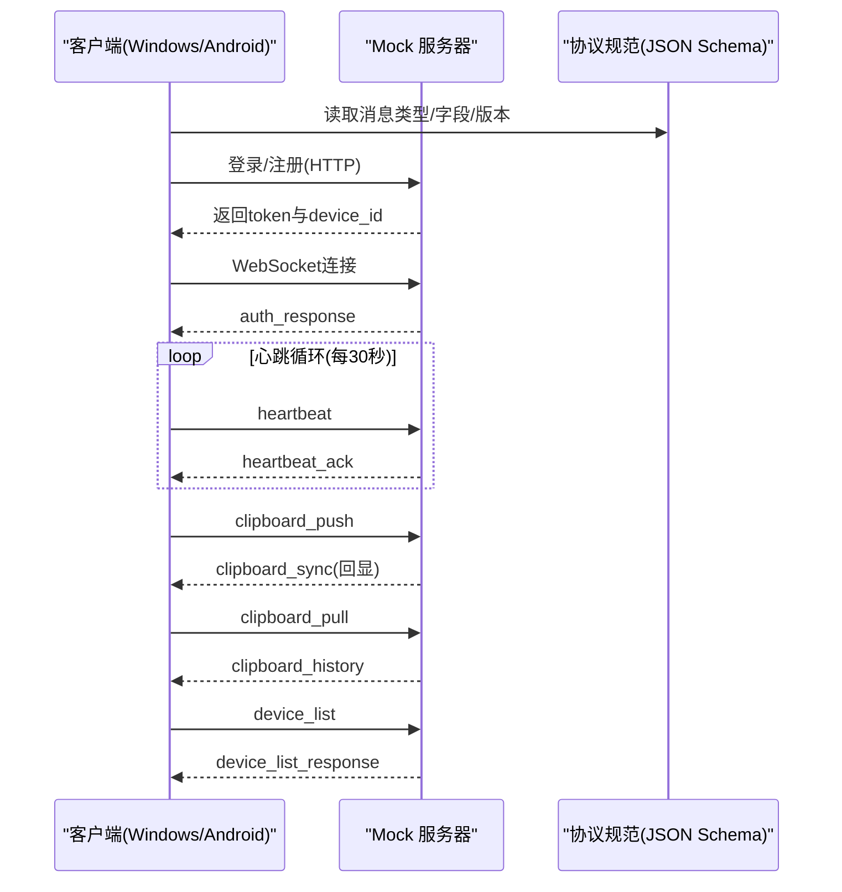
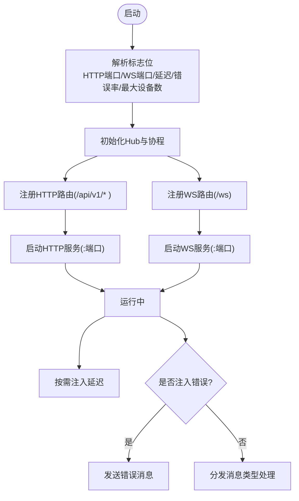
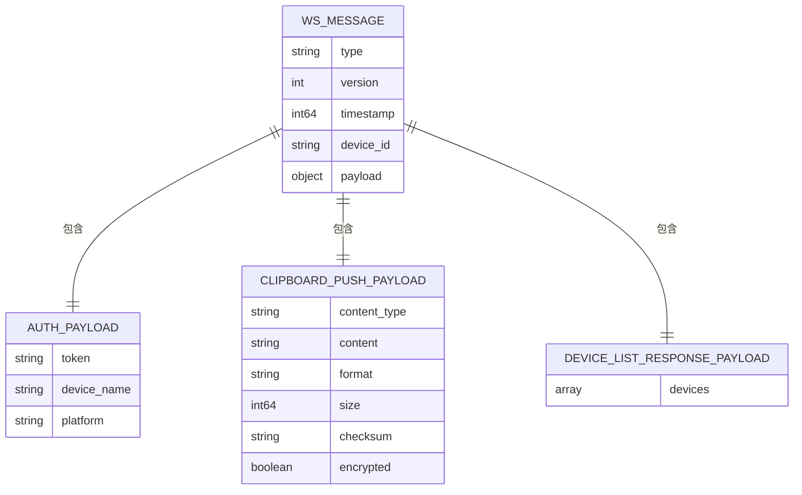
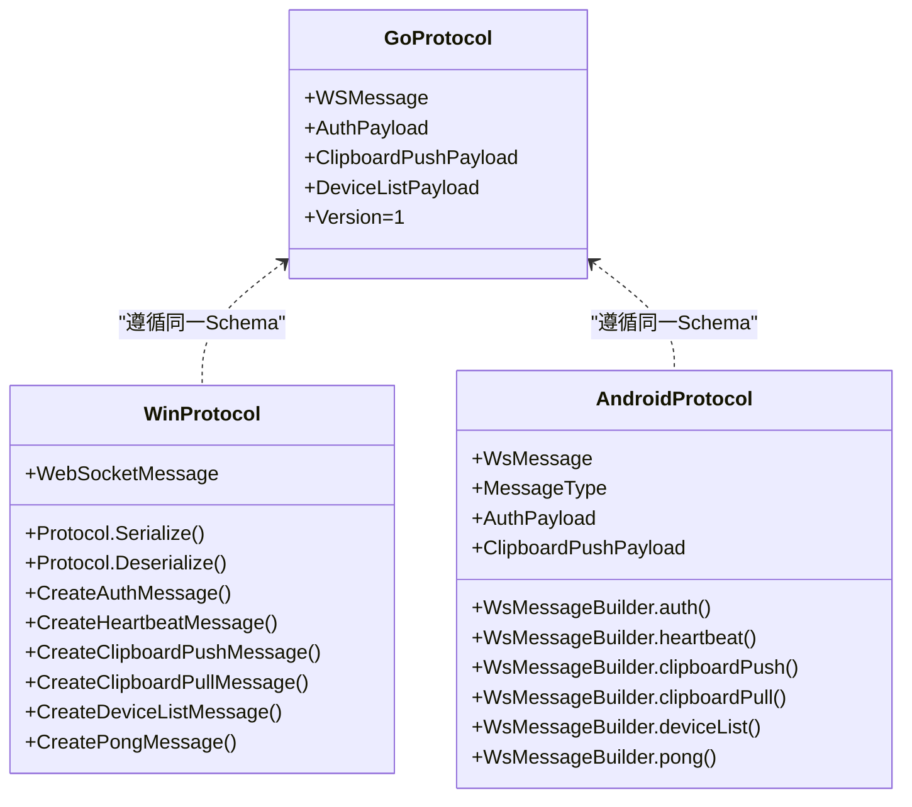
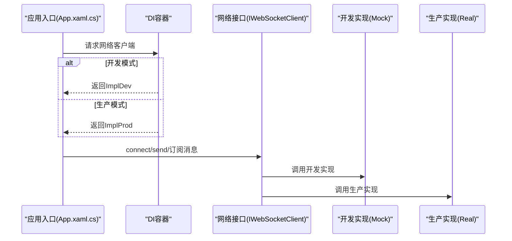
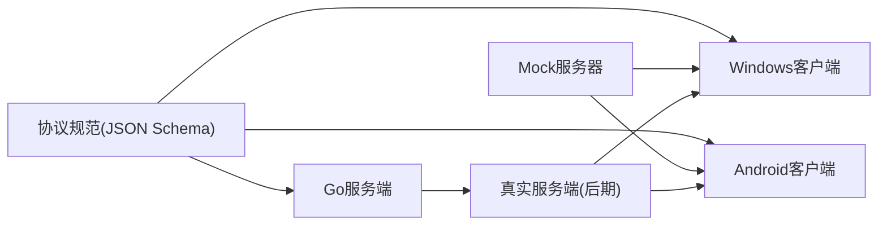

# 并行开发策略

<cite>
**本文引用的文件**
- [DEVELOPMENT_PLAN.md](file://DEVELOPMENT_PLAN.md)
- [mock_server.go](file://clipSync-server/scripts/mock_server.go)
- [ws-messages.schema.json](file://protocol/ws-messages.schema.json)
- [http-api.schema.json](file://protocol/http-api.schema.json)
- [messages.go](file://clipSync-server/pkg/protocol/messages.go)
- [Protocol.cs](file://clipSync-windows/ClipSync.WPF/Network/Protocol.cs)
- [Protocol.kt](file://clipSync-android/app/src/main/java/com/clipsync/app/network/Protocol.kt)
- [test-protocol-compatibility.ps1](file://scripts/test-protocol-compatibility.ps1)
- [App.xaml.cs](file://clipSync-windows/ClipSync.WPF/App.xaml.cs)
- [build.gradle.kts](file://clipSync-android/app/build.gradle.kts)
</cite>

## 目录
1. [引言](#引言)
2. [项目结构](#项目结构)
3. [核心组件](#核心组件)
4. [架构总览](#架构总览)
5. [详细组件分析](#详细组件分析)
6. [依赖分析](#依赖分析)
7. [性能考虑](#性能考虑)
8. [故障排查指南](#故障排查指南)
9. [结论](#结论)
10. [附录](#附录)

## 引言
本文件面向ClipSync项目的并行开发策略，系统阐述“零依赖并行”的核心理念、执行矩阵与风险评估，并给出可落地的实施方案。目标是在第一周即启动Go服务器、Windows客户端与Android客户端三条开发轨道，通过共享协议规范与Mock服务器实现完全独立开发；随后以里程碑驱动的集成测试确保跨平台一致性与稳定性。

## 项目结构
ClipSync采用多模块并行开发：Go服务端负责协议实现、认证、设备管理与消息广播；Windows与Android客户端分别基于各自平台能力实现剪贴板监听、消息序列化、WebSocket连接与本地存储；协议规范由JSON Schema与Go/Kotlin/C#数据模型共同约束，形成“单一真相源”。

图表来源
- [DEVELOPMENT_PLAN.md](file://DEVELOPMENT_PLAN.md)
- [mock_server.go](file://clipSync-server/scripts/mock_server.go)
- [messages.go](file://clipSync-server/pkg/protocol/messages.go)
- [Protocol.cs](file://clipSync-windows/ClipSync.WPF/Network/Protocol.cs)
- [Protocol.kt](file://clipSync-android/app/src/main/java/com/clipsync/app/network/Protocol.kt)
- [ws-messages.schema.json](file://protocol/ws-messages.schema.json)
- [http-api.schema.json](file://protocol/http-api.schema.json)

章节来源
- [DEVELOPMENT_PLAN.md](file://DEVELOPMENT_PLAN.md)

## 核心组件
- 共享协议规范：以JSON Schema定义WebSocket消息与HTTP API契约，确保三端一致。
- Mock服务器：提供无需数据库的本地开发环境，支持延迟与错误注入，保障客户端独立开发。
- 接口优先与依赖注入：客户端通过接口抽象网络层，开发与生产环境通过DI切换实现解耦。
- 集成测试流水线：以M1-M6里程碑驱动，逐步收敛到真实服务端。

章节来源
- [DEVELOPMENT_PLAN.md](file://DEVELOPMENT_PLAN.md)
- [mock_server.go](file://clipSync-server/scripts/mock_server.go)
- [ws-messages.schema.json](file://protocol/ws-messages.schema.json)
- [http-api.schema.json](file://protocol/http-api.schema.json)

## 架构总览
下图展示“零依赖并行”下的系统交互：客户端在协议规范约束下，通过Mock服务器完成认证、心跳、剪贴板推送与拉取等全流程验证；服务端在后期提供真实后端，客户端无缝切换。

图表来源
- [mock_server.go](file://clipSync-server/scripts/mock_server.go)
- [ws-messages.schema.json](file://protocol/ws-messages.schema.json)
- [http-api.schema.json](file://protocol/http-api.schema.json)

## 详细组件分析

### 组件A：Mock服务器（Go）
- 能力概览：提供HTTP与WebSocket双栈，模拟登录/注册/刷新、心跳、剪贴板同步、设备列表与健康检查；支持可配置延迟与错误注入。
- 关键特性：
  - 任意凭据接受（开发友好）
  - 多设备回显（模拟跨设备同步）
  - 可调参数：HTTP端口、WS端口、延迟、错误率、最大设备数
- 使用方式：命令行启动，自动打印访问地址与功能清单。

图表来源
- [mock_server.go](file://clipSync-server/scripts/mock_server.go)

章节来源
- [mock_server.go](file://clipSync-server/scripts/mock_server.go)

### 组件B：协议规范（JSON Schema）
- WebSocket消息规范：统一的Envelope字段（type/version/timestamp/device_id/payload），枚举消息类型，定义各payload字段与约束。
- HTTP API规范：覆盖认证、设备管理、健康检查与文件上传下载，明确请求/响应格式与状态码映射。
- 版本控制：消息包含version字段，当前v1；错误码集中定义，便于跨端一致处理。

图表来源
- [ws-messages.schema.json](file://protocol/ws-messages.schema.json)

章节来源
- [ws-messages.schema.json](file://protocol/ws-messages.schema.json)
- [http-api.schema.json](file://protocol/http-api.schema.json)

### 组件C：客户端协议实现（Windows/Android）
- Windows（C#）：定义WebSocketMessage类与序列化工具，生成各类消息（auth/heartbeat/clipboard_push/pull/device_list/pong）。
- Android（Kotlin）：基于kotlinx.serialization定义消息Envelope与payload数据类，提供WsMessageBuilder便捷构造器。
- 一致性保障：通过协议兼容性测试脚本扫描三端实现，确保消息类型、字段命名（snake_case）、版本号与心跳配置一致。

图表来源
- [messages.go](file://clipSync-server/pkg/protocol/messages.go)
- [Protocol.cs](file://clipSync-windows/ClipSync.WPF/Network/Protocol.cs)
- [Protocol.kt](file://clipSync-android/app/src/main/java/com/clipsync/app/network/Protocol.kt)

章节来源
- [Protocol.cs](file://clipSync-windows/ClipSync.WPF/Network/Protocol.cs)
- [Protocol.kt](file://clipSync-android/app/src/main/java/com/clipsync/app/network/Protocol.kt)
- [test-protocol-compatibility.ps1](file://scripts/test-protocol-compatibility.ps1)

### 组件D：接口抽象与依赖注入（Windows/Android）
- 接口优先：客户端通过接口抽象网络层（如WebSocketClient），开发与生产环境通过DI容器切换具体实现，避免硬编码依赖。
- Windows：应用入口负责全局异常处理与组件生命周期管理，体现解耦后的可维护性。
- Android：构建脚本引入OkHttp、kotlinx.serialization与Compose生态，为接口注入与模块化提供基础。

图表来源
- [App.xaml.cs](file://clipSync-windows/ClipSync.WPF/App.xaml.cs)
- [build.gradle.kts](file://clipSync-android/app/build.gradle.kts)

章节来源
- [App.xaml.cs](file://clipSync-windows/ClipSync.WPF/App.xaml.cs)
- [build.gradle.kts](file://clipSync-android/app/build.gradle.kts)

## 依赖分析
- 协议依赖：三端均依赖JSON Schema与共享消息模型，降低接口漂移风险。
- 运行时依赖：Mock服务器仅依赖标准库与gorilla/websocket；客户端依赖各自平台SDK与序列化库。
- 配置与构建：Android通过Gradle/KSP/Compose组合，Windows通过.NET框架与WPF；两者均不依赖真实服务端。

图表来源
- [ws-messages.schema.json](file://protocol/ws-messages.schema.json)
- [http-api.schema.json](file://protocol/http-api.schema.json)
- [mock_server.go](file://clipSync-server/scripts/mock_server.go)

章节来源
- [DEVELOPMENT_PLAN.md](file://DEVELOPMENT_PLAN.md)

## 性能考虑
- Mock服务器延迟与错误注入：用于验证客户端在弱网与异常场景下的鲁棒性。
- 心跳与超时：30秒心跳间隔与90秒超时设定，兼顾实时性与资源占用。
- 历史容量与连接上限：剪贴板历史限制与每用户最多10台设备，适配2核2G服务器。
- 数据库优化：SQLite WAL模式提升并发写入性能。

## 故障排查指南
- 协议兼容性检查：使用PowerShell脚本扫描三端实现，定位消息类型缺失、字段命名不一致、版本号不符与心跳配置问题。
- Mock服务器连通性：通过健康检查与登录接口验证Mock可用性；若失败，检查端口占用与跨域策略。
- 错误码一致性：对照协议规范中的错误码定义，确保三端均正确处理与上报。

章节来源
- [test-protocol-compatibility.ps1](file://scripts/test-protocol-compatibility.ps1)
- [mock_server.go](file://clipSync-server/scripts/mock_server.go)
- [http-api.schema.json](file://protocol/http-api.schema.json)

## 结论
ClipSync的并行开发策略以“协议即契约、Mock即后端”为核心，通过清晰的执行矩阵与里程碑测试，确保三端在第一周即可独立高效推进。接口抽象与依赖注入进一步降低耦合度，为后续快速迭代与稳定交付奠定基础。

## 附录
- 执行矩阵与里程碑：见“并行执行矩阵”与“集成里程碑”章节。
- 快速开始命令与版本/尺寸限制：见附录A/B/C。

章节来源
- [DEVELOPMENT_PLAN.md](file://DEVELOPMENT_PLAN.md)