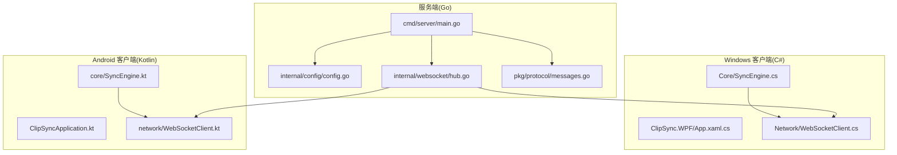
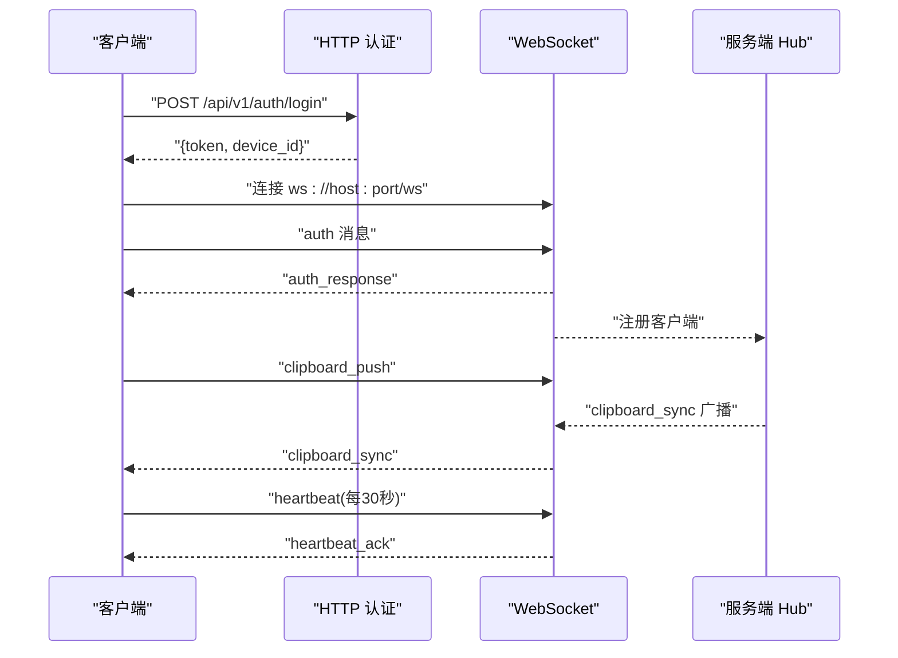
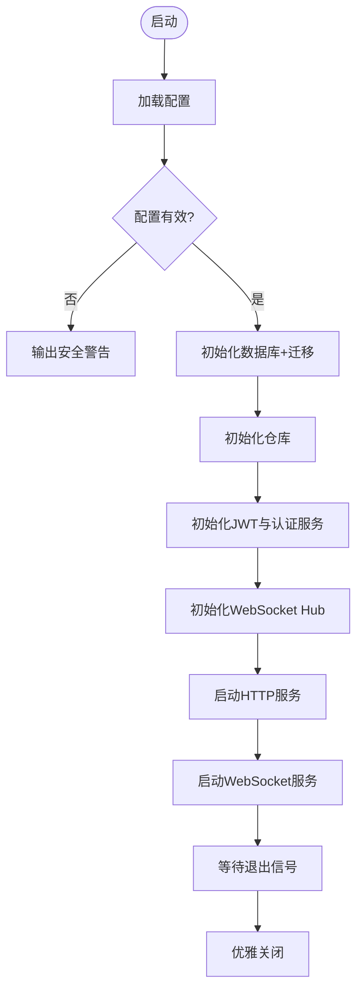
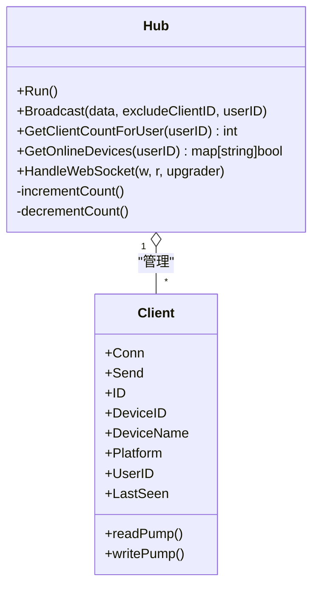
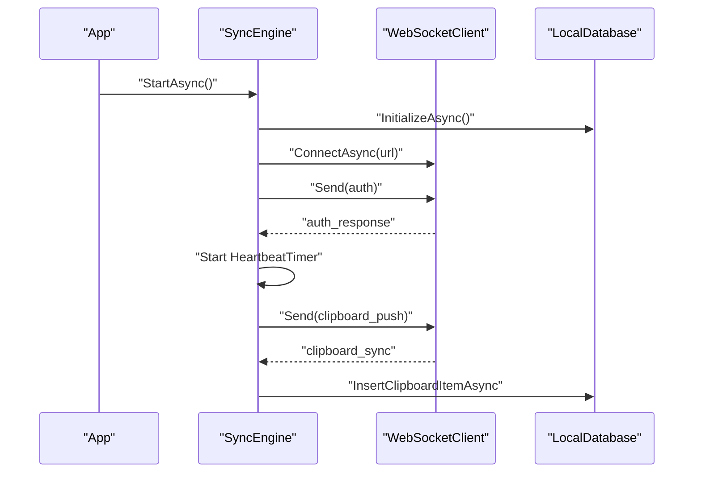
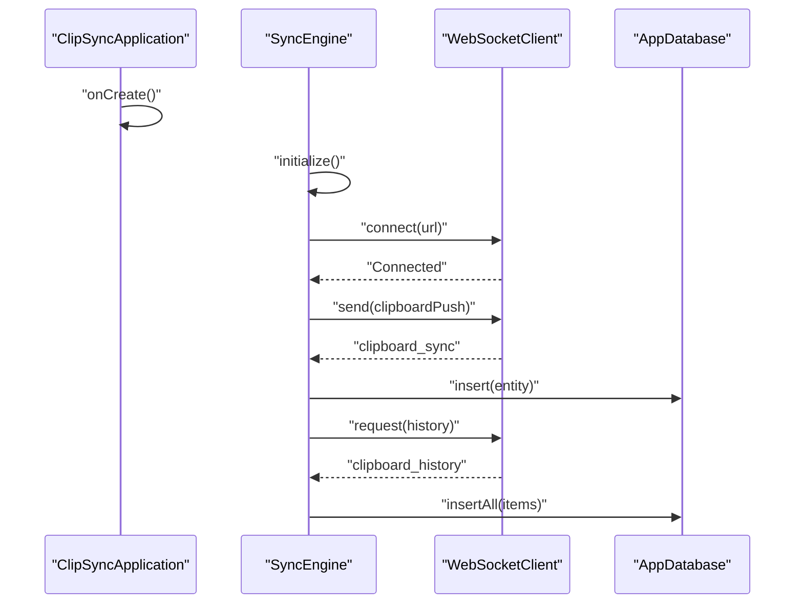
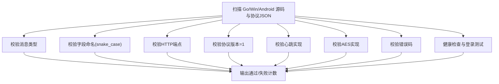
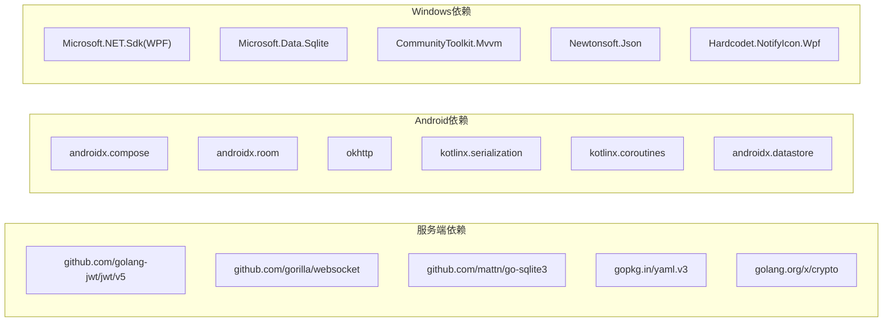

# 开发指南

<cite>
**本文引用的文件**
- [DEVELOPMENT_PLAN.md](file://DEVELOPMENT_PLAN.md)
- [test-protocol-compatibility.ps1](file://scripts/test-protocol-compatibility.ps1)
- [main.go](file://clipSync-server/cmd/server/main.go)
- [config.go](file://clipSync-server/internal/config/config.go)
- [messages.go](file://clipSync-server/pkg/protocol/messages.go)
- [hub.go](file://clipSync-server/internal/websocket/hub.go)
- [go.mod](file://clipSync-server/go.mod)
- [App.xaml.cs](file://clipSync-windows/ClipSync.WPF/App.xaml.cs)
- [SyncEngine.cs](file://clipSync-windows/ClipSync.WPF/Core/SyncEngine.cs)
- [WebSocketClient.cs](file://clipSync-windows/ClipSync.WPF/Network/WebSocketClient.cs)
- [ClipSyncApplication.kt](file://clipSync-android/app/src/main/java/com/clipsync/app/ClipSyncApplication.kt)
- [SyncEngine.kt](file://clipSync-android/app/src/main/java/com/clipsync/app/core/SyncEngine.kt)
- [WebSocketClient.kt](file://clipSync-android/app/src/main/java/com/clipsync/app/network/WebSocketClient.kt)
- [build.gradle.kts](file://clipSync-android/app/build.gradle.kts)
- [ClipSync.WPF.csproj](file://clipSync-windows/ClipSync.WPF/ClipSync.WPF.csproj)
</cite>

## 目录
1. [简介](#简介)
2. [项目结构](#项目结构)
3. [核心组件](#核心组件)
4. [架构总览](#架构总览)
5. [详细组件分析](#详细组件分析)
6. [依赖关系分析](#依赖关系分析)
7. [性能考量](#性能考量)
8. [故障排查指南](#故障排查指南)
9. [结论](#结论)
10. [附录](#附录)

## 简介
本指南面向ClipSync项目的并行开发团队，系统化阐述并行开发策略、代码规范、提交与版本管理、协作流程与代码审查标准，并结合仓库中的真实实现给出可操作的实践建议。目标是帮助初学者快速上手，同时为有经验的开发者提供足够的技术深度与落地细节。

## 项目结构
项目采用多平台并行开发模式：Go语言服务端、Windows WPF客户端、Android Kotlin客户端，共享统一的协议规范与测试脚本，确保三端在早期即可独立开发、互相验证，降低耦合度与阻塞风险。

- 服务端（Go）：命令入口、配置加载、数据库迁移、HTTP与WebSocket路由、认证中间件、消息广播与心跳监控。
- 客户端（Windows WPF）：应用生命周期、设置管理、剪贴板监听、WebSocket通信、心跳与重连、本地历史缓存。
- 客户端（Android）：应用初始化、剪贴板监听、WebSocket通信、消息处理、Room数据库、状态管理与协程。
- 协议与测试：统一的消息结构、错误码、HTTP API契约；跨语言兼容性测试脚本。

图表来源
- [main.go:21-145](file://clipSync-server/cmd/server/main.go#L21-L145)
- [config.go:10-71](file://clipSync-server/internal/config/config.go#L10-L71)
- [hub.go:18-230](file://clipSync-server/internal/websocket/hub.go#L18-L230)
- [messages.go:5-132](file://clipSync-server/pkg/protocol/messages.go#L5-L132)
- [App.xaml.cs:12-63](file://clipSync-windows/ClipSync.WPF/App.xaml.cs#L12-L63)
- [SyncEngine.cs:32-57](file://clipSync-windows/ClipSync.WPF/Core/SyncEngine.cs#L32-L57)
- [WebSocketClient.cs:22-81](file://clipSync-windows/ClipSync.WPF/Network/WebSocketClient.cs#L22-L81)
- [ClipSyncApplication.kt:10-25](file://clipSync-android/app/src/main/java/com/clipsync/app/ClipSyncApplication.kt#L10-L25)
- [SyncEngine.kt:43-67](file://clipSync-android/app/src/main/java/com/clipsync/app/core/SyncEngine.kt#L43-L67)
- [WebSocketClient.kt:83-103](file://clipSync-android/app/src/main/java/com/clipsync/app/network/WebSocketClient.kt#L83-L103)

章节来源
- [DEVELOPMENT_PLAN.md:365-527](file://DEVELOPMENT_PLAN.md#L365-L527)

## 核心组件
- 协议层：统一的WebSocket消息结构与HTTP API契约，确保三端序列化/反序列化一致。
- 服务端：配置驱动、数据库迁移、认证中间件、WebSocket Hub、消息广播、健康检查与限流。
- 客户端：应用生命周期、剪贴板监听、WebSocket通信、心跳与自动重连、本地历史缓存与UI交互。
- 测试：协议兼容性脚本，覆盖消息类型、字段命名、HTTP端点、版本号、心跳、加密与错误码等维度。

章节来源
- [DEVELOPMENT_PLAN.md:18-362](file://DEVELOPMENT_PLAN.md#L18-L362)
- [messages.go:5-132](file://clipSync-server/pkg/protocol/messages.go#L5-L132)
- [main.go:21-145](file://clipSync-server/cmd/server/main.go#L21-L145)
- [config.go:10-71](file://clipSync-server/internal/config/config.go#L10-L71)
- [test-protocol-compatibility.ps1:52-164](file://scripts/test-protocol-compatibility.ps1#L52-L164)

## 架构总览
服务端通过HTTP提供认证与设备管理，WebSocket承载实时剪贴板同步；客户端分别在各自平台上实现剪贴板监听、消息编解码、心跳与重连、本地历史存储与UI展示。三端共享协议规范，使用Mock服务器进行早期联调与回归测试。

图表来源
- [main.go:80-125](file://clipSync-server/cmd/server/main.go#L80-L125)
- [messages.go:107-126](file://clipSync-server/pkg/protocol/messages.go#L107-L126)
- [SyncEngine.cs:73-93](file://clipSync-windows/ClipSync.WPF/Core/SyncEngine.cs#L73-L93)
- [SyncEngine.kt:72-123](file://clipSync-android/app/src/main/java/com/clipsync/app/core/SyncEngine.kt#L72-L123)
- [WebSocketClient.cs:22-39](file://clipSync-windows/ClipSync.WPF/Network/WebSocketClient.cs#L22-L39)
- [WebSocketClient.kt:83-103](file://clipSync-android/app/src/main/java/com/clipsync/app/network/WebSocketClient.kt#L83-L103)

## 详细组件分析

### 服务端：配置与启动
- 配置加载：支持环境变量覆盖默认路径，校验JWT密钥与有效期的安全警告。
- 数据库：SQLite连接、迁移执行、仓库初始化。
- 路由：HTTP端点（登录/注册/刷新/健康/设备/上传下载），WebSocket路由与升级。
- 中间件：JWT鉴权中间件与速率限制器。
- 优雅关闭：信号捕获与超时关闭。

图表来源
- [main.go:21-145](file://clipSync-server/cmd/server/main.go#L21-L145)
- [config.go:38-71](file://clipSync-server/internal/config/config.go#L38-L71)

章节来源
- [main.go:21-145](file://clipSync-server/cmd/server/main.go#L21-L145)
- [config.go:10-71](file://clipSync-server/internal/config/config.go#L10-L71)
- [go.mod:1-14](file://clipSync-server/go.mod#L1-L14)

### 服务端：WebSocket Hub与消息广播
- Hub负责客户端注册/注销、广播、在线设备统计、按用户过滤广播。
- 连接升级后设置认证超时（30秒），发送错误消息并断开。
- 发送缓冲区满时主动断开，避免内存膨胀。

图表来源
- [hub.go:18-230](file://clipSync-server/internal/websocket/hub.go#L18-L230)

章节来源
- [hub.go:18-230](file://clipSync-server/internal/websocket/hub.go#L18-L230)

### Windows 客户端：应用生命周期与同步引擎
- 应用启动：全局未处理异常捕获、托盘图标初始化、主窗口显示与最小化到托盘。
- 同步引擎：剪贴板监听、WebSocket连接与认证、心跳定时器、自动重连、本地历史保存。
- WebSocket客户端：连接/断开、消息收发、接收循环与最大消息长度限制。

图表来源
- [App.xaml.cs:12-63](file://clipSync-windows/ClipSync.WPF/App.xaml.cs#L12-L63)
- [SyncEngine.cs:32-125](file://clipSync-windows/ClipSync.WPF/Core/SyncEngine.cs#L32-L125)
- [WebSocketClient.cs:22-81](file://clipSync-windows/ClipSync.WPF/Network/WebSocketClient.cs#L22-L81)

章节来源
- [App.xaml.cs:12-63](file://clipSync-windows/ClipSync.WPF/App.xaml.cs#L12-L63)
- [SyncEngine.cs:32-125](file://clipSync-windows/ClipSync.WPF/Core/SyncEngine.cs#L32-L125)
- [WebSocketClient.cs:10-146](file://clipSync-windows/ClipSync.WPF/Network/WebSocketClient.cs#L10-L146)

### Android 客户端：应用初始化与同步引擎
- 应用：Application入口，懒加载数据库实例。
- 同步引擎：协程作用域、剪贴板监听、去重推送、加密开关、历史拉取与保存、状态管理。
- WebSocket客户端：OkHttp实现，连接状态流、消息共享流、自动重连与Ping间隔。

图表来源
- [ClipSyncApplication.kt:10-25](file://clipSync-android/app/src/main/java/com/clipsync/app/ClipSyncApplication.kt#L10-L25)
- [SyncEngine.kt:43-123](file://clipSync-android/app/src/main/java/com/clipsync/app/core/SyncEngine.kt#L43-L123)
- [WebSocketClient.kt:83-134](file://clipSync-android/app/src/main/java/com/clipsync/app/network/WebSocketClient.kt#L83-L134)

章节来源
- [ClipSyncApplication.kt:10-25](file://clipSync-android/app/src/main/java/com/clipsync/app/ClipSyncApplication.kt#L10-L25)
- [SyncEngine.kt:1-250](file://clipSync-android/app/src/main/java/com/clipsync/app/core/SyncEngine.kt#L1-L250)
- [WebSocketClient.kt:1-156](file://clipSync-android/app/src/main/java/com/clipsync/app/network/WebSocketClient.kt#L1-L156)

### 协议与测试：跨语言一致性
- WebSocket消息类型、字段命名（snake_case）、HTTP端点、协议版本、心跳、加密支持、错误码均在协议中定义。
- PowerShell脚本扫描三端源码与协议JSON，验证消息类型、字段、端点、版本、心跳、加密与错误码一致性，并测试Mock服务器连通性。

图表来源
- [test-protocol-compatibility.ps1:31-191](file://scripts/test-protocol-compatibility.ps1#L31-L191)
- [messages.go:107-126](file://clipSync-server/pkg/protocol/messages.go#L107-L126)

章节来源
- [DEVELOPMENT_PLAN.md:18-362](file://DEVELOPMENT_PLAN.md#L18-L362)
- [test-protocol-compatibility.ps1:1-207](file://scripts/test-protocol-compatibility.ps1#L1-L207)

## 依赖关系分析
- 服务端依赖：JWT、WebSocket、SQLite、YAML解析、加解密库。
- Android客户端依赖：Compose、Lifecycle、Room、OkHttp、Serialization、Coroutines、DataStore。
- Windows客户端依赖：WPF、Sqlite、MVVM Toolkit、Newtonsoft.Json、NotifyIcon。

图表来源
- [go.mod:5-11](file://clipSync-server/go.mod#L5-L11)
- [build.gradle.kts:57-101](file://clipSync-android/app/build.gradle.kts#L57-L101)
- [ClipSync.WPF.csproj:13-19](file://clipSync-windows/ClipSync.WPF/ClipSync.WPF.csproj#L13-L19)

章节来源
- [go.mod:1-14](file://clipSync-server/go.mod#L1-L14)
- [build.gradle.kts:1-102](file://clipSync-android/app/build.gradle.kts#L1-L102)
- [ClipSync.WPF.csproj:1-24](file://clipSync-windows/ClipSync.WPF/ClipSync.WPF.csproj#L1-L24)

## 性能考量
- 服务端
  - 使用SQLite WAL模式提升并发写入能力。
  - WebSocket Hub广播前按用户过滤，减少无效投递。
  - 发送缓冲区满时主动断开，防止内存膨胀。
  - HTTP与WebSocket分离端口，便于资源隔离与限速。
- 客户端
  - Windows：消息最大长度限制，避免过大消息导致内存压力。
  - Android：消息共享流缓冲容量与协程调度分离IO线程，避免主线程阻塞。
  - 去重机制：基于checksum跳过重复内容，降低带宽与CPU消耗。

章节来源
- [main.go:108-125](file://clipSync-server/cmd/server/main.go#L108-L125)
- [hub.go:81-111](file://clipSync-server/internal/websocket/hub.go#L81-L111)
- [WebSocketClient.cs:15-15](file://clipSync-windows/ClipSync.WPF/Network/WebSocketClient.cs#L15-L15)
- [SyncEngine.kt:85-91](file://clipSync-android/app/src/main/java/com/clipsync/app/core/SyncEngine.kt#L85-L91)

## 故障排查指南
- 协议不一致
  - 使用协议兼容性脚本定位缺失的消息类型、字段命名差异、HTTP端点不一致、版本号或错误码不匹配。
- 连接与认证
  - 服务端：检查JWT密钥是否为默认值、认证超时（30秒）是否触发、心跳是否正常。
  - 客户端：确认WebSocket URL、Ping间隔、自动重连逻辑、消息最大长度限制。
- 数据库与历史
  - 服务端：确认迁移执行成功、历史条数限制配置合理。
  - 客户端：确认本地数据库初始化与插入逻辑、历史条目修剪策略。
- 错误处理
  - 全局异常捕获：Windows应用已注册未处理异常回调，避免崩溃。
  - 服务端：Hub在升级失败、认证超时、错误消息发送等场景下记录日志并断开连接。

章节来源
- [test-protocol-compatibility.ps1:52-191](file://scripts/test-protocol-compatibility.ps1#L52-L191)
- [main.go:197-204](file://clipSync-server/cmd/server/main.go#L197-L204)
- [App.xaml.cs:16-33](file://clipSync-windows/ClipSync.WPF/App.xaml.cs#L16-L33)
- [hub.go:216-229](file://clipSync-server/internal/websocket/hub.go#L216-L229)

## 结论
通过共享协议、Mock服务器与严格的兼容性测试，ClipSync实现了Go服务端、Windows与Android客户端的真正并行开发。配合清晰的模块划分、稳健的错误处理与性能优化策略，项目可在早期快速迭代并在后期稳定交付。

## 附录

### 并行开发策略与协作规范
- 接口优先：客户端均以接口形式抽象网络与存储，便于替换Mock实现。
- 分阶段收敛：四个阶段逐步收敛，第4阶段集中集成测试。
- 风险评估：明确各阶段风险与缓解措施。

章节来源
- [DEVELOPMENT_PLAN.md:583-800](file://DEVELOPMENT_PLAN.md#L583-L800)

### 提交流程与版本管理
- 分支策略：建议采用功能分支开发，合并前通过协议兼容性测试与单元测试。
- 版本标记：服务端使用常量版本号，HTTP响应携带版本信息。
- 变更记录：遵循语义化版本，变更内容在发布说明中汇总。

章节来源
- [main.go:19-19](file://clipSync-server/cmd/server/main.go#L19-L19)
- [messages.go:125-126](file://clipSync-server/pkg/protocol/messages.go#L125-L126)

### 代码规范与审查标准
- 协议一致性：所有消息类型、字段命名、HTTP端点、错误码必须与协议一致。
- 异常处理：全局未处理异常捕获、服务端日志记录、客户端错误事件上报。
- 性能与安全：服务端限流与心跳超时、客户端消息大小限制与去重、生产环境JWT密钥更换。

章节来源
- [test-protocol-compatibility.ps1:52-164](file://scripts/test-protocol-compatibility.ps1#L52-L164)
- [App.xaml.cs:16-33](file://clipSync-windows/ClipSync.WPF/App.xaml.cs#L16-L33)
- [config.go:57-71](file://clipSync-server/internal/config/config.go#L57-L71)

### 开发工具配置与调试技巧
- Windows
  - WPF应用：启用未处理异常捕获，使用Dispatcher在STA线程设置剪贴板。
  - 调试：关注WebSocket接收循环与连接状态事件，检查最大消息长度限制。
- Android
  - Compose与协程：使用StateFlow/SharedFlow管理状态与消息流，注意IO调度。
  - 调试：观察Ping间隔、自动重连与历史拉取流程。
- 服务端
  - 配置：通过环境变量覆盖配置文件路径，生产环境务必修改默认JWT密钥。
  - 调试：关注Hub广播、认证超时与错误消息发送。

章节来源
- [App.xaml.cs:16-33](file://clipSync-windows/ClipSync.WPF/App.xaml.cs#L16-L33)
- [SyncEngine.cs:223-241](file://clipSync-windows/ClipSync.WPF/Core/SyncEngine.cs#L223-L241)
- [WebSocketClient.cs:83-135](file://clipSync-windows/ClipSync.WPF/Network/WebSocketClient.cs#L83-L135)
- [SyncEngine.kt:128-160](file://clipSync-android/app/src/main/java/com/clipsync/app/core/SyncEngine.kt#L128-L160)
- [WebSocketClient.kt:46-78](file://clipSync-android/app/src/main/java/com/clipsync/app/network/WebSocketClient.kt#L46-L78)
- [config.go:24-35](file://clipSync-server/internal/config/config.go#L24-L35)