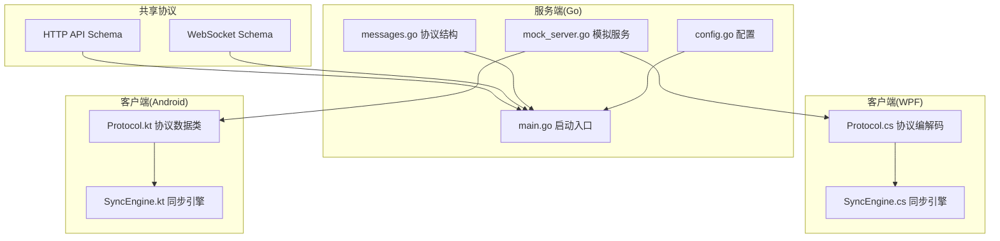
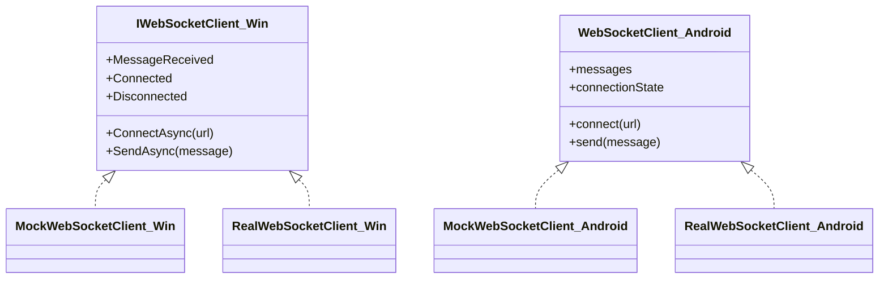
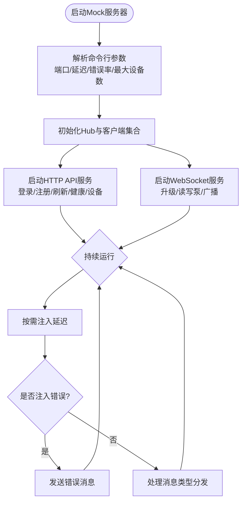
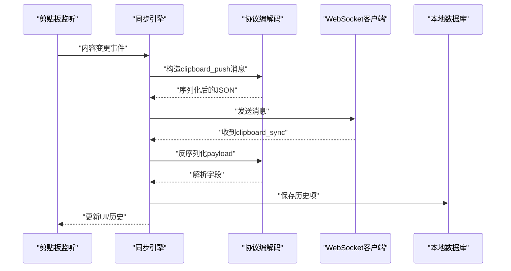
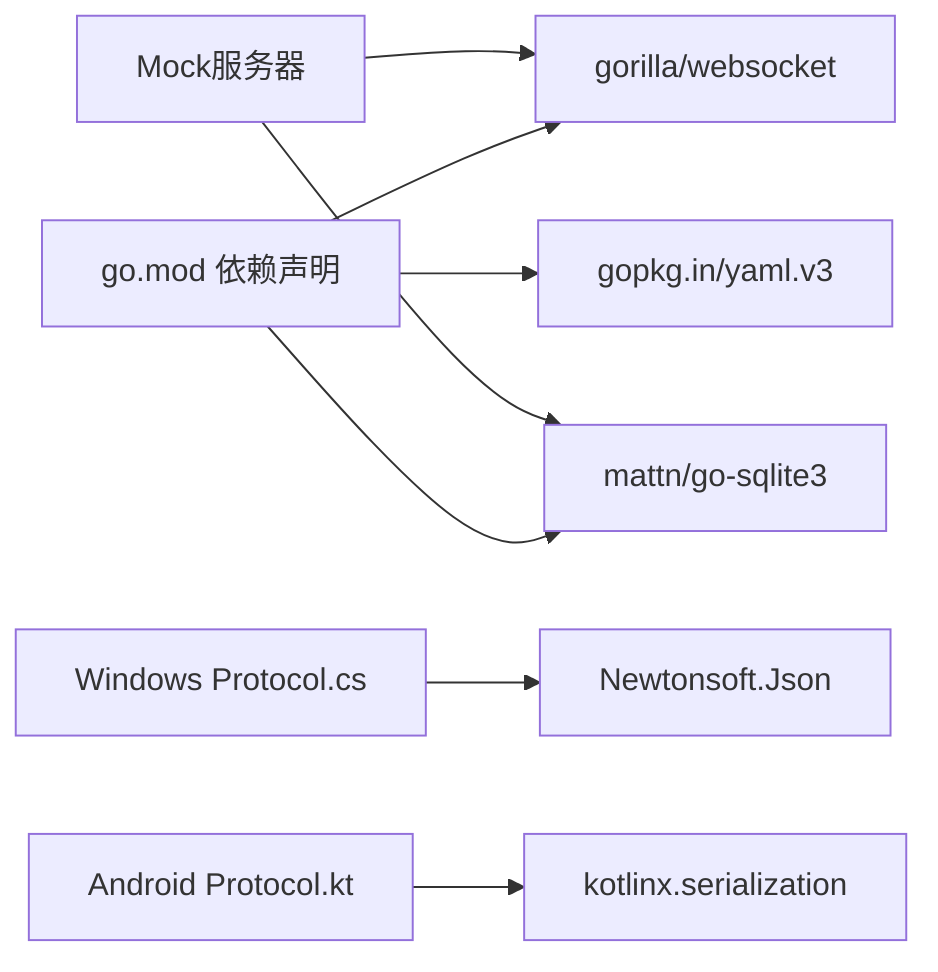

# 并行开发策略

<cite>
**本文引用的文件**
- [DEVELOPMENT_PLAN.md](file://DEVELOPMENT_PLAN.md)
- [http-api.schema.json](file://protocol/http-api.schema.json)
- [ws-messages.schema.json](file://protocol/ws-messages.schema.json)
- [mock_server.go](file://clipSync-server/scripts/mock_server.go)
- [messages.go](file://clipSync-server/pkg/protocol/messages.go)
- [main.go](file://clipSync-server/cmd/server/main.go)
- [config.go](file://clipSync-server/internal/config/config.go)
- [go.mod](file://clipSync-server/go.mod)
- [Protocol.cs](file://clipSync-windows/ClipSync.WPF/Network/Protocol.cs)
- [SyncEngine.cs](file://clipSync-windows/ClipSync.WPF/Core/SyncEngine.cs)
- [Protocol.kt](file://clipSync-android/app/src/main/java/com/clipsync/app/network/Protocol.kt)
- [SyncEngine.kt](file://clipSync-android/app/src/main/java/com/clipsync/app/core/SyncEngine.kt)
- [test-protocol-compatibility.ps1](file://scripts/test-protocol-compatibility.ps1)
</cite>

## 目录
1. [引言](#引言)
2. [项目结构](#项目结构)
3. [核心组件](#核心组件)
4. [架构总览](#架构总览)
5. [详细组件分析](#详细组件分析)
6. [依赖分析](#依赖分析)
7. [性能考虑](#性能考虑)
8. [故障排查指南](#故障排查指南)
9. [结论](#结论)
10. [附录](#附录)

## 引言
本文件面向ClipSync跨平台并行开发团队，系统化阐述如何在Go服务器、Windows WPF客户端与Android Kotlin客户端之间实现“零依赖并行开发”。文档以共享协议规范为核心，结合Mock/Stub策略、Interface-First开发范式、依赖注入切换机制、Mock服务器配置与使用、开发工具与调试技巧，以及并行开发协作与冲突处理方案，帮助初学者快速上手，同时为资深工程师提供可落地的技术深度。

## 项目结构
- 共享协议层：通过JSON Schema定义HTTP API与WebSocket消息契约，确保三端实现一致。
- 服务端（Go）：提供HTTP认证、设备管理、文件上传下载、WebSocket连接与消息路由。
- 客户端（Windows WPF）：基于.NET的同步/异步组件，封装协议序列化、心跳、重连与本地数据库。
- 客户端（Android Kotlin）：基于Kotlin协程与Room，封装协议数据类、消息构建器与历史管理。
- 测试与验证：PowerShell脚本自动化校验协议一致性与Mock服务器连通性。



**图表来源**
- [main.go:21-146](file://clipSync-server/cmd/server/main.go#L21-L146)
- [config.go:10-71](file://clipSync-server/internal/config/config.go#L10-L71)
- [messages.go:5-132](file://clipSync-server/pkg/protocol/messages.go#L5-L132)
- [mock_server.go:600-664](file://clipSync-server/scripts/mock_server.go#L600-L664)
- [Protocol.cs:60-167](file://clipSync-windows/ClipSync.WPF/Network/Protocol.cs#L60-L167)
- [SyncEngine.cs:8-422](file://clipSync-windows/ClipSync.WPF/Core/SyncEngine.cs#L8-L422)
- [Protocol.kt:18-263](file://clipSync-android/app/src/main/java/com/clipsync/app/network/Protocol.kt#L18-L263)
- [SyncEngine.kt:27-250](file://clipSync-android/app/src/main/java/com/clipsync/app/core/SyncEngine.kt#L27-L250)

**章节来源**
- [DEVELOPMENT_PLAN.md:365-527](file://DEVELOPMENT_PLAN.md#L365-L527)

## 核心组件
- 共享协议规范
  - HTTP API：登录/注册/刷新、健康检查、设备列表、文件上传下载等端点与响应模型。
  - WebSocket消息：鉴权、心跳、剪贴板推送/同步/拉取、设备列表、错误通知等。
  - 加密规范：AES-256-CBC派生与填充约定，支持消息级加密标志位。
- Mock服务器
  - 提供HTTP与WebSocket双栈，无数据库依赖，内建延迟与错误注入，便于客户端离线联调。
- 客户端协议实现
  - Windows：基于Newtonsoft.Json的Envelope与Payload类，提供消息构造器与反序列化。
  - Android：基于Kotlinx Serialization的数据类与枚举，提供消息构建器与JSON编解码。
- 同步引擎
  - Windows：负责剪贴板监听、消息发送、心跳、重连、本地历史存储与错误处理。
  - Android：负责剪贴板监听、去重、消息发送、历史拉取与本地Room存储。

**章节来源**
- [DEVELOPMENT_PLAN.md:18-362](file://DEVELOPMENT_PLAN.md#L18-L362)
- [http-api.schema.json:1-293](file://protocol/http-api.schema.json#L1-L293)
- [ws-messages.schema.json:1-261](file://protocol/ws-messages.schema.json#L1-L261)
- [mock_server.go:1-664](file://clipSync-server/scripts/mock_server.go#L1-L664)
- [Protocol.cs:60-167](file://clipSync-windows/ClipSync.WPF/Network/Protocol.cs#L60-L167)
- [SyncEngine.cs:8-422](file://clipSync-windows/ClipSync.WPF/Core/SyncEngine.cs#L8-L422)
- [Protocol.kt:18-263](file://clipSync-android/app/src/main/java/com/clipsync/app/network/Protocol.kt#L18-L263)
- [SyncEngine.kt:27-250](file://clipSync-android/app/src/main/java/com/clipsync/app/core/SyncEngine.kt#L27-L250)

## 架构总览
下图展示三端并行开发的交互路径：客户端通过HTTP完成鉴权，随后通过WebSocket进行实时同步；服务端在Mock模式下无需数据库即可满足联调需求；测试脚本保障协议一致性与Mock连通性。

```mermaid
sequenceDiagram
participant Win as "Windows客户端"
participant And as "Android客户端"
participant Mock as "Mock服务器"
participant Srv as "真实服务器"
Note over Win,And : "阶段0-1：协议规范驱动，三端独立开发"
Win->>Mock : "HTTP 登录/注册"
And->>Mock : "HTTP 登录/注册"
Mock-->>Win : "返回token+device_id"
Mock-->>And : "返回token+device_id"
Note over Win,And : "阶段2-3：WebSocket联调，Mock提供稳定环境"
Win->>Mock : "WS鉴权(auth)"
And->>Mock : "WS鉴权(auth)"
Mock-->>Win : "WS鉴权成功(auth_response)"
Mock-->>And : "WS鉴权成功(auth_response)"
Win->>Mock : "WS心跳(heartbeat)"
And->>Mock : "WS心跳(heartbeat)"
Mock-->>Win : "WS心跳确认(heartbeat_ack)"
Mock-->>And : "WS心跳确认(heartbeat_ack)"
Note over Win,Mock : "阶段4：真实服务器上线，逐步替换Mock"
Win->>Srv : "HTTP 登录/注册"
And->>Srv : "HTTP 登录/注册"
Win->>Srv : "WS鉴权"
And->>Srv : "WS鉴权"
```

**图表来源**
- [mock_server.go:198-355](file://clipSync-server/scripts/mock_server.go#L198-L355)
- [Protocol.cs:79-96](file://clipSync-windows/ClipSync.WPF/Network/Protocol.cs#L79-L96)
- [Protocol.kt:210-225](file://clipSync-android/app/src/main/java/com/clipsync/app/network/Protocol.kt#L210-L225)
- [SyncEngine.cs:73-93](file://clipSync-windows/ClipSync.WPF/Core/SyncEngine.cs#L73-L93)
- [SyncEngine.kt:72-123](file://clipSync-android/app/src/main/java/com/clipsync/app/core/SyncEngine.kt#L72-L123)

## 详细组件分析

### 组件A：共享协议规范与Interface-First开发
- 设计要点
  - 协议规范作为“单一事实来源”，三端实现必须严格遵循字段命名、版本号与消息类型。
  - 客户端一律面向接口编程，通过依赖注入在开发与生产环境间无缝切换。
- 接口与实现映射
  - Windows：IWebSocketClient接口与Mock/Real实现，通过DI容器在App启动时绑定。
  - Android：WebSocketClient接口与Hilt/Dagger提供者，在@Development/@Production限定符下切换。
- 协议一致性校验
  - PowerShell脚本自动扫描三端源码，验证消息类型、字段命名、HTTP端点、版本号、心跳配置、加密支持与错误码覆盖。



**图表来源**
- [DEVELOPMENT_PLAN.md:614-651](file://DEVELOPMENT_PLAN.md#L614-L651)
- [Protocol.cs:60-167](file://clipSync-windows/ClipSync.WPF/Network/Protocol.cs#L60-L167)
- [Protocol.kt:18-52](file://clipSync-android/app/src/main/java/com/clipsync/app/network/Protocol.kt#L18-L52)

**章节来源**
- [DEVELOPMENT_PLAN.md:691-714](file://DEVELOPMENT_PLAN.md#L691-L714)
- [test-protocol-compatibility.ps1:52-164](file://scripts/test-protocol-compatibility.ps1#L52-L164)

### 组件B：Mock服务器配置与使用
- 运行方式
  - 默认端口：WebSocket 8080，HTTP 8081；可通过命令行参数调整延迟与错误注入率。
  - 无数据库依赖，内存状态模拟多设备在线/离线、心跳、剪贴板广播与历史拉取。
- 延迟与错误注入
  - 可配置固定或抖动延迟，按百分比注入随机错误，模拟网络不稳定与服务异常场景。
- 使用建议
  - 客户端在开发阶段始终指向Mock服务器，避免对真实后端的耦合。
  - 在集成测试中，先用Mock验证端到端流程，再切换至真实服务器做压力与稳定性验证。



**图表来源**
- [mock_server.go:600-664](file://clipSync-server/scripts/mock_server.go#L600-L664)
- [mock_server.go:161-176](file://clipSync-server/scripts/mock_server.go#L161-L176)
- [mock_server.go:285-309](file://clipSync-server/scripts/mock_server.go#L285-L309)

**章节来源**
- [DEVELOPMENT_PLAN.md:585-612](file://DEVELOPMENT_PLAN.md#L585-L612)
- [mock_server.go:1-664](file://clipSync-server/scripts/mock_server.go#L1-L664)

### 组件C：客户端同步引擎与消息处理
- Windows同步引擎
  - 负责剪贴板监听、鉴权后的心跳启动、消息发送与接收、历史保存与错误上报。
  - 对图像内容进行Base64编码与STA线程设置，确保UI线程安全。
- Android同步引擎
  - 基于协程与Flow/StateFlow，实现去重、加解密、历史拉取与本地Room持久化。
  - 防止回环：收到同步消息时若来源设备ID等于本机则跳过。



**图表来源**
- [SyncEngine.cs:95-125](file://clipSync-windows/ClipSync.WPF/Core/SyncEngine.cs#L95-L125)
- [Protocol.cs:99-141](file://clipSync-windows/ClipSync.WPF/Network/Protocol.cs#L99-L141)
- [SyncEngine.kt:72-123](file://clipSync-android/app/src/main/java/com/clipsync/app/core/SyncEngine.kt#L72-L123)
- [Protocol.kt:227-236](file://clipSync-android/app/src/main/java/com/clipsync/app/network/Protocol.kt#L227-L236)

**章节来源**
- [SyncEngine.cs:8-422](file://clipSync-windows/ClipSync.WPF/Core/SyncEngine.cs#L8-L422)
- [SyncEngine.kt:27-250](file://clipSync-android/app/src/main/java/com/clipsync/app/core/SyncEngine.kt#L27-L250)

### 组件D：依赖注入与开发/生产环境切换
- Windows（C#）
  - 通过DI容器在开发时注入Mock实现，生产时注入真实实现；接口统一由IWebSocketClient约束。
- Android（Kotlin）
  - 通过Hilt/Dagger提供者函数，使用@Qualifier区分@Development与@Production，实现同一接口不同实现的自动注入。
- 切换原则
  - 开发期：Mock服务器+Mock实现，提升联调效率与稳定性。
  - 生产期：真实服务器+真实实现，确保与线上一致。

**章节来源**
- [DEVELOPMENT_PLAN.md:614-651](file://DEVELOPMENT_PLAN.md#L614-L651)

## 依赖分析
- 语言与框架
  - Go：gorilla/websocket、sqlite3、yaml、crypto等标准库与第三方库。
  - Windows：.NET、Newtonsoft.Json、SQLite。
  - Android：Kotlinx Serialization、Room、协程、Material 3主题。
- 外部依赖与端口
  - 服务端默认端口：HTTP 8081、WebSocket 8080；Mock服务器同端口复用。
  - 依赖注入容器：Windows（内置DI）、Android（Hilt/Dagger）。



**图表来源**
- [go.mod:5-11](file://clipSync-server/go.mod#L5-L11)
- [Protocol.cs:3-4](file://clipSync-windows/ClipSync.WPF/Network/Protocol.cs#L3-L4)
- [Protocol.kt:3-6](file://clipSync-android/app/src/main/java/com/clipsync/app/network/Protocol.kt#L3-L6)

**章节来源**
- [go.mod:1-14](file://clipSync-server/go.mod#L1-L14)

## 性能考虑
- 心跳与超时
  - 服务端心跳超时阈值与客户端30秒心跳周期需保持一致，避免误判断线。
- 历史容量与去重
  - 两端均限制历史条目数量（如50），并以checksum去重，降低带宽与存储压力。
- 文件传输
  - 大内容采用文件上传/下载，避免直接在WebSocket中传输大块数据。
- 数据库优化
  - SQLite WAL模式与索引设计有助于提升并发读写性能。

[本节为通用指导，不直接分析具体文件]

## 故障排查指南
- 协议不兼容
  - 使用PowerShell脚本扫描三端源码，定位缺失的消息类型、字段命名差异、HTTP端点遗漏、版本号不一致、心跳配置缺失、加密支持不足与错误码未覆盖等问题。
- Mock服务器连通性
  - 确认Mock服务已启动且端口开放；通过健康检查端点验证；登录端点应返回token与device_id。
- 加密失败
  - Windows端加密失败会抛出异常并阻止发送；Android端解密失败会记录日志并跳过该条目。
- 回环与重复
  - Android端收到同步消息时若来源设备ID等于本机，应跳过，防止回环；Windows端同样避免重复推送。

**章节来源**
- [test-protocol-compatibility.ps1:166-191](file://scripts/test-protocol-compatibility.ps1#L166-L191)
- [SyncEngine.cs:118-124](file://clipSync-windows/ClipSync.WPF/Core/SyncEngine.cs#L118-L124)
- [SyncEngine.kt:136-141](file://clipSync-android/app/src/main/java/com/clipsync/app/core/SyncEngine.kt#L136-L141)

## 结论
通过共享协议规范、Mock/Stub策略与Interface-First开发范式，ClipSync实现了Go服务器与Windows、Android客户端的零依赖并行开发。配合Mock服务器的延迟与错误注入能力、完善的依赖注入切换机制以及自动化协议一致性校验脚本，团队可在早期快速迭代、降低耦合并显著提升交付效率。随着项目推进，逐步从Mock切换至真实服务器，最终完成端到端集成与生产就绪验证。

[本节为总结性内容，不直接分析具体文件]

## 附录

### 并行开发阶段与里程碑
- 阶段0：基础搭建（第1周）——三端并行，仅依赖协议规范
- 阶段1：基础设施（第2-3周）——HTTP认证、数据库、WebSocket骨架
- 阶段2：消息与同步（第4-5周）——心跳、重连、剪贴板推送/同步
- 阶段3：功能与打磨（第6-7周）——设备管理、文件传输、UI完善
- 阶段4：集成与测试（第8周）——端到端验证、性能与安全审计

**章节来源**
- [DEVELOPMENT_PLAN.md:531-581](file://DEVELOPMENT_PLAN.md#L531-L581)

### 并行执行矩阵（示例）
- 第1周：服务端项目脚手架、配置系统；Windows/WPF项目脚手架、协议类；Android项目脚手架、协议数据类
- 第2-3周：HTTP认证端点、JWT生成；剪贴板监听、本地设置、HTTP客户端；剪贴板监听、SharedPreferences、WebSocket骨架
- 第4-5周：WebSocket Hub、消息路由、心跳监控；WebSocket消息处理、心跳定时器、自动重连；WebSocket消息处理、心跳管理、自动重连
- 第6-7周：文件上传/下载、设备管理API；系统托盘、开机自启、图片/文件支持；前台服务、开机广播、通知管理
- 第8周：端到端测试、性能测试、Bug修复、安全审计

**章节来源**
- [DEVELOPMENT_PLAN.md:545-573](file://DEVELOPMENT_PLAN.md#L545-L573)

### 风险评估与缓解
- 风险：协议不一致导致联调阻塞
  - 缓解：使用PowerShell脚本定期扫描，强制字段命名与消息类型一致
- 风险：Mock服务器不可用影响客户端进度
  - 缓解：提供离线Mock与本地缓存，确保客户端可独立开发
- 风险：加密实现不一致引发数据泄露
  - 缓解：在协议中明确加密算法与格式，两端实现严格对齐

**章节来源**
- [DEVELOPMENT_PLAN.md:800-929](file://DEVELOPMENT_PLAN.md#L800-L929)