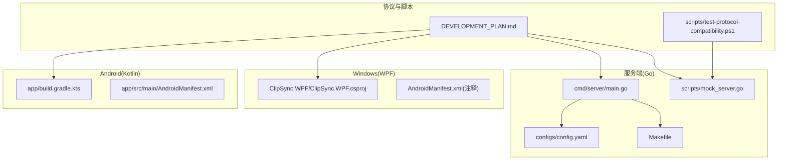
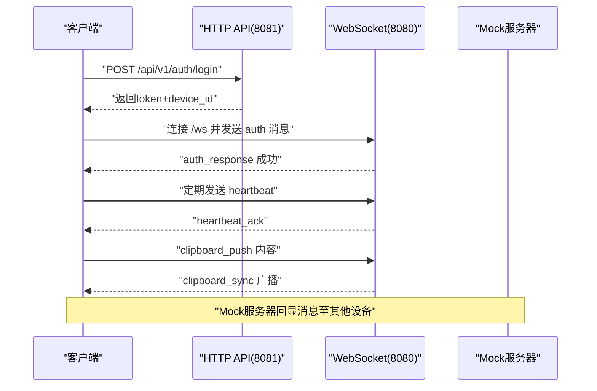
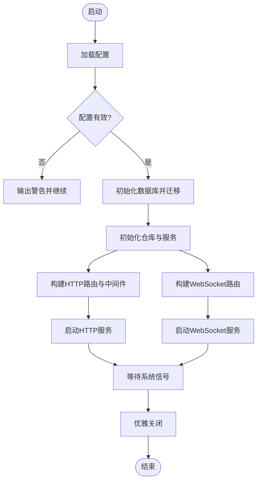
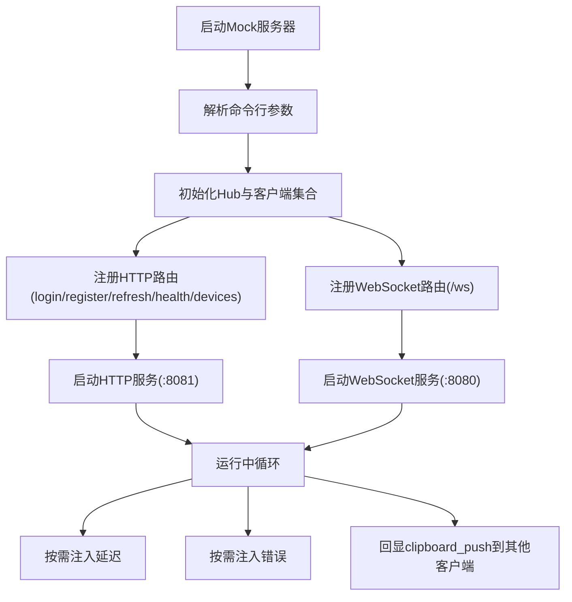
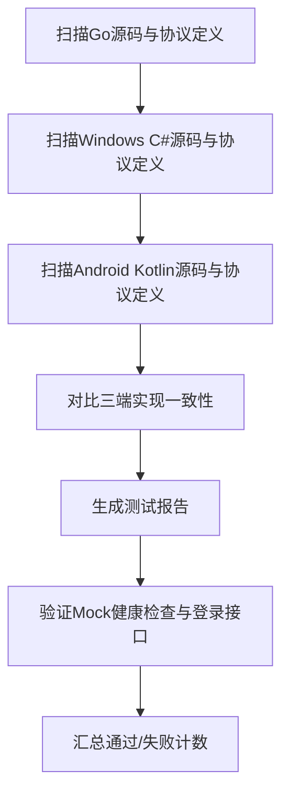
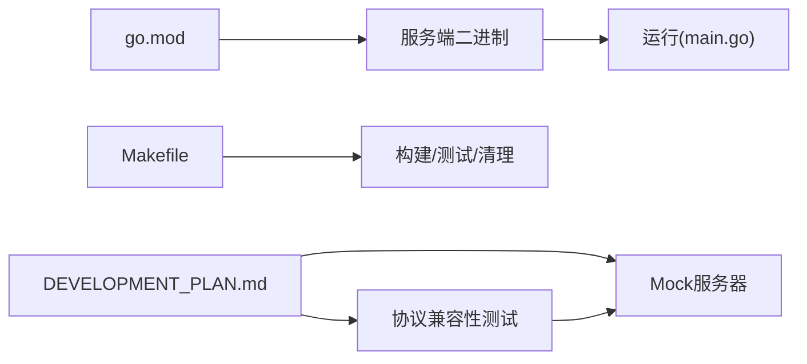

# 开发流程

<cite>
**本文引用的文件**
- [DEVELOPMENT_PLAN.md](file://DEVELOPMENT_PLAN.md)
- [main.go](file://clipSync-server/cmd/server/main.go)
- [config.yaml](file://clipSync-server/configs/config.yaml)
- [Makefile](file://clipSync-server/Makefile)
- [mock_server.go](file://clipSync-server/scripts/mock_server.go)
- [test-protocol-compatibility.ps1](file://scripts/test-protocol-compatibility.ps1)
- [build.gradle.kts](file://clipSync-android/app/build.gradle.kts)
- [AndroidManifest.xml](file://clipSync-android/app/src/main/AndroidManifest.xml)
- [ClipSync.WPF.csproj](file://clipSync-windows/ClipSync.WPF/ClipSync.WPF.csproj)
- [go.mod](file://clipSync-server/go.mod)
</cite>

## 目录
1. [引言](#引言)
2. [项目结构](#项目结构)
3. [核心组件](#核心组件)
4. [架构总览](#架构总览)
5. [详细组件分析](#详细组件分析)
6. [依赖关系分析](#依赖关系分析)
7. [性能考量](#性能考量)
8. [故障排查指南](#故障排查指南)
9. [结论](#结论)
10. [附录](#附录)

## 引言
本文件面向ClipSync项目的开发团队与协作方，系统化梳理从需求分析到代码发布的完整开发流程，覆盖并行开发策略、Git工作流与分支管理、阶段划分与里程碑、质量保障与集成测试、持续集成与自动化部署、代码合并策略与版本发布流程、回滚机制、开发工具配置与调试技巧，以及协作与冲突处理建议。文档以实际开发计划与现有代码为依据，既便于初学者理解，也为资深开发者提供足够的技术深度。

## 项目结构
ClipSync采用多端并行开发模式：Go语言服务端、Windows WPF客户端、Android Kotlin客户端共享同一协议规范，通过Mock服务器在早期实现零耦合联调。项目采用分层模块化组织：
- 服务端（Go）：命令入口、配置、认证、数据库、HTTP与WebSocket服务、加密与心跳等模块。
- 客户端（Windows）：WPF应用、本地存储、网络层、UI视图模型与视图、托盘与开机自启。
- 客户端（Android）：Compose UI、Room数据库、OkHttp WebSocket、前台服务与开机广播。
- 协议与脚本：统一消息格式与HTTP API契约、协议兼容性测试脚本、Mock服务器。

图表来源
- [main.go:1-146](file://clipSync-server/cmd/server/main.go#L1-L146)
- [config.yaml:1-29](file://clipSync-server/configs/config.yaml#L1-L29)
- [Makefile:1-33](file://clipSync-server/Makefile#L1-L33)
- [mock_server.go:1-664](file://clipSync-server/scripts/mock_server.go#L1-L664)
- [test-protocol-compatibility.ps1:1-207](file://scripts/test-protocol-compatibility.ps1#L1-L207)
- [build.gradle.kts:1-102](file://clipSync-android/app/build.gradle.kts#L1-L102)
- [AndroidManifest.xml:1-64](file://clipSync-android/app/src/main/AndroidManifest.xml#L1-L64)
- [ClipSync.WPF.csproj:1-24](file://clipSync-windows/ClipSync.WPF/ClipSync.WPF.csproj#L1-L24)

章节来源
- [DEVELOPMENT_PLAN.md:365-527](file://DEVELOPMENT_PLAN.md#L365-L527)
- [main.go:1-146](file://clipSync-server/cmd/server/main.go#L1-L146)
- [config.yaml:1-29](file://clipSync-server/configs/config.yaml#L1-L29)
- [Makefile:1-33](file://clipSync-server/Makefile#L1-L33)
- [mock_server.go:1-664](file://clipSync-server/scripts/mock_server.go#L1-L664)
- [test-protocol-compatibility.ps1:1-207](file://scripts/test-protocol-compatibility.ps1#L1-L207)
- [build.gradle.kts:1-102](file://clipSync-android/app/build.gradle.kts#L1-L102)
- [AndroidManifest.xml:1-64](file://clipSync-android/app/src/main/AndroidManifest.xml#L1-L64)
- [ClipSync.WPF.csproj:1-24](file://clipSync-windows/ClipSync.WPF/ClipSync.WPF.csproj#L1-L24)

## 核心组件
- 共享协议规范：定义WebSocket消息类型、字段命名、HTTP API契约、错误码与加密约定，确保三端一致性。
- Mock服务器：无数据库的本地模拟服务，支持延迟注入与错误注入，支撑客户端独立开发与联调。
- 服务端主程序：加载配置、初始化数据库与迁移、构建HTTP与WebSocket路由、启动认证中间件与限流器、优雅关闭。
- 客户端工程：Android使用Gradle/KSP/Compose/OkHttp/Room；Windows使用WPF/SQLite/NotifyIcon等NuGet包。
- 协议兼容性测试：跨语言扫描验证消息类型、字段命名、HTTP端点、协议版本、心跳、加密与错误码一致性，并验证Mock健康检查与登录接口。

章节来源
- [DEVELOPMENT_PLAN.md:18-362](file://DEVELOPMENT_PLAN.md#L18-L362)
- [mock_server.go:1-664](file://clipSync-server/scripts/mock_server.go#L1-L664)
- [main.go:1-146](file://clipSync-server/cmd/server/main.go#L1-L146)
- [build.gradle.kts:1-102](file://clipSync-android/app/build.gradle.kts#L1-L102)
- [ClipSync.WPF.csproj:1-24](file://clipSync-windows/ClipSync.WPF/ClipSync.WPF.csproj#L1-L24)
- [test-protocol-compatibility.ps1:1-207](file://scripts/test-protocol-compatibility.ps1#L1-L207)

## 架构总览
下图展示服务端与客户端的交互路径：客户端通过HTTP完成认证与设备管理，随后通过WebSocket进行实时剪贴板同步与心跳维持；Mock服务器在开发期替代真实服务，支持多设备回显与错误注入。

图表来源
- [main.go:100-125](file://clipSync-server/cmd/server/main.go#L100-L125)
- [mock_server.go:197-309](file://clipSync-server/scripts/mock_server.go#L197-L309)
- [test-protocol-compatibility.ps1:166-191](file://scripts/test-protocol-compatibility.ps1#L166-L191)

## 详细组件分析

### 服务端入口与生命周期
- 配置加载：优先读取环境变量指定的配置路径，校验并输出警告。
- 数据库初始化与迁移：打开SQLite连接并执行迁移。
- 仓库与服务初始化：用户、设备、剪贴板仓库，JWT管理器，认证服务，WebSocket Hub。
- 路由与中间件：HTTP路由注册认证、健康检查、设备与上传下载端点；WebSocket路由注册；认证中间件与速率限制器。
- 启动与优雅关闭：分别启动HTTP与WebSocket服务，监听系统信号进行超时关闭。

图表来源
- [main.go:21-145](file://clipSync-server/cmd/server/main.go#L21-L145)

章节来源
- [main.go:1-146](file://clipSync-server/cmd/server/main.go#L1-L146)
- [config.yaml:1-29](file://clipSync-server/configs/config.yaml#L1-L29)
- [Makefile:1-33](file://clipSync-server/Makefile#L1-L33)

### Mock服务器功能与测试
- 功能特性：接受任意凭据、模拟多设备同步（向其他客户端回显）、心跳响应、设备列表、可配置延迟与错误注入。
- 使用方式：通过命令行参数控制HTTP/WS端口、延迟、错误率与最大设备数；启动后打印服务信息。
- 测试验证：兼容性脚本对消息类型、字段命名、HTTP端点、协议版本、心跳、加密与错误码进行扫描；并通过健康检查与登录接口验证Mock可用性。

图表来源
- [mock_server.go:600-663](file://clipSync-server/scripts/mock_server.go#L600-L663)
- [test-protocol-compatibility.ps1:166-191](file://scripts/test-protocol-compatibility.ps1#L166-L191)

章节来源
- [mock_server.go:1-664](file://clipSync-server/scripts/mock_server.go#L1-L664)
- [test-protocol-compatibility.ps1:1-207](file://scripts/test-protocol-compatibility.ps1#L1-L207)

### 协议兼容性测试流程
- 扫描范围：服务端Go源码、Windows C#源码、Android Kotlin源码与协议消息定义文件。
- 检查维度：消息类型存在性、字段命名一致性(snake_case)、HTTP端点存在性、协议版本、心跳配置、加密支持、错误码定义、Mock健康检查与登录接口连通性。
- 结果汇总：统计通过/失败项，失败时输出缺失位置提示。

图表来源
- [test-protocol-compatibility.ps1:30-191](file://scripts/test-protocol-compatibility.ps1#L30-L191)

章节来源
- [test-protocol-compatibility.ps1:1-207](file://scripts/test-protocol-compatibility.ps1#L1-L207)
- [DEVELOPMENT_PLAN.md:716-797](file://DEVELOPMENT_PLAN.md#L716-L797)

### 客户端工程与权限配置
- Android工程：启用Compose、Room KSP编译、OkHttp WebSocket、序列化、协程与DataStore；最小SDK 26，目标SDK 34。
- Android清单：声明网络、前台服务、剪贴板与开机广播相关权限；注册Activity、前台服务与开机广播接收器。
- Windows工程：WPF应用，使用NotifyIcon、Sqlite、MVVM Toolkit与Newtonsoft.Json等NuGet包。

章节来源
- [build.gradle.kts:1-102](file://clipSync-android/app/build.gradle.kts#L1-L102)
- [AndroidManifest.xml:1-64](file://clipSync-android/app/src/main/AndroidManifest.xml#L1-L64)
- [ClipSync.WPF.csproj:1-24](file://clipSync-windows/ClipSync.WPF/ClipSync.WPF.csproj#L1-L24)

## 依赖关系分析
- 服务端依赖：JWT、WebSocket、SQLite驱动、YAML解析、加解密库等。
- 构建与运行：Makefile提供构建、运行、测试、清理与依赖安装；Go模块管理依赖。
- 协议与脚本：开发计划作为单源协议契约；兼容性脚本依赖PowerShell扫描与HTTP请求。

图表来源
- [go.mod:1-14](file://clipSync-server/go.mod#L1-L14)
- [Makefile:1-33](file://clipSync-server/Makefile#L1-L33)
- [main.go:1-146](file://clipSync-server/cmd/server/main.go#L1-L146)
- [DEVELOPMENT_PLAN.md:18-362](file://DEVELOPMENT_PLAN.md#L18-L362)
- [test-protocol-compatibility.ps1:1-207](file://scripts/test-protocol-compatibility.ps1#L1-L207)

章节来源
- [go.mod:1-14](file://clipSync-server/go.mod#L1-L14)
- [Makefile:1-33](file://clipSync-server/Makefile#L1-L33)
- [DEVELOPMENT_PLAN.md:18-362](file://DEVELOPMENT_PLAN.md#L18-L362)

## 性能考量
- 服务端优化：SQLite WAL模式、连接池与事务批处理、心跳超时检测、速率限制、日志级别控制。
- 客户端优化：WebSocket背压与缓冲队列、心跳定时器、自动重连指数退避、本地缓存与历史限制。
- 压测与稳定性：Mock服务器支持延迟与错误注入，便于验证客户端韧性；生产环境建议在2核2G云服务器上进行24小时稳定性测试。

章节来源
- [config.yaml:1-29](file://clipSync-server/configs/config.yaml#L1-L29)
- [mock_server.go:1-664](file://clipSync-server/scripts/mock_server.go#L1-L664)
- [DEVELOPMENT_PLAN.md:784-797](file://DEVELOPMENT_PLAN.md#L784-L797)

## 故障排查指南
- 启动失败：检查配置文件路径与环境变量、端口占用、数据库路径权限。
- 认证异常：确认HTTP端点可用、请求体字段与协议一致、JWT过期时间与刷新逻辑。
- 连接中断：验证心跳间隔、网络延迟、服务端心跳超时阈值、客户端自动重连策略。
- 协议不一致：运行协议兼容性测试脚本，定位缺失的消息类型或字段命名差异。
- Mock不可用：确认Mock服务器端口与延迟/错误注入参数，检查健康检查与登录接口返回。

章节来源
- [main.go:21-145](file://clipSync-server/cmd/server/main.go#L21-L145)
- [test-protocol-compatibility.ps1:166-191](file://scripts/test-protocol-compatibility.ps1#L166-L191)
- [mock_server.go:600-663](file://clipSync-server/scripts/mock_server.go#L600-L663)

## 结论
ClipSync采用“协议先行、Mock驱动、并行开发”的工程实践，通过明确的阶段里程碑与质量门禁，确保三端在早期即可独立开发并逐步收敛到端到端集成。配合自动化测试与Mock服务器，显著降低耦合度与联调成本。建议在后续迭代中完善CI流水线与发布策略，持续提升交付效率与质量。

## 附录

### 阶段划分与里程碑
- 阶段0：基础搭建（并行）——服务端项目骨架、客户端项目骨架与协议定义。
- 阶段1：核心基础设施（并行）——HTTP认证、数据库与Schema、客户端网络与加密。
- 阶段2：WebSocket与同步（并行）——Hub、消息路由、心跳与自动重连、剪贴板推送/拉取。
- 阶段3：功能与打磨（并行）——文件上传下载、设备管理、系统托盘/前台服务、界面与历史。
- 阶段4：集成与测试（收敛）——端到端测试、性能与安全审计、Bug修复。

章节来源
- [DEVELOPMENT_PLAN.md:531-581](file://DEVELOPMENT_PLAN.md#L531-L581)

### Git工作流与分支管理
- 主干保护：master/main仅允许通过受控合并进入，避免直接推送。
- 分支策略：feature/*用于新功能开发；hotfix/*用于紧急修复；release/*用于预发布与回归测试。
- 提交规范：语义化提交（feat/fix/docs/chore），附带简要说明与关联Issue。
- 合并与审查：Pull Request强制要求至少一名审查者批准，通过自动化测试与协议兼容性检查。

章节来源
- [DEVELOPMENT_PLAN.md:1-16](file://DEVELOPMENT_PLAN.md#L1-L16)

### 任务分配与进度跟踪
- 角色分工：服务端负责人、Windows客户端负责人、Android客户端负责人、测试与质量保障。
- 进度跟踪：每日站会、看板（Jira/Azure Boards）可视化任务状态、里程碑评审会议。
- 风险管理：识别阻塞性风险并升级，必要时调整并行度或回退方案。

章节来源
- [DEVELOPMENT_PLAN.md:800-929](file://DEVELOPMENT_PLAN.md#L800-L929)

### 质量保证与集成测试
- 单元测试：服务端单元测试、客户端单元测试与UI测试。
- 集成测试：M1-M6里程碑测试，覆盖协议兼容性、认证、WebSocket连接、剪贴板同步、全功能与生产就绪。
- 自动化脚本：协议兼容性测试脚本、Mock服务器健康检查与登录验证。

章节来源
- [DEVELOPMENT_PLAN.md:716-797](file://DEVELOPMENT_PLAN.md#L716-L797)
- [test-protocol-compatibility.ps1:1-207](file://scripts/test-protocol-compatibility.ps1#L1-L207)

### 持续集成与部署
- 构建与测试：Makefile提供一键构建、测试与清理；Go模块管理依赖。
- 部署：服务端二进制部署于Linux服务器，配置文件与数据目录分离；客户端打包发布渠道。
- 回滚：基于版本标签与灰度发布策略，出现问题快速回滚至上一稳定版本。

章节来源
- [Makefile:1-33](file://clipSync-server/Makefile#L1-L33)
- [go.mod:1-14](file://clipSync-server/go.mod#L1-L14)
- [DEVELOPMENT_PLAN.md:784-797](file://DEVELOPMENT_PLAN.md#L784-L797)

### 开发工具配置与调试技巧
- Go：使用标准库日志、配置文件与优雅关闭；建议IDE启用格式化与静态检查。
- Android：启用Compose预览、Room KSP、OkHttp日志、ADB调试；注意最小SDK与权限声明。
- Windows：WPF调试、SQLite本地数据库、系统托盘图标与开机自启验证。
- Mock：通过命令行参数调节延迟与错误率，模拟弱网与异常场景。

章节来源
- [main.go:1-146](file://clipSync-server/cmd/server/main.go#L1-L146)
- [build.gradle.kts:1-102](file://clipSync-android/app/build.gradle.kts#L1-L102)
- [AndroidManifest.xml:1-64](file://clipSync-android/app/src/main/AndroidManifest.xml#L1-L64)
- [mock_server.go:600-663](file://clipSync-server/scripts/mock_server.go#L600-L663)

### 协作与冲突处理
- 接口优先：客户端均面向协议接口编程，便于替换Mock与真实实现。
- 代码评审：严格遵循PR审查流程，关注协议一致性与性能影响。
- 冲突解决：当协议变更时，先更新开发计划与协议文件，再同步三端实现，最后运行兼容性测试。

章节来源
- [DEVELOPMENT_PLAN.md:691-714](file://DEVELOPMENT_PLAN.md#L691-L714)
- [test-protocol-compatibility.ps1:1-207](file://scripts/test-protocol-compatibility.ps1#L1-L207)