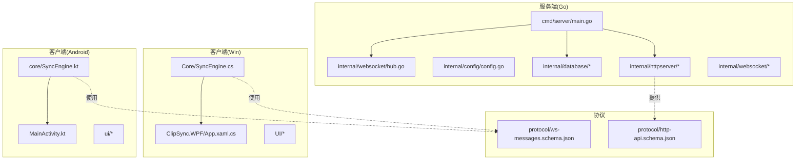
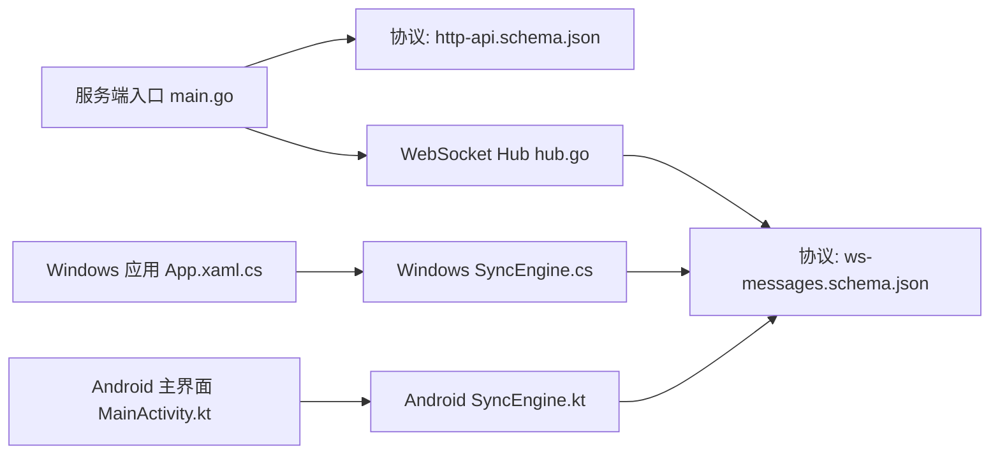

# 开发阶段里程碑

<cite>
**本文引用的文件**
- [DEVELOPMENT_PLAN.md](file://DEVELOPMENT_PLAN.md)
- [main.go](file://clipSync-server/cmd/server/main.go)
- [hub.go](file://clipSync-server/internal/websocket/hub.go)
- [ws-messages.schema.json](file://protocol/ws-messages.schema.json)
- [http-api.schema.json](file://protocol/http-api.schema.json)
- [test-protocol-compatibility.ps1](file://scripts/test-protocol-compatibility.ps1)
- [MainActivity.kt](file://clipSync-android/app/src/main/java/com/clipsync/app/MainActivity.kt)
- [SyncEngine.kt](file://clipSync-android/app/src/main/java/com/clipsync/app/core/SyncEngine.kt)
- [App.xaml.cs](file://clipSync-windows/ClipSync.WPF/App.xaml.cs)
- [SyncEngine.cs](file://clipSync-windows/ClipSync.WPF/Core/SyncEngine.cs)
</cite>

## 目录
1. [引言](#引言)
2. [项目结构](#项目结构)
3. [核心组件](#核心组件)
4. [架构总览](#架构总览)
5. [详细组件分析](#详细组件分析)
6. [依赖关系分析](#依赖关系分析)
7. [性能考虑](#性能考虑)
8. [故障排查指南](#故障排查指南)
9. [结论](#结论)
10. [附录](#附录)

## 引言
本文件面向ClipSync项目的开发团队与相关干系人，系统化梳理从第0阶段到第4阶段的完整开发周期，明确各阶段目标、交付成果、依赖关系与验收标准，并给出并行执行策略、质量保证流程、风险控制与进度跟踪方法。文档以实际开发计划与代码实现为依据，既便于初学者理解，也为有经验的开发者提供足够的技术深度。

## 项目结构
ClipSync采用跨平台并行开发模式，服务端（Go）与客户端（Windows WPF、Android Kotlin）分别独立演进，通过共享协议规范实现零阻塞协作。项目结构与职责划分如下：
- 服务端：负责配置管理、认证授权、数据库、WebSocket连接与消息广播、HTTP API、文件上传下载、健康检查等。
- 客户端（Windows）：负责系统剪贴板监听、本地设置存储、HTTP认证、WebSocket连接与心跳、自动重连、加密处理、系统托盘与UI。
- 客户端（Android）：负责剪贴板监听、SharedPreferences、Retrofit HTTP、WebSocket、心跳与重连、加密、前台服务与UI导航。
- 协议层：统一定义WebSocket消息与HTTP API契约，确保三端一致性。



图表来源
- [main.go:1-146](file://clipSync-server/cmd/server/main.go#L1-L146)
- [hub.go:1-230](file://clipSync-server/internal/websocket/hub.go#L1-L230)
- [ws-messages.schema.json:1-261](file://protocol/ws-messages.schema.json#L1-L261)
- [http-api.schema.json:1-293](file://protocol/http-api.schema.json#L1-L293)
- [App.xaml.cs:1-66](file://clipSync-windows/ClipSync.WPF/App.xaml.cs#L1-L66)
- [SyncEngine.cs:1-422](file://clipSync-windows/ClipSync.WPF/Core/SyncEngine.cs#L1-L422)
- [MainActivity.kt:1-139](file://clipSync-android/app/src/main/java/com/clipsync/app/MainActivity.kt#L1-L139)
- [SyncEngine.kt:1-250](file://clipSync-android/app/src/main/java/com/clipsync/app/core/SyncEngine.kt#L1-L250)

章节来源
- [DEVELOPMENT_PLAN.md:365-527](file://DEVELOPMENT_PLAN.md#L365-L527)

## 核心组件
- 服务端入口与路由：负责加载配置、初始化数据库与迁移、构建HTTP路由与WebSocket处理器、启动优雅关闭。
- WebSocket Hub：维护连接集合、注册/注销客户端、广播消息、统计在线设备数、超时断开与错误发送。
- 协议规范：统一WebSocket消息类型、字段命名、版本号、错误码；HTTP API契约与状态码。
- 客户端同步引擎：负责本地剪贴板监听、去重、推送、接收同步、历史拉取与保存、加密解密、心跳与重连。
- 质量保障脚本：自动化验证三端协议一致性、端点可用性与关键特性。

章节来源
- [main.go:21-146](file://clipSync-server/cmd/server/main.go#L21-L146)
- [hub.go:18-230](file://clipSync-server/internal/websocket/hub.go#L18-L230)
- [ws-messages.schema.json:1-261](file://protocol/ws-messages.schema.json#L1-L261)
- [http-api.schema.json:1-293](file://protocol/http-api.schema.json#L1-L293)
- [SyncEngine.kt:27-250](file://clipSync-android/app/src/main/java/com/clipsync/app/core/SyncEngine.kt#L27-L250)
- [SyncEngine.cs:8-422](file://clipSync-windows/ClipSync.WPF/Core/SyncEngine.cs#L8-L422)
- [test-protocol-compatibility.ps1:1-207](file://scripts/test-protocol-compatibility.ps1#L1-L207)

## 架构总览
下图展示服务端与客户端在各阶段的交互关系与数据流，体现“先协议、后服务、再客户端”的渐进式集成路径。

```mermaid
sequenceDiagram
participant Dev as "开发者"
participant Mock as "Mock服务器"
participant Win as "Windows客户端"
participant And as "Android客户端"
participant Srv as "服务端"
Dev->>Mock : 启动Mock服务器
Note right of Mock : HTTP : 8081 /api/v1/*<br/>WS : 8080 /ws
Dev->>Win : 运行客户端(开发模式)
Dev->>And : 运行客户端(开发模式)
Win->>Mock : 登录/注册(HTTP)
And->>Mock : 登录/注册(HTTP)
Win->>Mock : WebSocket连接/鉴权
And->>Mock : WebSocket连接/鉴权
Mock-->>Win : 心跳/设备列表/剪贴板历史
Mock-->>And : 心跳/设备列表/剪贴板历史
Win->>Mock : 剪贴板推送
And->>Mock : 剪贴板推送
Mock-->>Win : 剪贴板同步
Mock-->>And : 剪贴板同步
```

图表来源
- [DEVELOPMENT_PLAN.md:583-611](file://DEVELOPMENT_PLAN.md#L583-L611)
- [http-api.schema.json:8-124](file://protocol/http-api.schema.json#L8-L124)
- [ws-messages.schema.json:46-87](file://protocol/ws-messages.schema.json#L46-L87)

## 详细组件分析

### 阶段0：基础建设（第1周）——全并行
- 目标：三端同时起步，零依赖。
- 交付：
  - 服务端：工程脚手架、配置系统、SQLite连接（WAL）、协议消息结构体（Go）、Mock服务器脚本。
  - Windows：WPF工程脚手架、协议消息类（C#）、Mock WebSocket提供者、基础UI壳。
  - Android：Android工程脚手架、协议数据类（Kotlin）、Mock服务器配置、Compose UI壳。
- 关键点：接口优先、协议即单源真理；客户端通过Mock服务器进行早期开发与联调。

章节来源
- [DEVELOPMENT_PLAN.md:533-544](file://DEVELOPMENT_PLAN.md#L533-L544)
- [DEVELOPMENT_PLAN.md:583-611](file://DEVELOPMENT_PLAN.md#L583-L611)

### 阶段1：核心基础设施（第2-3周）——全并行
- 目标：完成认证与数据库、剪贴板监听与HTTP客户端、WebSocket骨架与加密。
- 交付：
  - 服务端：HTTP认证端点（登录/注册/刷新）、JWT生成、SQLite模式与迁移、用户/设备模型、健康检查。
  - Windows：系统剪贴板监听、本地设置存储、HTTP客户端（认证流程）、WebSocket客户端骨架、AES-256加密助手。
  - Android：系统剪贴板监听（ClipboardManager）、SharedPreferences、Retrofit HTTP客户端、WebSocket客户端骨架、加密助手。
- 关键点：认证流程闭环，服务端提供真实HTTP API；客户端可对接真实服务或Mock。

章节来源
- [DEVELOPMENT_PLAN.md:545-554](file://DEVELOPMENT_PLAN.md#L545-L554)
- [main.go:77-98](file://clipSync-server/cmd/server/main.go#L77-L98)
- [http-api.schema.json:8-124](file://protocol/http-api.schema.json#L8-L124)

### 阶段2：WebSocket与同步（第4-5周）——全并行
- 目标：完成WebSocket Hub、消息路由与处理、心跳监控、剪贴板广播与自动重连。
- 交付：
  - 服务端：WebSocket Hub（连接管理）、消息路由/处理、WS鉴权中间件、心跳监控、剪贴板广播逻辑、自动重连支持。
  - Windows：WebSocket消息处理、心跳定时器（30秒）、自动重连逻辑、剪贴板变更推送、同步接收、本地剪贴板历史（20-50项）。
  - Android：WebSocket消息处理、心跳管理（30秒）、自动重连逻辑、剪贴板变更推送、同步接收、Room数据库历史。
- 关键点：Hub负责按用户广播，避免跨用户泄露；客户端实现去重与回环防护。

章节来源
- [DEVELOPMENT_PLAN.md:555-564](file://DEVELOPMENT_PLAN.md#L555-L564)
- [hub.go:61-121](file://clipSync-server/internal/websocket/hub.go#L61-L121)
- [SyncEngine.kt:72-160](file://clipSync-android/app/src/main/java/com/clipsync/app/core/SyncEngine.kt#L72-L160)
- [SyncEngine.cs:127-267](file://clipSync-windows/ClipSync.WPF/Core/SyncEngine.cs#L127-L267)

### 阶段3：功能完善与打磨（第6-7周）——全并行
- 目标：文件上传/下载、设备管理、限流、连接限制优化、日志与错误处理、WAL优化。
- 交付：
  - 服务端：文件上传/下载端点、设备管理API、速率限制、连接限制（2核优化）、日志与错误处理、WAL模式优化。
  - Windows：系统托盘集成、开机自启、图像剪贴板支持、文件片段支持、设备列表UI、设置UI、历史UI。
  - Android：前台服务、开机广播接收（自启动）、图像剪贴板支持、通知管理、设备列表界面、设置界面、历史界面。
- 关键点：首次集成测试开始，逐步收敛问题。

章节来源
- [DEVELOPMENT_PLAN.md:565-574](file://DEVELOPMENT_PLAN.md#L565-L574)
- [main.go:100-125](file://clipSync-server/cmd/server/main.go#L100-L125)

### 阶段4：集成与测试（第8周）——收敛
- 目标：端到端测试、跨平台同步验证、性能测试（2核服务器）、缺陷修复、边缘错误处理、安全审计。
- 交付：所有阶段成果整合，形成生产就绪版本。
- 关键点：24小时稳定性测试、内存泄漏检测、数据库性能（WAL验证）、错误恢复场景、令牌与加密安全审计。

章节来源
- [DEVELOPMENT_PLAN.md:575-580](file://DEVELOPMENT_PLAN.md#L575-L580)

## 依赖关系分析
- 协议驱动：三端严格遵循协议规范（消息类型、字段命名、版本、错误码），通过JSON Schema校验一致性。
- 服务端依赖：配置→数据库（含迁移）→仓库层→HTTP路由→WebSocket Hub→消息处理。
- 客户端依赖：设置管理→剪贴板监听→网络层（HTTP/WS）→加密助手→UI/系统集成。
- 质量保障：协议兼容性脚本扫描三端实现与协议定义，自动验证端点与关键特性。



图表来源
- [ws-messages.schema.json:1-261](file://protocol/ws-messages.schema.json#L1-L261)
- [http-api.schema.json:1-293](file://protocol/http-api.schema.json#L1-L293)
- [main.go:21-146](file://clipSync-server/cmd/server/main.go#L21-L146)
- [hub.go:18-230](file://clipSync-server/internal/websocket/hub.go#L18-L230)
- [App.xaml.cs:12-52](file://clipSync-windows/ClipSync.WPF/App.xaml.cs#L12-L52)
- [SyncEngine.cs:32-71](file://clipSync-windows/ClipSync.WPF/Core/SyncEngine.cs#L32-L71)
- [MainActivity.kt:26-42](file://clipSync-android/app/src/main/java/com/clipsync/app/MainActivity.kt#L26-L42)
- [SyncEngine.kt:43-67](file://clipSync-android/app/src/main/java/com/clipsync/app/core/SyncEngine.kt#L43-L67)

章节来源
- [DEVELOPMENT_PLAN.md:834-870](file://DEVELOPMENT_PLAN.md#L834-L870)

## 性能考虑
- 服务器端：
  - 使用SQLite WAL模式提升并发写入性能。
  - 通过连接数限制与速率限制缓解2核2G服务器压力。
  - 广播通道缓冲与客户端发送队列满时的断连策略，避免内存膨胀。
- 客户端：
  - 去重（基于checksum）减少重复推送。
  - 心跳间隔30秒，指数退避重连上限60秒，降低网络抖动影响。
  - 历史条目限制（默认50），定期清理，避免数据库增长过快。

章节来源
- [DEVELOPMENT_PLAN.md:912-923](file://DEVELOPMENT_PLAN.md#L912-L923)
- [hub.go:91-110](file://clipSync-server/internal/websocket/hub.go#L91-L110)
- [SyncEngine.kt:86-91](file://clipSync-android/app/src/main/java/com/clipsync/app/core/SyncEngine.kt#L86-L91)
- [SyncEngine.cs:108-117](file://clipSync-windows/ClipSync.WPF/Core/SyncEngine.cs#L108-L117)

## 故障排查指南
- 协议一致性验证：
  - 使用协议兼容性脚本扫描三端实现与协议定义，覆盖消息类型、字段命名、HTTP端点、协议版本、心跳配置、加密支持与错误码。
  - 自动化验证Mock服务器连通性（健康检查与登录）。
- 常见问题定位：
  - 认证失败：检查HTTP端点返回与错误码映射。
  - 连接异常：确认WebSocket鉴权是否在30秒内完成，心跳是否正常。
  - 同步不生效：检查去重逻辑与回环防护，确认广播范围与用户隔离。
  - 性能问题：关注历史条目上限、WAL模式启用、连接数与速率限制配置。
- 日志与可观测性：
  - 服务端：统一日志格式，关键事件（连接/断开/广播）打印。
  - 客户端：全局未处理异常捕获，关键路径打点与错误上报。

章节来源
- [test-protocol-compatibility.ps1:170-191](file://scripts/test-protocol-compatibility.ps1#L170-L191)
- [test-protocol-compatibility.ps1:52-164](file://scripts/test-protocol-compatibility.ps1#L52-L164)
- [main.go:21-41](file://clipSync-server/cmd/server/main.go#L21-L41)
- [App.xaml.cs:16-33](file://clipSync-windows/ClipSync.WPF/App.xaml.cs#L16-L33)

## 结论
通过“协议先行、服务端与客户端并行开发、阶段性集成测试”的策略，ClipSync能够在8周内完成从零到可部署版本的完整交付。协议作为单源真相贯穿始终，配合Mock服务器与自动化测试，有效规避了跨平台开发中的常见阻塞与不一致问题。建议在第8周完成后，持续进行回归测试与性能压测，确保生产环境稳定运行。

## 附录

### 阶段间过渡条件与验收标准
- 阶段0→1：三端均完成协议解析与Mock可用；Windows/Android具备HTTP认证能力。
- 阶段1→2：服务端HTTP认证与数据库就绪；客户端完成剪贴板监听与WebSocket骨架。
- 阶段2→3：服务端WebSocket Hub与广播逻辑稳定；客户端完成心跳与重连。
- 阶段3→4：文件上传/下载、设备管理、系统托盘/前台服务完成；进入端到端与性能测试。

章节来源
- [DEVELOPMENT_PLAN.md:533-580](file://DEVELOPMENT_PLAN.md#L533-L580)

### 风险控制与资源规划
- 风险清单与缓解措施：协议变更冻结、Mock服务器消除服务端阻塞、平台差异早发现、AES一致性测试、Android后台限制研究、2核服务器负载压测。
- 资源风险：内存监控与阈值重启、历史条目清理、查询优化与连接限制。

章节来源
- [DEVELOPMENT_PLAN.md:800-831](file://DEVELOPMENT_PLAN.md#L800-L831)

### 开发进度跟踪与里程碑庆祝
- 进度跟踪：按周可视化矩阵（Week 1-8），标注各阶段任务与集成点。
- 里程碑庆祝：每完成一个集成里程碑（M1-M6）举行简短回顾会，固化通过的测试用例与最佳实践，激励团队。

章节来源
- [DEVELOPMENT_PLAN.md:834-870](file://DEVELOPMENT_PLAN.md#L834-L870)