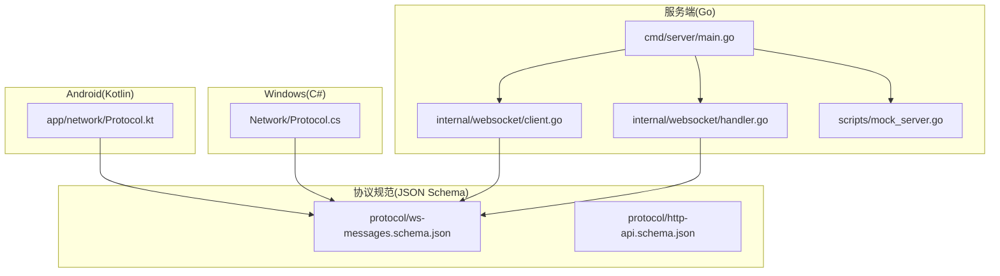
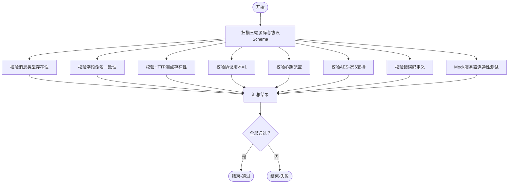
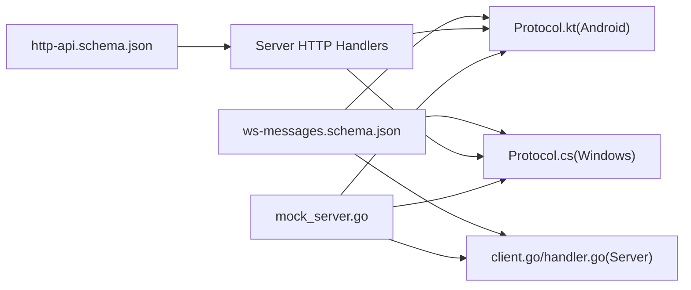

# 集成测试流程

<cite>
**本文引用的文件**
- [DEVELOPMENT_PLAN.md](file://DEVELOPMENT_PLAN.md)
- [test-protocol-compatibility.ps1](file://scripts/test-protocol-compatibility.ps1)
- [mock_server.go](file://clipSync-server/scripts/mock_server.go)
- [ws-messages.schema.json](file://protocol/ws-messages.schema.json)
- [http-api.schema.json](file://protocol/http-api.schema.json)
- [client.go](file://clipSync-server/internal/websocket/client.go)
- [handler.go](file://clipSync-server/internal/websocket/handler.go)
- [Protocol.kt](file://clipSync-android/app/src/main/java/com/clipsync/app/network/Protocol.kt)
- [Protocol.cs](file://clipSync-windows/ClipSync.WPF/Network/Protocol.cs)
</cite>

## 目录
1. [简介](#简介)
2. [项目结构](#项目结构)
3. [核心组件](#核心组件)
4. [架构总览](#架构总览)
5. [详细组件分析](#详细组件分析)
6. [依赖关系分析](#依赖关系分析)
7. [性能考虑](#性能考虑)
8. [故障排查指南](#故障排查指南)
9. [结论](#结论)
10. [附录](#附录)

## 简介
本文件面向ClipSync项目的集成测试流程，系统化阐述从协议兼容性测试到端到端集成测试的完整策略与实施方法。文档覆盖M1至M6六个集成里程碑的测试目标、验证标准与通过条件，并结合开发计划中的具体示例（协议消息的序列化/反序列化、认证流程、WebSocket连接、剪贴板同步等），提供可操作的测试步骤、自动化脚本使用方法、Mock服务器配置与运行方式、性能与压力测试建议、错误处理测试要点，以及测试数据生成、环境搭建与结果分析方法。内容兼顾初学者易懂与资深开发者所需的技术深度。

## 项目结构
ClipSync由三端并行开发：Go服务端、Windows WPF客户端、Android Kotlin客户端，共享统一的协议规范与Mock服务器，确保零依赖并行推进。开发计划中定义了清晰的阶段与里程碑，集成测试贯穿各阶段并在第8周收敛执行。



**图表来源**
- [mock_server.go:1-664](file://clipSync-server/scripts/mock_server.go#L1-L664)
- [client.go:1-150](file://clipSync-server/internal/websocket/client.go#L1-L150)
- [handler.go:1-392](file://clipSync-server/internal/websocket/handler.go#L1-L392)
- [Protocol.kt:1-263](file://clipSync-android/app/src/main/java/com/clipsync/app/network/Protocol.kt#L1-L263)
- [Protocol.cs:1-167](file://clipSync-windows/ClipSync.WPF/Network/Protocol.cs#L1-L167)
- [ws-messages.schema.json:1-261](file://protocol/ws-messages.schema.json#L1-L261)
- [http-api.schema.json:1-293](file://protocol/http-api.schema.json#L1-L293)

**章节来源**
- [DEVELOPMENT_PLAN.md:365-527](file://DEVELOPMENT_PLAN.md#L365-L527)

## 核心组件
- 协议规范：基于JSON Schema定义的WebSocket消息与HTTP API契约，确保三端实现一致。
- Mock服务器：无数据库依赖的开发用模拟服务，支持心跳、设备列表、剪贴板历史、可配置延迟与错误注入。
- 客户端协议实现：Android与Windows分别以Kotlin与C#实现消息结构体与序列化工具，遵循协议规范。
- 服务端WebSocket处理：负责消息路由、鉴权、心跳、广播与错误返回。

**章节来源**
- [ws-messages.schema.json:1-261](file://protocol/ws-messages.schema.json#L1-L261)
- [http-api.schema.json:1-293](file://protocol/http-api.schema.json#L1-L293)
- [mock_server.go:1-664](file://clipSync-server/scripts/mock_server.go#L1-L664)
- [Protocol.kt:1-263](file://clipSync-android/app/src/main/java/com/clipsync/app/network/Protocol.kt#L1-L263)
- [Protocol.cs:1-167](file://clipSync-windows/ClipSync.WPF/Network/Protocol.cs#L1-L167)
- [client.go:1-150](file://clipSync-server/internal/websocket/client.go#L1-L150)
- [handler.go:1-392](file://clipSync-server/internal/websocket/handler.go#L1-L392)

## 架构总览
下图展示集成测试的关键交互路径：客户端通过HTTP完成认证获取令牌，再通过WebSocket进行鉴权与消息收发；Mock服务器在开发阶段替代真实服务，提供稳定可控的测试环境。

```mermaid
sequenceDiagram
participant Dev as "开发者"
participant Mock as "Mock服务器"
participant Win as "Windows客户端"
participant And as "Android客户端"
Dev->>Mock : 启动Mock服务器(端口8081/8080)
Dev->>Win : 运行客户端(连接ws : //localhost : 8080)
Dev->>And : 运行客户端(连接ws : //localhost : 8080)
Win->>Mock : HTTP POST /api/v1/auth/login
Mock-->>Win : 返回token+device_id
Win->>Mock : WebSocket发送auth消息
Mock-->>Win : 返回auth_response
Win->>Mock : 发送heartbeat/clipboard_push
Mock-->>Win : 返回heartbeat_ack/clipboard_sync
And->>Mock : 发送clipboard_push
Mock-->>And : 广播clipboard_sync给其他设备
```

**图表来源**
- [mock_server.go:476-508](file://clipSync-server/scripts/mock_server.go#L476-L508)
- [mock_server.go:285-309](file://clipSync-server/scripts/mock_server.go#L285-L309)
- [mock_server.go:357-406](file://clipSync-server/scripts/mock_server.go#L357-L406)
- [Protocol.cs:79-141](file://clipSync-windows/ClipSync.WPF/Network/Protocol.cs#L79-L141)
- [Protocol.kt:210-262](file://clipSync-android/app/src/main/java/com/clipsync/app/network/Protocol.kt#L210-L262)

## 详细组件分析

### 协议兼容性测试(M1)
- 测试目标：验证三端对WebSocket消息类型、字段命名、HTTP端点、协议版本、心跳配置、加密支持与错误码的一致性。
- 自动化脚本：PowerShell脚本扫描源码与协议Schema，逐项比对并输出通过/失败统计。
- 关键验证点：
  - 消息类型存在性：auth、auth_response、heartbeat、clipboard_push、clipboard_sync、clipboard_pull、clipboard_history、device_list、device_list_response、device_unregister、error、ping、pong。
  - 字段命名一致性：snake_case风格（如device_id、content_type等）。
  - HTTP端点：/api/v1/auth/login、/api/v1/auth/register、/api/v1/auth/refresh、/api/v1/health、/api/v1/devices。
  - 协议版本：均为1。
  - 心跳配置：Go/Windows/Android均实现心跳逻辑。
  - 加密支持：三端均实现AES-256能力。
  - 错误码：AUTH_FAILED、TOKEN_EXPIRED、RATE_LIMITED、INVALID_PAYLOAD、CONTENT_TOO_LARGE、DEVICE_NOT_FOUND、INTERNAL_ERROR、DUPLICATE_CONTENT。
  - Mock服务器连通性：健康检查与登录接口可用。
- 通过条件：所有断言通过，无失败项。



**图表来源**
- [test-protocol-compatibility.ps1:52-164](file://scripts/test-protocol-compatibility.ps1#L52-L164)

**章节来源**
- [test-protocol-compatibility.ps1:1-207](file://scripts/test-protocol-compatibility.ps1#L1-L207)
- [ws-messages.schema.json:8-26](file://protocol/ws-messages.schema.json#L8-L26)
- [http-api.schema.json:8-210](file://protocol/http-api.schema.json#L8-L210)

### 认证流程测试(M2)
- 测试目标：验证客户端能成功注册/登录并获取有效token，HTTP API调用正常，token刷新可用。
- 测试步骤：
  - 启动Mock服务器。
  - Windows客户端：注册 → 登录 → 获取token与device_id → 使用Bearer Token访问HTTP API。
  - Android客户端：注册 → 登录 → 获取token与device_id → 使用Bearer Token访问HTTP API。
  - 验证刷新接口：携带Bearer Token请求刷新接口。
- 通过条件：两客户端均能完成全链路认证，HTTP响应符合Schema定义。

**章节来源**
- [mock_server.go:476-534](file://clipSync-server/scripts/mock_server.go#L476-L534)
- [http-api.schema.json:8-124](file://protocol/http-api.schema.json#L8-L124)

### WebSocket连接测试(M3)
- 测试目标：验证客户端可建立WebSocket连接、完成鉴权、维持心跳、自动重连与在线状态显示。
- 测试步骤：
  - 启动Mock服务器。
  - 双端连接ws://localhost:8080。
  - 发送auth消息，接收auth_response。
  - 周期性发送heartbeat，接收heartbeat_ack。
  - 模拟服务端ping，客户端返回pong。
  - 断开服务端后重启，验证自动重连。
- 通过条件：稳定连接至少10分钟，心跳周期准确，断线重连成功。

**章节来源**
- [mock_server.go:285-309](file://clipSync-server/scripts/mock_server.go#L285-L309)
- [client.go:34-67](file://clipSync-server/internal/websocket/client.go#L34-L67)
- [client.go:69-117](file://clipSync-server/internal/websocket/client.go#L69-L117)

### 剪贴板同步测试(M4)
- 测试目标：实现跨设备实时同步，支持文本与图片，具备去重与历史拉取能力。
- 测试步骤：
  - 在Windows复制文本 → 观察Android端是否收到clipboard_sync。
  - 在Android复制文本 → 观察Windows端是否收到clipboard_sync。
  - 在Windows复制图片 → 观察Android端是否收到clipboard_sync。
  - 请求剪贴板历史，验证items、total、has_more字段。
  - 验证相同内容的checksum去重。
- 通过条件：双向实时同步、历史完整、去重生效。

**章节来源**
- [mock_server.go:357-406](file://clipSync-server/scripts/mock_server.go#L357-L406)
- [mock_server.go:408-445](file://clipSync-server/scripts/mock_server.go#L408-L445)
- [handler.go:142-234](file://clipSync-server/internal/websocket/handler.go#L142-L234)
- [handler.go:236-285](file://clipSync-server/internal/websocket/handler.go#L236-L285)

### 全功能集成测试(M5)
- 测试目标：设备管理、文件上传下载、设置持久化、开机自启、托盘/前台服务、性能与稳定性。
- 测试步骤：
  - 设备管理：列出设备、注销设备、确认断开连接。
  - 文件上传下载：大内容分片上传与下载。
  - 设置持久化：应用退出后重启仍保持配置。
  - 自启动行为：系统启动后应用自动运行。
  - UI与通知：托盘图标、前台服务通知。
  - 性能：快速连续复制多条内容，观察延迟与吞吐。
- 通过条件：所有功能可用且无严重缺陷。

**章节来源**
- [http-api.schema.json:178-278](file://protocol/http-api.schema.json#L178-L278)
- [DEVELOPMENT_PLAN.md:770-783](file://DEVELOPMENT_PLAN.md#L770-L783)

### 生产就绪测试(M6)
- 测试目标：部署于2核2G云服务器，执行24小时稳定性测试，检测内存泄漏、数据库性能与错误恢复。
- 测试步骤：
  - 部署服务端至2核2G云服务器。
  - 运行24小时稳定性测试，监控内存、CPU、连接数。
  - 执行压力测试：高并发复制、断网重连、异常注入。
  - 安全审计：令牌颁发与刷新、加密传输、错误码覆盖。
- 通过条件：内存使用稳定、错误场景可恢复、安全策略有效。

**章节来源**
- [DEVELOPMENT_PLAN.md:784-797](file://DEVELOPMENT_PLAN.md#L784-L797)

## 依赖关系分析
- 协议规范驱动三端实现：消息枚举、字段命名、Payload结构、错误码均以Schema为准。
- Mock服务器作为服务端替身：提供HTTP与WebSocket双栈，便于客户端独立验证。
- 客户端协议实现依赖序列化库：Android使用Kotlinx Serialization，Windows使用Newtonsoft.Json。
- 服务端WebSocket处理依赖消息路由与鉴权中间件。



**图表来源**
- [ws-messages.schema.json:1-261](file://protocol/ws-messages.schema.json#L1-L261)
- [http-api.schema.json:1-293](file://protocol/http-api.schema.json#L1-L293)
- [Protocol.kt:1-263](file://clipSync-android/app/src/main/java/com/clipsync/app/network/Protocol.kt#L1-L263)
- [Protocol.cs:1-167](file://clipSync-windows/ClipSync.WPF/Network/Protocol.cs#L1-L167)
- [client.go:1-150](file://clipSync-server/internal/websocket/client.go#L1-L150)
- [handler.go:1-392](file://clipSync-server/internal/websocket/handler.go#L1-L392)
- [mock_server.go:1-664](file://clipSync-server/scripts/mock_server.go#L1-L664)

**章节来源**
- [ws-messages.schema.json:1-261](file://protocol/ws-messages.schema.json#L1-L261)
- [http-api.schema.json:1-293](file://protocol/http-api.schema.json#L1-L293)
- [Protocol.kt:1-263](file://clipSync-android/app/src/main/java/com/clipsync/app/network/Protocol.kt#L1-L263)
- [Protocol.cs:1-167](file://clipSync-windows/ClipSync.WPF/Network/Protocol.cs#L1-L167)
- [client.go:1-150](file://clipSync-server/internal/websocket/client.go#L1-L150)
- [handler.go:1-392](file://clipSync-server/internal/websocket/handler.go#L1-L392)
- [mock_server.go:1-664](file://clipSync-server/scripts/mock_server.go#L1-L664)

## 性能考虑
- 延迟与抖动：Mock服务器支持配置延迟与误差率，可用于模拟真实网络环境下的抖动与丢包。
- 心跳与保活：服务端与客户端均实现心跳机制，保障长连接稳定性。
- 广播与去重：服务端对同一用户设备间广播剪贴板，基于checksum去重避免重复同步。
- 数据库与缓存：服务端采用SQLite WAL模式优化写入性能；客户端本地缓存历史与设备信息。
- 压力测试建议：
  - 连续高频复制文本/图片，测量端到端延迟与吞吐。
  - 多设备同时在线，观察广播延迟与内存占用。
  - 异常注入：开启错误注入率，验证客户端重试与降级策略。

**章节来源**
- [mock_server.go:161-176](file://clipSync-server/scripts/mock_server.go#L161-L176)
- [mock_server.go:357-406](file://clipSync-server/scripts/mock_server.go#L357-L406)
- [client.go:69-117](file://clipSync-server/internal/websocket/client.go#L69-L117)

## 故障排查指南
- 协议不一致：
  - 使用协议兼容性脚本定位缺失的消息类型或字段命名差异。
  - 对照Schema修正客户端实现。
- 认证失败：
  - 检查HTTP登录/注册响应是否包含token与device_id。
  - 确认WebSocket鉴权消息中token与device_name/platform字段正确。
- 连接不稳定：
  - 检查心跳间隔与超时设置，确保未被防火墙阻断。
  - 使用Mock服务器的延迟与错误注入参数复现问题。
- 同步异常：
  - 核对checksum计算与去重逻辑。
  - 验证clipboard_pull的limit与after_id参数。
- 错误码处理：
  - 统一映射HTTP与WebSocket错误码，完善客户端提示与重试策略。

**章节来源**
- [test-protocol-compatibility.ps1:166-191](file://scripts/test-protocol-compatibility.ps1#L166-L191)
- [mock_server.go:311-343](file://clipSync-server/scripts/mock_server.go#L311-L343)
- [handler.go:142-172](file://clipSync-server/internal/websocket/handler.go#L142-L172)

## 结论
通过M1至M6的渐进式集成测试，结合协议规范驱动与Mock服务器支撑，ClipSync实现了三端并行开发与早期集成验证。该测试体系既保证了协议一致性与功能正确性，也为后续性能优化与生产就绪提供了坚实基础。

## 附录

### 测试脚本与自动化配置
- 协议兼容性测试脚本：扫描三端源码与协议Schema，输出通过/失败统计，支持Mock服务器连通性验证。
- Mock服务器：默认监听8081(HTTP)与8080(WebSocket)，支持延迟与错误注入参数，便于模拟复杂网络场景。

**章节来源**
- [test-protocol-compatibility.ps1:1-207](file://scripts/test-protocol-compatibility.ps1#L1-L207)
- [mock_server.go:600-663](file://clipSync-server/scripts/mock_server.go#L600-L663)

### 测试数据生成与环境搭建
- 测试数据：可参考协议Schema中的字段约束生成合法的请求/响应样本，用于单元与集成测试。
- 环境搭建：确保三端编译通过，Mock服务器启动成功，客户端连接端口可达。

**章节来源**
- [ws-messages.schema.json:88-261](file://protocol/ws-messages.schema.json#L88-L261)
- [http-api.schema.json:1-293](file://protocol/http-api.schema.json#L1-L293)