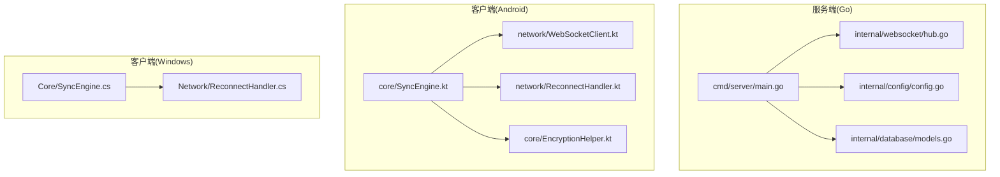
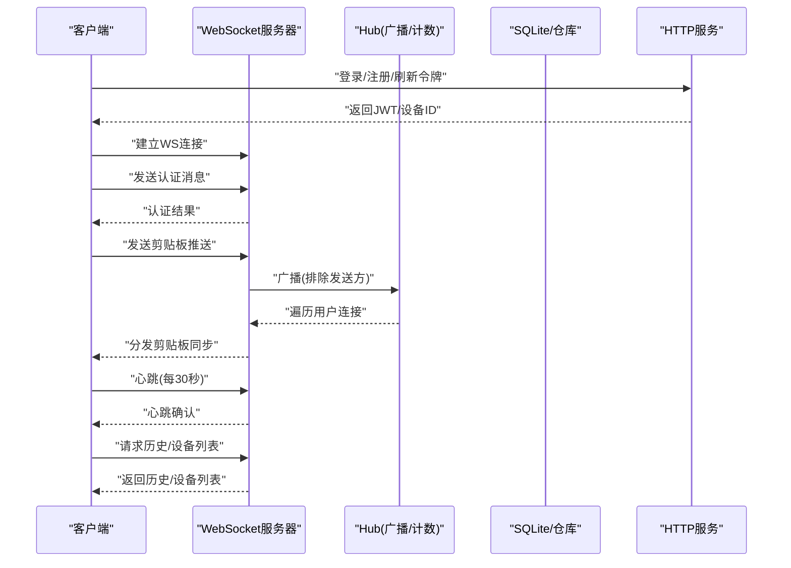
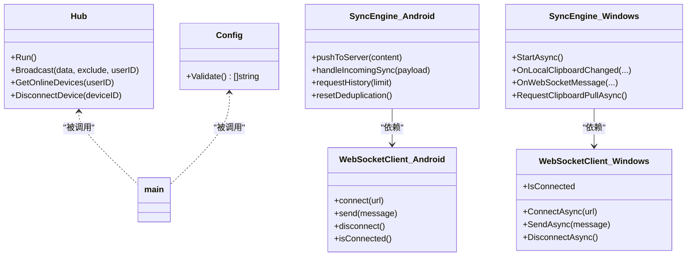

# 风险评估与管理

<cite>
**本文引用的文件**
- [DEVELOPMENT_PLAN.md](file://DEVELOPMENT_PLAN.md)
- [main.go](file://clipSync-server/cmd/server/main.go)
- [config.go](file://clipSync-server/internal/config/config.go)
- [hub.go](file://clipSync-server/internal/websocket/hub.go)
- [models.go](file://clipSync-server/internal/database/models.go)
- [SyncEngine.kt](file://clipSync-android/app/src/main/java/com/clipsync/app/core/SyncEngine.kt)
- [WebSocketClient.kt](file://clipSync-android/app/src/main/java/com/clipsync/app/network/WebSocketClient.kt)
- [ReconnectHandler.kt](file://clipSync-android/app/src/main/java/com/clipsync/app/network/ReconnectHandler.kt)
- [EncryptionHelper.kt](file://clipSync-android/app/src/main/java/com/clipsync/app/core/EncryptionHelper.kt)
- [SyncEngine.cs](file://clipSync-windows/ClipSync.WPF/Core/SyncEngine.cs)
- [WebSocketClient.cs](file://clipSync-windows/ClipSync.WPF/Network/ReconnectHandler.cs)
- [test-protocol-compatibility.ps1](file://scripts/test-protocol-compatibility.ps1)
</cite>

## 目录
1. [引言](#引言)
2. [项目结构](#项目结构)
3. [核心组件](#核心组件)
4. [架构总览](#架构总览)
5. [详细组件分析](#详细组件分析)
6. [依赖关系分析](#依赖关系分析)
7. [性能考量](#性能考量)
8. [故障排查指南](#故障排查指南)
9. [结论](#结论)
10. [附录](#附录)

## 引言
本文件面向ClipSync项目的风险评估与管理，系统化梳理技术、进度、质量与资源四类风险，并结合开发计划中的并行开发模式、协议规范与测试脚本，给出可操作的识别、评估与缓解策略。文档既适合初学者快速上手，也为有经验的开发者提供深入的技术细节与实操建议。

## 项目结构
ClipSync采用跨平台并行开发：Go服务端、Windows WPF客户端、Android Kotlin客户端三线并进，通过共享协议规范与Mock策略降低耦合，确保各模块在早期即可独立开发与验证。

图表来源
- [main.go:1-146](file://clipSync-server/cmd/server/main.go#L1-L146)
- [config.go:1-72](file://clipSync-server/internal/config/config.go#L1-L72)
- [hub.go:1-230](file://clipSync-server/internal/websocket/hub.go#L1-L230)
- [models.go:1-46](file://clipSync-server/internal/database/models.go#L1-L46)
- [SyncEngine.kt:1-250](file://clipSync-android/app/src/main/java/com/clipsync/app/core/SyncEngine.kt#L1-L250)
- [WebSocketClient.kt:1-156](file://clipSync-android/app/src/main/java/com/clipsync/app/network/WebSocketClient.kt#L1-L156)
- [ReconnectHandler.kt:1-80](file://clipSync-android/app/src/main/java/com/clipsync/app/network/ReconnectHandler.kt#L1-L80)
- [EncryptionHelper.kt:1-157](file://clipSync-android/app/src/main/java/com/clipsync/app/core/EncryptionHelper.kt#L1-L157)
- [SyncEngine.cs:1-422](file://clipSync-windows/ClipSync.WPF/Core/SyncEngine.cs#L1-L422)
- [WebSocketClient.cs:1-146](file://clipSync-windows/ClipSync.WPF/Network/ReconnectHandler.cs#L1-L146)

章节来源
- [DEVELOPMENT_PLAN.md:365-527](file://DEVELOPMENT_PLAN.md#L365-L527)

## 核心组件
- 协议与消息规范：统一的WebSocket消息格式、HTTP API契约、错误码与加密规范，是跨平台一致性与风险隔离的关键。
- 服务端（Go）：配置加载与校验、数据库初始化与迁移、认证与中间件、HTTP与WebSocket路由、心跳与广播、文件上传下载。
- 客户端（Android）：同步引擎、WebSocket客户端、自动重连、加密与去重。
- 客户端（Windows）：同步引擎、WebSocket客户端、自动重连、历史存储与UI事件。

章节来源
- [DEVELOPMENT_PLAN.md:18-362](file://DEVELOPMENT_PLAN.md#L18-L362)
- [main.go:21-146](file://clipSync-server/cmd/server/main.go#L21-L146)
- [config.go:10-72](file://clipSync-server/internal/config/config.go#L10-L72)
- [hub.go:18-230](file://clipSync-server/internal/websocket/hub.go#L18-L230)
- [SyncEngine.kt:27-250](file://clipSync-android/app/src/main/java/com/clipsync/app/core/SyncEngine.kt#L27-L250)
- [WebSocketClient.kt:26-156](file://clipSync-android/app/src/main/java/com/clipsync/app/network/WebSocketClient.kt#L26-L156)
- [ReconnectHandler.kt:14-80](file://clipSync-android/app/src/main/java/com/clipsync/app/network/ReconnectHandler.kt#L14-L80)
- [EncryptionHelper.kt:22-157](file://clipSync-android/app/src/main/java/com/clipsync/app/core/EncryptionHelper.kt#L22-L157)
- [SyncEngine.cs:8-422](file://clipSync-windows/ClipSync.WPF/Core/SyncEngine.cs#L8-L422)
- [WebSocketClient.cs:10-146](file://clipSync-windows/ClipSync.WPF/Network/ReconnectHandler.cs#L10-L146)

## 架构总览
下图展示服务端与客户端之间的交互路径，以及关键风险点（认证、连接、广播、去重、加密、限流、心跳超时）。

图表来源
- [main.go:77-125](file://clipSync-server/cmd/server/main.go#L77-L125)
- [hub.go:61-121](file://clipSync-server/internal/websocket/hub.go#L61-L121)
- [SyncEngine.kt:72-123](file://clipSync-android/app/src/main/java/com/clipsync/app/core/SyncEngine.kt#L72-L123)
- [SyncEngine.cs:95-163](file://clipSync-windows/ClipSync.WPF/Core/SyncEngine.cs#L95-L163)

## 详细组件分析

### 技术风险
- 依赖风险（版本与兼容）
  - 风险描述：三方库版本不一致导致编译或运行时异常；不同平台加密实现差异造成解密失败。
  - 缓解策略：使用固定版本清单与锁定文件；在协议层强制字段命名与版本号；通过协议兼容性脚本持续验证。
  - 参考证据：协议规范中字段命名、版本号与错误码定义；兼容性测试脚本扫描Go/Win/Android源码与JSON Schema。
  
  章节来源
  - [DEVELOPMENT_PLAN.md:52-180](file://DEVELOPMENT_PLAN.md#L52-L180)
  - [test-protocol-compatibility.ps1:52-164](file://scripts/test-protocol-compatibility.ps1#L52-L164)

- 兼容性风险（平台差异）
  - 风险描述：Android与Windows对剪贴板类型处理不同，图像/文本路径差异可能导致同步异常。
  - 缓解策略：在客户端统一序列化格式（文本直接传输，图片Base64），并在接收端严格判空与类型转换。
  
  章节来源
  - [SyncEngine.cs:188-267](file://clipSync-windows/ClipSync.WPF/Core/SyncEngine.cs#L188-L267)
  - [SyncEngine.kt:128-160](file://clipSync-android/app/src/main/java/com/clipsync/app/core/SyncEngine.kt#L128-L160)

- 性能风险（吞吐与延迟）
  - 风险描述：高并发广播、大消息、频繁去重与加密计算可能造成延迟与内存压力。
  - 缓解策略：服务端广播队列缓冲、客户端去重与限流；服务端WAL模式与连接数限制；客户端消息大小阈值控制。
  
  章节来源
  - [hub.go:81-110](file://clipSync-server/internal/websocket/hub.go#L81-L110)
  - [WebSocketClient.kt:108-122](file://clipSync-android/app/src/main/java/com/clipsync/app/network/WebSocketClient.kt#L108-L122)
  - [WebSocketClient.cs:15-15](file://clipSync-windows/ClipSync.WPF/Network/ReconnectHandler.cs#L15-L15)

- 安全风险（认证、加密、传输）
  - 风险描述：默认密钥、过长JWT有效期、明文传输敏感内容、弱密码派生参数。
  - 缓解策略：生产环境强制变更密钥与有效期；启用AES-256加密开关；服务端限流与速率控制；客户端仅在开启加密时传输密文。
  
  章节来源
  - [config.go:57-71](file://clipSync-server/internal/config/config.go#L57-L71)
  - [EncryptionHelper.kt:34-41](file://clipSync-android/app/src/main/java/com/clipsync/app/core/EncryptionHelper.kt#L34-L41)
  - [main.go:77-84](file://clipSync-server/cmd/server/main.go#L77-L84)

- 连接与稳定性风险（断线重连、心跳）
  - 风险描述：网络抖动导致频繁断开；心跳超时未及时发现；广播队列阻塞。
  - 缓解策略：指数退避重连；30秒心跳间隔；广播通道缓冲与满载断开清理；连接超时与认证超时保护。
  
  章节来源
  - [ReconnectHandler.kt:14-80](file://clipSync-android/app/src/main/java/com/clipsync/app/network/ReconnectHandler.kt#L14-L80)
  - [ReconnectHandler.cs:8-97](file://clipSync-windows/ClipSync.WPF/Network/ReconnectHandler.cs#L8-L97)
  - [hub.go:197-204](file://clipSync-server/internal/websocket/hub.go#L197-L204)

### 进度风险
- 并行开发阻塞
  - 风险描述：客户端等待服务端接口完成，或服务端等待客户端协议实现，导致整体延期。
  - 缓解策略：协议先行、Mock策略、接口驱动开发；按阶段里程碑推进，确保M1-M6逐级验证。
  
  章节来源
  - [DEVELOPMENT_PLAN.md:531-797](file://DEVELOPMENT_PLAN.md#L531-L797)

- 测试覆盖不足
  - 风险描述：缺少自动化兼容性测试，上线后出现跨平台消息不一致。
  - 缓解策略：执行协议兼容性脚本，覆盖消息类型、字段命名、HTTP端点、错误码与心跳配置。
  
  章节来源
  - [test-protocol-compatibility.ps1:1-207](file://scripts/test-protocol-compatibility.ps1#L1-L207)

### 质量风险
- 数据一致性与去重
  - 风险描述：重复内容多次推送/广播，造成资源浪费与显示混乱。
  - 缓解策略：基于SHA-256校验和去重；服务端广播排除发送方；客户端收到后避免回写触发。
  
  章节来源
  - [SyncEngine.kt:85-91](file://clipSync-android/app/src/main/java/com/clipsync/app/core/SyncEngine.kt#L85-L91)
  - [SyncEngine.cs:190-200](file://clipSync-windows/ClipSync.WPF/Core/SyncEngine.cs#L190-L200)

- 历史数据与容量
  - 风险描述：历史记录无限增长，占用磁盘与查询变慢。
  - 缓解策略：服务端配置历史上限；客户端本地数据库裁剪至固定条目。
  
  章节来源
  - [config.go:19-35](file://clipSync-server/internal/config/config.go#L19-L35)
  - [SyncEngine.kt:224-226](file://clipSync-android/app/src/main/java/com/clipsync/app/core/SyncEngine.kt#L224-L226)

### 资源风险
- 计算资源（CPU/内存）
  - 风险描述：加密与哈希计算密集；大量广播消息导致内存峰值。
  - 缓解策略：服务端WAL优化与连接数限制；客户端批量处理与背压；合理设置心跳与缓冲。
  
  章节来源
  - [main.go:100-125](file://clipSync-server/cmd/server/main.go#L100-L125)
  - [hub.go:45-58](file://clipSync-server/internal/websocket/hub.go#L45-L58)

- 存储资源（数据库/文件）
  - 风险描述：SQLite WAL模式与文件缓存未正确配置，导致IO瓶颈。
  - 缓解策略：按配置启动WAL；文件上传目录与最大尺寸限制；历史上限裁剪。
  
  章节来源
  - [main.go:44-54](file://clipSync-server/cmd/server/main.go#L44-L54)
  - [config.go:17-35](file://clipSync-server/internal/config/config.go#L17-L35)

## 依赖关系分析
- 组件内聚与耦合
  - 服务端：main.go集中初始化配置、数据库、路由与服务器；hub.go负责连接与广播；config.go提供配置与校验；models.go定义数据模型。
  - 客户端：Android与Windows均以SyncEngine为核心编排器，分别依赖各自的WebSocketClient与重连组件。
- 外部依赖
  - Go服务端依赖gorilla/websocket、SQLite与YAML解析；客户端依赖OkHttp（Android）、.NET WebSocket（Windows）。
- 循环依赖
  - 当前结构无明显循环依赖，但需注意客户端与服务端对协议的共同依赖应通过共享规范而非直接耦合。

图表来源
- [hub.go:18-154](file://clipSync-server/internal/websocket/hub.go#L18-L154)
- [config.go:10-72](file://clipSync-server/internal/config/config.go#L10-L72)
- [SyncEngine.kt:27-250](file://clipSync-android/app/src/main/java/com/clipsync/app/core/SyncEngine.kt#L27-L250)
- [SyncEngine.cs:8-422](file://clipSync-windows/ClipSync.WPF/Core/SyncEngine.cs#L8-L422)
- [WebSocketClient.kt:26-156](file://clipSync-android/app/src/main/java/com/clipsync/app/network/WebSocketClient.kt#L26-L156)
- [WebSocketClient.cs:10-146](file://clipSync-windows/ClipSync.WPF/Network/ReconnectHandler.cs#L10-L146)

## 性能考量
- 广播与缓冲
  - 服务端广播通道带缓冲，满载时主动断开部分客户端，避免阻塞主循环。
- 心跳与超时
  - 客户端定时发送心跳；服务端为每个连接设置认证超时与心跳超时，防止僵尸连接。
- 去重与限流
  - 客户端基于校验和去重；服务端广播排除发送方；HTTP端点设置速率限制。
- 存储与迁移
  - 启动即执行数据库迁移；WAL模式提升并发读写性能。

章节来源
- [hub.go:81-110](file://clipSync-server/internal/websocket/hub.go#L81-L110)
- [hub.go:197-204](file://clipSync-server/internal/websocket/hub.go#L197-L204)
- [main.go:77-84](file://clipSync-server/cmd/server/main.go#L77-L84)
- [main.go:50-54](file://clipSync-server/cmd/server/main.go#L50-L54)

## 故障排查指南
- 协议兼容性问题
  - 使用协议兼容性脚本检查消息类型、字段命名、HTTP端点、版本号与错误码是否一致。
- 连接与认证问题
  - 检查服务端配置与认证超时；确认客户端是否正确发送认证消息与心跳；查看重连日志与退避策略。
- 加密与去重问题
  - 确认加密开关状态；核对加密格式与盐/IV输出；检查校验和计算与去重逻辑。
- 性能与资源问题
  - 观察广播缓冲与断开情况；检查心跳间隔与WS超时；评估历史上限与文件大小限制。

章节来源
- [test-protocol-compatibility.ps1:1-207](file://scripts/test-protocol-compatibility.ps1#L1-L207)
- [ReconnectHandler.kt:27-53](file://clipSync-android/app/src/main/java/com/clipsync/app/network/ReconnectHandler.kt#L27-L53)
- [ReconnectHandler.cs:33-71](file://clipSync-windows/ClipSync.WPF/Network/ReconnectHandler.cs#L33-L71)
- [EncryptionHelper.kt:107-111](file://clipSync-android/app/src/main/java/com/clipsync/app/core/EncryptionHelper.kt#L107-L111)

## 结论
通过协议先行、Mock策略与阶段化里程碑，ClipSync在并行开发模式下有效降低了跨模块阻塞风险。针对技术、进度、质量与资源风险，项目已具备明确的缓解手段：严格的配置校验、广播缓冲与心跳超时、去重与加密、速率限制与WAL优化。建议持续执行协议兼容性测试，完善风险监控与应急响应流程，确保项目稳定交付。

## 附录

### 风险登记册与审查流程
- 登记册维护
  - 每个风险分配责任人、等级（低/中/高）、触发条件、影响范围与缓解措施。
  - 每次迭代后更新状态与进展，保留变更记录。
- 定期审查
  - 每周站会同步风险状态；里程碑节点进行专项评审；发布前进行风险复盘。

### 关键风险指标与监控
- 指标示例
  - 连接断开率、平均重连耗时、广播丢弃比例、认证失败率、心跳超时次数、历史记录条数、文件上传失败率。
- 工具建议
  - 服务端日志与健康检查端点；客户端埋点与崩溃上报；CI中集成协议兼容性脚本。

### 应急响应流程
- 断线重连
  - 指数退避；认证失败则提示用户重新登录；成功后恢复历史拉取。
- 协议不一致
  - 立即冻结相关分支；运行兼容性脚本定位差异；修复后回归测试。
- 性能异常
  - 采集慢查询与内存快照；调整广播缓冲与历史上限；必要时降级非关键功能。